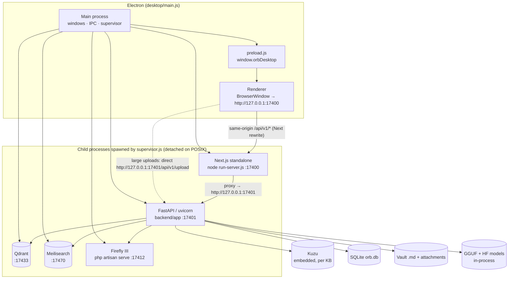
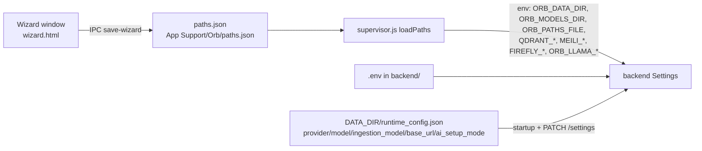

# System Architecture

**What this covers:** the whole Orb system at one level above the code: the processes that run, the ports they bind, how data flows between them, where every kind of data lives, the per-knowledge-base isolation model, and the cross-cutting contracts every subsystem obeys. Each section points to the deep-dive document for that area.

**Related docs:** [Overview](01-overview.md) · [Repository layout](03-repository-layout.md) · [Desktop shell](04-desktop-shell.md) · [Backend core](06-backend-core-and-configuration.md) · [API reference](07-api-reference.md) · [Knowledge bases](08-knowledge-bases-and-vaults.md) · [Ingestion](10-ingestion-pipeline.md) · [Local models](12-local-models-and-inference.md) · [Graph](14-graph-storage-kuzu.md) · [Indexes](15-search-indexes-qdrant-meilisearch.md) · [Retrieval & chat](16-retrieval-and-chat.md) · [Finance](17-finance-firefly.md) · [Frontend](18-frontend-architecture.md) · [Data directory](22-data-directory-layout.md) · [Decisions](26-decisions-and-constraints.md)

---

## 1. One-paragraph model

Orb is a **local-first personal knowledge system** delivered as an Electron desktop app. The Electron main process is a **supervisor**: it spawns five local services and then loads the UI. Users write Markdown notes (plus images, audio, video, PDFs) into a **vault** on disk. Saving a note triggers an **ingestion pipeline** that enriches attachments with local vision/speech models, asks an LLM to extract entities and relationships, and writes the result into an embedded **Kuzu property graph**, a **Qdrant** vector store and a **Meilisearch** keyword index. **Chat** runs a multi-hop research loop across those three stores plus graph expansion and a cross-encoder reranker, then synthesises an answer with citations. All local models (chat, embedding, reranking, Florence-2, Whisper, Marlin) run **inside the API process**, one heavy model resident at a time. Everything is partitioned by **knowledge base (KB)**: each KB owns its own vault, graph, collections, index and Firefly III finance administration. SQLite holds only metadata.

---

## 2. Process topology



| Process | Binary / entry | Port (default) | Started by | Waits for | Log |
|---|---|---|---|---|---|
| Electron main | `desktop/main.js` | – | user | – | console |
| Qdrant | `DATA_DIR/bin/<platform>/qdrant` (downloaded v1.18.2) | 17433 | supervisor | `GET /` < 500 | stdio ignored |
| Meilisearch | `DATA_DIR/bin/<platform>/meilisearch` (v1.49.0) | 17470 | supervisor | `GET /health` | stdio ignored |
| Firefly III | portable PHP 8.5 `artisan serve` in `DATA_DIR/firefly/app` | 17412 | supervisor | `GET /` | `logs/firefly.log` |
| API | `python -m uvicorn app.main:app` | 17401 | supervisor (parallel with UI) | `GET /health` | `logs/backend.log` + component logs |
| UI | `node run-server.js` (packaged) or `npm run dev` (dev) | 17400 | supervisor (parallel with API) | `GET /` | `logs/frontend.log` |

Ports live in one place, `desktop/ports.js`, overridable with `ORB_UI_PORT`, `ORB_API_PORT`, `ORB_FIREFLY_PORT`, `ORB_QDRANT_PORT`, `ORB_MEILI_PORT` (legacy `LIVEOS_*` names accepted). The 174xx block was chosen to avoid colliding with typical 8000/3000/6333/7700 developer stacks.

Boot order in `Supervisor.startAll`: free stale listeners on the port block → wait 900 ms → Qdrant + Meilisearch (download binaries first if missing) → Firefly → API and UI in parallel → multimodal readiness check in the background (never blocks the first window). Details: [04-desktop-shell.md](04-desktop-shell.md).

There are **no model HTTP sidecars**. Florence, Whisper, Marlin, chat, embed and rerank all load in the uvicorn process. This is a locked decision ([26](26-decisions-and-constraints.md)).

---

## 3. Bootstrap and configuration layers



Precedence for paths: environment variable (`ORB_DATA_DIR` / `LIVEOS_DATA_DIR` / `DATA_DIR`) → `paths.json` → repo fallback (`<repo>/data`, `backend/models`). `paths.json` is deliberately tiny (`data_dir`, `models_dir`, optional `default_vault_path`, `ai_setup_mode`) and is written atomically. `runtime_config.json` only ever holds the five mutable keys in `runtime_config.MUTABLE_KEYS`; API keys stay in `.env`. Full tables: [21-configuration-reference.md](21-configuration-reference.md).

---

## 4. Storage map

| Data | Store | Location | Source of truth? |
|---|---|---|---|
| Note bodies | Markdown files | `<vault>/<rel_path>.md` | **Yes** — never stored in SQLite |
| Attachments (images, audio, video, PDFs, docs) | Files | `<vault>/attachments/…` served at `/vault-files/<kb>/…` | Yes |
| Note metadata (id, title, rel_path, timestamps, processing flags, kb_id) | SQLite `notes` | `DATA_DIR/orb.db` | Derived from vault + pipeline (reconciled by `vault_sync`) |
| Knowledge base registry | SQLite `knowledge_bases` (+ in-memory cache) | `DATA_DIR/orb.db` | Yes |
| Chat conversations / messages | SQLite `chat_conversations`, `chat_messages` | `DATA_DIR/orb.db` | Yes |
| Wikilink edges | SQLite `note_links` | `DATA_DIR/orb.db` | Derived from note markdown (`rebuild_kb_note_links`) |
| Entity graph (nodes of kind note / indexable / community / temporal_digest, semantic rels, note references, 3D positions) | Kuzu | `DATA_DIR/kuzu/<kb>/…` | Yes for structure |
| Entity / relationship / context embeddings + text payloads | Qdrant, 3 collections per KB | `DATA_DIR/qdrant/` | **Yes for vectors and descriptive text** (Kuzu stores names/types/weights; long text lives in Qdrant payloads) |
| Keyword index of nodes | Meilisearch, 1 index per KB | `DATA_DIR/meilisearch/` | Derived |
| Finance | Firefly III SQLite | `DATA_DIR/firefly/app/storage/database/firefly.sqlite` | Yes (per-KB administration) |
| Models | GGUF files + HF snapshots + manifest | `MODELS_DIR/gguf/…`, `MODELS_DIR/<model>/` | – |
| Logs | Rotating files | `DATA_DIR/logs/*.log` | – |

Full tree: [22-data-directory-layout.md](22-data-directory-layout.md).

---

## 5. Knowledge-base isolation

Every request that touches user data carries `?kb=<slug>` (default `default`). `app.api.deps.get_kb` resolves it through `kb_registry` into a `KBContext`, a bundle of per-KB service instances:

```
KBContext
├── kb_id, name, vault_path
├── qdrant: QdrantService           collections: <slug>_node_cores, <slug>_node_relationships, <slug>_node_isolated_contexts
├── meili:  MeilisearchService      index: <slug>_nodes
├── graph:  GraphService (lazy)      Kuzu db at knowledge_bases.kuzu_path
├── retrieval_service (lazy)        RetrievalService(graph, qdrant, meili)
├── ingestion_workflow (lazy)       IngestionWorkflow(graph, qdrant, meili)
└── chat_workflow (lazy)            ChatWorkflow(retrieval)
```

The default KB uses the un-prefixed collection names from `Settings` (`node_cores`, …, `orb_nodes`) and `DATA_DIR/kuzu/kuzu_graph` for backward compatibility; every other KB uses `<slug>_…` and `DATA_DIR/kuzu/<slug>/kuzu_graph`.

A KB is addressed three different ways, and each layer uses a different one:

| Identifier | Used by |
|---|---|
| `id` (UUID, or the literal `default`) | SQLite `kb_id` columns, `/vault-files/<id>/…` URLs embedded in markdown, `DELETE`/`PATCH /api/v1/kb/{kb_id}`, `/kb/{kb_id}/llm`, `/kb/{kb_id}/finance` |
| `slug` (`[a-z0-9_-]`, immutable, derived from the name at creation) | vault dir, Kuzu dir, Qdrant collection and Meili index names, the value the frontend stores and sends as `?kb=` |
| `name` (display, renamable) | UI labels; also accepted by `?kb=` |

`get_kb` resolves `?kb=` by name **or** slug (never by id) and 404s otherwise. `POST /api/v1/kb` returns no slug, so clients re-list after creating. Finance scoping is a separate Firefly "administration" (user group) per KB, recorded in `knowledge_bases.firefly_group_id`. Deleting a KB tears down vault dir, Kuzu dir, the three Qdrant collections, the Meili index and (optionally) the Firefly administration. Details: [08-knowledge-bases-and-vaults.md](08-knowledge-bases-and-vaults.md).

The frontend keeps the active KB in `localStorage["orb_current_kb"]` and appends `kb` to every call via `withKb` / `kbQuery` in `frontend/src/lib/api.ts`.

---

## 6. The write path: note → graph

```mermaid
sequenceDiagram
  participant UI as Notes UI
  participant API as api/notes.py
  participant V as vault / note_files
  participant AG as LangGraph ingestion_agent
  participant MM as multimedia + multimodal_runtime
  participant LLM as LLMService (ingestion client)
  participant IW as IngestionWorkflow
  participant KZ as Kuzu
  participant QD as Qdrant
  participant ME as Meilisearch
  participant TR as ingestion_tracker

  UI->>API: POST /notes or PUT /notes/{id} (?kb=)
  API->>V: write <vault>/<rel_path>.md (title ↔ filename sync), update SQLite row
  API->>API: rebuild note_links for this note
  API-->>UI: note (processing_stage = "Queued for ingestion")
  API->>AG: BackgroundTask: run agent(note_id)
  AG->>MM: multimodal node — discover [📎]/[🎤]/ → PDF/Florence/Whisper/Marlin → append enrichment blocks to the .md
  AG->>LLM: extraction node — nodes + relationships (Extraction schema, JSON-repair tolerant)
  AG->>IW: storage node — resolve entities by exact normalised name (Qdrant node_cores → Kuzu fallback), merge, write; prior data is never deleted on re-ingest
  IW->>QD: upsert cores / relationships / isolated contexts (embeddings via in-process GGUF)
  IW->>KZ: MERGE Node(kind=note|indexable), REFERENCES, SEMANTIC_REL(edge_weight, mention_count, ingested_at)
  IW->>ME: add documents (name, type, contexts, rel text)
  AG->>AG: summarization node — mark processed, stage = done
  IW->>TR: note finished → idle timer (120 s) → community recompute ("Leiden" = sklearn agglomerative) + 3D layout, temporal digests — both feature-flagged, off by default
```

Concurrency: `INGESTION_PIPELINE_CONCURRENCY` (default 1) makes full-note ingestion FIFO; `MULTIMEDIA_CONCURRENCY` (default 1) serialises heavy model jobs within a note; graph/Qdrant writes are batched and offloaded with `asyncio.to_thread`. Stage strings are written to `notes.processing_stage` and polled by the UI through `GET /notes/{id}/status`. Details: [10-ingestion-pipeline.md](10-ingestion-pipeline.md), [11-multimedia-enrichment.md](11-multimedia-enrichment.md).

External edits to vault files (e.g. via Obsidian or cloud sync) are noticed by `vault_watcher`, which refreshes metadata and marks the note stale but **never auto-ingests**.

---

## 7. The read path: question → answer

```mermaid
flowchart TD
  Q[POST /chat/async ?kb=] --> J[job registry + _chat_job_lock<br/>stages: Queued → … → Complete/Failed]
  J --> H[chat_store: load conversation history<br/>trim to CHAT_HISTORY_MAX_MESSAGES]
  H --> L[RetrievalService.retrieve_with_iterative_loop<br/>≤ MAX_LOOP_ITERATIONS = 3]
  subgraph iter["each iteration: hybrid_search"]
    E[Entity lookup<br/>Kuzu name match] 
    K[Keyword<br/>Meilisearch]
    V[Vector<br/>Qdrant cores/rels/contexts<br/>≥ VECTOR_PRE_RERANK_THRESHOLD]
    G[Graph expansion<br/>top GRAPH_EXPAND_TOP_NEIGHBORS neighbours]
    E & K & V --> M[name-level dedup<br/>precedence entity › keyword › vector<br/>no numeric score fusion]
    M --> R[Cross-encoder rerank GGUF<br/>RERANKER_TOP_K · RERANKER_SCORE_THRESHOLD<br/>top 6 kept as context]
    R --> G[Graph expansion of survivors<br/>shown to the LLM, not cited]
  end
  L --> iter --> N{FINDING answers the question /<br/>no new query / iterations exhausted?}
  N -- no --> L
  N -- yes --> S[ChatWorkflow: dedupe, truncate context,<br/>answer with "### References" block]
  S --> P[persist assistant message + thinking]
  P --> O[GET /chat/status/{request_id} → done, answer, sources]
```

Points that surprise people (all detailed in [16](16-retrieval-and-chat.md)): the cross-encoder is the **only** ranking signal, so a disabled or missing reranker GGUF yields empty results rather than a degraded fallback; `MAX_LOOP_ITERATIONS=3` means at most two actual retrievals per turn because iteration one only plans the query; all evidence text comes from Qdrant payloads, Kuzu supplies structure and note provenance; citations are emitted as a literal `### References` list of `/notes/<id>` links that the frontend parses with a regex; temporal filters (`date_filter`, `period_filter`) are produced by the query-analysis LLM call, not by date parsing.

Model residency during one chat on a fully local setup: embed GGUF (query vectors) → rerank GGUF → chat GGUF, repeated per iteration. Each swap unloads the previous model (exclusive residency). Details: [16-retrieval-and-chat.md](16-retrieval-and-chat.md), [12-local-models-and-inference.md](12-local-models-and-inference.md).

---

## 8. Model layer

| Role | Implementation | Default model | Loader |
|---|---|---|---|
| Chat + ingestion extraction | llama-cpp-python GGUF (Metal / CUDA / Vulkan / CPU) | Gemma 4 E4B (catalogue in `model_catalog.py`) | `local_models.py` |
| Embeddings | llama-cpp-python GGUF, `EMBEDDING_DIMENSIONS` = 1024 | Qwen3-Embedding-0.6B | `local_models.py` via `embedding.py` |
| Reranker | llama-cpp-python GGUF cross-encoder (yes/no logits) | Qwen3-Reranker-0.6B | `local_models.py` via `reranker.py` |
| Image captioning / OCR | transformers Florence-2-large | `microsoft/Florence-2-large` | `multimodal_runtime.py` |
| Speech-to-text | transformers Whisper | `openai/whisper-large-v3-turbo` | `multimodal_runtime.py` |
| Video understanding | transformers (Qwen3.5 backbone) Marlin-2B | `lunahr/Marlin-2B-ungated` | `multimodal_runtime.py` |
| Cloud alternatives | OpenAI / Gemini / Anthropic / HuggingFace / any OpenAI-compatible `LLM_BASE_URL` | – | `llm.py` |

Three independent provider axes: chat (`LLM_PROVIDER` + `CHAT_MODEL`), ingestion (`INGESTION_PROVIDER` + `INGESTION_MODEL`, defaulting to chat), embeddings (`EMBEDDING_PROVIDER` + `EMBEDDING_MODEL`). `AI_SETUP_MODE` (`none | local | cloud`) gates chat/ingest in the UI and API (`ai_gate.ai_is_configured`). In the current working tree a KB can additionally **pin its own chat/ingestion provider and model** (`knowledge_bases.llm_provider/llm_model/llm_ingestion_model`, `GET/PATCH /api/v1/kb/{id}/llm`); embeddings and reranking stay system-wide because Qdrant vector dimensions are shared. A KB can also have finance switched off entirely (`knowledge_bases.finance_enabled`, `PATCH /api/v1/kb/{id}/finance`), which gates every `/api/v1/finance` route and the finance chat path without deleting the KB's Firefly administration. Long notes are split for extraction by `workflows/extraction_chunking.py` so the JSON output never overflows the context window. Chat GGUF defaults that are locked by experience on Metal: `n_ctx=16384`, `swa_full=true`, `repeat_penalty=1.12`; see [26](26-decisions-and-constraints.md).

Embedding dimensions must match Qdrant collections; `sync_embedding_infrastructure` runs at startup, and a mismatch **mid-ingest raises** rather than silently recreating collections.

---

## 9. Frontend ↔ backend contract

- The UI is a Next.js 16 app-router SPA, dark-only, with `KBProvider` and `ChatProvider` at the root.
- All calls go through `frontend/src/lib/api.ts` (axios). In packaged mode `NEXT_PUBLIC_API_URL=/api/v1` and Next rewrites proxy to `http://127.0.0.1:17401`; in `next dev` the absolute API URL is used.
- **Uploads bypass the Next proxy**: `resolveApiBaseUrl` asks the Electron bridge for the direct API URL so multi-hundred-MB media are not truncated (Next's default 10 MB proxy limit was the original bug; `proxyClientMaxBodySize: "512mb"` is the belt-and-braces setting).
- Long-running work is **polled**, not streamed: chat (`/chat/status/{request_id}`), note ingestion (`/notes/{id}/status`), model downloads and multimodal readiness (`/setup/*`), maintenance (`/admin/maintenance-status`).
- Response shapes are hand-typed in `frontend/src/lib/types.ts`; there is no OpenAPI codegen.
- Vault media URLs are `/vault-files/<kb>/<rel_path>`; the editor rewrites them for display and the backend enforces `safe_vault_join` on the way back.
- The Electron bridge `window.orbDesktop` exposes only: `pickDirectory`, `getApiBaseUrl`, `revealInFolder` (allow-listed roots), `getDefaultPaths`, `getAppInfo`, `saveWizard` (wizard window only), `wizardDone`, `onStatus`.

Details: [18-frontend-architecture.md](18-frontend-architecture.md), [07-api-reference.md](07-api-reference.md).

---

## 10. Cross-cutting contracts

1. **`?kb=` everywhere.** Any new endpoint touching notes, graph, indexes, chat or finance must take `kb: KBContext = Depends(get_kb)` and use only that context's services.
2. **Note body lives in the vault file.** `notes.content` is a deprecated fallback; write bodies with `persist_note_body`, read with `note_body`.
3. **Title ↔ filename sync.** Renaming a note renames the `.md`; renaming the file retitles the note; wikilinks resolve by title and by path (Obsidian-compatible).
4. **Attachments are vault files.** Never treat a `/vault-files/...` path as a temp file to delete after processing.
5. **One heavy model at a time.** Any new inference code must go through the residency manager in `local_models.py` / `multimodal_runtime.py`, never spawn a model HTTP server.
6. **Qdrant is fail-closed for cores/contexts.** Do not add code that drops or recreates collections on dimension mismatch during ingestion.
7. **Enrichment blocks are idempotent.** Ingestion strips previous enrichment blocks before appending new ones so transcripts are not duplicated on re-ingest.
8. **Finance requests are scoped to the KB's Firefly administration.** No list endpoint may return rows from another administration.
9. **Trace IDs.** Every request gets `X-Request-Id` (incoming or generated) via a ContextVar; log lines from the same request can be correlated.
10. **Community detection is idle-triggered and optional.** New ingestions pre-empt a running recompute; do not call it synchronously from a request. It is disabled unless `COMMUNITY_DETECTION_ENABLED=true`.
11. **Secrets never enter `runtime_config.json`**; only `provider`, `model`, `ingestion_model`, `base_url`, `ai_setup_mode`.
12. **Legacy aliases are accepted, never emitted.** `LIVEOS_*`, `TYPESENSE_*`, `lifeos_current_kb`, `window.liveosDesktop` exist only to read old installs.

---

## 11. Deployment modes

| Mode | Who | How | Notes |
|---|---|---|---|
| Packaged desktop (product) | end users | `.dmg` / `.exe` / `.AppImage` from `desktop-v*` tags | bundles Python, Node, Next standalone, Firefly seed; downloads Qdrant/Meili/PHP/models on first run |
| Dev desktop | contributors | `cd desktop && npm start` | repo `backend/.venv` + `next dev`; same supervisor and ports |
| Packaged-layout test | contributors | `npm run prepare-dist && ORB_RESOURCES=./resources npm start` | exercises bundled runtimes without an installer |
| Bare API | contributors / benchmarks | `uvicorn app.main:app` with `.env` | ports 8000 / 3700; benchmark harness assumes `http://localhost:8000` |
| Docker compose | contributors only | `docker compose up -d` | Postgres + Qdrant + Meili + API + UI; not the product path; no model sidecars |

Details: [05-packaging-build-and-release.md](05-packaging-build-and-release.md), [27-development-guide.md](27-development-guide.md).
