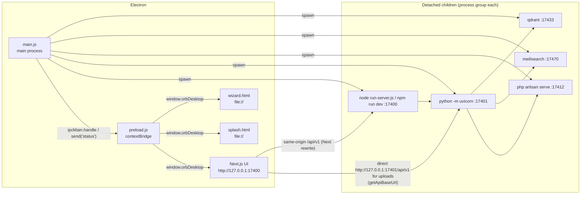

# Desktop Shell (Electron)

**What this covers.** The Electron application under `desktop/` that end users launch: the main-process supervisor that downloads and spawns Qdrant, Meilisearch, the embedded Firefly III PHP runtime, the FastAPI backend and the Next.js frontend; the preload bridge and IPC surface; the wizard → splash → main window lifecycle; the path-resolution contract shared with the backend (`paths.json`, Application Support root, `ORB_RESOURCES`); the first-run binary and PHP/Firefly bootstrap; port allocation; log files; shutdown and orphan cleanup; and every `ORB_*` / `LIVEOS_*` environment variable the shell reads or injects. It does **not** cover how the installer is produced (see packaging doc) or the finance API semantics on top of Firefly (see finance doc).

**Related docs:** [Overview](01-overview.md) · [System architecture](02-system-architecture.md) · [Repository layout](03-repository-layout.md) · [Packaging, build and release](05-packaging-build-and-release.md) · [Backend core and configuration](06-backend-core-and-configuration.md) · [Finance / Firefly](17-finance-firefly.md) · [Frontend architecture](18-frontend-architecture.md) · [Configuration reference](21-configuration-reference.md) · [Data directory layout](22-data-directory-layout.md) · [Logging and observability](23-logging-and-observability.md) · [Decisions and constraints](26-decisions-and-constraints.md)

---

## 1. Responsibilities and boundaries

The shell **owns**:

- First-run setup UI (`wizard.html`) and the bootstrap file it produces (`paths.json`).
- Locating runtimes: bundled CPython, bundled Node, repo `.venv`, system Python/Node (`paths.js`).
- Downloading third-party executables into the user's data dir on first launch: Qdrant, Meilisearch (`download-binaries.js`), the NativePHP static PHP binary and the Firefly III release tarball (`firefly-runtime.js`).
- Spawning, health-checking, logging and stopping the five child services (`supervisor.js`).
- The fixed local port block (`ports.js`) and the env-var contract each child sees.
- The Meilisearch master key and the Firefly `.env` / `runtime.json` secrets.
- Browser-window security: `contextIsolation`, `sandbox`, no `nodeIntegration`, navigation lockdown, IPC sender guards.
- Optional auto-update check (opt-in only).

The shell does **not** own:

- Any application logic. It never talks to the API except for HTTP health polling (`waitHttp`).
- GGUF / Florence / Whisper / Marlin model downloads. Those are driven by the backend's `/api/v1/setup/*` routes from the UI's Setup page. The shell only checks whether the Florence/Whisper directories exist to decide whether to pre-warm multimodal deps.
- Reading or writing `runtime_config.json` beyond merging the single `ai_setup_mode` key at wizard time.
- The `frontend/` build. `desktop/scripts/build-frontend.js` invokes `next build`, but that is packaging-time (see packaging doc).

Everything user-owned (SQLite, vaults, indexes, downloaded binaries, PHP, Firefly app + DB, logs, GGUFs) lives under `DATA_DIR` / `MODELS_DIR`, never inside the app bundle.

---

## 2. Files

| Path | Purpose | Key exports / entry points |
|---|---|---|
| `desktop/main.js` | Electron main process: windows, IPC handlers, navigation lockdown, boot sequence, quit handling, auto-updater gate | (entry, no exports) |
| `desktop/preload.js` | `contextBridge` exposing `window.orbDesktop` to every window | `orbDesktop` bridge object |
| `desktop/supervisor.js` | `Supervisor` class: spawns/awaits/stops children; `paths.json` load/needs-wizard; port sweep; Meili key | `Supervisor`, `loadPaths`, `needsWizard`, `defaultPathsFile` |
| `desktop/paths.js` | Dev vs packaged path contract; runtime binary discovery; Application Support root | `isPackaged`, `isPackagedLayout`, `getResourcesRoot`, `getRepoRoot`, `getAppRoot`, `getBackendDir`, `getFrontendDir`, `getPythonBinary`, `getNodeBinary`, `appSupportRoot`, `defaultDataDir`, `defaultModelsDir`, `useProductionFrontend`, `envFirst` |
| `desktop/ports.js` | Port block + URL helpers | `PORTS`, `localhost`, `uiUrl`, `apiUrl`, `apiV1Url`, `fireflyUrl`, `qdrantUrl`, `meiliHealthUrl`, `corsOrigins` |
| `desktop/download-binaries.js` | Qdrant + Meilisearch fetch/extract/cache into `DATA_DIR/bin/<triple>/` | `ensureBinaries`, `platformTriple`, `nativeArch`, `QDRANT_VERSION`, `MEILI_VERSION` |
| `desktop/firefly-runtime.js` | PHP runtime + Firefly app seeding, `.env`, migrations, Passport bootstrap, `runtime.json` | `ensureFireflyRuntime`, `ensurePhpRuntime`, `ensureFireflyApp`, `fireflyDataRoot`, `fireflyAppDir`, `fireflyRuntimeFile`, `phpBinaryPath`, `FIREFLY_VERSION`, `PHP_BIN_VERSION`, `fireflyUrl` |
| `desktop/splash.html` | Boot progress window (status line from `status` IPC channel) | — |
| `desktop/wizard.html` | First-run setup form (vault / data / models / AI mode) | — |
| `desktop/assets/logo.png`, `desktop/build/icon.png` | Window icon candidates (`appIconPath()` prefers `build/icon.png`) | — |
| `desktop/package.json` | `"main": "main.js"`, `productName: "Orb"`, version `0.2.0`, electron `43.2.0`, `electron-updater` runtime dep | — |
| `desktop/binaries/README.md` | Human notes on binary versions and llama-cpp env knobs (no code) | — |
| `backend/app/core/paths.py` | Backend side of the `paths.json` contract (same App Support fallback list) | `paths_json_location`, `load_paths_file`, `save_paths_file`, `resolve_data_dir`, `resolve_models_dir`, `resolve_default_vault_path` |
| `frontend/src/lib/desktop.ts` | Typed consumer of the preload bridge (`getDesktopBridge`, `isDesktopApp`, `resolveApiBaseUrl`, `revealInFolder`) | — |
| `frontend/next.config.ts` | `output: "standalone"`, rewrites `/api/v1`, `/vault-files`, `/health` → `API_PROXY_TARGET` | — |

All six JS modules are plain CommonJS; there is no bundler or transpile step for the shell.

---

## 3. Process model



### 3.1 Renderer hardening

Every `BrowserWindow` is created with `shellWebPreferences()`:

```js
{ preload: PRELOAD, contextIsolation: true, nodeIntegration: false, sandbox: true }
```

There is exactly one preload for all three window kinds (wizard, splash, main). Renderers have no Node access; the only capability surface is the `orbDesktop` object below.

### 3.2 Navigation lockdown (`app.on("web-contents-created")`)

Registered at module load, so it applies to every WebContents including the very first window:

- `setWindowOpenHandler` — every `window.open` / `target=_blank` is **denied** in-app and forwarded to `openExternally(url)`.
- `will-navigate` — if `!isTrustedShellUrl(url)`, the navigation is prevented and forwarded to `openExternally(url)`.

`isTrustedShellUrl(rawUrl)`:
- `file:` URLs are trusted only when `url.pathname.startsWith(__dirname)` (i.e. pages inside the `desktop/` folder or the packaged `app.asar`).
- Any other URL is trusted only if its `origin` equals `new URL(APP_URL).origin` (default `http://127.0.0.1:17400`).
- Unparseable → untrusted.

`openExternally(rawUrl)` only hands `http:`, `https:` and `mailto:` to `shell.openExternal`; anything else (e.g. `javascript:`, `file:`) is silently dropped.

Rationale (comment in code): the main window renders user note content, so an injected link must never be able to navigate the Electron window to an arbitrary origin.

> Gotcha: on Windows, `url.pathname` for `file:///C:/…` is `/C:/…` while `__dirname` is `C:\…`, so the file-scheme trust check can never be true there. This only matters for `will-navigate` from a shell page to another `file:` page, which no shell page does; initial `loadFile` calls are not subject to `will-navigate`.

---

## 4. Preload bridge and IPC surface

`preload.js` exposes `window.orbDesktop` (the frontend also accepts the legacy `window.liveosDesktop` name in `frontend/src/lib/desktop.ts`, but the preload only defines `orbDesktop`).

| Bridge method | IPC channel | Kind | Payload → result | Main-process guard |
|---|---|---|---|---|
| `isDesktop` | — | constant `true` | — | — |
| `onStatus(cb)` | `status` (main → renderer) | `webContents.send` | `cb(message: string)` | Only ever sent to `splashWindow` (`sendStatus`) |
| `pickDirectory(opts)` | `pick-directory` | `invoke` | `{title?, buttonLabel?, defaultPath?}` → `string \| null` | None. Opens a native `openDirectory`+`createDirectory` dialog parented to the sender's window (falls back to focused window). Parent is required on macOS or the sheet opens behind and "Browse does nothing". |
| `getApiBaseUrl()` | `get-api-base-url` | `invoke` | → `apiV1Url()` e.g. `http://127.0.0.1:17401/api/v1` | None |
| `revealInFolder(path)` | `reveal-in-folder` | `invoke` | `string` → `{ok: boolean, error?: string}` | `assertAbsolutePath` + allowlist (below) + must exist |
| `getDefaultPaths()` | `get-default-paths` | `invoke` | → `{data_dir, models_dir}` from `defaultDataDir()` / `defaultModelsDir()` | None |
| `getAppInfo()` | `get-app-info` | `invoke` | → `{version: pkg.version, packaged: isPackaged()}` | None |
| `saveWizard(payload)` | `save-wizard` | `invoke` | see §4.2 → `{ok: true, pathsFile}` or throws | `isWizardSender(event)` |
| `wizardDone()` | `wizard-done` | `send` (fire-and-forget) | none | `isWizardSender(event)` in the one-shot listener |

### 4.1 Guards

**`isWizardSender(event)`** — true only when all hold: a live `wizardWindow` exists, `event.sender === wizardWindow.webContents`, and `event.senderFrame.url` starts with `file:` and ends with `wizard.html`. Any renderer showing note content therefore cannot call `save-wizard` or `wizard-done`. The `save-wizard` error text: `"save-wizard is only available to the setup wizard"`. Code comment: repointing the data dir from an untrusted page "leads to executing binaries from arbitrary folders" (because `DATA_DIR/bin/<triple>/qdrant` is executed on next boot).

**`assertAbsolutePath(label, value)`** — requires a non-empty string, no NUL bytes, `path.isAbsolute`, returns `path.resolve(trimmed)`. Errors: `"<label> is required"`, `"<label> is invalid"`, `"<label> must be an absolute path"`.

**`pathUnderRoot(candidate, root)`** — `resolved === base || resolved.startsWith(base + path.sep)`.

**`reveal-in-folder` allowlist** — the resolved path must be under one of: `loadPaths(getAppRoot()).dataDir`, `.modelsDir`, `.defaultVault`, `defaultDataDir()`, `defaultModelsDir()`. `loadPaths` is re-read on every call (so a freshly saved `paths.json` is honoured). Non-allowlisted → `{ok:false, error:"Path is outside Orb data / vault / models"}`; missing → `"Path does not exist"`. On success `shell.showItemInFolder(resolved)`.

> Note: vault paths for non-default knowledge bases are **not** in the allowlist. `revealInFolder` from the UI for a file in a second KB's vault will return `ok:false` unless that vault happens to live under the data dir.

### 4.2 `save-wizard` payload and side effects

Input (validated):

```json
{ "data_dir": "<abs>", "models_dir": "<abs>", "default_vault_path": "<abs, optional>", "ai_setup_mode": "none|local|cloud" }
```

- `ai_setup_mode` defaults to `"none"`; anything outside `AI_SETUP_MODES = {none, local, cloud}` throws `"ai_setup_mode must be none, local, or cloud"`. (The backend additionally accepts `"hybrid"`; the wizard never produces it.)
- Writes `paths.json` to **`defaultPathsFile()`** (`appSupportRoot()/paths.json`) — *not* to `ORB_PATHS_FILE` even if that override is set (see §14 discrepancies). Write is atomic: `paths.json.tmp` then `renameSync`. Rationale in code: a truncated `paths.json` used to boot with default dirs and look like total data loss.
- Sets `process.env.AI_SETUP_MODE = aiMode` in the main process so the backend child inherits it in the same session.
- `mkdir -p` data dir, models dir, vault (if given).
- Merges `{"ai_setup_mode": aiMode}` into `DATA_DIR/runtime_config.json` (creating it if absent, tolerating a corrupt one). Failures here only `console.warn`.

Returns `{ok: true, pathsFile}`.

---

## 5. Window lifecycle

```mermaid
stateDiagram-v2
  [*] --> whenReady
  whenReady --> Wizard : needsWizard(pathsFile) && !ORB_SKIP_WIZARD
  whenReady --> Splash : otherwise
  Wizard --> Splash : 'wizard-done' from isWizardSender
  Splash --> Main : supervisor.startAll() resolved
  Splash --> ErrorDialog : startAll() threw
  ErrorDialog --> [*] : stopAll(); app.quit()
  Main --> Main : 'activate' with 0 windows → createMainWindow(resolveBootPath())
  Main --> [*] : window-all-closed (non-macOS) → app.quit()
  Main --> Quitting : before-quit
  Quitting --> [*] : stopAllAsync().finally(app.exit(0))
```



| Window | Size | Loads | Notes |
|---|---|---|---|
| Wizard (`createWizard`) | 680×820, min 560×640, title "Orb Setup" | `file://…/wizard.html` | Tracked in `wizardWindow`; cleared on `closed`. Closed programmatically after `wizard-done`. |
| Splash (`createSplash`) | 480×360, non-resizable, `show:false` until `ready-to-show` | `file://…/splash.html` | Receives `status` messages. Closed when `bootStack` resolves. Body is `-webkit-app-region: drag`. |
| Main (`createMainWindow(initialPath)`) | 1400×900, title "Orb" | `APP_URL` (+ `initialPath` if not `/`) | `APP_URL = ORB_URL || LIVEOS_URL || uiUrl()`. Trailing slash stripped before joining. |

All windows use `backgroundColor: "#0a0a0f"` and the first existing icon from `build/icon.png` → `assets/logo.png`.

`app.setName("Orb")` is called before ready so the macOS menu / "Quit Orb" label isn't the package name. On Windows `app.setAppUserModelId("com.orb.app")` matches `build.appId`.

### 5.1 `window-all-closed`

Only quits on non-macOS. On macOS the services keep running so a Dock re-open is instant; the comment notes that stopping them here "left the app pointing at dead ports until a full relaunch". `activate` re-creates the main window if none exist.

### 5.2 `before-quit`

```js
if (quitting || !supervisor) return;
quitting = true;
event.preventDefault();
Promise.resolve(supervisor.stopAllAsync?.() ?? supervisor.stopAll()).finally(() => app.exit(0));
```

The first `before-quit` is cancelled, children are stopped asynchronously (SIGTERM, 1.5 s grace, SIGKILL, port sweep — §8.6), then `app.exit(0)` terminates without re-firing `before-quit` (`quitting` flag). Rationale: the earlier synchronous `stopAll()` scheduled SIGKILL on a timer that never fired once Electron exited, leaving orphans that only died at the next launch's port sweep.

### 5.3 Boot failure

If `bootStack` throws, the error message is pushed to the splash, logged, and a modal `dialog.showMessageBox` titled "Orb failed to start" is shown with `detail = "<message>\n\nLogs: ~/Library/Application Support/Orb/data/logs/"` and a single "Quit" button; then `supervisor.stopAll()` and `app.quit()`. The log path in the dialog is hard-coded to the macOS default and does not reflect `paths.json` or the platform.

---

## 6. Boot sequence

```mermaid
sequenceDiagram
  participant E as main.js
  participant W as wizard.html
  participant S as splash.html
  participant SV as Supervisor
  participant DL as download-binaries
  participant FR as firefly-runtime
  participant Q as qdrant
  participant M as meilisearch
  participant F as php artisan serve
  participant B as uvicorn
  participant N as next server

  E->>E: app.whenReady()
  E->>E: pathsFile = ORB_PATHS_FILE || appSupportRoot()/paths.json
  alt needsWizard(pathsFile) && !ORB_SKIP_WIZARD
    E->>W: createWizard()
    W->>E: invoke get-default-paths / pick-directory
    W->>E: invoke save-wizard(payload)  [isWizardSender]
    E->>E: write paths.json (atomic), mkdirs, runtime_config.json.ai_setup_mode, process.env.AI_SETUP_MODE
    W->>E: send wizard-done  [isWizardSender]
    E->>W: close()
  end
  E->>S: createSplash()
  E->>SV: new Supervisor(getAppRoot(), sendStatus); startAll()
  SV->>SV: freeDesktopPorts() — kill listeners on 17400/17401/17412/17433/17470
  SV->>SV: sleep 900 ms
  SV->>DL: ensureBinaries(dataDir)
  DL-->>SV: {qdrant, meilisearch, binDir}
  SV->>Q: spawn (QDRANT__STORAGE__STORAGE_PATH, QDRANT__SERVICE__HTTP_PORT)
  SV->>Q: waitHttp(http://127.0.0.1:17433/, 60s) — non-fatal on timeout
  SV->>M: spawn --db-path --http-addr --master-key
  SV->>M: waitHttp(/health, 60s) — non-fatal on timeout
  SV->>FR: ensureFireflyRuntime(dataDir)
  FR->>FR: ensurePhpRuntime → ensureFireflyApp → layout → runtime.json → .env → migrate → db:seed → passport → user/token
  SV->>F: spawn php artisan serve :17412
  SV->>F: waitHttp(http://127.0.0.1:17412, 120s, child, firefly.log) — fatal
  par API and UI in parallel
    SV->>B: spawn python -m uvicorn app.main:app --port 17401
    SV->>B: waitHttp(/health, 120s, child, backend.log) — fatal
  and
    SV->>N: spawn node run-server.js (or npm run dev)
    SV->>N: waitHttp(http://127.0.0.1:17400, 120s, child, frontend.log) — fatal
  end
  SV-)SV: startMultimodalServices() — fire-and-forget
  SV->>S: status "Ready"
  E->>S: close()
  E->>E: createMainWindow(resolveBootPath())
  E->>E: setupAutoUpdater()
```

Order is significant: search engines first (the API's lifespan connects to them), Firefly before the API (the API reads `runtime.json` at startup for the token), then API and UI in parallel ("biggest cold-start win after binaries are ready"), and multimodal preparation never blocks the first window.

### 6.1 `needsWizard(pathsFile)`

Returns `true` when the file does not exist **or** does not parse as JSON. A corrupt file (truncated write, cloud-sync conflict copy) deliberately re-opens setup so the user re-picks their real dirs instead of silently booting with defaults. `ORB_SKIP_WIZARD=1` / `LIVEOS_SKIP_WIZARD=1` bypasses the wizard even when it would be needed.

### 6.2 `resolveBootPath()`

Decides the initial route of the main window:

1. Read `ORB_PATHS_FILE || LIVEOS_PATHS_FILE || defaultPathsFile()`; missing → `/`.
2. `mode = (paths.ai_setup_mode || process.env.AI_SETUP_MODE || "none").toLowerCase()`; not `"local"` → `/`.
3. `modelsDir = paths.models_dir || process.env.MODELS_DIR`; if `dirHasGguf(modelsDir)` is false → `/setup` (so the Setup page can auto-start GGUF downloads), else `/`.

`dirHasGguf(dir, depth)` recursively scans up to depth 4 for any file ending in `.gguf` (case-insensitive), swallowing stat errors. Any exception in `resolveBootPath` yields `/`.

### 6.3 `setupAutoUpdater()`

Runs only when `isPackaged()` **and** `ORB_ENABLE_UPDATER === "1"` (or `LIVEOS_ENABLE_UPDATER`). Then `electron-updater`'s `autoUpdater.autoDownload = false; autoUpdater.checkForUpdatesAndNotify()` with all errors swallowed. `require("electron-updater")` is inside a try so a missing module is harmless. Unsigned builds therefore never contact GitHub Releases unless explicitly opted in (comment references "Stage 6" signing).

---

## 7. Path resolution contract (`paths.js`)

### 7.1 Three layouts

| Layout | How detected | Backend dir | Frontend dir | Python | Node |
|---|---|---|---|---|---|
| **Dev** (`npm start` in `desktop/`) | no packaged runtime found | `<repo>/backend` | `<repo>/frontend` (`next dev`) | `backend/.venv/bin/python` (or `Scripts\python.exe`) if present, else `python3`/`python` on PATH | `node` on PATH (only used if `useProductionFrontend()`) |
| **Packaged-test** (`ORB_RESOURCES=./resources npm start`, or `desktop/resources/backend/python` exists) | `getResourcesRoot()` returns the resources dir and `hasPackagedRuntime` is true | `<resources>/backend` | `<resources>/frontend` (standalone `server.js`) | `<resources>/backend/python/bin/python3` (`python.exe` on Windows) | `<resources>/node/bin/node` (`node.exe`) |
| **Packaged** (installed app) | `app.isPackaged` → `process.resourcesPath` | `Contents/Resources/backend` | `Contents/Resources/frontend` | same as above | same as above |

Function-by-function:

- `envFirst(...names)` — first non-empty `process.env[name]`, else `undefined`. Used everywhere to accept `ORB_*` first and the legacy `LIVEOS_*` alias second.
- `isPackaged()` — `require("electron").app.isPackaged`; when `electron` cannot be required (scripts run under plain `node`) falls back to `ORB_PACKAGED === "1"` / `LIVEOS_PACKAGED`.
- `getResourcesRoot()` — packaged → `process.resourcesPath`; else `ORB_RESOURCES`/`LIVEOS_RESOURCES` (resolved); else `desktop/resources` if `desktop/resources/backend/python` exists; else `null`.
- `getRepoRoot()` — `ORB_ROOT`/`LIVEOS_ROOT` override; else first of `desktop/..`, `cwd/..`, `cwd` that contains both `frontend/` and `backend/`; else `desktop/..`.
- `hasPackagedRuntime(root)` — any of `backend/python/bin/python3`, `backend/python/bin/python`, `backend/python/python.exe` exists under `root`.
- `isPackagedLayout()` — `hasPackagedRuntime(getResourcesRoot())`.
- `getAppRoot()` — resources root when it has a packaged runtime, else repo root. This is the default `cwd` for spawned children that don't set their own.
- `getBackendDir()` — `<resources>/backend` if `<resources>/backend/app` exists, else `<repo>/backend`.
- `getFrontendDir()` — `<resources>/frontend` if `<resources>/frontend/server.js` exists, else `<repo>/frontend`.
- `getPythonBinary()` — `ORB_PYTHON`/`LIVEOS_PYTHON` → bundled (`<backendDir>/python/{python.exe | bin/python3 | bin/python | Scripts/python.exe}`) → repo `backend/.venv` → bare `python3` / `python`.
- `getNodeBinary()` — `ORB_NODE`/`LIVEOS_NODE` → `<resources>/node/{node.exe | bin/node}` → bare `node` / `node.exe`.
- `appSupportRoot()` — per-OS base plus `[Orb, LifeOS, LiveOS]` candidates; returns the first candidate that already contains `paths.json`, else `<base>/Orb`:
  - macOS `~/Library/Application Support/`
  - Windows `%APPDATA%` (fallback `~/AppData/Roaming`)
  - Linux `~/.config/`
- `defaultDataDir()` = `appSupportRoot()/data`; `defaultModelsDir()` = `appSupportRoot()/models`.
- `useProductionFrontend()` — `ORB_FRONTEND_DEV=1` → false; packaged layout → true; else true iff `<frontendDir>/server.js` exists.

> Gotcha (packaged app): `getRepoRoot()` with no override resolves `__dirname/..` = `Contents/Resources` (because `__dirname` is `Resources/app.asar`), and that directory **does** contain `frontend/` and `backend/` (from `extraResources`). So in a packaged app `getRepoRoot() === process.resourcesPath`. Nothing breaks — `loadPaths` ignores repo defaults when `isPackagedLayout()` is true and `resolveBinary`'s `<repo>/desktop/binaries/...` candidates simply don't exist — but don't assume `getRepoRoot()` points at a source checkout.

### 7.2 The backend mirror (`backend/app/core/paths.py`)

The backend re-implements the same lookup so both processes agree without the shell passing anything:

| Concern | Shell (`paths.js` / `supervisor.js`) | Backend (`paths.py`) |
|---|---|---|
| App Support root | `[Orb, LifeOS, LiveOS]`, first with `paths.json`, else `Orb` | `_default_app_support()` — identical list and rule |
| `paths.json` location | `ORB_PATHS_FILE`/`LIVEOS_PATHS_FILE` else `<root>/paths.json` | `paths_json_location()` — identical |
| Data dir precedence | `paths.json.data_dir` > packaged? `<root>/data` : `<repo>/data` | `ORB_DATA_DIR`/`LIVEOS_DATA_DIR`/`DATA_DIR` env > `paths.json.data_dir` > `<repo>/data` |
| Models dir precedence | `paths.json.models_dir` > packaged? `<root>/models` : `<repo>/backend/models` | env `ORB_MODELS_DIR`… > `paths.json.models_dir` > `<backend>/models` |
| Default vault | `paths.json.default_vault_path` only | `paths.json.default_vault_path` > `ORB_DEFAULT_VAULT` env |

Because the supervisor injects `ORB_DATA_DIR`, `ORB_MODELS_DIR` and `ORB_PATHS_FILE` into the backend (§8.3), the backend's env branch always wins under the desktop app; the `paths.json` branch is for running uvicorn by hand.

The backend also **writes** `paths.json` via `save_paths_file()` from `POST /api/v1/setup/paths` (Setup page in the UI). That writer preserves existing `default_vault_path` / `ai_setup_mode` when omitted, resolves paths with `expanduser().resolve()`, and is **not** atomic (plain `write_text`). The shell's writer is atomic. Both produce the same schema.

### 7.3 `paths.json` schema

Location: `appSupportRoot()/paths.json` (e.g. `~/Library/Application Support/Orb/paths.json`).

```json
{
  "data_dir": "/Users/me/Library/Application Support/Orb/data",
  "models_dir": "/Users/me/Library/Application Support/Orb/models",
  "default_vault_path": "/Users/me/Documents/Orb Vault",
  "ai_setup_mode": "none"
}
```

| Field | Type | Required | Written by | Read by |
|---|---|---|---|---|
| `data_dir` | absolute path string | yes | wizard, backend setup | `loadPaths`, `reveal-in-folder`, backend `resolve_data_dir` |
| `models_dir` | absolute path string | yes | wizard, backend setup | `loadPaths`, `resolveBootPath`, backend `resolve_models_dir` |
| `default_vault_path` | absolute path string | no | wizard (if chosen), backend setup | `loadPaths` (allowlist), backend `resolve_default_vault_path` |
| `ai_setup_mode` | `"none" \| "local" \| "cloud"` (backend also allows `"hybrid"`) | no | wizard, backend setup | `resolveBootPath`; backend `setup_status` |

`loadPaths()` tolerates a missing file (defaults) and logs `Unreadable paths file …` on parse errors (then uses defaults) — but `needsWizard` will have already forced the wizard in that case at startup.

### 7.4 `runtime_config.json` touch

The wizard merges one key into `DATA_DIR/runtime_config.json`:

```json
{ "ai_setup_mode": "local" }
```

The backend (`backend/app/core/runtime_config.py`) owns this file (keys `provider`, `model`, `ingestion_model`, `base_url`, `ai_setup_mode`) and applies `ai_setup_mode` onto `settings.AI_SETUP_MODE` at load. The shell never reads it.

---

## 8. Supervisor (`supervisor.js`)

### 8.1 Construction and shared helpers

`new Supervisor(appRoot, onStatus)` stores `appRoot`, `repoRoot = getRepoRoot()`, `onStatus` (defaults to no-op), `children = []`, `paths = loadPaths(appRoot)` → `{pathsFile, dataDir, modelsDir, defaultVault, appRoot}`.

**`_spawn(label, cmd, args, opts)`**
- Emits `Starting <label>…`.
- If `opts.logFile`: `mkdir -p` its dir, `openSync(logFile, "a")`, `stdio = ["ignore", fd, fd]`; the parent closes its copy of the fd immediately after spawn (the child owns a dup). Otherwise `stdio = opts.stdio || "ignore"`. Numeric fds are used because WriteStream objects are invalid with `detached` spawn.
- `spawn(cmd, args, { cwd: opts.cwd || appRoot, env: withNativeToolPath({...process.env, ...opts.env}), stdio, shell: opts.shell || false, detached: process.platform !== "win32" })`.
- `detached` puts each child in its own process group on POSIX so `process.kill(-pid, …)` can take out the whole tree (e.g. `npm` → `next`), and so a hard-killed Electron doesn't take the API down mid-write. The cost is orphans, which `freeDesktopPorts` handles at next launch.
- `error` → status `<label> error: <msg>`; non-zero `exit` → status `<label> exited (<code>[, <signal>])`.
- Pushes `{label, child, logFile}` to `children`.

**`withNativeToolPath(env)`** — prepends `/opt/homebrew/bin:/usr/local/bin` (macOS) or `/usr/local/bin:/usr/bin` (Linux) to `PATH`, de-duplicated, so `ffmpeg`/`ffprobe` resolve for Finder/Dock launches that get a minimal PATH. No-op on Windows.

**`serviceLogPath(dataDir, label)`** → `DATA_DIR/logs/<label lowercased, non-alnum runs → "-">.log`. Labels used: `backend`, `frontend`, `firefly` → `backend.log`, `frontend.log`, `firefly.log`. **Qdrant and Meilisearch are spawned with `stdio: "ignore"` and have no log file.** Logs are opened in append mode and never rotated by the shell.

**`tailLog(logPath, maxLines=24)`** — last 24 lines, used to enrich `waitHttp` errors (this is what ends up in the "Orb failed to start" dialog).

**`resolveBinary(repoRoot, dataDir, name)`** — fallback lookup when `ensureBinaries` fails; candidates in order: `DATA_DIR/bin/<triple>/<name>`, `<repo>/desktop/binaries/<triple>/<name>`, `DATA_DIR/bin/<name>`, `<repo>/desktop/binaries/<name>`; on Windows `.exe` variants of the first two are checked first.

### 8.2 `waitHttp(url, timeoutMs=120000, child=null, logPath=null)`

Polls `http.get(url, {timeout: 2000})` every 1 s until:
- **resolve** when a response arrives with `statusCode < 500` (any 2xx/3xx/4xx counts — a 404 means "bound and serving"). A 5xx keeps polling; the comment explains resolving on 5xx "closed the splash onto a dead app".
- **reject** immediately if `child` was given and `child.exitCode !== null` (`Process exited before <url> was ready` + log tail).
- **reject** after `timeoutMs` on connection error / request timeout / persistent 5xx, with the log tail appended.

The Qdrant and Meilisearch waits (60 s) are wrapped in try/catch and only emit a status (`… may still be starting: …`); the Firefly, backend and frontend waits (120 s) propagate and fail the boot.

### 8.3 Child processes and injected environment

Every child inherits the full Electron `process.env` (with the PATH tweak) plus the service-specific variables below. `ORB_*` overrides present in the launching environment flow through to the API automatically (e.g. `ORB_LLAMA_BACKEND`), even when not listed here.

**Qdrant** — `cmd = <bin>/qdrant`, no args, `cwd = DATA_DIR/qdrant`, no log.

| Env | Value |
|---|---|
| `QDRANT__STORAGE__STORAGE_PATH` | `DATA_DIR/qdrant` |
| `QDRANT__SERVICE__HTTP_PORT` | `PORTS.qdrant` (17433) |

Qdrant's gRPC port is left at its default (6334) — not overridden, not health-checked.

**Meilisearch** — `cmd = <bin>/meilisearch --db-path DATA_DIR/meilisearch --http-addr 127.0.0.1:17470 --master-key <key>`, `cwd = appRoot`, no log. The master key is passed **on the command line** (visible in `ps`).

**Firefly III** — `cmd = <DATA_DIR>/firefly/php/php artisan serve --host 127.0.0.1 --port 17412`, `cwd = DATA_DIR/firefly/app`, log `firefly.log`.

| Env | Value |
|---|---|
| `APP_URL` | `http://127.0.0.1:17412` |
| `HOME`, `USERPROFILE` | `DATA_DIR/firefly` (keeps Composer/Laravel caches out of the real home) |

**Backend (FastAPI)** — `cmd = <python> -m uvicorn app.main:app --host 127.0.0.1 --port 17401`, `cwd = <backendDir>`, log `backend.log`. Health: `GET http://127.0.0.1:17401/health`.

| Env | Value | Consumed by |
|---|---|---|
| `ORB_DATA_DIR` | `paths.dataDir` | `paths.resolve_data_dir` (highest precedence) |
| `ORB_MODELS_DIR` | `paths.modelsDir` | `paths.resolve_models_dir` |
| `ORB_PATHS_FILE` | `paths.pathsFile` | `paths.paths_json_location` (so backend Setup writes the same file the shell read) |
| `PYTHONPATH` | `<backendDir>` | `app.*` imports |
| `DATABASE_BACKEND` | `"sqlite"` | `Settings.DATABASE_BACKEND` |
| `STORAGE_BACKEND` | `"local"` | (legacy storage switch; `Settings` uses `extra="ignore"`) |
| `QDRANT_HOST` / `QDRANT_PORT` | `127.0.0.1` / `17433` | `Settings` (defaults are 6333 — the desktop **must** inject) |
| `MEILI_HOST` / `MEILI_PORT` | `127.0.0.1` / `17470` | `Settings` (defaults 7700) |
| `MEILI_MASTER_KEY` | `resolveMeiliMasterKey()` | `Settings.MEILI_MASTER_KEY` |
| `FIREFLY_BASE_URL` | `http://127.0.0.1:17412` | `FireflyService.base_url` |
| `FIREFLY_RUNTIME_FILE` | `DATA_DIR/firefly/runtime.json` | `FireflyService.runtime_file` — token, `userId`, `groupId`; also derives the PHP binary as `<parent>/php/php` and app dir `<parent>/app` |
| `AI_SETUP_MODE` | `process.env.AI_SETUP_MODE \|\| "none"` (set by the wizard in-session; otherwise from launch env) | `Settings.AI_SETUP_MODE` (may then be overridden by `runtime_config.json`) |
| `LLM_PROVIDER` | `process.env.LLM_PROVIDER \|\| "local"` | `Settings.LLM_PROVIDER` |
| `EMBEDDING_PROVIDER` | `process.env.EMBEDDING_PROVIDER \|\| "local"` | `Settings.EMBEDDING_PROVIDER` |
| `CORS_ORIGINS` | `process.env.CORS_ORIGINS \|\| "http://127.0.0.1:17400,http://localhost:17400"` | `Settings.CORS_ORIGINS` (backend default only lists 3700/3701) |
| `ORB_LLAMA_N_CTX` | env (`ORB_`/`LIVEOS_`) or `"16384"` | `local_models` chat context |
| `ORB_LLAMA_MAX_TOKENS` | env or `"10240"` | chat max generation |
| `ORB_LLAMA_SWA_FULL` | env or `"true"` | Gemma sliding-window attention full cache |
| `ORB_LLAMA_REPEAT_PENALTY` | env or `"1.12"` | sampler |
| `ORB_LLAMA_PROMPT_RESERVE` | env or `"4096"` | prompt budget reserve |
| `ORB_EMBED_N_CTX` | env or `"8192"` | embed model context |
| `ORB_RERANK_N_CTX` | env or `"8192"` | reranker context |

Note the shell only forwards the `ORB_` spelling: if the user set `LIVEOS_LLAMA_N_CTX`, the backend receives it as `ORB_LLAMA_N_CTX` (and still has the original `LIVEOS_` var via inherited env).

**Frontend (production)** — `cmd = <node> run-server.js`, `cwd = <frontendDir>`, log `frontend.log`. Health: `GET http://127.0.0.1:17400`.

| Env | Value | Effect |
|---|---|---|
| `PORT` | `17400` | Next standalone server bind port |
| `HOSTNAME` | `127.0.0.1` | bind host |
| `NODE_ENV` | `production` | |
| `NEXT_PUBLIC_API_URL` | `/api/v1` | same-origin; (client bundles inlined this at build time already) |
| `API_PROXY_TARGET` | `http://127.0.0.1:17401` | `next.config.ts` rewrites for `/api/v1/*`, `/vault-files/*`, `/health` |
| `FILES_PROXY_TARGET` | `http://127.0.0.1:17401` | rewrite for `/files/*` |

**Frontend (dev)** — `cmd = npm run dev -- -p 17400` (`npm.cmd` + `shell:true` on Windows), `cwd = <repo>/frontend`, same log; env `NEXT_PUBLIC_API_URL = http://127.0.0.1:17401/api/v1` (absolute, because rewrites in `next dev` are also available but the code chooses the direct URL), `API_PROXY_TARGET`, `FILES_PROXY_TARGET` as above. Note `frontend/package.json`'s own `dev` script is `next dev -p 3700`; the `-- -p 17400` argument overrides it.

> `next.config.ts` comment says "Desktop prepare-dist sets API_PROXY_TARGET=http://127.0.0.1:8000" — outdated; both `build-frontend.js` and the supervisor pass `apiUrl()` = `http://127.0.0.1:17401`. Rewrites are evaluated at request time from the running server's env, so the runtime value is what matters.

### 8.4 `startSearchEngines()`

1. `mkdir -p DATA_DIR/qdrant`, `DATA_DIR/meilisearch`.
2. `ensureBinaries(dataDir, onStatus)`; on throw emits `Binary download failed: … Retrying from cache…` and sets `ensuredBinaries = {}`.
3. Resolve each binary from `ensuredBinaries` else `resolveBinary(...)`. Missing → `throw new Error("Could not download or find Qdrant binary. Check network access.")` (same for Meilisearch) — fatal.
4. Spawn Qdrant, `waitHttp(qdrantUrl(), 60000)` (non-fatal).
5. `resolveMeiliMasterKey`, spawn Meilisearch, `waitHttp(meiliHealthUrl(), 60000)` (non-fatal). Stores `this.meiliMasterKey`.

### 8.5 `resolveMeiliMasterKey(dataDir)`

1. `MEILI_MASTER_KEY` env (trimmed) wins if set.
2. Else `DATA_DIR/meili_master_key` if it exists and is non-empty.
3. Else: if `DATA_DIR/meilisearch` is missing or empty → new random key (`crypto.randomBytes(32).toString("base64url")`); if it already contains data → `"orb-dev-key"` (the pre-hardening fixed key, so existing indexes remain readable). Persist to `DATA_DIR/meili_master_key` with mode `0600` (best-effort `chmod`).

Consequence: deleting `meili_master_key` on an install with existing Meili data reverts to `orb-dev-key`; deleting both `meili_master_key` and `meilisearch/` yields a fresh random key.

### 8.6 Port sweep and shutdown

**`freeDesktopPorts(onStatus)`** — for each of `PORTS.api, ui, firefly, qdrant, meilisearch`: `pidsListeningOnPort(port)` (`lsof -t -nP -iTCP:<port> -sTCP:LISTEN` on POSIX; `netstat -ano | findstr :<port>` filtered to `LISTENING` on Windows), skip own pid, `killPid(pid)`. Emits `Cleared stale processes on ports: 17401→1234, …` when anything was killed. Called at the start of `startAll()` (followed by a 900 ms sleep "to give SIGTERM a moment before we bind") and at the end of both stop paths.

**`killPid(pid)`** — Windows: `taskkill /pid <pid> /f /t`. POSIX: `SIGTERM`, then after 800 ms `kill(pid, 0)` and `SIGKILL` if still alive.

> This kills **any** listener on those five ports, including a manually started `uvicorn --port 17401` or `next dev -p 17400`. Use the `ORB_*_PORT` overrides if you need to run the shell alongside such processes.

**`stopAll()`** (sync; used on boot failure and as fallback) — iterates `children` in reverse spawn order; POSIX: `kill(-pid, SIGTERM)` (falls back to `child.kill`), schedules `kill(-pid, SIGKILL)` after 1.5 s; Windows: `taskkill /f /t`. Emits `Stopped <label>`. Clears `children`, then `freeDesktopPorts()`. Because the SIGKILL timer needs the event loop, it does not fire if the app exits first — hence `stopAllAsync`.

**`stopAllAsync(graceMs = 1500)`** — SIGTERM (process group) all children in reverse order, emit `Stopping <label>…`, await `graceMs`, SIGKILL every pid (group then single), then `freeDesktopPorts()`. On Windows: `taskkill /f /t` per child, no wait.

### 8.7 `startMultimodalServices()`

Runs after the main window is allowed to open. If `MODELS_DIR/florence-2-large` **and** `MODELS_DIR/whisper-large-v3-turbo` do not both exist → status `Multimodal models not installed yet — in-process load deferred` and return. Otherwise spawns a **separate, non-detached, piped** Python:

```
python -c "from app.services.multimodal_services import ensure_multimodal_services; import json; print(json.dumps(ensure_multimodal_services(install_deps=True, start_marlin=True)))"
```

with `cwd = backendDir`, env `ORB_MODELS_DIR`, `PYTHONPATH`. Exit 0 → `Multimodal runtime ready (in-process)`; otherwise `Multimodal in-process prep deferred: <stderr|stdout|exit>`. The JSON output is discarded. `install_deps=True` means this helper may run `pip install torch transformers>=5.7 …` **into the bundled interpreter's site-packages** (`sys.executable -m pip`), i.e. inside `Contents/Resources/backend/python` for a packaged app. The directory names checked are hard-coded and must match `Settings.MODEL_FLORENCE_LOCAL` / `MODEL_WHISPER_LOCAL` (`florence-2-large`, `whisper-large-v3-turbo`). These status messages arrive after the splash is closed, so nobody sees them.

---

## 9. Ports (`ports.js`)

| Service | Key | Default | Override (first wins) |
|---|---|---|---|
| Next.js UI | `PORTS.ui` | 17400 | `ORB_UI_PORT`, `LIVEOS_UI_PORT` |
| FastAPI | `PORTS.api` | 17401 | `ORB_API_PORT`, `LIVEOS_API_PORT` |
| Firefly III | `PORTS.firefly` | 17412 | `ORB_FIREFLY_PORT`, `LIVEOS_FIREFLY_PORT` |
| Qdrant HTTP | `PORTS.qdrant` | 17433 | `ORB_QDRANT_PORT`, `LIVEOS_QDRANT_PORT` |
| Meilisearch | `PORTS.meilisearch` | 17470 | `ORB_MEILI_PORT`, `LIVEOS_MEILI_PORT` |

Helpers: `localhost(p)` → `http://127.0.0.1:<p>`; `uiUrl()`, `apiUrl()`, `apiV1Url()` (`…/api/v1`), `fireflyUrl()`, `qdrantUrl()` (`…/` with trailing slash), `meiliHealthUrl()` (`…/health`), `corsOrigins()` → `"http://127.0.0.1:<ui>,http://localhost:<ui>"`. Values are `Number(raw || fallback)` — a non-numeric override becomes `NaN` and will produce `http://127.0.0.1:NaN` URLs; there is no validation. The high block was chosen to avoid colliding with the contributor Docker stack (3000/8000/6333/7700) and with `frontend`'s standalone `next dev -p 3700`.

---

## 10. Binary download (`download-binaries.js`)

### 10.1 Versions and URLs

| Binary | Default | Env override | URL |
|---|---|---|---|
| Qdrant | `v1.18.2` | `ORB_QDRANT_VERSION` | `https://github.com/qdrant/qdrant/releases/download/<ver>/<qdrantAsset>` |
| Meilisearch | `v1.49.0` | `ORB_MEILI_VERSION` | `https://github.com/meilisearch/meilisearch/releases/download/<ver>/<meiliAsset>` |

### 10.2 Platform triple

`nativeArch()` — on macOS runs `sysctl -n hw.optional.arm64` and then `uname -m` before trusting `process.arch`, so an x64 Electron running under Rosetta still downloads arm64 engines. Elsewhere `process.arch === "arm64" ? "arm64" : "x64"`.

| Platform / arch | `key` (dir under `DATA_DIR/bin/`) | `qdrantAsset` | `meiliAsset` | exe names |
|---|---|---|---|---|
| darwin arm64 | `macos-arm64` | `qdrant-aarch64-apple-darwin.tar.gz` | `meilisearch-macos-apple-silicon` | `qdrant`, `meilisearch` |
| darwin x64 | `macos-x86_64` | `qdrant-x86_64-apple-darwin.tar.gz` | `meilisearch-macos-amd64` | |
| linux arm64 | `linux-aarch64` | `qdrant-aarch64-unknown-linux-musl.tar.gz` | `meilisearch-linux-aarch64` | |
| linux x64 | `linux-x86_64` | `qdrant-x86_64-unknown-linux-gnu.tar.gz` | `meilisearch-linux-amd64` | |
| win32 x64 | `windows-amd64` | `qdrant-x86_64-pc-windows-msvc.zip` | `meilisearch-windows-amd64.exe` | `qdrant.exe`, `meilisearch.exe` |
| win32 arm64 | `windows-arm64` | *(same x86_64 assets)* | *(same amd64 asset)* | |
| other | throws `Unsupported platform: …` | | | |

### 10.3 `ensureBinaries(dataDir, onStatus)`

- `binDir = DATA_DIR/bin/<key>`, `tmpDir = DATA_DIR/bin/.tmp` (both created).
- **Cache rule is existence only**: if `binDir/<exe>` exists it is used as-is. Changing `ORB_QDRANT_VERSION` does not re-download; delete the file to upgrade.
- Qdrant: download archive to `tmpDir`, `tar -xf` into `tmpDir/qdrant-extract` (bsdtar handles both `.tar.gz` and the Windows `.zip`), `findExecutable` (depth ≤ 6, skipping `.tmp`), copy to `binDir/qdrant`, `chmod 755`, `xattr -dr com.apple.quarantine`, delete archive and extract dir.
- Meilisearch: single-file download, copied into place, `chmod`, de-quarantine.
- Progress is reported every ≥10 % as `Downloading Qdrant… 40%`.
- Returns `{qdrant: path|null, meilisearch: path|null, binDir}`.

### 10.4 `downloadFile(url, dest, onProgress, redirectsLeft=5)`

- Follows ≤ 5 redirects; **refuses any redirect that is not `https:`** (`Refusing non-https redirect`), since payloads are executables.
- Opens the write stream only after a `200` — the pre-`02ac9d3` version created the stream before following the redirect and unlinked it asynchronously, which raced the real download and left empty/corrupt archives for `tar`.
- Validates `content-length` when present (`Incomplete download …`) and rejects zero-byte files (`Empty download`).
- 180 s socket timeout. On write error the partial file is unlinked.
- **No checksum or signature verification.** Integrity relies on TLS + GitHub.

`prefetch-binaries.js` reuses `ensureBinaries` with `ORB_DATA_DIR || desktop/data` for CI/dev warmups (the resulting `desktop/data` is gitignored via `/data`… note the root `.gitignore` ignores `/data` at repo root only; `desktop/data` is not listed — avoid committing it).

---

## 11. Firefly III / PHP runtime bootstrap (`firefly-runtime.js`)

This section documents *how the runtime is provisioned*; what the backend does with the resulting API is in [Finance / Firefly](17-finance-firefly.md).

### 11.1 Constants and on-disk layout

| Constant | Default | Env override |
|---|---|---|
| `FIREFLY_VERSION` | `v6.6.6` | `ORB_FIREFLY_VERSION` |
| `PHP_BIN_VERSION` | `1.2.0` (NativePHP/php-bin tag) | `ORB_PHP_BIN_VERSION` |
| `PHP_RUNTIME_ID` | `nativephp:<PHP_BIN_VERSION>:php-8.5` | derived |

```
DATA_DIR/firefly/                      fireflyDataRoot(dataDir); also HOME/USERPROFILE for all php invocations
├── php/                               PHP runtime root
│   ├── php                            static NativePHP binary (php.exe on Windows) — this is the real location
│   ├── bin/php                        checked first by phpBinaryPath(); absent in NativePHP zips
│   ├── bin/php7/lib/…                 only if the zip ships one; normalizeMacPhpLibs/normalizePhpIni operate here
│   └── .orb-php-runtime               marker: PHP_RUNTIME_ID
├── app/                               Firefly III release tree (fireflyAppDir)
│   ├── .env                           written every boot (0600)
│   ├── .orb-firefly-version           marker: FIREFLY_VERSION
│   ├── storage/database/firefly.sqlite  the finance DB
│   ├── storage/upload/                attachments
│   ├── storage/oauth-private.key, oauth-public.key   Passport keys
│   └── bootstrap/cache/
├── app.bak/                           transient during swapInAppTree
├── .app-state-stash/  (.new)          transient during upgrades (preserved user state)
├── .tmp/                              downloads / extraction scratch
└── runtime.json                       secrets + ids (0600) — FIREFLY_RUNTIME_FILE
```

`phpBinaryPath(dataDir)` prefers `php/bin/php`, else `findFirstFile(php/, "php")` (depth ≤ 8), else the `bin/php` path (non-existent). The backend hard-codes `<runtime.json dir>/php/php` in `FireflyService._php_paths()`, which matches the NativePHP layout (single `php` at the root). If a future PHP archive placed the binary at `bin/php`, the shell would work but the backend's scoped PHP scripts would fail with `Embedded PHP binary not found`.

### 11.2 `ensurePhpRuntime(dataDir, onStatus)`

1. If `phpBinaryPath` exists **and** `php/.orb-php-runtime` equals `PHP_RUNTIME_ID` → run `normalizeMacPhpLibs` + `normalizePhpIni` (idempotent) and return.
2. Else if a bundled seed exists (`bundledFireflyRoot()` = `<resources>/firefly` or `<repo>/desktop/resources/firefly`) with a matching marker under `php/.orb-php-runtime` → `rm -rf` target, `cpSync` seed, normalize, write marker, `chmod`, strip quarantine; status `Using bundled PHP runtime seed`.
3. Else download `phpArchiveSpec().url` into `firefly/.tmp/php-8.5.zip`, extract to `.tmp/php`, locate `php`/`php.exe`, **only then** `rm -rf` the old runtime and copy the new one in (a failed download used to leave Firefly with no PHP until back online), normalize, marker, chmod, de-quarantine; status `Embedded PHP ready`.

`phpArchiveSpec()` URLs (raw GitHub, tag `PHP_BIN_VERSION`): `bin/mac/arm64/php-8.5.zip`, `bin/mac/x64/php-8.5.zip`, `bin/linux/x64/php-8.5.zip` (Linux arm64 also gets x64), `bin/win/x64/php-8.5.zip`.

Zip extraction: Unix tries `unzip -o -q`, then `python3 -c "import zipfile…"` (paths via argv, not interpolated); Windows tries `powershell.exe -NoProfile -NonInteractive -ExecutionPolicy Bypass -Command Expand-Archive -LiteralPath '…' -DestinationPath '…' -Force` (single quotes escaped by doubling via `psSingleQuoted`), then bsdtar `tar -xf`. Commit `38d6038` replaced a system-Python dependency here because `prepare-dist` on Windows CI had no `python` on PATH.

`normalizeMacPhpLibs(root)` (macOS only, no-op if `bin/php7/lib` is absent): rewrites absolute symlinks in that lib dir to relative basenames when the target basename exists alongside, and ensures `libleveldb.1.dylib` / `libleveldb.dylib` → `libleveldb.1.23.0.dylib` and `libzip.5.dylib` → `libzip.5.5.dylib`. `normalizePhpIni(root)` rewrites/appends `extension_dir="<first dir under bin/php7/lib/php/extensions>"` in the first `php.ini` found. Both exist for older NativePHP layouts that shipped dylibs; with the current single-binary zip they are no-ops.

### 11.3 `ensureFireflyApp(dataDir, onStatus)`

1. If `app/.orb-firefly-version` equals `FIREFLY_VERSION` → return.
2. `stashAppState(appDir)` copies `PRESERVED_APP_PATHS` = `storage/database`, `storage/upload`, `storage/oauth-private.key`, `storage/oauth-public.key` into `firefly/.app-state-stash.new`, then renames over `.app-state-stash` **only if something was captured**; if nothing was captured but an older stash exists, that older stash is reused (a previous upgrade that died after wiping `app/` leaves the stash as the only copy of the finance DB).
3. If the bundled seed's `app/.orb-firefly-version` equals `FIREFLY_VERSION` → `swapInAppTree` copying `<seed>/app`, `restoreAppState`, status `Using bundled Firefly app seed`. (The seed already contains the version marker, written when `prefetch-firefly.js` produced it.)
4. Else download `https://github.com/firefly-iii/firefly-iii/releases/download/<ver>/FireflyIII-<ver>.tar.gz` to `.tmp`, extract to `.tmp/firefly-app` (`tar -xf`), refuse an empty tree, `swapInAppTree` copying every top-level entry, `restoreAppState`, write marker, status `Firefly III app ready`.

`swapInAppTree(appDir, populate)` renames `app` → `app.bak`, creates a fresh `app`, runs `populate`; on throw deletes the partial `app` and renames `app.bak` back; on success deletes `app.bak`. `restoreAppState` copies each stashed path back (replacing whatever the release tarball had there) and deletes the stash.

### 11.4 Layout, metadata, `.env`

`ensureBootstrapLayout` creates `storage`, `storage/database`, `storage/upload`, `bootstrap/cache` and an empty `storage/database/firefly.sqlite` if missing.

`ensureRuntimeMetadata` reads/creates `runtime.json` with defaults `email = "orb@local.invalid"`, `password = randomSecret(16)` (16 random bytes, base64url), `instanceId = crypto.randomUUID()`.

`ensureFireflyEnv` ensures `runtime.appKey` (`base64:` + 32 random bytes base64) and `runtime.cronToken` (32-char base64url) and writes `app/.env` (mode 0600):

| `.env` key | Value |
|---|---|
| `APP_ENV` / `APP_DEBUG` | `production` / `false` |
| `APP_KEY` | `runtime.appKey` |
| `APP_URL` | `http://127.0.0.1:17412` |
| `SITE_OWNER` | `runtime.email` |
| `TZ` / `DEFAULT_LANGUAGE` / `DEFAULT_LOCALE` | `UTC` / `en_US` / `equal` |
| `TRUSTED_PROXIES` | `127.0.0.1,::1` |
| `LOG_CHANNEL` | `stack` |
| `DB_CONNECTION` / `DB_DATABASE` | `sqlite` / `<app>/storage/database/firefly.sqlite` (absolute) |
| `CACHE_DRIVER` / `SESSION_DRIVER` / `QUEUE_CONNECTION` | `file` / `file` / `sync` |
| `MAIL_MAILER` | `log` |
| `DKR_CHECK_SQLITE` / `DKR_RUN_MIGRATION` | `true` / `false` |
| `STATIC_CRON_TOKEN` | `runtime.cronToken` |
| `AUTHENTICATION_GUARD` | `web` |
| `APP_NAME` | `Orb_Finance` |

The file is fully regenerated every boot; manual edits do not survive.

### 11.5 Migrations, Passport, user, token (`ensureFireflyRuntime`)

Every boot, in order (each `runPhp` = `spawnSync(php, args, {cwd: app, env: HOME/USERPROFILE=firefly root, maxBuffer: 64 MiB})`, throwing stderr/stdout on non-zero exit; the 64 MiB buffer exists because verbose migrations overflowed the 1 MiB default with `ENOBUFS`):

1. `php artisan migrate --force` — status `Migrating Firefly database…`.
2. `php artisan db:seed --force` — full base seed (account types, currencies, transaction types, roles). A currency-only seed left `account_types` empty and broke asset-account creation.
3. `readBootstrapState()` — runs an inline PHP script that boots Laravel and returns `{user_id, group_id, clients}` for `runtime.email`. A failure here **throws** (migrations already succeeded, so it is real breakage; treating it as "absent" used to silently reset Passport + token every boot).
4. If `passportKeysExist()` is false (either key missing or zero bytes) → `php artisan passport:keys --force`, and `runtime.apiToken = null` (tokens signed by the old keypair no longer verify).
5. If `state.clients === 0` → `php artisan passport:client --personal --no-interaction`, `runtime.apiToken = null`.
6. `runtime.passportReady = true`; write `runtime.json`.
7. If `!state.user_id || !runtime.apiToken` → run `bootstrapUserScript(email, "Orb")` with the password passed **via env `ORB_FIREFLY_BOOTSTRAP_PASSWORD`** (not argv, which is world-readable in `ps`). The script: `UserGroup::firstOrCreate({title:"Orb"})`, `Role owner`, `UserRole owner`, requires the `EUR` currency to exist (from the seed), creates or updates the user (bcrypt password, unblocked, group id), attaches role, `GroupMembership`, sets EUR as group and user default, then `createToken('Orb Desktop')` and prints `{user_id, group_id, token}`. The shell stores `userReady=true`, `userId`, `groupId`, `apiToken`.

Returned object: `{dataRoot, appDir, php, runtimeFile, url, email, token}`. The supervisor uses `php` and `appDir` to spawn `artisan serve`.

### 11.6 `runtime.json` schema

```json
{
  "email": "orb@local.invalid",
  "password": "<base64url 16 bytes>",
  "instanceId": "<uuid v4>",
  "appKey": "base64:<44 chars>",
  "cronToken": "<32 chars>",
  "passportReady": true,
  "userReady": true,
  "userId": 1,
  "groupId": 1,
  "apiToken": "<Passport personal access token (JWT)>"
}
```

Written with mode 0600 (`writeJson`) because the data dir may be cloud-synced. The backend reads `apiToken`, `userId`, `groupId` and may **remove** `groupId` when the default KB's Firefly administration is destroyed (`firefly_service.py`), rewriting the file without the 0600 mode. `passportReady` / `userReady` are informational only — the code deliberately trusts the DB and key files, not these flags.

---

## 12. Shell pages

### 12.1 `wizard.html`

Fields and behaviour:

| Element id | Label | Required | Source of default |
|---|---|---|---|
| `vaultPath` | Notes vault folder (markdown notes) | no — a `confirm()` warns "Notes will use a default folder under data" | none |
| `dataDir` | Data directory (SQLite, indexes) | yes | `getDefaultPaths().data_dir` |
| `modelsDir` | Models directory (local ML weights) | yes | `getDefaultPaths().models_dir` |
| `.mode[data-mode]` | AI setup: `local` ("Full local"), `cloud` ("Cloud or hybrid"), `none` ("Skip for now", default active) | — | — |

- Each `[data-pick]` button calls `pickDirectory({title, defaultPath: current input value})` and writes the result into its input.
- Choosing `local` reveals a warning that the next screen downloads chat/embed/rerank GGUFs plus Florence-2, Whisper and Marlin ("many GB").
- **Continue**: validates both dirs non-empty (`formError`: "Please set both the data and models directories."), optional vault confirm, then `saveWizard({data_dir, models_dir, default_vault_path: vault || undefined, ai_setup_mode})` and on success `wizardDone()`. Errors thrown by `save-wizard` (e.g. relative path) are displayed in `#formError`.
- If `window.orbDesktop` is missing the page shows "Desktop bridge unavailable — restart Orb."

Paths are not validated client-side beyond emptiness; the main process enforces absoluteness.

### 12.2 `splash.html`

Static branded card (logo, "Orb", spinner). Subscribes to `orbDesktop.onStatus` and writes each message into `#status`; initial text "Starting local services…". Calls `getAppInfo()` and, if it resolves, sets the hint to `Orb v<version> · First launch may download search binaries.` Status messages seen here come from `Supervisor.onStatus` = `main.sendStatus`: `Starting <label>…`, download percentages, `Migrating Firefly database…`, `Cleared stale processes on ports: …`, `Starting API and UI…`, `Ready`, and any error message before the failure dialog.

---

## 13. Environment variables read by the shell

All accept the `LIVEOS_*` alias as second choice unless noted. "Where" is the reading module.

| Variable | Where | Effect |
|---|---|---|
| `ORB_URL` / `LIVEOS_URL` | `main.js` | Overrides `APP_URL` (what the main window loads and the trusted origin). Default `http://127.0.0.1:<ui port>`. |
| `ORB_PATHS_FILE` / `LIVEOS_PATHS_FILE` | `main.js`, `supervisor.js` | Alternate `paths.json` for `needsWizard`, `loadPaths`, `resolveBootPath`, and forwarded to the backend. **Not** used by `save-wizard` (writes the default location). |
| `ORB_SKIP_WIZARD` / `LIVEOS_SKIP_WIZARD` | `main.js` | Any non-empty value skips the wizard even when `paths.json` is missing/corrupt. |
| `ORB_ENABLE_UPDATER` / `LIVEOS_ENABLE_UPDATER` | `main.js` | `"1"` enables `electron-updater` check (packaged only). |
| `AI_SETUP_MODE` | `main.js` (`resolveBootPath` fallback), `supervisor.js` (backend env) | Set by the wizard in-process; otherwise inherited from the launch env. |
| `MODELS_DIR` | `main.js` (`resolveBootPath` fallback only) | Used only when `paths.json` lacks `models_dir`. |
| `ORB_PACKAGED` / `LIVEOS_PACKAGED` | `paths.js` | `"1"` = treat as packaged when Electron isn't loadable (plain `node`). |
| `ORB_RESOURCES` / `LIVEOS_RESOURCES` | `paths.js` | Resources root for packaged-layout testing (`ORB_RESOURCES=./resources npm start`). |
| `ORB_ROOT` / `LIVEOS_ROOT` | `paths.js` | Repo root override. |
| `ORB_PYTHON` / `LIVEOS_PYTHON` | `paths.js` | Python executable override. |
| `ORB_NODE` / `LIVEOS_NODE` | `paths.js` | Node executable override (production frontend only). |
| `ORB_FRONTEND_DEV` / `LIVEOS_FRONTEND_DEV` | `paths.js` | `"1"` forces `npm run dev` even if a standalone build exists. |
| `ORB_UI_PORT`, `ORB_API_PORT`, `ORB_FIREFLY_PORT`, `ORB_QDRANT_PORT`, `ORB_MEILI_PORT` (+ `LIVEOS_` twins) | `ports.js` | Port overrides (numeric). |
| `ORB_QDRANT_VERSION`, `ORB_MEILI_VERSION` | `download-binaries.js` | Release tags (no `LIVEOS_` alias). Only affects first download. |
| `ORB_FIREFLY_VERSION`, `ORB_PHP_BIN_VERSION` | `firefly-runtime.js` | Release tags (no alias). Changing `ORB_FIREFLY_VERSION` triggers an app upgrade on next boot; changing `ORB_PHP_BIN_VERSION` triggers a PHP re-provision. |
| `MEILI_MASTER_KEY` | `supervisor.js` | Overrides the persisted key (not written to disk). |
| `LLM_PROVIDER`, `EMBEDDING_PROVIDER`, `CORS_ORIGINS` | `supervisor.js` | Passed through to the backend if set; otherwise defaulted (`local`, `local`, desktop CORS list). |
| `ORB_LLAMA_N_CTX`, `ORB_LLAMA_MAX_TOKENS`, `ORB_LLAMA_SWA_FULL`, `ORB_LLAMA_REPEAT_PENALTY`, `ORB_LLAMA_PROMPT_RESERVE`, `ORB_EMBED_N_CTX`, `ORB_RERANK_N_CTX` (+ `LIVEOS_`) | `supervisor.js` | Forwarded to the backend under the `ORB_` name with defaults `16384`, `10240`, `true`, `1.12`, `4096`, `8192`, `8192`. |
| `ORB_DATA_DIR` | `scripts/prefetch-binaries.js` only | Target for CI prefetch. The running shell never reads it (data dir comes from `paths.json`). |
| `PATH` | `supervisor.js` | Augmented with Homebrew / `/usr/local/bin` for children. |
| `APPDATA` | `paths.js` | Windows App Support base. |
| `ORB_PYTHON_RELEASE`, `ORB_PYTHON_VERSION`, `ORB_NODE_VERSION` | packaging scripts only | See packaging doc. |

Variables the shell deliberately does **not** read: `ORB_DATA_DIR`/`ORB_MODELS_DIR` at runtime (it is the *producer* of those for the backend), `ORB_LLAMA_BACKEND` / `ORB_LLAMA_N_GPU_LAYERS` (pass straight through to the backend via inherited env).

---

## 14. Invariants, locked decisions, discrepancies

**Locked decisions (do not regress):**

1. **No Docker in the product path.** The shell always supervises local binaries; `docker-compose.yml` is contributor-only.
2. **User data never lives in the bundle.** Binaries, PHP, Firefly, models, SQLite, logs go under `DATA_DIR`/`MODELS_DIR`. The only write into the bundle is the multimodal `pip install` (§8.7), which is a known wart.
3. **Renderers are sandboxed** (`contextIsolation`, `sandbox`, no `nodeIntegration`) and the wizard-only IPC is gated by `isWizardSender`. Never add an IPC handler that accepts a filesystem path without `assertAbsolutePath` + an allowlist.
4. **`paths.json` writes are atomic** and a corrupt file re-opens the wizard rather than silently defaulting.
5. **Firefly user state is stash/restored across upgrades** (`PRESERVED_APP_PATHS`) and the previous tree is kept as `app.bak` until the copy succeeds. Never `rm -rf app/` directly.
6. **Bootstrap state is derived from the DB/keys**, never from `runtime.json` flags.
7. **Secrets** (`runtime.json`, `.env`, `meili_master_key`) are written 0600; passwords go to PHP via env, not argv.
8. **Download redirects must stay `https:`**; write streams open only after 200.
9. **Children are detached (POSIX)** and killed by process group; the port sweep is the recovery path for orphans.
10. **macOS keeps services alive on window close**; quit is the only shutdown.
11. **Auto-update is opt-in** via `ORB_ENABLE_UPDATER=1` until builds are signed.
12. **The API's Meili master key on existing installs is `orb-dev-key`** for backward compatibility; new installs get a random key persisted in `DATA_DIR/meili_master_key`.

**Discrepancies / open questions noticed while reading the code:**

- `save-wizard` writes to `defaultPathsFile()` while every reader honours `ORB_PATHS_FILE`. With `ORB_PATHS_FILE` pointing at a non-existent file, the wizard runs, saves elsewhere, and the supervisor then boots with default dirs.
- The boot-failure dialog hard-codes `~/Library/Application Support/Orb/data/logs/` regardless of platform and of the configured data dir.
- `next.config.ts` comment cites port 8000 for `API_PROXY_TARGET`; the actual value is 17401.
- `reveal-in-folder` allowlists only the default KB vault, not other KBs' vaults.
- Windows arm64 downloads x86_64 engine builds (works via emulation but is not native); Linux arm64 gets x64 PHP.
- No checksum verification on any downloaded executable (Qdrant, Meilisearch, PHP, Firefly, and at packaging time Python/Node).
- `startMultimodalServices` may `pip install` into a signed/read-only bundle; on a notarized macOS build this would either fail or invalidate the signature.
- `ports.js` accepts non-numeric overrides (produces `NaN`).
- `frontend/src/lib/desktop.ts` still accepts `window.liveosDesktop`; the preload never defines it (harmless legacy).

---

## 15. Failure modes and troubleshooting hooks

| Symptom | Where it originates | What to check |
|---|---|---|
| "Could not download or find Qdrant/Meilisearch binary. Check network access." | `startSearchEngines` after `ensureBinaries` failed and no cached binary | Network; `DATA_DIR/bin/<triple>/`; delete `DATA_DIR/bin/.tmp` |
| Splash shows `Qdrant may still be starting: Timeout…` then continues | non-fatal `waitHttp` | Port 17433 in use by something the sweep couldn't kill; Qdrant has no log file — run the binary manually with `QDRANT__STORAGE__STORAGE_PATH` |
| "Process exited before http://127.0.0.1:17401/health was ready" + traceback | backend crashed; tail of `backend.log` is appended | `DATA_DIR/logs/backend.log` |
| "http://127.0.0.1:17400 responding with 500" | Next server bound but throwing | `frontend.log`; standalone build missing `.next/static` |
| Firefly migrate/seed errors in dialog | `runPhp` threw | `DATA_DIR/firefly/app/storage/logs/`, `firefly.log`; PHP binary arch mismatch |
| Setup wizard reappears | `paths.json` missing or invalid JSON | Cloud-sync conflict copies; check `appSupportRoot()/paths.json` |
| App opens on `/setup` | `resolveBootPath` found `ai_setup_mode=local` with no `.gguf` under `models_dir` | Expected until models are downloaded |
| Browse button appears to do nothing (macOS) | dialog sheet lacked a parent window | Fixed by passing `BrowserWindow.fromWebContents(event.sender)` |
| Stale processes after force-quit | detached children survived | Next launch's `freeDesktopPorts` kills them; status line reports which |
| Meilisearch rejects the API key | key file / data dir mismatch | `DATA_DIR/meili_master_key` vs. what Meili was started with; see §8.5 |
| Firefly API 401 after an upgrade | Passport keys regenerated, token reset | Expected: `apiToken` is re-minted on the same boot; if not, delete `runtime.json.apiToken` and relaunch |

---

## 16. Extension points

- **Add a child service**: implement `startX()` on `Supervisor` using `_spawn` + `waitHttp`, give it a `serviceLogPath`, add its port to `ports.js` `PORTS` **and** to the `freeDesktopPorts` list, and call it from `startAll()` in dependency order. Stop order is automatic (reverse of spawn).
- **Add an IPC channel**: add to `preload.js`, register `ipcMain.handle` in `main.js`, validate every argument, and gate with `isWizardSender` if it can mutate configuration; update `OrbDesktopBridge` in `frontend/src/lib/desktop.ts`.
- **Add a backend env knob**: add the `envFirst("ORB_X","LIVEOS_X") || default` line in `startBackend`'s env block and read it in the backend with the same precedence; document it in the configuration reference.
- **Bump an engine version**: change the default in `download-binaries.js` / `firefly-runtime.js`; remember caching is by file existence (engines) or marker (PHP/Firefly), so plan the user-visible upgrade path.
- **Change ports**: only `ports.js`; everything else derives from it (including CORS, `.env` `APP_URL`, `next` rewrite targets).

---

## 17. History / rationale

- `3f21e08` (2026-08-02) — first Docker-free desktop shell (wizard, supervisor, binary download, in-app cleanup).
- `6162be2` — rename LifeOS/LiveOS → Orb; `LIVEOS_*` env aliases and the App Support fallback list date from here.
- `45fcca5` — per-arch macOS CI and Gatekeeper fix (see packaging doc); README instructs `xattr -cr`.
- `fbcafe7` — dropped remaining Docker-era paths; multimodal moved fully in-process (no sidecar ports).
- `f8f527f` (2026-08-06, "full-codebase audit") — introduced: navigation lockdown, `sandbox: true`, `isWizardSender`, atomic `paths.json`, corrupt-file → wizard, `waitHttp` 5xx handling, `stopAllAsync` + `before-quit` sequencing, macOS keep-alive on window close, 0600 secrets, Firefly stash/swap upgrade path, DB-derived bootstrap state, password via env, full `db:seed`, 64 MiB `maxBuffer`, redirect https-only + limit.
- `38d6038` — Windows zip extraction via PowerShell/bsdtar (no system Python).
- `02ac9d3` (2026-08-07) — download stream opened only after HTTP 200 + content-length validation, fixing Firefly archives being wiped mid-extract after GitHub → Azure redirects.
