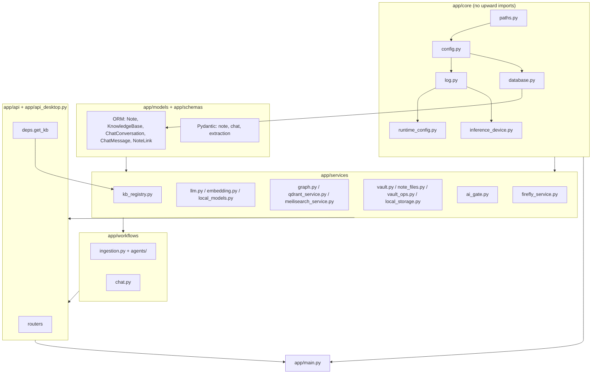
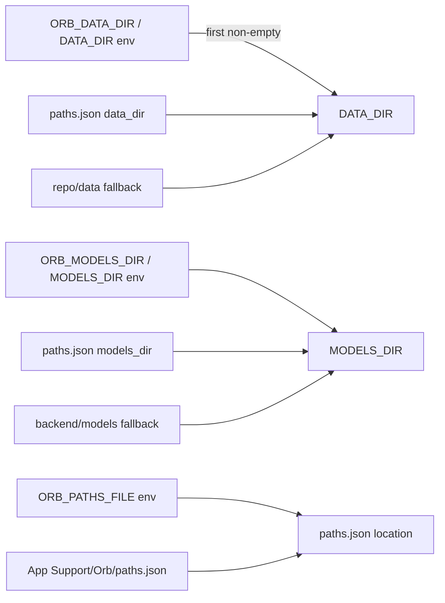

# Backend core and configuration

**What this covers.** The FastAPI application object in `backend/app/main.py` (router registration, CORS, trace-id middleware, startup/shutdown hooks), the `backend/app/core/` package (`config.py` Settings class, `paths.py` bootstrap path resolution, `runtime_config.py` mutable overrides, `database.py` async SQLAlchemy engine, `log.py` entry points, `inference_device.py`), the SQLAlchemy ORM models in `backend/app/models/`, the shared Pydantic schemas in `backend/app/schemas/`, the router glue in `backend/app/api/__init__.py`, the `get_kb` dependency, the health and settings endpoints, the AI gate (`ai_gate.py`), and the local attachment storage helper (`local_storage.py`). It is the "spine" every other backend subsystem depends on.

**Related docs:** [System architecture](02-system-architecture.md) · [Repository layout](03-repository-layout.md) · [Desktop shell](04-desktop-shell.md) · [API reference](07-api-reference.md) · [Knowledge bases and vaults](08-knowledge-bases-and-vaults.md) · [Notes, wikilinks and vault files](09-notes-wikilinks-and-vault-files.md) · [Ingestion pipeline](10-ingestion-pipeline.md) · [Local models and inference](12-local-models-and-inference.md) · [LLM providers and prompting](13-llm-providers-and-prompting.md) · [Retrieval and chat](16-retrieval-and-chat.md) · [Finance / Firefly](17-finance-firefly.md) · [Configuration reference](21-configuration-reference.md) · [Data directory layout](22-data-directory-layout.md) · [Logging and observability](23-logging-and-observability.md) · [Decisions and constraints](26-decisions-and-constraints.md)

## 1. Responsibilities and boundaries

**Owns**

- Process bootstrap: logging initialisation before any other import, `Settings` construction, engine creation, table creation, applying persisted runtime overrides, starting background vault watchers.
- The global mutable `settings` singleton (`app.core.config.settings`) that every service reads at call time.
- Path bootstrap (`paths.json`) and the derived `DATA_DIR` / `MODELS_DIR` / `KUZU_DB_PATH` / `MODELS_PATH` values.
- The SQLite metadata schema: `notes`, `knowledge_bases`, `chat_conversations`, `chat_messages`, `note_links`.
- Wire-level request/response schema definitions that are shared between routers and workflows (`schemas/`).
- The `?kb=` contract (`get_kb`) and the AI gating contract (`require_ai`).

**Does not own**

- Any KB-specific storage (Kuzu, Qdrant, Meili, Firefly) — see [08](08-knowledge-bases-and-vaults.md), [14](14-graph-storage-kuzu.md), [15](15-search-indexes-qdrant-meilisearch.md), [17](17-finance-firefly.md).
- The note body. Bodies live only in vault `.md` files (`services/note_files.py`, `services/vault.py`) — see [09](09-notes-wikilinks-and-vault-files.md).
- LLM/embedding client construction (`services/llm.py`, `services/embedding.py`) — this doc only documents the `Settings` fields they consume and the fallback chains they implement.
- Router bodies other than `health.py` and `settings.py` — see [07](07-api-reference.md).
- The desktop-facing setup/model-download router `backend/app/api_desktop.py` — see [04](04-desktop-shell.md) and [12](12-local-models-and-inference.md).

## 2. Files

| Path | Purpose | Key exports |
|---|---|---|
| `backend/app/main.py` | FastAPI app construction, CORS, trace-id middleware, startup/shutdown | `app`, `request_trace_id` (ContextVar), `trace_id_middleware`, `startup_event`, `shutdown_event` |
| `backend/app/core/config.py` | pydantic-settings `Settings` class; global `settings` singleton; post-construction path mutation | `Settings`, `settings`, `BACKEND_DIR`, `REPO_ROOT`, `DEFAULT_KUZU_DB_PATH` |
| `backend/app/core/paths.py` | `paths.json` bootstrap; env > file > repo fallback resolution of data/models/vault dirs; download staging dir; data layout creation | `paths_json_location`, `load_paths_file`, `save_paths_file`, `resolve_data_dir`, `resolve_models_dir`, `resolve_default_vault_path`, `looks_like_network_volume`, `local_download_staging_dir`, `ensure_data_layout`, `sqlite_url`, `clear_paths_cache`, `sync_settings_paths` |
| `backend/app/core/runtime_config.py` | `DATA_DIR/runtime_config.json` load/save/apply of the five mutable provider keys | `MUTABLE_KEYS`, `load`, `save`, `apply_to_settings` |
| `backend/app/core/database.py` | Async engine (SQLite/aiosqlite, NullPool), session factory, declarative `Base`, `init_db` | `engine`, `DATABASE_URL`, `AsyncSessionLocal`, `Base`, `get_db`, `init_db` |
| `backend/app/core/log.py` | Component-routed rotating file logging (full detail in [23](23-logging-and-observability.md)) | `setup_logging`, `reconfigure_logging`, `get_logger`, `resolve_logs_dir`, `COMPONENT_LOG_FILES` |
| `backend/app/core/inference_device.py` | Torch device/dtype selection and Qwen3.5 fast-path shim | `resolve_torch_device`, `resolve_torch_dtype`, `prepare_qwen3_5_inference` |
| `backend/app/models/__init__.py` | Re-exports all ORM classes | `ChatConversation`, `ChatMessage`, `KnowledgeBase`, `Note`, `NoteLink` |
| `backend/app/models/note.py` | `notes` table (metadata only) | `Note` |
| `backend/app/models/chat.py` | `chat_conversations`, `chat_messages` tables | `ChatConversation`, `ChatMessage` |
| `backend/app/models/wikilink.py` | `note_links` table | `NoteLink` |
| `backend/app/schemas/__init__.py` | Re-exports schemas | see below |
| `backend/app/schemas/note.py` | Note / vault-file request bodies | `CreateNoteInput`, `MoveNoteInput`, `MoveVaultFileInput`, `DeleteVaultFileInput`, `BatchDeleteNotesInput`, `MkdirInput` |
| `backend/app/schemas/chat.py` | Chat request bodies | `ChatTurn`, `CreateConversationInput`, `ChatInput` |
| `backend/app/schemas/extraction.py` | LLM extraction result models with noise-tolerant validators | `Node`, `ExtractedRelationship`, `Extraction`, `NoteInput` |
| `backend/app/api/__init__.py` | Router registration in a fixed order | `register_all_routers` |
| `backend/app/api/deps.py` | `?kb=` query-param dependency | `get_kb` |
| `backend/app/api/health.py` | `/` and `/health` | `router` |
| `backend/app/api/settings.py` | `GET/PATCH /api/v1/settings` runtime LLM settings | `router`, `LLMSettings` |
| `backend/app/services/ai_gate.py` | AI readiness derived from real configuration | `ai_is_configured`, `require_ai`, `chat_is_local_only` |
| `backend/app/services/local_storage.py` | Vault attachment upload/remove and URL→rel-path mapping | `vault_rel_from_url`, `store_upload`, `remove_upload` |
| `backend/.env.example` | Documented example of every env var | — |
| `backend/requirements.txt`, `backend/requirements-multimodal.txt` | Python dependencies (core / optional multimodal) | — |
| `backend/app/desktop_runtime.py` | The process the Tauri shell spawns: port sweep, uvicorn, sidecar boot ([04](04-desktop-shell.md)) | `main`, `status` |
| `backend/.pylintrc` | Lint configuration | — |

## 3. Module layering

The backend is a strict four-layer stack. Lower layers never import upward. `core/` must not import `services/` at module import time (two deliberate exceptions use function-local imports: `config._default_data_dir` imports `paths`, and `main.startup_event` imports `runtime_config`, `local_models`, `vault_watcher` inside the handler).



Import-time ordering inside `core/` matters and is enforced by which module imports which:

| Module | Imports from `core` | Reads at import time | Side effects at import time |
|---|---|---|---|
| `paths.py` | nothing (comment: "Avoid importing settings here (circular with config.py)") | `os.environ`, `paths.json` (lazily, cached) | none |
| `config.py` | `paths` (function-local, inside `_default_data_dir` / `_default_models_dir`) | env, `backend/.env`, `paths.json` via `paths` | constructs `settings`; mutates `settings.KUZU_DB_PATH` and `settings.MODELS_PATH` |
| `log.py` | `config.settings` | `settings.DATA_DIR`, `settings.LOG_LEVEL` | `LOGS_DIR = resolve_logs_dir()` creates `DATA_DIR/logs` |
| `runtime_config.py` | `config`, `log` | — | none (file read only in `load()`) |
| `database.py` | `config`, `log`, `paths` | `paths.sqlite_url()` | `ensure_data_layout()` creates the `DATA_DIR` subdirs; **creates the SQLAlchemy engine** (so `DATA_DIR` is frozen for the engine from this moment) |
| `inference_device.py` | `log` | — | `import torch` (heavy; only imported by multimodal code paths) |

### 3.1 Module dependency table (who imports the core)

| Consumer | Uses from core | Purpose |
|---|---|---|
| `app/main.py` | `log.setup_logging/get_logger`, `config.settings`, `database.init_db`, `runtime_config` | bootstrap |
| `app/api/*.py`, `app/api_desktop.py` | `database.get_db`, `log.get_logger`, `config.settings` (settings.py, admin.py, api_desktop.py), `paths.*` (api_desktop.py) | routers |
| `app/api/deps.py` | — (imports `services.kb_registry`) | `?kb=` resolution |
| `app/models/*.py` | `database.Base` | ORM declarations |
| `app/services/kb_registry.py` | `config.settings`, `paths.resolve_data_dir/ensure_data_layout/resolve_default_vault_path` | per-KB context; opens `orb.db` with raw `sqlite3` |
| `app/services/llm.py`, `embedding.py`, `local_models.py`, `reranker.py`, `model_catalog.py` | `config.settings`, `paths.resolve_models_dir/looks_like_network_volume/local_download_staging_dir`, `log` | model resolution |
| `app/services/graph.py` | `config.settings.KUZU_DB_PATH`, `config.REPO_ROOT` | Kuzu path default |
| `app/services/qdrant_service.py`, `meilisearch_service.py` | `config.settings` (host/port/key/collection names) | index clients |
| `app/services/multimedia.py`, `multimodal_models.py`, `multimodal_runtime.py`, `multimodal_services.py` | `config.settings` (MODEL_*, PDF_*, cloud keys), `inference_device` | enrichment |
| `app/services/chat_store.py` | `database.AsyncSessionLocal`, `config.settings.CHAT_HISTORY_MAX_MESSAGES` | chat persistence |
| `app/services/vault_watcher.py`, `vault_sync.py` | `paths.sqlite_url` (via own sync engine), `log` | watchers |
| `app/services/firefly_service.py` | `config.settings.FIREFLY_*` | finance |
| `app/workflows/ingestion.py`, `agents/ingestion_agent.py` | `config.settings` (concurrency + feature switches), `database.AsyncSessionLocal` | pipeline |

## 4. `backend/app/main.py` — application construction

### 4.1 Import order (load-bearing)

```python
from app.core.log import get_logger, setup_logging
setup_logging()
from app.api import register_all_routers   # noqa: E402
from app.core.config import settings
from app.core.database import init_db
```

`setup_logging()` runs **before** `app.api` is imported. Importing `app.api` transitively imports every service module, and most of them call `get_logger("<Name>")` at module scope. Because `setup_logging()` attaches handlers to the named loggers in `COMPONENT_LOG_FILES` and sets `propagate = False`, the order only affects whether early import-time log lines are routed; `get_logger` is just `logging.getLogger(name)`, so late-created loggers still pick up the handlers. The file carries `# pylint: disable=wrong-import-order,wrong-import-position,import-outside-toplevel` for this reason. Note that importing `app.core.log` already imports `app.core.config`, so `settings` is constructed (env + `.env` + `paths.json` read) as the very first thing the process does.

### 4.2 App object and routers

`app = FastAPI(title="Orb API", version="0.1.0")` — the version string is hard-coded `0.1.0` while `desktop/package.json` and `frontend/package.json` are `0.2.0` (see discrepancies).

`register_all_routers(app)` (`backend/app/api/__init__.py`) includes routers in this exact order:

1. `app.api_desktop.router` (setup/paths, model download, notes graph, chat export, **all `/api/v1/finance/*`**, reingest-vault)
2. `health.router` (`/`, `/health`)
3. `settings.router` (`/api/v1/settings`)
4. `files.router`
5. `chat.router`
6. `graph.router`
7. `notes.router`
8. `vault.router`
9. `admin.router`
10. `kb.router`

Why the desktop router is first: Starlette matches routes in registration order, first match wins. `api_desktop.py` declares a few paths that overlap in prefix with domain routers — `GET /api/v1/graph/notes`, `GET /api/v1/graph/notes/{note_id}/neighbors`, `POST /api/v1/graph/notes/rebuild` (vs `graph.router` which owns `/api/v1/graph/...` with path parameters), and `POST /api/v1/notes/reingest-vault` (vs `notes.router` routes such as `/api/v1/notes/{note_id}`). Registering the desktop router first guarantees the literal `notes`/`reingest-vault` segments are matched before a `{note_id}`/`{...}` path parameter in a later router swallows them. No router uses an `APIRouter(prefix=...)`; every route spells its full `/api/v1/...` path. History: the desktop router was introduced with the Docker-free desktop refactor (`3f21e08`, 2026-08-02) and moved to first position in `fbcafe7` (2026-08-03).

### 4.3 CORS

```python
cors_origins = [o.strip() for o in settings.CORS_ORIGINS.split(",") if o.strip()]
app.add_middleware(CORSMiddleware, allow_origins=cors_origins,
                   allow_origin_regex=settings.CORS_ALLOW_ORIGIN_REGEX,
                   allow_credentials=True, allow_methods=["*"], allow_headers=["*"])
```

- `CORS_ORIGINS` is a comma-separated string, not a list. The `Settings` default lists ports 3700/3701 on both `localhost` and `127.0.0.1` plus the legacy `17400` UI port (the comment about Electron loading the `127.0.0.1` origin is stale).
- In the desktop app the API serves the UI itself, so every call is same-origin and CORS is effectively unused; in dev the Vite server proxies `/api/v1`, `/vault-files` and `/health` to 17401, so CORS matters only for a browser hitting the API origin directly.
- `CORSMiddleware` is added *after* `register_all_routers` but *before* the `@app.middleware("http")` decorator below. Starlette wraps middleware in reverse order of addition, so at request time the trace-id middleware runs **outside** CORS (it sees every request first and sets the response header last). Consequence: the `X-Request-Id` response header is present on CORS preflight responses too, but it is not listed in `Access-Control-Expose-Headers`, so browser JS on a cross-origin page cannot read it (same-origin requests can).

### 4.4 Trace-id middleware

`request_trace_id: ContextVar[str] = ContextVar("request_trace_id", default="")` is a module-level ContextVar. `trace_id_middleware`:

1. `trace_id = request.headers.get("X-Request-Id") or str(uuid.uuid4())`
2. `token = request_trace_id.set(trace_id)`; `await call_next(request)` inside `try/finally` that resets the var.
3. `response.headers["X-Request-Id"] = trace_id`.

Facts an assistant must know:

- **Nothing in the backend reads `request_trace_id` today** (grep: the only references are in `main.py`). The docstring says "any logger that reads it can attach it to structured log records", but no logging Filter/Formatter does so; the file formatter is `%(asctime)s | %(name)s | %(levelname)s | %(message)s`. Trace ids are therefore only useful client-side (the header round-trips) and as an extension point.
- The frontend (`frontend/src/lib/api.ts`) does not send `X-Request-Id`; every request gets a fresh UUID. Chat requests carry their own `request_id` in the JSON body (`ChatInput.request_id`) which is a *different* mechanism used for progress streaming — see [16](16-retrieval-and-chat.md).
- Because the ContextVar is reset in `finally`, background tasks started via `BackgroundTasks` run after the response and see the default `""`; tasks spawned with `asyncio.create_task` inside the request inherit a copy of the context and keep the id.
- History: added in `68494b7` (2026-05-07, "Finalize Final Implementation: Kuzu/Typesense migration").

### 4.5 Startup hook (`startup_event`)

Registered with the deprecated `@app.on_event("startup")` (not a lifespan context). Sequence, in order, all awaited on the event loop:

1. `logger.info("Application startup: Orb API online")` (logger `"API"` → `api.log`).
2. `await init_db()` — `Base.metadata.create_all` + manual SQLite index (see §8).
3. `runtime_config.load()`; if non-empty, `runtime_config.apply_to_settings(overrides)` and log `"Runtime config overrides applied"` with `extra={"overrides": [...keys]}`. This is what makes `DATA_DIR/runtime_config.json` win over `.env` for `LLM_PROVIDER`, `CHAT_MODEL`, `INGESTION_MODEL`, `LLM_BASE_URL`. **Important ordering consequence:** the `llm_service` singleton is a lazy proxy (`_LazyLLMService` in `services/llm.py`) that constructs `LLMService` on first attribute access. Nothing in startup touches it, so the provider read by `LLMService.__init__` is the post-override value. If any import-time code ever forces construction earlier, runtime overrides would be silently ignored for the provider — keep it lazy.
4. `sync_embedding_infrastructure()` from `services/local_models.py`, wrapped in `try/except Exception` → `logger.warning("Embedding infrastructure sync skipped: ...")`. It reads `MODELS_DIR/models_manifest.json` selection, sets `settings.EMBEDDING_DIMENSIONS`, `settings.EMBEDDING_MODEL`, `settings.MODEL_RERANKER_LOCAL` from the manifest/catalog, and makes every KB's Qdrant collections match the embedding dimension (details in [12](12-local-models-and-inference.md) and [15](15-search-indexes-qdrant-meilisearch.md)). This is the third and last place at boot that mutates `settings` (after `config.py` bottom and `apply_to_settings`).
5. `start_vault_watchers()` from `services/vault_watcher.py`, also `try/except` → `logger.warning("Vault watcher not started: ...")`. Starts a daemon thread with a watchdog observer per KB vault; it marks notes stale on external `.md` edits, never auto-ingests ([09](09-notes-wikilinks-and-vault-files.md)).

No Qdrant/Meili/Kuzu connectivity check happens at startup; those clients are created lazily per KB by `kb_registry` on first `?kb=` resolution, and each degrades to a disabled state on connection failure. `/health` therefore returns `healthy` even if every index is down.

### 4.6 Shutdown hook

`shutdown_event` calls `stop_vault_watchers()` inside a bare `try/except Exception: pass`. Nothing else is torn down explicitly: the SQLite engine uses `NullPool` (no pooled connections to close), and GGUF models are released by the idle-unload watcher or by process exit. The desktop runtime stops the sidecars when the API exits, and the shell SIGTERMs the runtime's process group on quit ([04](04-desktop-shell.md)).

### 4.7 How the process is launched

| Context | Command | cwd | Notes |
|---|---|---|---|
| Desktop runtime | `python -m app.desktop_runtime` → `uvicorn.run("app.main:app", host="127.0.0.1", port=17401)` in-process | `backend/` (or bundled backend dir) | env set by the shell and `desktop_runtime.py` (see [21](21-configuration-reference.md) §"Layers"); stdout/stderr → `DATA_DIR/logs/backend.log` |
| Bare dev | `cd backend && uvicorn app.main:app --reload --port 17401` (any port) | `backend/` | `.env` at `backend/.env` is picked up by pydantic-settings; without `paths.json`/env, data goes to `<repo>/data`, models to `backend/models` |

`PYTHONPATH` must resolve the `app` package from `backend/`; the shell runs the runtime with `backend/` (or the bundled backend dir) as cwd, `.pylintrc` does the equivalent with `init-hook='import sys; sys.path.insert(0, ".")'`.

## 5. `backend/app/core/config.py` — the `Settings` class

### 5.1 Construction

```python
class Settings(BaseSettings):
    model_config = SettingsConfigDict(env_file=str(BACKEND_DIR / ".env"),
                                      env_file_encoding="utf-8", extra="ignore")
```

- `BACKEND_DIR = Path(__file__).resolve().parents[2]` → `backend/`; `REPO_ROOT = BACKEND_DIR.parent`.
- `env_file` is an **absolute** path to `backend/.env`, so the file is found regardless of the process cwd (desktop runtime, tests).
- `extra="ignore"`: unknown env vars and unknown `.env` keys are silently dropped. This is why `STORAGE_BACKEND`, `FILES_URL`, `VIDEO_MAX_PIXELS`, `FPS*`, `ORB_*` etc. can appear in the runtime env / `.env.example` without being `Settings` fields — they are read elsewhere (or nowhere).
- pydantic-settings precedence (highest first): explicit constructor kwargs (unused) → **process environment** → `.env` file → field defaults. Env var names are matched case-insensitively to field names; there is no `env_prefix`, so `LLM_PROVIDER` (not `ORB_LLM_PROVIDER`) is the variable name. The `ORB_*` names are handled only by `paths.py` and `local_models.py`, not by `Settings`.
- `settings = Settings()` is created at import; it is a plain mutable object. Many places assign to it (`settings.X = ...`) at runtime — see §5.4.

### 5.2 Defaults that are computed before the class body runs

`_default_data_dir()` and `_default_models_dir()` call `paths.resolve_data_dir()` / `resolve_models_dir()` (env `ORB_DATA_DIR`/`DATA_DIR` > `paths.json` > `<repo>/data`; env `ORB_MODELS_DIR`/`MODELS_DIR` > `paths.json` > `backend/models`). Any exception falls back to `<repo>/data` / `backend/models`. `DEFAULT_KUZU_DB_PATH = <data_dir>/kuzu/kuzu_graph` is derived from that. Because these are evaluated as class-attribute defaults, the *field default* for `DATA_DIR` already includes `paths.json`; then pydantic still lets a plain `DATA_DIR` env var or `.env` entry override it (which is consistent, since `resolve_data_dir` also honours `DATA_DIR`).

### 5.3 Fields, grouped (type / default / consumer)

Every field below is an env var of the same name. "Consumer" is where `settings.<FIELD>` is actually read (from `grep -rno "settings\.[A-Z_]*" backend/app`). Fields marked **unused** are declared but never read anywhere in `backend/app`.

**Identity / API**

| Field | Type | Default | Consumer |
|---|---|---|---|
| `CORS_ORIGINS` | str (CSV) | `http://localhost:3700,http://localhost:3701,http://127.0.0.1:3700,http://127.0.0.1:3701` | `main.py` |
| `CORS_ALLOW_ORIGIN_REGEX` | str \| None | `None` | `main.py` |

**Paths / layout**

| Field | Type | Default | Consumer |
|---|---|---|---|
| `DATA_DIR` | str | `_default_data_dir()` | `log.resolve_logs_dir`, `config.py` bottom (derives `KUZU_DB_PATH`); everything else goes through `paths.resolve_data_dir()` |
| `MODELS_DIR` | str | `_default_models_dir()` | `config.py` bottom (copied to `MODELS_PATH`), `paths.sync_settings_paths` |
| `MODELS_PATH` | str | `"models"` then **overwritten** with `MODELS_DIR` | not read by name anywhere else (legacy; kept in sync) |
| `KUZU_DB_PATH` | str | `DEFAULT_KUZU_DB_PATH` then **overwritten** with `<DATA_DIR>/kuzu/kuzu_graph` | `kb_registry` (default KB), `graph.GraphService` default |

**LLM — chat axis**

| Field | Type | Default | Consumer |
|---|---|---|---|
| `LLM_PROVIDER` | str | `"local"` | `llm.LLMService.__init__` (`ollama`/`lm_studio` → `local` with warning), `ai_gate`, `api/settings.py`, `api_desktop.setup_status` |
| `LLM_BASE_URL` | str | `http://127.0.0.1:8080` | `ai_gate` (cloud/hybrid heuristics), `api/settings.py` (exposed/mutable), `runtime_config` — **not used to build any HTTP client** in the current `llm.py` (local is in-process; cloud providers use SDK defaults or `https://router.huggingface.co/v1`) |
| `LLM_API_KEY` | str | `"local"` | `ai_gate` only |
| `LLM_MODEL` | str | `"local-chat"` | `llm.get_chat_model` (local provider / fallback), `local_models` (model id label; `ensure_chat_and_embed_models` sets it to the selected chat id), `api/settings.py` fallback |
| `CHAT_MODEL` | str \| None | `None` | `llm.get_chat_model` (wins over everything), `api/settings.py`, `runtime_config` |
| `OPENAI_MODEL`, `GEMINI_MODEL`, `ANTHROPIC_MODEL`, `HUGGINGFACE_MODEL` | str \| None | `None` | `llm.py` per-provider fallback + `init_clients` log lines; `multimedia.py` cloud image captions (`OPENAI_MODEL or "gpt-4o-mini"`, `GEMINI_MODEL or "gemini-2.0-flash"`) |
| `OPENAI_API_KEY`, `GEMINI_API_KEY`, `ANTHROPIC_API_KEY`, `HUGGINGFACE_API_KEY` | str \| None | `None` | **Seed only.** Read once by `services/credentials.CredentialStore._seed_from_env_unlocked` for contributors running outside the desktop shell. Runtime reads go through `credentials.get()` — see [13 §Credentials](13-llm-providers-and-prompting.md). |

**LLM — ingestion axis**

| Field | Type | Default | Consumer |
|---|---|---|---|
| `INGESTION_PROVIDER` | str \| None | `None` | `llm.init_clients` (blank → alias chat clients; `ollama`/`lm_studio` → `local`) |
| `INGESTION_MODEL` | str \| None | `None` | `llm.get_ingestion_model` (wins), `api/settings.py`, `runtime_config` |
| `INGESTION_LLM_MODEL` | str \| None | `"local-chat"` | `llm.get_ingestion_model` local fallback |
| `INGESTION_GEMINI_MODEL` | str \| None | `None` | `llm.get_ingestion_model` gemini fallback |

**Embeddings axis**

| Field | Type | Default | Consumer |
|---|---|---|---|
| `EMBEDDING_PROVIDER` | str | `"local"` | `embedding.EmbeddingService.__init__` — accepts `local`, `auto`, `""` (and deprecated `ollama`/`lm_studio` → local); anything else raises `ValueError` |
| `EMBEDDING_MODEL` | str | `"local-embed"` | `embedding.py` (name only; `is_qwen3` detection by substring), overwritten by `local_models.sync_embedding_infrastructure` / `ensure_chat_and_embed_models` from the manifest |
| `EMBEDDING_DIMENSIONS` | int | `1024` | `qdrant_service` (collection vector size), `local_models` (overwritten from manifest/catalog at startup) |

**Retrieval tuning** (all read in `services/retrieval.py`)

| Field | Type | Default | Effect |
|---|---|---|---|
| `VECTOR_SIMILARITY_THRESHOLD` | float | `0.50` | Qdrant score cut-off when the reranker is **disabled** |
| `VECTOR_PRE_RERANK_THRESHOLD` | float | `0.45` | Qdrant score cut-off when the reranker is **enabled** (looser; reranker prunes) |
| `RERANKER_ENABLED` | bool | `True` | Use GGUF cross-encoder (`local_gguf_reranker`) vs keyword-overlap heuristic; also gates graph-neighbour reranking |
| `RERANKER_TOP_K` | int | `10` | `top_n` passed to the reranker (final and graph-expansion passes) |
| `RERANKER_SCORE_THRESHOLD` | float | `0.05` | Drop reranked candidates below this |
| `GRAPH_EXPAND_TOP_NEIGHBORS` | int | `10` | Cap on relationship entries kept per expansion; reranking of neighbours only if more than this many |
| `GRAPH_EXPAND_SCORE_THRESHOLD` | float | `0` | Applied to neighbour scores only when `> 0` |
| `MAX_LOOP_ITERATIONS` | int | `3` | Iterations of the multi-hop retrieval loop  |
| `CHAT_HISTORY_MAX_MESSAGES` | int | `24` | `chat_store.recent_turns` default limit; `llm.py`/`retrieval.py` slice history to the last N turns when building prompts |

**Feature switches** (ingestion side)

| Field | Type | Default | Consumer |
|---|---|---|---|
| `COMMUNITY_DETECTION_ENABLED` | bool | `False` | `workflows/ingestion.py` (post-ingest community pass), `ingestion_tracker` (idle-timer auto-recompute) |
| `TEMPORAL_DIGESTS_ENABLED` | bool | `False` | `workflows/ingestion.py` (debounced rebuild after ingest; `build_temporal_digests` no-ops when false) |
| `TEMPORAL_DIGEST_PERIOD` | str | `"month"` | default period for digest builds (`admin.py`, `ingestion.py`) |

Note `.env.example` sets both switches to `true` and describes `true` as if it were the default; the code default is `False`.

**Qdrant**

| Field | Type | Default | Consumer |
|---|---|---|---|
| `QDRANT_HOST` | str | `127.0.0.1` | `qdrant_service.QdrantService.__init__` (`QdrantClient(host=, port=, api_key=)`) |
| `QDRANT_PORT` | int | `6333` | same (desktop injects `17433`) |
| `QDRANT_API_KEY` | str \| None | `None` | same |
| `QDRANT_COLLECTION_NODE_CORES` / `_RELATIONSHIPS` / `_ISOLATED_CONTEXTS` | str | `node_cores` / `node_relationships` / `node_isolated_contexts` | `qdrant_service` defaults; `kb_registry` uses them for the **default KB row** only — non-default KBs get `<slug>_node_cores` etc. |

**Meilisearch**

| Field | Type | Default | Consumer |
|---|---|---|---|
| `MEILI_HOST` | str | `127.0.0.1` | `meilisearch_service` (`http://{host}:{port}`) |
| `MEILI_PORT` | int | `7700` | same (desktop injects `17470`) |
| `MEILI_MASTER_KEY` | str | `orb-dev-key` | same (desktop injects the per-install key from `DATA_DIR/meili_master_key`) |
| `MEILI_INDEX_NAME` | str | `orb_nodes` | `meilisearch_service` default index; `kb_registry` default-KB row (still spelled `MEILI_INDEX_NAME or settings.TYPESENSE_COLLECTION_NAME` — the latter field no longer exists, harmless while `MEILI_INDEX_NAME` is non-empty) |

The `TYPESENSE_*` env aliases and their validator (added in `fbcafe7`, 2026-08-03, when Typesense was replaced by Meilisearch) have been removed; only the `typesense_collection` column name survives (§ORM).

**Multimodal / local models**

| Field | Type | Default | Consumer |
|---|---|---|---|
| `MODEL_FLORENCE_HF` / `MODEL_FLORENCE_LOCAL` | str | `microsoft/Florence-2-large` / `florence-2-large` | `multimodal_models.model_ids("florence")` → HF repo id and `MODELS_DIR/<local>` folder |
| `MODEL_WHISPER_HF` / `MODEL_WHISPER_LOCAL` | str | `openai/whisper-large-v3-turbo` / `whisper-large-v3-turbo` | same for whisper |
| `MODEL_MARLIN_HF` / `MODEL_MARLIN_LOCAL` | str | `lunahr/Marlin-2B-ungated` / `marlin-2b` | same for marlin |
| `FLORENCE_MAX_IMAGE_PIXELS` | int | `1500000` | `multimodal_runtime` via `getattr(settings, "FLORENCE_MAX_IMAGE_PIXELS", 0) or 1_500_000` — **`0` does not mean "full resolution"** despite `.env.example`; `0` falls back to 1.5 MP |
| `MODEL_RERANKER_LOCAL` | str | `qwen3-reranker-0.6b` | `retrieval.py` (log/progress label only), overwritten from manifest by `sync_embedding_infrastructure` |
| `PDF_VISUAL_EXTRACTION_ENABLED` | bool | `True` | `multimedia.py` `_page_needs_visual` |
| `PDF_VISUAL_EXTRACTION_MAX_PAGES` | int | `0` | cap on Florence-rendered pages per PDF; `0` = unlimited |
| `PDF_VISUAL_RENDER_DPI` | int | `144` | render DPI, floored at 72 |
| `PDF_VISUAL_TEXT_THRESHOLD` | int | `80` | pages with ≥ this many native-text chars skip the visual pass |

**Firefly**

| Field | Type | Default | Consumer |
|---|---|---|---|
| `FIREFLY_BASE_URL` | str \| None | `None` | `firefly_service.FireflyService.__init__` (`base_url`) |
| `FIREFLY_RUNTIME_FILE` | str \| None | `None` | same (`runtime.json` with `apiToken`, php path, etc.) |
| `FIREFLY_API_TOKEN` | str \| None | `None` | `firefly_service._token` — env token wins over `runtime.json` |

**Logging / concurrency**

| Field | Type | Default | Consumer |
|---|---|---|---|
| `LOG_LEVEL` | str | `"INFO"` | `log.setup_logging` (`getattr(logging, LEVEL.upper(), INFO)`) |
| `INGESTION_PIPELINE_CONCURRENCY` | int | `1` | `workflows/ingestion.py` `asyncio.Semaphore` around whole-note processing (FIFO when 1) |
| `MULTIMEDIA_CONCURRENCY` | int | `1` | `workflows/agents/ingestion_agent.py` module-level `asyncio.Semaphore` around Florence/Whisper/Marlin work |

### 5.4 Post-construction mutation of `settings`

`config.py` ends with:

```python
settings = Settings()
_data = Path(settings.DATA_DIR)
settings.KUZU_DB_PATH = str(_data / "kuzu" / "kuzu_graph")
settings.MODELS_PATH = settings.MODELS_DIR
```

Consequences:

- **`KUZU_DB_PATH` from env/`.env` is always discarded.** `.env.example` documents `KUZU_DB_PATH=data/kuzu/kuzu_graph`, but whatever you set, the effective value is `<DATA_DIR>/kuzu/kuzu_graph`. (Per-KB Kuzu paths for non-default KBs are `<DATA_DIR>/kuzu/<slug>/kuzu_graph`, computed by `kb_registry`, not by settings.)
- `MODELS_PATH` is a pure alias of `MODELS_DIR`.

Other writers to `settings` at runtime (all in-process, none persisted except where noted):

| Writer | Fields | Persisted? |
|---|---|---|
| `runtime_config.apply_to_settings` (startup, `PATCH /settings`) | `LLM_PROVIDER`, `CHAT_MODEL`, `INGESTION_MODEL`, `LLM_BASE_URL` | yes → `runtime_config.json` |
| `api/settings.update_runtime_settings` | same four LLM fields directly, then saves | yes |
| `api_desktop.setup_paths` | via `sync_settings_paths`: `DATA_DIR`, `MODELS_DIR`, `MODELS_PATH`, `KUZU_DB_PATH` | paths → `paths.json` |
| `paths.sync_settings_paths` | `DATA_DIR`, `MODELS_DIR`, `MODELS_PATH`, `KUZU_DB_PATH` | n/a (reads `paths.json`) |
| `local_models.sync_embedding_infrastructure` | `EMBEDDING_DIMENSIONS`, `EMBEDDING_MODEL`, `MODEL_RERANKER_LOCAL` | derived from `models_manifest.json` |
| `local_models.ensure_chat_and_embed_models` | `EMBEDDING_DIMENSIONS`, `EMBEDDING_MODEL`, `MODEL_RERANKER_LOCAL`, `LLM_MODEL` | manifest |

Because modules read `settings.<X>` at call time (not at import), most of these take effect immediately. The exceptions are values captured at import/construction: the SQLAlchemy engine URL (`database.py`), `asyncio.Semaphore` sizes (`INGESTION_PIPELINE_CONCURRENCY`, `MULTIMEDIA_CONCURRENCY`), Qdrant/Meili client hosts (captured when each `KBContext` is built), `LLMService.provider` (re-read only when `init_clients()` is re-run by `PATCH /settings`).

## 6. `backend/app/core/paths.py` — bootstrap path resolution

This module is imported by `config.py` and must stay free of `settings` imports. Everything is a plain function over `os.environ` and one cached JSON file.

### 6.1 Resolution precedence



Env beats file for data/models dirs. **For the default vault it is the other way round**: `resolve_default_vault_path()` checks `paths.json` `default_vault_path` first, then `ORB_DEFAULT_VAULT`, then `None`.

### 6.2 Functions

| Function | Signature | Behaviour |
|---|---|---|
| `_default_app_support()` | `() -> Path` | macOS `~/Library/Application Support/Orb`; Windows `%APPDATA%/Orb` (fallback `~/AppData/Roaming`); Linux `~/.config/Orb`. |
| `_env_first(*names)` | `-> str \| None` | first env var with a truthy value. |
| `paths_json_location()` | `-> Path` | `ORB_PATHS_FILE` override, else `<app support>/paths.json`. The desktop always sets `ORB_PATHS_FILE` for the backend. |
| `load_paths_file()` | `-> dict` | Reads and **caches** the JSON in module global `_PATHS_CACHE` (also caches `{}` on missing/invalid file). Subsequent calls never re-read until `clear_paths_cache()` or `save_paths_file()`. |
| `save_paths_file(data_dir, models_dir, default_vault_path=None)` | `-> Path` | `mkdir -p` parent; merges with the existing file so an omitted `default_vault_path` is preserved; all paths `expanduser().resolve()`d; writes `json.dumps(payload, indent=2)`; refreshes the cache. Called by `POST /api/v1/setup/paths`. |
| `resolve_data_dir()` | `-> Path` | see precedence; result is `expanduser().resolve()`d. |
| `resolve_models_dir()` | `-> Path` | see precedence. |
| `resolve_default_vault_path()` | `-> Path \| None` | file first, then env. Used by `kb_registry._default_kb()` (falls back to `<DATA_DIR>/vaults/default`) and `setup_status`. |
| `looks_like_network_volume(path)` | `-> bool` | macOS: starts with `/Volumes/` and not `/Volumes/Macintosh HD*`; Linux: `/mnt/`, `/media/`, `/run/user/`; else `False`. Used by `local_models.download_file` to decide whether to stage downloads locally. |
| `local_download_staging_dir()` | `-> Path` | `ORB_HF_STAGING` / `ORB_DOWNLOAD_STAGING` override; else macOS `~/Library/Caches/Orb/model-downloads`, Windows `%LOCALAPPDATA%/Orb/model-downloads`, Linux `~/.cache/orb/model-downloads`. Always `mkdir -p`. |
| `ensure_data_layout(data_dir=None)` | `-> Path` | creates `kuzu/`, `qdrant/`, `meilisearch/`, `logs/`, `vaults/`, `bin/` under the data dir. Called at import of `database.py`, in `kb_registry._connect`, and by `sync_settings_paths`. |
| `sqlite_url(data_dir=None)` | `-> str` | `sqlite+aiosqlite:///<DATA_DIR>/orb.db` (absolute). |
| `clear_paths_cache()` | `-> None` | drop `_PATHS_CACHE` (tests / external edits). |
| `sync_settings_paths(settings_obj=None)` | `-> None` | re-resolves data/models and writes `DATA_DIR`, `MODELS_DIR`, `MODELS_PATH`, `KUZU_DB_PATH` onto `settings`; calls `ensure_data_layout`. Docstring is explicit: "SQLite/Qdrant engines created at import still need a restart to retarget storage roots." |

### 6.3 `paths.json` schema

```json
{
  "data_dir": "/Users/me/Library/Application Support/Orb/data",
  "models_dir": "/Users/me/Library/Application Support/Orb/models",
  "default_vault_path": "/Users/me/Documents/Orb Vault"
}
```

`data_dir` and `models_dir` are always written; `default_vault_path` only when non-empty. The Tauri shell writes the same file from the first-run setup page (`save_setup` in `src-tauri/src/commands.rs`).

## 7. `backend/app/core/runtime_config.py`

Persistent, user-mutable overrides for the provider settings, kept out of `.env` so the UI can change them. API keys are deliberately never stored here.

- `MUTABLE_KEYS = frozenset({"provider", "model", "ingestion_model", "base_url"})`.
- `_data_path()` → `resolve_data_dir() / "runtime_config.json"`, falling back to `<repo>/data/runtime_config.json` if `paths` import fails.
- `load() -> dict`: returns only keys in `MUTABLE_KEYS`; any `OSError`/`JSONDecodeError` logs a warning (logger `RuntimeConfig` → `api.log`) and returns `{}`.
- `save(overrides)`: filters to `MUTABLE_KEYS`, `mkdir -p`, writes `indent=2` JSON under a `threading.Lock`. Overwrites the whole file — callers first `load()` then merge (as `PATCH /settings` does).
- `apply_to_settings(overrides)`: maps `provider→settings.LLM_PROVIDER`, `model→settings.CHAT_MODEL`, `ingestion_model→settings.INGESTION_MODEL`, `base_url→settings.LLM_BASE_URL` (one loop over `_SETTING_FOR`); `None` values are skipped.

File example:

```json
{
  "provider": "local",
  "model": "gemma-4-e4b",
  "ingestion_model": "gemma-4-e4b"
}
```

There is no schema validation of values (e.g. an unknown provider string is applied verbatim and `LLMService` raises `ValueError("Unsupported LLM provider")` on first use).

## 8. `backend/app/core/database.py`

### 8.1 Engine selection (import time)

```python
DATABASE_URL = sqlite_url()
engine = create_async_engine(DATABASE_URL, echo=False, future=True,
                             poolclass=NullPool, connect_args={"check_same_thread": False})
```

- SQLite uses `aiosqlite` with `NullPool`: every session opens a fresh connection and closes it. Rationale (history `3f21e08`, `2655bb8`): SQLite + async + multiple threads (vault watcher, ingestion tracker, `kb_registry` raw `sqlite3`) behave best without a shared pool; `check_same_thread=False` is required because aiosqlite runs the connection in a worker thread.
- `ensure_data_layout()` runs before engine creation so the directory for `orb.db` exists.
- A `connect` listener sets `PRAGMA foreign_keys=ON` per connection; no WAL/other PRAGMA setup is performed. Under concurrent writers (`vault_watcher` sync engine + async API), callers can hit `database is locked`; `GET /notes/{id}/status` maps that to `503 "Database temporarily unavailable, retry shortly"`.

### 8.2 Session factory and dependency

`AsyncSessionLocal = async_sessionmaker(bind=engine, class_=AsyncSession, expire_on_commit=False, autoflush=False)`.

- `expire_on_commit=False`: ORM objects remain usable after `commit()` without a refresh round-trip — routers return attributes after committing.
- `autoflush=False`: queries do not implicitly flush pending changes; code must `flush()`/`commit()` explicitly before relying on DB-side state (e.g. before raw SQL).
- `get_db()` is the FastAPI dependency (`async with AsyncSessionLocal() as session: yield session`). No automatic commit/rollback wrapper — each router commits.

Other code paths open their **own** connections to the same `orb.db`: `kb_registry._connect()` uses stdlib `sqlite3` synchronously (it creates `knowledge_bases` with its own `CREATE TABLE IF NOT EXISTS` and adds Firefly columns with `ALTER TABLE`), and `vault_watcher._get_engine()` builds a sync SQLAlchemy engine. Keep the ORM `KnowledgeBase` model and `kb_registry`'s DDL in sync when adding columns.

### 8.3 `init_db()`

1. Imports `app.models.chat`, `kb`, `note`, `wikilink` so `Base.metadata` is populated (the comment notes finance has no local tables — it lives in Firefly).
2. `Base.metadata.create_all` inside `engine.begin()`.
3. On SQLite only, `CREATE INDEX IF NOT EXISTS ix_notes_kb_rel_path ON notes (kb_id, rel_path)` — because `create_all` never adds new indexes to tables that already exist, and this composite index was introduced (`fbcafe7`) after the `notes` table had shipped.

There is **no migration framework** (no Alembic). New columns on existing installs are handled ad hoc (`kb_registry._ensure_firefly_columns` for `firefly_group_id`/`firefly_group_title`); adding a column to `Note`/`ChatMessage` requires a similar manual `ALTER TABLE` path or it will only exist on fresh databases.

## 9. ORM models (`backend/app/models/`)

All tables share the pattern: `String` UUID4 primary key generated in Python (`default=lambda: str(uuid.uuid4())`), timezone-aware `DateTime` columns defaulting to `datetime.now(timezone.utc)` (note SQLite stores them as ISO strings; timezone is preserved textually). `Base` is `declarative_base()` from `database.py`.

### 9.1 `notes` (`models/note.py`, class `Note`)

| Column | Type | Nullable | Default | Meaning |
|---|---|---|---|---|
| `id` | String PK | no | uuid4 | Note id used in every `/notes/{id}` route, Qdrant payloads, Kuzu `note_id`, wikilink edges |
| `content` | Text | yes | `""` | **Deprecated.** Comment: "Deprecated fallback only — `persist_note_body` keeps this empty. Prefer vault file via `rel_path`; see `note_files.note_body`." Read only as a last-resort fallback when the vault file is missing. |
| `title` | String | yes | — | Display title; kept in sync with the vault filename (`72413b9`) |
| `rel_path` | String | yes | — | Path of the `.md` file **relative to the KB's `vault_path`** (e.g. `Life/Daily Log/2026-08-01.md`). `NULL` only for legacy rows. |
| `created_at` | DateTime(tz) | — | utcnow | Creation (client may pass `created_at` on create) |
| `updated_at` | DateTime(tz) | — | utcnow, `onupdate=utcnow` | Any ORM update |
| `processed` | Boolean | — | `False` | Ingestion finished successfully |
| `failed` | Boolean | — | `False` | Ingestion failed |
| `processing_stage` | String | yes | — | Human-readable stage string (`"Saved"`, `"Queued for ingestion"`, pipeline stages, error text). Surfaced by `GET /notes/{id}/status`. |
| `processing_model` | String | yes | — | Model id used for the last ingestion attempt |
| `kb_id` | String | no | `"default"` | KB scope; indexed (`index=True`) |

Indexes: `ix_notes_kb_id` (from `index=True`), `ix_notes_kb_rel_path` on `(kb_id, rel_path)` (declared in `__table_args__` and re-ensured in `init_db`). There is **no uniqueness** on `(kb_id, rel_path)`; uniqueness is maintained by the vault services.

Derived status contract (`api/notes.py get_note_ingestion_status`): `processed → "completed"`, else `failed → "failed"`, else `"processing"`.

**Invariant — the note body is never in SQLite.** Bodies are written by `services/note_files.persist_note_body` to `<vault_path>/<rel_path>` and read by `note_files.note_body`. `Note.content` must stay empty for new writes. Anything that needs note text must go through `note_files`, not the ORM column. See [09](09-notes-wikilinks-and-vault-files.md).

### 9.2 `knowledge_bases` (owned by `services/kb_registry.py`; raw `sqlite3` DDL, no ORM model)

| Column | Type | Nullable | Meaning |
|---|---|---|---|
| `id` | String PK | no | KB id; the default KB has the literal id `"default"` (`kb_registry.DEFAULT_KB_ID`) |
| `name` | String | no | Display name |
| `slug` | String, unique, indexed | no | URL/path-safe key derived from name (`re.sub(r"[^a-z0-9_-]", "-", name.lower().replace(" ", "_"))`); used in `?kb=`, vault folder, Qdrant/Meili names |
| `vault_path` | Text | no | Absolute vault folder |
| `kuzu_path` | Text | no | Kuzu database **file** (`<DATA_DIR>/kuzu/<slug>/kuzu_graph`; default KB `<DATA_DIR>/kuzu/kuzu_graph`); `kb_registry.normalize_kuzu_path` heals legacy directory paths |
| `qdrant_col_cores`, `qdrant_col_rels`, `qdrant_col_contexts` | String | no | Per-KB Qdrant collection names (`<slug>_node_cores`, `<slug>_node_relationships`, `<slug>_node_isolated_contexts`; default KB uses the `QDRANT_COLLECTION_*` settings) |
| `typesense_collection` | String | no | **Meilisearch index name**; column name kept for existing DBs. `meili_index = synonym("typesense_collection")` gives ORM code the modern name. |
| `created_at` | DateTime(tz) | — | |
| `firefly_group_id` | Integer | yes | Firefly III `user_group_id` (administration) owned by this KB — "never leak across vaults" |
| `firefly_group_title` | Text | yes | Its title |

`kb_registry` is the writer of this table (raw `sqlite3`, with its own DDL that matches these columns); the ORM class exists so `create_all` and other ORM code can see it. See [08](08-knowledge-bases-and-vaults.md).

### 9.3 `chat_conversations` / `chat_messages` (`models/chat.py`)

`ChatConversation`:

| Column | Type | Nullable | Meaning |
|---|---|---|---|
| `id` | String PK | no | |
| `kb_id` | String, indexed | no | Conversation is scoped to one KB |
| `title` | String | no, default `"New Chat"` | |
| `created_at` / `updated_at` | DateTime(tz) | — | `updated_at` has `onupdate` |
| `deleted_at` | DateTime(tz) | yes | Soft delete marker |
| `messages` | relationship | — | `cascade="all, delete-orphan"`, ordered by `ChatMessage.created_at` |

`ChatMessage`:

| Column | Type | Nullable | Meaning |
|---|---|---|---|
| `id` | String PK | no | |
| `conversation_id` | String FK → `chat_conversations.id` (`ondelete="CASCADE"`), indexed | no | SQLite does not enforce FK cascades unless `PRAGMA foreign_keys=ON` (not set); the ORM cascade handles deletes through the relationship |
| `role` | String | no | `"user"` \| `"assistant"` |
| `content` | Text | no | Message text (assistant: final answer) |
| `thinking` | Text | yes | Model reasoning / trace shown in the UI |
| `metadata_json` (DB column **`metadata`**) | JSON | yes | Free-form dict: citations/sources, retrieval stats, model info, timings (exact keys written by `services/chat_store.py`; see [16](16-retrieval-and-chat.md)). The attribute is named `metadata_json` because `metadata` is reserved on declarative classes. |
| `created_at` | DateTime(tz) | — | |

### 9.4 `note_links` (`models/wikilink.py`, class `NoteLink`)

| Column | Type | Nullable | Meaning |
|---|---|---|---|
| `id` | String PK | no | |
| `kb_id` | String, indexed | no | |
| `source_note_id` | String, indexed | no | Note containing the `[[wikilink]]` |
| `target_title` | String | no | Link target as written (title or path) |
| `target_note_id` | String, indexed | yes | Resolved target note id; `NULL` = dangling link |
| `created_at` | DateTime(tz) | — | |

`UniqueConstraint("kb_id", "source_note_id", "target_title", name="uq_note_link")` — one edge per (source, literal target) per KB. Rebuilt by `services/wikilinks.rebuild_kb_note_links`. See [09](09-notes-wikilinks-and-vault-files.md).

### 9.5 Per-KB LLM override columns (uncommitted working tree)

The current working tree (uncommitted at the time of writing) adds three nullable columns to `knowledge_bases`:

| Column | Type | Meaning |
|---|---|---|
| `llm_provider` | String | Pinned chat/ingestion provider for this KB (`local`, `openai`, `gemini`, `anthropic`, `huggingface`); `NULL` = inherit `settings.LLM_PROVIDER` |
| `llm_model` | String | Pinned chat model id; `NULL` = inherit |
| `llm_ingestion_model` | String | Pinned ingestion model id; `NULL` = inherit `llm_model`, then system |

Comment in the model: "Chat + ingestion only — embed/rerank/multimodal stay system-wide (embed dims are shared)." `kb_registry._ensure_optional_columns` (renamed from `_ensure_firefly_columns`) adds them with `ALTER TABLE` on existing databases. `KBContext` gained `llm_provider`, `llm_model`, `llm_ingestion_model`, a cached `llm` property (returns the global `llm_service` when nothing is pinned, else a dedicated `LLMService(prov, chat_model=, ingestion_model=, ingestion_provider=prov)`), `has_llm_override`, and `apply_llm_override(...)` which also drops the cached retrieval/ingestion/chat workflow objects so they are rebuilt with the new service. Routes: `GET/PATCH /api/v1/kb/{kb_id}/llm` (`api/kb.py`), and `GET /api/v1/kb` rows now carry `effective_llm`. `kb_registry.effective_llm_config(meta)` computes `{provider, model, ingestion_model, inherited}` by layering the row over `settings`. See [08](08-knowledge-bases-and-vaults.md) for the full contract and [13](13-llm-providers-and-prompting.md) for the `LLMService` constructor changes.

## 10. Pydantic schemas (`backend/app/schemas/`)

`schemas/__init__.py` re-exports everything below. All models use pydantic v2 (`pydantic==2.12.5`).

### 10.1 `schemas/note.py`

| Model | Fields | Used by |
|---|---|---|
| `CreateNoteInput` | `title: str \| None`, `content: str = ""`, `created_at: str \| None` (ISO string parsed by `api/notes._parse_date_str`), `folder: str \| None` (vault-relative folder, e.g. `Life/Daily Log`) | `POST /api/v1/notes`, `PUT /api/v1/notes/{id}` |
| `MoveNoteInput` | `folder: str = ""` (empty = vault root) | `POST /api/v1/notes/{id}/move` |
| `MoveVaultFileInput` | `from_rel: str`, `to_rel: str` | vault file move |
| `DeleteVaultFileInput` | `rel_path: str` | delete attachment + strip markdown links to it |
| `BatchDeleteNotesInput` | `ids: list[str]` (router enforces non-empty and ≤ 100) | `POST /api/v1/notes/batch-delete` |
| `MkdirInput` | `path: str = ""` | create empty vault folder |

### 10.2 `schemas/chat.py`

| Model | Fields | Notes |
|---|---|---|
| `ChatTurn` | `role: str`, `content: str` | one prior turn passed as model context (built from `chat_messages` by `chat_store`) |
| `CreateConversationInput` | `title: str \| None` | explicit conversation create |
| `ChatInput` | `query: str` (`min_length=1`), `request_id: str \| None`, `conversation_id: str \| None` | body for `POST /api/v1/chat` and `/chat/start`; `request_id` is the progress-stream key, generated server-side (`uuid4`) if omitted; `conversation_id` `None` → `chat_store.ensure_conversation` creates one |

### 10.3 `schemas/extraction.py` — LLM output normalisation

These models are the contract between the extraction prompt and the graph writer (`workflows/agents/ingestion_agent.py` → `services/graph.py`). They are intentionally tolerant: local models emit inconsistent JSON, so nearly every validator runs in `mode="before"` and coerces rather than rejects.

**`Node`** — `name: str = ""`, `type: str = "thing"`, `isolated_context: str = ""`.

- `normalize_keys` (`model_validator(mode="before")`): if `name` missing, take `trait` then `title`; if `isolated_context` missing, take `evidence_quote` then `context`.
- `handle_none` (`field_validator("*", mode="before")`): `None` → `"thing"` for `type`, `""` for every other field.
- `type` is a free string chosen by the LLM (person, song, event, …); there is no enum.

**`ExtractedRelationship`** — `source_name`, `target_name`, `relationship_type = "relates_to"`, `natural_language`. There are no per-edge scores: no prompt ever asked for them, so the old `strength`/`confidence`/`relevance` fields were constants and were removed together with the `edge_weight` they fed.

- `normalize_keys`: `entity1→source_name`, `entity2→target_name`, `description→natural_language` (only when the canonical key is empty).
- `handle_none_strings`: `None` → `""` (or `"relates_to"` for `relationship_type`); a blank/whitespace `relationship_type` also becomes `"relates_to"`.

**`Extraction`** — `nodes: list[Node]`, `relationships: list[ExtractedRelationship]`, `title: str | None`.

`normalize_keys` (`model_validator(mode="before")`) accepts, in order:

1. `None` → `{"nodes": [], "relationships": []}`.
2. A dict wrapped under `extraction` / `data` / `result` whose inner dict has `nodes` or `relationships` → unwrap.
3. Gemma-style two-element list `[nodes_list, relationships_list]` → dict.
4. Any other list → treated as a bare node list: string items become `{"name": item}`, dict items may carry an embedded `relationships` list which is popped and appended to the top-level relationships.
5. Anything else non-dict → empty extraction.

`ensure_list` on `nodes`/`relationships`: `None`/non-list → `[]`; string items in `nodes` → `{"name": ...}`. `handle_sentiment_none`: falsy → `"Neutral"`.

**`NoteInput`** — `content: str`, `created_at: str | None`, `title: str | None`, `skip_ingestion: bool = False`. Body of the legacy `POST /api/v1/ingest`-style route (`api/notes.ingest_note`) and vault re-ingest; `skip_ingestion=True` saves metadata + vault file only and bypasses `require_ai`.

Unit tests for these validators live in `backend/tests/unit/test_extraction_schemas.py`; the new `test_extraction_chunking.py` covers `workflows/extraction_chunking.merge_extractions`, which merges per-chunk `Extraction` objects (see [10](10-ingestion-pipeline.md)).

## 11. `get_kb` dependency and the `?kb=` contract (`backend/app/api/deps.py`)

```python
def get_kb(kb: str = Query(default="default", description="Knowledge base name or slug")) -> KBContext:
    ctx = kb_registry.get_kb_by_name(kb)
    if ctx is None:
        raise HTTPException(status_code=404, detail=f"Knowledge base '{kb}' not found")
    return ctx
```

- Used via `kb: KBContext = Depends(get_kb)` in 87 route handlers across `api_desktop.py`, `files.py`, `chat.py`, `kb.py`, `notes.py`, `vault.py`, `graph.py`, `admin.py`. Routes without it (`/health`, `/api/v1/settings`, `/api/v1/setup/*`, `/api/v1/kb` list/create, `/api/v1/kb/{kb_id}/llm`) are KB-agnostic or take the KB id in the path.
- Matching (`kb_registry.get_kb_by_name`): `name.lower().strip()`; `""` or `"default"` → the default context (cached, or freshly built by `_default_kb()`); otherwise the first registry row whose lower-cased `name` equals the value **or** whose `slug` equals it (slug comparison is against the raw normalised string, and slugs are already lower-case). Returns `None` → 404.
- The resolved `KBContext` carries the per-KB `qdrant`, `meili`, lazy `graph`, `vault_path`, `kb_id`, and lazily built `retrieval_service` / `ingestion_workflow` / `chat_workflow` (`get_*` accessors). Handlers must use `kb.kb_id` for every SQL filter (`Note.kb_id == kb.kb_id`) — forgetting it leaks notes across KBs.
- The frontend helper `withKb(kb, params)` / `kbQuery(kb)` in `frontend/src/lib/api.ts` appends `?kb=` on every KB-scoped call; the KB switcher stores the current slug client-side. See [07](07-api-reference.md) §3 and [08](08-knowledge-bases-and-vaults.md).

## 12. Health endpoints (`backend/app/api/health.py`)

| Method/path | Response | Notes |
|---|---|---|
| `GET /` | `{"message": "Orb is online", "status": "active"}` | logs at DEBUG (`"Health check hit"`, logger `API`) |
| `GET /health` | `{"status": "healthy"}` | Liveness only — no DB, KB, Qdrant, Meili or Kuzu access. This is the URL the Tauri shell polls (`runtime.rs`) before navigating the window to the UI. |

Neither endpoint is under `/api/v1`. `GET /` is shadowed in the desktop app: the built UI is mounted at `/` (`_SpaFiles`, history-API fallback to `index.html`) when `FRONTEND_DIR` (default `frontend/dist`) contains an `index.html`; `/health` stays reachable because real routes are registered before the mount. Readiness-style information lives in `GET /api/v1/setup/status` (§15) and `GET /api/v1/admin/maintenance-status` (see [23](23-logging-and-observability.md)).

## 13. Runtime LLM settings endpoints (`backend/app/api/settings.py`)

Both routes are KB-agnostic (no `?kb=`) and unauthenticated like the rest of the API.

### `GET /api/v1/settings`

```json
{"provider": "local", "model": "gemma-4-e4b", "ingestion_model": "gemma-4-e4b", "base_url": "http://127.0.0.1:8080"}
```

- `provider` = `settings.LLM_PROVIDER` (raw string; may be a deprecated alias the service maps to `local`).
- `model` = `llm_service.get_chat_model() or settings.LLM_MODEL` — **this touches the lazy `llm_service` proxy and therefore constructs `LLMService` (and, for `local`, the `local_llama_runtime` accel detection) on first call.** It does not load a GGUF.
- `ingestion_model` = `llm_service.get_ingestion_model() or settings.LLM_MODEL`.
- `base_url` = `settings.LLM_BASE_URL`.

### `PATCH /api/v1/settings` — body `LLMSettings`

`{"provider"?: str, "model"?: str, "ingestion_model"?: str, "base_url"?: str}` — all optional; only non-`None` fields are applied.

Algorithm:

1. `overrides = runtime_config.load()` (existing file contents, filtered to `MUTABLE_KEYS`).
2. `provider_changed = bool(body.provider and body.provider != settings.LLM_PROVIDER)`; `base_url_changed` likewise.
3. For each provided field: write into `overrides` **and** assign to `settings` (`LLM_PROVIDER`, `CHAT_MODEL`, `INGESTION_MODEL`, `LLM_BASE_URL`).
4. `runtime_config.save(overrides)` — persists to `DATA_DIR/runtime_config.json`.
5. If provider or base_url changed: `llm_service.provider = settings.LLM_PROVIDER.lower()` then `llm_service.init_clients()` and log `"LLM clients reinitialized"`. `init_clients()` rebuilds both the chat and the ingestion client sets.
6. Returns `{provider, model: CHAT_MODEL or LLM_MODEL, ingestion_model: INGESTION_MODEL or LLM_MODEL, base_url}` (note: computed from `settings`, not from `get_chat_model()`, so for a cloud provider with only `GEMINI_MODEL` set this response shows `local-chat` while `GET` shows the Gemini model).

What it never does: accept API keys (those go to `PUT /api/v1/credentials`, which stores them in the OS keychain — see [13](13-llm-providers-and-prompting.md)), validate the provider string, or change embedding/reranker settings (those follow the model manifest; see [12](12-local-models-and-inference.md)).

What needs a restart regardless: anything captured at import (`DATA_DIR`-derived engine URL, semaphores), `EMBEDDING_DIMENSIONS` changes that require Qdrant collection recreation (handled by `sync_embedding_infrastructure`, not by this endpoint), and `.env` edits (pydantic-settings reads the file once).

## 14. AI gate (`backend/app/services/ai_gate.py`)

Purpose: let Orb run in an "Obsidian-like limited mode" (notes, wikilinks, vault files, finance) when no AI is configured, returning a structured 503 for AI features.

### `provider_is_configured(provider) -> bool` (working tree)

- `local` / `ollama` / `lm_studio` → `local_models.gguf_paths_if_present() is not None` (chat + embed GGUFs exist per the manifest selection or legacy default names; chat file > 1 MB).
- `openai_compat` → `_endpoint_is_configured(base_url)`: a non-empty URL, taking the **per-KB** `llm_base_url` when one is passed, else `settings.LLM_BASE_URL`. It cannot be a credential lookup: endpoint keys are stored under `endpoint:<url>`, never under the literal `"openai_compat"`, so `credentials.has("openai_compat")` was always `False` and a KB pinned to a working endpoint got a 503 from `require_ai`. A key is not required (llama-server and LM Studio need none); a remote endpoint missing one fails loudly on first call.
- `openai` / `gemini` / `anthropic` / `huggingface` → the matching `settings.*_API_KEY` is truthy (`_CLOUD_KEYS` lambdas).
- Anything else → `False`.

### `ai_is_configured(kb=None) -> bool`

**There is no stored "AI mode".** An earlier `AI_SETUP_MODE` setting was a second source of truth that could contradict the Models page in both directions, so it was removed. What matters is whether a model is actually reachable, and the gate asks that directly:

1. **Per-KB short-circuit:** if `kb` has a truthy `llm_provider`, return `provider_is_configured(kb.llm_provider, kb.llm_base_url)` — the pin is judged against its own endpoint, not the system one.
2. `_local_models_present()` → `local_models.gguf_paths_if_present() is not None`.
3. Any provider in `credentials.CLOUD_PROVIDERS` holding a key (keychain or env-seeded; includes `huggingface`).
4. `_endpoint_is_configured()` → a non-empty `LLM_BASE_URL`. No key is required: llama-server and LM Studio need none, and a remote endpoint missing its key fails loudly on first call, which is a better error than "AI is not configured".
5. Otherwise `False`.

One helper comes out of the same source of truth: `chat_is_local_only()` (effective chat provider runs on this device — used to keep media off the network).

### `require_ai(kb=None)`

Raises `HTTPException(503, detail={"error": "ai_not_configured", "message": "AI is not configured. Notes, wikilinks, and finance still work. Open Setup to enable local models or a cloud provider."})`. The frontend's `ai-limited-banner.tsx` and the `SetupStatus.ai_configured` flag key off the same predicate.

### What is gated

| Call site | Function | Gate |
|---|---|---|
| `POST /api/v1/chat`, `POST /api/v1/chat/start` (`api/chat.py`) | `require_ai(kb)` | whole request |
| `POST /api/v1/notes/{id}/ingest` (`api/notes.ingest_existing_note`) | `require_ai(kb)` | whole request |
| `POST /api/v1/notes/ingest` (`api/notes.ingest_note`) | `require_ai(kb)` only when `skip_ingestion` is false | save-only path stays open |
| `POST /api/v1/admin/reingest-all` (`api/admin.py`) | `require_ai(kb)` | whole request |
| `POST /api/v1/notes/reingest-vault` (`api_desktop.py`) | `require_ai(kb)` | whole request |
| `api/graph.py` (two sites) | `ai_is_configured()` (no kb) | entity enrichment/details are skipped, not 503'd, when AI is off |
| `api_desktop.setup_status` | `ai_is_configured()` | reported as `ai_configured` |
| `services/multimedia.py` | calls `ai_gate.chat_is_local_only()` | cloud image captioning only when the chosen chat provider is not local |

Not gated: note CRUD, vault file ops, wikilinks graph, finance, KB management, settings, model downloads. The vault watcher never ingests, so it needs no gate.

## 15. `inference_device.py`

Only imported by the multimodal stack (Florence/Whisper/Marlin in `multimodal_runtime.py`), because it imports `torch` at module level (~150–200 MB RSS). Logger `InferenceDevice` → `llm.log`.

| Function | Behaviour |
|---|---|
| `resolve_torch_device() -> str` | `"mps"` if `torch.backends.mps.is_available()`, else `"cuda"` if available, else `"cpu"`. (No env override; `multimodal_runtime` has its own `_resolve_torch_device` wrapper.) |
| `resolve_torch_dtype(device) -> torch.dtype` | `bfloat16` on `mps`/`cuda`, `float32` on CPU. |
| `prepare_qwen3_5_inference(device)` | Called before `AutoModelForCausalLM.from_pretrained` for Marlin (Qwen3.5-based). If not (`cuda` + flash-linear-attention + causal-conv1d available): logs a warning on CUDA (install hint) or an info on other devices, then sets `transformers.models.qwen3_5.modeling_qwen3_5.is_fast_path_available = True` to silence transformers' misleading install warning while layers still bind the pure-PyTorch fallbacks. Requires `transformers>=5.7` (`requirements-multimodal.txt`). |

This module is distinct from GGUF backend detection (`local_models.detect_llama_backend` / `model_catalog.detect_accel_backend`, driven by `ORB_LLAMA_BACKEND` / `ORB_LLAMA_N_GPU_LAYERS`), documented in [12](12-local-models-and-inference.md) and [21](21-configuration-reference.md).

## 16. `local_storage.py` — vault attachments

Replaces the former RustFS/S3 object store. Attachments live at `<vault_path>/attachments/<file>` and are served by `api/files.py` under `/vault-files/<kb>/<rel>`.

| Function | Behaviour |
|---|---|
| `vault_rel_from_url(url) -> str \| None` | Normalises backslashes; `/vault-files/<kb>/<rest>` → `<rest>` (`split("/", 3)[3]`); a string already starting with `attachments/` passes through; any URL containing `/attachments/` → `attachments/<tail before ?>`; else `None`. Used when deleting attachments referenced from markdown and by `remove_upload`. |
| `store_upload(vault, filename, data, kb_id) -> dict` (async) | `mkdir -p` vault and `attachments/`; `rel = vault.save_attachment(vault, filename, data)`; returns `{"url": "/vault-files/<kb_id>/<rel>", "key": rel, "filename": filename}`. The `url` embeds `kb_id` (the KB **id**, e.g. `default` or a UUID — not the slug). |
| `remove_upload(vault, key_or_url)` (async) | Resolves `rel` via `vault_rel_from_url` or uses the input; strips leading `/`; refuses empty or `..` segments; `vault_ops.safe_vault_join` (raises `ValueError` outside the vault → silently return); unlinks if a file. Never raises. |

## 17. Interfaces with other subsystems

| Direction | Contract |
|---|---|
| desktop → backend | Env vars listed in [21](21-configuration-reference.md) (§Layers); `paths.json` at `ORB_PATHS_FILE`; polls `GET /health`; reads `DATA_DIR/logs/backend.log` for boot-failure dialogs. |
| frontend → backend | Same-origin `/api/v1` (proxied) with `?kb=`; `GET /api/v1/setup/status`, `GET /api/v1/settings`, `PATCH /api/v1/settings`, `GET /api/v1/kb/{id}/llm`; all documented in [07](07-api-reference.md). |
| core → services | `settings` singleton read at call time; `AsyncSessionLocal` for ORM access; `paths.resolve_*` for filesystem roots; `get_logger` names from `COMPONENT_LOG_FILES`. |
| services → core (writes) | `runtime_config.save`, `paths.save_paths_file`/`sync_settings_paths`, `log.reconfigure_logging`, direct `settings.X = ...` assignments listed in §5.4. |
| `kb_registry` ↔ `orb.db` | Raw `sqlite3` DDL/upserts on `knowledge_bases`; `_ensure_optional_columns` is the only migration path. |
| `vault_watcher` ↔ `orb.db` | Separate sync engine (`paths.sqlite_url`), updates `notes` rows (stale marking) outside the async session factory. |
| Firefly | `FIREFLY_BASE_URL` + `runtime.json` (`FIREFLY_RUNTIME_FILE`) written by `desktop_runtime.py`; `firefly_group_id` per KB row. |

## 18. Invariants and locked decisions

1. **Note bodies are never stored in SQLite.** `Note.content` is a deprecated fallback that new code must leave empty; read/write via `services/note_files`.
2. **`settings` is a mutable process-global.** Read fields at call time; do not copy them into module constants unless the value is genuinely import-time-only (engine URL, semaphores) — and if you do, document that a restart is needed.
3. **`core/` never imports `services/` at module scope.** Function-local imports only (`config._default_data_dir`, `runtime_config._data_path`, `main.startup_event`).
4. **`KUZU_DB_PATH` is derived, not configured.** Always `<DATA_DIR>/kuzu/kuzu_graph` for the default KB; per-KB paths come from `kb_registry`.
5. **`DATA_DIR` is frozen for the SQLite engine at import.** `sync_settings_paths` updates `settings` and logging, but the engine, Qdrant/Meili clients and Kuzu handles need a process restart (`window.orbDesktop.restartBackend` relaunches the runtime after the paths change).
6. **API keys live in the OS keychain, never in `DATA_DIR`.** `CredentialStore` (`services/credentials.py`) persists them through the Python `keyring` package (service entry + a JSON index of ids) and caches them in memory; nothing is written under `DATA_DIR`, which is frequently a synced folder. `PUT`/`DELETE /api/v1/credentials/{provider}` and `/credentials/endpoint` are the only write paths; `runtime_config.json` and `PATCH /settings` never carry keys, and no endpoint ever returns key material. Environment variables still seed the store for contributors running the backend outside the shell.
7. **Router order is significant** — the desktop router must stay first (§4.2).
8. **`extra="ignore"` on `Settings`** — unknown env keys are silently dropped; a typo in a variable name is not an error.
9. **No migrations.** Schema changes on existing installs need an explicit `ALTER TABLE` path (pattern: `kb_registry._ensure_optional_columns`) or an `init_db` addition like the manual index.
10. **`/health` must stay dependency-free** — the shell shows the window as soon as it answers, before models, indexes or the sidecars are up.
11. **`llm_service` stays lazy** so `runtime_config` overrides applied in `startup_event` are honoured by `LLMService.__init__`.
12. **The `typesense_collection` column is kept** so pre-rename databases open unchanged; the `LIVEOS_*` env and `LifeOS`/`LiveOS` folder aliases were dropped once no install depended on them.

## 19. Failure modes and edge cases

| Situation | Behaviour |
|---|---|
| `paths.json` unreadable / invalid JSON | `load_paths_file` caches `{}`; data dir falls back to `<repo>/data` (bare) — in the desktop the env vars still point at the right place, so only the `default_vault_path` is lost. |
| `.env` missing | Fine; pydantic-settings ignores a missing `env_file`. |
| `runtime_config.json` corrupt | Warning in `api.log`, overrides ignored; next `PATCH /settings` overwrites it. |
| `sync_embedding_infrastructure` raises (Qdrant down, manifest missing) | Warning `"Embedding infrastructure sync skipped"`; startup continues; embedding dims stay at the `Settings` default (`1024`) until the next successful sync. |
| `start_vault_watchers` raises (watchdog missing, vault path unreadable) | Warning `"Vault watcher not started"`; external edits are not detected until restart. |
| `?kb=` unknown | 404 `Knowledge base '<x>' not found` before the handler runs. |
| No model anywhere (no GGUFs, no key, no endpoint) | `require_ai` → 503 `ai_not_configured`; `setup_status.ai_configured` is `false`. |
| An endpoint URL set with no key | Considered configured (step 4); a remote endpoint then fails on first call with the server's own error, which names the real problem. |
| SQLite `database is locked` during status polling | `GET /notes/{id}/status` returns 503 with retry hint; other routes surface a 500. |
| `PATCH /settings` with unsupported provider | Persisted and applied; `init_clients()` raises `ValueError("Unsupported LLM provider")` → 500, and the bad value remains in `runtime_config.json` until patched again. |
| `X-Request-Id` supplied by client | Echoed verbatim (no length/charset validation). |
| `EMBEDDING_PROVIDER=openai` (as `.env.example` suggests) | `EmbeddingService.__init__` raises `ValueError("Unsupported EMBEDDING_PROVIDER … Orb uses in-process GGUF embeddings only")` on first embed. |

## 20. Gotchas (things an assistant would get wrong)

- `settings.MODELS_PATH` and `settings.KUZU_DB_PATH` from the environment are **overwritten** at the bottom of `config.py`; setting them in `.env` does nothing.
- `.env.example` documents `EMBEDDING_PROVIDER=openai`, `COMMUNITY_DETECTION_ENABLED=true` "defaults", `KUZU_DB_PATH`, `VIDEO_MAX_PIXELS`/`FPS*`, `MODELS_PATH=models` — several of these are unused or overridden by code (see §5.3 "unused" markers and [21](21-configuration-reference.md)).
- `FLORENCE_MAX_IMAGE_PIXELS=0` does **not** disable the cap (`or 1_500_000`).
- `ai_is_configured()` returns `True` for `cloud`/`hybrid` even with no key because `LLM_BASE_URL` has a non-empty default.
- `GET /api/v1/settings` forces construction of `LLMService` (and accel detection); calling it in a tight loop is cheap after the first call but the first call can take a moment and logs "Primary LLM Provider: …".
- `PATCH /settings` re-runs only `init_clients()`; ingestion clients stay bound to the old provider until restart.
- The `metadata` column on `chat_messages` is exposed as `ChatMessage.metadata_json` in Python.
- `KnowledgeBase.meili_index` is a synonym; SQL and raw `sqlite3` code must use `typesense_collection`.
- `resolve_default_vault_path()` prefers `paths.json` over env — the opposite of `resolve_data_dir()`.
- `get_kb_by_name` treats an empty `?kb=` as default; `"Default"` (any case) also resolves to default, but a KB *named* "default" cannot be created distinctly.
- `store_upload` builds URLs with the KB **id**, while `?kb=` accepts name **or slug**; the `files` router resolves both.
- `LOGS_DIR` in `log.py` is a snapshot; use `resolve_logs_dir()` after setup changes `DATA_DIR`.
- Unit tests (`backend/tests/unit/conftest.py`) monkeypatch `settings.LLM_PROVIDER="lm_studio"` (a deprecated alias) — keep the alias mapping in `LLMService.__init__` or the suite breaks.
- The FastAPI `version="0.1.0"` string is stale relative to the `0.2.0` app version.

## 21. Extension points

| Task | Touch |
|---|---|
| Add a new env-configurable knob | `Settings` field in `core/config.py` (+ `.env.example` line) → read `settings.X` where needed → document in [21](21-configuration-reference.md). If it must be user-mutable at runtime, add it to `runtime_config.MUTABLE_KEYS`, `apply_to_settings`, and `api/settings.LLMSettings`/`update_runtime_settings`. |
| Add a new SQLite table | ORM class under `models/`, import it in `models/__init__.py` **and** in `database.init_db` (the import list there is what populates `Base.metadata`). |
| Add a column to an existing table | ORM column + an `ALTER TABLE … IF NOT EXISTS`-style step (`init_db` for ORM tables; `kb_registry._ensure_optional_columns` for `knowledge_bases`). |
| Add a router | New module under `api/`, include it in `register_all_routers` **after** the desktop router; use `Depends(get_kb)` and filter by `kb.kb_id`. |
| Add a gated AI feature | Call `require_ai(kb)` at the top of the handler (pass the `KBContext` so per-KB providers work). |
| Add a logger/component log file | Add the name to `COMPONENT_LOG_FILES` in `core/log.py`; see [23](23-logging-and-observability.md). |
| Add a new LLM provider | `LLMService._build_clients` (+ a `_chat` branch if not OpenAI-shaped) + `get_chat_model`/`get_ingestion_model` maps, `ai_gate._CLOUD_KEYS`, `kb_registry.LLM_PROVIDERS` + `_system_model_for`, `Settings` key fields; see [13](13-llm-providers-and-prompting.md). |
| Change where data lives | Only via `paths.py` (`resolve_*`); never hard-code `~/Library/...` in the backend. |

## 22. History / rationale

- `6fd0224` (2026-01-17) "Working Version 1" — original FastAPI skeleton; Postgres/Neo4j/Typesense era.
- `68494b7` (2026-05-07) Kuzu/Typesense migration — trace-id middleware added.
- `28ea18e` (2026-05-20) — `_LazyLLMService` proxy introduced to keep torch/provider clients out of the process until first use (~150–200 MB idle RAM).
- `3f21e08` (2026-08-02) "Ship LifeOS as a Docker-free desktop app" — SQLite + `NullPool`, `paths.json` bootstrap, `api_desktop` router, `AI_SETUP_MODE`, `MAX_LOOP_ITERATIONS` lowered to 3, runtime config file.
- `fbcafe7` (2026-08-03) "Align codebase with Orb desktop product" — rename to Orb, `TYPESENSE_*` → `MEILI_*` with alias validator, desktop router moved first, `Note.content` deprecated in favour of vault files, `ix_notes_kb_rel_path` manual index.
- `72413b9` — note title ↔ vault filename sync; `b35d612` — wikilink autocomplete; `8de5cda`/`e14dc67` (0.2.0) — ingestion/retrieval batching.
- `b4d14cd` / `34b00b3` / `019fd13` (2026-09) — per-KB LLM overrides (`knowledge_bases.llm_*`, `KBContext.llm`, `require_ai(kb)`), chunked extraction (`workflows/extraction_chunking.py`, `ORB_EXTRACTION_CHUNK_TOKENS`), no-default `ORB_LLAMA_MAX_TOKENS`, `ModelLoadClock`, and the finance-chat `time` import fix.
- `2c122cd` (2026-09) — bring-your-own local GGUFs: `services/gguf_metadata.py` + `services/model_discovery.py`; the curated catalog stops gating selection.
- `1c4c69d` (2026-09) — cloud API keys moved out of `.env` into the OS keychain: `services/credentials.py`, `api/credentials.py` (the shell-side store that existed then is gone; the backend now talks to the keychain directly via `keyring`).
- Working tree — `openai_compat` provider: any OpenAI-compatible URL + key + model name, with the endpoint URL as the credential identity (`knowledge_bases.llm_base_url`).
