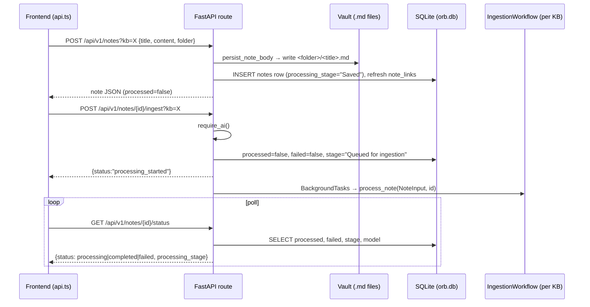
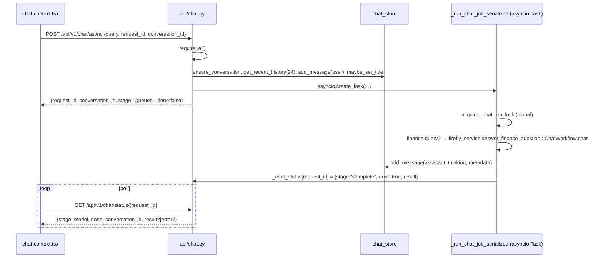

# Orb HTTP API Reference

**What this covers.** Every HTTP route exposed by the FastAPI backend (`backend/app`): method, exact path and mount prefix, query/path parameters, request body schema, response shape, status codes, side effects (files written, SQLite rows, background tasks, model loads, Firefly calls), concurrency behaviour, and the service functions each route calls. It also documents the cross-cutting conventions (`?kb=` resolution, `X-Request-Id`, CORS, error envelopes, polling patterns) and cross-checks the frontend client (`frontend/src/lib/api.ts`) against the backend route table. It does **not** describe the internals of the ingestion pipeline, retrieval loop, graph storage, or Firefly PHP bridge beyond what a caller needs to know — see the related docs.

**Related docs:** [Overview](01-overview.md) · [System architecture](02-system-architecture.md) · [Backend core & configuration](06-backend-core-and-configuration.md) · [Knowledge bases & vaults](08-knowledge-bases-and-vaults.md) · [Notes, wikilinks & vault files](09-notes-wikilinks-and-vault-files.md) · [Ingestion pipeline](10-ingestion-pipeline.md) · [Local models & inference](12-local-models-and-inference.md) · [Graph storage (Kuzu)](14-graph-storage-kuzu.md) · [Search indexes](15-search-indexes-qdrant-meilisearch.md) · [Retrieval & chat](16-retrieval-and-chat.md) · [Finance (Firefly)](17-finance-firefly.md) · [Frontend architecture](18-frontend-architecture.md) · [Configuration reference](21-configuration-reference.md) · [Desktop shell](04-desktop-shell.md)

---

## 1. Responsibilities & boundaries

The API layer **owns**:

- Route definitions, parameter parsing and Pydantic validation (`backend/app/api/*.py`, `backend/app/api_desktop.py`, `backend/app/schemas/*.py`).
- Translating service exceptions into HTTP status codes.
- Request-scoped concerns: the `X-Request-Id` trace header, CORS, KB resolution via `?kb=`, the AI-availability gate (`require_ai`).
- Scheduling background work (`BackgroundTasks`, `asyncio.create_task`) and keeping the in-memory chat job status table.
- A small amount of orchestration that has not been pushed into services (note deletion with graph/index cleanup in `api/notes.py`, KB emptying in `api/kb.py`, the Meilisearch content fallback for node detail in `api/graph.py`).

The API layer does **not** own: vault file semantics (`services/vault.py`, `services/vault_ops.py`, `services/note_files.py`), KB registry state (`services/kb_registry.py`), chat persistence (`services/chat_store.py`), the ingestion/chat workflows (`workflows/`), model downloading/loading (`services/local_models.py`, `services/multimodal_*`), or the Firefly proxy (`services/firefly_service.py`).

There is **no authentication or authorization** on any route. The API binds to loopback in the desktop build and trusts every caller.

---

## 2. Files

| Path | Purpose | Key exports |
|---|---|---|
| `backend/app/main.py` | FastAPI app factory: logging setup, router registration, CORS, trace middleware, startup/shutdown hooks | `app`, `request_trace_id` (ContextVar) |
| `backend/app/api/__init__.py` | Registers all routers in a fixed order (desktop router first) | `register_all_routers(app)` |
| `backend/app/api/deps.py` | `?kb=` → `KBContext` dependency | `get_kb` |
| `backend/app/api/health.py` | Liveness routes | `router` (`GET /`, `GET /health`) |
| `backend/app/api/settings.py` | Runtime LLM provider/model settings | `router`, `LLMSettings` |
| `backend/app/api/files.py` | Attachment upload (with ffmpeg audio transcode) and delete | `router`, `_transcode_to_m4a` |
| `backend/app/api/chat.py` | Conversations, sync chat, async chat job + status polling | `router`, `_chat_status`, `_chat_job_lock` |
| `backend/app/api/graph.py` | 3D graph export, node detail, entity autocomplete/scan, note entity subgraph | `router`, `ScanTextInput` |
| `backend/app/api/notes.py` | Notes CRUD, ingest, move, batch delete, legacy `/ingest` | `router`, `_note_response`, `_delete_note_impl` |
| `backend/app/api/vault.py` | Vault file move/delete/mkdir/list/local-path | `router` |
| `backend/app/api/admin.py` | Maintenance status, community/digest rebuilds, reset/reingest | `router`, `TemporalDigestInput` |
| `backend/app/api/kb.py` | KB list/create/rename/delete/empty | `router`, `CreateKBInput`, `RenameKBInput` |
| `backend/app/api_desktop.py` | Setup/paths, model download & load, notes graph (wikilinks), vault re-ingest, chat export, all Finance routes, `/vault-files` static serving | `router`, `PathsInput`, `DownloadModelsInput`, `Create*Input` finance models, `_finance_error` |
| `backend/app/schemas/chat.py` | `ChatTurn`, `CreateConversationInput`, `ChatInput` | wire schemas |
| `backend/app/schemas/note.py` | `CreateNoteInput`, `MoveNoteInput`, `MoveVaultFileInput`, `DeleteVaultFileInput`, `BatchDeleteNotesInput`, `MkdirInput` | wire schemas |
| `backend/app/schemas/extraction.py` | `NoteInput` (wire, used by `/ingest`) plus pipeline-internal `Node`, `ExtractedRelationship`, `Extraction` | LLM extraction schemas |
| `backend/app/schemas/__init__.py` | Re-exports the above | — |
| `frontend/src/lib/api.ts` | The only frontend HTTP client (a small `fetch` wrapper); one method per backend call | `api`, `isRequestCancelled`, `RequestOpts` |
| `frontend/src/lib/types.ts` | TypeScript shapes the frontend expects from responses | `Note`, `NoteStatus`, `ChatStatus`, `KnowledgeBase`, `Finance*`, `NotesGraphPayload`, `SetupStatus` |
| `frontend/src/lib/desktop.ts` | Tauri bridge helpers (pickers, `restartBackend`, `notifyIfUnfocused`); `revealInFolder` calls `POST /api/v1/desktop/reveal` | `getDesktopBridge`, `revealInFolder` |
| `frontend/vite.config.ts` | Dev-only proxy of `/api/v1`, `/vault-files`, `/health` to `API_PROXY_TARGET` (default `http://127.0.0.1:17401`) | `server.proxy` |

---

## 3. Cross-cutting conventions

### 3.1 App construction and router order

`backend/app/main.py` calls `setup_logging()` **before** any service import (so module-level `get_logger()` calls find logging configured), then builds `FastAPI(title="Orb API", version="1.0.0")` and calls `register_all_routers(app)`.

`backend/app/api/__init__.py` includes routers in this order: **desktop** (`api_desktop.router`), health, settings, credentials, models, files, chat, graph, notes, vault, admin, kb. No router has a prefix; every route spells out its full path. FastAPI matches routes in registration order, so the desktop router's literal paths (`/api/v1/notes/reingest-vault`, `/api/v1/graph/notes`, `/api/v1/graph/notes/{note_id}/neighbors`, `/api/v1/chat/conversations/{conversation_id}/export`) are matched before the parameterised routes in the domain routers. None of the current literal/parameter pairs actually collide (e.g. there is no `POST /api/v1/notes/{note_id}` that `POST /api/v1/notes/reingest-vault` could shadow), but **adding a `POST /api/v1/notes/{something}` route in `api/notes.py` would not shadow `reingest-vault` (desktop is first); adding a new literal path to `api/notes.py` that also matches a desktop parameterised route would be shadowed**. Keep this ordering in mind when adding routes.

### 3.2 Path prefixes

| Prefix | Routes | Reached from the browser via |
|---|---|---|
| `/api/v1/…` | Everything except the two below | Same origin: the API serves the built UI at `/` (desktop); the Vite dev server proxies `/api/v1` to 17401 |
| `/vault-files/{kb_id}/{path}` | Static vault attachment serving (`api_desktop.serve_vault_file`) | Same origin; Vite dev proxy |
| `/` and `/health` | Liveness | `/health` same origin / Vite proxy; `/` is shadowed by the UI mount when `frontend/dist` exists |

There is no shared prefix constant — every route spells out its full `/api/v1/...` path.

### 3.3 `?kb=` resolution (`api/deps.py:get_kb`)

Almost every route takes `kb: KBContext = Depends(get_kb)`. The dependency reads the query parameter `kb` (default `"default"`) and calls `kb_registry.get_kb_by_name(kb)`:

- `""` or `"default"` (case-insensitive) → the default KB context.
- Otherwise the value is lower-cased and compared to each registered KB's `name.lower()` **or** its `slug` (exact). First match wins.
- No match → **404** `{"detail": "Knowledge base '<kb>' not found"}`.

Notes:
- `get_kb` accepts a **name or slug**, never the UUID `id`. The KB management routes `DELETE /api/v1/kb/{kb_id}` and `PATCH /api/v1/kb/{kb_id}` take the **UUID** path parameter instead. `/vault-files/{kb_id}/…` accepts UUID **or** name/slug.
- The frontend omits `kb` entirely for the default KB (`withKb`/`kbQuery` in `api.ts`) and sends `?kb=<name>` otherwise.
- Routes that do not take `get_kb`: `GET /`, `GET /health`, `GET|PATCH /api/v1/settings`, `GET /api/v1/chat/status/{request_id}`, `GET /api/v1/chat/conversations/{id}/export`, `GET|POST /api/v1/kb`, `POST /api/v1/kb/delete-non-default`, `DELETE|PATCH /api/v1/kb/{kb_id}`, all `/api/v1/setup/*`, `/vault-files/*`.
- A `KBContext` exposes `kb_id`, `name`, `vault_path`, `qdrant`, `meili`, lazily-opened `graph` (Kuzu — raises `RuntimeError` if no Kuzu path), and `get_ingestion_workflow()` / `get_chat_workflow()` which construct per-KB workflow instances on first use.

### 3.4 `X-Request-Id` / trace id

`main.trace_id_middleware` reads the inbound `X-Request-Id` header (or generates a UUID4), stores it in the `request_trace_id` ContextVar for the duration of the request (loggers attach it to structured records), and echoes it back as the `X-Request-Id` response header on every response. Chat's `request_id` body field is a **separate** identifier (job id), not the trace id.

### 3.5 CORS

`CORSMiddleware` with `allow_origins = settings.CORS_ORIGINS.split(",")` (default: ports 3700/3701 and the legacy 17400 on `localhost` and `127.0.0.1`), optional `allow_origin_regex = settings.CORS_ALLOW_ORIGIN_REGEX`, `allow_credentials=True`, all methods and headers. CORS only matters when a browser calls the API origin directly; the desktop app and the Vite dev proxy are same-origin (see 3.9).

### 3.6 Error envelope

- Explicit errors use FastAPI's `HTTPException` → JSON `{"detail": <string>}` with the given status.
- One exception: `services/ai_gate.require_ai()` raises **503** with a **dict** detail: `{"detail": {"error": "ai_not_configured", "message": "AI is not configured. Notes, wikilinks, and finance still work. Open Setup to enable local models or a cloud provider."}}`.
- Pydantic validation failures → **422** `{"detail": [{"loc": [...], "msg": "...", "type": "..."}]}`.
- Unhandled exceptions → **500** with Starlette's plain-text `Internal Server Error` body (no JSON). Several routes have no `try/except` around service calls (all Finance `GET` list routes, note update/rename, KB create's `ensure_vault`), so infrastructure failures surface this way.
- No route sets a custom error schema or `response_model`; all responses are raw dicts/lists.

### 3.7 AI gate

`services/ai_gate.ai_is_configured()` returns `True` when anything is actually reachable — chat+embed GGUFs on disk (`gguf_paths_if_present()`), any cloud provider key in the credential store, or a non-empty `LLM_BASE_URL`. `require_ai()` raises the 503 above. Routes gated: `POST /api/v1/chat`, `POST /api/v1/chat/async`, `POST /api/v1/notes/{id}/ingest`, `POST /api/v1/ingest` (unless `skip_ingestion`), `POST /api/v1/admin/reingest-all`, `POST /api/v1/notes/reingest-vault`. Routes that silently degrade instead of erroring: `GET /api/v1/graph/entities/search` (returns `[]`), `POST /api/v1/graph/entities/note-subgraph` (returns nodes but no edges).

### 3.8 Background work and polling patterns

| Pattern | Used by | Behaviour |
|---|---|---|
| Starlette `BackgroundTasks` | `notes/{id}/ingest`, `/ingest`, `admin/reingest-all`, `notes/reingest-vault`, `admin/rebuild-communities`, `admin/build-temporal-digests`, `admin/reset-ingestion-data` | Tasks run **after the response is sent**, sequentially in the order added, on the request's event loop (sync callables are run in Starlette's threadpool). Ingestion tasks additionally serialise on `IngestionWorkflow._process_semaphore` (`INGESTION_PIPELINE_CONCURRENCY`, default 1). Progress is observed by polling `GET /api/v1/notes/{id}/status` or `GET /api/v1/admin/maintenance-status`. |
| `asyncio.create_task` + in-memory status dict | `POST /api/v1/chat/async` → `GET /api/v1/chat/status/{request_id}` | The job runs on the app event loop under a process-wide `asyncio.Lock` (`_chat_job_lock`), so at most one chat job executes at a time across all KBs; extra jobs report stage `"Waiting for current chat to finish"`. Status entries live in the module-level `OrderedDict` `_chat_status`; `_prune()` (run on every write and read) drops the oldest entries once there are more than 200 or the oldest is older than 1800 s. |
| `asyncio.to_thread` | Vault scans, Kuzu/Qdrant/Meili calls, model downloads/loads, Firefly PHP scripts | Keeps blocking I/O off the event loop; the HTTP request still waits for completion. |
| Synchronous long request | `POST /api/v1/setup/download-models`, `POST /api/v1/setup/start-local-llm`, `POST /api/v1/setup/start-multimodal-services` | Multi-GB downloads / model loads complete before the response returns. The frontend calls `download-models` with `timeout: 0`. |

There is **no streaming (SSE/WebSocket)** anywhere. "Streaming" chat in the UI is polling `chat/status`.

### 3.9 How the frontend reaches the API

- `frontend/src/lib/api.ts` builds every URL as `${API_BASE_URL}${path}` where `API_BASE_URL = (import.meta.env.VITE_API_URL ?? "/api/v1")`.
- **Desktop**: the API serves the Vite build at `/` (`FRONTEND_DIR`, default `frontend/dist`), so every call — uploads included — is same-origin with no proxy or body limit in between. `api.upload()` POSTs multipart to `/api/v1/upload` with a 10-minute timeout.
- **Dev** (`npm run dev`, Vite on 3700, or `ORB_URL=http://127.0.0.1:3700 cargo tauri dev`): `vite.config.ts` proxies `/api/v1`, `/vault-files` and `/health` to `API_PROXY_TARGET` (default `http://127.0.0.1:17401`), so the browser still sees one origin.
- Media (``, `<video>`, `fetchMediaObjectUrl` in `frontend/src/lib/utils.ts`) loads `/vault-files/<kb>/<rel>` from the same origin.
- Reveal-in-folder is an API call (`POST /api/v1/desktop/reveal`, `api_desktop.reveal_in_folder`): the path must be absolute and inside `DATA_DIR`, `MODELS_DIR` or a KB vault (400 / 403 / 404 otherwise); it runs `open -R` / `explorer /select,` / `xdg-open`.

### 3.10 Startup / shutdown side effects

`startup_event`: `init_db()` (SQLAlchemy `create_all` + ensure `ix_notes_kb_rel_path` + `_sqlite_repairs`), load `DATA_DIR/runtime_config.json` overrides and apply to `settings` (`provider`, `model`, `ingestion_model`, `base_url`), mark notes left mid-ingest by the previous run as `"Ingestion failed (interrupted)"`, then hand `_background_startup` to the default executor so `/health` answers immediately: `sync_embedding_infrastructure()` (best-effort Qdrant collection sizing; also heals stale GGUF selection paths and starts the `orb-mmproj` projector-download thread), `start_vault_watchers()` (best-effort), and `_migrate_stores()` (one-time per-KB store scrubs gated by `DATA_DIR/.stores-migrated-v1-<kb_id>`, see [14](14-graph-storage-kuzu.md)). `shutdown_event`: `stop_vault_watchers()`.

---

## 4. Route summary

Anchors point at the detailed sections below. `kb` = accepts `?kb=<name|slug>`.

### Health / status

| Method | Path | kb | Purpose | Anchor |
|---|---|---|---|---|
| GET | `/` | – | Greeting `{"message","status"}` | [#](#get-) |
| GET | `/health` | – | Liveness `{"status":"healthy"}` | [#](#get-health) |
| POST | `/api/v1/desktop/reveal` | – | Show a path in Finder / Explorer (allow-listed roots, see 3.9) | – |

### Setup / paths / models

| Method | Path | kb | Purpose | Anchor |
|---|---|---|---|---|
| GET | `/api/v1/setup/status` | – | Paths, model readiness | [#](#get-apiv1setupstatus) |
| GET | `/api/v1/setup/model-catalog` | – | Hardware profile + chat model options | [#](#get-apiv1setupmodel-catalog) |
| POST | `/api/v1/setup/download-models` | – | Download GGUFs (+ Qwen3-ASR, speaker models, Marlin, vision projector) — blocking | [#](#post-apiv1setupdownload-models) |
| POST | `/api/v1/setup/select-chat-model` | – | Persist model selection, resize Qdrant | [#](#post-apiv1setupselect-chat-model) |
| POST | `/api/v1/setup/start-multimodal-services` | – | Verify/install in-process multimodal deps | [#](#post-apiv1setupstart-multimodal-services) |
| GET | `/api/v1/setup/multimodal-status` | – | Qwen3-ASR / Marlin readiness | [#](#get-apiv1setupmultimodal-status) |
| POST | `/api/v1/setup/start-local-llm` | – | Download if needed + load chat GGUF in-process | [#](#post-apiv1setupstart-local-llm) |
| POST | `/api/v1/setup/paths` | – | Write `paths.json`, set default vault | [#](#post-apiv1setuppaths) |

### Settings (runtime LLM)

| Method | Path | kb | Purpose | Anchor |
|---|---|---|---|---|
| GET | `/api/v1/settings` | – | Effective provider/model/base_url | [#](#get-apiv1settings) |
| PATCH | `/api/v1/settings` | – | Update provider/model/base_url, persist to `runtime_config.json` | [#](#patch-apiv1settings) |

### Knowledge bases

| Method | Path | kb | Purpose | Anchor |
|---|---|---|---|---|
| GET | `/api/v1/kb` | – | List KBs (registry rows) | [#](#get-apiv1kb) |
| POST | `/api/v1/kb` | – | Create KB (201) | [#](#post-apiv1kb) |
| POST | `/api/v1/kb/empty` | kb | Wipe notes, vault, indexes, Firefly admin; keep KB | [#](#post-apiv1kbempty) |
| POST | `/api/v1/kb/delete-non-default` | – | Delete every non-default KB | [#](#post-apiv1kbdelete-non-default) |
| DELETE | `/api/v1/kb/{kb_id}` | – | Delete KB by UUID (204) | [#](#delete-apiv1kbkb_id) |
| PATCH | `/api/v1/kb/{kb_id}` | – | Rename KB by UUID | [#](#patch-apiv1kbkb_id) |

### Notes

| Method | Path | kb | Purpose | Anchor |
|---|---|---|---|---|
| POST | `/api/v1/notes` | kb | Create note (vault `.md` + row, no ingest) | [#](#post-apiv1notes) |
| GET | `/api/v1/notes` | kb | List notes (syncs vault first by default) | [#](#get-apiv1notes) |
| GET | `/api/v1/notes/{note_id}` | kb | Get one note with body | [#](#get-apiv1notesnote_id) |
| GET | `/api/v1/notes/{note_id}/status` | kb | Ingestion status (poll) | [#](#get-apiv1notesnote_idstatus) |
| PUT | `/api/v1/notes/{note_id}` | kb | Update body/title/created_at (renames file on retitle) | [#](#put-apiv1notesnote_id) |
| DELETE | `/api/v1/notes/{note_id}` | kb | Delete note + file + graph/index cleanup | [#](#delete-apiv1notesnote_id) |
| POST | `/api/v1/notes/batch-delete` | kb | Delete ≤100 notes | [#](#post-apiv1notesbatch-delete) |
| POST | `/api/v1/notes/{note_id}/move` | kb | Move note into folder | [#](#post-apiv1notesnote_idmove) |
| POST | `/api/v1/notes/{note_id}/ingest` | kb | Force (re)ingest one note | [#](#post-apiv1notesnote_idingest) |
| POST | `/api/v1/ingest` | kb | Legacy create+ingest | [#](#post-apiv1ingest) |
| POST | `/api/v1/notes/reingest-vault` | kb | Re-queue every note in KB | [#](#post-apiv1notesreingest-vault) |

### Vault files / folders

| Method | Path | kb | Purpose | Anchor |
|---|---|---|---|---|
| POST | `/api/v1/vault/move` | kb | Move any vault file, rewrite links | [#](#post-apiv1vaultmove) |
| POST | `/api/v1/vault/delete` | kb | Delete attachment, strip links | [#](#post-apiv1vaultdelete) |
| POST | `/api/v1/vault/mkdir` | kb | Create folder (+ `.keep`) | [#](#post-apiv1vaultmkdir) |
| GET | `/api/v1/vault/folders` | kb | Folder tree + attachments | [#](#get-apiv1vaultfolders) |
| GET | `/api/v1/vault/local-path` | kb | Resolve rel path / URL → absolute path | [#](#get-apiv1vaultlocal-path) |

### Uploads & file serving

| Method | Path | kb | Purpose | Anchor |
|---|---|---|---|---|
| POST | `/api/v1/upload` | kb | Multipart upload into `attachments/` (audio → m4a) | [#](#post-apiv1upload) |
| DELETE | `/api/v1/files/{file_key:path}` | kb | Delete attachment by key/URL | [#](#delete-apiv1filesfile_keypath) |
| GET | `/vault-files/{kb_id}/{file_path:path}` | – | Serve a vault file | [#](#get-vault-fileskb_idfile_pathpath) |

### Chat

| Method | Path | kb | Purpose | Anchor |
|---|---|---|---|---|
| GET | `/api/v1/chat/conversations` | kb | List conversations (≤50) | [#](#get-apiv1chatconversations) |
| POST | `/api/v1/chat/conversations` | kb | Create empty conversation | [#](#post-apiv1chatconversations) |
| GET | `/api/v1/chat/conversations/{conversation_id}/messages` | kb | List messages | [#](#get-apiv1chatconversationsconversation_idmessages) |
| DELETE | `/api/v1/chat/conversations/{conversation_id}` | kb | Soft-delete conversation | [#](#delete-apiv1chatconversationsconversation_id) |
| GET | `/api/v1/chat/conversations/{conversation_id}/export` | – | Export markdown/json (**currently broken**, see section) | [#](#get-apiv1chatconversationsconversation_idexport) |
| POST | `/api/v1/chat` | kb | Synchronous chat | [#](#post-apiv1chat) |
| POST | `/api/v1/chat/async` | kb | Start chat job, returns immediately | [#](#post-apiv1chatasync) |
| GET | `/api/v1/chat/status/{request_id}` | – | Poll job progress / result | [#](#get-apiv1chatstatusrequest_id) |

### Knowledge graph (Kuzu / Qdrant / Meili)

| Method | Path | kb | Purpose | Anchor |
|---|---|---|---|---|
| GET | `/api/v1/graph/3d/full` | kb | All nodes+edges with 3D positions | [#](#get-apiv1graph3dfull) |
| GET | `/api/v1/graph/3d/node/{node_id}` | kb | Node detail (contexts, facts, connections) | [#](#get-apiv1graph3dnodenode_id) |
| GET | `/api/v1/graph/entities/search` | kb | Entity name autocomplete | [#](#get-apiv1graphentitiessearch) |
| POST | `/api/v1/graph/entities/scan-text` | kb | Find entity mentions in text | [#](#post-apiv1graphentitiesscan-text) |
| POST | `/api/v1/graph/entities/note-subgraph` | kb | Mentioned entities + edges between them | [#](#post-apiv1graphentitiesnote-subgraph) |

### Notes graph (wikilinks, SQLite `note_links`)

| Method | Path | kb | Purpose | Anchor |
|---|---|---|---|---|
| GET | `/api/v1/graph/notes` | kb | All notes + wikilink edges (rebuilds by default) | [#](#get-apiv1graphnotes) |
| GET | `/api/v1/graph/notes/{note_id}/neighbors` | kb | One note + direct neighbours | [#](#get-apiv1graphnotesnote_idneighbors) |
| POST | `/api/v1/graph/notes/rebuild` | kb | Re-parse all wikilinks | [#](#post-apiv1graphnotesrebuild) |

### Admin / maintenance

| Method | Path | kb | Purpose | Anchor |
|---|---|---|---|---|
| GET | `/api/v1/admin/maintenance-status` | kb | Community/digest/ingestion job state | [#](#get-apiv1adminmaintenance-status) |
| POST | `/api/v1/admin/rebuild-communities` | kb | Background Leiden rebuild | [#](#post-apiv1adminrebuild-communities) |
| POST | `/api/v1/admin/build-temporal-digests` | kb | Background temporal digest build | [#](#post-apiv1adminbuild-temporal-digests) |
| POST | `/api/v1/admin/reset-ingestion-data` | kb | Wipe graph/vectors/index, mark notes unprocessed | [#](#post-apiv1adminreset-ingestion-data) |
| POST | `/api/v1/admin/reingest-all` | kb | Queue unprocessed/failed notes | [#](#post-apiv1adminreingest-all) |

### Finance (Firefly III proxy)

All under `/api/v1/finance/…`, all take `kb`. See [Finance routes](#finance-routes-api_desktoppy) for per-resource detail.

| Method | Path | Purpose | Anchor |
|---|---|---|---|
| GET | `/api/v1/finance/workspace` | Firefly readiness + KB administration info | [#](#finance-workspace) |
| POST | `/api/v1/finance/workspace` | Set primary currency (creates administration) | [#](#finance-workspace) |
| POST | `/api/v1/finance/reset-administration` | Destroy KB's Firefly user group + ledger | [#](#finance-workspace) |
| GET / POST | `/api/v1/finance/accounts` | List / create accounts | [#](#finance-accounts) |
| GET / POST | `/api/v1/finance/transactions` | List recent (≤40) / create | [#](#finance-transactions) |
| DELETE | `/api/v1/finance/transactions/{transaction_id}` | Delete transaction group | [#](#finance-transactions) |
| GET / POST | `/api/v1/finance/budgets` | List (with `days`) / create | [#](#finance-budgets) |
| GET / POST | `/api/v1/finance/categories` | List / create | [#](#finance-categories) |
| DELETE | `/api/v1/finance/categories/{category_id}` | Delete | [#](#finance-categories) |
| GET / POST | `/api/v1/finance/recurrences` | List / create | [#](#finance-recurrences) |
| DELETE | `/api/v1/finance/recurrences/{recurrence_id}` | Delete | [#](#finance-recurrences) |
| GET / POST | `/api/v1/finance/rule-groups` | List / create | [#](#finance-rule-groups-and-rules) |
| DELETE | `/api/v1/finance/rule-groups/{rule_group_id}` | Delete | [#](#finance-rule-groups-and-rules) |
| GET / POST | `/api/v1/finance/rules` | List / create | [#](#finance-rule-groups-and-rules) |
| DELETE | `/api/v1/finance/rules/{rule_id}` | Delete | [#](#finance-rule-groups-and-rules) |
| GET | `/api/v1/finance/search` | Search transactions/accounts | [#](#finance-search-summary-report) |
| GET | `/api/v1/finance/summary` | Totals + chart + recent txs | [#](#finance-search-summary-report) |
| GET | `/api/v1/finance/report` | Date-range report with charts | [#](#finance-search-summary-report) |

---

## 5. Request flow diagrams

### 5.1 Note create → ingest → poll



### 5.2 Async chat



---

## 6. Detailed route reference

Conventions in this section: "Body" lists JSON fields as `name: type (required|default)`. "Calls" names the service functions invoked. Status codes list only those raised explicitly plus the notable implicit ones.

### Health (`api/health.py`)

#### GET /

Returns `{"message": "Orb is online", "status": "active"}`. Logs at debug. No dependencies.

#### GET /health

Returns `{"status": "healthy"}`. Deliberately touches no KB, DB, or graph so it stays fast during heavy ingestion. It is the liveness probe the Tauri shell polls before showing the window; in dev the Vite server proxies `/health` to it.

---

### Setup / paths / models (`api_desktop.py`)

#### GET /api/v1/setup/status

No params. Calls `gguf_paths_if_present()` (`services/local_models.py`), `is_hf_snapshot_ready(multimodal_model_path(k))` for `asr` and `marlin` (`services/multimodal_models.py`), `resolve_default_vault_path()`, `kb_registry.get_kb_by_name("default")`, `ai_is_configured()`.

```json
{
  "data_dir": "/…/Orb",                 
  "models_dir": "/…/models",
  "paths_json": "/…/Application Support/Orb/paths.json",
  "default_vault_path": "/…/vault",      
  "active_vault_path": "/…/vault",       
  "ai_configured": true,
  "local_models_ready": true,
  "multimodal_ready": false,
  "database_backend": "sqlite",
  "llm_provider": "local"
}
```

`default_vault_path` comes from `paths.json`/env (`""` if unset); `active_vault_path` is what the default KB row actually points at. `ai_configured` is `ai_gate.ai_is_configured()`, derived from what is actually set up (GGUFs on disk, a provider key, or an endpoint URL). `multimodal_ready` requires both snapshots (the speaker-label models are optional).

#### GET /api/v1/setup/model-catalog

Query: `chat_id: str | None`. Calls `services/model_catalog.recommend_stack(chat_id)`. Response:

```json
{
  "hardware": {"ram_gb": 32.0, "usable_model_gb": 28.2, "platform": "darwin", "machine": "arm64", "accel": {"backend": "metal", "...": "..."}},
  "embed": {ModelOption},
  "reranker": {ModelOption},
  "chat_options": [{ModelOption, "fits_budget": true}, "..."],
  "suggested_chat": {ModelOption} | null,
  "selected_chat": {ModelOption} | null,
  "budget_note": "Usable ~28 GB of 32 GB RAM (backend=metal). …"
}
```

`ModelOption` is `dataclasses.asdict` of `model_catalog.ModelOption` (fields include `id`, `hf_path`, `embedding_dims`, size info — see [Local models](12-local-models-and-inference.md)). `selected_chat` reflects the `selection.chat_id` saved in the models manifest; `suggested_chat` is `chat_id` if valid, else the hardware recommendation. Pure read; no side effects.

#### POST /api/v1/setup/download-models

Body (optional, `DownloadModelsInput`): `include_multimodal: bool = true`, `chat_id: str | null`, `multimodal_only: bool = false`.

Behaviour:
1. If `multimodal_only`: `paths = gguf_paths_if_present() or {}` (no GGUF download). Else `ensure_chat_and_embed_models(on_progress, chat_id=chat_id)` in a thread — this **also** calls `save_selection(...)` which writes the manifest and `sync_embedding_infrastructure()` (resizes/creates Qdrant collections for the embed dims), then downloads chat, embed and reranker GGUFs via `ensure_gguf` into `MODELS_DIR/gguf` (staged on local SSD first). Failure → **500** `"GGUF download failed: …"`.
2. If `include_multimodal or multimodal_only`: `ensure_multimodal_models(include_marlin=True, on_progress)` downloads HF snapshots for Qwen3-ASR, the pyannote diarizer, the Qwen forced aligner and Marlin under `MODELS_DIR`. Errors are captured into `multimodal_error` (not raised); a gated Marlin repo is skipped with a progress entry. On the `multimodal_only` path the selected chat model's vision projector is fetched too (`ensure_mmproj`, reported as `multimodal.vision`).

Response:

```json
{
  "status": "ok",
  "chat": "/…/gguf/chat.gguf", "embed": "/…/gguf/embed.gguf", "reranker": "/…/gguf/rerank.gguf",
  "multimodal": {"asr": "/…", "diarizer": "/…", "aligner": "/…", "marlin": "/…", "vision": "/…/gguf/mmproj-….gguf"},
  "multimodal_error": null,
  "progress": [{"model": "chat", "percent": 42}, "… last 40 entries"],
  "warning": null
}
```

Blocking: the request lasts as long as the downloads (minutes to hours). The frontend sends this call without a timeout. Not idempotent-safe to run concurrently (two overlapping calls download the same files; `_atomic_place` protects the final move).

#### POST /api/v1/setup/select-chat-model

Body (`DownloadModelsInput`): only `chat_id` is used. **400** `"chat_id required"` if missing. Calls `resolve_selected_hf_paths(chat_id)` then `save_selection(chat_id, embed_id, reranker_id, embedding_dims=…)` — writes `selection` to the models manifest and resizes Qdrant collections (`sync_embedding_infrastructure`). No download. Response:

```json
{"status": "ok",
 "selection": {"chat_id": "...", "embed_id": "...", "reranker_id": "...", "embedding_dims": 1024},
 "infrastructure": {…sync_embedding_infrastructure result…} | null}
```

Changing the embed model invalidates existing vectors (logged warning: re-ingest required).

#### POST /api/v1/setup/start-multimodal-services

Query: `install_deps: bool = true`. Calls `services/multimodal_services.ensure_multimodal_services(install_deps=…)` in a thread. Despite the name, **no processes are started**: it checks the Qwen3-ASR snapshot exists (else returns `{"started": false, "mode": "in_process", "error": "Download Qwen3-ASR on the Models page first", "models": {"asr", "marlin"}, "paths": {...}}`), then `ensure_multimodal_python_deps(install=install_deps)` which may run `pip install --upgrade torch transformers>=5.7.0 …` **into the running API interpreter** (long, blocking). Success:

```json
{"started": true, "mode": "in_process", "already_running": false,
 "models": {"asr": true, "marlin": true},
 "deps": {"ok": true, "installed": false, "error": null},
 "services": {…services_ready()…},
 "message": "Qwen3-ASR / Marlin load in-process on demand (no sidecar HTTP services)."}
```

Any exception → **200** `{"started": false, "mode": "in_process", "error": "…"}` (not a 5xx). Not called by the frontend.

#### GET /api/v1/setup/multimodal-status

```json
{"mode": "in_process",
 "models": {"asr": true, "marlin": false},
 "services": {"mode": "in_process", "local_models": bool, "marlin": bool, "deps_ok": bool, "deps_error": null|"…", "runtime": {…multimodal_runtime.status()…}}}
```

`services.local_models` = deps importable **and** Qwen3-ASR ready. Importing torch/transformers for the check can take seconds the first time.

#### POST /api/v1/setup/start-local-llm

Body (`DownloadModelsInput`, optional): `chat_id`. Calls `ensure_chat_and_embed_models(None, chat_id)` (downloads if missing, same manifest/Qdrant side effects as `download-models`), then in a thread `local_llama_runtime.load(chat, embed)` (loads the chat GGUF in-process via llama-cpp-python, temporarily swaps in the embed model to probe its dimension, writes `runtime` + `selection.embedding_dims` to the manifest, restores chat) and `local_gguf_reranker.ensure_loaded()`. On success sets `llm_service.provider = "local"`, `llm_service.init_clients()`, `embedding_service.reconfigure()`.

Response on success is `LocalLlamaRuntime.load`'s dict plus reranker fields:

```json
{"loaded": true, "started": true, "engine": "llama-cpp-python", "backend": "metal",
 "n_gpu_layers": -1, "reason": "macOS arm64: prefer Metal", "install_hint": "…",
 "chat_model": "/…/chat.gguf", "embed_model": "/…/embed.gguf",
 "idle_unload_after": 300.0, "exclusive": true,
 "reranker": "/…/rerank.gguf", "reranker_loaded": true, "reranker_error": "…"}
```

On `RuntimeError` from load: **200** `{"started": false, "loaded": false, "reason": "…", "accel": detect_llama_backend()}`. Other exceptions → 500. Not called by the frontend (models are loaded lazily on first chat/ingest instead).

#### POST /api/v1/setup/paths

Body (`PathsInput`): `data_dir: str` (required), `models_dir: str` (required), `default_vault_path: str | null`.

Side effects, in order:
1. `save_paths_file(...)` — writes `paths.json` (location: `ORB_PATHS_FILE` env, else `<App Support>/Orb/paths.json`), resolving paths to absolute; an omitted `default_vault_path` keeps the existing value.
2. `sync_settings_paths(settings)` — updates `settings.DATA_DIR/MODELS_DIR/MODELS_PATH/KUZU_DB_PATH` in-process and creates the data layout (`kuzu/`, `qdrant/`, `meilisearch/`, `logs/`, `vaults/`, `bin/`). **SQLite/Qdrant engines created at import are not retargeted — a restart is required for a new `data_dir` to take full effect.**
3. `reconfigure_logging()`.
4. If `default_vault_path`: `ensure_vault()` (mkdir + `attachments/`) and `kb_registry.set_vault_path("default", path)` (updates the registry row and cached context).

Response: `{"status": "ok", "data_dir": "<abs>", "models_dir": "<abs>", "default_vault_path": "<abs or ''>"}`.

---

### Settings (`api/settings.py`)

#### GET /api/v1/settings

```json
{"provider": "local", "model": "gemma-…", "ingestion_model": "gemma-…", "base_url": "http://127.0.0.1:8080"}
```

`model` = `llm_service.get_chat_model() or settings.LLM_MODEL`; `ingestion_model` = `llm_service.get_ingestion_model() or settings.LLM_MODEL`.

#### PATCH /api/v1/settings

Body (`LLMSettings`, all optional): `provider`, `model`, `ingestion_model`, `base_url`. API keys are **never** accepted here — they go to `PUT /api/v1/credentials`, which keeps them in memory and lets the desktop shell hold the only on-disk copy as keychain ciphertext.

Behaviour: loads `runtime_config.json`, applies each non-null field to both the overrides dict and live `settings` (`LLM_PROVIDER`, `CHAT_MODEL`, `INGESTION_MODEL`, `LLM_BASE_URL`), `runtime_config.save(overrides)` (only `MUTABLE_KEYS` are written). If `provider` or `base_url` **changed**, `llm_service.provider = …lower()` and `llm_service.init_clients()` (rebuilds provider clients). Model-only changes need no reinit. Response mirrors GET but reads `settings.CHAT_MODEL or settings.LLM_MODEL` directly.

Gotcha: an empty string is treated as "set" (only `None` is skipped), but `provider_changed` uses truthiness so `provider: ""` is persisted without a client reinit.

---

### Knowledge bases (`api/kb.py`)

#### GET /api/v1/kb

Returns `{"knowledge_bases": kb_registry.list_kbs()}` — the raw registry metadata rows:

```json
{"knowledge_bases": [
  {"id": "default", "name": "default", "slug": "default", "vault_path": "/…", "kuzu_path": "/…/kuzu/kuzu_graph",
   "qdrant_col_cores": "node_cores", "qdrant_col_rels": "…", "qdrant_col_contexts": "…",
   "typesense_collection": "nodes", "created_at": "2026-…", "firefly_group_id": 3, "firefly_group_title": "Orb: default"}
]}
```

Non-default KBs have UUID `id`s and slug-prefixed collection names (`<slug>_node_cores`, `<slug>_nodes`). `typesense_collection` is the Meilisearch index name (legacy column name). Internal paths and Firefly group ids are exposed as-is.

#### POST /api/v1/kb

Status **201**. Body (`CreateKBInput`): `name: str` (required, non-blank), `vault_path: str | null`.

- **400** if name blank; **400** `"vault_path is required — choose where markdown notes for this KB are saved"` if `vault_path` blank (the frontend's `createKB(name, vaultPath?)` allows omitting it, but the server rejects).
- Calls `kb_registry.create_kb(name, vault_path=…)`: generates UUID, slug (`[^a-z0-9_-]` → `-`, spaces → `_`), `ensure_vault(vault_path)`, Kuzu file path `DATA_DIR/kuzu/<slug>/kuzu_graph`, inserts `knowledge_bases` row, builds and caches a `KBContext` (Qdrant/Meili services are created lazily on first use; Kuzu opened lazily).
- `ValueError` → 400; any other exception → 500 `"Failed to create knowledge base: …"`.

Response: `{"id": "<uuid>", "name": "...", "vault_path": "/abs", "message": "Knowledge base '<name>' created. Use ?kb=<name> to target it."}`.

#### POST /api/v1/kb/empty

Query `kb`. No body. Wipes everything in the KB but keeps the registry row:

1. `firefly_service.destroy_kb_administration(kb)` (PHP script deletes the Firefly user group; best-effort, logged).
2. `_purge_kb_sql_notes` — `DELETE FROM note_links WHERE kb_id`, `DELETE FROM notes WHERE kb_id`, commit. Returns note count.
3. In threads, each best-effort: `kb.graph.wipe_all_nodes()` (`MATCH (n:Node) DETACH DELETE n`), `kb.qdrant.reset_all()`, `kb.meili.reset_all()`.
4. `clear_vault_contents(vault_path)` — **removes every file and folder inside the vault directory** (not just Orb's notes), then recreates `attachments/`. On failure falls back to `ensure_vault`.

Response:

```json
{"status": "emptied", "kb_id": "…", "name": "…", "notes_removed": 12, "vault_path": "/…",
 "message": "Emptied knowledge base '…': notes, vault files, indexes, and Firefly administration removed. The KB itself remains."}
```

Unlike `delete_kb`, there is **no protection for external vault folders** (OneDrive/NAS): emptying a KB whose vault points at a user folder deletes that folder's contents.

#### POST /api/v1/kb/delete-non-default

No params. For every registry entry except `default`: destroy Firefly administration (best-effort), purge SQL notes/links, `kb_registry.delete_kb(kid, delete_vault_files=True, wipe_indexes=True)`. Per-KB errors are collected, not raised.

```json
{"removed": [{"id": "…", "name": "…", "vault_path": "…"}], "errors": [{"id": "…", "error": "…"}],
 "removed_count": 1, "message": "Deleted 1 knowledge base(s). Default KB was kept."}
```

#### DELETE /api/v1/kb/{kb_id}

Path `kb_id` = **UUID**. Status **204** (empty body) on success. **400** for `default`; **404** if unknown. Order: destroy Firefly administration (best-effort) → purge SQL notes/links → `kb_registry.delete_kb(..., delete_vault_files=True, wipe_indexes=True)`: closes Kuzu, deletes the registry row, deletes the three Qdrant collections and the Meili index, deletes the Kuzu file (+`.wal`) only if it lives under `DATA_DIR/kuzu`, and `rmtree`s the vault **only if it is under `DATA_DIR/vaults`** (external folders are kept and logged).

#### PATCH /api/v1/kb/{kb_id}

Path `kb_id` = UUID. Body (`RenameKBInput`): `name: str`. **400** if blank or if `kb_id == "default"` (`rename_kb` raises `ValueError`); **404** if unknown. Updates `name` in the registry row and cached context (slug and UUID unchanged — `?kb=` by the **old name** stops working, by slug keeps working). Then best-effort `firefly_service.sync_kb_group_title(kb_id, name)` (PHP script renames the Firefly group to `Orb: <name>`). Response `{"id": "<uuid>", "name": "<new>"}`.

---

### Notes (`api/notes.py`, plus `reingest-vault` in `api_desktop.py`)

**Note object** (`_note_response`), returned by create/get/list/update and inside move:

```json
{"id": "uuid", "content": "<markdown body read from vault file>", "title": "My note" | null,
 "rel_path": "Folder/My note.md" | null, "created_at": "2026-09-02T10:00:00+00:00" | null,
 "updated_at": "…" | null, "processed": false, "failed": false,
 "processing_stage": "Saved" | "Queued for ingestion" | "…" | null, "processing_model": null | "…", "kb_id": "default"}
```

`content` is read from `<vault_path>/<rel_path>` via `note_files.note_body` — `""` when the file is missing; there is no SQLite fallback (a non-empty legacy `notes.content` is written to the vault file and blanked by `sync_vault_notes`). The SQLite `content` column is always kept empty by `persist_note_body`.

`created_at` is a Pydantic `datetime | None` (ISO 8601, `Z` and offsets accepted; anything else → **422**); a naive datetime is taken as UTC (`_aware`).

#### POST /api/v1/notes

Body (`CreateNoteInput`): `title: str | null`, `content: str = ""`, `created_at: datetime | null`, `folder: str | null` (vault-relative, e.g. `"Life/Daily Log"`).

Side effects: `persist_note_body(note, kb, content, title, folder)` → `unique_md_path` picks `<folder>/<sanitised title>.md` (or `Untitled.md`; suffixes ` 2`, ` 3`… on collision; `..` segments in `folder` are dropped), writes the file (marking it as a self-write so the vault watcher ignores it for 12 s), inserts the `notes` row with `processing_stage="Saved"`, `processed=False`; `refresh_note_links` parses `[[wikilinks]]` into `note_links`; commit. **No ingestion.** Response: note object. Errors: 422 on bad body; OS errors → 500.

#### GET /api/v1/notes

Query: `search: str | null` (ILIKE on `title` **or** `rel_path` — bodies are not searched), `processed: bool | null`, `failed: bool | null`, `sync_vault: bool = true`.

When `sync_vault` is true (default, and the frontend never sets it false) the route first runs `vault_sync.sync_vault_notes(db, kb)`: walks every `*.md` under the vault (skipping hidden dirs and `attachments/`), creates a `notes` row (`title` = filename stem, `processing_stage="Saved"`) for each file with no row, adopts moved root-level files by title, and fills blank titles. Errors are logged and swallowed. Then selects notes for the KB ordered `created_at DESC` and serialises them **reading every body from disk** in a worker thread. Response: JSON array of note objects (no pagination).

#### GET /api/v1/notes/{note_id}

**404** if not found **in this KB**. Response: note object.

#### GET /api/v1/notes/{note_id}/status

Lightweight poll (no body read). **404** unknown; **503** `"Database temporarily unavailable, retry shortly"` on `TimeoutError`.

```json
{"id": "…", "processed": false, "failed": false, "status": "processing", "processing_stage": "Extracting entities", "processing_model": "gemma-…"}
```

`status` = `completed` if `processed`, else `failed` if `failed`, else `processing` — so a never-ingested note (`stage="Saved"`) also reports `processing`. Clients must look at `processing_stage` to distinguish.

#### PUT /api/v1/notes/{note_id}

Body (`CreateNoteInput`): `content`, `title`, `created_at` (`folder` ignored). **404** if not in KB.

Side effects in order:
1. `persist_note_body(note, kb, content, title=<stripped or None>)` — rewrites the vault file at the existing `rel_path`; updates `title` column if provided.
2. If `title` is present (not `null`): `vault_ops.rename_note_file_for_title` — when the sanitised title differs from the current file stem (case-insensitively), calls `move_vault_file` to rename the `.md` in place (uniquified), rewrites markdown attachment refs and `[[wikilinks]]` across **all** notes in the KB (re-reading and re-writing every note body), commits. Unhandled `FileNotFoundError`/`ValueError` here → 500.
3. `created_at` set if given (naive → UTC); `updated_at = now`.
4. Stage normalisation: if not processed and the stage is not user-queued (`Queued…`/`Starting…`), stages containing `pending`, starting with `External`/`Changed on disk`, or empty are reset to `"Saved"`. **Autosave never triggers ingestion.**
5. `refresh_note_links`, commit, refresh. Response: note object.

The frontend's `updateNoteOnUnload` sends this PUT with `fetch(..., keepalive: true)` for bodies < 60 kB.

#### DELETE /api/v1/notes/{note_id}

Delegates to `_delete_note_impl`. Idempotent: unknown id → `{"status": "deleted", "id": …, "orphans_removed": 0, "already_gone": true}` (200, not 404).

Steps: read body (thread) → collect `attachments/…` refs from markdown links/images → `delete_note_file` (best-effort) → delete `note_links` rows where source **or** target is the note → delete `notes` row → **commit** → best-effort graph cleanup: Cypher query for entity nodes referenced only by this note (orphans), `DETACH DELETE` the note node (`kind='note'`), `qdrant.delete_node`/`meili.delete_node` for the note and each orphan, `DETACH DELETE` each orphan → `remove_upload` for each referenced attachment. Every post-commit step logs and continues on failure. Response `{"status": "deleted", "id": "…", "orphans_removed": 2}`.

Attachments referenced by **other** notes are still deleted if this note referenced them (no reference counting).

#### POST /api/v1/notes/batch-delete

Body (`BatchDeleteNotesInput`): `ids: string[]`. **400** if empty after trimming or > 100. Runs `_delete_note_impl` per id sequentially, catching exceptions per note.

```json
{"deleted": ["id1"], "failed": [{"id": "id2", "error": "…"}], "deleted_count": 1, "failed_count": 1}
```

#### POST /api/v1/notes/{note_id}/move

Body (`MoveNoteInput`): `folder: str = ""` (`""` = vault root). **404** unknown/wrong KB; **409** destination exists (`FileExistsError`); **400** for `FileNotFoundError`/`ValueError` (note has no `rel_path`, `..` in folder). Calls `vault_ops.move_note_to_folder` → `move_vault_file(current, <folder>/<same filename>)`. Response:

```json
{"from": "Old/Note.md", "to": "New/Note.md", "note_id": "…", "links_rewritten": 3, "note": {note object}}
```

#### POST /api/v1/notes/{note_id}/ingest

`require_ai()` (503). **404** unknown/wrong KB. Sets `processed=False, failed=False, processing_stage="Queued for ingestion", processing_model=None`, commits, then `BackgroundTasks.add_task(kb.get_ingestion_workflow().process_note, NoteInput(content=<body>, created_at=<iso>, title=<title or None>), note_id)`. Always force re-ingests. Response `{"note_id": "…", "status": "processing_started", "message": "Note ingestion has been queued"}`.

`process_note` (`workflows/ingestion.py`): `ingestion_tracker.begin_ingestion()` → stage `"Queued for ingestion"` → wait for semaphore slot → `"Starting ingestion"` → ingestion agent (multimedia enrichment, LLM extraction, Kuzu/Qdrant/Meili writes) → mark processed → maybe queue Leiden recompute → `end_ingestion`. Models stay resident afterwards; the idle watcher (`ORB_MODEL_IDLE_SECONDS`, default 5 min) unloads them.

#### POST /api/v1/ingest

Legacy combined endpoint for batch scripts. Body (`NoteInput`): `content: str` (required), `created_at: str | null`, `title: str | null`, `skip_ingestion: bool = false`. `require_ai()` unless `skip_ingestion`. `created_at` is parsed with `datetime.fromisoformat` (naive → UTC); a non-ISO string → **422** `"created_at: …"`.

Creates the row and vault file **without a title** (`persist_note_body(new_note, kb, content)` — file becomes `Untitled.md`/`Untitled N.md`, `title` column `NULL`; the `title` field is only forwarded to the pipeline, which may set it later). Stage `"Queued for ingestion"` or `"Saved"`. Refreshes wikilinks, commits, then queues `process_note` unless skipped (filling `created_at` on the `NoteInput` if absent).

```json
{"note_id": "…", "status": "processing_started" | "saved_without_ingestion", "content": "…", "created_at": "…", "processed": false}
```

#### POST /api/v1/notes/reingest-vault

(`api_desktop.py`.) `require_ai()`. Selects **all** notes in the KB, sets `processed=False, failed=False, processing_stage="Queued for vault re-ingest", processing_model=None`, commits; reads all bodies in a thread; queues one `process_note` BackgroundTask per note. Response `{"status": "queued", "count": N}`. Compare `admin/reingest-all`, which only queues unprocessed/failed notes.

---

### Vault files / folders (`api/vault.py`)

All require `kb.vault_path`; otherwise **400** `"No vault configured"` (except `folders`, which returns empties). Paths are vault-relative, forward-slash normalised; `..` segments → 400; `safe_vault_join` rejects escapes (400 `"Path escapes vault"`).

#### POST /api/v1/vault/move

Body (`MoveVaultFileInput`): `from_rel: str`, `to_rel: str`. Calls `vault_ops.move_vault_file`. Errors: `FileExistsError` → **409**, `FileNotFoundError` → **404** (`"Source not found: …"`), `ValueError` → **400** (`"from_rel and to_rel are required"`, `"Invalid path"`, `"Cannot move across the attachments/ boundary"`, `"Path escapes vault"`).

**Boundary:** attachments live only under `attachments/`. A path under `attachments/` (file or folder) may only move to another path under `attachments/`, and nothing outside (notes, note folders) may move into it — either direction is the 400 above. Moves *within* `attachments/` (subfolders) and note moves between note folders are unrestricted. Moving a note does not move its attachments (links are vault-root-relative).

Behaviour: destination is uniquified (`unique_rel_path` appends ` 2`, ` 3`… before the suffix, so **409 is effectively unreachable** except under a race); marks both paths as self-writes; `shutil.move`; loads all notes of the KB; if the source is a `.md` with a matching note row, updates `rel_path` (title kept unless blank) and builds a `WikilinkResolver` from the pre-move note set; then for **every** note rewrites markdown link targets (`](old)` → `](new)`, including `/vault-files/<kb>/…` and percent-encoded variants) and, for moved notes, repoints `[[wikilinks]]` (bare names stay bare unless now ambiguous, path-style become the new path); writes changed bodies; commits.

```json
{"from": "attachments/a.png", "to": "attachments/Papers/a.png", "note_id": null | "…", "links_rewritten": 2}
```

`to` may differ from the request if uniquified. Same source and destination → 200 with `links_rewritten: 0`.

#### POST /api/v1/vault/delete

Body (`DeleteVaultFileInput`): `rel_path: str`. Calls `vault_ops.delete_vault_file`. **400** for `..`, empty, or a `.md` path (`"Use note delete for markdown files"`); **404** if missing. Unlinks the file, then `strip_refs_across_notes` removes every markdown image/link whose whole target is the path (canonical relative form, raw or percent-encoded, with or without a legacy `/vault-files/<any kb>/` prefix — no basename matching) from every note in the KB; blank runs are collapsed only in notes where a link was removed, so untouched notes are not rewritten; commits.

```json
{"deleted": "attachments/a.png", "links_stripped": 1}
```

#### POST /api/v1/vault/mkdir

Body (`MkdirInput`): `path: str`. **400** `"Invalid folder path"` if empty or contains `..`. `mkdir -p` then writes an empty `.keep` file so empty folders survive vault scans (listings skip dotfiles). OS error → **500**. Response `{"path": "Life/Daily Log", "status": "ok"}`.

#### GET /api/v1/vault/folders

No vault → `{"folders": [], "attachments": [], "vault_name": "", "vault_path": ""}`. Otherwise (in a thread) **creates `attachments/` if missing**, then:

```json
{"folders": ["Life", "Life/Daily Log", "attachments"],
 "attachments": [{"name": "a.png", "rel_path": "attachments/Papers/a.png"}],
 "vault_name": "vault", "vault_path": "/abs/vault"}
```

`folders`: every non-hidden directory and all its ancestors (sorted). `attachments`: every non-hidden file anywhere under `attachments/` (sorted by path). Non-markdown files outside `attachments/` are not a concept — the v3 vault sweep (09 §4.3) moves any it finds into `attachments/`.

#### GET /api/v1/vault/local-path

Query: `rel: str` (required) — vault-relative path, `/vault-files/<kb>/<path>` URL, or `vault-files/<kb>/<path>`. Normalises via `local_storage.vault_rel_from_url` (also maps any `…/attachments/x` to `attachments/x`). **400** invalid; **404** `"File not found on disk"`. Used by the UI's "Reveal in Finder" action.

```json
{"rel_path": "attachments/a.png", "local_path": "/abs/vault/attachments/a.png", "vault_path": "/abs/vault", "exists": true}
```

---

### Uploads & file serving (`api/files.py`, `api_desktop.py`)

#### POST /api/v1/upload

Multipart form, field `file` (required). Optional **query** param `folder` — the vault-relative folder of the note the upload belongs to (`Cloud Computing`, `Natural Language Processing/Prosit 1`; omit/empty for root notes). **400** `"No vault configured for this knowledge base"`; **400** `"Invalid folder"` when `folder` is absolute or contains `..`; **400** `"Path escapes vault"` from `safe_vault_join`.

- Reads the whole file into memory.
- If `content_type ∈ {audio/webm, audio/ogg, audio/opus, audio/x-matroska}` or extension ∈ `{webm, ogg, opus}`: `_transcode_to_m4a` runs `ffmpeg -y -i in -c:a aac -b:a 128k out.m4a` in a thread (60 s timeout). On any failure (ffmpeg missing, timeout, non-zero exit) the original bytes/extension are kept. The stored name hint becomes `recording.<ext>`.
- `local_storage.store_upload(vault, filename_hint, bytes, kb.kb_id, folder)` → `vault.save_attachment(…, "attachments/<folder>")`: writes `attachments/<folder>/<sanitised stem ≤120>-<8 hex><ext>` (flat `attachments/<name>` when `folder` is empty) and, for `.mp4/.m4v/.mov`, re-muxes with `ffmpeg -movflags +faststart` (best-effort, 120 s timeout). Failure → **500** `"Upload failed: …"`.

```json
{"filename": "voice.webm", "url": "/vault-files/default/attachments/Cloud Computing/recording-1a2b3c4d.m4a",
 "rel_path": "attachments/Cloud Computing/recording-1a2b3c4d.m4a", "key": "<same as rel_path>", "status": "success"}
```

`rel_path`/`key` are identical. The `/vault-files/<kb_id>/` prefix uses `kb.kb_id` (`default` or a UUID), which is why `vault_rel_from_url` strips any KB segment. No size limit server-side and no proxy in the desktop path (3.9).

#### DELETE /api/v1/files/{file_key:path}

`file_key` may be a vault-relative key (`attachments/x.png`) or a `/vault-files/<kb>/…` URL. **400** without vault. Calls `local_storage.remove_upload` which silently does nothing for invalid/escaping/missing paths. Always **200** `{"status": "deleted", "file_key": "…"}`. Not used by the frontend (it uses `POST /api/v1/vault/delete`, which also strips links).

#### GET /vault-files/{kb_id}/{file_path:path}

Not under `/api/v1`. `kb_id` resolved by `kb_registry.get_kb(kb_id)` (UUID) **or** `get_kb_by_name(kb_id)` (name/slug). **404** `"KB not found"` (no KB or no vault), **404** `"File not found"` (path escapes vault or not a regular file). Returns `FileResponse(full, media_type=…)` with an explicit type from `_MEDIA_CONTENT_TYPES` for known audio/video/image/text extensions (Python's `mimetypes` guesses `.m4a` as `audio/mp4a-latm`, which browsers refuse) and Starlette's guess otherwise; Range requests are supported. Serves **any** file in the vault, including `.md` notes and dotfiles — there is no allowlist.

---

### Chat (`api/chat.py`, export in `api_desktop.py`)

Persistence: `services/chat_store.py` (tables `chat_conversations`, `chat_messages`). Conversation dict: `{"id", "kb_id", "title", "created_at", "updated_at"}`. Message dict: `{"id", "conversation_id", "role": "user"|"assistant", "content", "thinking": str|null, "sources": [{"id", "title"}], "created_at"}`. The `metadata` JSON column (`rewritten_query`, `context_count`, `sources`) is written on assistant messages; only `sources` is surfaced, as the message's `sources` field (`[]` when absent, so user messages and finance answers carry an empty list).

#### GET /api/v1/chat/conversations

`chat_store.list_conversations(kb.kb_id)` — up to **50**, `deleted_at IS NULL`, ordered `updated_at DESC`. Response: array of conversation dicts.

#### POST /api/v1/chat/conversations

Body optional (`CreateConversationInput`): `title: str | null` (default `"New Chat"`). Inserts a row; response: conversation dict. Not used by the frontend (chat creates conversations implicitly).

#### GET /api/v1/chat/conversations/{conversation_id}/messages

**404** `"Conversation not found"` if the conversation does not exist in this KB or is soft-deleted. Response: array of message dicts ordered `created_at ASC`.

#### DELETE /api/v1/chat/conversations/{conversation_id}

Soft delete (`deleted_at = now`) scoped to the KB. **404** if no row updated. Response `{"status": "deleted", "conversation_id": "…"}`. Messages are retained.

#### GET /api/v1/chat/conversations/{conversation_id}/export

Query: `format: str = "markdown"` (`"json"` for JSON). Reads the rows through `chat_store.list_messages(conversation_id)` and returns `[{"role","content","created_at"}]` or a `text/markdown` body of `## <role>

<content>` blocks. It ignores `?kb=` and does no KB ownership check (conversation ids are UUIDs). Pinned by `test_chat_export.py`.

#### POST /api/v1/chat

Synchronous. Body (`ChatInput`): `query: str` (min length 1), `request_id: str | null` (client-chosen job id; UUID4 generated if absent), `conversation_id: str | null`.

Flow: `require_ai()` → `chat_store.ensure_conversation(conversation_id, kb_id)` (reuses if it exists in this KB, else **creates a new one** — an id from another KB silently starts a fresh conversation) → `get_recent_history` (last `CHAT_HISTORY_MAX_MESSAGES`=24 messages, user/assistant only, **before** the new message) → `add_message(user)` → `maybe_set_title_from_first_message` (if title is still `"New Chat"`, use the first 72 chars, ellipsised at 69) → `_answer_chat_query` → `add_message(assistant, thinking, metadata)` → return.

`_answer_chat_query`: if `firefly_service.looks_like_finance_query(query)` (keyword match on `balance`, `transaction(s)`, `spending`, `spent`, `income`, `expense(s)`, `budget`, `cash`, `account(s)`, `finance`, `financial`, `report`, `net worth`, `savings`) it runs `ChatWorkflow.retrieve_for_query` (retrieval only, up to 12 docs) then `firefly_service.answer_finance_question(query, kb, note_docs, rewritten_query)`; otherwise `ChatWorkflow.chat(query, history, progress_callback)`.

Response (workflow result + ids):

```json
{"query": "…", "rewritten_query": "…", "answer": "…", "sources": [{"id": "…", "title": "…"}], "thinking": "…" | null,
 "context": [{"text": "…", "score": 0.83, "original_obj": {"name": "…", "…": "…"}, "linked_notes": [{"id": "…", "title": "…"}]}, "…"],
 "request_id": "…", "conversation_id": "…", "assistant_message_id": "…"}
```

`sources` (`schemas.chat.ChatSource`) lists the unique notes linked from the retrieved context, SQLite title preferred (else `"Untitled Note"`); the answer text carries no citation block. The finance path returns the same keys (without `sources`) plus `information_needs: [query]`, `discovered_entities: {}`, and appends `{"source": "finance", "summary": {…}, "kb_id": "…"}` to `context`. Progress for sync chat is also written into `_chat_status[request_id]` (`{"stage", "model"}`) so a client could poll while waiting. Errors: 503 (AI), 422, or 500 (stage recorded as `"Failed"`). Not used by the frontend.

#### POST /api/v1/chat/async

Same body as `POST /api/v1/chat`. `require_ai()`; ensures conversation, snapshots history, **adds the user message and sets the title before returning**, seeds `_chat_status[request_id] = {"stage": "Queued", "model": None, "done": False, "conversation_id"}`, then `asyncio.create_task(_run_chat_job_serialized(...))` (task kept in `_chat_tasks` to avoid GC). Response:

```json
{"request_id": "…", "conversation_id": "…", "stage": "Queued", "model": null, "done": false}
```

`_run_chat_job_serialized`: if `_chat_job_lock` is held, stage becomes `"Waiting for current chat to finish"`; then under the lock `_run_chat_job` runs `_answer_chat_query`, stores the assistant message, and writes the final status. On exception: `{"stage": "Failed", "done": true, "error": "<str(exc) or class name>"}` (the user message remains in the conversation with no assistant reply).

#### GET /api/v1/chat/status/{request_id}

No `kb`. Returns `{"request_id": …, **_chat_status.get(request_id, {"stage": "Waiting", "model": None, "done": False})}`:

```json
{"request_id": "…", "stage": "Complete", "model": null, "done": true, "conversation_id": "…",
 "result": {…full chat result as in POST /api/v1/chat…}}
```

or `{"…", "stage": "Failed", "done": true, "error": "…"}`. Unknown ids look like a pending job (`"Waiting"`), never 404. Intermediate `stage`/`model` values come from the workflow's `progress_callback` (e.g. `"Planning retrieval"` with model `"Gemma4"`, `"Selecting best evidence"`, `"Formatting answer"`, `"Checking finance data and notes"`). The frontend (`chat-context.tsx`) polls this until `done`.

---

### Knowledge graph (`api/graph.py`)

#### GET /api/v1/graph/3d/full

`kb.graph.get_full_3d_graph()` in a thread. Queries Kuzu for all `kind IN ['indexable','note']` nodes, all `community` nodes, all `MEMBER_OF` memberships (with level), computes positions via `utils/graph_layout.compute_solar_positions` (positions are **computed per request**, not read from stored `pos_x/pos_y/pos_z`), and collects `SEMANTIC_REL` edges between indexable/note nodes (**`LIMIT 4000`**) plus one `MEMBER_OF` edge per membership (unlimited).

```json
{"nodes": [{"node_id": "…", "name": "…", "node_type": "person" | "community" | "…", "description": "",
            "community_id": "…" | null, "x": 1.2, "y": -0.4, "z": 3.1}],
 "edges": [{"source": "…", "target": "…", "type": "works_at" | "MEMBER_OF" | ""}]}
```

`description` is always `""` here (detail is fetched on demand). The frontend type declares a `facts: string[]` field that the backend does not emit. Nodes with empty names are dropped.

#### GET /api/v1/graph/3d/node/{node_id}

`kb.graph.get_node_detail(node_id)` (thread): Kuzu row (indexable/note, else community) + Qdrant content (`get_nodes_content_by_ids`, then `get_node_content_by_id` fallback) + 1-hop connections (`get_node_connections`, limit 16, `SEMANTIC_REL|REFERENCES` both directions) + notes referencing the node (`get_notes_referencing_node`, limit 8). **404** `"Node not found"`.

Post-processing in the route: if neither `description` nor `isolated_contexts` came back, fall back to the Meilisearch document (`kb.meili.get_node`): its `isolated_contexts` array becomes `isolated_contexts` (a bare string, from a document indexed before contexts were stored as a list, is wrapped as one entry) and its first entry fills an empty `description`/`summary`. Related notes/connections whose name is blank/`Unknown`/`Untitled…` are displayed as `"Untitled note"` (`"Untitled"` for non-note connections) — no lookup and no write-back; legacy note nodes were named once at startup by `main._migrate_stores`.

```json
{"node_id": "…", "name": "…", "node_type": "person", "description": "…", "isolated_contexts": ["…"],
 "facts": ["…"], "domain": "…" | null, "status": "…" | null, "community_id": "…" | null, "community_name": "…" | null,
 "summary": "<same as description>", "themes": [], "member_count": 0,
 "connections": [{"node_id": "…", "name": "…", "kind": "indexable" | "note", "relationship": "works_at" | "REFERENCES", "direction": "outgoing" | "incoming"}],
 "related_notes": [{"note_id": "…", "name": "…"}]}
```

#### GET /api/v1/graph/entities/search

Query: `q: str` (required), `limit: int = 5`. Returns `[]` if `q` < 2 chars after trim or AI not configured. `kb.meili.search_nodes(q, limit*2)` then keeps hits whose payload has `node_id` and `name` and whose `type` is not `note`/`community`, up to `limit`.

```json
[{"node_id": "…", "name": "Clara Sydney", "node_type": "person"}]
```

#### POST /api/v1/graph/entities/scan-text

Body (`ScanTextInput`): `text: str`. Returns `[]` for < 3 chars. Candidates: regex `\b([A-Z][a-z]+(?:\s+[A-Z][a-z]+)+)\b` (multi-word capitalised phrases) and `\b([A-Z][a-z]{3,})\b` (single capitalised words ≥ 4 letters); at most **40** candidates (set order — non-deterministic which 40 when more exist); each is searched in Meili with limit 2; a hit is kept if its name occurs in the text case-insensitively and it is not a note/community. Does **not** check `ai_is_configured` (Meili unavailable simply yields no hits). Response: same shape as search. Used by the editor to highlight entity mentions.

#### POST /api/v1/graph/entities/note-subgraph

Body (`ScanTextInput`). Calls `scan_entities_in_text` then, if AI configured, for each entity `kb.graph.get_related_nodes(name, max_depth=1)` (Qdrant name→id resolution + two directed 1-hop Cypher queries) and keeps neighbours that are also in the scanned set, de-duplicated by unordered pair.

```json
{"nodes": [{"id": "…", "title": "…", "type": "person"}],
 "edges": [{"source": "…", "target": "…", "type": "works_at" | "related"}],
 "center_id": null}
```

Same `NotesGraphPayload` shape the notes-graph routes use, so the Connected panel can render either.

---

### Notes graph / wikilinks (`api_desktop.py`, `services/wikilinks.py`)

Payload (`notes_graph_payload`): every note in the KB becomes `{"id", "title": title or rel_path or id, "type": "note", "rel_path"}`; every `note_links` row becomes an edge `{"source": source_note_id, "target": target_note_id or "missing:<target_title>", "type": "wikilink"}`; unresolved targets add phantom nodes `{"id": "missing:<title>", "title": <title>, "type": "missing", "rel_path": null}`.

#### GET /api/v1/graph/notes

Query: `rebuild: bool = true`. When true, first `rebuild_kb_note_links(db, kb)`: loads all notes, builds one `WikilinkResolver`, re-reads **every note body from disk**, deletes and re-inserts each note's outgoing `note_links`, commits. Then returns `{"nodes": [...], "edges": [...]}`. The default rebuild exists because vault-imported notes never pass through the create/update routes; it is O(vault size) per call.

#### GET /api/v1/graph/notes/{note_id}/neighbors

Query: `rebuild: bool = false`. Returns the full payload filtered to the note plus direct neighbours (either direction) and edges among them, with `"center_id": note_id`. Unknown `note_id` yields `{"nodes": [], "edges": [], "center_id": "…"}` (no 404). Used by the notes editor's Connected panel; the vault watcher keeps `note_links` current so rebuild defaults off.

#### POST /api/v1/graph/notes/rebuild

Runs `rebuild_kb_note_links` and returns `{"notes": N, "links": M}`.

---

### Admin / maintenance (`api/admin.py`)

#### GET /api/v1/admin/maintenance-status

`kb.get_ingestion_workflow().get_maintenance_status()`:

```json
{"community_detection": {"running": false, "pending_nodes": 0, "needed": false, "timer_armed": false, "idle_seconds": 120},
 "temporal_digests": {"running": false},
 "ingestion": {"active": 0},
 "healthy": true}
```

`community_detection.running` OR-s the per-KB workflow flag with the tracker's flag; everything under `ingestion` and the pending/needed/timer fields come from `services/ingestion_tracker.ingestion_tracker.get_status_snapshot(kb_id)` — the singleton keeps its counters, timers and flags per KB, so the numbers are for the KB in `?kb=`. `healthy` is a constant `true`. The frontend sidebar polls this.

#### POST /api/v1/admin/rebuild-communities

No body. `BackgroundTasks.add_task(wf.rebuild_leiden_communities)` (sync function → threadpool after the response). Always allowed regardless of `COMMUNITY_DETECTION_ENABLED` (that flag only gates the automatic post-ingestion trigger). A new request while a run is active signals the active run to cancel and takes over. Response `{"status": "started", "message": "Leiden community recompute triggered. Check server logs for progress."}`. Progress: `maintenance-status`.

#### POST /api/v1/admin/build-temporal-digests

Body optional (`TemporalDigestInput`): `period: "month" | "week" | "year" | null` (default `settings.TEMPORAL_DIGEST_PERIOD`, `"month"`). Queues `wf.build_temporal_digests(period)`. Response `{"status": "started", "message": "Temporal digest build triggered (period=month). …"}`.

**Discrepancy:** the route docstring says the manual endpoint is always available, but `IngestionWorkflow.build_temporal_digests` returns `0` immediately when `settings.TEMPORAL_DIGESTS_ENABLED` is `False` (the default), and also refuses to start while any ingestion is active. The route still answers `"started"`.

#### POST /api/v1/admin/reset-ingestion-data

No body. Immediately `UPDATE notes SET processed=0, failed=0 WHERE kb_id=…` and commit, then queues a sync `_wipe_stores` task: `kb.graph.wipe_all_nodes()`, `kb.qdrant.reset_all()`, `kb.meili.reset_all()`. Vault files and note rows are untouched. Response `{"status": "started", "message": "Ingestion data cleared. Notes marked as unprocessed. Store wipes running in background."}`. Because the wipe runs after the response, a `reingest-all` issued immediately may race with it.

#### POST /api/v1/admin/reingest-all

`require_ai()`. Selects notes in the KB where `processed == False OR failed == True`, queues `process_note` per note (bodies read **inline** on the event loop via `note_body` — unlike `reingest-vault`). Response `{"status": "queued", "notes_queued": N, "message": "Queued N notes for ingestion."}`. Does not reset `processing_stage` before queuing (the pipeline sets it).

---

### Finance routes (`api_desktop.py`)

All Finance routes proxy to the embedded Firefly III instance through `services/firefly_service.firefly_service`. Shared behaviour:

- **Scoping:** every call goes through `FireflyService._run_scoped(kb, cb)`: acquires the **global** `_scope_lock` (all finance requests across all KBs are serialised), resolves or creates the KB's Firefly *administration* (user group titled `Orb: <kb name>`; group id cached in `knowledge_bases.firefly_group_id`; creation and switching run PHP scripts via `_run_php`, ~1 s Laravel bootstrap, skipped when the group is unchanged), sets `_active_group_id`, and stamps `user_group_id=<group>` on every Firefly REST request. List routes additionally filter rows by ids that a PHP helper reports for that group (`_ids_for_group`), because several Firefly endpoints are still user-wide.
- **Errors:** mutating routes wrap the service call in `try/except` and map through `_finance_error`: `ValueError` → **400** (validation), `RuntimeError` (including `FireflyHTTPError`, which carries Firefly's status and message) → **502**, anything else → **500**. **`GET` list routes and `summary`/`workspace GET` have no wrapper**: a Firefly failure there is an unhandled exception → plain 500. `get_workspace` and `status` catch internally and return `ready: false`.
- **Bodies:** typed Pydantic models for workspace/accounts/transactions/budgets/categories/recurrences (422 on shape errors); **plain `dict`** for rule-groups and rules (missing keys become defaults and fail with 400 from the service, or pass silently).
- Dates: `YYYY-MM-DD` strings are accepted; when a datetime is required the service appends `T12:00:00+00:00`.

#### Finance: workspace

`GET /api/v1/finance/workspace` → `get_workspace(kb)`. First `status()`: `{"ready": false, "status": "disabled"}` if `FIREFLY_BASE_URL` unset, `"bootstrapping"` if no API token yet, `"auth_mismatch"`/`"error"`/`"starting"` on request failure; if ready, fetches `/api/v1/currencies/primary` and `/api/v1/user-groups` under scope. Response (ready):

```json
{"exists": true, "ready": true, "status": "ready", "scope": "kb", "kb_id": "…", "kb_name": "…",
 "firefly_group_id": 3, "currency": "USD", "administration_title": "Orb: default",
 "firefly_url": "http://127.0.0.1:17412", "detail": "Finance is scoped to the knowledge base \"…\" via embedded Firefly administration #3."}
```

Not ready: `{"exists": false, "ready": false, "status": "…", "detail": "…", "scope": "kb", "kb_id", "kb_name", "firefly_url"}`. Calling GET creates the administration as a side effect when Firefly is ready.

`POST /api/v1/finance/workspace` body (`CreateWorkspaceInput`): `currency: str = "USD"` (exactly 3 chars). → `set_primary_currency`: enables/creates the currency, `POST /currencies/{code}/primary`, verifies, returns the same ready-workspace shape. 400 on bad code / 502 on Firefly errors.

`POST /api/v1/finance/reset-administration` → `destroy_kb_administration(kb)`: runs the PHP destroy script for the group, detaches the mapping in the registry, clears the cached `groupId` in the Firefly runtime file if it matched. Response `{"status": "reset", "kb_id": "…", "result": {"destroyed": true, "group_id": 3} | {"destroyed": false, "reason": "no_group"}, "message": "Finance data for this knowledge base was cleared. …"}`.

#### Finance: accounts

`GET /api/v1/finance/accounts` → `list_accounts`: four Firefly list calls (`type=asset|expense|revenue|liability`, `limit=100`, `date=today`), filtered to the group's account ids, then enriches zero balances of expense/revenue accounts from the last 100 transactions. Account shape:

```json
{"id": "12", "name": "Checking", "account_type": "asset", "opening_balance": 0.0, "balance": 1234.5, "currency": "USD", "archived": false}
```

`POST /api/v1/finance/accounts` body (`CreateAccountInput`): `name` (1–255), `account_type = "asset"` (`asset|expense|revenue|liability|cash`; `liabilities` alias accepted), `opening_balance: float = 0.0`, `currency: str | null`. Asset accounts get `account_role=defaultAsset`; liabilities get `liability_type=debt`, `debit`, zero interest. Returns the normalised account. 400 on invalid type/blank name.

#### Finance: transactions

`GET /api/v1/finance/transactions?account_id=…` → `list_recent_transactions(kb, account_id)`: limit fixed at **40**; with `account_id` uses `/accounts/{id}/transactions` (returns `[]` if the account is not in the group); groups filtered by `user_group`, split into per-journal rows sorted by date desc. Row shape:

```json
{"id": "<group_id>:<idx>", "group_id": "88", "user_group": 3, "date": "2026-09-01T12:00:00+00:00", "description": "Coffee",
 "amount": 4.5, "type": "withdrawal", "account_id": "12", "account_name": "Checking", "counterparty_name": "Cafe",
 "category": "Food" | null, "currency_code": "USD", "journal_id": "91"}
```

`POST /api/v1/finance/transactions` body (`CreateTransactionInput`): `description` (1–1000), `amount` (> 0), `account_id`, `type = "withdrawal"` (`withdrawal|deposit|transfer`), `date`, `counterparty_name`, `transfer_account_id`, `category`, `budget_id` (withdrawals only), `currency`. Validates the account belongs to this KB's group (400 otherwise); resolves currency from the account or Firefly's primary; for withdrawals/deposits matches `counterparty_name` against existing expense/cash or revenue accounts by name, else creates by name (`destination_name`/`source_name`, defaults `"Cash expense"`/`"Income"`); transfers require `transfer_account_id`. Posts with `apply_rules: true`. Returns the **list** of normalised rows for the created group.

`DELETE /api/v1/finance/transactions/{transaction_id}` accepts either `"<group>:<idx>"` or a bare group id (splits on `:`), deletes the whole group. `{"ok": true}`.

#### Finance: budgets

`GET /api/v1/finance/budgets?days=30` (`1 ≤ days ≤ 365`, 422 otherwise) → `list_budgets`: window `[today-(days-1), today]`, filtered by group. Shape: `{"id", "name", "active", "spent": <abs sum>, "currency", "auto_budget_amount", "auto_budget_period", "notes"}`.

`POST /api/v1/finance/budgets` body (`CreateBudgetInput`): `name` (1–255), `amount: float | null` (> 0 if given), `currency`. With an amount, creates an auto-budget (`reset`, monthly) and best-effort a budget limit for the current month. Returns the normalised budget.

#### Finance: categories

`GET /api/v1/finance/categories` → `[{"id", "name", "notes"}]`. `POST` body (`CreateCategoryInput`): `name` (1–255), `notes`. `DELETE /api/v1/finance/categories/{category_id}` → `{"ok": true}`.

#### Finance: recurrences

`GET /api/v1/finance/recurrences` → `[{"id", "title", "type", "description", "amount", "currency", "first_date", "repeat_until", "active", "repetition_type", "repetition_moment", "source_name", "destination_name"}]`. `POST` body (`CreateRecurrenceInput`): `title`, `amount` (> 0), `type = "withdrawal"`, `source_id`, `destination_id`, `description`, `first_date` (default tomorrow), `repeat_freq = "monthly"` (`daily|weekly|monthly|yearly`; the repetition `moment` is derived: weekday number, day of month, or the date). `DELETE /api/v1/finance/recurrences/{recurrence_id}`.

#### Finance: rule groups and rules

`GET /api/v1/finance/rule-groups` → `[{"id", "title", "description", "order", "active"}]`. `POST` body (dict): `title` (required → 400), `description`. `DELETE /api/v1/finance/rule-groups/{rule_group_id}`.

`GET /api/v1/finance/rules` → `[{"id", "title", "description", "rule_group_id", "trigger", "active", "strict", "triggers": [{"type","value"}], "actions": [{"type","value"}]}]`. `POST` body (dict): `title`, `rule_group_id`, `trigger_type = "description_contains"`, `trigger_value` (required), `action_type = "add_tag"`, `action_value` (required), `trigger = "store-journal"`, `description`. Creates a single-trigger, single-action strict rule. `DELETE /api/v1/finance/rules/{rule_id}`.

#### Finance: search, summary, report

`GET /api/v1/finance/search?query=…&kind=transactions|accounts` (query required; other kinds → 400) → `{"kind", "query", "results": [transaction rows | account rows]}` (Firefly search, limit 50, group-filtered).

`GET /api/v1/finance/summary?days=30` (1–365) → `summary`: accounts, last 100 transaction groups filtered to the window, totals by type, asset balance (asset + liability accounts), balance chart:

```json
{"days": 30, "start": "2026-08-04", "end": "2026-09-02", "asset_balance": 1234.5, "income_total": 500.0,
 "expense_total": 120.0, "transfer_total": 0.0, "net_flow": 380.0, "chart": <Firefly chart data> | null,
 "accounts": [account rows], "recent_transactions": [≤12 transaction rows], "kb_id": "…", "kb_name": "…"}
```

Totals only consider the most recent 100 transaction groups.

`GET /api/v1/finance/report?start=YYYY-MM-DD&end=YYYY-MM-DD` (defaults: end = today, start = end − 29 days; malformed dates → `ValueError` → 400) → `{"start", "end", "basic": {…filtered /summary/basic…}, "category_chart", "budget_chart", "balance_chart", "accounts", "kb_id", "kb_name"}`. Chart series are filtered to the group's category/budget ids and account names.

---

## 7. Wire schemas (Pydantic) at a glance

| Model (`backend/app/schemas/…` or router) | Fields |
|---|---|
| `ChatInput` | `query: str (min 1)`, `request_id: str\|None`, `conversation_id: str\|None` |
| `CreateConversationInput` | `title: str\|None` |
| `ChatTurn` (internal history item) | `role: str`, `content: str` |
| `CreateNoteInput` | `title: str\|None`, `content: str = ""`, `created_at: datetime\|None`, `folder: str\|None` |
| `MoveNoteInput` | `folder: str = ""` |
| `MoveVaultFileInput` | `from_rel: str`, `to_rel: str` |
| `DeleteVaultFileInput` | `rel_path: str` |
| `BatchDeleteNotesInput` | `ids: list[str] = []` |
| `MkdirInput` | `path: str = ""` |
| `NoteInput` (`schemas/extraction.py`) | `content: str`, `created_at: str\|None`, `title: str\|None`, `skip_ingestion: bool = False` |
| `LLMSettings` (`api/settings.py`) | `provider`, `model`, `ingestion_model`, `base_url` (all `str\|None`) |
| `TemporalDigestInput` (`api/admin.py`) | `period: str\|None` |
| `CreateKBInput` / `RenameKBInput` (`api/kb.py`) | `name: str`, `vault_path: str\|None` / `name: str` |
| `ScanTextInput` (`api/graph.py`) | `text: str` |
| `PathsInput` (`api_desktop.py`) | `data_dir: str`, `models_dir: str`, `default_vault_path: str\|None` |
| `DownloadModelsInput` | `include_multimodal: bool = True`, `chat_id: str\|None`, `multimodal_only: bool = False` |
| `CreateWorkspaceInput` | `currency: str = "USD"` (len 3) |
| `CreateAccountInput` | `name (1–255)`, `account_type = "asset"`, `opening_balance = 0.0`, `currency` |
| `CreateTransactionInput` | `description (1–1000)`, `amount (>0)`, `account_id (min 1)`, `type = "withdrawal"`, `date`, `counterparty_name`, `transfer_account_id`, `category`, `budget_id`, `currency` |
| `CreateBudgetInput` | `name (1–255)`, `amount (>0)\|None`, `currency` |
| `CreateCategoryInput` | `name (1–255)`, `notes` |
| `CreateRecurrenceInput` | `title`, `amount (>0)`, `type = "withdrawal"`, `source_id`, `destination_id`, `description`, `first_date`, `repeat_freq = "monthly"` |

`Node`, `ExtractedRelationship`, `Extraction` in `schemas/extraction.py` are **not** wire schemas; they normalise LLM output during ingestion (shape unwraps such as `{extraction|data|result: …}`, bare lists, Gemma-style `[nodes, rels]`, string items; `relationship_type` is lower-cased and coerced to `related_to` when not in `RELATIONSHIP_TYPES`). See [Ingestion pipeline](10-ingestion-pipeline.md).

---

## 8. Frontend ↔ backend cross-check (`frontend/src/lib/api.ts`)

Every `api.*` method maps to an existing route. Mapping and notes:

| `api.ts` method | Route | Notes |
|---|---|---|
| `startChat` | `POST /chat/async` | `conversation_id` sent as `undefined` (omitted) when null |
| `getChatStatus` | `GET /chat/status/{id}` | no `kb` |
| `listChatConversations` | `GET /chat/conversations` | |
| `getChatMessages(id, kb)` | `GET /chat/conversations/{id}/messages?kb=` | sends `kb` |
| `deleteChatConversation(id, kb)` | `DELETE /chat/conversations/{id}?kb=` | sends `kb` |
| `exportChat` | `GET /chat/conversations/{id}/export` | backend route is broken (500) — see 6 |
| `upload` | `POST /upload` | direct-to-API origin via bridge; 10 min timeout |
| `getNotes` / `getNote` / `getNoteStatus` | `GET /notes`, `/notes/{id}`, `/notes/{id}/status` | all send `kb` |
| `createNote` / `updateNote` / `updateNoteOnUnload` / `deleteNote` / `batchDeleteNotes` / `moveNote` / `ingestNote` | notes routes | |
| `moveVaultFile` / `deleteVaultFile` / `listVaultFolders` / `mkdirVaultFolder` / `resolveVaultLocalPath` | vault routes | |
| `getGraph3DFull` / `getNodeDetail` | graph 3d routes | TS type for `getGraph3DFull` declares `facts` which the backend omits |
| `searchEntities` / `scanTextEntities` / `getNoteEntitySubgraph` | graph entity routes | |
| `getNotesGraph` / `getNoteNeighbors` / `rebuildNotesGraph` | notes-graph routes | `getNotesGraph` triggers the default full rebuild every call |
| `listKBs` / `createKB` / `renameKB` / `deleteKB` / `emptyKB` / `deleteAllNonDefaultKBs` | kb routes | `createKB` allows omitting `vault_path` but the server requires it |
| `getSetupStatus` / `getModelCatalog` / `saveSetupPaths` / `downloadModels` / `selectChatModel` / `getMultimodalStatus` | setup routes | |
| `reingestVault` | `POST /notes/reingest-vault` | |
| `getLLMSettings` / `updateLLMSettings` | settings | |
| `getMaintenanceStatus` / `rebuildCommunities` / `buildTemporalDigests` / `resetIngestionData` / `reingestAll` | admin | `buildTemporalDigests` sends `{period: null}` when unset |
| Finance: workspace (get/create/reset), accounts (list/create), transactions (list/create/delete), summary, report, budgets (list/create), categories (list/create/delete), recurrences (list/create/delete), rule-groups (list/create/delete), rules (list/create/delete), search | finance routes | |

**Backend routes with no frontend caller:** `GET /`, `GET /health` (infrastructure), `POST /api/v1/chat` (sync), `POST /api/v1/chat/conversations`, `POST /api/v1/ingest`, `DELETE /api/v1/files/{key}`, `POST /api/v1/setup/start-local-llm`, `POST /api/v1/setup/start-multimodal-services`. The frontend also loads `/vault-files/…` URLs directly (media tags and `fetchMediaObjectUrl` in `frontend/src/lib/utils.ts`).

**Frontend calls with no backend route:** none.

Every `api.ts` method that omits `kb` relies on the server default of `"default"`; every method that addresses a KB-scoped resource sends it.

---

## 9. Invariants, constraints, and locked decisions

- **Paths are literal.** No `APIRouter(prefix=…)`; Add new routes with the full `/api/v1/...` string.
- **Desktop router registers first.** Literal desktop paths win over parameterised domain routes.
- **`?kb=` is name-or-slug; `/kb/{kb_id}` is UUID.** Never pass a UUID as `?kb=`.
- **Notes bodies live on disk.** Every note-returning route reads the vault file; `notes.content` stays empty. Do not write bodies to SQLite.
- **Autosave (`PUT /notes/{id}`) must never start ingestion.** Ingestion is only triggered by `/notes/{id}/ingest`, `/ingest`, `reingest-all`, `reingest-vault`.
- **Vault deletes must go through `safe_vault_join`.** `_delete_note_impl` deliberately does not fall back to raw path joins when the safe delete fails.
- **One chat job at a time.** `_chat_job_lock` serialises `chat/async` jobs process-wide; `AsyncSessionLocal` must be used from the app event loop, hence `asyncio.create_task` rather than a thread.
- **One ingestion pipeline at a time per KB** (`INGESTION_PIPELINE_CONCURRENCY = 1`) so in-process GGUF/HF models, extraction, and graph writes do not overlap.
- **Firefly calls are globally serialised** by `_scope_lock`; every request carries `user_group_id`; list results are additionally filtered by PHP-reported ids. Never call the Firefly REST API without the KB scope.
- **`delete_kb` never removes vaults outside `DATA_DIR/vaults`** or Kuzu files outside `DATA_DIR/kuzu`. (`kb/empty` does not have this protection — see gotchas.)
- **API keys never travel through the API.** `PATCH /settings` and `runtime_config.MUTABLE_KEYS` exclude them.
- **`X-Request-Id` is echoed on every response**; log lines carry it via the ContextVar.

---

## 10. Failure modes and edge cases

| Situation | Behaviour |
|---|---|
| Kuzu path misconfigured / DB locked | `kb.graph` raises `RuntimeError` on first access → 500 on graph/admin routes; notes, vault, chat listing, finance keep working (graph is opened lazily). |
| Qdrant / Meilisearch down | Graph 3D and node detail still return Kuzu data with empty descriptions; entity search returns `[]`; note delete logs and continues; `kb/empty` logs and continues. |
| AI not configured | 503 `ai_not_configured` on chat/ingest; entity search `[]`; subgraph without edges. |
| ffmpeg missing | Uploads stored untranscoded (`webm`/`ogg` kept); MP4 faststart skipped. |
| Firefly not started / token missing | `GET /finance/workspace` returns `ready: false` with a status string; other finance routes → 502 (`RuntimeError`) or unhandled 500 on GET lists. |
| Chat job crashes | `status` reports `stage: "Failed"`, `error`; the user message is persisted, no assistant reply. |
| Unknown `request_id` on status poll | Looks like `stage: "Waiting", done: false` forever. |
| `sync_vault_notes` failure in `GET /notes` | Logged, list still returned from SQLite. |
| DB timeout on status poll | 503 with retry hint. |
| Note delete: file already gone / graph error | Row still deleted; each cleanup step best-effort. |
| `reset-ingestion-data` then immediate `reingest-all` | Wipe runs after the first response; the two can interleave. |

---

## 11. Gotchas & non-obvious behaviours

2. `POST /api/v1/kb/empty` `rmtree`s **everything** in the vault folder, including files Orb did not create, even for external (OneDrive/NAS) vaults. `DELETE /api/v1/kb/{id}` is the one with the external-vault guard.
3. `GET /api/v1/vault/folders` **creates** `attachments/`. `GET /api/v1/notes` **inserts** note rows for unseen `.md` files. `GET /api/v1/graph/notes` **rewrites** `note_links` for the whole KB. `GET /api/v1/finance/workspace` **creates** a Firefly administration.
4. Any chat query containing `account`, `report`, `cash`, `balance`, etc. (e.g. "notes about my Google account") is routed to the finance answerer, which calls Firefly and formats a ledger-centric prompt.
5. `GET /notes/{id}/status` returns `status: "processing"` for notes that were merely saved and never queued.
6. `POST /api/v1/ingest` ignores `title` for the row/filename; the note is created as `Untitled.md`.
7. `_chat_status` keeps full results in memory until `_prune()` evicts them (more than 200 entries, or older than 1800 s) — a finished job's result can disappear from `chat/status` after 30 minutes.
8. `maintenance-status.ingestion` and community timer fields are process-wide, not per KB.
9. `build-temporal-digests` reports `"started"` even when `TEMPORAL_DIGESTS_ENABLED=false` makes the job a no-op.
10. Every frontend method that addresses a KB-scoped resource sends `kb`; omission means the default KB on purpose.
11. `PUT /notes/{id}` with a new title rewrites **every** note body in the KB (reads + conditional writes) — O(vault) per rename.
12. `POST /vault/move` may return a different `to` than requested (uniquified); clients must use the returned value.
13. `/vault-files/{kb}/…` serves any regular file in the vault, notes included, with no auth.
14. `DELETE /api/v1/files/{key}` always returns 200 even when nothing was deleted.
15. `POST /api/v1/kb` returns **201**; `DELETE /api/v1/kb/{id}` returns **204** with no body — callers must not expect JSON.
16. `download-models`, `start-local-llm`, `start-multimodal-services` are long blocking requests; `start-multimodal-services` can `pip install` into the running interpreter.
17. Finance list routes are unwrapped: Firefly errors there produce plain-text 500s, not the `{"detail": …}` envelope.
19. `list_transactions`' limit (40) and `summary`'s 100-group window are hard-coded; totals are approximate for busy ledgers.
20. Unknown `note_id` on `/graph/notes/{id}/neighbors` returns an empty graph, not 404.

---

## 12. Extension points / how to modify safely

- **Add a KB-scoped route:** define it in the matching `backend/app/api/<domain>.py` with the full path string, take `kb: KBContext = Depends(get_kb)`, keep blocking work in `asyncio.to_thread`, map service exceptions to `HTTPException`, and add a one-line method to `frontend/src/lib/api.ts` using `withKb`/`kbQuery`. Update the summary table above.
- **Add a new router module:** create `backend/app/api/<name>.py` with `router = APIRouter()` and register it in `register_all_routers` (mind the ordering rule in 3.1).
- **Add a Finance resource:** add a `_normalize_<x>` + `list_/create_/delete_` trio in `services/firefly_service.py` using `_list_scoped_resources`/`_run_scoped`, then thin routes in `api_desktop.py` wrapped with `_finance_error`. Prefer a Pydantic body over `dict`.
- **Add a long-running job:** follow `chat/async` (task + status dict) if the client needs a result, or `BackgroundTasks` if progress is visible through existing state (note flags, maintenance status).
- **Change response shapes:** the frontend types in `frontend/src/lib/types.ts` are hand-maintained; there is no OpenAPI codegen. FastAPI's auto docs at `/docs` reflect only the Pydantic bodies, not the dict responses.
- **New runtime setting:** add the key to `runtime_config.MUTABLE_KEYS`, `apply_to_settings`, and `LLMSettings`; never accept secrets.

---

## 13. History / rationale

- `68494b7` ("Kuzu/Typesense migration") introduced the `X-Request-Id` trace middleware alongside structured logging.
- `3f21e08` shipped the Docker-free desktop app and created `api_desktop.py` for setup/finance/notes-graph routes; `fbcafe7` ("Align codebase with Orb desktop product…") split the former monolithic `api.py` into `backend/app/api/*.py`, added `register_all_routers`, and introduced the serialised async chat job (`_chat_job_lock`) so chat runs on the app loop that owns `AsyncSessionLocal`.
- `f8f527f` ("Harden security and fix data-loss and perf issues…") added `safe_vault_join` enforcement on `/vault-files`, restricted Kuzu/vault cleanup to `DATA_DIR`, moved per-note vault reads off the event loop (`asyncio.to_thread` in `GET /notes`, `reingest-vault`, `kb/empty`), and slug-sanitised KB names.
- The API serves the UI itself since the Tauri migration; the earlier Next.js proxy (and its upload-size workarounds) is gone.
- `GET /api/v1/graph/notes` rebuilds by default because vault-imported notes never pass through the create/update routes; the neighbours endpoint defaults to no rebuild because it is called on every editor navigation (comment in `api_desktop.py`).

---

## 14. Per-KB overrides: LLM and finance

A per-knowledge-base LLM override lives in `backend/app/api/kb.py`, `backend/app/services/kb_registry.py` (`LLM_PROVIDERS`, `effective_llm_config`, `set_llm_config`, `KBContext.llm`, `KBContext.has_llm_override`; columns `llm_provider`, `llm_model`, `llm_ingestion_model` on `knowledge_bases`, all nullable; NULL = inherit `Settings`). Scope is chat + ingestion only; embeddings, reranking and multimodal stay system-wide because Qdrant vector dimensions are shared across KBs.

### 14.1 `GET /api/v1/kb` (changed)

Each row now carries `effective_llm`:

```json
{
  "knowledge_bases": [
    {
      "id": "…", "name": "…", "slug": "…", "vault_path": "…", "kuzu_path": "…",
      "qdrant_col_cores": "…", "typesense_collection": "…", "created_at": "…",
      "llm_provider": null, "llm_model": null, "llm_ingestion_model": null,
      "effective_llm": {
        "provider": "local",
        "model": "gemma-4-e4b",
        "ingestion_model": null,
        "inherited": true
      }
    }
  ]
}
```

`effective_llm` is `effective_llm_config(row)`: the KB's pinned values layered over `Settings.LLM_PROVIDER` / `CHAT_MODEL` / `INGESTION_MODEL`; `inherited` is `true` when nothing is pinned.

### 14.2 `GET /api/v1/kb/{kb_id}/llm`

Path param: `kb_id` — the KB **id** (UUID or literal `default`), not the slug. 404 if unknown (except `default`).

Response:

```json
{
  "kb_id": "…",
  "override": { "provider": null, "model": null, "ingestion_model": null },
  "effective": { "provider": "local", "model": "gemma-4-e4b", "ingestion_model": null, "inherited": true },
  "providers": ["local", "openai_compat", "openai", "gemini", "anthropic", "huggingface"],
  "local_models": [ { "id": "gemma-4-e4b", "label": "Gemma 4 E4B", "size_gb": 3.1 } ]
}
```

`local_models` lists only chat GGUFs already on disk (`model_catalog.downloaded_chat_models()`): a KB can pin only models that are downloaded; there are no per-KB downloads.

### 14.3 `PATCH /api/v1/kb/{kb_id}/llm`

Body (`KBLLMInput`): `provider`, `model`, `ingestion_model`, `base_url` — each `string | null`. The strings `""`, `"inherit"`, `"system"`, `"default"` (case-insensitive) are normalised to `null`, meaning "inherit".

Validation, in order:

1. `provider` must be one of `LLM_PROVIDERS` (`local`, `openai_compat`, `openai`, `gemini`, `anthropic`, `huggingface`) → 400 otherwise.
2. A provider other than `local` / `openai_compat` must have its key present (`ai_gate.provider_is_configured`) → 400 "No API key configured for … — add one in Settings → Cloud API keys first." (`openai_compat` is exempt: local servers such as llama-server need no key.)
3. If the effective provider is `local`, each of `model` / `ingestion_model` (when set) is resolved as **either** a catalogue id (`role == "chat"`, downloaded) **or** a GGUF path ref — `MODELS_DIR`-relative like `gguf/My-Model.gguf`, or absolute. Path refs are validated by `model_discovery.inspect_chat_model`: missing file, unreadable GGUF, an embedding model (`<arch>.pooling_type` present), or a shard continuation each → 400.
4. If the effective provider is `openai_compat`, an endpoint URL is required (body `base_url`, else `settings.LLM_BASE_URL`) and normalised by `credentials.normalize_base_url` (400 on a non-http(s) URL); a `model` is also required, since there is no catalogue to fall back to. Switching to any other provider clears a stale `base_url`.
5. `kb_registry.set_llm_config(...)` persists the row (400 on `ValueError`, 404 if the KB does not exist).

### Models page routes (`api/models.py`)

| Method | Path | Notes |
|---|---|---|
| `GET` | `/api/v1/models?kb=` | Everything the Models page renders in one read: `global` (system provider/model/base_url/configured), `kb` (the active KB's override + effective config), `local` (models_dir, `installed[]` from disk in any layout, `downloadable[]` from the catalog with a `downloaded` flag, hardware profile, auto-chosen embed/reranker), and `cloud` (stored endpoints, the two providers the UI offers, and `all_providers` — the native SDKs still used internally). Composes existing state; it does not duplicate any write path. |
| `POST` | `/api/v1/models/inspect` | `{path}` → describes a browsed-to GGUF file or folder (a folder resolves to the first GGUF shard inside it via `model_formats.loadable_path`): `ref`, `path`, `name`, `size_gb`, `warnings`; or 400 with the reason it cannot be used — missing file, unreadable GGUF, an embedding model, or a shard continuation. Called before anything is saved so failures are specific and early. |

### Credential routes (`api/credentials.py`)

Key material is **write-only** across this API: nothing here ever returns a key.

| Method | Path | Body / query | Notes |
|---|---|---|---|
| `GET` | `/api/v1/credentials` | — | `{providers: {name: {configured, source}}, known: [...], endpoints: [url, ...]}`. `source` is `"keychain"` (persisted by the backend via `keyring`) or `"env"` (seeded from the environment for contributors). |
| `PUT` | `/api/v1/credentials/{provider}` | `{api_key, source?}` | One of `CLOUD_PROVIDERS`; 400 for anything else, 422 for an empty key. Rebuilds LLM clients so the change applies without a restart. |
| `DELETE` | `/api/v1/credentials/{provider}` | — | Removes the key from the keychain. |
| `PUT` | `/api/v1/credentials/endpoint` | `{base_url, api_key?}` | OpenAI-compatible endpoint. The **URL is the credential id**, so no name is invented and two servers cannot share a key; `api_key` defaults to `not-needed` for local servers. |
| `DELETE` | `/api/v1/credentials/endpoint` | `?base_url=` | Removes one endpoint's key. |
| `GET` | `/api/v1/llm/endpoint-models` | `?base_url=` | Proxies `GET {base_url}/models` using the stored key and returns `{base_url, models: [...]}`. 502 when the server is unreachable or does not implement it — callers fall back to a free-text model field rather than blocking.
5. The route then constructs `KBContext.llm` immediately; if construction raises, the override is rolled back to inherit and a 400 "Could not initialise that model: …" is returned, so a bad pin surfaces here rather than in the next chat.

Response: same shape as `GET …/llm`.

Side effects: subsequent chat and ingestion for this KB use `KBContext.llm` (a per-KB `LLMService`); `ai_gate.require_ai(kb)` treats a KB with a pinned provider as usable whenever that provider is configured, regardless of the global provider. Local pins swap the resident chat GGUF via `local_models.resolve_chat_gguf` / `ensure_chat_loaded(chat_gguf)`.

Frontend: `api.getKBLLM(kbId)`, `api.updateKBLLM(kbId, body)`, types `EffectiveLLM`, `KBLLMConfig` (`frontend/src/lib/types.ts`). Editing happens on `frontend/src/app/models/page.tsx` (the single Models page); `/kb` shows a read-only `KBModelSummary` chip. See [20](20-frontend-chat-graph-and-pages.md) and [13](13-llm-providers-and-prompting.md).

### 14.4 `PATCH /api/v1/kb/{kb_id}/finance`

Turns the finance section on or off for one KB. Body (`KBFinanceInput`): `{ "enabled": true | false }` — required boolean. Response `{ "kb_id": "…", "finance_enabled": true }`. Unknown KB → 404.

Nothing is deleted either way: the KB keeps its `firefly_group_id`, so turning finance back on restores the same administration with its accounts and transactions. Contrast `POST /api/v1/finance/reset-administration`, which does destroy data.

The flag is stored as `knowledge_bases.finance_enabled INTEGER NOT NULL DEFAULT 1`. Rows written before the column existed read back as `NULL`, which `kb_registry.finance_enabled_for(meta)` maps to **true** — a KB that already has finance data must not silently lose it on upgrade. `GET /api/v1/kb` rows carry the normalised boolean as `finance_enabled` (the raw column is `0`/`1`).

**Effect on the finance routes.** All 24 routes under `/api/v1/finance` except `GET /api/v1/finance/workspace` depend on `deps.get_finance_kb`, which resolves the KB and then raises **403** `Finance is turned off for the '<name>' knowledge base.` when the flag is off. `GET /api/v1/finance/workspace` deliberately keeps plain `get_kb` and reports the state instead:

```json
{ "exists": false, "ready": false, "status": "kb_disabled",
  "detail": "Finance is turned off for 'Research'. Turn it on from Knowledge Bases.",
  "scope": "kb", "kb_id": "…", "kb_name": "Research" }
```

`kb_disabled` is distinct from the pre-existing `disabled`, which means `FIREFLY_BASE_URL` is unset for the whole install — a different problem with a different fix. See [17 §8](17-finance-firefly.md).

**Effect on chat.** `api/chat.py` only takes the finance answering path when `kb.finance_enabled and firefly_service.looks_like_finance_query(query)`, so a finance-sounding question in a KB with finance off is answered from notes instead of erroring.
