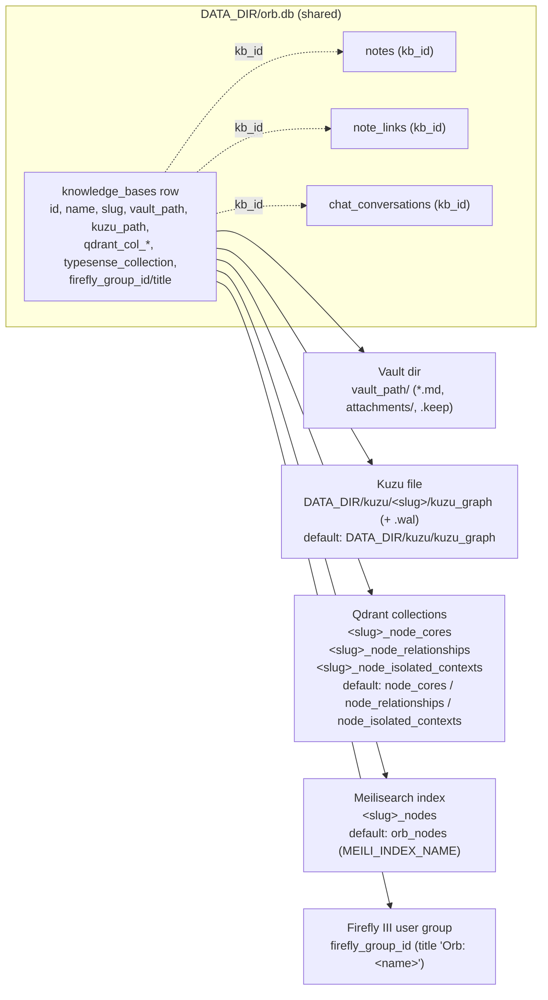

# Knowledge Bases and Vaults

**What this covers.** The Knowledge Base (KB) is Orb's isolation unit: every KB owns one notes vault (a folder of `.md` files plus `attachments/`), one Kuzu graph database file, three Qdrant collections, one Meilisearch index, and (optionally) one Firefly III administration. This document describes the `KBContext` service bundle, the `KBRegistry` (SQLite `knowledge_bases` rows + in-memory cache), slug and path rules, KB create/rename/delete/empty semantics and exactly what each tears down, vault directory resolution (`default_vault_path` vs `DATA_DIR/vaults/<slug>`), the `ensure_vault` layout, the vault-to-SQLite reconciliation in `vault_sync`, the watchdog-based external-edit detection in `vault_watcher`, and how `?kb=<name>` is resolved by `deps.get_kb` on almost every route.

**Related docs.** [API reference](07-api-reference.md) (route shapes) · [Notes, wikilinks and vault files](09-notes-wikilinks-and-vault-files.md) (note file contract, moves, wikilink resolution) · [Data directory layout](22-data-directory-layout.md) (on-disk tree) · [Backend core and configuration](06-backend-core-and-configuration.md) · [Graph storage (Kuzu)](14-graph-storage-kuzu.md) · [Search indexes (Qdrant/Meilisearch)](15-search-indexes-qdrant-meilisearch.md) · [Finance (Firefly)](17-finance-firefly.md) · [Ingestion pipeline](10-ingestion-pipeline.md) · [Retrieval and chat](16-retrieval-and-chat.md) · [Desktop shell](04-desktop-shell.md) · [Configuration reference](21-configuration-reference.md) · [Decisions and constraints](26-decisions-and-constraints.md) · [Glossary](28-glossary.md).

## 1. Responsibilities and boundaries

**Owns**

- The definition of a KB: id, display name, slug, vault path, Kuzu file path, Qdrant collection names, Meilisearch index name, Firefly group mapping (`knowledge_bases` table + `KBRegistry` cache).
- Construction and caching of per-KB service objects (`KBContext`): `QdrantService`, `MeilisearchService`, lazily `GraphService`, `RetrievalService`, `IngestionWorkflow`, `ChatWorkflow`.
- The default KB bootstrap (`id == "default"`) and the healing of mis-stored Kuzu directory paths.
- Vault provisioning (`ensure_vault`), full vault wipe (`clear_vault_contents`), and the rule for which vault folders Orb may `rmtree`.
- Vault ↔ SQLite reconciliation (`vault_sync.sync_vault_notes`) and folder/attachment/media listings used by the notes sidebar.
- External edit detection (`vault_watcher`): a watchdog observer per vault that marks notes stale but never ingests.
- `?kb=` request scoping (`app/api/deps.py:get_kb`).

**Does not own**

- The note file contract itself (title ↔ filename sync, moves, wikilink resolution, attachment URLs): see [09](09-notes-wikilinks-and-vault-files.md).
- The internals of Kuzu schema, Qdrant collection schema, Meili index settings: see [14](14-graph-storage-kuzu.md) and [15](15-search-indexes-qdrant-meilisearch.md). This doc only covers how those stores are *named, created and deleted per KB*.
- The Firefly administration lifecycle (group creation, PHP scripts): see [17](17-finance-firefly.md). This doc covers only the `firefly_group_id`/`firefly_group_title` columns and when the registry is told to set/detach them.
- Resolution of `DATA_DIR` / `paths.json` (see [06](06-backend-core-and-configuration.md), [22](22-data-directory-layout.md), [04](04-desktop-shell.md)); this doc only consumes `resolve_data_dir()` / `resolve_default_vault_path()`.

## 2. Files

| Path | Purpose | Key exports |
|---|---|---|
| `backend/app/services/kb_registry.py` | KB metadata store (SQLite `knowledge_bases`), `KBContext` bundle, in-memory cache, create/rename/delete/cleanup, Kuzu path normalisation | `KBContext`, `KBRegistry`, `kb_registry` (singleton), `DEFAULT_KB_ID`, `normalize_kuzu_path`, `_kuzu_db_file`, `_default_kb`, `_connect` |
| `backend/app/api/deps.py` | FastAPI dependency resolving `?kb=` to a `KBContext` | `get_kb` |
| `backend/app/api/kb.py` | KB management routes: list/create/empty/delete-non-default/delete/rename | `router`, `CreateKBInput`, `RenameKBInput`, `_purge_kb_sql_notes` |
| `backend/app/services/vault.py` | Vault filesystem primitives: `ensure_vault`, `clear_vault_contents`, self-write suppression registry, title sanitising, attachment save, wikilink regex | `ensure_vault`, `clear_vault_contents`, `mark_self_write`, `is_recent_self_write`, `sanitize_title`, `unique_md_path`, `read_note_file`, `write_note_file`, `delete_note_file`, `save_attachment`, `extract_wikilinks`, `title_from_filename`, `WIKILINK_RE` |
| `backend/app/services/vault_sync.py` | Scan vault → create/adopt `notes` rows; list folders / attachments / media files | `sync_vault_notes`, `iter_vault_md_files`, `list_vault_folders`, `list_attachment_files`, `list_vault_media_files` |
| `backend/app/services/vault_watcher.py` | watchdog observers per vault; debounced per-file sync into SQLite; stale marking | `start_vault_watchers`, `stop_vault_watchers`, `_sync_vault_file`, `_get_engine` |
| `backend/app/core/paths.py` | `resolve_data_dir`, `resolve_default_vault_path`, `ensure_data_layout`, `sqlite_url` consumed by the registry | see [06](06-backend-core-and-configuration.md) |
| `backend/app/core/database.py` | Async engine + `init_db` (`create_all` for `notes`, `note_links`, `knowledge_bases`, chat tables) | `engine`, `AsyncSessionLocal`, `get_db`, `init_db`, `Base` |
| `backend/app/api_desktop.py` | `POST /api/v1/setup/paths` (re-points default vault via `set_vault_path`), `GET /api/v1/setup/status` (`active_vault_path`), `/vault-files/{kb_id}/…` | `setup_paths`, `setup_status`, `serve_vault_file` |
| `backend/app/main.py` | Startup: `init_db()` then `start_vault_watchers()`; shutdown: `stop_vault_watchers()` | `startup_event`, `shutdown_event` |
| `frontend/src/lib/kb-context.tsx` | Client-side active KB (slug + display name) persisted in `localStorage["orb_current_kb"]`; supplies the `?kb=` value | `KBProvider`, `useKB` |

Consumers that construct/tear down per-KB stores and are documented elsewhere: `services/graph.py` (`GraphService(db_path, qdrant)`), `services/qdrant_service.py` (`QdrantService(col_cores, col_relationships, col_contexts)`), `services/meilisearch_service.py` (`MeilisearchService(collection_name)`), `services/firefly_service.py` (`destroy_kb_administration`, `sync_kb_group_title`, and the `set_firefly_group` calls).

## 3. The isolation model

A KB is identified three ways, and every layer uses a different one:

| Identifier | Example | Where it is used |
|---|---|---|
| `id` (UUID4 string; the literal `"default"` for the default KB) | `3f2a…` / `default` | `notes.kb_id`, `note_links.kb_id`, `chat_conversations.kb_id`, `KBRegistry._cache` key, `DELETE /api/v1/kb/{kb_id}`, `PATCH /api/v1/kb/{kb_id}`, the `/vault-files/{kb_id}/…` URLs written into markdown by uploads |
| `slug` (`[a-z0-9_-]+`) | `work_notes` | Directory names `DATA_DIR/vaults/<slug>`, `DATA_DIR/kuzu/<slug>/kuzu_graph`; Qdrant collection prefix `<slug>_…`; Meili index `<slug>_nodes`; what the frontend stores as `currentKB` and sends as `?kb=` |
| `name` (free text) | `Work Notes` | Display only, *but* also accepted by `?kb=` (case-insensitive match) and used in the create response's hint `Use ?kb=<name>` |

Per-KB fan-out of storage (every box on the right exists once per KB row):



Key consequences:

- SQLite is **shared** across KBs and scoped by `kb_id` columns; everything else is physically separate. `orb.db` is the only file that must never be deleted "per KB".
- The default KB reuses the process-wide singletons (`graph_service`, `qdrant_service`, `meilisearch_service`) and the un-prefixed collection/index names from `settings`. Non-default KBs get fresh `QdrantService`/`MeilisearchService` instances and a lazily opened `GraphService`.
- Deleting a KB is the only operation that removes a `knowledge_bases` row. Emptying keeps the row and re-provisions the stores.
- Firefly data lives inside the Firefly SQLite (`DATA_DIR/firefly/app/storage/database/firefly.sqlite`), not in `orb.db`; the registry only stores the group id/title mapping.

## 4. `KBContext`

`@dataclass KBContext` in `kb_registry.py`:

| Field | Type | Set by | Notes |
|---|---|---|---|
| `kb_id` | `str` | constructor | `"default"` or UUID |
| `name` | `str` | constructor; mutated by `rename_kb` | display name |
| `qdrant` | `QdrantService` | constructor | eager: `QdrantService.__init__` connects to Qdrant and runs `_ensure_collections()` (creates the three collections if missing, with dim checks) |
| `meili` | `MeilisearchService` | constructor | eager: `MeilisearchService.__init__` connects and runs `_ensure_collection()` (creates index with `primaryKey: node_id` and applies searchable/filterable settings) |
| `vault_path` | `str` | constructor; mutated by `set_vault_path` | absolute path string; `""` means "no vault" (routes return 400 `"No vault configured"`) |
| `_graph` | `GraphService \| None` | constructor (default KB passes the singleton) or first access of `.graph` | `repr=False` |
| `_kuzu_path` | `str` | constructor | file path; normalised on first `.graph` access |
| `retrieval_service` / `ingestion_workflow` / `chat_workflow` | `object` (None until built) | `_ensure_lazy()` | typed `object` to avoid import cycles |

**`graph` property.** Lazily opens Kuzu: `normalize_kuzu_path(_kuzu_path)`, `mkdir -p` the parent, then `GraphService(db_path=path, qdrant=self.qdrant)`. Raises `RuntimeError("No Kuzu path configured for KB …")` if the path is empty. Rationale in code: *"notes/finance must work even if Kuzu path was misconfigured"* — creating the context must never fail because Kuzu cannot open, so only graph/ingest/chat/graph-API routes touch `.graph`.

**`_ensure_lazy()`** builds, in order and only once: `RetrievalService(graph, qdrant, meili)`, `IngestionWorkflow(graph, qdrant, meili)`, `ChatWorkflow(retrieval=retrieval_service)`. All three are built together on the first call of `get_ingestion_workflow()` or `get_chat_workflow()`. Accessing `graph` inside this opens Kuzu, so the first ingest or chat request on a KB pays the Kuzu open + schema init cost.

There is **no `close()` on `KBContext`**; `delete_kb` looks for `ctx.close` or `ctx.graph.close` via `getattr` (see §7.3) — note that `getattr(ctx, "graph")` *opens* Kuzu if it was never opened, only to close it again.

## 5. `KBRegistry`

### 5.1 Storage: SQLite table + in-memory dicts

The registry does not use SQLAlchemy. `_connect()` opens `sqlite3.connect(DATA_DIR/orb.db)` (after `ensure_data_layout()`), sets `row_factory = sqlite3.Row`, and runs `CREATE TABLE IF NOT EXISTS knowledge_bases (...)` plus `_ensure_firefly_columns` (`ALTER TABLE … ADD COLUMN firefly_group_id INTEGER` / `firefly_group_title TEXT` when missing). Every registry write opens and closes its own connection.

Table (raw DDL in `_connect()`; there is no ORM model):

| Column | Type | Meaning |
|---|---|---|
| `id` | TEXT PK | `"default"` or UUID4 |
| `name` | TEXT NOT NULL | display name |
| `slug` | TEXT NOT NULL UNIQUE | see §5.4 |
| `vault_path` | TEXT NOT NULL | absolute vault dir |
| `kuzu_path` | TEXT NOT NULL | Kuzu **file** path (`…/kuzu/<slug>/kuzu_graph`) |
| `qdrant_col_cores` / `qdrant_col_rels` / `qdrant_col_contexts` | TEXT NOT NULL | Qdrant collection names |
| `typesense_collection` | TEXT NOT NULL | **Meilisearch index name** (column name is a Typesense-era leftover; ORM exposes `meili_index` synonym) |
| `created_at` | TEXT | `datetime.utcnow().isoformat()` (naive UTC string; the ORM declares `DateTime(timezone=True)` but the registry writes ISO text) |
| `firefly_group_id` | INTEGER NULL | Firefly `user_group_id` |
| `firefly_group_title` | TEXT NULL | e.g. `Orb: Work Notes` |

In-memory state (guarded by `self._lock = threading.RLock()`):

- `_metadata: dict[id, dict]` — the row dicts (plus any repaired `kuzu_path`).
- `_cache: dict[id, KBContext]` — live contexts. Every non-default row is eagerly built into a context at startup (`_load`), which means **Qdrant and Meili connections are attempted for every KB at import time** (failures are logged as `Failed to init KB` and the KB is then built lazily on first `get_kb`).

`_save_row(meta)` is an upsert: `INSERT … ON CONFLICT(id) DO UPDATE SET name, vault_path, kuzu_path, firefly_group_id, firefly_group_title`. Collection/index names and `slug` are **never updated** after creation.

### 5.2 Construction and default KB bootstrap

`kb_registry = KBRegistry()` runs at import of `kb_registry.py` (imported by nearly every router and by `vault_ops`, `note_files`, `wikilinks`, `vault_sync`). `__init__`:

1. `_load()` (see 5.3).
2. If `"default"` is not in `_cache` (fresh install, or the row was missing/unloadable): `_cache["default"] = _default_kb()` and `_ensure_default_row()`.

`_default_kb()`:

- `vault = resolve_default_vault_path()` (from `paths.json.default_vault_path`, else `ORB_DEFAULT_VAULT`). If unset, falls back to `DATA_DIR/vaults/default`.
- `ensure_vault(vault_str)` (creates dir + `attachments/`).
- Returns `KBContext(kb_id="default", name="default", qdrant=qdrant_service, meili=meilisearch_service, vault_path=…, _graph=graph_service, _kuzu_path=settings.KUZU_DB_PATH)`. `settings.KUZU_DB_PATH` is forced to `DATA_DIR/kuzu/kuzu_graph` at the bottom of `core/config.py`.

`_ensure_default_row()` inserts the default row only if absent, with `qdrant_col_* = settings.QDRANT_COLLECTION_NODE_*` (`node_cores`, `node_relationships`, `node_isolated_contexts`), `typesense_collection = settings.MEILI_INDEX_NAME` (`orb_nodes`; the code still spells `or settings.TYPESENSE_COLLECTION_NAME`, a field that no longer exists), and `vault_path = ctx.vault_path`.

Consequence: once the default row exists, **the DB row's `vault_path` wins over `paths.json`** on subsequent boots (`_load` rebuilds the default context from `meta["vault_path"]`). `POST /api/v1/setup/paths` keeps them aligned by calling `set_vault_path("default", …)` whenever `default_vault_path` is supplied. Editing `paths.json` by hand does not move the default vault until the row is updated (see Gotchas).

### 5.3 `_load()` — startup migration and healing

1. **Row load**: `SELECT * FROM knowledge_bases`. For each row, `normalize_kuzu_path(kuzu_path)` is applied and persisted with an `UPDATE` if it changed (heals the "create_kb mkdir'd a directory" bug, see 5.5). Non-default rows → `_build_context` into `_cache` (errors logged, row still kept in `_metadata`). The default row → a `KBContext` built with the singletons but with `vault_path` and `kuzu_path` from the row.
2. Any exception in step 1 is swallowed with a warning (`Failed to load from SQLite`), after which `__init__` falls back to `_default_kb()`.

### 5.4 Slug rules and sanitisation

`create_kb(name, vault_path=None)`:

```python
slug = re.sub(r"[^a-z0-9_-]", "-", name.lower().replace(" ", "_")).strip("-_")
if not slug:
    slug = f"kb-{kb_id[:8]}"
```

- Spaces → `_`, then anything outside `[a-z0-9_-]` → `-`, then leading/trailing `-`/`_` stripped. `"Work Notes"` → `work_notes`; `"Ünïcode!"` → `-n-code-` → `n-code`; `"..."` → `kb-<first 8 hex of uuid>`.
- The slug becomes filesystem path segments and Qdrant/Meili names, so this sanitisation is a security boundary (code comment: *"a raw name containing `/` or `..` would escape DATA_DIR"*; added in `f8f527f`).
- `slug` is `UNIQUE` in SQLite. Two names that sanitise to the same slug (`"My KB"` and `"my-kb"` → `my_kb` vs `my-kb` are different, but `"A B"` and `"a b"` both → `a_b`) make the second `create_kb` raise `sqlite3.IntegrityError`, which `POST /api/v1/kb` maps to **500** (only `ValueError` is mapped to 400). The `_metadata` entry has already been inserted before `_save_row` fails, so the failed KB lingers in memory (without a context) until restart.
- The slug is never regenerated by `rename_kb`; the vault folder, Kuzu folder, collection names and `?kb=<slug>` keep the original slug forever.

### 5.5 Kuzu path normalisation

`_kuzu_db_file(data_dir, slug) = data_dir / "kuzu" / slug / "kuzu_graph"` — a **file** path; Kuzu rejects a directory. The default KB uses `DATA_DIR/kuzu/kuzu_graph` (no slug folder).

`normalize_kuzu_path(path_str)`:

| Input | Result |
|---|---|
| empty | unchanged |
| basename `kuzu_graph` or any suffix present | unchanged (already a file) |
| existing directory | `<dir>/kuzu_graph` (legacy bug: an early `create_kb` `mkdir`'d `…/kuzu/<slug>` as a directory) |
| non-existent, parent named `kuzu` | `<path>/kuzu_graph` |
| otherwise | unchanged |

Applied in `_load`, `get_kb`, `_build_context`, `KBContext.graph`, and `_cleanup_stores`. `GraphService.__init__` additionally migrates the very old `<repo>/data/kuzu_graph` file into the new location when the target does not exist.

### 5.6 Lookup API

| Method | Behaviour |
|---|---|
| `list_kbs() -> list[dict]` | Copies of `_metadata` values (raw row dicts incl. `kuzu_path`, collection names, Firefly ids). If `_metadata` is empty (DB load failed), returns a synthetic default entry with `created_at: None`. Used by `GET /api/v1/kb` and by the vault watcher to discover vaults. |
| `get_kb(kb_id) -> KBContext \| None` | Cache hit → context. Else if metadata known → heal `kuzu_path`, `_build_context`, cache. Else `None`. Accepts **ids only**. |
| `get_kb_by_name(name)` | `name.lower().strip()`; `""` or `"default"` → default context (or a fresh `_default_kb()` if somehow absent). Otherwise the first row whose `name.lower() == normalized` **or** `slug == normalized` (slug compared case-sensitively against the lower-cased input, which is fine because slugs are lower-case). Used by `get_kb` dependency and `/vault-files/{kb_id}` fallback. |
| `get_metadata(kb_id) -> dict \| None` | Shallow copy of the row dict. Used by `firefly_service` to read `firefly_group_id`, and by the delete routes for the response payload. |

### 5.7 Firefly mapping setters

`set_firefly_group(kb_id, group_id, title=None)` and `detach_firefly_group(kb_id)` mutate `_metadata[kb_id]` and `_save_row`. They are called only from `services/firefly_service.py` (`_activate_scope_locked`/administration creation, `sync_kb_group_title`, `destroy_kb_administration`). Both are no-ops for unknown ids. `delete_kb` pops the two keys from the metadata before deleting the row (cosmetic: the row is deleted anyway).

## 6. Vault directory resolution and `ensure_vault`

### 6.1 Which folder is a KB's vault?

| KB | Vault path |
|---|---|
| default, fresh install, `paths.json.default_vault_path` set (first-run setup "Notes folder") | that path |
| default, `default_vault_path` unset | `DATA_DIR/vaults/default` |
| default, after first boot | whatever is in the `knowledge_bases` row (`set_vault_path` keeps it in sync with Setup) |
| non-default via `POST /api/v1/kb` | `body.vault_path` — **required** by the route (400 otherwise), although `create_kb` itself would default to `DATA_DIR/vaults/<slug>` |
| non-default via legacy JSON migration without `vault_path` | `DATA_DIR/vaults/<slug>` |

All paths pass through `ensure_vault`, so they are stored as `Path(path).expanduser().resolve()` strings — symlinks resolved, `~` expanded.

### 6.2 `ensure_vault(path) -> Path`

`mkdir -p <path>`; `mkdir <path>/attachments` (exist_ok). Returns the resolved `Path`. That is the entire vault layout contract: **a vault is any directory; Orb only guarantees `attachments/` exists**. There is no marker file, no config file, no `.orb/` folder. Any Obsidian vault or plain folder can be a vault. Hidden entries (`.obsidian/`, `.git/`) are ignored by all scans (§9).

Created by: `_default_kb`, `create_kb`, `set_vault_path`, `_load` migration, `POST /api/v1/setup/paths`, `clear_vault_contents`, and `POST /api/v1/kb/empty` fallback.

### 6.3 `clear_vault_contents(path)`

Iterates the vault's direct children and `rmtree`s directories / unlinks files (errors per child swallowed), then `ensure_vault`. **No provenance check** — unlike `delete_kb`, this will empty an external OneDrive/NAS folder if the KB points at one. Used only by `POST /api/v1/kb/empty`.

### 6.4 Vault-provisioned vs external vaults

`delete_kb` distinguishes: `vp = Path(meta["vault_path"]).resolve()`, `app_vaults = (DATA_DIR/"vaults").resolve()`. Only when `vp == app_vaults or app_vaults in vp.parents` is `shutil.rmtree(vp)` executed; otherwise `Keeping external vault folder …` is logged. This is the definition of "Orb-provisioned": *under `DATA_DIR/vaults/`*. The default KB's vault chosen at first-run setup is usually outside that tree and is therefore never deleted by the registry (the default KB cannot be deleted anyway).

Similarly Kuzu cleanup only deletes under `(DATA_DIR/"kuzu").resolve()`.

## 7. KB lifecycle operations

Route shapes (bodies, status codes, JSON) are in [07 §Knowledge bases](07-api-reference.md#knowledge-bases-apikbpy). This section documents *what happens* and *what is torn down*.

### 7.1 Create — `KBRegistry.create_kb(name, vault_path=None)` ← `POST /api/v1/kb`

1. `kb_id = uuid4()`, slug per §5.4.
2. `vault_path = ensure_vault(vault_path or DATA_DIR/vaults/<slug>)`.
3. `kuzu_path = DATA_DIR/kuzu/<slug>/kuzu_graph`; parent dir created (the file itself is created by Kuzu on first `.graph` access).
4. `meta` = row dict with `qdrant_col_cores=<slug>_node_cores`, `qdrant_col_rels=<slug>_node_relationships`, `qdrant_col_contexts=<slug>_node_isolated_contexts`, `typesense_collection=<slug>_nodes`, `created_at=utcnow ISO`.
5. Under the lock: `_metadata[kb_id]=meta`, `_save_row`, `_build_context` (this **creates the Qdrant collections and Meili index immediately**, via the service constructors), cache.

No Firefly administration is created here; that happens lazily the first time a finance route activates the KB scope ([17](17-finance-firefly.md)). No note rows exist yet; the first `GET /api/v1/notes?kb=<slug>` runs `sync_vault_notes` and adopts any `.md` already in the folder (so pointing a new KB at an existing Obsidian folder imports it, metadata-only).

### 7.2 Rename — `rename_kb(kb_id, new_name)` ← `PATCH /api/v1/kb/{kb_id}`

Rejects `default` (`ValueError`, → 400). Updates `name` in `_metadata`, row, and cached context. Slug, vault dir, collection names, Kuzu dir are **unchanged**. The route then calls `firefly_service.sync_kb_group_title(kb_id, name)` (renames the Firefly group to `Orb: <name>` if a group exists). The frontend must keep sending the slug in `?kb=`; `kb-context.tsx` stores `{slug, name}` and exposes `setCurrentKBName` precisely so a rename only updates the label.

### 7.3 Delete — `delete_kb(kb_id, *, delete_vault_files=True, wipe_indexes=True)` ← `DELETE /api/v1/kb/{kb_id}`

Route order: `firefly_service.destroy_kb_administration(ctx)` (best-effort) → `_purge_kb_sql_notes` (`DELETE FROM note_links WHERE kb_id`, `DELETE FROM notes WHERE kb_id`; **chat conversations are not deleted** — `chat_conversations`/`chat_messages` rows for the KB remain orphaned) → `kb_registry.delete_kb(...)`.

`delete_kb`:

1. `default` → `ValueError`.
2. Under the lock: pop metadata and context; if a context exists, try `ctx.close` then `ctx.graph.close` (`GraphService.close()` closes the Kuzu connection — needed before deleting the file on disk). Delete the row.
3. `wipe_indexes` → `_cleanup_stores(meta)`:
   - Qdrant: new `QdrantService(...)` with the KB's names (this *re-creates* the collections in its constructor if they were missing, then) `delete_collection` each of the three. Errors swallowed.
   - Meili: `MeilisearchService(collection_name=index)` (again ensures the index exists) then `delete_index` + `wait_for_task(10 s)`.
   - Kuzu: resolve `normalize_kuzu_path(kuzu_path)`; refuse unless under `DATA_DIR/kuzu` (comment: *"A crafted KB name used to be able to point this at arbitrary paths — never delete outside DATA_DIR/kuzu"*). Unlink file + `.wal`; remove the now-empty `<slug>` folder (never the `kuzu` root); if it is a directory, `rmtree`.
4. `delete_vault_files` → `rmtree` **only** if under `DATA_DIR/vaults` (§6.4).

Both flags default to `True` and no caller passes `False`; the route docstring states the product path "always destroys Firefly admin, SQLite notes, vault folder, and indexes".

Not cleaned up: `chat_conversations`/`chat_messages` (kb_id orphans), watchdog observer for the vault (stays scheduled until process restart; harmless because the handler's `_sync_vault_file` would re-create `notes` rows if files reappear — see Gotchas), and the Meili/Qdrant service objects held by any in-flight request.

### 7.4 Empty — `POST /api/v1/kb/empty?kb=…`

Keeps the row and the context. Sequence (each step best-effort, logged): `destroy_kb_administration` → `_purge_kb_sql_notes` → in threads: `kb.graph.wipe_all_nodes()` (`MATCH (n:Node) DETACH DELETE n`; note this **opens Kuzu** if not yet open), `kb.qdrant.reset_all()` (delete + `_ensure_collections` recreate), `kb.meili.reset_all()` (delete index + recreate with settings) → `clear_vault_contents(vault_path)` (no external-folder protection; falls back to `ensure_vault` on failure). Works on the default KB too.

### 7.5 Delete all non-default — `POST /api/v1/kb/delete-non-default`

Loops `list_kbs()`, skipping `default`; per KB runs the same three steps as 7.3 and collects `{id, error}` on failure instead of aborting. Used by the Settings "reset" UI.

### 7.6 Re-point the default vault — `set_vault_path(kb_id, vault_path)` ← `POST /api/v1/setup/paths`

`ensure_vault(vault_path)`; for `default` also (re)creates the cached context/row if missing; updates `_metadata` + row + `ctx.vault_path` (or builds the context if not cached). Returns the context. Only the setup route calls it, and only for `DEFAULT_KB_ID`. Note that **nothing moves files**: switching the default vault to a new folder leaves the old `.md` files where they were, and `notes` rows still reference `rel_path`s that now resolve inside the new folder (bodies read as empty until `sync_vault_notes` adopts/creates rows for the new folder's files; old rows persist as ghost notes with empty content). The watcher picks the new path up within 30 s (§10.4).

### 7.7 Admin reset (per KB, not a registry op)

`POST /api/v1/admin/reset-ingestion-data?kb=` sets `processed=False, failed=False` on all notes of the KB and, in a background task, runs `graph.wipe_all_nodes()`, `qdrant.reset_all()`, `meili.reset_all()`. Vault files and `notes` rows are kept. See [07 §Admin](07-api-reference.md#admin--maintenance-apiadminpy) and [22 §What deletes what](22-data-directory-layout.md).

## 8. `?kb=` resolution: `app.api.deps.get_kb`

```python
def get_kb(kb: str = Query(default="default", description="Knowledge base name or slug")) -> KBContext:
    ctx = kb_registry.get_kb_by_name(kb)
    if ctx is None:
        raise HTTPException(status_code=404, detail=f"Knowledge base '{kb}' not found")
    return ctx
```

- Declared as `kb: KBContext = Depends(get_kb)` on notes, vault, files, chat, graph, admin, finance, notes-graph and `kb/empty` routes. Missing param → default KB. Unknown value → **404** before the handler runs.
- Matching is by **name (case-insensitive) or slug**; `id` UUIDs are *not* accepted here (they are accepted by `DELETE`/`PATCH /api/v1/kb/{kb_id}` path params and by `/vault-files/{kb_id}/…`, which tries `get_kb(id)` first and then `get_kb_by_name`).
- Because a request that omits `?kb=` silently hits `default`, every frontend call goes through `withKb(kb, …)`/`kbQuery(kb)` in `frontend/src/lib/api.ts`, and `useKB()` already holds the stored KB on the first render.
- `frontend/src/lib/kb-context.tsx`: `localStorage["orb_current_kb"]` = `{"slug","name"}` JSON (legacy keys `lifeos_current_kb`/`liveos_current_kb` and a bare-string format are migrated on read). `currentKB` is the slug. Nothing validates that the stored slug still exists; a deleted KB yields 404s until the user picks another KB.
- Background tasks capture the `KBContext` object at request time (`kb.get_ingestion_workflow().process_note`), so ingestion continues on the right KB even if the user switches KBs in the UI. The ingestion workflow re-resolves `kb_registry.get_kb(note.kb_id)` when persisting the enriched body.

## 9. `vault_sync` — reconciling vault files with SQLite

Vault files are the source of truth for note bodies; SQLite `notes` rows are metadata (id, title, `rel_path`, timestamps, processing flags). Rows can lag behind disk when users add files with Obsidian/Finder/OneDrive. Two mechanisms close the gap: the on-demand full scan here, and the event-driven watcher in §10.

### 9.1 Listing helpers (used by `GET /api/v1/vault/folders` and the scan)

All helpers compute `rel = path.resolve().relative_to(vault.resolve())`, skip anything whose path contains a segment starting with `.`, and return forward-slash paths.

| Function | Returns | Rules |
|---|---|---|
| `iter_vault_md_files(vault) -> list[str]` | sorted rel paths of note files | `rglob("*.md")`; skips hidden; skips anything under a top-level `attachments/` **or any folder named `attachments` at any depth** (`"/attachments/" in f"/{rel}/"`) |
| `list_vault_folders(vault, include_attachments=True)` | sorted set of folder rel paths incl. all ancestors | `rglob("*")` dirs; hidden skipped; `attachments` added explicitly if it exists (it is a real dir so it would be found anyway) |
| `list_attachment_files(vault)` | `[{name, rel_path}]` for regular files directly in `attachments/` | non-recursive, hidden skipped |
| `list_vault_media_files(vault)` | `[{name, rel_path}]` for every non-`.md`, non-hidden, non-`.keep` file anywhere | sorted case-insensitively |

`.keep` files are written by `POST /api/v1/vault/mkdir` so empty folders survive; they are hidden from media listings but they *are* dotfiles, so they never appear as notes either.

### 9.2 `sync_vault_notes(db, kb) -> {"files","created","updated"}`

Called from `GET /api/v1/notes` (default `sync_vault=true`, wrapped in try/except so a scan failure never breaks listing) and from the setup flow. Algorithm:

1. `rels = iter_vault_md_files(vault)`; load all `Note` rows for `kb.kb_id`; build `by_rel` (normalised `rel_path` → row) and `by_title` (`title.lower()` → row).
2. For each `rel` on disk with no row:
   - **Adoption**: `adoptable(stem)` returns a row whose `title.lower() == stem`, whose current `rel_path` is **root-level** (no `/`), and whose current file is **not on disk** — i.e. "a root note was moved into a folder outside Orb". The row's `rel_path` is repointed, `updated_at` bumped, `updated += 1`. The on-disk check exists because *"a second note of the same name in another folder would steal the root note's row and orphan the root file"* (added in `f8f527f`).
   - Otherwise a new `Note(kb_id, title=stem, rel_path=rel, content="", processed=False, processing_stage="Saved")` is created (`created += 1`). `id`, `created_at`, `updated_at` come from ORM defaults (now). **The file's mtime is not used**, so imported notes sort as "just created".
3. For rows that exist but have a blank title, the title is filled from the filename (`updated += 1`). Titles that are non-blank are never overwritten (*"Display title is user-owned — don't clobber from filename"*).
4. `commit`.

What it does **not** do: it never deletes rows whose files vanished (those become notes with empty bodies; the watcher marks them `External delete detected — review in Orb` if it saw the delete event), never re-reads bodies into SQLite, never touches `note_links` (call `POST /api/v1/graph/notes/rebuild` or `GET /api/v1/graph/notes?rebuild=true` for that), never ingests.

Title derivation: `title_from_filename(rel) = Path(rel).stem` — the folder is not part of the title; two files `A/Plan.md` and `B/Plan.md` both get title `Plan` (disambiguated in wikilinks by path, see [09](09-notes-wikilinks-and-vault-files.md)).

## 10. `vault_watcher` — external edit detection

### 10.1 Thread model

`start_vault_watchers()` (called from `main.py` startup) spawns one daemon thread `vault-watcher` running `_run()`. Inside it: one `watchdog.observers.Observer()` with one `VaultHandler(kb_id, vault)` scheduled **recursively** per distinct `vault_path` from `kb_registry.list_kbs()`. Every 30 s (`_stop.wait(30)`) `refresh_observers()` re-reads `list_kbs()` and schedules handlers for vault paths not yet in `watched` (new KBs, or a default vault that did not exist at boot). Handlers are never unscheduled (deleted/re-pointed KBs keep their observer until restart). If `watchdog` is not importable the thread logs `watchdog not installed — vault watcher disabled` and exits. `stop_vault_watchers()` sets the event; the thread stops and joins the observer (5 s).

The handler callbacks run **on watchdog's emitter thread** and do the SQLite work synchronously there (no queue), which is why a dedicated sync engine is used.

### 10.2 Shared sync engine

`_get_engine()` lazily creates one `sqlalchemy.create_engine(sqlite_url().replace("sqlite+aiosqlite://", "sqlite://"))` (double-checked locking on `_engine_lock`). Rationale in code: *"a OneDrive sync burst of hundreds of file events must not create one engine per event."* This is a second, synchronous SQLite engine alongside the async one in `core/database.py`; both point at `orb.db`.

### 10.3 Event → action mapping

`VaultHandler._rel(path)`: `path.resolve().relative_to(vault.resolve())`; returns `None` (ignore) unless the path ends in `.md`, and ignores `attachments/…` at the vault root and any path containing `/.` (hidden segment). Directory events are ignored entirely.

| watchdog event | queued as | effect in `_sync_vault_file` |
|---|---|---|
| `on_created` (file) | `created` | upsert row (see below) |
| `on_modified` (file) | `modified` | upsert row |
| `on_deleted` (file) | `deleted` | if a row exists: `processing_stage = "External delete detected — review in Orb"`; row **kept** |
| `on_moved` (file) | `modified` for `dest_path`, then `deleted` for `src_path` | new path gets a **new row** (title from filename); old row is marked externally deleted. **No rename tracking** — an external rename duplicates the note in the sidebar until the user deletes the stale row (in-app moves use `vault_ops.move_vault_file`, which updates `rel_path`). |

Debounce: per `"<rel>:<event>"` key, events closer than **0.8 s** are dropped (editors that write temp files + rename produce bursts).

Self-write suppression: before doing anything for non-delete events, `is_recent_self_write(vault / rel)` is checked. `vault.write_note_file` and `vault_ops.move_vault_file`/`delete_vault_file` call `mark_self_write(vault, rel)` which records `time.time()` keyed by the **resolved absolute path** in a module-level dict; entries are valid for `_SELF_WRITE_TTL_SEC = 12.0` seconds (opportunistically pruned after 36 s). So an in-app save produces no watcher action; an external edit within 12 s of an in-app save of the *same file* is also ignored (accepted trade-off). Deletes are never suppressed by the TTL, but in-app deletes go through `delete_note_file` which does **not** call `mark_self_write` — the watcher's `deleted` branch then finds no row (already deleted by the route) and does nothing.

Upsert branch (`created`/`modified`, not self-write):

- Row missing → `Note(kb_id, title=stem, rel_path, content="", processed=False, processing_stage="Saved")` + `flush()`. Comment: *"New file on disk — index metadata only; user must click Ingest."*
- Row exists → blank title filled from filename; `updated_at = now`; then:
  - `processed == True` → `processed = False`, `processing_stage = "Changed on disk — re-ingest when ready"` (**stale marking**, no ingestion).
  - `processing_stage` starts with `Queued` or `Starting` → left alone (an ingest is in flight/queued).
  - otherwise → `processing_stage = "Saved"`.
- In both cases `refresh_note_links_sync(session, kb_id, row.id, body)` re-parses `[[wikilinks]]` from the file body so the notes graph stays current even though SQLite `content` stays empty. Then `commit`.

Design rule (module docstring): **"Does NOT auto-ingest."** Ingestion costs LLM time and may be cloud-billed; only explicit user actions (`POST /notes/{id}/ingest`, `reingest-vault`, `admin/reingest-all`) start it. `PUT /api/v1/notes/{id}` (autosave) clears watcher stages (`External…`, `Changed on disk…`, anything containing `pending`, or empty) back to `Saved` for unprocessed notes, but leaves `Queued…`/`Starting…` intact and never flips `processed`.

### 10.4 Timing summary

| Situation | Detected after |
|---|---|
| external create/modify | immediately (fs event) + 0.8 s debounce window |
| new KB created / default vault re-pointed | ≤ 30 s (observer refresh) |
| vault path did not exist at boot | ≤ 30 s after it appears |
| in-app save | ignored for 12 s |

## 11. Concurrency and locking

| Resource | Guard | Notes |
|---|---|---|
| `KBRegistry._metadata` / `_cache` | `threading.RLock` (`self._lock`) | held across SQLite writes and context construction (so `create_kb` blocks other registry calls while Qdrant/Meili connect). `get_kb_by_name` reads `_cache` for default without the lock. |
| SQLite `orb.db` | none beyond SQLite's own file lock | Three writers: the async engine (`NullPool`, `check_same_thread=False`), the registry's ad-hoc `sqlite3` connections, and the watcher's sync engine. No WAL mode is set anywhere; concurrent writers rely on SQLite's default busy handling (`database is locked` is possible under OneDrive bursts + UI saves; `get_note_ingestion_status` maps `TimeoutError` to 503). |
| Kuzu per KB | `GraphService._lock` (RLock) around every `conn.execute` | Kuzu itself is single-process; routes push graph work to `asyncio.to_thread` ("Kuzu holds a process-wide lock … inline they'd freeze chat streaming"). |
| Qdrant / Meili | HTTP clients, no app-level lock | per-KB service instances; the default KB shares singletons with the retrieval/ingestion singletons. |
| Vault files | none | Two in-app writers to the same `.md` (autosave + ingestion `_persist_note_body`) last-writer-wins; the frontend's autosave hook was reworked in `f8f527f` to avoid wiping in-flight keystrokes. Watcher and API do not coordinate beyond the self-write TTL. |
| Self-write registry | module-level dict, no lock | benign races (worst case a missed suppression). |
| Watcher engine | `_engine_lock` for creation only | sessions are per event. |

Blocking work moved off the event loop (rationale comments in code): `GET /api/v1/notes` body reads, `vault/folders` listing, `kb/empty` store wipes, note delete file/graph work, `reingest-vault` body reads.

## 12. Configuration and env vars

| Key | Source | Default | Effect here |
|---|---|---|---|
| `ORB_DATA_DIR` / `DATA_DIR` | env (`desktop_runtime.py` injects `ORB_DATA_DIR`) | `paths.json.data_dir`, else `<repo>/data` | Root for `orb.db`, `vaults/`, `kuzu/`; registry uses `resolve_data_dir()` at call time (not the cached `settings.DATA_DIR`) |
| `paths.json.default_vault_path` / `ORB_DEFAULT_VAULT` | paths.json first, then env | none → `DATA_DIR/vaults/default` | Default KB vault on first boot only (row wins afterwards) |
| `ORB_PATHS_FILE` | env | `<AppSupport>/Orb/paths.json` | where `default_vault_path` is read from |
| `settings.KUZU_DB_PATH` | forced in `core/config.py` to `DATA_DIR/kuzu/kuzu_graph` (env value ignored) | — | default KB Kuzu file; `sync_settings_paths` re-derives it after Setup |
| `QDRANT_COLLECTION_NODE_CORES` / `…_RELATIONSHIPS` / `…_ISOLATED_CONTEXTS` | env/.env | `node_cores`, `node_relationships`, `node_isolated_contexts` | default KB collection names (baked into the default row at first boot) |
| `MEILI_INDEX_NAME` | env/.env | `orb_nodes` | default KB Meili index name (baked into row) |
| `QDRANT_HOST/PORT/API_KEY`, `MEILI_HOST/PORT/MASTER_KEY` | env (`desktop_runtime.py` injects) | see [21](21-configuration-reference.md) | every `KBContext` uses the same servers; KBs are separated by collection/index *names*, not by server |
| `EMBEDDING_DIMENSIONS` (+ `manifest.json.selection.embedding_dims`) | settings / models manifest | 1024 | `QdrantService._ensure_collections` creates per-KB collections at this size; changing embed model with non-empty collections is refused (see [15](15-search-indexes-qdrant-meilisearch.md)) |

Startup wiring: `main.py` → `init_db()` (`create_all` incl. `knowledge_bases` via ORM, then the registry's own DDL is idempotent) → runtime config → embedding infra sync → `start_vault_watchers()`.

## 13. Interfaces with other subsystems

| Direction | Contract |
|---|---|
| Routers → `deps.get_kb` → registry | Every scoped route receives a `KBContext`; handlers must use `kb.kb_id` in SQL filters, `kb.vault_path` for files, `kb.qdrant/meili/graph` for stores. Never import the `graph_service`/`qdrant_service` singletons in routers (they are the default KB only). |
| Registry → `QdrantService(col_cores, col_relationships, col_contexts)` | Constructor connects and ensures collections. `reset_all()` = delete + recreate. `client.delete_collection` used for teardown. `is_available()` gates cleanup. |
| Registry → `MeilisearchService(collection_name)` | Constructor ensures index (`primaryKey: node_id`). `reset_all()` = delete + recreate. `client.delete_index` for teardown. |
| Registry → `GraphService(db_path, qdrant)` | Opened lazily; `close()` before file deletion; `wipe_all_nodes()` for empty/reset. |
| `firefly_service` → registry | reads `get_metadata(kb_id)["firefly_group_id"]`, writes `set_firefly_group` / `detach_firefly_group`. KB routes call `destroy_kb_administration` / `sync_kb_group_title`. |
| `IngestionWorkflow` → registry | `_persist_note_body` re-resolves `kb_registry.get_kb(note.kb_id)` to find the vault; raises if the KB has no vault (bodies are never written to SQLite). |
| `vault_ops` / `note_files` / `wikilinks` / `vault_sync` → `KBContext` | Only use `kb.kb_id` and `kb.vault_path`. They import `KBContext` from `kb_registry` (so `kb_registry` must import none of them — it doesn't; `vault.py` is the shared leaf). |
| Frontend `kb-context.tsx` → API | Sends the **slug** as `?kb=`; `GET /api/v1/kb` returns `slug` and `name`; the KB page's create response includes `name` and `vault_path` but not `slug` (clients re-list to get it). |
| First-run setup page / Setup page → `paths.json` → registry | `default_vault_path` seeds the default row once; later changes must go through `POST /api/v1/setup/paths`. |
| `main.py` → watcher | start after `init_db()` (tables must exist); stop on shutdown. |

## 14. Invariants and locked decisions

1. **The default KB cannot be deleted or renamed** (`ValueError` in `delete_kb`/`rename_kb`, 400 at the API). Its id and slug are the literal `"default"` and its stores are the un-prefixed singletons.
2. **`slug` is immutable and filesystem-safe.** Everything derived from it (vault dir under `DATA_DIR/vaults`, `DATA_DIR/kuzu/<slug>/`, `<slug>_node_*`, `<slug>_nodes`) is fixed at creation. Do not add code that derives paths from `name`.
3. **Kuzu path is a file, never a directory.** `_kuzu_db_file` / `normalize_kuzu_path` exist because the opposite once shipped; keep all Kuzu path handling going through them.
4. **Deletion never leaves `DATA_DIR`.** Vault `rmtree` only under `DATA_DIR/vaults`; Kuzu unlink only under `DATA_DIR/kuzu`. External vault folders (OneDrive, NAS, Obsidian vaults) are user data and must survive KB deletion. (`kb/empty` is the deliberate exception and wipes whatever folder the KB points at.)
5. **Note bodies live in the vault, not SQLite.** `notes.content` is kept empty by `persist_note_body`; the registry/vault layer is what makes a KB's `vault_path` authoritative. Never "fix" an empty body by writing into `notes.content`.
6. **External changes never trigger ingestion.** Watcher and scan only create/mark rows. Any future auto-ingest must be an explicit opt-in.
7. **Filename is a fallback for title, never an overwrite.** Scan and watcher fill blank titles only. (Title→filename sync is the reverse direction and is handled in `vault_ops.rename_note_file_for_title`, see [09](09-notes-wikilinks-and-vault-files.md).)
8. **Opening Kuzu must not be required to serve notes or finance.** Keep `_graph` lazy; do not touch `kb.graph` in notes/vault/files/finance handlers.
9. **`?kb=` defaults to `default`.** Backward-compatible with batch scripts; frontend must always pass it explicitly.
10. **One `MeilisearchService`/`QdrantService` instance per KB per process**, sharing one server. Isolation is by name, so never let a KB's names collide with another (slug uniqueness enforces this).

## 15. Failure modes and edge cases

| Scenario | Behaviour |
|---|---|
| Qdrant or Meili down at startup | Service constructors catch and disable themselves (`_enabled=False`, `client=None`); contexts still build; registry logs `Failed to init KB` only if construction itself raises. Ingestion/retrieval degrade per [15](15-search-indexes-qdrant-meilisearch.md). |
| Qdrant/Meili down during `delete_kb` | `_cleanup_stores` skips (`is_available()` false) — collections/index are **orphaned** on the server (they are cheap; no retry later). |
| Two KB names sanitising to the same slug | second `create_kb` → `IntegrityError` → 500; stale `_metadata` entry until restart (see 5.4). |
| `paths.json.default_vault_path` points at a missing/unmounted volume | `ensure_vault` `mkdir -p` creates it (possibly on the wrong disk if the mount point is absent). Watcher skips non-existent vaults until they exist. |
| Vault on OneDrive/NAS | Body reads are moved to threads; watcher bursts are debounced (0.8 s) and share one engine; `looks_like_network_volume` is only used for model staging, not vaults. |
| `orb.db` unreadable | `_load` logs and falls back to an in-memory default KB; `list_kbs` returns the synthetic entry; registry writes will fail loudly later. |
| KB row references a deleted vault folder | `GET /notes` returns rows with empty bodies; `sync_vault_notes` returns zeros (vault missing). Re-creating the folder revives it. |
| Kuzu file locked by another process (second Orb instance) | `KBContext.graph` raises on first access → graph/ingest/chat routes 500; notes still work. |
| `delete_kb` on a KB whose context was never opened | `getattr(ctx, "graph")` opens Kuzu just to close it; if opening fails the exception is swallowed and the file is deleted anyway. |
| Watcher sees Orb's own delete before the row is gone | The route unlinks the file (thread) *before* deleting the row; a fast watcher may set `processing_stage = "External delete detected…"` on a row that is deleted a few ms later. Harmless. |

## 16. Gotchas

- **Name vs slug in `?kb=`.** `get_kb_by_name` accepts either, but after `PATCH` rename the *old name* stops resolving while the slug keeps working. Store slugs client-side (the frontend does).
- **`typesense_collection` is Meilisearch.** The column and the `meta` key are legacy names; `KBContext.meili.collection` is the same value. Don't add a second "meili_index" column — use the ORM synonym.
- **Default KB vault path lives in two places.** `paths.json.default_vault_path` seeds the row only once. Hand-editing `paths.json` afterwards does nothing until `POST /api/v1/setup/paths` (or a direct row update). `GET /api/v1/setup/status` exposes both: `default_vault_path` (paths.json) and `active_vault_path` (registry).
- **`create_kb` eagerly creates Qdrant collections and the Meili index** (via service constructors) but not the Kuzu file, the Firefly group, or any notes row.
- **`kb/empty` has no external-folder guard** while `DELETE /kb/{id}` does. Emptying a KB pointed at a user's Obsidian vault deletes every file in it.
- **Chat history is not deleted with a KB** (`chat_conversations.kb_id` orphans remain).
- **Watcher observers are never removed.** After deleting a KB whose vault is outside `DATA_DIR/vaults` (kept on disk), edits there will re-create `notes` rows with the *deleted* `kb_id` until restart.
- **External renames duplicate notes** (`on_moved` = new row + old row marked deleted). Only in-app moves keep the row.
- **12-second self-write TTL is keyed by resolved path**, so a vault reached via a symlink still works, but an external edit within 12 s of an in-app save of the same file is ignored.
- **`iter_vault_md_files` skips any folder named `attachments` at any depth**, so a user folder `Projects/attachments/notes.md` is invisible as a note (but visible as a media file? no — `.md` is excluded from media too). It is simply not indexed.
- **Everything is on `orb.db`.** The async ORM engine, the registry (raw sqlite3) and the watcher engine all use `sqlite_url()`; there is no other database backend.
- **`created_at` for KBs is a naive-UTC ISO string**; for notes it is a tz-aware datetime. Don't compare them directly.
- **Registry import has side effects** (opens SQLite, creates tables, may connect to Qdrant/Meili for every KB, `ensure_vault` mkdirs). Importing `app.services.kb_registry` in a test without `ORB_DATA_DIR` set writes into `<repo>/data/`.
- `list_kbs()` exposes absolute paths and Firefly ids to any caller of `GET /api/v1/kb` (local-only app, but note it if adding remote access).
- `_LEGACY_REGISTRY` is under the **repo** `data/`, not `DATA_DIR`; on packaged builds it never exists.

## 17. Extension points

- **Add a per-KB store (e.g. a new index):** add a column in the raw DDL in `_connect()` (plus an `_ensure_*_columns` ALTER for existing DBs); derive its name from `slug` in `create_kb`; construct it in `_build_context` and `_default_kb`; tear it down in `_cleanup_stores` (guarded to `DATA_DIR` if it is a path) and in `kb/empty`; add it to `_save_row` only if it must be mutable.
- **Make a route KB-aware:** add `kb: KBContext = Depends(get_kb)`, filter SQL by `kb.kb_id`, use `kb.vault_path`; on the frontend pass `kb` through `withKb`/`kbQuery`.
- **Change slug rules:** only affects *new* KBs; never re-slug existing rows (paths and collections would orphan). If you must, write a migration that renames vault dir, Kuzu dir, Qdrant collections (copy) and Meili index (copy) and updates the row atomically.
- **Support renaming vaults / moving a KB's vault:** implement as `set_vault_path` + physical move + no row changes (rows store vault-relative `rel_path`, so moving the whole folder keeps them valid).
- **Auto-ingest on external change:** would go in `_sync_vault_file`'s modified branch; respect the "never queue from watcher" invariant by making it an explicit setting and by using `processing_stage` `Queued…` so autosave leaves it alone.
- **Per-KB settings (e.g. embed model):** there is no per-KB config today; `EMBEDDING_DIMENSIONS` is global and `QdrantService._ensure_collections` will refuse to recreate non-empty mismatched collections.

## 18. History / rationale

- `d37abd6` (2026-05-18) *Add multi-knowledge-base (KB) support* — introduced `KBRegistry`/`KBContext`, `?kb=` via `get_kb`, per-KB Kuzu path / Qdrant collections / Typesense collection, `kb_id` on notes (originally an Alembic migration `d4f891a2b5c3_add_kb_id_to_notes.py`; Alembic has since been removed and `init_db().create_all` is the only schema mechanism). The registry was originally JSON (`data/kb_registry.json`); the one-time import in `_load` was removed on 2026-09-19.
- `28ea18e` (2026-05-20) service/graph layout refactor.
- `3f21e08` (2026-08-02) *Ship LifeOS as a Docker-free desktop app with in-app data cleanup* — vault-backed notes (`vault.py`, `vault_sync.py`, `vault_watcher.py`, `wikilinks.py`), SQLite registry, `kb/empty` and `delete-non-default`, Meilisearch replacing Typesense (column name kept).
- `6162be2` / `fbcafe7` (2026-08-02/03) rename to Orb; `orb.db`, `orb_nodes`, `orb_current_kb`; the `LIVEOS_*` env aliases and `LifeOS`/`LiveOS` App Support fallbacks added then were dropped on 2026-09-19.
- `f8f527f` (2026-08-06) security/data-loss audit: slug sanitisation, vault/Kuzu deletion contained to `DATA_DIR`, `adoptable()` on-disk check in `sync_vault_notes`, shared watcher engine, Kuzu/vault work moved to threads, watcher no longer touching ingestion state beyond stale marking.
- The Kuzu "directory vs file" healing (`normalize_kuzu_path`) exists because an earlier `create_kb` created `…/kuzu/<slug>` as a directory, which Kuzu rejects; the code comments in `_kuzu_db_file`, `get_kb` and `_load` all reference this.

## 19. Per-KB overrides: LLM pin and finance switch

A KB can pin its own chat/ingestion LLM, and can have the finance section switched off. Summary of the contract so other docs stay consistent:

- **Columns** on `knowledge_bases` (raw DDL in `_connect()` + `_ensure_optional_columns` ALTERs): `llm_provider TEXT`, `llm_model TEXT`, `llm_ingestion_model TEXT`, `llm_base_url TEXT`, all nullable; `NULL` = inherit system `Settings`. `_save_row` upserts them. `llm_model` holds either a catalog id or a GGUF path ref (`MODELS_DIR`-relative where possible, so a pin survives moving the models directory); `llm_base_url` is only meaningful for `provider = "openai_compat"` and is stored normalised. Embed / rerank / multimodal are deliberately **not** per-KB (comment: *"embed dims are shared across every KB's Qdrant collections"*).
- **`KBContext`** gains `llm_provider`, `llm_model`, `llm_ingestion_model`, `llm_base_url`, a cached `_llm` (+ `_llm_built_for` key), `has_llm_override`, the `llm` property (global `llm_service` when no override, else `build_kb_llm_service(provider, model, ingestion_model, base_url)` → `LLMService(prov, chat_model=…, ingestion_model=…, ingestion_provider=prov, base_url=…)`), and `apply_llm_override(...)` which also drops the cached `retrieval_service` / `ingestion_workflow` / `chat_workflow` so `_ensure_lazy()` rebuilds them with the new `llm=`. The cache key is `(provider, model, ingestion_model, base_url, credentials.version)` — including the credential version means editing an API key rebuilds every pinned client without a restart.
- **Registry API**: `LLM_PROVIDERS = ("local","openai","gemini","anthropic","huggingface")` (`ollama`/`lm_studio` are coerced to `local`); `set_llm_config(kb_id, provider=, model=, ingestion_model=)` validates the provider, persists, and calls `apply_llm_override` on the cached context (works for `default` too, creating the row if needed); `effective_llm(kb_id)` / module-level `effective_llm_config(meta)` resolve overrides over `settings` (`LLM_PROVIDER`, `CHAT_MODEL`, `INGESTION_MODEL`, per-provider `*_MODEL`) and return `{provider, model, ingestion_model, inherited}`.
- **Routes** (`api/kb.py`): `GET /api/v1/kb` rows now carry `effective_llm`; `GET /api/v1/kb/{kb_id}/llm` → `{kb_id, override:{provider,model,ingestion_model}, effective:{…}, providers:[…], local_models:[{id,label,size_gb}]}` (only downloaded GGUFs are offered); `PATCH /api/v1/kb/{kb_id}/llm` body `KBLLMInput {provider?, model?, ingestion_model?}` where `""`/`inherit`/`system`/`default` clear a field; validation: unknown provider → 400, cloud provider without API key (`ai_gate.provider_is_configured`) → 400, local model id not a known chat option or not downloaded → 400; after saving, the route constructs `ctx.llm` once and **rolls the override back** (clears all three) if construction raises, returning 400 `Could not initialise that model`. Unknown KB → 404. `kb_id` is the UUID/`default` (path param), not the slug.
- **Ingestion model**: `llm_ingestion_model` is optional and empty by default — ingestion then follows the KB's **chat** model, not `settings.INGESTION_MODEL`. That precedence matters: inheriting the system value would give a KB cloud chat with local extraction. The Models page previously hardcoded `ingestion_model: ""` on every save, so the column could not be set from the UI and any value set through the API was wiped on the next save; it is now an opt-in checkbox that defaults to "same as chat", and the "Now using" line names it whenever it differs. Choose a *cheaper* model here with care: extraction emits strict nested JSON that the entire graph is built from.
- **Frontend**: the LLM pin is edited on `frontend/src/app/models/page.tsx`; `/kb` renders the read-only `KBModelSummary` chip. See [13 LLM providers](13-llm-providers-and-prompting.md) for how `LLMService` consumes the pin.

### 19.1 Per-KB finance switch

- **Column**: `finance_enabled INTEGER NOT NULL DEFAULT 1` on `knowledge_bases`, added by both the raw DDL in `_connect()` and the `_ensure_optional_columns` ALTER. Module-level `finance_enabled_for(meta)` is the single reader: `None` (an absent column, or a row backfilled by the ALTER) means **on**, because such KBs may already hold Firefly data. `_save_row` upserts `1`/`0`.
- **`KBContext.finance_enabled: bool = True`**, populated by both context builders. Unlike the LLM pin there is no cached client to invalidate, so `set_finance_enabled(kb_id, enabled)` just persists and assigns the field on the live context; `kb_registry.finance_enabled(kb_id)` reads it back.
- **Deliberately not destructive**: switching off leaves `firefly_group_id` / `firefly_group_title` alone, so the Firefly administration and everything in it survives and returns when the KB is switched back on. Only `clear_finance_scope` and `POST /finance/reset-administration` destroy finance data.
- **Enforcement** is a dependency, not a check per route: `deps.get_finance_kb` wraps `get_kb` and raises 403 when the flag is off, and every `/api/v1/finance` route except `GET …/workspace` depends on it. A test (`tests/unit/test_kb_finance_toggle.py::test_every_finance_route_is_gated`) walks the router and fails if a new finance route is added without the gate.
- **Routes / UI**: `PATCH /api/v1/kb/{kb_id}/finance {enabled}`; `GET /api/v1/kb` rows carry `finance_enabled`. The toggle is the pill on each card in `frontend/src/app/kb/page.tsx`; `frontend/src/components/finance/FinanceDisabled.tsx` is what `/finance` renders for a switched-off KB. See [07 §14.4](07-api-reference.md) and [17](17-finance-firefly.md).
