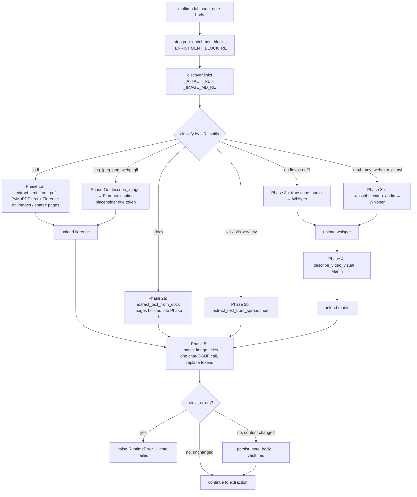

# Multimedia Enrichment

**What this covers.** How attachments referenced from a note's markdown (PDF, images, audio, video, Word, spreadsheets) are discovered, resolved to files on disk, turned into text by in-process models (Florence-2 for vision, Whisper for speech, Marlin for video) or lightweight parsers (PyMuPDF, python-docx, openpyxl, csv), and appended to the vault `.md` as enrichment blocks that the extraction stage then reads. It documents `backend/app/services/multimedia.py` end to end, the multimodal phase of the ingestion agent (`multimodal_node` in `backend/app/workflows/agents/ingestion_agent.py`), the public entry points of `backend/app/services/multimodal_runtime.py` (`describe_image_path`, `transcribe_audio_path`, `caption_video_path`) with their prompts/parameters, the exact block formats and how re-ingest strips them, ordering and model-residency swaps, temp-file rules, error handling, and every config key involved. Model download/patching internals of `multimodal_runtime.py` and GGUF residency belong to [12-local-models-and-inference.md](12-local-models-and-inference.md).

**Related docs:** [Ingestion pipeline](10-ingestion-pipeline.md) · [Local models & inference](12-local-models-and-inference.md) · [Notes, wikilinks & vault files](09-notes-wikilinks-and-vault-files.md) · [Knowledge bases & vaults](08-knowledge-bases-and-vaults.md) · [API reference](07-api-reference.md) · [Frontend notes editor](19-frontend-notes-editor.md) · [Configuration reference](21-configuration-reference.md) · [Data directory layout](22-data-directory-layout.md) · [Decisions & constraints](26-decisions-and-constraints.md)

---

## 1. Responsibilities & boundaries

**Owns**

- Attachment discovery in note markdown and classification by extension (`multimodal_node`).
- Resolution of `/vault-files/<kb_id>/<rel>` URLs (and `http(s)` URLs, and bare local paths) to a readable file (`MultimediaService._download_temp_file`, `_resolve_vault_local_path`).
- Per-type extraction handlers and the text they produce (`extract_text_from_pdf`, `describe_image`, `transcribe_audio`, `transcribe_video_audio`, `describe_video_visual`, `extract_text_from_docx`, `extract_text_from_spreadsheet`).
- The enrichment block grammar appended to notes, the strip-on-reingest regex, phase ordering, and model unload calls between phases.
- Cloud-vision fallback for images when local Florence fails and AI mode is not local-only.

**Does not own**

- Model download/snapshot management (`services/multimodal_models.py`), Florence/Whisper/Marlin loading, patching, device selection, exclusive residency (`services/multimodal_runtime.py` internals, `services/local_models.py`) — [12](12-local-models-and-inference.md).
- Uploading files into the vault (`api/files.py` → `services/local_storage.py` → `services/vault.save_attachment`) and serving them (`/vault-files` static route in `api_desktop.py`) — [09](09-notes-wikilinks-and-vault-files.md) / [07](07-api-reference.md). This doc only describes the URL shape those produce, and the audio transcoding done at upload time because it determines what Whisper receives.
- LLM extraction of the enriched text — [10](10-ingestion-pipeline.md).
- Frontend rendering of enrichment blocks (`frontend/src/components/segmented-note-content.tsx`) — [19](19-frontend-notes-editor.md); only the marker contract is stated here.

## 2. Files

| Path | Purpose | Key exports |
|---|---|---|
| `backend/app/services/multimedia.py` | `MultimediaService`: path resolution, temp-file rules, SSRF guard, per-type extractors, cloud vision fallback, unload helpers | `multimedia_service`, `MultimediaService`, `_format_timestamp` |
| `backend/app/workflows/agents/ingestion_agent.py` (`multimodal_node`, `_batch_image_titles`, `_ENRICHMENT_BLOCK_RE`, `_strip_prior_multimedia_enrichment`, `multimedia_concurrency_limit`) | Discovery, classification, phase ordering, status updates, block assembly, vault write-back | see [10](10-ingestion-pipeline.md) §6.2 |
| `backend/app/services/multimodal_runtime.py` | In-process Florence-2 / Whisper / Marlin: `describe_image_path`, `_describe_pil`, `_resize_for_florence`, `transcribe_audio_path`, `_load_audio_mono_16k*`, `_resolve_ffmpeg_bins`, `caption_video_path`, `unload`, `status` | `multimodal_runtime` |
| `backend/app/services/multimodal_models.py` | `multimodal_model_path(kind)`, `is_hf_snapshot_ready(path)`, `ensure_multimodal_models` (download) | — |
| `backend/app/api/files.py` | `POST /api/v1/upload` (ffmpeg transcode of webm/ogg/opus → m4a), `DELETE /api/v1/files/{key}` | `router`, `_transcode_to_m4a` |
| `backend/app/services/local_storage.py` | `store_upload` → `/vault-files/{kb_id}/{rel}` URL; `vault_rel_from_url`; `remove_upload` | — |
| `backend/app/core/config.py` | `PDF_VISUAL_*`, `FLORENCE_MAX_IMAGE_PIXELS`, `MODEL_FLORENCE/WHISPER/MARLIN_{HF,LOCAL}`, `MULTIMEDIA_CONCURRENCY`, `AI_SETUP_MODE`, `OPENAI_*`, `GEMINI_*` | `settings` |
| `frontend/src/components/segmented-note-content.tsx` | Renders `[Image: …]`, `[PDF Extraction (…)]:`, `[Audio Transcript (…)]:`, `[Video Transcript (…)]:` segments | — |
| `backend/requirements.txt` | `PyMuPDF==1.26.7`, `python-docx==1.1.2`, `openpyxl==3.1.5`, `av`, `pydub`, `transformers`, `torch` | — |

## 3. Architecture / flow



Every handler runs in `asyncio.to_thread`; the whole node body is inside the process-global `multimedia_concurrency_limit` semaphore (`MULTIMEDIA_CONCURRENCY`, default 1), so at most one note is in this phase at a time.

## 4. Discovery, URL resolution and file access

### 4.1 Attachment discovery (`multimodal_node`)

The node first strips previous enrichment (§6.2), then scans the remaining body with two regexes (module-local inside the function):

```python
_URL = r"(?:https?://[^)]+|/(?:vault-files)/[^)]+)"
_ATTACH_RE = re.compile(rf"\[(📎|🎤)\s*(.*?)\]\(({_URL})\)")   # [📎 Name](url) / [🎤 Voice Recording](url)
_IMAGE_MD_RE = re.compile(rf"!\[([^\]]*)\]\(({_URL})\)")        # 
```

- URLs run to the closing `)` only, so unencoded spaces/commas in uploaded filenames survive. Only `http(s)://` and `/vault-files/` targets are considered; relative `attachments/…` links (as written by some vault tools) are **not** discovered, and `[[wikilinks]]` are ignored.
- `_add_attachment(emoji, filename, url)`: dedup key = `unquote(url without query).lower()`; display name = link text, or the URL's basename when the text is empty (image `alt`). Each attachment dict: `{emoji, filename, url, lower_url}`. `` hits are tagged with emoji `📎`.
- Classification is purely by `lower_url` suffix (query string already removed), with one exception: anything linked with `🎤` counts as audio regardless of extension (unless it has a video suffix):

| Bucket | Suffixes |
|---|---|
| `pdfs` | `.pdf` |
| `images` | `.jpg .jpeg .png .webp .gif` |
| `docx_files` | `.docx` (`.doc` is unsupported) |
| `spreadsheets` | `.xlsx .xls .csv .tsv` (`.xls` raises at extraction time) |
| `audio_files` | `.m4a .mp3 .wav .ogg .aac`, or emoji `🎤` — and not a video suffix |
| `videos` | `.mp4 .mov .webm .mkv .avi` |

A `.webm` link is therefore treated as **video** even if it is a voice recording — which is why the upload endpoint transcodes browser recordings (webm/ogg/opus) to `.m4a` first (§4.4). Unmatched attachments are logged `Skipped (Unsupported Type): <url>` and ignored (not an error).

### 4.2 Resolving `/vault-files/...` to disk (`MultimediaService._resolve_vault_local_path`)

Accepts `/vault-files/<kb_id>/<rel>`, `vault-files/<kb_id>/<rel>`, or a full `http(s)://host/vault-files/<kb_id>/<rel>` (only the URL path is used). Steps: drop the query string, normalise `\` → `/`, split the remainder after `/vault-files/` into `kb_id` and `rel` (URL-unquoted, leading `/` stripped); reject if either part is empty or `rel` contains a `..` segment; `kb_registry.get_kb(kb_id)` → must exist and have `vault_path`; `abs = (vault_root / rel).resolve()` must stay under `vault_root.resolve()` (otherwise "Rejected path escape") and must be an existing regular file (otherwise "Vault file missing" → `None`). Note that `kb_id` in the URL is authoritative — a note in KB A can reference a file in KB B's vault and it will be read.

### 4.3 `_download_temp_file(path_or_url) -> local path` and the temp-file rule

Resolution order: (1) `os.path.isfile(path_or_url)` → returned as-is (bare absolute paths work; used by `transcribe_video_audio` when it re-enters `transcribe_audio` with an already-local path); (2) vault resolution above; (3) otherwise must start with `http` or `FileNotFoundError("Attachment not found: …")`; (4) remote: `_assert_public_http_url` (scheme must be http/https with a hostname; **every** resolved address must be non-loopback, non-private, non-link-local, non-reserved, non-multicast, non-unspecified — blocks the local API/Qdrant/Meili/Firefly and LAN; DNS failure → `ValueError`), then streamed `requests.get(timeout=300)` into `tempfile.NamedTemporaryFile(delete=False, suffix=<last dotted segment of the URL or .tmp>)` with a hard cap `_MAX_REMOTE_DOWNLOAD_BYTES = 512 MiB` (over → file unlinked, `ValueError`).

**Never delete vault files as temps.** Every handler ends with

```python
if self._is_ephemeral_download(original_ref, local_path) and os.path.exists(local_path):
    os.remove(local_path)
```

`_is_ephemeral_download` returns False when `local_path == original_ref`, when the vault resolution of `original_ref` equals `local_path`, or when `original_ref` is itself a file that `samefile`s `local_path`; only genuinely downloaded temp files are removed. Intermediate temp files created *by* handlers (PDF page renders, extracted PDF images) are always deleted in `finally` blocks. The `PDF` handler computes `owns_temp` once up front because the PyMuPDF document is opened on the path.

### 4.4 What upload produces (context for the URL shapes above)

`POST /api/v1/upload` (`api/files.py`): if `content_type ∈ {audio/webm, audio/ogg, audio/opus, audio/x-matroska}` or extension ∈ `{webm, ogg, opus}`, the bytes are transcoded with system `ffmpeg -y -i in -c:a aac -b:a 128k out.m4a` (60 s timeout; on missing ffmpeg/timeout/failure the original bytes and extension are kept) and the filename hint becomes `recording.m4a`; otherwise the original filename is used. `local_storage.store_upload` → `vault.save_attachment` writes under `<vault>/attachments/` and returns `url = /vault-files/{kb_id}/{rel}` (also echoed as `href`, `local_path`; `rel` as `rel_path`/`key`). The notes editor inserts `[📎 <filename>](<url>)`, `[🎤 Voice Recording](<url>)` or ``.

## 5. Per-type handlers

All `MultimediaService` methods are synchronous and are called through `asyncio.to_thread` by the agent. All heavy model work is delegated to `multimodal_runtime`, whose public methods each take `self._lock` (an `RLock`), lazily load their model family (evicting GGUFs and the other families first — "exclusive residency"), and run inference.

### 5.1 PDF — `extract_text_from_pdf(pdf_path, progress_callback=None) -> str`

Agent wrapper `_handle_pdf` passes a `_progress(stage, model)` callback that marshals status writes back to the event loop (`asyncio.run_coroutine_threadsafe(...).result(timeout=30)`).

Per page (`fitz.open(local_path)`, pages numbered from 1):

1. `native_text = page.get_text().strip()`; progress `"PDF: page i/N, extracting text"`.
2. Embedded images: for each `page.get_images(full=True)` entry, progress `"PDF: page i/N, describing image j/M"` / `Florence-2`; `doc.extract_image(xref)` → bytes written to a `NamedTemporaryFile(suffix=.<ext>)` → `_describe_image_local(path)` (Florence) → collected as `"Image j: <caption>"`; per-image failures are logged and skipped; temp file always removed.
3. Sparse/scanned page render — `_pdf_page_needs_render(page, native_text, image_descriptions)` is True when **all** of: `PDF_VISUAL_EXTRACTION_ENABLED`; `len(native_text) < PDF_VISUAL_TEXT_THRESHOLD` (default 80 chars); no embedded-image captions were produced for the page; and the page has images (`get_images`) or vector drawings (`get_drawings`) or no text at all. Subject to `PDF_VISUAL_EXTRACTION_MAX_PAGES` (default 0 = unlimited; counts only pages that actually produced a render description). Render: `page.get_pixmap(matrix=fitz.Matrix(zoom, zoom), alpha=False, annots=True)` with `zoom = max(PDF_VISUAL_RENDER_DPI, 72) / 72` (default 144 dpi) → temp `.png` → Florence → `"Page render: <caption>"`; progress `"PDF: page i/N, describing page render"` / `Florence-2`.
4. Page block: `--- Page i ---`, then `Native text:\n…` if any, then `Image descriptions:\n…` if any, joined by blank lines. Pages with neither are omitted. Progress `"PDF: page i/N complete"`.

Output: pages joined by `\n\n`; empty → the literal string `"PDF contains no extractable native or visual content."`. Any exception → `RuntimeError("PDF extraction failed: …")`. Passwords/encrypted PDFs are not handled specially (PyMuPDF raises → RuntimeError → note failed).

### 5.2 Images — `describe_image(image_path) -> str`

1. `_describe_image_local(path)` → `multimodal_runtime.describe_image_path(path)`:
   - `PIL.Image.open`, convert to RGB, `_resize_for_florence`: if `w*h > FLORENCE_MAX_IMAGE_PIXELS` (default 1 500 000) scale down by `sqrt(max/pixels)` with LANCZOS `thumbnail`; then pad to a **square** black canvas (Florence's remote vision encoder asserts square feature maps).
   - Task prompt `"<MORE_DETAILED_CAPTION>"`; pixels via `processor.image_processor(images=…)`, text via `processor._construct_prompts([prompt])` + tokenizer; greedy decode `generate(max_new_tokens=256, num_beams=1, do_sample=False, use_cache=False)` (beam search is very slow on MPS); `post_process_generation(task=prompt, image_size=(w,h))[prompt]`.
2. If local returns empty or raises and `ai_gate.chat_is_local_only()` is false: `_describe_image_cloud` — base64 data URL (`image/png` if `.png` else `image/jpeg`), OpenAI `chat.completions` (`OPENAI_MODEL or gpt-4o-mini`, `max_tokens=400`, text "Describe this image briefly.") when `OPENAI_API_KEY`, else Gemini `generate_content` (`GEMINI_MODEL or gemini-2.0-flash`) when `GEMINI_API_KEY`. Errors → `""`.
3. Still nothing → `RuntimeError("Image description failed (local Florence unavailable)")`.

The agent then emits the block with a placeholder title `{{ORB_IMAGE_TITLE_n}}`; titles for all images of the note are generated in one LLM call after every model phase (`_batch_image_titles`, phase 5; stage `"Naming images"`), falling back to the filename per image. GIFs: only the first frame is captioned (PIL default).

### 5.3 Audio — `transcribe_audio(audio_path) -> str`

`multimodal_runtime.transcribe_audio_path(path)`:

- Decode to mono float32 @ 16 kHz via `_load_audio_mono_16k`: prefer system `ffmpeg`+`ffprobe` (searched on `PATH` plus `/opt/homebrew/bin`, `/usr/local/bin`, `/usr/bin`, `~/bin` because GUI-launched macOS apps lack Homebrew on PATH) through **pydub** (`AudioSegment.from_file → set_frame_rate(16000).set_channels(1)`, samples normalised by sample width); if either binary is missing or decoding fails, fall back to **PyAV** (`av.open`, first audio stream, `AudioResampler(format="flt", layout="mono", rate=16000)`, frames concatenated). No audio stream → `RuntimeError` (PyAV path) → note failed for audio files; for videos this is caught (§5.4).
- Empty signal → `""`.
- Whisper (`AutoModelForSpeechSeq2Seq`, fp32 on CPU / fp16 otherwise): `processor(audio, sampling_rate=16000).input_features` → `model.generate(input_features, generation_config=model.generation_config, language="en", task="transcribe")` → `batch_decode(skip_special_tokens=True)[0]`.
- **Two engines, chosen per machine.** `whisper_engine.choose` picks `mlx-whisper` on Apple Silicon and `transformers` elsewhere. CTranslate2 and PyTorch have no Metal backend, so "auto" device selection on a Mac resolves to CPU: 0.71× realtime at 420% CPU, against 3.07× at 6% CPU under MLX. Selection order matches local-transcription-service — an explicit engine is never silently substituted, a model already on disk states which runtime can read it, and only an *installed* engine is chosen automatically.
- **The default is large-v3, not turbo.** Turbo keeps the 32-layer encoder but cuts the decoder to 4 layers; WER on clean read speech barely moves, which makes it look like a free 2.6×. On distant-mic audio it invents text in low-signal stretches — repetition loops, foreign script, ~20% more words than large-v3 on identical input. An existing turbo download keeps working (and logs a warning) so changing the default breaks nobody.
- **English is no longer forced.** `WHISPER_LANGUAGE` defaults to `en` but is configurable and may be set to null for detection; pinning a language on non-English audio is itself a hallucination source.
- **No chunking, no timestamps.** The feature extractor pads/truncates to a 30-second window, so recordings longer than ~30 s are truncated to their first 30 s unless the installed `transformers` version's `generate` performs long-form sequential decoding for this input shape (it is not requested explicitly — `return_timestamps`/`chunk_length_s` are not set). Treat long recordings as a known limitation.

### 5.4 Video — two passes

- `transcribe_video_audio(video_path) -> str`: `av.open` to check for a video stream; none → treated as audio (`transcribe_audio`); otherwise `transcribe_audio(local_path)` with **all exceptions swallowed** (no audio track → `""`, logged). Because `transcribe_audio` is re-entered with the already-local path, `_is_ephemeral_download` prevents double deletion.
- `describe_video_visual(video_path) -> str`: no video stream → `""`; else `_caption_video_with_marlin` → `multimodal_runtime.caption_video_path(path)` → `self._marlin_model.caption(video_path)` (remote-code method of `lunahr/Marlin-2B-ungated`) returning `{"scene": str, "events": [{"start", "end", "description"}], "elapsed_seconds"}`. Frame sampling is controlled by the Qwen-VL video reader env vars set at import of `multimodal_runtime.py` with `os.environ.setdefault`: `FORCE_QWENVL_VIDEO_READER=pyav`, `VIDEO_MAX_PIXELS=200704`, `FPS=2.0`, `FPS_MAX_FRAMES=240`, `FPS_MIN_FRAMES=4` (so 2 fps, between 4 and 240 frames, each ≤ 200 704 px — override by exporting the env var before the backend starts; they are **not** `settings` keys). `_patch_video_decoder` forces `transformers`' `BaseVideoProcessor.fetch_videos` to the PyAV backend. Output text:

  ```
  ### Visual Analysis
  **Scene:** <scene>

  **Events:**
  - 0:00–0:05 — <description>
  - 1:02:10–1:02:15 — <description>
  ```
  (`_format_timestamp`: `M:SS`, or `H:MM:SS` when ≥ 1 h; en dash between start/end, em dash before the description.) No scene → `""`. Marlin errors → logged, `""` (non-fatal).
- `process_video()` (combines both with a `### Spoken Content` heading) exists but is **not** used by the agent; the agent calls the two passes in separate phases so Whisper is unloaded before Marlin loads.

### 5.5 Word — `extract_text_from_docx(path) -> str`

`python-docx`, in this order: non-empty paragraph texts; each table as `--- Table k ---` with rows rendered `cell | cell | cell` (all-empty rows skipped); `--- Header ---` and `--- Footer ---` blocks; and `--- Text boxes ---`. Parts joined by blank lines. Empty → `"Word document contains no extractable text."`. Missing library → `RuntimeError("Word extraction unavailable: python-docx is not installed.")`; other errors → `RuntimeError("Word extraction failed: …")`.

`python-docx` walks `document.paragraphs` only, so the last two blocks are reached deliberately: headers/footers via `section.header/.footer` (deduped, since a running head repeated on every section is pure token cost), and text boxes via `_docx_text_boxes` — an XPath over `.//w:txbxContent//w:t`, because floating shapes have no python-docx API. That matters because a document's title, author and figure captions frequently live in exactly those places.

**Embedded images** — `extract_docx_images(path, max_images=20) -> list[str]` writes each embedded image part to a temp file and returns the paths (caller deletes them). Parts under 8 KB are skipped as chrome: bullets, rules and spacers describe as noise. `ingestion_agent` calls this **before** the phase loop and appends each image to the `images` list, so they ride the existing Florence pass rather than forcing a reload in a later phase — previously a diagram inside a Word file was invisible while the same file attached directly got described. Failures are logged and yield `[]`; extraction never blocks the text path.

**Footnotes/endnotes and comments are still ignored**, and legacy `.doc` is not readable by python-docx at all — `ingestion_agent` now logs a warning and appends `[Unsupported (<name>)]: legacy .doc format — re-save as .docx` instead of skipping in silence. Converting `.docx` → PDF was considered and rejected: it needs LibreOffice, Word (via `docx2pdf`) or pandoc — none bundleable — to recover data python-docx can already read.

### 5.6 Spreadsheets — `extract_text_from_spreadsheet(path) -> str`

- `.xlsx`: `openpyxl.load_workbook(read_only=True, data_only=True)` (formulas → cached values); per sheet `--- Sheet: <name> ---` then rows as tab-joined non-`None` cell strings; sheets/rows with nothing are skipped. Empty → `"Spreadsheet contains no extractable text."`.
- `.csv` / `.tsv`: `csv.reader` with `,` / `\t`, `utf-8` with `errors="ignore"`; rows as tab-joined non-blank cells. Empty → same message.
- `.xls` → `RuntimeError("Legacy .xls is not supported. Please convert to .xlsx.")`; anything else → `RuntimeError("Unsupported spreadsheet format.")`.

### 5.7 Summary table

| Extension(s) | Bucket / phase | Handler (`MultimediaService`) | Model(s) | Block written |
|---|---|---|---|---|
| `.pdf` | 1a | `extract_text_from_pdf` | PyMuPDF (+ Florence-2 for embedded images and sparse page renders) | `[PDF Extraction (<filename>)]: <pages>` |
| `.jpg .jpeg .png .webp .gif` | 1b (+5) | `describe_image` | Florence-2 (`<MORE_DETAILED_CAPTION>`); OpenAI/Gemini vision fallback; chat LLM for the title | `[Image: <title>]\nThe image titled "<title>" shows the following: <caption>` |
| `.docx` | 2a (+ 1 for its images) | `extract_text_from_docx`, `extract_docx_images` | none for text; Florence-2 for embedded images | `[Word Extraction (<filename>)]: <text>`, plus one `[Image: …]` block per embedded image |
| `.xlsx .csv .tsv` (`.xls` errors) | 2b | `extract_text_from_spreadsheet` | none (openpyxl / csv) | `[Spreadsheet Extraction (<filename>)]: <text>` |
| `.m4a .mp3 .wav .ogg .aac` or `🎤` | 3a | `transcribe_audio` | Whisper large-v3-turbo (ffmpeg/pydub or PyAV decode) | `[Audio Transcript (<filename>)]: <text>` |
| `.mp4 .mov .webm .mkv .avi` | 3b | `transcribe_video_audio` | Whisper | `[Video Audio Transcript (<filename>)]:\n\n<text>` (omitted when empty) |
| same videos | 4 | `describe_video_visual` | Marlin-2B (PyAV frames, 2 fps) | `[Video Visual Analysis (<filename>)]:\n\n### Visual Analysis …` (omitted when empty) |
| anything else | — | — | — | nothing; logged as skipped |

## 6. Enrichment blocks in the vault `.md`

### 6.1 Exact format

Blocks are appended, in phase order, to the end of the (stripped) user body. Each starts with `\n\n` followed by a bracketed marker:

| Marker | Separator after marker | Body |
|---|---|---|
| `[PDF Extraction (<filename>)]` | `: ` | page blocks (`--- Page 1 ---\n\nNative text:\n…\n\nImage descriptions:\nImage 1: …\nPage render: …`) |
| `[Image: <title>]` | `\n` | `The image titled "<title>" shows the following: <caption>` |
| `[Word Extraction (<filename>)]` | `: ` | paragraphs / `--- Table k ---` / `--- Header ---` / `--- Footer ---` / `--- Text boxes ---` |
| `[Spreadsheet Extraction (<filename>)]` | `: ` | `--- Sheet: name ---` rows |
| `[Audio Transcript (<filename>)]` | `: ` | transcript |
| `[Video Audio Transcript (<filename>)]` | `:\n\n` | transcript |
| `[Video Visual Analysis (<filename>)]` | `:\n\n` | `### Visual Analysis\n**Scene:** …\n\n**Events:**\n- …` |

`<filename>` is the link text (or URL basename), unescaped — a filename containing `)` or `]` will confuse both the strip regex and the frontend parser. `<title>` is the batched LLM title or the filename.

The final body is `content.strip()`-ed before extraction, and the vault gets the un-stripped concatenation (they differ only by trailing whitespace). The write goes through `note_files.persist_note_body`, which runs `normalize_vault_file_refs` on the whole body (so `/vault-files/...` links inside the block are normalised like user links) and marks the write as self-originated so the vault watcher does not flag it as an external change.

### 6.2 Strip on re-ingest

```python
_ENRICHMENT_BLOCK_RE = re.compile(
    r"\n\n\[(?:"
    r"PDF Extraction \([^\]]+\)|"
    r"Image:[^\]]+|"
    r"Audio Transcript \([^\]]+\)|"
    r"Video Audio Transcript \([^\]]+\)|"
    r"Video Visual Analysis \([^\]]+\)|"
    r"Word Extraction \([^\]]+\)|"
    r"Spreadsheet Extraction \([^\]]+\)"
    r")\]"
)
def _strip_prior_multimedia_enrichment(content):  # content[: first_match.start()].rstrip()
```

Detection is by the **first** marker preceded by a blank line; everything from there to the end of the note is discarded. Therefore: (a) blocks are assumed to be a trailing section — user text written after the first block is lost on re-ingest; (b) a marker without a preceding blank line (e.g. at the top of the file, or after a single newline) is not detected and gets re-extracted as user text plus a second copy appended; (c) a user paragraph that happens to start with `[Image: …]` is treated as a block. `content_changed` is True when stripping alone changed the body, so a re-ingest of a note whose attachments were removed still rewrites the `.md` without the stale blocks.

### 6.3 Consumers of the markers

- Extraction LLM: sees the blocks as ordinary note text (the `[Image: <title>]` line is designed to make the image an extractable named entity).
- Frontend `segmented-note-content.tsx` `MARKER_RE = /(\[Image:[^\]]+\]|\[PDF Extraction[^\]]*\]:|\[Audio Transcript[^\]]*\]:|\[Video Transcript[^\]]*\]:)/` renders labelled segments for image/pdf/audio and for a **`[Video Transcript …]:`** marker that the backend never writes. `[Video Audio Transcript …]`, `[Video Visual Analysis …]`, `[Word Extraction …]`, `[Spreadsheet Extraction …]` fall through as plain text (see [19](19-frontend-notes-editor.md)). Discrepancy to fix on either side.
- `_ENRICHMENT_BLOCK_RE` (above) — the only backend consumer.

## 7. Ordering, concurrency, model residency, configuration

### 7.1 Phase order and why

```
1. Florence  : all PDFs, then all images           → unload("florence")
2. no model  : docx, spreadsheets
3. Whisper   : audio files, then video audio       → unload("whisper")
4. Marlin    : video visuals                       → unload("marlin")
5. chat GGUF : one batched image-title call (same GGUF the extraction stage needs next)
```

Each family is loaded lazily on first use (`_load_florence` / `_load_whisper` / `_load_marlin`), and loading calls `_unload_ggufs()` (chat/embed/rerank GGUFs) and `_unload_except(<family>)` first, so at most one HF family plus zero GGUFs is resident during this node. The explicit `unload(...)` calls between phases (via `multimedia_service.unload_local_models(family)` / `unload_marlin()`) free memory even when the next phase is empty, and each writes a status (`"Unloading image model"` etc.). Phase 5 was moved after all model phases specifically because a chat call per image used to evict Florence between images (multi-GB reload per image). After the node, the chat GGUF loaded for titling stays resident for extraction; nothing here unloads at the end — residency is managed by the GGUF idle watcher (`ORB_MODEL_IDLE_SECONDS`, see [12](12-local-models-and-inference.md)).

Each `multimodal_runtime` public method holds `self._lock` for the whole inference, and the global `multimedia_concurrency_limit` semaphore serialises notes, so there is no intra-process parallelism in this phase. Within a note, attachments of a phase are processed sequentially in document order (dedup keeps first occurrence).

### 7.2 Error handling

- Per attachment: exceptions from a handler are caught in `_run_phase`, logged `[<phase>] File Processing Failed: …`, and recorded as `"<filename>: <error>"` in `media_errors`; processing continues with the next attachment and the next phases.
- After phase 5: if `media_errors` is non-empty → `RuntimeError("Multimedia processing failed for: a.pdf: …; b.m4a: …")` propagates out of `ingestion_agent.ainvoke` → the note is marked failed, and the vault file is **not** rewritten (successful enrichments of sibling attachments are discarded; they will be recomputed on the next attempt).
- Non-fatal by design: missing audio track in a video, Marlin failure (empty visual block), per-image failures inside a PDF, cloud vision failure, image-title failure (filename fallback), unload failures (warning).
- Fatal by design: unresolvable attachment (`FileNotFoundError`), private/oversize remote URL, Florence unavailable with no cloud fallback, Whisper/PyAV decode failure on a pure audio file, PDF/docx/xlsx parser errors, model snapshot missing (`RuntimeError("<Model> model not found at … Download multimodal models in Setup.")`), vault write failure after 3 retries.
- Status polling: because status writes happen per phase (and per PDF page/image), `GET /api/v1/notes/{id}/status` shows fine-grained progress during long PDFs; the `processing_model` field tells the UI which model is resident.

### 7.3 Configuration

| Key | Default | Where read | Effect |
|---|---|---|---|
| `MULTIMEDIA_CONCURRENCY` | `1` | `ingestion_agent.py` import | Global semaphore for the multimodal phase. |
| `PDF_VISUAL_EXTRACTION_ENABLED` | `True` | `_pdf_page_needs_render` | Enables full-page Florence renders for sparse/scanned pages. Embedded-image captioning is **not** gated by this. |
| `PDF_VISUAL_TEXT_THRESHOLD` | `80` | `_pdf_page_needs_render` | Pages with ≥ this many native chars are never rendered. |
| `PDF_VISUAL_EXTRACTION_MAX_PAGES` | `0` (unlimited) | `extract_text_from_pdf` | Cap on rendered pages per PDF (pages that produced a caption). |
| `PDF_VISUAL_RENDER_DPI` | `144` (min 72) | `_describe_pdf_page_render` | Render resolution before Florence (which then downsizes to `FLORENCE_MAX_IMAGE_PIXELS`). |
| `FLORENCE_MAX_IMAGE_PIXELS` | `1_500_000` | `_resize_for_florence` | Downscale threshold (w×h) before square padding; `0` disables downscaling. |
| `MODEL_FLORENCE_HF` / `MODEL_FLORENCE_LOCAL` | `microsoft/Florence-2-large` / `florence-2-large` | `multimodal_models.py` | HF repo and `MODELS_DIR` folder name. |
| `MODEL_WHISPER_HF` / `MODEL_WHISPER_LOCAL` | `openai/whisper-large-v3-turbo` / `whisper-large-v3-turbo` | same | — |
| `MODEL_MARLIN_HF` / `MODEL_MARLIN_LOCAL` | `lunahr/Marlin-2B-ungated` / `marlin-2b` | same | — |
| `LLM_PROVIDER` (via `ai_gate.chat_is_local_only`) | `local` | `describe_image` | Cloud vision fallback only when the chosen chat provider is not local. |
| `OPENAI_API_KEY`, `OPENAI_MODEL` (`gpt-4o-mini`), `GEMINI_API_KEY`, `GEMINI_MODEL` (`gemini-2.0-flash`) | unset | `_describe_image_cloud` | Fallback vision providers (OpenAI preferred). |
| env `FORCE_QWENVL_VIDEO_READER`, `VIDEO_MAX_PIXELS`, `FPS`, `FPS_MAX_FRAMES`, `FPS_MIN_FRAMES` | `pyav`, `200704`, `2.0`, `240`, `4` | `multimodal_runtime.py` import (`setdefault`) | Marlin/Qwen-VL frame sampling. Process env only. |
| `MODELS_DIR` (paths.json) | — | `multimodal_model_path` | Where snapshots live; `is_hf_snapshot_ready` must be True or the handler raises. |
| system `ffmpeg`/`ffprobe` | optional | `_resolve_ffmpeg_bins`, `api/files.py` | Preferred audio decoder and upload transcoder; PyAV fallback for decoding, no transcoding fallback. |

## 8. Gotchas, extension points, history

### 8.1 Gotchas

1. **Attachment discovery only sees `/vault-files/` and `http(s)` URLs** — vault-relative `attachments/x.pdf` links (Obsidian style) are silently ignored by ingestion even though `_delete_note_impl` understands them.
2. **The `kb_id` inside `/vault-files/<kb_id>/…` decides which vault is read**, not the note's KB.
3. **`.webm` is always video**; browser voice notes must be transcoded to `.m4a` at upload (they are, when ffmpeg exists — without ffmpeg the recording stays `.webm`, gets routed to Whisper-then-Marlin as a video, and Marlin will try to caption a black audio-only container: `av` reports no video stream so it returns `""`).
4. **Whisper is called with a single 30-second feature window and `language="en"`**; long or non-English recordings are truncated/mis-transcribed. No timestamps are produced for audio (only Marlin events carry timestamps).
5. **PDF images are captioned with Florence regardless of `PDF_VISUAL_EXTRACTION_ENABLED`**; that flag only controls whole-page renders. A 300-page image-heavy PDF therefore means hundreds of Florence calls.
6. **One failing attachment fails the whole note** and discards the other attachments' successful output (nothing is cached).
7. **Strip-on-reingest truncates at the first marker** — never let users write below the enrichment section, and never generate a marker without the `\n\n` prefix.
8. **Frontend marker mismatch** (`[Video Transcript …]` vs `[Video Audio Transcript …]`, no Word/Spreadsheet segment types).
9. **Image titles come from the chat LLM, not Florence**; if the LLM is down, image entities are named after their filenames.
10. **`process_video()` is dead code** for the agent; do not "fix" ordering by calling it — it would load Whisper and Marlin back to back inside one handler.
11. Remote downloads are limited to 512 MiB and public addresses; a Docker-internal or `localhost` media URL will fail with `Refusing to fetch non-public address`.
12. `describe_image` swallows the local exception and only raises a generic `RuntimeError` after the cloud fallback — the real Florence error is at `WARNING` level (`Local image description failed: …`).
13. Env-var frame-sampling knobs are read at import via `setdefault`; setting them in `.env`/`settings` has no effect unless exported into the process environment before `multimodal_runtime` is imported.

### 8.2 Extension points

| Goal | Touch |
|---|---|
| New file type | `MultimediaService.extract_text_from_<type>`; classification list + `_run_phase` in `multimodal_node` (pick the phase by model needs; model-free parsers go in phase 2); marker alternative in `_ENRICHMENT_BLOCK_RE`; frontend `MARKER_RE` + segment style. |
| Recognise `attachments/…` relative links | Extend `_URL` in `multimodal_node` and teach `_download_temp_file` to join the note's vault (it currently only understands `/vault-files/<kb>/…`). |
| Long-audio support | `transcribe_audio_path`: pass `return_timestamps=True` / chunked long-form generation, or slice the numpy signal into 30 s windows and concatenate; then decide a timestamp line format for the `[Audio Transcript]` block. |
| Different Florence task (OCR, region captions) | `_describe_pil` prompt (`<OCR>`, `<DETAILED_CAPTION>`, …) and `post_process_generation(task=…)`. |
| Skip cloud vision entirely | `describe_image`: the `chat_is_local_only()` check — a local chat model keeps images on the device. |
| Cache per-attachment results across re-ingests | Would need a store keyed by file hash; today nothing persists except the final block in the `.md`. |

### 8.3 History / rationale

- `3a3ece2` (Jun 10 2026): video support — Marlin, `_format_timestamp`, `process_video`; videos detected via `📎` links. The current code classifies videos by extension only.
- `1986a4b` (Jun 11 2026): PDF visual extraction (`PDF_VISUAL_*` keys, page renders via PyMuPDF at configurable DPI, sparse-page heuristic).
- `a8587e6` (Jun 12 2026): multimedia moved to HTTP sidecars (`local_models_service`, `marlin_service`) with `MULTIMEDIA_CONCURRENCY`; later folded back into the API process as `multimodal_runtime` ("no HTTP model sidecars"), keeping the exclusive-residency idea.
- `f8f527f` (Aug 6 2026): SSRF guard (`_assert_public_http_url`), 512 MiB cap, streamed downloads; `_is_ephemeral_download` so vault files are never removed as temps.
- Uncommitted (Sep 2026): batched image titling after all model phases (`_batch_image_titles`, `{{ORB_IMAGE_TITLE_n}}` tokens, `"Naming images"` stage); `model_load_clock` records Florence/Whisper/Marlin load times for the ingest `[Timing]` line.
