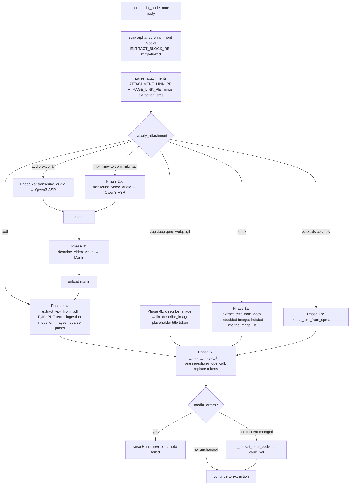

# Multimedia Enrichment

**What this covers.** How attachments referenced from a note's markdown (PDF, images, audio, video, Word, spreadsheets) are discovered, resolved to files on disk, turned into text — speech by the in-process **Qwen3-ASR** (`multimodal_runtime.py` + `asr_engine.py`, MLX on Apple Silicon or transformers elsewhere, with optional speaker labels), video by **Marlin**, images and sparse PDF pages by **the KB's ingestion model itself** (`LLMService.describe_image`: a local GGUF through its vision projector, or a cloud provider's image input), the rest by lightweight parsers (PyMuPDF, python-docx, openpyxl, csv) — and placed into the vault `.md` as delimited enrichment blocks that the extraction stage then reads. It documents `backend/app/services/multimedia.py` end to end, the multimodal phase of the ingestion agent (`multimodal_node`, `parse_attachments`, `classify_attachment`, `extract_attachment`, `place_extraction` in `backend/app/workflows/agents/ingestion_agent.py`), the public entry points of `backend/app/services/multimodal_runtime.py` (`transcribe_audio_path`, `caption_video_path`) with their parameters, the exact block formats and how re-ingest strips them, ordering and model-residency swaps, temp-file rules, error handling, and every config key involved. Model download internals, the ASR engine choice and GGUF/projector residency belong to [12-local-models-and-inference.md](12-local-models-and-inference.md).

**Related docs:** [Ingestion pipeline](10-ingestion-pipeline.md) · [Local models & inference](12-local-models-and-inference.md) · [Notes, wikilinks & vault files](09-notes-wikilinks-and-vault-files.md) · [Knowledge bases & vaults](08-knowledge-bases-and-vaults.md) · [API reference](07-api-reference.md) · [Frontend notes editor](19-frontend-notes-editor.md) · [Configuration reference](21-configuration-reference.md) · [Data directory layout](22-data-directory-layout.md) · [Decisions & constraints](26-decisions-and-constraints.md)

---

## 1. Responsibilities & boundaries

**Owns**

- Attachment discovery in note markdown and classification by extension (`parse_attachments`, `classify_attachment`).
- Resolution of `/vault-files/<kb_id>/<rel>` URLs (and `http(s)` URLs, and bare local paths) to a readable file (`MultimediaService._download_temp_file`, `_resolve_vault_local_path`); canonical relative links are turned into serving URLs first (`local_storage.vault_file_url`).
- Per-type extraction handlers and the text they produce (`extract_text_from_pdf`, `describe_image`, `transcribe_audio`, `transcribe_video_audio`, `describe_video_visual`, `extract_text_from_docx`, `extract_docx_images`, `extract_text_from_spreadsheet`).
- The enrichment block grammar placed under each link, the strip-on-reingest rule, phase ordering, and model unload calls between phases.
- Image description through the ingestion model (`LLMService.describe_image`, `IMAGE_DESCRIBE_PROMPT`, `image_data_url` downscaling).

**Does not own**

- Model download/snapshot management (`services/multimodal_models.py`), Qwen3-ASR/Marlin loading, the MLX-vs-transformers engine choice (`services/asr_engine.py`), device selection, exclusive residency, and the chat GGUF's vision projector (`services/multimodal_runtime.py` internals, `services/local_models.py`) — [12](12-local-models-and-inference.md).
- Uploading files into the vault (`api/files.py` → `services/local_storage.py` → `services/vault.save_attachment`) and serving them (`/vault-files` static route in `api_desktop.py`) — [09](09-notes-wikilinks-and-vault-files.md) / [07](07-api-reference.md). This doc only describes the URL shape those produce, and the audio transcoding done at upload time because it determines what the transcriber receives.
- LLM extraction of the enriched text — [10](10-ingestion-pipeline.md).
- Frontend rendering of enrichment blocks (`frontend/src/components/segmented-note-content.tsx`) — [19](19-frontend-notes-editor.md); only the marker contract is stated here.

## 2. Files

| Path | Purpose | Key exports |
|---|---|---|
| `backend/app/services/multimedia.py` | `MultimediaService`: path resolution, temp-file rules, SSRF guard, per-type extractors, unload helpers; `image_data_url` (JPEG data URL, downscaled) | `multimedia_service`, `MultimediaService`, `image_data_url`, `_format_timestamp` |
| `backend/app/workflows/agents/ingestion_agent.py` (`multimodal_node`, `parse_attachments`, `classify_attachment`, `extract_attachment`, `describe_image_section`, `resolve_image_titles`, `_batch_image_titles`, `place_extraction`, `EXTRACT_BLOCK_RE`, `_ENRICHMENT_BLOCK_RE`, `wrap_legacy_enrichment_blocks`, `_strip_prior_multimedia_enrichment`, `multimedia_concurrency_limit`) | Discovery, classification, phase ordering, status updates, block placement, vault write-back | see [10](10-ingestion-pipeline.md) §6.2 |
| `backend/app/services/llm.py` (`describe_image`, `IMAGE_DESCRIBE_PROMPT`) | One image → text through the KB's ingestion provider (local GGUF projector, Gemini, Anthropic, OpenAI-shaped) | see [13](13-llm-providers-and-prompting.md) §9.13 |
| `backend/app/services/multimodal_runtime.py` | In-process Qwen3-ASR (transformers engine) / Marlin: `transcribe_audio_path`, `_load_asr`, `_load_aligner`, `_speaker_turns`, `_load_audio_mono_16k*`, `_resolve_ffmpeg_bins`, `caption_video_path`, `unload`, `status` | `multimodal_runtime` |
| `backend/app/services/asr_engine.py` | Engine choice (`choose`, `detect_engine_for`, `is_asr_bundle`), MLX transcription (`transcribe_with_mlx`), chunking, forced alignment, pyannote diarization and `Speaker N:` labelling | `AsrChoice`, `DEFAULT_REPO`, `ALIGNER_REPO`, `DIARIZER_REPO`, `transcribe_with_mlx`, `speaker_turns`, `label_speakers` |
| `backend/app/services/multimodal_models.py` | `multimodal_model_path(kind)` for `asr` / `aligner` / `diarizer` / `marlin`, `is_hf_snapshot_ready(path)`, `ensure_multimodal_models` (download) | — |
| `backend/app/api/files.py` | `POST /api/v1/upload` (ffmpeg transcode of webm/ogg/opus → m4a), `DELETE /api/v1/files/{key}` | `router`, `_transcode_to_m4a` |
| `backend/app/services/local_storage.py` | `store_upload` → `attachments/<folder>/<file>` (+ serving URL); `vault_rel_from_url`; `vault_file_url`; `remove_upload` | — |
| `backend/app/core/config.py` | `PDF_VISUAL_*`, `IMAGE_DESCRIBE_MAX_PIXELS`, `MODEL_ASR_{HF,LOCAL}`, `ASR_ENGINE`, `ASR_LANGUAGE`, `ASR_SPEAKERS`, `ASR_DIARIZE_STEP`, `ASR_MAX_SPEAKERS`, `MODEL_MARLIN_{HF,LOCAL}`, `MULTIMEDIA_CONCURRENCY` | `settings` |
| `frontend/src/components/segmented-note-content.tsx` | Renders each `orb:extract` block as a labelled segment (kind and label from its header line) | — |
| `backend/requirements.txt` / `requirements-multimodal.txt` | PyMuPDF, python-docx, openpyxl, av in the base install; torch, `transformers>=5.7`, librosa, pydub, qwen-vl-utils, `pyannote.audio` and (Apple Silicon only) `mlx-qwen3-asr` in the multimodal set | — |

## 3. Architecture / flow



Every handler runs in `asyncio.to_thread`; the whole node body is inside the process-global `multimedia_concurrency_limit` semaphore (`MULTIMEDIA_CONCURRENCY`, default 1), so at most one note is in this phase at a time.

## 4. Discovery, URL resolution and file access

### 4.1 Attachment discovery (`parse_attachments`, `classify_attachment`)

The node first strips enrichment blocks whose attachment is no longer linked (§6.2), then scans the body with two module-level regexes:

```python
_ATTACHMENT_URL = r"(?:https?://|/vault-files/|attachments/)(?:[^()\n]|\([^()\n]*\))+"
ATTACHMENT_LINK_RE = re.compile(rf"\[(📎|🎤)\s*(.*?)\]\(({_ATTACHMENT_URL})\)")   # [📎 Name](url) / [🎤 Voice Recording](url)
IMAGE_LINK_RE = re.compile(rf"!\[([^\]]*)\]\(({_ATTACHMENT_URL})\)")             # 
```

- Targets run to the closing `)` (one level of balanced parentheses allowed), so unencoded spaces/commas in uploaded filenames survive. `http(s)://`, `/vault-files/…` **and** the canonical relative `attachments/…` form are all discovered; `[[wikilinks]]` are ignored.
- `parse_attachments(content, kb_id)` dedups by `attachment_key(url)` (lower-cased, unquoted, query string dropped, any `/vault-files/<kb>/` prefix stripped — so a pre-sweep absolute link and its relative form are one attachment); display name = link text, or the URL's basename when the text is empty (image `alt`). Each attachment dict: `{emoji, filename, link, url, lower_url}` — `link` is the target as written (what the extraction marker's `src` must copy), `url` is what the extractors open (`vault_file_url(link, kb_id)` → `/vault-files/<kb_id>/attachments/…` for relative links, the target itself otherwise). `` hits are tagged with emoji `📎`.
- Attachments whose key already has an extraction block in the note (`extraction_srcs(content)`) are dropped from the work list — they were processed by an earlier ingest or by the editor's "process this item" action.
- Classification (`classify_attachment`) is by the key's suffix, checked in this order:

| Kind | Suffixes |
|---|---|
| `pdf` | `.pdf` |
| `video` | `.mp4 .mov .webm .mkv .avi` |
| `image` | `.jpg .jpeg .png .webp .gif` |
| `docx` | `.docx` (`.doc` is unsupported) |
| `spreadsheet` | `.xlsx .xls .csv .tsv` (`.xls` raises at extraction time) |
| `audio` | `.m4a .mp3 .wav .ogg .aac`, or emoji `🎤` with any other suffix |

A `.webm` link is therefore treated as **video** even if it is a voice recording — which is why the upload endpoint transcodes browser recordings (webm/ogg/opus) to `.m4a` first (§4.4). Unmatched attachments are `unsupported`: a legacy `.doc` gets a `[Unsupported (<name>)]: legacy .doc format — re-save as .docx …` block under its link (and a warning), anything else is logged `Skipped (Unsupported Type): <url>` (not an error).

### 4.2 Resolving `/vault-files/...` to disk (`MultimediaService._resolve_vault_local_path`)

Accepts `/vault-files/<kb_id>/<rel>`, `vault-files/<kb_id>/<rel>`, or a full `http(s)://host/vault-files/<kb_id>/<rel>` (only the URL path is used). Steps: drop the query string, normalise `\` → `/`, split the remainder after `/vault-files/` into `kb_id` and `rel` (URL-unquoted, leading `/` stripped); reject if either part is empty or `rel` contains a `..` segment; `kb_registry.get_kb(kb_id)` → must exist and have `vault_path`; `abs = (vault_root / rel).resolve()` must stay under `vault_root.resolve()` (otherwise "Rejected path escape") and must be an existing regular file (otherwise "Vault file missing" → `None`). Note that `kb_id` in the URL is authoritative — a note in KB A can reference a file in KB B's vault and it will be read. Canonical relative links never reach this function as written: `parse_attachments` resolves `attachments/…` to `/vault-files/<the note's kb_id>/…` first.

### 4.3 `_download_temp_file(path_or_url) -> local path` and the temp-file rule

Resolution order: (1) `os.path.isfile(path_or_url)` → returned as-is (bare absolute paths work; used by `transcribe_video_audio` when it re-enters `transcribe_audio` with an already-local path); (2) vault resolution above; (3) otherwise must start with `http` or `FileNotFoundError("Attachment not found: …")`; (4) remote: `_assert_public_http_url` (scheme must be http/https with a hostname; **every** resolved address must be non-loopback, non-private, non-link-local, non-reserved, non-multicast, non-unspecified — blocks the local API/Qdrant/Meili/Firefly and LAN; DNS failure → `ValueError`), then streamed with `httpx.stream("GET", url, timeout=300, follow_redirects=True)` in 1 MiB chunks into `tempfile.NamedTemporaryFile(delete=False, suffix=<last dotted segment of the URL or .tmp>)` with a hard cap `_MAX_REMOTE_DOWNLOAD_BYTES = 512 MiB` (over → file unlinked, `ValueError`).

**Never delete vault files as temps.** Every handler ends with

```python
if self._is_ephemeral_download(original_ref, local_path) and os.path.exists(local_path):
    os.remove(local_path)
```

`_is_ephemeral_download` returns False when `local_path == original_ref`, when the vault resolution of `original_ref` equals `local_path`, or when `original_ref` is itself a file that `samefile`s `local_path`; only genuinely downloaded temp files are removed. Intermediate temp files created *by* handlers (PDF page renders, extracted PDF images) are always deleted in `finally` blocks. The `PDF` handler computes `owns_temp` once up front because the PyMuPDF document is opened on the path.

### 4.4 What upload produces (context for the URL shapes above)

`POST /api/v1/upload` (`api/files.py`): if `content_type ∈ {audio/webm, audio/ogg, audio/opus, audio/x-matroska}` or extension ∈ `{webm, ogg, opus}`, the bytes are transcoded with system `ffmpeg -y -i in -c:a aac -b:a 128k out.m4a` (60 s timeout; on missing ffmpeg/timeout/failure the original bytes and extension are kept) and the filename hint becomes `recording.m4a`; otherwise the original filename is used. `local_storage.store_upload(vault, name, data, kb_id, folder)` → `vault.save_attachment` writes under `<vault>/attachments/<note folder>/` and returns `rel_path` (= `key`) plus a serving `url`. The notes editor inserts the **relative** segment-encoded path (`encodeFileUrl(rel_path)`): `[📎 <filename>](attachments/…)`, `[🎤 Voice Recording](attachments/…)` or `` (doc 09 §8).

## 5. Per-type handlers

All `MultimediaService` methods are synchronous and are called through `asyncio.to_thread` by the agent. Speech and video work is delegated to `multimodal_runtime`, whose public methods each take `self._lock` (an `RLock`), lazily load their model family (evicting GGUFs and the other family first — "exclusive residency"), and run inference; on Apple Silicon transcription runs through MLX instead and holds no torch model. Image and PDF-render description goes the other way: `llm.describe_image` loads the KB's ingestion model (the chat GGUF with its vision projector, evicting the speech/video models) or calls the cloud provider.

### 5.1 PDF — `extract_text_from_pdf(pdf_path, progress_callback=None) -> str`

Agent wrapper `extract_attachment("pdf", item, set_status, llm)` calls `extract_text_from_pdf(url, _progress, llm)`, where `_progress(stage, model)` marshals status writes back to the event loop (`asyncio.run_coroutine_threadsafe(...).result(timeout=30)`) and `llm` is the KB's `LLMService`. `vision_model = llm.get_ingestion_model() or "vision model"` is the label written with every image/render progress line.

Per page (`fitz.open(local_path)`, pages numbered from 1):

1. `native_text = page.get_text().strip()`; progress `"PDF: page i/N, extracting text"`.
2. Embedded images: for each `page.get_images(full=True)` entry, progress `"PDF: page i/N, describing image j/M"` / the ingestion model id; `doc.extract_image(xref)` → bytes written to a `NamedTemporaryFile(suffix=.<ext>)` → `llm.describe_image(path)` (the ingestion model; skipped when no `llm` was passed) → collected as `"Image j: <description>"`; per-image failures are logged and skipped; temp file always removed.
3. Sparse/scanned page render — `_pdf_page_needs_render(page, native_text, image_descriptions)` is True when **all** of: `len(native_text) < PDF_VISUAL_TEXT_THRESHOLD` (default 80 chars); no embedded-image captions were produced for the page; and the page has images (`get_images`) or vector drawings (`get_drawings`) or no text at all. Subject to `PDF_VISUAL_EXTRACTION_MAX_PAGES` (default 0 = unlimited; counts only pages that actually produced a render description). Render (`_describe_pdf_page_render(page, llm)`): `page.get_pixmap(matrix=fitz.Matrix(zoom, zoom), alpha=False, annots=True)` with `zoom = max(PDF_VISUAL_RENDER_DPI, 72) / 72` (default 144 dpi) → temp `.png` → `llm.describe_image` → `"Page render: <description>"`; progress `"PDF: page i/N, describing page render"` / the ingestion model id.
4. Page block: `--- Page i ---`, then `Native text:\n…` if any, then `Image descriptions:\n…` if any, joined by blank lines. Pages with neither are omitted. Progress `"PDF: page i/N complete"`.

Output: pages joined by `\n\n`; empty → the literal string `"PDF contains no extractable native or visual content."`. Any exception → `RuntimeError("PDF extraction failed: …")`. Passwords/encrypted PDFs are not handled specially (PyMuPDF raises → RuntimeError → note failed).

### 5.2 Images — `describe_image(image_path, llm) -> str`

1. `_download_temp_file` (vault, local path or public URL), then `llm.describe_image(local_path)` — `LLMService.describe_image` (doc 13 §9.13):
   - `image_data_url(path)`: PIL open → RGB → downscale by `sqrt(max/pixels)` (LANCZOS) when `w*h > IMAGE_DESCRIBE_MAX_PIXELS` (default 1 500 000) → JPEG quality 88 → `data:image/jpeg;base64,…`. Every provider gets the same data URL; sending a 12-megapixel photo buys nothing over ~1.5 MP.
   - Prompt `IMAGE_DESCRIBE_PROMPT`: one or two sentences on what the image shows and what kind it is, then the people/places/organisations/dates/events it refers to, then **all visible text transcribed verbatim** in line order — metadata first so a long screenshot that hits the output cap loses the tail of its text, not the entities.
   - Provider routing by the KB's *ingestion* provider: `local` → `local_llama_runtime.describe_image(data_url, prompt, model)` (the resident chat GGUF with its `mmproj` projector, `temperature=0.1`, `max_tokens` sized to the remaining context — no fixed cap; raises `RuntimeError("… has no vision projector (mmproj-*.gguf) beside it …")` when the model cannot take images); `gemini` → `generate_content` with an inline image part and `thinking_budget=0`; `anthropic` → a base64 `image` content block; `openai` / `openai_compat` / `huggingface` → an `image_url` content part. A text-only cloud model that answers nothing raises `ValueError("… returned no text for the image. Check that this model accepts image input.")`; an OpenAI-shaped `finish_reason == "length"` appends ` […]` and logs a warning.
2. Empty text → `RuntimeError("The model returned no description")` (the attachment fails; there is no second provider to fall back to).

The agent then emits the block with a placeholder title `{{ORB_IMAGE_TITLE_n}}` (`describe_image_section`); titles for all images of the note are generated in one LLM call after every model phase (`resolve_image_titles` → `_batch_image_titles`, phase 5; stage `"Naming images"`), falling back to the filename per image. GIFs: only the first frame is described (PIL default).

### 5.3 Audio — `transcribe_audio(audio_path) -> str`

`multimodal_runtime.transcribe_audio_path(path)`:

- **Two engines, chosen per machine.** `asr_engine.choose(MODELS_DIR, preferred_engine=settings.ASR_ENGINE)` picks `mlx` on Apple Silicon (when `mlx_qwen3_asr` is installed) and `transformers` elsewhere, preferring a Qwen3-ASR folder already on disk (`qwen3-asr-1.7b` / `qwen3-asr-1.7b-hf`, or any `*qwen3-asr*` folder whose `config.json` names the `qwen3asr` architecture — `is_asr_bundle`; the `-hf` suffix marks the transformers layout). An explicit `ASR_ENGINE` is never silently substituted. No model on disk → `RuntimeError("Qwen3-ASR is not downloaded (…). Download the media models on the Models page.")`.
- **MLX path** (`asr_engine.transcribe_with_mlx`): all other multimodal models are dropped first (`_unload_except("")`), then `mlx_qwen3_asr.transcribe(audio_path, model=…, language=language_name(ASR_LANGUAGE))` — the library reads the file itself, the weights are released with the call (`mx.clear_cache()`), and no torch model is loaded, so no accelerator memory is taken from the chat model. With speaker labels on, `return_timestamps=True` + `forced_aligner=<aligner path>` also yields one timed entry per word.
- **transformers path** (`_transcribe_with_transformers`): `_load_asr` (`AutoModelForMultimodalLM.from_pretrained(dtype=float32 on CPU else float16, low_cpu_mem_usage=True)` + `AutoProcessor`, after `_unload_ggufs()` and `_unload_except("asr")`), decode to mono float32 @ 16 kHz via `_load_audio_mono_16k` (system `ffmpeg`+`ffprobe` through **pydub** when both are found on `PATH` plus `/opt/homebrew/bin`, `/usr/local/bin`, `/usr/bin`, `~/bin`; else **PyAV** `AudioResampler(format="flt", layout="mono", rate=16000)`; no audio stream → `RuntimeError`), then `processor.apply_transcription_request(audio=…, sampling_rate=16000[, language=…])` and `generate(max_new_tokens=int(seconds*8)+256)` — the bound scales with the recording so a long lecture is never cut mid-sentence. Empty signal → `""`. With speaker labels on, the audio is split into ≤ 30 s chunks at the quietest point (`split_audio_into_chunks`, ported from the MLX library), each chunk transcribed and word-aligned with the forced aligner (`_load_aligner`, `Qwen3ASRForTokenClassification`).
- **Speaker labels** (`ASR_SPEAKERS`, default on; needs the `aligner` and `diarizer` snapshots — otherwise "Speaker labels skipped" is logged and the plain transcript is returned): `asr_engine.speaker_turns` runs pyannote `speaker-diarization-community-1` **on the CPU** over the already-decoded waveform with segmentation step `ASR_DIARIZE_STEP` (2.0 s; 1.0 s is 1.8× realtime, 2.0 s 3.4× while agreeing on 95.7 % of speech, 3.0 s merges speakers) and optional `ASR_MAX_SPEAKERS`; `label_speakers` attributes each word by its midpoint (nearest turn when it falls in a gap) and renders `Speaker 1: …` paragraphs, one per run of the same speaker, numbered in order of first appearance. Diarization failure → plain transcript.
- **Language.** `ASR_LANGUAGE` defaults to `en`; `None` lets the model detect it — pinning a language on non-English audio is itself a hallucination source. Why Qwen3-ASR and not Whisper: on a 76-minute lecture Whisper lost 103 s of speech and looped; Qwen3-ASR ran at 5.6× realtime on the Apple GPU with neither problem (`config.py` comment, `qwen-vs-whisper-report.md`).

### 5.4 Video — two passes

- `transcribe_video_audio(video_path) -> str`: `av.open` to check for a video stream; none → treated as audio (`transcribe_audio`); otherwise `transcribe_audio(local_path)` (Qwen3-ASR, §5.3) with **all exceptions swallowed** (no audio track → `""`, logged). Because `transcribe_audio` is re-entered with the already-local path, `_is_ephemeral_download` prevents double deletion.
- `describe_video_visual(video_path) -> str`: no video stream → `""`; else `_caption_video_with_marlin` → `multimodal_runtime.caption_video_path(path)` → `self._marlin_model.caption(video_path)` (remote-code method of `lunahr/Marlin-2B-ungated`) returning `{"scene": str, "events": [{"start", "end", "description"}], "elapsed_seconds"}`. Frame sampling is controlled by the Qwen-VL video reader env vars set at import of `multimodal_runtime.py` with `os.environ.setdefault`: `FORCE_QWENVL_VIDEO_READER=pyav`, `VIDEO_MAX_PIXELS=200704`, `FPS=2.0`, `FPS_MAX_FRAMES=240`, `FPS_MIN_FRAMES=4` (so 2 fps, between 4 and 240 frames, each ≤ 200 704 px — override by exporting the env var before the backend starts; they are **not** `settings` keys). `_patch_video_decoder` forces `transformers`' `BaseVideoProcessor.fetch_videos` to the PyAV backend. Output text:

  ```
  ### Visual Analysis
  **Scene:** <scene>

  **Events:**
  - 0:00–0:05 — <description>
  - 1:02:10–1:02:15 — <description>
  ```
  (`_format_timestamp`: `M:SS`, or `H:MM:SS` when ≥ 1 h; en dash between start/end, em dash before the description.) No scene → `""`. Marlin errors → logged, `""` (non-fatal).
- The agent calls the two passes in separate phases (`video_audio`, then `video_visual`) so the speech model is unloaded before Marlin loads; `extract_attachment("video", …)` runs both back to back and is only used outside the phase loop.

### 5.5 Word — `extract_text_from_docx(path) -> str`

`python-docx`, in this order: non-empty paragraph texts; each table as `--- Table k ---` with rows rendered `cell | cell | cell` (all-empty rows skipped); `--- Header ---` and `--- Footer ---` blocks; and `--- Text boxes ---`. Parts joined by blank lines. Empty → `"Word document contains no extractable text."`. Missing library → `RuntimeError("Word extraction unavailable: python-docx is not installed.")`; other errors → `RuntimeError("Word extraction failed: …")`.

`python-docx` walks `document.paragraphs` only, so the last two blocks are reached deliberately: headers/footers via `section.header/.footer` (deduped, since a running head repeated on every section is pure token cost), and text boxes via `_docx_text_boxes` — an XPath over `.//w:txbxContent//w:t`, because floating shapes have no python-docx API. That matters because a document's title, author and figure captions frequently live in exactly those places.

**Embedded images** — `extract_docx_images(path, max_images=20) -> list[str]` writes each embedded image part to a temp file and returns the paths (caller deletes them). Parts under 8 KB are skipped as chrome: bullets, rules and spacers describe as noise. `ingestion_agent` calls this **before** the phase loop and appends each image to the `images` list, so they ride the existing image pass rather than forcing a reload in a later phase — previously a diagram inside a Word file was invisible while the same file attached directly got described. Each image's marker `src` is `<docx link>#<index>` (stable across runs): the strip step keeps such blocks while the docx itself is linked (`_block_key(...).split("#")[0] in keep`), and images whose key is already in `extraction_srcs` are skipped, so a re-ingest does not describe them again. Failures are logged and yield `[]`; extraction never blocks the text path.

**Footnotes/endnotes and comments are still ignored**, and legacy `.doc` is not readable by python-docx at all — `ingestion_agent` now logs a warning and appends `[Unsupported (<name>)]: legacy .doc format — re-save as .docx` instead of skipping in silence. Converting `.docx` → PDF was considered and rejected: it needs LibreOffice, Word (via `docx2pdf`) or pandoc — none bundleable — to recover data python-docx can already read.

### 5.6 Spreadsheets — `extract_text_from_spreadsheet(path) -> str`

- `.xlsx`: `openpyxl.load_workbook(read_only=True, data_only=True)` (formulas → cached values); per sheet `--- Sheet: <name> ---` then rows as tab-joined non-`None` cell strings; sheets/rows with nothing are skipped. Empty → `"Spreadsheet contains no extractable text."`.
- `.csv` / `.tsv`: `csv.reader` with `,` / `\t`, `utf-8` with `errors="ignore"`; rows as tab-joined non-blank cells. Empty → same message.
- `.xls` → `RuntimeError("Legacy .xls is not supported. Please convert to .xlsx.")`; anything else → `RuntimeError("Unsupported spreadsheet format.")`.

### 5.7 Summary table

| Extension(s) | Kind / phase | Handler (`MultimediaService`) | Model(s) | Block written |
|---|---|---|---|---|
| `.docx` | `docx` / 1a (+ 4b for its images) | `extract_text_from_docx`, `extract_docx_images` | none for text; ingestion model for embedded images | `[Word Extraction (<filename>)]: <text>`, plus one `[Image: …]` block per embedded image |
| `.xlsx .csv .tsv` (`.xls` errors) | `spreadsheet` / 1b | `extract_text_from_spreadsheet` | none (openpyxl / csv) | `[Spreadsheet Extraction (<filename>)]: <text>` |
| `.m4a .mp3 .wav .ogg .aac` or `🎤` | `audio` / 2a | `transcribe_audio` | Qwen3-ASR 1.7B (MLX or transformers), optional pyannote + forced aligner | `[Audio Transcript (<filename>)]: <text>` |
| `.mp4 .mov .webm .mkv .avi` | `video_audio` / 2b | `transcribe_video_audio` | Qwen3-ASR | `[Video Audio Transcript (<filename>)]:\n\n<text>` (omitted when empty) |
| same videos | `video_visual` / 3 | `describe_video_visual` | Marlin-2B (PyAV frames, 2 fps) | `[Video Visual Analysis (<filename>)]:\n\n### Visual Analysis …` (omitted when empty) |
| `.pdf` | `pdf` / 4a | `extract_text_from_pdf` | PyMuPDF (+ the ingestion model for embedded images and sparse page renders) | `[PDF Extraction (<filename>)]: <pages>` |
| `.jpg .jpeg .png .webp .gif` | `image` / 4b (+5) | `describe_image` | the ingestion model (local GGUF + projector, or cloud vision input); same model for the title | `[Image: <title>]\nThe image titled "<title>" shows the following: <description>` |
| `.doc` | `unsupported` | — | — | `[Unsupported (<filename>)]: legacy .doc format — re-save as .docx for Orb to read it.` |
| anything else | `unsupported` | — | — | nothing; logged as skipped |

## 6. Enrichment blocks in the vault `.md`

### 6.1 Exact format

Each block is placed **directly beneath the attachment it came from**, wrapped in delimiters that name that attachment:

```markdown
[📎 Agenda (v2).pdf](attachments/Agenda%20%28v2%29.pdf)

<!-- orb:extract src="attachments/Agenda%20%28v2%29.pdf" -->
[PDF Extraction (Agenda (v2).pdf)]: --- Page 1 --- ...
<!-- /orb:extract -->
```

`place_extraction(content, src_url, section)` inserts after the line holding the link (`src_url` is the item's `link` — the target exactly as written, so a legacy `/vault-files/<kb>/…` link gets a marker with that same absolute `src`), falling back to appending at the end when the URL is not found (a note edited mid-ingest). `src` is what lets one block be replaced on its own, independent of ordering; `attachment_key` matches block and link even when one is absolute and the other relative. HTML comments render as nothing; the editor collapses them to a labelled rule (`extractMarkerExtension.ts`) and shows raw text only on the line being edited.

Inside the delimiters the body is unchanged — each starts with a bracketed marker:

| Marker | Separator after marker | Body |
|---|---|---|
| `[PDF Extraction (<filename>)]` | `: ` | page blocks (`--- Page 1 ---\n\nNative text:\n…\n\nImage descriptions:\nImage 1: …\nPage render: …`) |
| `[Image: <title>]` | `\n` | `The image titled "<title>" shows the following: <caption>` |
| `[Word Extraction (<filename>)]` | `: ` | paragraphs / `--- Table k ---` / `--- Header ---` / `--- Footer ---` / `--- Text boxes ---` |
| `[Spreadsheet Extraction (<filename>)]` | `: ` | `--- Sheet: name ---` rows |
| `[Audio Transcript (<filename>)]` | `: ` | transcript |
| `[Video Audio Transcript (<filename>)]` | `:\n\n` | transcript |
| `[Video Visual Analysis (<filename>)]` | `:\n\n` | `### Visual Analysis\n**Scene:** …\n\n**Events:**\n- …` |

`<filename>` is the link text (or URL basename), unescaped — a filename containing `)` or `]` will confuse both the strip regex and the frontend parser. `<title>` is the batched LLM title or the filename.

The final body is `content.strip()`-ed before extraction, and the vault gets the un-stripped concatenation (they differ only by trailing whitespace). The write goes through `note_files.persist_note_body`, which marks the write as self-originated so the vault watcher does not flag it as an external change; nothing rewrites link targets at write time (the one-time vault sweep is the only thing that does).

### 6.2 Strip on re-ingest

Re-ingest **replaces**: prior blocks are removed, then regenerated. It never appends to or skips an existing block, and is idempotent.

```python
EXTRACT_BLOCK_RE = re.compile(
    r"\n*<!-- orb:extract src=\"[^\"]*\" -->.*?<!-- /orb:extract -->", re.S
)
def _strip_prior_multimedia_enrichment(content, keep=None):
    # each delimited block, wherever it sits; blocks whose attachment key is in
    # `keep` (already processed) survive, `keep=None` removes every block
    return EXTRACT_BLOCK_RE.sub(lambda m: m.group(0) if keep is not None and _block_key(m.group(0)) in keep else "", content).rstrip()
```

Removing blocks **individually** is what makes text written *below* an extraction survive. The previous rule cut from the first block header to the end of the note, so anything after it was silently deleted on the next ingest.

Only delimited blocks are touched. A bare `[Image: …]` paragraph the user typed is their text and is never stripped. Notes enriched before delimiters existed get their markers from the one-time vault sweep instead: `vault_sync.migrate_vault_files` (run from `sync_vault_notes`, gated by `<vault>/.orb/migrated-v4`) calls `wrap_legacy_enrichment_blocks(content)`, which wraps each legacy header — matched by `_ENRICHMENT_BLOCK_RE` (`PDF Extraction`, `Image:`, `Audio Transcript`, `Video Audio Transcript`, `Video Visual Analysis`, `Word Extraction`, `Spreadsheet Extraction`, `Unsupported`, each preceded by a blank line) — and the text up to the next header, the next delimited block, or the end of the note in `<!-- orb:extract src="" -->…<!-- /orb:extract -->`. Text already inside a delimited block is left alone, so the wrap is idempotent. From then on those blocks are found, kept or dropped by the same rules as any other. `content_changed` is True when stripping alone changed the body, so a re-ingest of a note whose attachments were removed still rewrites the `.md` without the stale blocks.

### 6.3 Consumers of the markers

- Extraction LLM: sees the blocks as ordinary note text (the `[Image: <title>]` line is designed to make the image an extractable named entity).
- Frontend `segmented-note-content.tsx` splits on the `<!-- orb:extract -->` blocks (`BLOCK_RE`) and maps the header kind to a segment type: `Image…` → image, `Video…` → video, any `…Transcript` → audio, everything else (PDF, Word, Spreadsheet, Unsupported) → document. There is no header list to keep in step with this module.
- Backend: `EXTRACT_BLOCK_RE` (strip / keep / replace per attachment) and, for pre-marker vaults only, `_ENRICHMENT_BLOCK_RE`. Editor: `extractMarkerExtension.ts` collapses each marker pair to a labelled rule and shows the raw text only on the line being edited.

## 7. Ordering, concurrency, model residency, configuration

### 7.1 Phase order and why

```
1. no model      : docx (+ embedded images hoisted into phase 4), spreadsheets
2. Qwen3-ASR     : audio files, then video audio            → unload("asr")
3. Marlin        : video visuals                            → unload_marlin()
4. ingestion LLM : all PDFs (text + images/renders), then all images
5. ingestion LLM : one batched image-title call (same model extraction needs next)
```

Each torch family is loaded lazily on first use (`_load_asr` / `_load_marlin`), and loading calls `_unload_ggufs()` (chat/embed/rerank GGUFs) and `_unload_except(<family>)` first, so at most one HF family plus zero GGUFs is resident during phases 2–3; the MLX transcription path holds nothing between calls. The explicit unloads between phases (`multimedia_service.unload_local_models("asr")` / `unload_marlin()`) free memory even when the next phase is empty, and each writes a status (`"Unloading speech model"`, `"Unloading video model"`). Images and PDFs run **last** because they go through the ingestion model itself — the chat GGUF (with its vision projector) or the cloud provider — which then stays resident for image titling and entity extraction; running it after the speech and video models means nothing evicts it mid-way. Nothing here unloads at the end — residency is managed by the GGUF idle watcher (`MODEL_IDLE_SECONDS`, see [12](12-local-models-and-inference.md)).

Each `multimodal_runtime` public method holds `self._lock` for the whole inference, and the global `multimedia_concurrency_limit` semaphore serialises notes, so there is no intra-process parallelism in this phase. Within a note, attachments of a phase are processed sequentially in document order (dedup keeps first occurrence).

### 7.2 Error handling

- Per attachment: exceptions from a handler are caught in `_run_phase`, logged `[<phase>] File Processing Failed: …`, and recorded as `"<filename>: <error>"` in `media_errors`; processing continues with the next attachment and the next phases.
- After all phases: if `media_errors` is non-empty → `RuntimeError("Multimedia processing failed for: a.pdf: …; b.m4a: …")` propagates out of `run_ingestion_agent` → the note is marked failed, and the vault file is **not** rewritten (successful enrichments of sibling attachments are discarded — but their model calls are memoised by `ingestion_checkpoint`, so the retry replays them from disk rather than recomputing).
- Non-fatal by design: missing audio track in a video, Marlin failure (empty visual block), per-image and per-render failures inside a PDF, missing aligner/diarizer (plain transcript), image-title failure (filename fallback), unload failures (warning).
- Fatal by design: unresolvable attachment (`FileNotFoundError`), private/oversize remote URL, an ingestion model that cannot take images (local GGUF without a projector → `RuntimeError("… has no vision projector …")`; a text-only cloud model → `ValueError("… returned no text for the image …")`), an empty image description, Qwen3-ASR not downloaded or PyAV decode failure on a pure audio file, PDF/docx/xlsx parser errors, Marlin snapshot missing (`RuntimeError("Marlin model not found at … Download the media models on the Models page.")`), vault write failure after 3 retries.
- Status polling: because status writes happen per phase (and per PDF page/image), `GET /api/v1/notes/{id}/status` shows fine-grained progress during long PDFs; the `processing_model` field tells the UI which model is resident.

### 7.3 Configuration

| Key | Default | Where read | Effect |
|---|---|---|---|
| `MULTIMEDIA_CONCURRENCY` | `1` | `ingestion_agent.py` import | Global semaphore for the multimodal phase. |
| `PDF_VISUAL_TEXT_THRESHOLD` | `80` | `_pdf_page_needs_render` | Pages with ≥ this many native chars are never rendered. |
| `PDF_VISUAL_EXTRACTION_MAX_PAGES` | `0` (unlimited) | `extract_text_from_pdf` | Cap on rendered pages per PDF (pages that produced a description). |
| `PDF_VISUAL_RENDER_DPI` | `144` (min 72) | `_describe_pdf_page_render` | Render resolution before the image is handed to the model (which then downsizes to `IMAGE_DESCRIBE_MAX_PIXELS`). |
| `IMAGE_DESCRIBE_MAX_PIXELS` | `1_500_000` | `image_data_url` | Downscale threshold (w×h) before any model, local or cloud, sees an image; `0` disables downscaling. |
| `MODEL_ASR_HF` / `MODEL_ASR_LOCAL` | `""` / `""` | `multimodal_models._asr_repo_and_dir` | Empty = let `asr_engine` pick the layout per platform (`Qwen/Qwen3-ASR-1.7B` → `qwen3-asr-1.7b` for MLX, `Qwen/Qwen3-ASR-1.7B-hf` → `qwen3-asr-1.7b-hf` for transformers); both set = pinned deployment. |
| `ASR_ENGINE` | `auto` | `asr_engine.choose` | `auto` / `mlx` / `transformers`; an explicit engine is never substituted (missing package → error naming it). |
| `ASR_LANGUAGE` | `en` | `transcribe_audio_path` | Language hint; `None`/unset lets the model detect. |
| `ASR_SPEAKERS` / `ASR_DIARIZE_STEP` / `ASR_MAX_SPEAKERS` | `True` / `2.0` / `None` | `_diarizer_ready`, `_speaker_turns` | Speaker labels via pyannote community-1 (CPU) + Qwen forced aligner; segmentation step in seconds; cap on speakers (`None` = clustering decides). |
| `MODEL_MARLIN_HF` / `MODEL_MARLIN_LOCAL` | `lunahr/Marlin-2B-ungated` / `marlin-2b` | `multimodal_models.py` | HF repo and `MODELS_DIR` folder name. |
| env `FORCE_QWENVL_VIDEO_READER`, `VIDEO_MAX_PIXELS`, `FPS`, `FPS_MAX_FRAMES`, `FPS_MIN_FRAMES` | `pyav`, `200704`, `2.0`, `240`, `4` | `multimodal_runtime.py` import (`setdefault`) | Marlin/Qwen-VL frame sampling. Process env only. |
| `MODELS_DIR` (paths.json) | — | `multimodal_model_path` | Where snapshots live; `is_hf_snapshot_ready` must be True or the handler raises. |
| the KB's ingestion provider / model (the chat provider and model, `LLM_PROVIDER` / `CHAT_MODEL`, or the per-KB pin) | `local` | `LLMService.describe_image` | Which model reads images and PDF renders — the same one that extracts entities. |
| system `ffmpeg`/`ffprobe` | optional | `_resolve_ffmpeg_bins`, `api/files.py` | Preferred audio decoder (transformers engine) and upload transcoder; PyAV fallback for decoding, no transcoding fallback. |

## 8. Gotchas, extension points, history

### 8.1 Gotchas

1. **The `kb_id` inside `/vault-files/<kb_id>/…` decides which vault is read**, not the note's KB — relative links are resolved with the note's own `kb_id`, legacy absolute links with whatever id they embed.
2. **`.webm` is always video**; browser voice notes must be transcoded to `.m4a` at upload (they are, when ffmpeg exists — without ffmpeg the recording stays `.webm`, gets routed to Qwen3-ASR-then-Marlin as a video, and Marlin will try to caption an audio-only container: `av` reports no video stream so it returns `""`).
3. **Images are read by the ingestion model, not by a vision sidecar.** A local chat GGUF needs its `mmproj-*.gguf` projector beside it (fetched automatically for catalog models, see [12](12-local-models-and-inference.md)); a KB pinned to a text-only cloud model fails every image and PDF-with-images attachment with a clear error. There is no cross-provider fallback.
4. **Every embedded PDF image is described, and sparse/scanned pages are rendered too.** A 300-page image-heavy PDF therefore means hundreds of model calls.
5. **One failing attachment fails the whole note** and discards the other attachments' output from the `.md` (their model calls survive in the ingestion checkpoint cache and replay on retry).
6. **Strip-on-reingest only removes delimited blocks** — always emit the `<!-- orb:extract src="…" -->` delimiters around generated text; an undelimited block is user text to the stripper and would be re-extracted alongside a second copy.
7. **Frontend segmentation** keys on the block delimiters, so a new section kind is a backend-only change.
8. **Image titles are a second LLM call** (`_batch_image_titles`); if it fails, image entities are named after their filenames.
9. **Speaker labels need two extra downloads** (aligner + diarizer) and run on the CPU; without them the transcript is plain and a single line in the log says why.
10. Remote downloads are limited to 512 MiB and public addresses; a private-network or `localhost` media URL will fail with `Refusing to fetch non-public address`.
11. Env-var frame-sampling knobs are read at import via `setdefault`; setting them in `settings` has no effect unless exported into the process environment before `multimodal_runtime` is imported.
12. **Embedded `.docx` images are keyed by position** (`<docx link>#<index>`), not content: if the document's images are reordered or one is inserted, later indices shift and those images are described again once.

### 8.2 Extension points

| Goal | Touch |
|---|---|
| New file type | `MultimediaService.extract_text_from_<type>`; a branch in `classify_attachment` and `extract_attachment`; a `_run_phase` call in `multimodal_node` (pick the phase by model needs; model-free parsers go in phase 1); the frontend needs no change — it segments on the `orb:extract` delimiters. Return the section text and let `place_extraction` wrap it. |
| Long-audio behaviour | Already handled: the transformers engine splits at quiet points into ≤ 30 s chunks (`split_audio_into_chunks`) and the MLX library chunks the same way; change `MAX_CHUNK_SECONDS` in `asr_engine.py` if the aligner limit changes. |
| Different image prompt (OCR-only, captions only) | `LLMService.IMAGE_DESCRIBE_PROMPT` — one string, every provider. |
| Keep images off the network | Pin the KB's provider to `local`; `describe_image` follows the ingestion provider, which is always the KB's chat provider, so nothing else needs a switch. |
| Cache per-attachment results across re-ingests | Blocks for attachments still linked are already kept; for a content-hash keyed store, extend `extraction_srcs`/`attachment_key`. |

### 8.3 History / rationale

- `3a3ece2` (Jun 10 2026): video support — Marlin, `_format_timestamp`, `process_video`; videos detected via `📎` links. The current code classifies videos by extension only.
- `1986a4b` (Jun 11 2026): PDF visual extraction (`PDF_VISUAL_*` keys, page renders via PyMuPDF at configurable DPI, sparse-page heuristic).
- `a8587e6` (Jun 12 2026): multimedia moved to HTTP sidecars (`local_models_service`, `marlin_service`) with `MULTIMEDIA_CONCURRENCY`; later folded back into the API process as `multimodal_runtime` ("no HTTP model sidecars"), keeping the exclusive-residency idea.
- `f8f527f` (Aug 6 2026): SSRF guard (`_assert_public_http_url`), 512 MiB cap, streamed downloads; `_is_ephemeral_download` so vault files are never removed as temps.
- Uncommitted (Sep 2026): batched image titling after all model phases (`_batch_image_titles`, `{{ORB_IMAGE_TITLE_n}}` tokens, `"Naming images"` stage); `model_load_clock` records HF model load times for the ingest `[Timing]` line.
- `cb4561f` (Sep 2026): attachments processed one at a time and **images read with the ingestion model** (`LLMService.describe_image`, local GGUF vision projector / cloud image input) — Florence-2, its transformers-5 patches and the cloud-vision fallback were removed; blocks placed under their links with `orb:extract` markers.
- `da4a690`, `a6997ca` (Sep 2026): Whisper replaced by **Qwen3-ASR** (MLX on the Apple GPU, transformers elsewhere; `asr_engine.py`), output caps lifted.
- `09e6521` (2026-09-15): speaker labels on transcripts (pyannote community-1 + Qwen forced aligner, `Speaker N:` paragraphs); ingestion cancellation.
- 2026-09-19/20: `parse_attachments` returns `link` + `url`, relative `attachments/…` links discovered and resolved via `vault_file_url`; `wrap_legacy_enrichment_blocks` and the v3 vault sweep; `.doc` gets an `[Unsupported …]` block instead of silent skipping.
