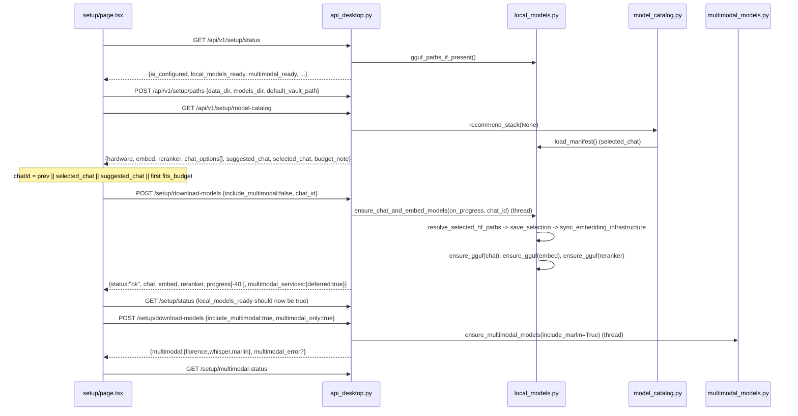
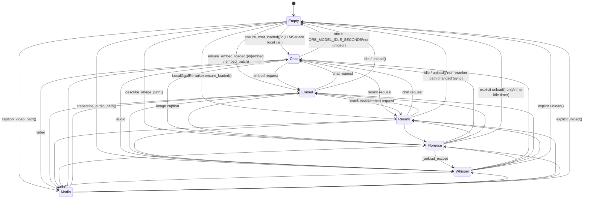

# Local Models and Inference

**What this covers.** Everything that runs a model *inside the FastAPI process*: the resource-aware GGUF catalog (`model_catalog.py`), the on-disk `MODELS_DIR` layout and `manifest.json`, Hugging Face download/staging flows for GGUFs and HF snapshots, the in-process `llama-cpp-python` runtime for chat / embeddings / cross-encoder reranking (`local_models.py`), the torch/transformers multimodal runtime for Florence-2 / Whisper / Marlin (`multimodal_runtime.py`, `multimodal_models.py`, `multimodal_services.py`), the "exactly one heavy model resident" residency manager, the Gemma 4 repetition-loop guard, embedding-dimension synchronisation with Qdrant, accelerator detection, and every `ORB_LLAMA_*` / `ORB_EMBED_*` / `ORB_RERANK_*` / `ORB_MODEL_*` environment variable. Cloud providers, prompt catalogues and the `LLMService` abstraction that *consumes* the local runtime are in [13-llm-providers-and-prompting.md](13-llm-providers-and-prompting.md).

**Related docs:** [Backend core & configuration](06-backend-core-and-configuration.md) · [API reference](07-api-reference.md) · [Ingestion pipeline](10-ingestion-pipeline.md) · [Multimedia enrichment](11-multimedia-enrichment.md) · [LLM providers & prompting](13-llm-providers-and-prompting.md) · [Qdrant & Meilisearch](15-search-indexes-qdrant-meilisearch.md) · [Retrieval & chat](16-retrieval-and-chat.md) · [Desktop shell](04-desktop-shell.md) · [Configuration reference](21-configuration-reference.md) · [Data directory layout](22-data-directory-layout.md) · [Decisions & constraints](26-decisions-and-constraints.md)

---

## 1. Responsibilities and boundaries

The local-inference layer **owns**:

- The static, hand-curated catalog of downloadable GGUF models (chat, embedding, reranker), hardware profiling (RAM + accelerator), and the "which models fit this machine" recommendation logic.
- Downloading GGUF files from Hugging Face into `MODELS_DIR/gguf/` and HF snapshot repos (Florence-2, Whisper, Marlin) into `MODELS_DIR/<local-name>/`, including NAS-safe staging on a local SSD and integrity checks.
- `MODELS_DIR/manifest.json`: the persisted model *selection* (chat/embed/reranker ids, embedding dims, resolved file paths) plus per-file download records and the last runtime descriptor.
- Loading and unloading models **in the FastAPI process** via `llama-cpp-python` (`Llama(...)`) and torch/`transformers`, with a hard rule that at most one heavy model is resident at a time (chat ↔ embed ↔ reranker ↔ Florence ↔ Whisper ↔ Marlin).
- Chat generation over the local GGUF exposed through an OpenAI-client-shaped shim (`LocalOpenAICompat`) so `LLMService` can treat "local" like any other provider.
- Embedding (`LocalLlamaEmbeddings`, `EmbeddingService`) and reranking (`LocalGgufReranker`, `RerankerService`) primitives consumed by ingestion and retrieval.
- Keeping `settings.EMBEDDING_DIMENSIONS` and **every** KB's Qdrant collections sized to the selected embed model (`sync_embedding_infrastructure`).
- Idle unloading (default 5 minutes) and accelerator cache release.
- transformers-5.x compatibility patches for Florence-2 remote code, Whisper audio decoding (ffmpeg → PyAV fallback), and Marlin/Qwen3.5 video decoding.

It does **not** own:

- Cloud provider clients, model-name resolution across providers, structured-output/JSON repair, retries, thinking-tag stripping, or any prompt text. That is `backend/app/services/llm.py` → [13-llm-providers-and-prompting.md](13-llm-providers-and-prompting.md). (The only prompt strings in this layer are the reranker system/instruction strings and the embedding query instruction — both documented below.)
- Where `MODELS_DIR` / `DATA_DIR` come from (`backend/app/core/paths.py`, `paths.json`) — see [06-backend-core-and-configuration.md](06-backend-core-and-configuration.md) and [22-data-directory-layout.md](22-data-directory-layout.md). This doc only describes the *sub-layout under* `MODELS_DIR`.
- Deciding *when* to caption/transcribe, temp-file handling, PDF page rendering — `multimedia.py` → [11-multimedia-enrichment.md](11-multimedia-enrichment.md). This doc covers the runtime it calls (`multimodal_runtime`).
- Retrieval scoring policy (which candidates to rerank, thresholds, fusion) — [16-retrieval-and-chat.md](16-retrieval-and-chat.md). This doc covers the reranker *model call* and the settings it reads.
- Qdrant collection schemas beyond `ensure_vector_size` — [15-search-indexes-qdrant-meilisearch.md](15-search-indexes-qdrant-meilisearch.md).
- Qdrant/Meilisearch *binaries* (downloaded by `desktop_runtime.py` into `DATA_DIR/bin/`) — [04-desktop-shell.md](04-desktop-shell.md).

Historically (commit `a8587e6`, 2026-06) these models ran as separate HTTP sidecars (`local_models_service`, a Marlin service, Ollama / llama-server / LM Studio for chat). Commit `3f21e08` (2026-08-02, "Ship LifeOS as a Docker-free desktop app") replaced all of that with the in-process design documented here; `EMBEDDING_PROVIDER=ollama|lm_studio` are still accepted but coerced to `local` with a deprecation warning.

## 2. Files

| Path | Purpose | Key exports |
|---|---|---|
| `backend/app/services/model_catalog.py` | Static `ModelOption` catalog, RAM/accelerator probing, budget filtering and recommendation. Deliberately avoids importing `settings`/`local_models` at module level so it can run early. | `ModelOption`, `CHAT_MODELS`, `EMBED_MODELS`, `RERANK_MODELS`, `ALL_MODELS`, `get_option`, `total_ram_gb`, `detect_accel_backend`, `hardware_profile`, `pick_embed_for_budget`, `pick_rerank_for_budget`, `chat_options_for_budget`, `recommend_chat`, `recommend_stack` |
| `backend/app/services/local_models.py` | GGUF download + manifest + in-process llama-cpp runtime (chat/embed), GGUF reranker, residency manager, backend detection, OpenAI-compat shim. | `CHAT_MODEL_ID`/`EMBED_MODEL_ID`/`RERANK_MODEL_ID`, `load_manifest`/`save_manifest`/`models_manifest_path`, `download_file`, `ensure_gguf`, `save_selection`, `sync_embedding_infrastructure`, `resolve_selected_hf_paths`, `ensure_chat_and_embed_models`, `gguf_paths_if_present`, `reranker_gguf_path`, `detect_llama_backend`, `release_accelerator_memory`, `model_idle_seconds`, `RepetitionLoopError`, `LocalOpenAICompat`, `LocalLlamaEmbeddings`, `LocalLlamaRuntime` + singleton `local_llama_runtime`, `LocalGgufReranker` + singleton `local_gguf_reranker` |
| `backend/app/services/embedding.py` | Thin provider-agnostic façade over `LocalLlamaEmbeddings`; adds the Qwen3 query instruction prefix. | `EmbeddingService`, singleton `embedding_service` |
| `backend/app/services/reranker.py` | Async façade over `local_gguf_reranker` (runs it in a thread, normalises result dicts, never raises). | `RerankerService`, singleton `reranker_service` |
| `backend/app/services/multimodal_models.py` | HF snapshot paths under `MODELS_DIR`, readiness check, `snapshot_download` with NAS staging. | `multimodal_model_path`, `is_hf_snapshot_ready`, `ensure_hf_snapshot`, `ensure_multimodal_models` |
| `backend/app/services/multimodal_runtime.py` | Lazy in-process Florence-2 / Whisper / Marlin with transformers-5 patches, audio decoding, exclusive residency hooks. | `MultimodalRuntime`, singleton `multimodal_runtime` |
| `backend/app/services/multimodal_services.py` | "Are the torch/transformers deps importable, and optionally pip-install them into the running interpreter"; compat status payloads. | `ensure_multimodal_python_deps`, `services_ready`, `ensure_multimodal_services`, `_MULTIMODAL_PIP` |
| `backend/app/core/inference_device.py` | torch device/dtype selection and the Qwen3.5 fast-path shim. Imports `torch` at module top — only import it lazily. | `resolve_torch_device`, `resolve_torch_dtype`, `prepare_qwen3_5_inference` |
| `backend/app/core/paths.py` | (shared) `resolve_models_dir`, `looks_like_network_volume`, `local_download_staging_dir` used by both download paths. | see [06](06-backend-core-and-configuration.md) |
| `backend/app/api_desktop.py` (setup section) | HTTP surface: `/api/v1/setup/status`, `/model-catalog`, `/download-models`, `/select-chat-model`, `/start-local-llm`, `/start-multimodal-services`, `/multimodal-status`, `/paths`. | route handlers |
**Moving `MODELS_DIR`.** `manifest.json` stores absolute `chat_path` / `embed_path` / `reranker_path`. When the models directory moves (external drive → local disk), those point at files that are no longer there, and the user is told a model "is not downloaded" while it sits in the new directory under the same name. `selected_gguf(path)` resolves a selection: the recorded path when it exists, else the same **basename** under the current `resolve_models_dir()/gguf` (logged when it happens), else `None`. `gguf_paths_if_present` and `reranker_gguf_path` both go through it, so a move degrades to a log line rather than a false "missing model". The manifest itself is repaired once per boot: `sync_embedding_infrastructure()` (called from `main` at startup) runs `_heal_selection_paths(sel)`, which resolves `chat_path`/`embed_path`/`reranker_path` through `selected_gguf`, compares the **stored** form (`store_model_path`) and saves any that changed — reads never rewrite the manifest. Likewise, when a manifest predates recorded selections, `gguf_paths_if_present` guesses the env-default filenames under `MODELS_DIR/gguf` once and persists that guess into `selection.chat_path`/`embed_path`, so the guess never runs again.

| `backend/app/services/ai_gate.py` | `ai_is_configured()` reports ready when `gguf_paths_if_present()` is truthy (or a cloud key / `LLM_BASE_URL` exists). | `ai_is_configured`, `require_ai` (details in [13](13-llm-providers-and-prompting.md)) |
| `backend/app/main.py` | Startup hook calls `sync_embedding_infrastructure()` after applying runtime-config overrides. | `startup_event` |
| `backend/app/workflows/ingestion.py` | Consumes the model-load clock for per-note `[Timing]` lines; passes a per-KB `llm` into the agent (see §13.2). Older revisions unloaded all models after a batch drained — that block has been removed. | — |
| `backend/requirements.txt` | `llama-cpp-python>=0.3.0`, `huggingface_hub>=0.34.0,<1.0`, `av` (video probing). | — |
| `backend/requirements-multimodal.txt` | torch / `transformers>=5.7.0` / accelerate / einops / safetensors / librosa / pydub / timm / qwen-vl-utils / av — installed on demand, mirrors `_MULTIMODAL_PIP`. | — |
| `desktop/binaries/README.md` | Operator notes on the in-process LLM and env overrides (Qdrant/Meili binaries are unrelated to this doc). | — |
| `backend/app/desktop_runtime.py` | Sets defaults for `ORB_LLAMA_*`, `ORB_EMBED_N_CTX`, `ORB_RERANK_N_CTX`, `LLM_PROVIDER`, `EMBEDDING_PROVIDER` (`os.environ.setdefault`) and `ORB_MODELS_DIR` before running uvicorn. | — |
| `frontend/src/app/setup/page.tsx` | Setup page: consumes `/setup/status`, `/setup/model-catalog`, `/setup/download-models`, `/setup/multimodal-status`, `/setup/paths`. | — |

## 3. Architecture and flow

### 3.1 Big picture

```mermaid
flowchart LR
  subgraph UI[Frontend Setup page]
    S1[GET /setup/status]
    S2[GET /setup/model-catalog]
    S3[POST /setup/download-models]
    S4[POST /setup/download-models multimodal_only]
  end
  subgraph API[FastAPI process]
    CAT[model_catalog.recommend_stack]
    ENS[local_models.ensure_chat_and_embed_models]
    SEL[save_selection -> manifest.json]
    SYNC[sync_embedding_infrastructure]
    MM[multimodal_models.ensure_multimodal_models]
    RT[(LocalLlamaRuntime\nchat | embed)]
    RR[(LocalGgufReranker)]
    MR[(MultimodalRuntime\nflorence | whisper | marlin)]
    LLM[LLMService provider=local]
    EMB[EmbeddingService]
    RRS[RerankerService]
    MED[MultimediaService]
  end
  HF[(huggingface.co)]
  Q[(Qdrant collections\nper KB)]
  DISK[(MODELS_DIR)]

  S2 --> CAT
  S3 --> ENS --> SEL --> SYNC --> Q
  ENS -->|ensure_gguf| HF --> DISK
  S4 --> MM --> HF
  LLM -->|LocalOpenAICompat| RT
  EMB -->|LocalLlamaEmbeddings| RT
  RRS --> RR
  MED --> MR
  RT <-. exclusive .-> RR
  RT <-. exclusive .-> MR
  RR <-. exclusive .-> MR
  RT --> DISK
  RR --> DISK
  MR --> DISK
```

### 3.2 Setup sequence (as the frontend actually drives it)



Key point: the frontend **never** calls `/setup/start-local-llm` or `/setup/start-multimodal-services` during Setup (the source comment: "Florence/Whisper/Marlin must not block Setup / Chat"). Models are only loaded into memory on first use (chat, ingest, retrieval). Those two endpoints still exist and work (see §11) and are useful for scripts/tests.

### 3.3 Who loads what, at runtime

| Consumer | Calls | Which runtime method | Model made resident |
|---|---|---|---|
| `LLMService` (provider `local`) via `LocalOpenAICompat.chat.completions.create` | `LocalLlamaRuntime.create_chat_completion` | `ensure_chat_loaded()` | chat GGUF |
| `EmbeddingService.embed_query / embed_documents` | `LocalLlamaRuntime.embed / embed_batch` | `ensure_embed_loaded()` | embed GGUF |
| `RerankerService.rerank` (retrieval) | `LocalGgufReranker.rerank` (in `asyncio.to_thread`) | `ensure_loaded()` | reranker GGUF |
| `MultimediaService._describe_image_local` | `multimodal_runtime.describe_image_path` | `_load_florence()` | Florence-2 |
| `MultimediaService.transcribe_audio` | `multimodal_runtime.transcribe_audio_path` | `_load_whisper()` | Whisper |
| `MultimediaService._caption_video_with_marlin` | `multimodal_runtime.caption_video_path` | `_load_marlin()` | Marlin |
| `POST /setup/start-local-llm` | `local_llama_runtime.load(chat, embed)` then `local_gguf_reranker.ensure_loaded()` | explicit | ends with **reranker** resident (see gotcha §10) |

Every one of these `ensure_*`/`_load_*` methods first evicts all *other* families — that is the exclusive-residency rule, detailed in §7.

## 4. Model catalog (`model_catalog.py`)

### 4.1 `ModelOption`

```python
@dataclass(frozen=True)
class ModelOption:
    id: str                 # stable catalog id, persisted in manifest.json
    role: Literal["chat", "embed", "reranker"]
    family: Literal["gemma4", "qwen35", "qwen36", "qwen3-embed", "qwen3-rerank"]
    label: str              # UI label
    hf_repo: str            # "org/repo"
    hf_file: str            # single GGUF filename inside the repo
    min_ram_gb: float       # approximate peak working set (weights + ctx)
    size_gb: float          # on-disk size estimate; also drives integrity check
    params: str             # display-only ("E4B", "35B-A3B", ...)
    embedding_dims: int | None = None   # embed role only
    recommended: bool = False
    @property hf_path -> f"{hf_repo}/{hf_file}"   # the "model_id" string used by ensure_gguf
```

`asdict(option)` is what the API returns (plus `fits_budget` for chat rows); `hf_path` is a property and therefore **not** included in the serialised dict.

### 4.2 Full catalog (all quantisations Q4_K_M unless noted)

Chat (`CHAT_MODELS`, order preserved = UI order):

| id | family | label | hf_repo | hf_file | min_ram_gb | size_gb | params | recommended |
|---|---|---|---|---|---|---|---|---|
| `gemma4-e2b-q4` | gemma4 | Gemma 4 E2B (Q4) | `bartowski/google_gemma-4-E2B-it-GGUF` | `google_gemma-4-E2B-it-Q4_K_M.gguf` | 5 | 2.8 | E2B | |
| `gemma4-e4b-q4` | gemma4 | Gemma 4 E4B (Q4) | `bartowski/google_gemma-4-E4B-it-GGUF` | `google_gemma-4-E4B-it-Q4_K_M.gguf` | 9 | 5.4 | E4B | **yes** |
| `gemma4-12b-q4` | gemma4 | Gemma 4 12B (Q4) | `bartowski/gemma-4-12B-it-GGUF` (note: no `google_` prefix) | `gemma-4-12B-it-Q4_K_M.gguf` | 11 | 7.7 | 12B | |
| `gemma4-31b-q4` | gemma4 | Gemma 4 31B (Q4) | `bartowski/google_gemma-4-31B-it-GGUF` | `google_gemma-4-31B-it-Q4_K_M.gguf` | 28 | 18.0 | 31B | |
| `qwen35-0.8b-q4` | qwen35 | Qwen 3.5 0.8B (Q4) | `bartowski/Qwen_Qwen3.5-0.8B-GGUF` | `Qwen_Qwen3.5-0.8B-Q4_K_M.gguf` | 2.5 | 0.6 | 0.8B | |
| `qwen35-2b-q4` | qwen35 | Qwen 3.5 2B (Q4) | `bartowski/Qwen_Qwen3.5-2B-GGUF` | `Qwen_Qwen3.5-2B-Q4_K_M.gguf` | 3.5 | 1.4 | 2B | |
| `qwen35-4b-q4` | qwen35 | Qwen 3.5 4B (Q4) | `bartowski/Qwen_Qwen3.5-4B-GGUF` | `Qwen_Qwen3.5-4B-Q4_K_M.gguf` | 5 | 2.5 | 4B | |
| `qwen35-9b-q4` | qwen35 | Qwen 3.5 9B (Q4) | `bartowski/Qwen_Qwen3.5-9B-GGUF` | `Qwen_Qwen3.5-9B-Q4_K_M.gguf` | 10 | 5.5 | 9B | |
| `qwen35-27b-q4` | qwen35 | Qwen 3.5 27B (Q4) | `bartowski/Qwen_Qwen3.5-27B-GGUF` | `Qwen_Qwen3.5-27B-Q4_K_M.gguf` | 28 | 18.0 | 27B | |
| `qwen36-27b-q4` | qwen36 | Qwen 3.6 27B (Q4) | `bartowski/Qwen_Qwen3.6-27B-GGUF` | `Qwen_Qwen3.6-27B-Q4_K_M.gguf` | 28 | 18.0 | 27B | |
| `qwen36-35b-a3b-q4` | qwen36 | Qwen 3.6 35B-A3B MoE (Q4) | `bartowski/Qwen_Qwen3.6-35B-A3B-GGUF` | `Qwen_Qwen3.6-35B-A3B-Q4_K_M.gguf` | 32 | 22.3 | 35B-A3B | |

Embedding (`EMBED_MODELS`):

| id | label | hf_repo | hf_file | min_ram_gb | size_gb | dims | recommended |
|---|---|---|---|---|---|---|---|
| `qwen3-embed-0.6b-q8` | Qwen3 Embedding 0.6B (Q8) | `Qwen/Qwen3-Embedding-0.6B-GGUF` | `Qwen3-Embedding-0.6B-Q8_0.gguf` | 2 | 0.6 | **1024** | yes |
| `qwen3-embed-4b-q4` | Qwen3 Embedding 4B (Q4) | `Qwen/Qwen3-Embedding-4B-GGUF` | `Qwen3-Embedding-4B-Q4_K_M.gguf` | 5 | 2.5 | **2560** | |
| `qwen3-embed-8b-q4` | Qwen3 Embedding 8B (Q4) | `Qwen/Qwen3-Embedding-8B-GGUF` | `Qwen3-Embedding-8B-Q4_K_M.gguf` | 8 | 4.8 | **4096** | |

Reranker (`RERANK_MODELS`) — note the different quantiser (`mradermacher`) and the `.Q4_K_M` (dot, not dash) filename convention:

| id | label | hf_repo | hf_file | min_ram_gb | size_gb | recommended |
|---|---|---|---|---|---|---|
| `qwen3-rerank-0.6b-q4` | Qwen3 Reranker 0.6B (Q4) | `mradermacher/Qwen3-Reranker-0.6B-GGUF` | `Qwen3-Reranker-0.6B.Q4_K_M.gguf` | 2 | 0.4 | yes |
| `qwen3-rerank-4b-q4` | Qwen3 Reranker 4B (Q4) | `mradermacher/Qwen3-Reranker-4B-GGUF` | `Qwen3-Reranker-4B.Q4_K_M.gguf` | 6 | 2.5 | |
| `qwen3-rerank-8b-q4` | Qwen3 Reranker 8B (Q4) | `mradermacher/Qwen3-Reranker-8B-GGUF` | `Qwen3-Reranker-8B.Q4_K_M.gguf` | 10 | 5.0 | |

`ALL_MODELS: dict[id, ModelOption]` merges all three lists; `get_option(id)` is a plain dict lookup returning `None` for unknown ids.

The env-default `CHAT_MODEL_ID` / `EMBED_MODEL_ID` / `RERANK_MODEL_ID` constants in `local_models.py` (`ORB_CHAT_GGUF`, `ORB_EMBED_GGUF`, `ORB_RERANK_GGUF`) correspond to `gemma4-e4b-q4`, `qwen3-embed-0.6b-q8`, `qwen3-rerank-0.6b-q4` and are used only as a **fallback when the catalog lookup fails** (see `resolve_selected_hf_paths`, `gguf_paths_if_present`, `reranker_gguf_path`).

### 4.3 Hardware profiling

| Function | Behaviour |
|---|---|
| `total_ram_gb()` | `ORB_RAM_GB` env override (float) wins. Else macOS `sysctl -n hw.memsize`; Windows `wmic ComputerSystem get TotalPhysicalMemory` (last integer in output); Linux `/proc/meminfo MemTotal`. Any failure → **8.0 GB** conservative fallback. |
| `detect_accel_backend()` | Lightweight duplicate of `local_models.detect_llama_backend` that avoids importing `settings`. Honors `ORB_LLAMA_BACKEND` (`cpu|metal|cuda|vulkan`, else auto) and `ORB_LLAMA_N_GPU_LAYERS`. Auto: darwin → `metal` (-1 layers); `nvidia-smi` on PATH → `cuda` (-1); else `cpu` (0). Returns `{backend, n_gpu_layers, reason}`. **Difference from `detect_llama_backend`:** no `install_hint`. |
| `hardware_profile()` | `usable_model_gb = max(4.0, ram*0.88)` on metal/cuda, else `max(3.0, ram*0.75)`. Returns `{ram_gb, usable_model_gb, platform, machine, accel}`. |

### 4.4 Selection logic

```
_fits(opt, budget)           := min(opt.min_ram_gb, opt.size_gb * 1.35) <= budget
pick_embed_for_budget(total) := 8B if total>=48 ; 4B if total>=24 ; else 0.6B      # TOTAL ram, not usable
pick_rerank_for_budget(total):= 8B if total>=48 ; 4B if total>=24 ; else 0.6B
chat_options_for_budget(usable, embed, rerank):
    reserve = min(2.5, embed.size_gb*0.5 + rerank.size_gb*0.5)
    budget  = max(usable - reserve, usable * 0.7)
    fits    = [m for m in CHAT_MODELS if _fits(m, budget)] or [smallest-by-min_ram]
recommend_chat(fits): first of gemma4-e4b-q4, gemma4-12b-q4, gemma4-e2b-q4, qwen35-4b-q4,
                      qwen35-9b-q4, qwen36-27b-q4 that is in fits; else max(fits, key=min_ram_gb)
```

Embed and reranker tiers are **not user-selectable**; they are derived from total RAM only. Worked examples: a 16 GB Apple Silicon Mac → usable 14.1, embed 0.6B, rerank 0.6B, reserve 0.5, budget 13.6 → all chats up to `gemma4-12b-q4` (min(11, 10.4)=10.4) fit, `qwen35-9b-q4` fits, 27B/31B do not; suggested `gemma4-e4b-q4`. A 32 GB Mac → embed 4B (2560 dims), rerank 4B, budget ≈ 25.7 → 27B/31B do **not** fit (`min(28, 24.3)=24.3 <= 25.7` → actually fits; `qwen36-35b-a3b-q4` min(32,30.1)=30.1 does not). A 64 GB machine → embed 8B (4096 dims), rerank 8B.

### 4.5 `recommend_stack(chat_id=None)` — response contract of `GET /api/v1/setup/model-catalog`

```json
{
  "hardware": {"ram_gb": 32.0, "usable_model_gb": 28.2, "platform": "darwin", "machine": "arm64",
               "accel": {"backend": "metal", "n_gpu_layers": -1, "reason": "macOS arm64: prefer Metal"}},
  "embed":    {ModelOption fields...},          // auto-picked, never null
  "reranker": {ModelOption fields...},          // auto-picked, never null
  "chat_options": [ {ModelOption fields..., "fits_budget": true|false}, ... ],   // ALWAYS the full CHAT_MODELS list
  "suggested_chat": {ModelOption} | null,       // get_option(chat_id) if valid, else recommend_chat(fits)
  "selected_chat":  {ModelOption} | null,       // manifest.json selection.chat_id if valid
  "budget_note": "Usable ~28 GB of 32 GB RAM (backend=metal). Qwen3 embed + reranker are sized automatically ..."
}
```

`recommend_stack` is the *only* place in `model_catalog.py` that touches `local_models` (lazy import of `load_manifest`, wrapped in try/except). The UI initialises its selection as `prev || selected_chat || suggested_chat || first fits_budget || first option` and renders `fits_budget === false` rows as "may be tight" but still selectable.

## 5. `MODELS_DIR` layout and `manifest.json`

`MODELS_DIR` is resolved by `app.core.paths.resolve_models_dir()`: `ORB_MODELS_DIR` / `MODELS_DIR` env → `paths.json["models_dir"]` → `backend/models` (dev fallback). `desktop_runtime.py` always sets `ORB_MODELS_DIR`.

```
MODELS_DIR/
├── manifest.json                       # selection + download records + runtime descriptor (below)
├── gguf/                               # every GGUF, flat, named by hf_file
│   ├── google_gemma-4-E4B-it-Q4_K_M.gguf
│   ├── Qwen3-Embedding-0.6B-Q8_0.gguf
│   ├── Qwen3-Reranker-0.6B.Q4_K_M.gguf
│   └── <name>.gguf.partial             # transient: in-flight download (only when not staging)
├── florence-2-large/                   # settings.MODEL_FLORENCE_LOCAL — HF snapshot of microsoft/Florence-2-large
├── whisper-large-v3-turbo/             # settings.MODEL_WHISPER_LOCAL — openai/whisper-large-v3-turbo
└── marlin-2b/                          # settings.MODEL_MARLIN_LOCAL — lunahr/Marlin-2B-ungated
```

Staging directory (only used when `MODELS_DIR` `looks_like_network_volume()` or `ORB_FORCE_DOWNLOAD_STAGING` is set): `local_download_staging_dir()` → `ORB_HF_STAGING` / `ORB_DOWNLOAD_STAGING` → macOS `~/Library/Caches/Orb/model-downloads`, Windows `%LOCALAPPDATA%\Orb\model-downloads`, Linux `~/.cache/orb/model-downloads`. GGUFs stage as `<staging>/<file>.partial` → `<staging>/<file>` → `MODELS_DIR/gguf/<file>`; HF snapshots stage in a `tempfile.mkdtemp(prefix="<label>-")` under the staging root and are copied file-by-file.

### 5.1 `manifest.json` schema

There is no Pydantic model; the file is a free-form dict read via `load_manifest()` (returns `{}` on missing/corrupt) and written whole via `save_manifest()` (`json.dumps(indent=2)`, non-atomic `write_text`). Three top-level keys are used:

```jsonc
{
  "selection": {                       // written by save_selection / ensure_chat_and_embed_models / LocalLlamaRuntime.load
    "chat_id": "gemma4-e4b-q4",        // catalog ids ("" if catalog lookup failed)
    "embed_id": "qwen3-embed-0.6b-q8",
    "reranker_id": "qwen3-rerank-0.6b-q4",
    "embedding_dims": 1024,            // int; corrected by the dimension probe in LocalLlamaRuntime.load
    "chat_path": "/…/gguf/google_gemma-4-E4B-it-Q4_K_M.gguf",     // absolute; only after a download
    "embed_path": "/…/gguf/Qwen3-Embedding-0.6B-Q8_0.gguf",
    "reranker_path": "/…/gguf/Qwen3-Reranker-0.6B.Q4_K_M.gguf"
  },
  "gguf": {                            // one record per successfully downloaded file (ensure_gguf)
    "google_gemma-4-E4B-it-Q4_K_M.gguf": {
      "source": "bartowski/google_gemma-4-E4B-it-GGUF/google_gemma-4-E4B-it-Q4_K_M.gguf",
      "path": "/…/gguf/google_gemma-4-E4B-it-Q4_K_M.gguf",
      "bytes": 5400000000
    }
  },
  "runtime": {                         // last successful LocalLlamaRuntime.load() — informational only, never read back
    "engine": "llama-cpp-python",
    "backend": "metal",
    "chat": "/…/gguf/…",
    "embed": "/…/gguf/…",
    "exclusive": true
  }
}
```

How the fields are consumed:

| Reader | Uses |
|---|---|
| `gguf_paths_if_present()` | `selection.chat_path`, `selection.embed_path` (both must exist; chat > 1 MB), optional `selection.reranker_path`. Falls back to `MODELS_DIR/gguf/<env default filenames>` and, when those exist, writes them into the manifest selection so the fallback is one-time. This is the single source of truth for "local AI is ready" (`ai_gate`, `/setup/status.local_models_ready`, `ensure_chat_loaded`, `ensure_embed_loaded`). |
| `reranker_gguf_path()` | `selection.reranker_path` else `MODELS_DIR/gguf/<RERANK_MODEL_ID filename>` else `None`. |
| `sync_embedding_infrastructure()` | `selection.embedding_dims`, else dims of `get_option(selection.embed_id)`, else `settings.EMBEDDING_DIMENSIONS`; `selection.embed_id`, `selection.reranker_id`. |
| `recommend_stack()` | `selection.chat_id` → `selected_chat`. |
| `save_selection()` | preserves existing `*_path` keys when rewriting `selection`. |

**Persistence of selection**: `POST /setup/select-chat-model` and `POST /setup/download-models` both go through `save_selection()`, which (a) rewrites `manifest.selection` with ids + dims, (b) immediately calls `sync_embedding_infrastructure(dims, embed_id)` (Qdrant resize), and (c) logs a warning telling the user to re-ingest if `embed_id` or dims changed. `ensure_chat_and_embed_models` then adds the resolved `*_path` keys after the downloads. There is no `chat_path` until a download has been performed, so "selected but not downloaded" is representable (`/setup/status.local_models_ready` is false while `manifest.selection` names a chat model).

## 6. Download flow

### 6.1 GGUF files (`local_models.py`)

`_hf_file_url("org/repo/file.gguf")` → `https://huggingface.co/org/repo/resolve/main/file.gguf` (paths with more than three segments keep the remainder as a sub-path; fewer raise `ValueError`). Downloads use plain `urllib.request.urlopen` with `User-Agent: Orb/1.0` and a 120 s socket timeout — **no `huggingface_hub`, no HF token, no byte-range resume** for GGUFs.

`download_file(url, dest, on_progress)`:

1. Decide staging: `looks_like_network_volume(dest)` or `ORB_FORCE_DOWNLOAD_STAGING` set → write to `<staging>/<name>.partial`; else `<dest>.partial` next to the destination.
2. If a `.partial` already exists it is **deleted and the download restarts from zero** (docstring: "no true resume over plain urlopen").
3. Stream in 256 KiB chunks; when the server sends `Content-Length`, call `on_progress(int(received*100/total))` after every chunk (0–100, integers; no callback at all if Content-Length is missing).
4. If `Content-Length` was sent and `received != total` → delete partial, raise `RuntimeError("Download incomplete for … Will retry on next attempt.")`.
5. `_atomic_place(partial, staging)` then (if staging) `_atomic_place(staging, dest)`. `_atomic_place` tries `Path.replace`; on `OSError` (cross-device / SMB) it `copy2`s to `<dest>.tmp`, `replace`s, and unlinks the source — so the final file appears atomically on the destination volume.

`ensure_gguf(model_id, on_progress) -> Path` (dest = `MODELS_DIR/gguf/<last path segment>`):

- Returns immediately if `_gguf_looks_complete(dest, model_id)`: file exists and `size >= _min_expected_gguf_bytes`. Size is the only completeness signal — `dest` is only ever written by an atomic move, so a stale `.partial` sibling says nothing about it and is not checked.
- `_min_expected_gguf_bytes`: looks the file up in `ALL_MODELS` by `hf_file` or `hf_path` and returns `max(50 MB, size_gb * 1e9 * 0.92)` (8 % tolerance "HF mirrors vary slightly"); unknown files → 50 MB. **Consequence:** if you lower a catalog `size_gb` below the true file size nothing breaks, but if you raise it above the real size the file will be considered incomplete forever and re-downloaded on every call.
- Otherwise deletes the undersized dest, downloads (`download_file` deletes any stale `.partial` and restarts from zero), re-validates (raises `RuntimeError("Downloaded … looks incomplete")` if still short), and records `manifest["gguf"][filename] = {source, path, bytes}`.

`ensure_chat_and_embed_models(on_progress=None, chat_id=None) -> {"chat","embed","reranker": Path}` is the setup entry point (called in `asyncio.to_thread` by `/setup/download-models` and `/setup/start-local-llm`):

1. `resolve_selected_hf_paths(chat_id)` — runs `recommend_stack(chat_id)`, resolves chat option (explicit `chat_id` → `get_option`, else `suggested_chat`), embed/rerank from the stack, and falls back to the `*_MODEL_ID` env defaults if the catalog lookup fails. Returns `{chat, embed, reranker (hf_path strings), chat_id, embed_id, reranker_id, embedding_dims}`. Note `embedding_dims` defaults to **1024** when the option has no dims.
2. `save_selection(...)` → manifest + `sync_embedding_infrastructure` (Qdrant resize happens *before* any download).
3. `ensure_gguf` for chat, embed, reranker **sequentially** with a label-wrapping progress callback `on_progress(label, pct)` where label ∈ `"chat" | "embed" | "reranker"`.
4. Best-effort: sets `settings.EMBEDDING_DIMENSIONS`, `settings.EMBEDDING_MODEL` (catalog id, default `"qwen3-embed"`), `settings.MODEL_RERANKER_LOCAL` (default `"qwen3-reranker"`), `settings.LLM_MODEL` (chat catalog id) and calls `sync_embedding_infrastructure` a second time.
5. Rewrites `manifest.selection` merging ids, dims and the three absolute `*_path` values.

**Progress/state reporting.** There is no background job and no status-polling endpoint for GGUF downloads. `POST /setup/download-models` is a *single long HTTP request* (minutes for a 5–18 GB file); `on_progress` events are appended to an in-memory list and only the **last 40** are returned in the response body as `"progress": [{"model": "chat", "percent": 37}, …]`. The UI shows a static "Downloading…" message and relies on the request completing; on failure it re-checks `/setup/status` because a previous run may already have left complete files. Log lines (`Downloading model … from Hugging Face…`, `Staging download on local disk → …`) are the only live progress signal.

### 6.2 HF snapshots — Florence-2 / Whisper / Marlin (`multimodal_models.py`)

| Kind | `settings.MODEL_*_HF` (repo) | `settings.MODEL_*_LOCAL` (dir under `MODELS_DIR`) |
|---|---|---|
| florence | `microsoft/Florence-2-large` | `florence-2-large` |
| whisper | `openai/whisper-large-v3-turbo` | `whisper-large-v3-turbo` |
| marlin | `lunahr/Marlin-2B-ungated` | `marlin-2b` |

`is_hf_snapshot_ready(dest)`: directory exists AND (`config.json` or `model_index.json` or `preprocessor_config.json`) AND weights present (`rglob` of `*.safetensors|*.bin|*.pt|*.pth|*.gguf|*.onnx`, or total file size > 50 MB). Because of the final `and has_weights`, a config-less directory with weights passes, a weights-less directory never does.

`ensure_hf_snapshot(repo_id, dest, *, on_progress, label)`:

- Short-circuits (with `on_progress(label, 100)`) when ready.
- Requires `huggingface_hub.snapshot_download` (raises `RuntimeError` with install hint if missing). Emits `on_progress(label, 1)` at start and `(label, 100)` at end — **no intermediate percentages** (snapshot_download's own tqdm goes to stderr/logs).
- `snapshot_download(repo_id=..., local_dir=<dest or staging tmpdir>)`; **this path does honour byte-range resume and `HF_TOKEN`/`HF_HUB_*` env because it is the official client** (unlike GGUFs).
- Network-volume staging: downloads into `mkdtemp(prefix=f"{label}-", dir=staging_root)`, then wipes `dest` (removing a `.cache` dir and all children) and `copytree`/`copy2`s each child over; staging dir is removed in `finally`.
- Re-validates with `is_hf_snapshot_ready` → `RuntimeError("Download finished but model looks incomplete")`.

`ensure_multimodal_models(include_marlin=True, on_progress=None)`: florence then whisper (errors propagate), then marlin with special handling — if the exception text contains `gated`, `401` or `restricted`, it logs a warning (mentioning `MODEL_MARLIN_HF` and `HF_TOKEN`), reports `on_progress("marlin (skipped — auth)", 100)` and continues; other errors propagate. Returns `{kind: Path}` (marlin key absent when skipped).

### 6.3 Endpoints (setup section of `api_desktop.py`)

| Method & path | Body / query | Calls | Response (key fields) | Notes |
|---|---|---|---|---|
| `GET /api/v1/setup/status` | — | `gguf_paths_if_present`, `is_hf_snapshot_ready×3`, `ai_is_configured`, `kb_registry.get_kb_by_name("default")` | `data_dir, models_dir, paths_json, default_vault_path, active_vault_path, ai_configured, local_models_ready, multimodal_ready (all 3), database_backend, llm_provider` | cheap; polled by the UI after saves |
| `GET /api/v1/setup/model-catalog` | `?chat_id=` | `recommend_stack(chat_id)` | see §4.5 | |
| `POST /api/v1/setup/download-models` | `{include_multimodal: bool=true, chat_id?: str, multimodal_only: bool=false}` | `ensure_chat_and_embed_models` (unless `multimodal_only`), then `ensure_multimodal_models(include_marlin=True)` when `include_multimodal or multimodal_only` | `status:"ok", chat, embed, reranker (str paths, "" if multimodal_only and none present), multimodal:{florence,whisper,marlin: path}, multimodal_services:{started:false, deferred:true, mode:"in_process", hint}, multimodal_error, progress[-40:], warning` | GGUF failure → **500** `"GGUF download failed: …"`; multimodal failure is swallowed into `multimodal_error`/`warning` with 200. Does not pip-install torch. |
| `POST /api/v1/setup/select-chat-model` | `{chat_id: str}` (same model as above) | `resolve_selected_hf_paths`, `save_selection` | `status:"ok", selection:{chat_id, embed_id, reranker_id, embedding_dims}, infrastructure:{embedding_dims, embed_id, synced_kbs[], errors[]}` | 400 if `chat_id` missing. Resizes Qdrant immediately. Not used by the current UI. |
| `POST /api/v1/setup/start-local-llm` | `{chat_id?}` | `ensure_chat_and_embed_models(None, chat_id)`, `local_llama_runtime.load(chat, embed)`, `local_gguf_reranker.ensure_loaded()`, `llm_service.provider="local"; llm_service.init_clients()`, `embedding_service.reconfigure()` | on success the dict from `LocalLlamaRuntime.load` + `reranker`, `reranker_loaded`, `reranker_error?`; on `RuntimeError` → 200 `{started:false, loaded:false, reason, accel}` | Downloads if missing (so can take minutes). Non-`RuntimeError` exceptions become 500. Not used by the current UI. |
| `POST /api/v1/setup/start-multimodal-services` | `?install_deps=true` | `ensure_multimodal_services(install_deps)` in a thread | see §12.5 | May run `pip install` inside the API interpreter. Exceptions → 200 `{started:false, error}`. |
| `GET /api/v1/setup/multimodal-status` | — | `is_hf_snapshot_ready×3`, `services_ready()` | `mode:"in_process", models:{florence,whisper,marlin: bool}, services:{mode, local_models, marlin, deps_ok, deps_error, runtime:{device, models_ready, loaded}}` | `services_ready` imports `multimodal_runtime` which resolves the torch device lazily — it does **not** load models. |
| `POST /api/v1/setup/paths` | `{data_dir, models_dir, default_vault_path?}` | `save_paths_file`, `sync_settings_paths`, `reconfigure_logging`, `ensure_vault`, `kb_registry.set_vault_path` | `status, data_dir, models_dir, default_vault_path, ai_setup_mode` | Changing `models_dir` takes effect immediately for all `resolve_models_dir()` callers (cache cleared) — but already-resident models are not unloaded. |

Frontend wrappers (`frontend/src/lib/api.ts`): `getSetupStatus()`, `getModelCatalog(chatId?)`, `saveSetupPaths(data)`, `downloadModels(includeMultimodal, chatId?, {multimodalOnly})` (sent without a timeout), `selectChatModel(chatId)`, `getMultimodalStatus()`. Full route docs live in [07-api-reference.md](07-api-reference.md).

## 7. GGUF runtime (`llama-cpp-python`)

### 7.1 Backend / accelerator detection

`detect_llama_backend()` (in `local_models.py`; re-run on **every** `_chat_kwargs()` call and on every reranker load, so env changes apply to the next load):

| Input | Result `{backend, n_gpu_layers, reason, install_hint}` |
|---|---|
| `ORB_LLAMA_BACKEND` ∈ `cpu|metal|cuda|vulkan` | forced; `n_gpu_layers = 0` for cpu else `-1` |
| `sys.platform == "darwin"` | `metal`, `-1` ("macOS <machine>: prefer Metal") — no check that the wheel was actually built with Metal |
| linux/win32 and `nvidia-smi` on PATH | `cuda`, `-1` |
| otherwise | `cpu`, `0` |

`ORB_LLAMA_N_GPU_LAYERS` (int) overrides `n_gpu_layers` in all branches. `vulkan` is never auto-selected. `install_hint` is the `CMAKE_ARGS="-DGGML_METAL=on" pip install llama-cpp-python --force-reinstall --no-cache-dir` style string surfaced in errors when `llama_cpp` cannot be imported (`_import_llama` raises `RuntimeError("llama-cpp-python is not installed. …")`).

The torch device for the multimodal stack is chosen separately by `app.core.inference_device.resolve_torch_device()` (`mps` → `cuda` → `cpu`) and is **not** affected by `ORB_LLAMA_BACKEND`.

### 7.2 `Llama(...)` constructor parameters

All constructions go through `_construct_llama(Llama, **kwargs)` → `_llama_metal_safe_kwargs`:

- `swa_full = True` unless `ORB_LLAMA_SWA_FULL` ∈ `{0,false,no}`. Rationale (source comment): "Full-size SWA is required for stable Gemma 4 output — compact SWA fits 32k but causes ordinal/'or the' repetition collapse. 16k + swa_full fits ~24GB Metal; 32k + swa_full OOMs."
- `flash_attn = True` only when `ORB_LLAMA_FLASH_ATTN` ∈ `{1,true,yes}`; otherwise the key is omitted (llama.cpp default).
- If `Llama(**kwargs)` raises `TypeError` (older llama-cpp-python without those kwargs), retry once without `swa_full`/`flash_attn` and log a warning; any other exception propagates.

| Model | `model_path` | `embedding` | `n_ctx` | `n_gpu_layers` | `n_threads` | other |
|---|---|---|---|---|---|---|
| chat | selected chat GGUF | `False` | `max(ORB_LLAMA_N_CTX (16384), ORB_LLAMA_MAX_TOKENS (10240) + ORB_LLAMA_PROMPT_RESERVE (4096))` | from backend detection | `ORB_LLAMA_N_THREADS` if set | `verbose=False`, `swa_full`, `flash_attn?` |
| embed | selected embed GGUF | `True` | `ORB_EMBED_N_CTX` (8192) | same | same | same as chat minus `n_ctx` |
| reranker | selected reranker GGUF | (default False) | `ORB_RERANK_N_CTX` (8192) | `accel["n_gpu_layers"]` | — | `logits_all=True`, `verbose=False`, `swa_full`, `flash_attn?` |

`n_batch` is **not** set anywhere (llama-cpp-python default, 512). The chat `n_ctx` floor rule means the defaults give `max(16384, 14336) = 16384`; if you raise `ORB_LLAMA_MAX_TOKENS` to 16384 the context is silently raised to 20480 (logged at INFO). The embed model inherits `n_gpu_layers`/`n_threads` from `_chat_kwargs()`.

### 7.3 `LocalLlamaRuntime` state

```python
class LocalLlamaRuntime:
    _chat: Llama | None          # resident chat model
    _embed: Llama | None         # resident embed model (never both non-None in practice)
    _lock: threading.RLock       # guards all load/unload/generate/embed
    _chat_path, _embed_path: Path | None
    _embed_path_hint: Path | None   # remembered embed GGUF for later exclusive loads / status
    accel: dict                  # last detect_llama_backend()
    _last_used: float            # time.monotonic() of last touch
    _idle_watcher_started: bool
local_llama_runtime = LocalLlamaRuntime()   # module singleton
```

Public API summary:

| Method | Lock | Effect |
|---|---|---|
| `loaded` (property) | — | `_chat is not None` (chat only — used by setup) |
| `any_gguf_loaded` | — | chat or embed resident |
| `status()` | — | `{loaded, chat_loaded, embed_loaded, chat_model, embed_model, accel, idle_seconds, idle_unload_after, exclusive: True}`; currently has no HTTP caller |
| `load(chat_gguf, embed_gguf=None)` | yes | setup path: evict peers, load chat, **temporarily swap to embed to probe the dimension**, sync Qdrant + manifest dims, swap back to chat, write `manifest.runtime`. Returns a dict (`loaded, started, engine, backend, n_gpu_layers, reason, install_hint, chat_model, embed_model, n_ctx, idle_unload_after, exclusive`). |
| `ensure_chat_loaded(chat_gguf=None)` | yes | no-op + touch if chat resident **and** (`chat_gguf is None` or equals the resident path); otherwise a different path logs `Switching chat GGUF a → b` and swaps. Requires `gguf_paths_if_present()` (raises `RuntimeError("Local GGUF models are not downloaded. Open Setup → Download selected models.")`), evicts reranker + multimodal + embed, loads chat (with the vision projector, see below) |
| `ensure_embed_loaded()` | yes | symmetrical for embed (`"Local embed GGUF is not downloaded…"`) |
| `unload()` | yes | close both handles, `release_accelerator_memory()` |
| `unload_if_idle(limit=None)` | yes | unload when `now - _last_used >= limit` (limit ≤ 0 disables) |
| `create_chat_completion(messages, temperature=0.2, max_tokens=None, model=None)` | inside | see §8 |
| `embed(text)`, `embed_batch(texts)` | yes | see §9 |
| `make_chat_client()` | — | a `LocalOpenAICompat` (the `chat_client` slot of `LLMService._build_clients`) |

**Vision projector.** `find_mmproj(chat_gguf)` is strict: only `mmproj-<model stem>-*.gguf` beside the chat GGUF counts (a projector is architecture-specific; an unrelated one in the folder is never used). Once per boot, `sync_embedding_infrastructure()` → `_ensure_mmproj_in_background(sel)`: when the manifest's `chat_id` is a catalog id and no matching projector is on disk, `ensure_mmproj(<hf_path>)` runs in a daemon thread (`orb-mmproj`, start / finish / failure logged, never blocks startup). `_load_chat_unlocked` constructs `MTMDChatHandler` and, because llama-cpp-python otherwise binds the projector lazily on the first completion (so a wrong one used to fail *every* completion), calls `handler._init_mtmd_context(llama)` eagerly; on any exception it logs a warning and drops the handler (`chat_handler = None`, `_mmproj_path = None`) so text chat keeps working and `describe_image` raises its "no vision projector" error.

Idle watcher: the first `_touch()` (or a reranker load) starts a single daemon thread `orb-model-idle` that every 30 s calls `unload_if_idle(limit)` on both the runtime and `local_gguf_reranker`, where `limit = model_idle_seconds()` (`ORB_MODEL_IDLE_SECONDS`, default 300; `0` disables idle unload but the thread keeps looping). The multimodal runtime has **no** idle unloader — Florence/Whisper/Marlin stay resident until evicted by a GGUF load (or an explicit `unload`). The old "unload everything once the ingest batch drains" block in `workflows/ingestion.py` has been removed in the current tree — models now stay resident after a note and rely on the idle watcher / eviction.

`release_accelerator_memory()` = `gc.collect()` + `torch.cuda.empty_cache()` + (`torch.mps.empty_cache()` only when `driver_allocated_memory() > 0`); silently skips when torch is not installed. `_close_llama_handle` calls `Llama.close()` if present.

### 7.4 OpenAI-compat shim

`LocalOpenAICompat(runtime, model_id=None)` exposes `.chat.completions.create(**kwargs)` and `.models.list()`. `create` reads `messages`, `temperature` (default 0.2), `max_tokens` **or** `max_completion_tokens`, `model`; `response_format` is passed through to `create_chat_completion` (JSON mode, below); **`stop`, `top_p`, `stream`, etc. are accepted and ignored**. It returns a `SimpleNamespace` shaped like an OpenAI `ChatCompletion` (`.choices[0].message.content`, `.choices[0].finish_reason`, `.model`, `.usage`, `.id="local-chat"`). Async callers (`LLMService.generate`, `ingestion_generate_with_meta`) wrap the call in `asyncio.to_thread` themselves. Default `model_id` is `settings.LLM_MODEL or "local-chat"`; the model string is echoed back and does **not** select a file — the resident chat GGUF is always used.

## 8. Chat generation and the repetition-loop guard

`create_chat_completion` → `ensure_chat_loaded()` → up to **3 attempts** of `_chat_completion_once`, each catching `RepetitionLoopError`; after 3 failures raises `RuntimeError("LLM repetition loop persisted after 3 attempts: …")` (this surfaces through `LLMService` as a normal provider error).

`_chat_completion_once(messages, temperature, max_tokens, repeat_penalty)` under `_lock`:

- Parameters passed to `Llama.create_chat_completion`: `messages` (verbatim OpenAI-style dicts; llama.cpp applies the GGUF's embedded **chat template**, there is no Orb-side templating), `temperature`, `max_tokens` (caller's or `ORB_LLAMA_MAX_TOKENS`, **capped to the remaining context budget** computed by `_remaining_output_budget` — see §13.2; with no env cap the budget itself is used), `repeat_penalty` (`ORB_LLAMA_REPEAT_PENALTY`, default **1.12**, invalid → 1.12). `response_format={"type": "json_object"}` is forwarded when the caller asked for `json_mode` (doc 13 §6.1) — it turns on llama.cpp's generic JSON grammar; a JSON *schema* is never passed because schema-constrained sampling empties nested arrays on small GGUFs. No `stop` sequences, no `top_p`/`top_k`/`min_p`, no seed.
- Prefers `stream=True` so generation can be **aborted mid-way**: every 32 streamed pieces the concatenated text (content **and** `reasoning_content` deltas) is matched against `_ORDINAL_LOOP_RE`; a match logs "Aborting chat stream: ordinal/or-the repetition detected" and raises `RepetitionLoopError`. The finished text is checked once more with `_raise_if_degeneration`. If `stream=True` raises `TypeError` (very old binding) it falls back to a blocking call and checks the whole output.
- The streaming branch returns a synthetic dict whose `finish_reason` is the last non-null `finish_reason` seen in the stream (`"length"` when `max_tokens` was hit — also logged as a warning "Chat generation hit max_tokens=… — output is truncated"), else `"stop"`, and **no `usage`** (so `LLMService` never sees token counts for local); the non-streaming branch returns llama.cpp's dict (which includes `usage`).
- Note the streamed path collapses `reasoning_content` into `content` — for models whose template emits thinking as a separate channel, the thinking text ends up in the answer string and is later stripped by `LLMService` (`<think>` handling, see doc 13).

The detector:

```python
_ORDINAL_LOOP_RE = re.compile(r"(?:\bor the\b[\s\S]{0,40}?){12,}", re.IGNORECASE)
```

i.e. twelve or more occurrences of "or the" each within 40 characters of the previous one. Source comment: "Gemma 4 degeneration under compact SWA — same signature as content-machine" (content-machine is the author's sibling project from which the llama.cpp defaults were ported). Because sampling is stochastic (temperature > 0 in most call sites; `temperature=0` calls will loop identically on retry) the retry usually succeeds; with `swa_full=True` the cascade is rare in the first place.

Prompt budgeting: before every generation the runtime estimates the prompt size with the resident tokenizer and sizes `max_tokens` to what is left in `n_ctx` (§13.2). A prompt that leaves fewer than 256 tokens raises `PromptTooLongError` *before* llama.cpp is called. `ORB_LLAMA_PROMPT_RESERVE` (4096) only participates in the `n_ctx` floor computation and only when `ORB_LLAMA_MAX_TOKENS` is set. `LLMService` applies its own character-based trimming for chat history (doc 13 / doc 16) and ingestion splits long notes into chunks (doc 10).

## 9. Embeddings

### 9.1 Runtime primitives (`LocalLlamaRuntime.embed / embed_batch`)

- `embed(text)` → `ensure_embed_loaded()` → under lock `self._embed.create_embedding(input=text)`; accepts both the OpenAI-shaped `{"data":[{"embedding":[...]}]}` and the legacy `{"embedding": [...]}` return forms; raises `RuntimeError("Unexpected embedding response…")` otherwise.
- `embed_batch(texts)` (added in `8de5cda`, 2026-08-07): one `create_embedding(input=texts)` call for the whole list — one residency check, one lock acquisition, one llama call. **Fail-closed rule:** if `len(data) != len(texts)` it raises `RuntimeError("Unexpected batch embedding response … expected N vectors, got M")` rather than returning a shorter list, because "a length mismatch would silently mis-pair vectors with texts downstream". Empty input returns `[]` without loading anything.
- Vectors are returned exactly as llama.cpp produces them. llama-cpp-python normalises pooled embeddings to unit length by default when `embedding=True`; Orb performs **no additional normalisation, truncation (Matryoshka) or dtype conversion**. Batch size is whatever the caller passes (ingestion batches per note / per NL-context group; see [10](10-ingestion-pipeline.md)); there is no internal chunking, so a batch whose total tokens exceed `ORB_EMBED_N_CTX` (8192) fails inside llama.cpp.
- Dimension is a property of the GGUF (1024 / 2560 / 4096 for the three Qwen3 tiers). `LocalLlamaRuntime.load` probes it once by embedding the literal string `"dimension probe"`.

### 9.2 `EmbeddingService` (`embedding.py`)

```python
embedding_service = EmbeddingService()     # constructed at import; binds LocalLlamaEmbeddings(local_llama_runtime)
embedding_service.embed_query(text, custom_instruction=None) -> list[float]
embedding_service.embed_documents(texts) -> list[list[float]]
embedding_service.reconfigure()            # re-read settings.EMBEDDING_MODEL, rebind
```

- Constructor validates `settings.EMBEDDING_PROVIDER`: `ollama`/`lm_studio` → warning + `local`; anything other than `local|auto|""` → `ValueError("Unsupported EMBEDDING_PROVIDER…")` at import time (this would crash API startup).
- `is_qwen3 = "qwen3" in basename(settings.EMBEDDING_MODEL).lower()`. With the default `EMBEDDING_MODEL="local-embed"` this is **False** until `sync_embedding_infrastructure` / `ensure_chat_and_embed_models` sets `EMBEDDING_MODEL` to the catalog id (`qwen3-embed-…`) — but `is_qwen3` is only recomputed in `__init__` and `reconfigure()`. On a normal desktop start the order is: import (`local-embed`, `is_qwen3=False`) → startup `sync_embedding_infrastructure()` sets `EMBEDDING_MODEL=qwen3-embed-0.6b-q8` → **nobody calls `reconfigure()`** unless `/setup/start-local-llm` is hit. Consequence: query instruction prefixing depends on whether `reconfigure()` ran (see gotchas §17).
- Query instruction (Qwen3 embedding convention, applied to queries only, never to documents):

  ```
  Instruct: Given a question, retrieve relevant context.\nQuery: <text>
  ```

  `custom_instruction` lets retrieval substitute a task-specific instruction, but no current caller passes it — `retrieval.py` calls `embedding_service.embed_query(enriched_query)` with the default instruction.
- `embed_documents` never prefixes. Ingestion (`workflows/ingestion.py`) and community summaries (`graph.py`) call it directly.

### 9.3 `sync_embedding_infrastructure(*, dims=None, embed_id=None) -> dict`

The contract that keeps `settings.EMBEDDING_DIMENSIONS`, `settings.EMBEDDING_MODEL`, `settings.MODEL_RERANKER_LOCAL` and **every KB's Qdrant collections** consistent with the selected embed model. Called from: API startup (`main.startup_event`, no args), `save_selection` (select/download), `ensure_chat_and_embed_models`, and `LocalLlamaRuntime.load` (with the probed dims).

1. Resolve `dims`: argument → `manifest.selection.embedding_dims` → `get_option(selection.embed_id).embedding_dims` → `settings.EMBEDDING_DIMENSIONS` (1024). Resolve `embed_id`: argument → manifest → `""`.
2. `settings.EMBEDDING_DIMENSIONS = dims`; if `embed_id`, `settings.EMBEDDING_MODEL = embed_id`.
3. Reranker bookkeeping: `settings.MODEL_RERANKER_LOCAL = selection.reranker_id` (log/UI label only — the reranker is a cross-encoder and independent of dims); if `local_gguf_reranker` is loaded from a *different* path than `reranker_gguf_path()` now returns, unload it (handles 0.6B → 4B upgrades). The reranker singleton is looked up via `globals().get(...)` so this also works during partial import.
4. Default collections: `qdrant_service.ensure_vector_size(dims)`; per-KB: for each `kb_registry.list_kbs()` entry with all three `qdrant_col_*` names (skipping `default`), build a throw-away `QdrantService(col_cores, col_relationships, col_contexts)` and `ensure_vector_size(dims)`. Kuzu is deliberately **never** opened here ("touch Qdrant only, never open Kuzu").
5. Returns `{"embedding_dims", "embed_id", "synced_kbs": [...], "errors": [...]}` — errors are collected per KB, never raised.

`QdrantService.ensure_vector_size(n)` (see [15](15-search-indexes-qdrant-meilisearch.md)) adopts `n` as `EMBEDDING_DIMENSIONS` and **recreates any collection whose vector size differs** (data loss for that collection — hence the re-ingest warning). Conversely `QdrantService._prepare_vector` raises `ValueError("Embedding dim X != EMBEDDING_DIMENSIONS Y…")` on every upsert whose vector length differs, so a dims mismatch fails closed at write time instead of silently corrupting a collection. Together these form the **dims-mismatch fail-closed rule**: resizing only happens at startup/selection/load; ingest never resizes.

## 10. Reranker (`LocalGgufReranker` + `RerankerService`)

### 10.1 Model call

`LocalGgufReranker` (singleton `local_gguf_reranker`) keeps `_model`, `_path`, `_yes_id`, `_no_id`, `_last_used`, its own `RLock`.

`ensure_loaded() -> bool`: `False` (not an exception) when no reranker GGUF is on disk or `llama_cpp` is missing. If already loaded from the same path → touch, `True`. Otherwise **evicts `local_llama_runtime` (chat+embed) and all multimodal families**, closes any old handle, constructs `Llama(model_path, n_ctx=ORB_RERANK_N_CTX (8192), n_gpu_layers=<accel>, logits_all=True, verbose=False, swa_full…)`, resolves `_yes_id/_no_id` via `tokenize(b"yes"/b"no", add_bos=False)[-1]` (currently unused by scoring — kept for a logits-based path), and starts the shared idle watcher.

`_score_one(query, document) -> float` builds the Qwen3-Reranker prompt (ChatML, with an **empty think block** so the model answers immediately):

```
<|im_start|>system
Judge whether the Document meets the requirements based on the Query and the Instruct provided. Note that the answer can only be "yes" or "no".
<|im_end|>
<|im_start|>user
<Instruct>: Given a question, retrieve relevant passages that answer the question
<Query>: {query}

<Document>: {document}
<|im_end|>
<|im_start|>assistant
<think>

</think>
```

then calls `self._model(prompt, max_tokens=1, temperature=0.0, logprobs=5)` and scores:

1. If `top_logprobs[0]` contains both a `yes`/`Yes` and a `no`/`No` key → `softmax` over the two: `e^yes / (e^yes + e^no + 1e-12)` ∈ (0,1).
2. Else if the generated text starts with `yes` → 0.9; `no` → 0.1.
3. Else (or on any exception) → 0.0.

Note that only the two exact token strings are looked up; a leading-space variant (`" yes"`) is not matched, which is why the text fallback exists. Documents are scored **one at a time, sequentially** (no batching; each call re-processes the full prompt — the dominant cost for large candidate sets). No truncation is applied to `document`; overly long texts hit the `n_ctx` limit inside llama.cpp and surface as an exception → score 0.0 for that document.

`rerank(query, documents, top_n=None) -> list[dict]` returns `[{"index", "relevance_score", "document"}]` sorted descending by `relevance_score` (the only score key), optionally truncated to `top_n`; `[]` when not loadable.

### 10.2 `RerankerService` façade (`reranker.py`)

`await reranker_service.rerank(query, documents, top_n=None)`: returns `[]` for empty input or when `reranker_gguf_path()` is `None` (warning "No GGUF selected — download/select a reranker in Setup"); otherwise runs `local_gguf_reranker.rerank` in `asyncio.to_thread` and returns its rows as-is (`results or []`). **Any exception is logged and converted to `[]`** — retrieval treats an empty result as "model returned no scores" and continues without model scores.

### 10.3 Settings consumed by retrieval (for context; policy in [16](16-retrieval-and-chat.md))

| Setting | Default | Use |
|---|---|---|
| `RERANKER_ENABLED` | `True` | gate around every `reranker_service.rerank` call |
| `RERANKER_TOP_K` | `10` | `top_n` for `_apply_reranker_logging` |
| `RERANKER_SCORE_THRESHOLD` | `0.05` | minimum `rerank_score` to keep a candidate |
| `MODEL_RERANKER_LOCAL` | `"qwen3-reranker-0.6b"` (overwritten with the catalog id by sync) | log label only |

## 11. Exclusive residency manager

There is no single "manager" class; the rule *"at most one heavy model resident"* is implemented cooperatively by three singletons, each of which evicts the others before loading:

| Loader | Evicts before load |
|---|---|
| `LocalLlamaRuntime.ensure_chat_loaded / load` | `local_gguf_reranker.unload()`, `multimodal_runtime.unload(None)`, its own embed |
| `LocalLlamaRuntime.ensure_embed_loaded` | reranker, multimodal, its own chat |
| `LocalGgufReranker.ensure_loaded` | `local_llama_runtime.unload()` (chat and embed), multimodal, its own stale handle |
| `MultimodalRuntime._load_florence / _load_whisper / _load_marlin` | `local_llama_runtime.unload()`, `local_gguf_reranker.unload()`, the other two HF families (`_unload_except`) |



Transient exception: `LocalLlamaRuntime.load()` (setup only) goes Chat → Embed (probe) → Chat inside one lock hold, and `/setup/start-local-llm` then immediately loads the reranker, so the process ends up with **Rerank** resident, not Chat.

### 11.1 Locks and threads

- `LocalLlamaRuntime._lock` and `LocalGgufReranker._lock` are `threading.RLock`s; `MultimodalRuntime._lock` is an `RLock` too. **They are separate locks**, and cross-evictions call the *other* object's `unload()` (which takes that object's lock) from inside the caller's lock. Lock order is therefore not fixed (runtime→reranker in one path, reranker→runtime in another). A deadlock would require a chat call and a rerank call to reach their eviction step simultaneously; in practice this is avoided because the event loop serialises most calls and each lock is held only briefly during eviction, but it is a latent hazard — do not introduce blocking waits inside these unload paths.
- All llama.cpp and torch calls are synchronous; async callers must offload them: `RerankerService` → `asyncio.to_thread`; `LLMService.generate/ingestion_generate/iterative_step` → `asyncio.to_thread`; `/setup/*` → `asyncio.to_thread`. `EmbeddingService.embed_*` is **synchronous** and is called directly from ingestion coroutines (blocking the event loop for the duration of the embed batch — ingestion runs with `INGESTION_PIPELINE_CONCURRENCY=1`). The sync `chat_client` used by `LLMService._chat` (`reason`, `generate_title`, `analyze_query`, …) also blocks unless the caller offloads.
- Generation holds `_lock` for the whole streaming loop, so a concurrent embed request waits for the chat to finish and then swaps models. Two concurrent chat requests serialise.
- The idle watcher thread only ever calls `unload_if_idle` (takes the lock, checks age). Because `_touch()` happens at the *end* of a generation (after the stream), a long generation can be older than the idle limit at the time it finishes; the next 30 s tick then unloads it if no new request arrived.
- **No post-ingest unload any more.** Commit `f8f527f` first moved a blanket `unload()` of chat/embed/reranker/multimodal from per-note to "once the batch drains"; the current working tree removes it entirely (comment in `workflows/ingestion.py`: "Models stay resident after a note: the idle watcher … unloads them, and loading any other model evicts them anyway. Unloading here made every single-note ingest re-read multi-GB GGUFs"). The multimodal node still explicitly unloads Florence / Whisper / Marlin at the end of each phase (`multimedia_service.unload_local_models("florence"|"whisper")`, `unload_marlin()`) so the chat GGUF that follows does not have to evict them.

## 12. Multimodal runtime (Florence-2 / Whisper / Marlin)

### 12.1 Dependencies and readiness (`multimodal_services.py`)

The base install (`requirements.txt`) does **not** include torch/transformers. `_MULTIMODAL_PIP` = `torch, transformers>=5.7.0, accelerate>=1.12.0, einops>=0.8.1, safetensors>=0.7.0, librosa>=0.11.0, pydub>=0.25.1, timm>=1.0.24, Pillow>=12.0.0, qwen-vl-utils>=0.0.14, av` (mirrors `requirements-multimodal.txt`; CUDA-only extras `flash-linear-attention`, `causal-conv1d` are intentionally excluded).

`_deps_importable()` imports torch, transformers, librosa, pydub, PIL, checks `transformers >= 5.7` (Marlin's Qwen3.5 backbone needs `Qwen3_5ForConditionalGeneration`), imports `qwen_vl_utils`, `av`, and — importantly — `from transformers import AutoModelForCausalLM, AutoModelForSpeechSeq2Seq`, because "a bare `import transformers` can succeed while AutoModel* fails (e.g. when numpy/_core/tests was stripped from the desktop bundle)". Returns `(ok, error_string)`.

`ensure_multimodal_python_deps(install=False)`: if not importable and `install=True`, runs `sys.executable -m pip install --upgrade <_MULTIMODAL_PIP>` **inside the running API interpreter's environment** (blocking, can take many minutes; no progress reporting), then re-checks. Returns `{ok, installed, error}`.

`ensure_multimodal_services(install_deps=False)`: requires Florence **and** Whisper snapshots (else `{started:false, error:"Download Florence + Whisper in Setup first", models, paths}`), then deps (else `{started:false, error, models, deps}`), else `{started:true, mode:"in_process", already_running:false, models, deps, services: services_ready(), message}`. Nothing is loaded into memory by this call.

`services_ready()` → `{"mode":"in_process", "local_models": deps_ok and florence_ready, "marlin": deps_ok and marlin_ready, "deps_ok", "deps_error", "runtime": multimodal_runtime.status()}` (`local_models` is the legacy key name for the old Florence/Whisper sidecar).

### 12.2 Device and dtype (`core/inference_device.py`)

| Function | Result |
|---|---|
| `resolve_torch_device()` | `"mps"` if `torch.backends.mps.is_available()`, else `"cuda"` if available, else `"cpu"` |
| `resolve_torch_dtype(device)` | `bfloat16` on mps/cuda, `float32` on cpu (used for **Marlin** only) |
| `prepare_qwen3_5_inference(device)` | If not (cuda + flash-linear-attention + causal-conv1d): logs a warning (cuda) or info (mps/cpu) and sets `transformers.models.qwen3_5.modeling_qwen3_5.is_fast_path_available = True` so transformers stops nagging about CUDA-only kernels; layers still bind the pure-torch fallbacks. |

Whisper uses its own rule: `float16` on mps/cuda, `float32` on cpu. Florence is loaded in the checkpoint's default dtype (no `torch_dtype`), then inputs are cast to `next(model.parameters()).dtype`. `MultimodalRuntime.device` is resolved lazily on first access and cached for the process lifetime.

Environment defaults set at import of `multimodal_runtime.py` (`os.environ.setdefault`, so a pre-set value wins): `FORCE_QWENVL_VIDEO_READER=pyav`, `VIDEO_MAX_PIXELS=200704`, `FPS=2.0`, `FPS_MAX_FRAMES=240`, `FPS_MIN_FRAMES=4` — these are read by `qwen-vl-utils` / Marlin's remote code for video frame sampling.

### 12.3 Florence-2 (image captioning)

`describe_image_path(path) -> str` (called by `MultimediaService._describe_image_local`) under lock: `_load_florence()` then `_describe_pil(PIL.Image.open(path))`.

Loading (`_load_florence`): requires `is_hf_snapshot_ready(MODELS_DIR/florence-2-large)` (else `RuntimeError("Florence model not found at … Download multimodal models in Setup.")`), evicts GGUFs and other HF families, then applies the **transformers-5 compatibility patches**:

| Patch | What it does | Why |
|---|---|---|
| `_patch_florence_config_file` | Adds `forced_bos_token_id`, `forced_eos_token_id`, `decoder_start_token_id` to `text_config` in the snapshot's `config.json` **on disk** if missing. | transformers 5 no longer defaults these for the BART decoder. |
| `_patch_florence_remote_code` | Rewrites `configuration_florence2.py` (in the snapshot and in `~/.cache/huggingface/modules/transformers_modules/**`) to set `self.forced_bos_token_id` when missing; rewrites `processing_florence2.py` so the `image_processor(...)` call passes `do_resize=True` plus explicit `size`/`resample`. Idempotent via marker comments (`# Orb compatibility: …`). | With transformers 5, `do_resize=None` disabled CLIP resize (wrong HxW → empty captions) and `do_resize=True` without size raised. |
| `_patch_tokenizer_additional_special_tokens` | Adds a bridge property `PreTrainedTokenizerBase.additional_special_tokens` ↔ `_extra_special_tokens` (process-wide monkeypatch, guarded by `_orb_addl_special_patched`). | transformers 5 renamed the attribute; Florence remote processor still reads the old name. |
| `attn_implementation="eager"` (+ retry without it on `TypeError/ValueError`), `type(model)._supports_sdpa = False` | Force eager attention. | Florence remote code predates SDPA checks. |
| `_tie_florence_weights` | Points `encoder.embed_tokens.weight`, `decoder.embed_tokens.weight`, `lm_head.weight` at `language_model.model.shared.weight` and verifies via `data_ptr()`. | transformers 5 left those randomly initialised because the checkpoint stores BART embeddings only under `shared`. Logs an error (but continues) if tying fails. |
| `_patch_florence_generation_config` | Ensures `forced_bos_token_id`, `forced_eos_token_id`, `decoder_start_token_id` attributes exist on model/generation/text/language-model configs. | Same root cause as the config-file patch, for in-memory configs. |

Inference (`_describe_pil`): convert to RGB → `_resize_for_florence` (downscale to ≤ `settings.FLORENCE_MAX_IMAGE_PIXELS` = 1,500,000 px with LANCZOS, then **pad to a black square** because the remote vision encoder asserts square feature maps) → task prompt `<MORE_DETAILED_CAPTION>` → pixel values via `processor.image_processor(images=…, return_tensors="pt")` and text via `processor._construct_prompts` + tokenizer (bypassing the buggy processor `__call__`) → `generate(max_new_tokens=256, num_beams=1, do_sample=False, use_cache=False)` (greedy: "beam search is very slow on MPS with Florence remote code") → `post_process_generation(task=prompt, image_size=…)` → the caption string (or `""`).

### 12.4 Whisper (audio transcription)

`transcribe_audio_path(path) -> str` under lock: `_load_whisper()` (`AutoModelForSpeechSeq2Seq.from_pretrained(path, torch_dtype=float16|float32, low_cpu_mem_usage=True)` + `AutoProcessor`), decode audio to mono float32 16 kHz, `processor(audio, sampling_rate=16000)` → `model.generate(input_features, generation_config=model.generation_config, language="en", task="transcribe")` → `batch_decode(skip_special_tokens=True)[0]`. Language is hard-coded to English; there is no chunking, so very long files are limited by Whisper's 30 s window semantics inside `generate` (the HF generate handles long-form sequentially for whisper-large-v3-turbo, but memory grows with length).

Audio decoding `_load_audio_mono_16k`: prefer system `ffmpeg` **and** `ffprobe` found via `_resolve_ffmpeg_bins` (PATH plus `/opt/homebrew/bin`, `/usr/local/bin`, `/usr/bin`, `~/bin` — GUI-launched macOS apps often lack Homebrew on PATH); if both are found, use `pydub` (sets `AudioSegment.converter`, prepends the bin dir to `PATH` because pydub's `mediainfo` shells out to a bare `ffprobe`), scaling by sample width (16-bit /32768, 32-bit /2^31, 8-bit unsigned). If either binary is missing or pydub fails, fall back to **PyAV** (`av.open` + `AudioResampler(format="flt", layout="mono", rate=16000)`), which needs no system binary — this is what packaged installs rely on.

### 12.5 Marlin (video captioning)

`caption_video_path(path) -> {"scene": str, "events": list, "elapsed_seconds": float}` under lock: `_load_marlin()` → `model.caption(video_path)` (a method provided by the Marlin remote code; Orb passes no prompt). Loading: `_patch_video_decoder()` replaces `transformers.video_processing_utils.BaseVideoProcessor.fetch_videos` with a PyAV-backed `load_video(..., backend="pyav")` (avoids torchvision/decord), `prepare_qwen3_5_inference(device)`, then `AutoModelForCausalLM.from_pretrained(path, trust_remote_code=True, dtype=bf16|f32, low_cpu_mem_usage=True).to(device).eval()`; load time is logged. Default repo `lunahr/Marlin-2B-ungated` needs no HF token; override with `MODEL_MARLIN_HF` (gated repos need `HF_TOKEN`).

### 12.6 `status()` / `unload(family)`

`multimodal_runtime.status()` → `{"mode":"in_process","device", "models_ready": {florence, whisper, marlin: bool (on disk)}, "loaded": {florence, whisper, marlin: bool (in memory)}}`. `unload(family|None)` drops references (`None` → all three) and `gc.collect()`s; only the all-families path (`_unload_except("")`) additionally calls `release_accelerator_memory()`. Invalid family → `ValueError`. `MultimediaService.unload_local_models(family)` / `unload_marlin()` are thin wrappers.


### 12.7 Multimodal memory notes

- Florence-2-large ≈ 0.77 B params; Whisper-large-v3-turbo ≈ 0.8 B; Marlin-2B ≈ 2 B (bf16 on Metal ≈ 4–5 GB resident). Because each HF load first calls `_unload_ggufs()`, a video-heavy ingest alternates GGUF ↔ HF loads several times per note (chat for extraction, embed for vectors, reranker not used in ingest, Florence/Whisper/Marlin for attachments). This swap cost is what the model-load clock (§13.2) makes visible.
- HF weights are memory-mapped by `safetensors` with `low_cpu_mem_usage=True` (Whisper, Marlin) so the CPU-side copy is transient; the `.to(device)` copy is what persists. Dropping the Python reference + `gc.collect()` is enough to free MPS memory only when no other reference exists — Florence's remote code caches nothing globally, so this works in practice.
- The multimodal runtime never unloads on idle; the ingestion agent unloads each family explicitly after its phase, otherwise a resident Florence stays until the next GGUF request evicts it.

## 13. Memory, performance and instrumentation

### 13.1 Working-set rules of thumb (from catalog + runtime params)

| Resident model | Approx. RAM / unified memory |
|---|---|
| Chat GGUF | `size_gb` + KV cache. With `swa_full=True` and `n_ctx=16384` Gemma 4 E4B ≈ 5.4 GB weights + ~3–4 GB KV; 12B ≈ 7.7 + ~5 GB. Source comment: "16k + swa_full fits ~24GB Metal; 32k + swa_full OOMs". |
| Embed GGUF | 0.6 – 4.8 GB weights + small KV (`n_ctx` 8192, no generation). |
| Reranker GGUF | 0.4 – 5 GB weights; `logits_all=True` allocates a logits buffer of `n_ctx × vocab` floats (8192 × ~152k × 4 B ≈ 5 GB **virtual**, lazily touched) — this is why `ORB_RERANK_N_CTX` matters more than it looks. |
| Florence / Whisper / Marlin | see §12.7 |

Only one of these is resident at a time (plus the ~150–200 MB of torch import overhead that `_LazyLLMService` defers until first use — see doc 13). The catalog's `usable_model_gb` (88 % of RAM on Metal/CUDA) is the budget the chat model must fit into *alone*; embed/rerank are only charged a "reserve" of half their sizes because they are never co-resident with chat.

Throughput levers (all env, see §14): `ORB_LLAMA_N_GPU_LAYERS` (−1 = all layers on GPU; CPU fallback is 10–20× slower), `ORB_LLAMA_N_THREADS` (CPU only), `ORB_LLAMA_N_CTX` (KV size; prompt processing is O(n)), `ORB_LLAMA_FLASH_ATTN` (opt-in; faster on CUDA, historically unstable on Metal for Gemma 4 — hence off by default), `ORB_MODEL_IDLE_SECONDS` (0 = keep resident, trading RAM for latency).

### 13.2 Per-call output budgeting, per-KB GGUF selection and the model-load clock (uncommitted working-tree additions)

These live in `local_models.py` and are covered by `backend/tests/unit/test_local_runtime_budget.py` and `test_model_load_clock.py`.

**One chat runtime: GGUF via llama-cpp-python.** MLX and Hugging Face safetensors chat backends were removed (2026-09-19): the catalog is GGUF-only, so the only way to reach them was to place a converted folder by hand. `model_formats.py` is now 57 lines — shard detection, the GGUF magic check, `loadable_path(folder → first shard)` and `name_warnings`. `LocalLlamaRuntime.resolve_chat_gguf` is the single resolver and `create_chat_completion` always answers from the resident GGUF.

**Not every GGUF is a chat model.** Discovery skips Orb's own media snapshots and anything that is not a GGUF. Role detection for GGUFs is described below (`pooling_type` marks embedders; rerankers are only warned about via `name_warnings`).

**Any GGUF on disk is selectable.** The curated catalog (`model_catalog.py`) recommends *downloads*; it no longer gates *selection*.

- `services/gguf_metadata.py` reads a GGUF's header with `struct` alone — no dependency, no weight load (0.1–0.3 s for a 7 GB file). It yields architecture, name, size label, context length and `pooling_type`, and guards against corrupt or hostile headers (caps on KV count, string length and array size; truncation raises `GgufError`).
- **Role detection.** `tokenizer.chat_template` does **not** identify a chat model: the Qwen3 Embedding *and* Reranker GGUFs both carry one, being derived from instruct models. The reliable signal is `<arch>.pooling_type`, present only on embedders — so `is_embedding_model` blocks those from chat use, while a reranker is merely warned about (nothing in the file distinguishes it from a chat model, because functionally it is one). Keys are read architecture-first (`<general.architecture>.context_length`) so a file carrying more than one namespace cannot be misread.
- `services/model_discovery.py` scans `MODELS_DIR` with `os.walk` **and pruning** — not `rglob`, which descended into a virtualenv under `MODELS_DIR` and took over two minutes on an external disk; the pruned scan is ~1 s cold and ~0 s warm behind an mtime/size cache. It skips dot-directories, `venv`/`node_modules`/`site-packages`, files below 32 KB, `.partial` downloads, macOS `._*` AppleDouble sidecars (written next to models on exFAT volumes), and shard continuations — only `…-00001-of-000NN.gguf` is listed, since llama.cpp loads the rest from the first shard.
- **Model refs** are stored `MODELS_DIR`-relative where possible (`gguf/My-Model.gguf`), so a KB's pin survives moving the models directory to a faster disk; files outside it use an absolute path. `LocalLlamaRuntime.resolve_chat_gguf` accepts a catalog id, a relative ref, or an absolute path, and **raises** rather than silently falling back to the Setup selection when a named model cannot be satisfied — a KB pinned to a deleted model must fail loudly, not answer with a different one.
- **Context clamping.** `_clamp_ctx_to_model` lowers `n_ctx` to the model's trained window when it is smaller than the configured value; with arbitrary GGUFs the 16k default can exceed what a model supports.

**No default output cap.** `_default_chat_max_tokens()` returns `None` unless `ORB_LLAMA_MAX_TOKENS` is set to a positive integer (garbage or `0` → `None`). Rationale (docstring): "a fixed cap silently truncates long extractions, so the runtime sizes `max_tokens` per call from `n_ctx - prompt_tokens` instead." `desktop_runtime.py` sets no default for this variable (it only inherits an explicit one). Consequently the `n_ctx` floor in `_chat_kwargs` (`max_tokens + ORB_LLAMA_PROMPT_RESERVE`) is applied only when a cap is set; by default `n_ctx = ORB_LLAMA_N_CTX = 16384` exactly.

**Token counting.** `LocalLlamaRuntime.count_tokens(text)`: uses `tokenize(text.encode(), add_bos=False, special=True)` of whichever GGUF is resident (chat or embed); with nothing resident falls back to `len(text)//4 + 1`. It **never triggers a model load** ("chunk sizing must not trigger a disk read"). `LLMService.ingestion_count_tokens` delegates here for the local provider.

**Output budget.** `_prompt_token_estimate(messages) = 4 + Σ(count_tokens(content) + 8)`; `_remaining_output_budget(messages) = n_ctx - estimate - _GEN_SAFETY_MARGIN(32)` where `n_ctx` comes from the live `Llama.n_ctx()` (fallback `_default_chat_n_ctx()`). If the remainder is `< _MIN_OUTPUT_TOKENS (256)` it raises `PromptTooLongError(RuntimeError)` with the message "Prompt is ~N tokens; context window is C. Fewer than 256 tokens would remain for the answer — split the input or raise ORB_LLAMA_N_CTX." `create_chat_completion` then uses `min(caller_or_env_max_tokens, budget)` or the budget alone. Because the estimate is heuristic (+8 per message for template tokens) llama.cpp can still, rarely, reject a prompt; that still surfaces as a `ValueError` from llama.cpp.

**Per-KB chat GGUF.** `resolve_chat_gguf(model) -> Path | None` maps the OpenAI-style `model` string that `LLMService` passes into a file:

| `model` value | Result |
|---|---|
| `None`, `""`, `"local-chat"` | `None` → use the Setup selection (`gguf_paths_if_present()["chat"]`) |
| a catalog id with `role == "chat"` whose GGUF is complete on disk | `MODELS_DIR/gguf/<hf_file>` |
| a catalog id with `role == "chat"` **not** on disk | `RuntimeError("Chat model '<label>' is not downloaded. Download it in Setup → Local models, or pick another model.")` — fails loudly rather than answering with the wrong model |
| a catalog id with another role | `RuntimeError("'<id>' is a embed model, not a chat model")` |
| an existing `*.gguf` path | that path |
| anything else | warning "Unknown local chat model … — using the Setup selection" (suppressed when it equals `settings.LLM_MODEL`) → `None` |

`create_chat_completion` calls `ensure_chat_loaded(self.resolve_chat_gguf(model))`; a path different from the resident one triggers a swap (`Switching chat GGUF …`). This is the mechanism behind per-KB model pinning (`kb_registry.effective_llm_config`, doc 13): a KB pinned to `gemma4-12b-q4` and another using the default E4B will swap the resident GGUF on every alternation. `model_catalog.chat_model_downloaded(opt)` / `downloaded_chat_models()` expose the same on-disk check to the KB API (`GET /api/v1/kb/{id}/llm.local_models`), and `recommend_stack` rows now carry `"downloaded": bool`.

**Model-load clock.** `ModelLoadClock` (singleton `model_load_clock`) is a thread-safe accumulator of seconds and counts per `kind` (`chat`, `embed`, `rerank`, `florence`, `whisper`, `marlin`). Every `_construct_llama` site and every HF `from_pretrained` site records into it (`[ModelLoad] chat loaded in 41.3s`). `snapshot()` returns `{"seconds": {...}, "counts": {...}}`; `diff(before, after)` → `{"total_seconds", "seconds", "counts"}` restricted to kinds that grew; `describe(delta)` → `"chat×1,rerank×2"` or `"none"`. Consumers: `ChatWorkflow.chat/retrieve_for_query`, `IngestionWorkflow._log_timing` and `FireflyService.answer_finance_question`, which call `model_load_clock.snapshot()` / `ModelLoadClock.diff` / `ModelLoadClock.describe` directly (`[Timing] chat total=… model_load=… inference=… loads=… docs=N`), `FireflyService.answer_finance_question` (`finance_chat`), and `IngestionWorkflow._log_timing` (`[Timing] ingest note_id=… total= model_load= inference= loads= | multimedia=… extraction=… storage=… indexing=… chunks=N`). Purpose (docstring): "a slow disk and a slow model look identical in a bare stage timer."

## 14. Configuration and environment variables

Every variable below is read with `os.environ.get("ORB_…")` at call time (the pre-rename `LIVEOS_*` aliases were removed). Settings-object fields (from `.env`) are listed separately.

| Variable | Default | Read by | Effect |
|---|---|---|---|
| `ORB_MODELS_DIR` / `MODELS_DIR` | `paths.json.models_dir` → `backend/models` | `paths.resolve_models_dir` | root of GGUFs, HF snapshots, manifest |
| `ORB_HF_STAGING` / `ORB_DOWNLOAD_STAGING` | OS cache dir (`~/Library/Caches/Orb/model-downloads` …) | `paths.local_download_staging_dir` | where NAS-bound downloads are staged |
| `ORB_FORCE_DOWNLOAD_STAGING` | unset | `download_file` | force staging even on local disks (GGUFs only) |
| `ORB_CHAT_GGUF` / `ORB_EMBED_GGUF` / `ORB_RERANK_GGUF` (ORB-only) | catalog defaults (E4B / embed-0.6B-Q8 / rerank-0.6B) | module constants `*_MODEL_ID` | fallback `org/repo/file` when catalog lookup fails or manifest has no selection |
| `ORB_LLAMA_BACKEND` | `auto` | `detect_llama_backend`, `model_catalog.detect_accel_backend` (ORB-only there) | `metal|cuda|vulkan|cpu` |
| `ORB_LLAMA_N_GPU_LAYERS` | `-1` (GPU) / `0` (cpu) | same | layers offloaded; `-1` = all |
| `ORB_LLAMA_N_CTX` | `16384` | `_chat_kwargs`, `LLMService.ingestion_context_tokens` | chat context window (KV size); also the "context" figure used for extraction chunk sizing |
| `ORB_LLAMA_MAX_TOKENS` | **unset** (dynamic) | `_default_chat_max_tokens` | hard cap on generated tokens; when set also raises `n_ctx` to `cap + PROMPT_RESERVE` |
| `ORB_LLAMA_PROMPT_RESERVE` | `4096` | `_chat_kwargs` | only used with `ORB_LLAMA_MAX_TOKENS` (floor for `n_ctx`); `desktop_runtime.py` still defaults it |
| `ORB_LLAMA_SWA_FULL` | `true` (`desktop_runtime.py` defaults it to `"true"` explicitly) | `_llama_metal_safe_kwargs` | `swa_full` for every `Llama()`; `0/false/no` disables |
| `ORB_LLAMA_FLASH_ATTN` | unset (off) | same | `1/true/yes` → `flash_attn=True` |
| `ORB_LLAMA_REPEAT_PENALTY` | `1.12` | `_default_repeat_penalty` | chat sampling |
| `ORB_LLAMA_N_THREADS` | unset (llama default) | `_chat_kwargs` | CPU threads for chat/embed |
| `ORB_EMBED_N_CTX` | `8192` | `_load_embed_unlocked` | embed model context |
| `ORB_RERANK_N_CTX` | `8192` | `LocalGgufReranker.ensure_loaded` | reranker context (also sizes the `logits_all` buffer) |
| `ORB_MODEL_IDLE_SECONDS` | `300` | `model_idle_seconds` | idle unload for chat/embed/reranker; `0` = never |
| `ORB_RAM_GB` (ORB-only) | unset | `model_catalog.total_ram_gb` | override detected RAM (testing / VMs) |
| `ORB_EXTRACTION_CHUNK_TOKENS` (ORB-only) | `4000` ceiling | `workflows/extraction_chunking.chunk_token_budget` | max input tokens per extraction chunk (doc 10) |
| `HF_TOKEN`, `HF_HUB_*` | — | `huggingface_hub.snapshot_download` (HF snapshots only) | auth / mirrors for Florence/Whisper/Marlin; GGUF downloads ignore them |
| `FORCE_QWENVL_VIDEO_READER`, `VIDEO_MAX_PIXELS`, `FPS`, `FPS_MAX_FRAMES`, `FPS_MIN_FRAMES` | `pyav`, `200704`, `2.0`, `240`, `4` (setdefault) | qwen-vl-utils via Marlin | video frame sampling |

Settings fields (`app/core/config.py`, `.env`) touched by this layer:

| Field | Default | Notes |
|---|---|---|
| `EMBEDDING_PROVIDER` | `local` | only `local|auto|""` accepted (`ollama|lm_studio` coerced) |
| `EMBEDDING_MODEL` | `local-embed` | overwritten at runtime with the catalog id; drives `is_qwen3` |
| `EMBEDDING_DIMENSIONS` | `1024` | overwritten by `sync_embedding_infrastructure`; enforced on every Qdrant upsert |
| `MODEL_RERANKER_LOCAL` | `qwen3-reranker-0.6b` | overwritten with the catalog id; label only |
| `RERANKER_ENABLED`, `RERANKER_TOP_K`, `RERANKER_SCORE_THRESHOLD` | `True`, `10`, `0.05` | retrieval policy |
| `MODEL_FLORENCE_HF/LOCAL`, `MODEL_WHISPER_HF/LOCAL`, `MODEL_MARLIN_HF/LOCAL` | see §6.2 | repo ids and folder names |
| `FLORENCE_MAX_IMAGE_PIXELS` | `1500000` | downscale threshold |
| `LLM_MODEL` | `local-chat` | placeholder meaning "Setup selection"; set to the chat catalog id after a download |
| `MULTIMEDIA_CONCURRENCY` | `1` | semaphore around the multimodal node |

## 15. Interfaces with other subsystems

| Direction | Contract |
|---|---|
| `LLMService` → runtime | `local_llama_runtime.make_chat_client()` returns an OpenAI-shaped shim; `LLMService._chat` calls `chat.completions.create(model=…, messages=…, temperature?, max_tokens?)`; `model` is passed through `resolve_chat_gguf` (per-KB pinning). Only `.choices[0].message.content` and `.choices[0].finish_reason` are consumed. `LLMService.ingestion_count_tokens` / `ingestion_context_tokens` read `count_tokens` / `_default_chat_n_ctx`. |
| Ingestion / graph → `EmbeddingService` | `embed_documents(list[str]) -> list[list[float]]` (same order, same length or exception). Vectors must be `EMBEDDING_DIMENSIONS` long or `QdrantService._prepare_vector` raises. |
| Retrieval → `EmbeddingService.embed_query` | single vector with the Qwen3 instruction prefix when `is_qwen3`. |
| Retrieval → `RerankerService.rerank` | async; returns `[]` on any failure; items carry `index`, `relevance_score`, `document`. |
| Multimedia → `multimodal_runtime` | `describe_image_path(path) -> str`, `transcribe_audio_path(path) -> str`, `caption_video_path(path) -> {scene, events, elapsed_seconds}`, `unload(family)`; all raise `RuntimeError` when weights are missing. |
| Setup API → this layer | see §6.3. |
| `main.startup_event` → `sync_embedding_infrastructure()` | after `runtime_config` overrides are applied; failures logged, never fatal. |
| `ai_gate.provider_is_configured("local")` → `gguf_paths_if_present()` | "local AI is available" ⇔ chat+embed paths from the manifest exist. |
| `kb_registry` / `api/kb.py` → `model_catalog.downloaded_chat_models`, `chat_model_downloaded`, `get_option` | only downloaded chat GGUFs may be pinned per KB. |
| `desktop_runtime.py` → env | sets `ORB_MODELS_DIR` and defaults for `ORB_LLAMA_*`, `ORB_EMBED_N_CTX`, `ORB_RERANK_N_CTX`, `LLM_PROVIDER`, `EMBEDDING_PROVIDER`. |

## 16. Invariants, constraints and locked decisions

1. **In-process only.** No Ollama, llama-server, LM Studio or HTTP model sidecars. `EMBEDDING_PROVIDER`/`LLM_PROVIDER` values `ollama`/`lm_studio` are coerced to `local` with a warning; do not add HTTP embedding providers back. (Locked in `3f21e08`.)
2. **At most one heavy model resident.** Every loader evicts all others first. Do not add a code path that holds chat and embed (or a GGUF and an HF model) simultaneously — the RAM budget in the catalog assumes exclusivity.
3. **`swa_full=True` by default for chat.** Compact SWA causes Gemma 4 ordinal/"or the" collapse; keep the default and the repetition guard together.
4. **Embedding dims are global across KBs.** Every KB's Qdrant collections share `EMBEDDING_DIMENSIONS`; that is why embed/rerank/multimodal are *not* per-KB configurable (only chat/ingestion models are). Changing the embed model recreates collections and requires re-ingest.
5. **Never resize Qdrant during ingest.** `ensure_vector_size` runs only from `sync_embedding_infrastructure` (startup / selection / load). `_prepare_vector` fails closed on mismatch.
6. **Batch embedding fails closed on length mismatch.** Do not "fix" `_embed_batch_unlocked` to pad or truncate.
7. **`gguf_paths_if_present()` is the single readiness oracle** for local AI (setup status, ai_gate, runtime loads). Keep manifest `selection.*_path` semantics intact.
8. **GGUF integrity = size ≥ 92 % of catalog `size_gb`.** Keep `size_gb` ≤ the real file size when editing the catalog.
9. **Token counting must not load a model** (`count_tokens`), and generation must not exceed the live `n_ctx` (`_remaining_output_budget`).
10. **A per-KB model that is not downloaded must fail loudly** (`resolve_chat_gguf` raises), never silently fall back to the Setup selection. Unknown *names* do fall back (with a warning) — that asymmetry is intentional.
11. **`sync_embedding_infrastructure` never opens Kuzu.**
12. **Florence patches are idempotent and marker-guarded**; they edit files inside `MODELS_DIR` and `~/.cache/huggingface/modules`. Do not run two API processes against the same `MODELS_DIR` concurrently during first Florence load.

## 17. Failure modes and edge cases

| Situation | Behaviour |
|---|---|
| `llama_cpp` not importable | `RuntimeError("llama-cpp-python is not installed. Install with GPU support if available: <hint>")` from any chat/embed load; reranker `ensure_loaded` returns `False` (retrieval continues without rerank). |
| Wheel built without Metal on macOS | `detect_llama_backend` still says `metal`/`-1`; llama.cpp silently falls back to CPU (slow). Check the llama log or `status()["accel"]`. |
| Download interrupted | `.partial` left behind; next `ensure_gguf` deletes it and restarts from byte 0. `Content-Length` mismatch raises before the file is placed. |
| Catalog `size_gb` larger than real file | file considered incomplete forever → re-download loop. |
| `MODELS_DIR` on SMB/NAS | staged to local cache, then copied; `.partial`/`.tmp` siblings cleaned. HF snapshot staging wipes `dest` before copying. |
| Prompt too long | `PromptTooLongError` (before generation); llama.cpp `ValueError` if the heuristic under-estimated. `LLMService` treats both as provider errors (extraction → `None`/empty, chat → error). |
| Output hits `max_tokens` | `finish_reason="length"`, warning logged; `LLMService.ingestion_generate_with_meta` reports `truncated=True` and the ingestion agent splits the chunk (doc 10). |
| Gemma 4 repetition cascade | abort stream, retry ≤ 3 with fresh sample, then `RuntimeError("LLM repetition loop persisted after 3 attempts")`. Deterministic `temperature=0` calls will repeat the same loop. |
| Embed dims changed (model upgrade) | collections recreated (data loss), warning "re-ingest notes so vectors match"; ingest upserts with stale dims raise `ValueError`. |
| Reranker GGUF changed | `sync_embedding_infrastructure` unloads the stale in-memory reranker; next rerank loads the new one. |
| Multimodal deps missing | `ensure_multimodal_services` → `{started:false, error}`; `multimedia_service.describe_image` falls back to cloud vision (OpenAI/Gemini) when keys exist, else `RuntimeError("Image description failed (local Florence unavailable)")`. |
| Marlin gated / 401 | download skipped with warning; `multimodal_ready=false`; video visual analysis raises at ingest time. |
| ffmpeg missing | PyAV decode path (bundled libs); logged at INFO. |
| Idle unload during a long generation | cannot happen mid-call (lock held); can happen right after if `_last_used` is older than the limit — next call simply reloads. |
| Two KBs pinned to different GGUFs | every alternation swaps the resident chat model (tens of seconds each); visible in `[Timing] … loads=chat×N`. |
| `save_manifest` crash mid-write | `manifest.json` is written non-atomically; a truncated file is treated as `{}` by `load_manifest` → selection lost, re-run Setup download (files on disk are reused). |

## 18. Gotchas (things an assistant would get wrong)

- **`model` in a chat request is not a no-op for local any more.** It selects a GGUF via `resolve_chat_gguf`. Passing a catalog id that is not downloaded raises.
- **`ORB_LLAMA_MAX_TOKENS` is unset by default**; `.env.example` still shows `10240`. `desktop_runtime.py` sets no default for it.
- **`EmbeddingService.is_qwen3` is computed at construction and in `reconfigure()` only.** Startup `sync_embedding_infrastructure` updates `settings.EMBEDDING_MODEL` *after* the service was constructed with `local-embed`, and nothing calls `reconfigure()` on the normal desktop path — so query-instruction prefixing may be off until `/setup/start-local-llm` is invoked. Retrieval still works (vectors are comparable either way, slightly lower quality). Treat this as a discrepancy worth fixing rather than a design.
- `LocalLlamaRuntime.status()` exists but no endpoint exposes it; `/setup/status` reports *files on disk*, not what is resident.
- `/setup/start-local-llm` ends with the **reranker** resident, not chat.
- Two independent backend detectors exist (`local_models.detect_llama_backend` and `model_catalog.detect_accel_backend`); keep them in step.
- `hf_path` is a property → absent from API JSON; the UI never sees repo/file combined.
- `_min_expected_gguf_bytes` matches by `hf_file` *or* `hf_path`; renaming a catalog file breaks integrity checks for already-downloaded files (they will be re-downloaded under the new name).
- `recommend_stack` returns the **full** chat list with `fits_budget` flags; do not filter it server-side, the UI relies on seeing tight options.
- Embed/rerank tiers depend on **total** RAM, chat options on **usable** RAM.
- `download_file` reports progress only when the server sends `Content-Length`; HF snapshot downloads report 1 % and 100 % only.
- `_openaiish_chat_response` never sets `usage` on the streaming path; token accounting for local is unavailable.
- Multimodal `unload("florence")` does not call `release_accelerator_memory()`; only `unload(None)` does.
- `inference_device.py` imports torch at module top — import it lazily (as `multimodal_runtime` does) or the base install breaks.
- The reranker prompt embeds an **empty `<think>` block** deliberately; removing it makes Qwen3-Reranker emit reasoning instead of yes/no.
- `save_selection` writes the manifest and resizes Qdrant **before** the download; a failed download leaves the new selection (without paths) in place.

## 19. Extension points

- **Add a GGUF model**: append a `ModelOption` to `CHAT_MODELS` / `EMBED_MODELS` / `RERANK_MODELS` in `model_catalog.py` with an accurate `size_gb` (≤ real size), `min_ram_gb`, and for embed models `embedding_dims`. Chat models appear in the Setup list automatically; embed/rerank tiers require editing `pick_embed_for_budget` / `pick_rerank_for_budget`; put preferred ids into `recommend_chat`'s ordered list. If a new family needs different sampling defaults, extend `_llama_metal_safe_kwargs` / `_default_repeat_penalty` rather than the call sites.
- **Change context / sampling policy**: `_chat_kwargs`, `_default_*` helpers, `_GEN_SAFETY_MARGIN`, `_MIN_OUTPUT_TOKENS`.
- **Add a multimodal family**: `settings.MODEL_<X>_HF/LOCAL`, `_hf_repo_and_dir` in `multimodal_models.py`, a `_load_<x>` + public method in `MultimodalRuntime` that calls `_unload_ggufs()` and `_unload_except("<x>")` and records into `model_load_clock`, add the family to `unload()`/`status()`, and to `ensure_multimodal_models`; update `_deps_importable` if new imports are needed.
- **Expose runtime status**: add a route that returns `local_llama_runtime.status()`, `local_gguf_reranker.loaded`, `multimodal_runtime.status()`, `model_load_clock.snapshot()`.
- **Per-KB embed models** are deliberately unsupported (invariant 4); doing so would require per-KB `EMBEDDING_DIMENSIONS` in `QdrantService` and `_prepare_vector`.

## 20. History / rationale

- `a8587e6` (2026-06-12): models ran as HTTP sidecars (`local_models_service`, Marlin service; chat via Ollama/LM Studio).
- `3f21e08` (2026-08-02, "Ship LifeOS as a Docker-free desktop app"): introduced `local_models.py` in its current shape — in-process llama-cpp, exclusive residency, `swa_full`, ordinal-loop guard, manifest, `sync_embedding_infrastructure`, `logits_all` reranker, GGUF integrity check. The llama.cpp defaults were ported from the author's "content-machine" project (cited in comments).
- `6162be2` (2026-08-02): LifeOS → Orb rename; `LIVEOS_*` env aliases retained; `ORB_FORCE_DOWNLOAD_STAGING` added.
- `fbcafe7` (2026-08-03): `inference_device.py` moved from `backend/scripts` to `app/core`; API split into routers; Docker/Alembic/Typesense removed.
- `f8f527f` (2026-08-06): "keep models resident across batch ingest" — post-ingest unload moved from per-note to per-batch.
- `8de5cda` (2026-08-07): `embed_batch` / `_embed_batch_unlocked` (single llama call per batch, fail-closed on length mismatch); `LocalLlamaEmbeddings.embed_documents` switched to it.
- Uncommitted working tree (2026-09): `ModelLoadClock`, `PromptTooLongError`, dynamic `max_tokens`, `count_tokens`, `resolve_chat_gguf` + per-KB pinning, `chat_model_downloaded`/`downloaded_chat_models`, `finish_reason` propagation, removal of the post-ingest unload, HF loads recorded in the clock.
