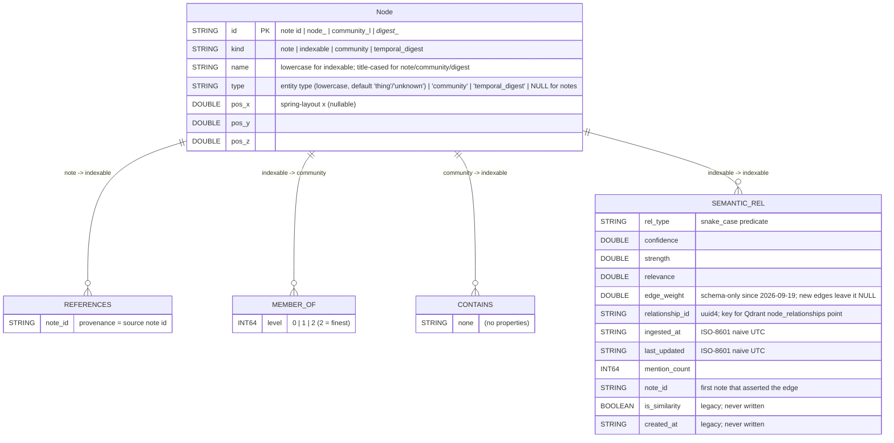
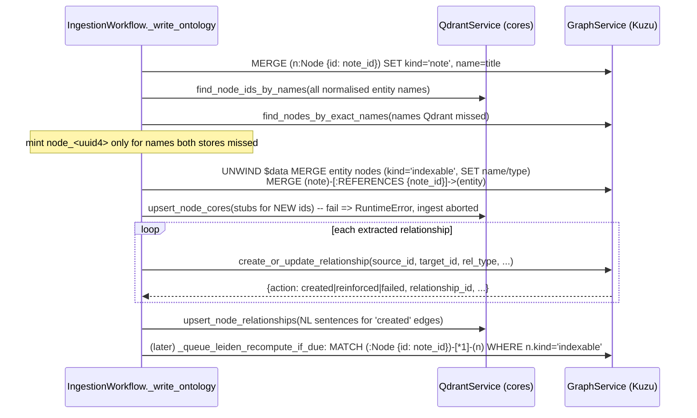

# Graph Storage (Kuzu)

**What this covers.** The embedded Kuzu graph database that stores the structural knowledge graph for each Knowledge Base: how connections are opened and locked, the single-node-table schema (`Node` + `REFERENCES` / `MEMBER_OF` / `CONTAINS` / `SEMANTIC_REL`), node identity and relationship semantics, note-to-entity linkage, Leiden community detection and its hierarchy, temporal digest nodes, the deterministic 3D layout algorithms and persisted positions, every public `GraphService` method with its Cypher, the graph and admin HTTP endpoints that expose the graph, and the invariants/gotchas an engineer or AI assistant must respect when touching any of it. Content payloads (descriptions, facts, contexts) are **not** in Kuzu; they live in Qdrant/Meilisearch and are only referenced here where the graph code reads them.

**Related docs:** [Ingestion pipeline](10-ingestion-pipeline.md) · [Search indexes: Qdrant & Meilisearch](15-search-indexes-qdrant-meilisearch.md) · [Retrieval and chat](16-retrieval-and-chat.md) · [Knowledge bases and vaults](08-knowledge-bases-and-vaults.md) · [API reference](07-api-reference.md) · [Backend core and configuration](06-backend-core-and-configuration.md) · [Data directory layout](22-data-directory-layout.md) · [Frontend chat, graph and pages](20-frontend-chat-graph-and-pages.md) · [Decisions and constraints](26-decisions-and-constraints.md) · [Glossary](28-glossary.md)

---

## 1. Responsibilities & boundaries

**Owns**

- The per-KB Kuzu database file (`DATA_DIR/kuzu/<slug>/kuzu_graph`, default KB: `DATA_DIR/kuzu/kuzu_graph`) and its `.wal`.
- Schema bootstrap (idempotent DDL in `_SCHEMA_STMTS`) and a process-wide `threading.RLock` per `GraphService` instance that serialises every Cypher statement.
- Structural facts only: which node IDs exist, their `kind`/`name`/`type`, which note REFERENCES which entity, SEMANTIC_REL edges with numeric weights and provenance, community membership (MEMBER_OF / CONTAINS), and persisted 3D coordinates (`pos_x/pos_y/pos_z`).
- The 3D layout algorithms (`backend/app/utils/graph_layout.py`) whose outputs are persisted to Kuzu.
- The `GET /api/v1/graph/*` visualisation/autocomplete endpoints and the `/api/v1/admin/*` maintenance endpoints that drive rebuilds.

**Does NOT own**

- Node *content*: `description`, `facts`, `isolated_contexts`, `potential_questions`, `themes`, `member_count`, `community_level`, relationship `natural_language`. All of that is Qdrant payload (`*_node_cores`, `*_node_relationships`, `*_node_isolated_contexts`) and Meilisearch documents — see [15](15-search-indexes-qdrant-meilisearch.md). `GraphService` reads them through its injected `QdrantService` to assemble detail payloads, but never writes them except through `upsert_node_core` for community/digest nodes.
- Name → ID resolution for entities. `GraphService.resolve_node_id` delegates to `QdrantService.find_node_id_by_name`; Kuzu's own name index is only a fallback (`find_nodes_by_exact_names`).
- Entity/relationship extraction (LLM) and the decision of *what* to write — that is `backend/app/workflows/ingestion.py` ([10](10-ingestion-pipeline.md)). This doc documents the write contracts those call sites rely on.
- Leiden/community *summaries* (LLM prompts) — generated in `IngestionWorkflow`; only the resulting node/edges are stored here.
- Retrieval ranking logic ([16](16-retrieval-and-chat.md)); only the graph read contracts retrieval uses are described.

## 2. Files

| Path | Purpose | Key exports |
|---|---|---|
| `backend/app/services/graph.py` | Kuzu-backed `GraphService`; schema DDL; all Cypher | `GraphService`, `graph_service` (default-KB singleton), `_SCHEMA_STMTS`, `_strip_facts_prefix` |
| `backend/app/utils/graph_layout.py` | Pure-Python deterministic 3D layouts | `compute_solar_positions`, `compute_spring_layout_3d`, `SOLAR_*` constants, `_fibonacci_sphere`, `_deterministic_jitter`, `_majority_key` |
| `backend/app/api/graph.py` | FastAPI router: 3D full graph, node detail, entity autocomplete, text scan, note subgraph | `router`, `ScanTextInput`, `_apply_meili_content`, `_needs_title` |
| `backend/app/api/admin.py` | FastAPI router: maintenance status, rebuild communities, temporal digests, reset, reingest | `router`, `TemporalDigestInput` |
| `backend/app/services/kb_registry.py` | Per-KB Kuzu path derivation/repair and lazy `GraphService` construction | `_kuzu_db_file`, `normalize_kuzu_path`, `KBContext.graph`, `KBRegistry._cleanup_stores` |
| `backend/app/workflows/ingestion.py` | The only writer of REFERENCES/SEMANTIC_REL edges, communities, digests and positions | `IngestionWorkflow._write_ontology`, `rebuild_leiden_communities`, `build_temporal_digests`, `_queue_leiden_recompute_if_due`, `get_maintenance_status` |
| `backend/app/core/config.py` | `KUZU_DB_PATH`, `COMMUNITY_*`, `TEMPORAL_DIGEST*` settings | `settings` |
| `backend/tests/unit/test_graph_queries.py` | Pins Cypher shape / return contract of hop queries and name lookups | — |
| `backend/tests/unit/test_graph_layout.py` | Pins layout determinism and geometry | — |
| `backend/tests/unit/test_relationships.py` | Pins relationship-type cleaning and edge-weight behaviour | — |
| `backend/requirements.txt` | `kuzu==0.11.3` pin | — |

## 3. Architecture / flow

### 3.1 Who reads and writes the graph

```mermaid
flowchart LR
    subgraph Writers
        ING["IngestionWorkflow._write_ontology<br/>(note node, entity nodes, REFERENCES, SEMANTIC_REL)"]
        SUM["IngestionWorkflow._update_node_summary<br/>(MERGE indexable stub)"]
        LEI["IngestionWorkflow.rebuild_leiden_communities<br/>(community nodes, MEMBER_OF, CONTAINS, pos_x/y/z)"]
        DIG["IngestionWorkflow.build_temporal_digests<br/>(temporal_digest nodes)"]
        DEL["api/notes.py delete_note<br/>(DETACH DELETE note + orphans)"]
        ADM["api/admin.py reset-ingestion-data<br/>(wipe_all_nodes)"]
        BF["api/graph.py node detail<br/>(name backfill SET n.name)"]
    end
    KUZU[("Kuzu<br/>DATA_DIR/kuzu/&lt;slug&gt;/kuzu_graph")]
    subgraph Readers
        RET["RetrievalService<br/>find_nodes_by_name / find_name_variants_batch /<br/>get_related_nodes / get_linked_evidence*"]
        G3D["api/graph.py<br/>get_full_3d_graph / get_node_detail / get_related_nodes"]
        TRK["_queue_leiden_recompute_if_due<br/>(1-hop neighbours of note)"]
    end
    Writers --> KUZU
    KUZU --> Readers
    QD[("Qdrant *_node_cores<br/>(names, descriptions, community_level)")]
    KUZU -. "resolve_node_id / content joins" .-> QD
```



Every arrow into Kuzu goes through `GraphService.execute_query`, which holds the instance `RLock` for the duration of the statement and result materialisation. There is exactly one `GraphService` per KB per process (cached on `KBContext`), so the lock is effectively a per-KB global write lock.

### 3.2 Entity–relationship diagram (Kuzu tables)



All four relationship tables are declared `FROM Node TO Node`; the *kind* discipline in the diagram (which kinds sit at each end) is enforced only by the writing code, not by Kuzu.

### 3.3 Ingestion write sequence (per note)



## 4. Connection management & lifecycle

### 4.1 Per-KB database paths

| KB | Path | Where decided |
|---|---|---|
| default | `DATA_DIR/kuzu/kuzu_graph` | `backend/app/core/config.py`: `DEFAULT_KUZU_DB_PATH`, then **unconditionally overwritten** after `settings = Settings()` with `settings.KUZU_DB_PATH = str(Path(settings.DATA_DIR) / "kuzu" / "kuzu_graph")`. Consequence: an env var `KUZU_DB_PATH` is accepted by pydantic but has no effect; only `DATA_DIR` (from `paths.json`) matters. |
| any other KB | `DATA_DIR/kuzu/<slug>/kuzu_graph` | `kb_registry._kuzu_db_file(data_dir, slug)`; stored in SQLite `knowledge_bases.kuzu_path` at `create_kb` time |

`slug` is `re.sub(r"[^a-z0-9_-]", "-", name.lower().replace(" ", "_")).strip("-_")` (falls back to `kb-<first 8 of uuid>`), so it can never contain `/` or `..` — this is what keeps the Kuzu path (and Qdrant/Meili names) inside `DATA_DIR` (commit f8f527f).

The path is a **file**, not a directory. Kuzu 0.11 stores the database as a single file plus a sibling `<file>.wal`. The sibling directory `DATA_DIR/kuzu/<slug>/` exists only to keep per-KB files apart.

### 4.2 `normalize_kuzu_path(path_str) -> str` (`kb_registry.py`)

Repairs a historical bug where `create_kb` `mkdir`'d `…/kuzu/<slug>` as a *directory* and Kuzu then refused to open it. Rules, in order:

1. Empty string → returned unchanged.
2. Basename is `kuzu_graph` **or** the path has any suffix → returned unchanged (already a file path).
3. Path exists and is a directory → `<path>/kuzu_graph`.
4. Path does not exist but its parent is named `kuzu` → `<path>/kuzu_graph`.
5. Otherwise unchanged.

It is applied in four places: `KBRegistry._load` (repairs and persists rows on startup), `KBRegistry.get_kb` (repairs on first access and persists), `KBRegistry._build_context`, `KBContext.graph`, and `_cleanup_stores`. Because rule 2 short-circuits on any suffix, a KB named e.g. `notes.v2` gets slug `notes-v2` (dots are not in the allowed set), so suffix collisions cannot arise from slugs — but a hand-edited `kuzu_path` with a dot will be trusted as-is.

### 4.3 Opening: `GraphService.__init__(db_path=None, qdrant=None)`

1. `self._qdrant = qdrant or qdrant_service` — the injected per-KB `QdrantService` is used for every name→id resolution and content join. Passing the wrong instance silently mixes KBs.
2. Path resolution: `Path(db_path or settings.KUZU_DB_PATH).expanduser()`; relative paths are anchored at `REPO_ROOT`; `parent.mkdir(parents=True, exist_ok=True)`.
3. `_migrate_legacy_db_path(path)`: if the target does not exist and the pre-`DATA_DIR` location `REPO_ROOT/data/kuzu_graph` (and/or its `.wal`) does, `rename` both into place. Any error is logged and ignored. No-op when the target already exists or *is* the legacy path.
4. `self.db = kuzu.Database(str(path))`; `self.conn = kuzu.Connection(self.db)`; `self._lock = threading.RLock()`.
5. `_init_schema()` runs each statement of `_SCHEMA_STMTS` under the lock; exceptions whose text contains `already exist` are ignored, anything else is logged at WARNING and **not raised** (so a broken schema surfaces later as query failures).

There is **one connection per service** used for both reads and writes; Kuzu's own concurrency model is not relied on — the `RLock` in `execute_query` serialises everything. `RLock` (not `Lock`) because `_init_schema` and callers such as `wipe_all_nodes` nest `execute_query` calls on the same thread.

### 4.4 When the DB is actually opened

- **Default KB:** eagerly, at import time. `backend/app/services/graph.py` ends with `graph_service = GraphService()`, so importing the module (which `kb_registry`, `ingestion`, `retrieval` all do) opens `DATA_DIR/kuzu/kuzu_graph`. Unit tests therefore stub `kuzu.Database`/`kuzu.Connection` before importing (`test_graph_queries._get_graph_service_class`).
- **Other KBs:** lazily, on first access of `KBContext.graph`. `_build_context` deliberately does *not* open Kuzu ("notes/finance must work even if Kuzu path was misconfigured"). `_ensure_lazy()` (called by `get_ingestion_workflow` / `get_chat_workflow`) touches `self.graph`, so any chat/ingest request opens it.
- `KBContext.graph` raises `RuntimeError("No Kuzu path configured for KB …")` if the normalised path is empty.

### 4.5 Closing and deleting

- `GraphService.close()` closes the `Connection` only (never the `Database`), swallowing errors. Nothing calls it on normal shutdown; the process exit closes the file.
- `KBRegistry.delete_kb` pops the context and calls `ctx.graph.close()` before `_cleanup_stores` deletes the file. Gotcha: evaluating `ctx.graph` on a KB whose graph was never opened *opens* it just to close it; harmless but slow.
- `_cleanup_stores` refuses to delete anything whose resolved path is not under `DATA_DIR/kuzu` (defence against crafted names, f8f527f). It unlinks the file and `.wal`, then removes the now-empty `<slug>` folder (never the `kuzu` root). A directory-shaped legacy path is `rmtree`'d.

### 4.6 Blocking calls and the event loop

All Kuzu work is synchronous. Every API call site wraps it in `asyncio.to_thread` (`api/graph.py`, `api/notes.py`, `api/admin.py` via `BackgroundTasks`), a change made in f8f527f ("move blocking Kuzu/vault work off the event loop"). The ingestion pipeline calls `GraphService` from worker threads / background tasks. Because the lock is a plain `threading.RLock`, a long graph query blocks other graph callers but not the event loop.

### 4.7 Schema bootstrap and migrations

- Bootstrap = `_SCHEMA_STMTS` (`CREATE NODE TABLE IF NOT EXISTS Node(...)`, `CREATE REL TABLE IF NOT EXISTS REFERENCES/MEMBER_OF/CONTAINS/SEMANTIC_REL(...)`).
- There is **no migration framework** for Kuzu. Adding a property to an existing table requires either an `ALTER TABLE … ADD` executed manually or deleting the DB file (users: Settings → reset; devs: `POST /api/v1/admin/reset-ingestion-data` only clears rows, it does not drop tables). Removing/renaming a property is likewise manual.
- Two data-level "migrations" exist: `_migrate_legacy_db_path` (file location) and `normalize_kuzu_path` (registry rows). Neither touches schema.
- The module docstring's `kind` list (`note | indexable | community`) is stale: `temporal_digest` is a fourth kind written by `create_temporal_digest_node`.

## 5. Schema

### 5.1 DDL (verbatim intent of `_SCHEMA_STMTS`)

```cypher
CREATE NODE TABLE IF NOT EXISTS Node(
    id STRING, kind STRING, name STRING, type STRING,
    pos_x DOUBLE, pos_y DOUBLE, pos_z DOUBLE,
    PRIMARY KEY(id))
CREATE REL TABLE IF NOT EXISTS REFERENCES(FROM Node TO Node, note_id STRING)
CREATE REL TABLE IF NOT EXISTS MEMBER_OF(FROM Node TO Node, level INT64)
CREATE REL TABLE IF NOT EXISTS CONTAINS(FROM Node TO Node)
CREATE REL TABLE IF NOT EXISTS SEMANTIC_REL(FROM Node TO Node,
    rel_type STRING, confidence DOUBLE, strength DOUBLE, relevance DOUBLE,
    edge_weight DOUBLE, relationship_id STRING, ingested_at STRING,
    last_updated STRING, mention_count INT64, note_id STRING,
    is_similarity BOOLEAN, created_at STRING)
```

### 5.2 `Node` properties

| Property | Type | Set by | Values / notes |
|---|---|---|---|
| `id` | STRING PK | all writers | See §6.1. Shared namespace for notes, entities, communities, digests. |
| `kind` | STRING | `ON CREATE SET` in every MERGE | `note`, `indexable`, `community`, `temporal_digest`. Replaces Neo4j labels (`:Note`, `:Indexable`, `:Community`). Never NULL for rows written by current code, but rows created by `create_or_update_relationship`'s endpoint MERGE get `kind='indexable'` **and nothing else** (no name/type). |
| `name` | STRING | `_write_ontology` (entities: normalised lowercase; note: title as-is, `"Untitled"` fallback), `create_leiden_community`, `create_temporal_digest_node`, `api/graph.py` backfill | Entity names are lowercase; all lookups use `toLower(n.name)` anyway. |
| `type` | STRING | `_write_ontology` (`node.type.strip().lower()` → `"thing"` if empty → `"unknown"` at the UNWIND site if still falsy), communities (`'community'`), digests (`'temporal_digest'`) | Notes have `type` NULL. `get_full_3d_graph` maps NULL → `"unknown"`. |
| `pos_x`,`pos_y`,`pos_z` | DOUBLE | `store_node_positions` (after each community rebuild) | NULL until the first successful rebuild. **Not read by any current endpoint** — `get_full_3d_graph` recomputes positions on the fly with `compute_solar_positions` (see §11.4). |

### 5.3 Relationship tables

| Table | From → To (by convention) | Properties | Writer | Readers |
|---|---|---|---|---|
| `REFERENCES` | note → indexable | `note_id STRING` (= from-node id; redundant but used via `coalesce(r.note_id, note.id)`) | `_write_ontology` `query_nodes` | `_hop_query`, `get_related_nodes`, `get_linked_evidence_by_node_ids`, `get_notes_referencing_node`, `delete_note` orphan query |
| `MEMBER_OF` | indexable → community | `level INT64` | `set_node_community_membership` | `get_full_3d_graph`, `get_all_node_ids_and_edges`, `get_node_detail`, `clear_all_communities` |
| `CONTAINS` | community → indexable | none | `create_leiden_community` (best-effort, errors logged at DEBUG) | nothing reads it; it is the inverse of MEMBER_OF kept for future traversals |
| `SEMANTIC_REL` | indexable → indexable | see §7 | `create_or_update_relationship` | `_hop_query`, `get_related_nodes`, `get_all_node_ids_and_edges`, `get_full_3d_graph` |

Kuzu rel tables permit multiple edges between the same pair; the code relies on this for distinct `rel_type`s between two nodes, and de-duplicates by `rel_type` itself (§7.3).

### 5.4 Cypher dialect / translation notes (Neo4j → Kuzu)

From the module docstring plus what the code actually uses:

| Neo4j idiom | Kuzu form used in Orb |
|---|---|
| `MATCH (n:Indexable)` | `MATCH (n:Node) WHERE n.kind IN ['indexable','note']` (note: retrieval treats notes as indexable for name lookup) |
| `MATCH (n:Note)` / `(n:Community)` | `n.kind = 'note'` / `n.kind = 'community'` |
| `NOT n:Note AND NOT n:Community` | `n.kind = 'indexable'` |
| `labels(n)` | `[n.kind]` (returned as `labels` list for API compatibility) |
| `type(r)` on a semantic edge | `r.rel_type` |
| `type(r)` on any edge | `label(r)` (Kuzu function; returns table name e.g. `'SEMANTIC_REL'`, `'REFERENCES'`) |
| `elementId(n)` | `n.id` |
| dynamic `:REL_TYPE` | `:SEMANTIC_REL` + `WHERE r.rel_type = $rel_type` |
| `n =~ 'pattern'` | `regexp_matches(n, 'pattern')` |
| `MATCH ()-[r:A|B]->()` | supported (`[r:SEMANTIC_REL|REFERENCES]`) |
| variable length `-[:A|B*1..N]-` | supported; `relationships(path)`, `length(path)`, list comprehension `[rel IN rels | …]` supported |
| `all(rel IN relationships(path) WHERE …)` inside a var-length MATCH | **forbidden** — triggers a `KU_UNREACHABLE` parser assertion in kuzu 0.11.3; filter in Python instead |
| parameters | `$name`; lists and lists-of-maps (`UNWIND $rows AS row … row.node_id`) work as parameters |
| `MERGE … ON CREATE SET … ON MATCH SET …` | supported |
| `DETACH DELETE` | supported |
| `UNION` | supported (`get_all_node_ids_and_edges` unions two RETURNs; the trailing `LIMIT 5000` applies to the union) |
| `CASE WHEN … THEN … ELSE … END`, `coalesce`, `toLower`, `size`, `STARTS WITH`, `CONTAINS`, `collect(DISTINCT {…})` | all used and working |

## 6. Node identity & naming

### 6.1 ID generation

| Kind | ID format | Minted by | When |
|---|---|---|---|
| `note` | the SQLite `notes.id` (UUID string) | notes API / ingestion | `_write_ontology` MERGEs `Node {id: note_id}`; the same id is used as `REFERENCES.note_id` |
| `indexable` | `node_<uuid4>` | `_write_ontology` | only after **both** `QdrantService.find_node_ids_by_names` and `GraphService.find_nodes_by_exact_names` fail to find the normalised name |
| `community` | `community_l<level>_<uuid4.hex>` | `rebuild_leiden_communities._commit_community` | every rebuild (old ids are deleted first — community ids are **not stable across rebuilds**) |
| `temporal_digest` | `digest_<period>_<key>` with `-`→`_` and `W`→`w` (e.g. `digest_month_2024_05`, `digest_week_2024_w21`, `digest_year_2024`) | `build_temporal_digests` | deterministic; rebuilt in place |

Entity ID resolution order in `_write_ontology` (this is the anti-duplicate contract):
1. Deduplicate names within the extraction (`seen_in_batch`).
2. Batch Qdrant lookup on `*_node_cores` payload `name` (exact lowercase match).
3. For misses, `find_nodes_by_exact_names` on Kuzu (handles a previous run whose Qdrant write failed).
4. Else mint. Immediately after the Kuzu write, stubs for new ids are upserted to Qdrant `node_cores`; if that upsert fails the ingest **raises** (`RuntimeError … Kuzu/Qdrant ID split-brain`) so Kuzu never holds an id Qdrant cannot resolve.

`resolve_node_id(name)` (used by `get_related_nodes` and `create_or_update_relationship` when ids are not supplied) consults Qdrant **only**. If Qdrant is down, names do not resolve and relationships are reported `failed`.

### 6.2 Name normalisation

- Ingestion: `normalize_name = name.lstrip("#").strip().lower()` for entity nodes; relationship endpoints use `.lower().strip()`.
- Kuzu lookups always compare `toLower(n.name)`; parameters are lowercased in Python (`find_nodes_by_name`, `find_nodes_by_exact_names`, `find_name_variants*`).
- Note node `name` is the resolved title (user title > LLM-extracted title > `llm_service.generate_title`), stored with original casing; `"Untitled"` if blank. Because notes are included in `kind IN ['indexable','note']` lookups, a note title can match an entity query.
- Community and digest names are LLM/format-generated display strings (e.g. `"May 2024 — Month Digest"`).
- Duplicates: nothing in Kuzu enforces name uniqueness. `find_nodes_by_exact_names` returns the lexicographically smallest id per name so callers converge on one canonical id.
- `api/graph.py` backfills `n.name` for nodes whose graph name is empty/`Unknown`/`Untitled*` using SQLite note titles or Qdrant `name`, so hop queries stop returning placeholders.

### 6.3 The legacy `FACTS:` prefix

Older ingests stored descriptions as `"FACTS: k=v | k=v. Prose…"`. `_strip_facts_prefix(text)` removes everything up to the first `". "` after `FACTS:` (regex `^FACTS:.*?[.]\s+(.*)`, DOTALL). If the prefix exists but no sentence terminator follows, it returns `""`. Applied to `description`/`summary` in `get_node_storage_payload` and `get_node_detail`. Descriptions live in Qdrant, so this is a read-side shim only.

## 7. Relationship model (`SEMANTIC_REL`)

### 7.1 `create_or_update_relationship(...) -> dict`

```python
create_or_update_relationship(
    source_name, source_label, target_name, target_label, relationship_type,
    confidence=1.0, strength=5.0, relevance=5.0, natural_language="",
    relationship_id=None, context="", note_id=None, source_id="", target_id="")
```

`source_label`, `target_label`, `context` are accepted for call-site compatibility and ignored (all nodes are `indexable`).

Steps:
1. Empty `relationship_type` → `ValueError`. Otherwise `re.sub(r"[^A-Za-z0-9_]", "_", relationship_type.strip())`. (The ingestion caller has already run `clean_rel_type`, which strips entity-name tokens from the predicate and falls back to `relates_to`.)
2. `relationship_id = relationship_id or str(uuid4())`.
3. No per-edge score is computed. `confidence`, `strength`, `relevance` and `edge_weight` remain in the DDL (kept from 033589d's symbolic ranking era) but the writer no longer sets them; no query or ranker reads them.
4. Resolve ids: if `source_id`/`target_id` not passed, `resolve_node_id(name.lower().strip())` via Qdrant. Either missing → return `{"action": "failed", "reason": "unresolvable IDs", …}` without touching Kuzu.
5. Look for an existing edge with the same `(source_id, target_id, rel_type)` (`LIMIT 1`).
6. **Reinforce** (exists): `last_updated = now`, `mention_count = coalesce(mention_count,0)+1`, and `relationship_id` only filled when currently NULL. `note_id`, `ingested_at` unchanged → provenance is *first* asserting note.
7. **Create** (absent): `MERGE` both endpoints as `Node` (`ON CREATE SET kind='indexable'` — no name/type; normally they already exist from `query_nodes`), then `CREATE (source)-[r:SEMANTIC_REL]->(target)` setting `rel_type, relationship_id, ingested_at = last_updated = now, mention_count = 1, note_id`.
8. Return `{"action": "created"|"reinforced", "source", "target", "relationship_type", "natural_language", "relationship_id"}`.

`now` is `datetime.utcnow().isoformat()` — a naive ISO string with microseconds and no `Z`.

### 7.2 Columns never written by current code

`is_similarity` and `created_at` are declared but never set (always NULL). They are leftovers of the bi-temporal design (033589d added `valid_from/valid_to/ingested_at/is_active`, and similarity edges); da75dfc "removed substantial bi-temporal / relationship evolution logic". The ingestion caller still checks `result["action"] in ("created", "evolved")` — `"evolved"` can no longer occur.

### 7.3 Identity of an edge

An edge is identified by the triple `(source.id, target.id, rel_type)` and is **directed**. Extraction of `A --knows--> B` and later `B --knows--> A` yields two edges. `relationship_id` is the join key to the Qdrant `*_node_relationships` point (`uuid5(NAMESPACE_OID, relationship_id)`), which holds the natural-language sentence and its embedding; Kuzu holds no NL text. Only `created` results get a Qdrant point; reinforcements do not touch Qdrant.

### 7.4 Weights in practice

| Field | Source | Read by |
|---|---|---|
| `confidence` | LLM extraction (0–1) | `_hop_query` returns `coalesce(r.confidence, 1.0)` as `confidence_path`; var-length query returns `coalesce(r.confidence, 0.0)`. Retrieval receives it but current code does no confidence filtering (the in-code comment "Confidence filtering is done in Python below" is stale; see §18). |
| `confidence`, `strength`, `relevance`, `edge_weight` | schema-only (never written since 2026-09-19) | not read by any query today |
| `mention_count` | reinforcement counter | not read by any query today |
| `note_id` | first asserting note | not read by any query today (REFERENCES.note_id is what evidence lookups use) |

## 8. Note ↔ entity linkage (`REFERENCES`)

### 8.1 Write path

Only `IngestionWorkflow._write_ontology` creates `REFERENCES` edges, in one UNWIND statement (`query_nodes`):

```cypher
MERGE (note:Node {id: $note_id})
ON CREATE SET note.kind = 'note', note.name = $note_title
ON MATCH  SET note.kind = 'note', note.name = $note_title
WITH note
UNWIND $data AS item                       -- [{id, name, type}, ...]
MERGE (n:Node {id: item.id}) ON CREATE SET n.kind = 'indexable'
SET n.name = item.name, n.type = item.type -- latest ingestion wins name/type
MERGE (note)-[r:REFERENCES]->(n)
SET r.note_id = $note_id
```

Properties of this contract:
- Direction is always **note → entity**.
- `MERGE` on the edge makes re-ingestion idempotent for entities still mentioned.
- **Nothing removes stale edges on re-ingest.** If a note is edited so that it no longer mentions entity X and is re-ingested, `(note)-[:REFERENCES]->(X)` remains until the note is deleted. Evidence lookups can therefore cite a note that no longer contains the entity.
- `ON MATCH SET note.kind = 'note'` repairs a note id that was previously created as a bare `indexable` stub (possible via `create_or_update_relationship`'s endpoint MERGE if an entity name collided with a note id — unlikely but handled).
- `_update_node_summary` (the per-entity context accumulator) also MERGEs indexable nodes (`MERGE (n:Node {id}) ON CREATE SET n.kind='indexable' SET n.name, n.type`) but never creates `REFERENCES`; an entity reached only through that path has no note evidence.

### 8.2 Read paths

| Reader | Cypher gist | Purpose |
|---|---|---|
| `get_linked_evidence_by_node_ids(node_ids, limit_per_node=3, node_id_to_name)` | `UNWIND $node_ids AS node_id MATCH (n:Node {id: node_id})<-[:REFERENCES]-(note:Node) WHERE note.kind='note' WITH node_id, collect(DISTINCT {id: note.id, title: note.name}) AS evidence RETURN node_id, evidence` | retrieval evidence: which notes back an entity; trimmed to `limit_per_node` in Python; adds `node_name` from the supplied map (lowercased) |
| `get_linked_evidence(node_names, …)` | resolves names → ids via `QdrantService.find_node_ids_by_names` then delegates | same, name-based entry point |
| `get_notes_referencing_node(node_id, limit=8)` | `MATCH (note:Node)-[r:REFERENCES]->(n:Node {id:$nid}) WHERE note.kind='note' RETURN DISTINCT note.id, note.name, coalesce(r.note_id, note.id) LIMIT $lim` | "Mentioned in notes" list on the 3D node card |
| `_hop_query` / `get_node_connections` / `get_related_nodes(max_depth=1)` | `-[r:SEMANTIC_REL|REFERENCES]->` | notes appear as 1-hop neighbours with `label='note'` and `relationship_path=['REFERENCES']` |
| `get_related_nodes(max_depth>1)` | `-[:SEMANTIC_REL|REFERENCES*1..N]-` (undirected) | multi-hop expansion crosses notes: entity → note → other entity in the same note is a 2-hop path |
| `_queue_leiden_recompute_if_due` | `MATCH (:Node {id:$note_id})-[*1]-(n:Node) WHERE n.kind='indexable'` | which entity ids to mark pending for community recompute |
| `api/notes.py _delete_note_impl` | see §8.3 | orphan detection |

### 8.3 Delete path (`DELETE /api/v1/notes/{id}` and `POST /api/v1/notes/batch-delete`)

After the vault file and SQLite rows are gone (so a graph failure cannot strand the UI), the graph cleanup runs best-effort, each step in `asyncio.to_thread` and individually try/except-logged:

1. Orphan detection (Kuzy `EXISTS {}` subquery is supported):
   ```cypher
   MATCH (note:Node {id: $note_id, kind: 'note'})-[:REFERENCES]->(entity:Node)
   WHERE entity.kind <> 'note'
     AND NOT EXISTS { MATCH (other:Node {kind: 'note'})-[:REFERENCES]->(entity) WHERE other.id <> $note_id }
   RETURN entity.id AS entity_id
   ```
2. `MATCH (n:Node {id:$id}) WHERE n.kind='note' DETACH DELETE n` (drops its REFERENCES edges).
3. `kb.qdrant.delete_node(note_id)`, `kb.meili.delete_node(note_id)`.
4. For each orphan: `MATCH (n:Node {id:$id}) DETACH DELETE n` (this also removes its `SEMANTIC_REL`, `MEMBER_OF`, `CONTAINS` edges), then Qdrant/Meili delete.

Response includes `orphans_removed`. Community nodes are not recounted; a community may keep dangling `member_count`-style content in Qdrant until the next rebuild. Relationship points in Qdrant `*_node_relationships` that referenced the orphan are **not** deleted (`delete_node` only clears cores + contexts) — they become dangling until a community rebuild does not touch them either; see [15](15-search-indexes-qdrant-meilisearch.md).

## 9. Communities ("Leiden")

### 9.1 What the algorithm really is

Everything is named *Leiden* — `rebuild_leiden_communities`, `create_leiden_community`, `set_node_community_membership` docstrings, log prefixes `[Community]`, the admin endpoint — but **no Leiden/Louvain/igraph/networkx code exists in the repo** (`git grep` for `leidenalg|igraph|networkx` returns nothing; none are in `backend/requirements.txt`). The implementation in `IngestionWorkflow.rebuild_leiden_communities` is **agglomerative clustering of embedding vectors** using `sklearn.cluster.AgglomerativeClustering(n_clusters=None, distance_threshold=…, metric="cosine", linkage="average")` on L2-normalised vectors from `embedding_service.embed_documents`. The graph topology (SEMANTIC_REL edges) is **not** an input to clustering; only node text is. Treat "Leiden" as a historical label.

### 9.2 Three-level hierarchy

| Level | Items clustered | Text embedded per item | `distance_threshold` | ≈ min cosine similarity | Notes |
|---|---|---|---|---|---|
| **L2** (finest) | every `indexable` node (from `get_indexable_nodes_for_communities`, enriched with `isolated_contexts` from Qdrant) | `"{name}: {ctx1 | ctx2 | …}"` or just `name` | `0.25` | 0.75 | singleton clusters are skipped → those entities become **L2 orphans** |
| **L1** | the L2 community ids only (orphans excluded) | `"{community_name}: {summary}"` | **`0.35`** (function default; the in-code comment says 0.50 — the comment is wrong) | 0.65 | clusters with one rollup input are skipped |
| **L0** (broadest) | the L1 community ids only | `"{community_name}: {summary}"` | `0.75` | 0.25 | code has a branch to fold orphan *entities* into L0 but `l0_super_ids` is only L1 ids, so it is dead |

Member sets are transitive: an L1 community's `member_entity_ids` is the union of its L2 children's entity ids; L0 likewise. Consequently one entity may hold `MEMBER_OF` edges to up to three communities (level 2, 1, 0). `compute_solar_positions` reconstructs the parent tree from these per-level assignments by majority vote — parent edges between communities are **not** stored.

### 9.3 What gets written per community (`_commit_community`)

1. Name + summary via LLM: `_build_community_summary(member_rows, level)` for L2, `_build_rollup_summary(rollup_rows, level)` for L1/L0. Generic names (`_is_generic_community_name`) are rejected with up to 2 `strict_naming=True` retries; then `_derive_fallback_community_name(member_rows)`. Empty summary falls back to `"Community at level {L} containing {n} related nodes."`. Summary failures skip the community entirely.
2. `community_id = f"community_l{level}_{uuid4().hex}"`.
3. `GraphService.create_leiden_community(community_id, level, name, summary, member_node_ids)`:
   - Kuzu `MERGE (c:Node {id}) ON CREATE SET c.kind='community', c.type='community', c.name=$name ON MATCH SET c.name=$name`
   - Kuzu `MATCH (c) UNWIND $member_ids AS m MATCH (n {id:m}) MERGE (c)-[:CONTAINS]->(n)` (errors → DEBUG log, continue)
   - Qdrant `upsert_node_core(node_id=community_id, name, node_type="community", description=summary, description_vector=embed(summary), community_level=level)` (errors → WARNING, continue)
   - returns `{"community_id": …}`
4. `MeilisearchService.index_node(node_id, name, node_type="community", community_level=level)` — no contexts text.
5. Qdrant `upsert_node_relationships` of one membership sentence per member: `"{member name} is a member of the '{name}' community."`, `relationship_id=f"community_rel_{community_id}_{nid}"`, `source_node_id=nid`, `target_node_id=community_id`, `is_community_rel=True`. This sentence is the **only** retrieval-visible signal of membership.
6. `GraphService.set_node_community_membership(member_ids, community_id, level)`: `MATCH (c {id}) UNWIND $node_ids AS id MATCH (n {id}) MERGE (n)-[r:MEMBER_OF]->(c) SET r.level=$level`. Unknown ids silently produce no rows.

After all levels: one batched `MeilisearchService.update_nodes_community(rows)` refreshes `relationship_natural_language` and `name` on every assigned entity document (NL fetched from Qdrant `get_relationships_for_node_ids`), then the spring layout is recomputed and persisted (§11.2).

### 9.4 Where community data lives

| Datum | Kuzu | Qdrant `*_node_cores` | Meilisearch |
|---|---|---|---|
| community id / display name | `Node.id`, `Node.name` | payload `node_id`, `name` | doc `node_id`, `name` |
| level | **only as `MEMBER_OF.level` on member edges** (`get_full_3d_graph` derives it; "community_level is not stored on the community node itself") | payload `community_level` | doc `community_level` (filterable) |
| summary / description | — | payload `description` | — |
| membership | `MEMBER_OF` (entity→community), `CONTAINS` (community→entity) | `*_node_relationships` points with `is_community_rel=True` | entity doc `relationship_natural_language` contains the membership sentence |
| `themes`, `member_count`, `domain`, `status` | — | read by `get_node_detail` from payload but **never written** by current code → always empty/0 | — |

### 9.5 Clearing (`clear_all_communities() -> list[str]`)

```
MATCH (c:Node) WHERE c.kind='community' RETURN c.id      -- collect ids
MATCH ()-[r:MEMBER_OF]->() DELETE r
MATCH (c:Node) WHERE c.kind='community' DETACH DELETE c  -- also drops CONTAINS
QdrantService.delete_community_relationships()           -- is_community_rel == True
```
The caller (`rebuild_leiden_communities`) then calls `qdrant.delete_node(id)` and `meili.delete_node(id)` per returned id. Because the clear happens **before** the new hierarchy is built, a cancelled run leaves the KB with a partial (or empty) community set until the rescheduled run completes.

### 9.6 When it runs

| Trigger | Path | Gate |
|---|---|---|
| **Idle after ingestion** | `process_note` `finally:` → `IngestionTrackerService.end_ingestion(self.rebuild_leiden_communities)`; when the active-ingestion counter reaches 0 → `schedule_recompute` → `_debounce_recompute` sleeps `COMMUNITY_IDLE_SECONDS = 120` (module constant in `ingestion_tracker.py`, **not** a setting) then `asyncio.to_thread(callback)` if there are pending node ids **or** `_recompute_needed` | `settings.COMMUNITY_DETECTION_ENABLED` (default **False** in `config.py`; `.env.example` ships `true`) |
| **Admin** | `POST /api/v1/admin/rebuild-communities` → `BackgroundTasks.add_task(kb.get_ingestion_workflow().rebuild_leiden_communities)` | none — works even when the flag is off |

Pending ids come from `_queue_leiden_recompute_if_due(note_id)`: the note's 1-hop `indexable` neighbours are added to `_tracker._pending_node_ids`. They are only a *trigger*; the rebuild is always full-graph (the tracker's `queue_nodes_for_community_recompute` "always returns an empty batch").


### 9.7 Cancellation, single-flight and early stop

- `_tracker` is the process-global `ingestion_tracker` singleton, shared by **all** KBs. `begin_ingestion` (any KB) sets `cancel_recompute` and `cancel_temporal`; a running rebuild in KB A is cancelled by an ingest in KB B. The debounce callback is whichever workflow's bound method was passed to the most recent `end_ingestion`, so with multi-KB ingestion the idle-triggered rebuild may run for a different KB than the one whose nodes were queued.
- Inside `rebuild_leiden_communities`, `_tracker.cancel_recompute.is_set()` is checked before every cluster at each level and inside the generic-name retry loop; when set the method returns `created` (count so far). `_debounce_recompute` then sets `_recompute_needed=True` and reschedules if no ingestion is active.
- Per-workflow single-flight: `_community_run_seq` / `_community_run_active_seq` / `_community_run_running` under `_community_run_state_lock`. A newer request sets `cancel_recompute`, polls every 0.25 s until the active run releases, and an older superseded request returns 0 without running. The claim is released in `finally`.
- If ingestion becomes active during the claim handoff, the cancel flag is preserved so the new run exits at its first checkpoint.

## 10. Temporal digests

| Aspect | Detail |
|---|---|
| Producer | `IngestionWorkflow.build_temporal_digests(period=None) -> int` |
| Input | `QdrantService.scroll_all_isolated_contexts_with_dates()` — every `*_node_isolated_contexts` point whose payload has `note_created_at` (set by `append_node_item` from the note's `created_at`) |
| Bucketing | `period` = arg or `settings.TEMPORAL_DIGEST_PERIOD` (default `"month"`): `month` → `%Y-%m`, `week` → `%G-W%V` (ISO week), `year` → `%Y`; unparsable dates dropped; empty `content` dropped |
| LLM | `llm_service.generate_text(system_prompt="You are a knowledge synthesis assistant. Summarize the main topics, events, and themes … Return only the summary paragraph…", user_prompt="The following contexts are from notes created during {label}:\n\n{combined}")` where `combined` is the bucket's contexts joined by `\n---\n`, truncated at 12 000 chars with `"\n...[truncated]"`. Failure → `"Notes from {label}."` |
| Label | `month` → `"May 2024"`; `week` → `"Week 21, 2024"`; `year` → `"2024"` |
| Node id | `f"digest_{period}_" + key.replace("-", "_").replace("W", "w")` — deterministic |
| Node name | `f"{label} — {period.capitalize()} Digest"` |
| Kuzu | `GraphService.create_temporal_digest_node(node_id, name, summary, period_key)`: `MERGE (d:Node {id}) ON CREATE SET d.kind='temporal_digest', d.type='temporal_digest', d.name=$name ON MATCH SET d.name=$name`. **No edges.** |
| Qdrant | same method: `upsert_node_core(node_id, name, node_type="temporal_digest", description=summary, description_vector=embed(summary), extra_payload={"period_key": key})` — `period_key` is what retrieval filters on (`search_all_collections(period_key_filter=…)`) |
| Meilisearch | `index_node(node_id, name, node_type="temporal_digest", isolated_contexts_text=summary)` |
| Clearing | `GraphService.clear_all_temporal_digests()` (`MATCH (d:Node) WHERE d.kind='temporal_digest' RETURN d.id` then `DETACH DELETE`) → caller deletes each id from Qdrant/Meili. Runs **after** bucketing succeeds, so an empty KB does not wipe existing digests. |
| Triggers | (a) debounced per-workflow `threading.Timer(COMMUNITY_IDLE_SECONDS, self.build_temporal_digests)` restarted by every `_queue_leiden_recompute_if_due` when `TEMPORAL_DIGESTS_ENABLED`; (b) `POST /api/v1/admin/build-temporal-digests` `{period?}`. |
| Gates | The method itself returns 0 when `settings.TEMPORAL_DIGESTS_ENABLED` is False (default False) — so, contrary to the admin endpoint's docstring ("this manual endpoint is always available"), the endpoint returns `started` but the job no-ops when the flag is off. Also returns 0 (and relies on the timer restarting later) if `_tracker.has_active_ingestions()`. |
| Cancellation | `_tracker.cancel_temporal` checked between buckets; on cancel, reschedules itself via a fresh timer if no ingestion is active. |
| Status | `get_maintenance_status()["temporal_digests"]["running"]` (`_temporal_digest_running` flag; not reset on unexpected exceptions — a crash mid-run leaves it `True` until the next successful run). |
| Visibility | Not part of `get_full_3d_graph` (filters `kind IN ['indexable','note','community']`), not returned by `get_node_detail`, not counted by `get_all_node_ids_and_edges`. Only retrieval sees them (via Qdrant cores / Meili). |

## 11. 3D positions & layout algorithms

Both algorithms are in `backend/app/utils/graph_layout.py`, pure Python, no RNG (all "randomness" is `md5(seed)` with `usedforsecurity=False`).

### 11.1 Shared helpers

- `_fibonacci_sphere(n, radius) -> list[(x,y,z)]`: `n` points on a sphere surface using the golden angle `π(√5−1)`; `y` runs 1 → −1; `n<=0` → `[]`. Points are distinct; distance from origin is `radius` within float error (test asserts <1%).
- `_deterministic_jitter(seed, max_offset) -> (jx,jy,jz)`: three bytes of `md5(seed)` mapped to `[-max_offset, +max_offset]`. Same seed → same offset; used to avoid z-fighting.
- `_majority_key(votes)`: `max(votes, key=votes.__getitem__)` — ties resolve to the first-inserted max key (dict order), which is deterministic given deterministic input order.

### 11.2 `compute_spring_layout_3d(node_ids, edges, k=220.0, iterations=80, gravity=0.02)` — Fruchterman–Reingold

Called from `rebuild_leiden_communities` after communities are written, on `get_all_node_ids_and_edges()`:
- nodes: `kind IN ['indexable','note','community']`
- edges: `DISTINCT` `SEMANTIC_REL` pairs `UNION` `MEMBER_OF` pairs, **`LIMIT 5000` on the union**.

Algorithm:
1. `n==0 → {}`, `n==1 → {id: (0,0,0)}`.
2. Initial positions on a Fibonacci sphere of radius `k·max(n^(1/3), 1.5)` in `node_ids` order.
3. Edges normalised to undirected unique pairs, self-loops and unknown endpoints dropped.
4. For `step` in `range(iterations)`: temperature `t = 2.5k · (0.5 + 0.5·cos(π·step/iterations))` (cosine anneal); repulsion for all pairs `f = k²/d` (O(n²)); attraction along edges `f = d²/k`; gravity `−pos·gravity`; each node moves `min(|disp|, t)` along `disp`.
5. Result `{id: (float,float,float)}` persisted by `store_node_positions` in UNWIND batches of 500 (`MATCH (n {id: row.node_id}) SET n.pos_x=row.x, …`), with per-row fallback if a batch fails.

Determinism: no RNG, but the initial placement depends on the **order** of `node_ids` as returned by Kuzu, which is scan order, not guaranteed stable across rebuilds. Cost: `n=500` → 80 × 125 k pair evaluations in pure Python (a few seconds); the code comment sets the expected ceiling at "n ≤ ~500".

**Important:** these persisted `pos_*` values are currently **not read by any endpoint**. `get_full_3d_graph` recomputes a solar layout per request (§11.3). The spring layout is effectively a write-only cache retained from commit b84ca73/8de5cda's "batch … Kuzu position writes" work.

### 11.3 `compute_solar_positions(communities, node_level_map, all_node_ids=None)` — hierarchical "solar system"

Inputs (built by `get_full_3d_graph` from `MEMBER_OF` rows ordered by `level DESC`):
- `communities`: `[{community_id, community_level (0|1|2), name}]` — level derived from the max `MEMBER_OF.level` seen for that community (last write in the loop wins; rows are `ORDER BY r.level DESC` so the smallest level wins in practice — for a well-formed hierarchy every edge to a given community has the same level).
- `node_level_map`: `{node_id: {level: community_id}}`.
- `all_node_ids`: all `indexable`+`note` ids (for orphan placement).

Constants: `SOLAR_UNIVERSE_RADIUS=1800`, `SOLAR_L0_RING_BASE=500`, `SOLAR_L0_RING_MAX=1200`, `SOLAR_L1_RING_BASE=150`, `SOLAR_L1_RING_MAX=400`, `SOLAR_L2_NODE_BASE=18`, `SOLAR_L2_NODE_MAX=55`.

Steps:
1. Parent inference: for each node, vote `l2 → l1` and `l1 → l0`; `_majority_key` picks each community's parent. Children lists are sorted; community id lists per level are sorted.
2. **L0 stars**: Fibonacci sphere of radius 1800, jitter 5.
3. **L1 planets**: around their L0 parent on a sphere of radius `min(500·√n_children, 1200)`, jitter 3. L1s with no parent vote: placed at `_deterministic_jitter(id, 1440)` (0.8·1800) — a pseudo-random position in the universe.
4. **L2 moons**: around their L1 parent, radius `min(150·√n, 400)`, jitter 2; parentless L2 → jitter 900.
5. **Nodes**: around their L2, radius `min(18·√members, 55)`, jitter 2, members sorted.
6. **Orphans** (ids in `all_node_ids` not yet placed): if they have an L1 → cluster around it (radius `min(105·√n, 200)`); else an L0 → around it (`min(200·√n, 360)`); else scattered through the volume with radius `80 + r^(1/3)·(2520−80)` and direction from md5 bits (uniform-in-volume distribution).

Output: `{id: (x,y,z)}` for every community id and every id in `all_node_ids` (tests: all ids present, L0 at ≈1800 from origin, output identical across calls, works with zero communities).

### 11.4 Which layout does the UI see?

`GET /api/v1/graph/3d/full` → `GraphService.get_full_3d_graph()` → `compute_solar_positions`. The docstring of the endpoint ("flat spring-layout 3D graph … with pre-computed positions") and of `graph_layout.py` ("stored on community recompute for the nested 3D graph") describe the *previous* split; today the endpoint is solar-on-the-fly and the stored spring positions are unused. If communities do not exist, every node is a "truly orphan" node scattered in the 80–2520 shell.

## 12. `GraphService` public API (method by method)

Conventions: every method returns plain Python (`list[dict]` rows keyed by Cypher aliases), raises on Kuzu errors unless noted, and takes the instance lock inside `execute_query`. "Callers" lists non-test call sites.

| Method | Signature | What it does / Cypher | Returns | Callers |
|---|---|---|---|---|
| `execute_query` | `(query: str, params: dict=None) -> list[dict]` | Runs one Cypher statement under `self._lock`; iterates `QueryResult` into `dict(zip(column_names, row))`. Logs query+params at ERROR and **re-raises** on failure. | rows | everything; also directly from `api/notes.py` (delete), `api/graph.py` (name backfill), `ingestion.py` (MERGEs, neighbour query) |
| `close` | `() -> None` | `self.conn.close()`; errors swallowed | — | `KBRegistry.delete_kb` |
| `resolve_node_id` | `(name) -> str|None` | `self._qdrant.find_node_id_by_name(name)` — **Qdrant, not Kuzu** | id | `get_related_nodes`, `create_or_update_relationship` |
| `find_nodes_by_name` | `(names: list[str], fuzzy=True) -> list[dict]` | lowercases names; fuzzy: `UNWIND $names AS q MATCH (n:Node) WHERE n.kind IN ['indexable','note'] AND toLower(n.name) CONTAINS q RETURN DISTINCT n.id AS node_id, n.name AS name, [n.kind] AS labels, n.type AS entity_type, q AS matched_query LIMIT 50`; exact: `toLower(n.name) IN $names`, `matched_query = toLower(n.name)` | rows `{node_id,name,labels,entity_type,matched_query}` | `RetrievalService` (entity lookup), `_update_node_summary` (`fuzzy=False`) |
| `find_nodes_by_exact_names` | `(names) -> dict[str,str]` | `WHERE n.kind='indexable' AND toLower(n.name) IN $names RETURN toLower(n.name) AS name, n.id AS id`; picks lexicographically smallest id per name | `{lower_name: id}` | `_write_ontology` (Kuzu fallback after Qdrant miss) |
| `find_name_variants` | `(base_name, limit=5) -> list[dict]` | prefix/contains match on `toLower(n.name)` with suffix guards: excludes Sr/Jr cross-matches and generational suffixes (`_SUFFIX_PAT = ".* (sr\.?|jr\.?|senior|junior|i|ii|iii|iv|v|vi)$"`) unless both have them; `CONTAINS` branch requires `size(n.name) > size(base)+2` | rows `{node_id,name,labels,entity_type}` | none currently (batch variant is used) |
| `find_name_variants_batch` | `(base_names, limit_per_name=5) -> dict[str, list[dict]]` | same predicate under `UNWIND $base_names AS base`, no LIMIT in Cypher; capped per base in Python; dedups and lowercases input | `{base_lower: [rows]}` | `RetrievalService` |
| `get_indexable_nodes_for_communities` | `() -> list[dict]` | `WHERE n.kind='indexable' AND n.id IS NOT NULL RETURN n.id AS node_id, n.name AS name, n.type AS type` | rows | `rebuild_leiden_communities` |
| `wipe_all_nodes` | `() -> int` | `count(n)` then `MATCH (n:Node) DETACH DELETE n` | count | `POST /admin/reset-ingestion-data` |
| `clear_all_communities` | `() -> list[str]` | §9.5 | old community ids | `rebuild_leiden_communities` |
| `clear_all_temporal_digests` | `() -> list[str]` | `kind='temporal_digest'` collect + `DETACH DELETE` | old digest ids | `build_temporal_digests` |
| `create_temporal_digest_node` | `(node_id, name, summary, period_key) -> None` | §10; Qdrant failure logged, not raised | — | `build_temporal_digests` |
| `set_node_community_membership` | `(node_ids, community_id, community_level) -> None` | one UNWIND MERGE of `MEMBER_OF` with `SET r.level` | — | `_commit_community` |
| `create_leiden_community` | `(community_id, community_level, name, summary, member_node_ids) -> dict` | §9.3 step 3 | `{"community_id"}` | `_commit_community` |
| `get_node_storage_payload` | `(node_id) -> dict|None` | Kuzu existence check (`RETURN n.id, [n.kind] AS labels`) then Qdrant `get_node_content_by_id` + `get_relationships_for_node_ids`; strips `FACTS:` | `{node_id, labels, name, description, facts, potential_questions, isolated_contexts, community_level, relationship_natural_language}` (`facts`/`potential_questions` are always `[]` — Qdrant no longer returns them) | none currently (kept for API compatibility) |
| `get_linked_evidence` | `(node_names, limit_per_node=3) -> list[dict]` | §8.2 | `[{node_id, evidence:[{id,title}], node_name}]` | `RetrievalService` |
| `get_linked_evidence_by_node_ids` | `(node_ids, limit_per_node=3, node_id_to_name=None) -> list[dict]` | §8.2 | same | `RetrievalService`, `get_linked_evidence` |
| `create_or_update_relationship` | §7.1 | §7.1 | `{action, …}` | `_write_ontology` |
| `_hop_query` (private but load-bearing) | `(direction: "->"|"<-") -> str` | template: `MATCH (start:Node {id:$node_id})-[r:SEMANTIC_REL|REFERENCES]->(related:Node) RETURN DISTINCT related.id AS node_id, related.name AS name, related.kind AS label, 1 AS depth, [CASE WHEN label(r)='SEMANTIC_REL' THEN r.rel_type ELSE label(r) END] AS relationship_path, [coalesce(r.confidence,1.0)] AS confidence_path, [NULL] AS context_path, [NULL] AS natural_language_path ORDER BY name` | Cypher string | `get_related_nodes`, `get_node_connections` |
| `get_related_nodes` | `(node_name, max_depth=2, node_id=None) -> list[dict]` | `node_id or resolve_node_id(name)`; none → `[]`. **depth 1:** runs outgoing then incoming `_hop_query`, tags `edge_direction`, dedups by `node_id` keeping outgoing, sorts by name. **depth>1:** `MATCH path=(start {id})-[:SEMANTIC_REL|REFERENCES*1..N]-(related) WITH related, relationships(path) AS rels, length(path) AS depth RETURN DISTINCT … [rel IN rels | CASE WHEN label(rel)='SEMANTIC_REL' THEN rel.rel_type ELSE label(rel) END] AS relationship_path, [rel IN rels | coalesce(rel.confidence,0.0)] AS confidence_path, … ORDER BY depth LIMIT 200` (undirected, no `edge_direction`, no confidence filtering despite the comment) | rows `{node_id,name,label,depth,relationship_path,confidence_path,context_path,natural_language_path[,edge_direction]}` | `RetrievalService` (depth 1 with known id), `api/graph.py note-subgraph` (depth 1 by name) |
| `get_all_node_ids_and_edges` | `() -> (list[str], list[(str,str)])` | §11.2 | ids, edges | `rebuild_leiden_communities` |
| `get_full_3d_graph` | `() -> dict` | §13.1 | `{nodes, edges}` | `GET /graph/3d/full` |
| `store_node_positions` | `(positions: dict[str,(x,y,z)]) -> None` | §11.2 | — | `rebuild_leiden_communities` |
| `get_node_connections` | `(node_id, *, limit=16) -> list[dict]` | both `_hop_query` directions by **id** (no Qdrant), dedup, sort by lowercase name, slice `[:max(1,limit)]` | hop rows + `edge_direction` | `get_node_detail` |
| `get_notes_referencing_node` | `(node_id, *, limit=8) -> list[dict]` | §8.2 | `[{note_id, name}]` (`"Untitled note"` fallback) | `get_node_detail` |
| `get_node_detail` | `(node_id) -> dict|None` | §13.2 | detail dict | `GET /graph/3d/node/{id}` |

## 13. HTTP endpoints

All routes take the standard `?kb=<slug>` selector via `Depends(get_kb)` and run graph work in `asyncio.to_thread`. Frontend wrappers live in `frontend/src/lib/api.ts` (`graph3dFull`, `graph3dNode`, `entities search/scan-text/note-subgraph`, `admin *`). See [07-api-reference.md](07-api-reference.md) for the cross-cutting conventions.

### 13.1 `GET /api/v1/graph/3d/full`

Returns `GraphService.get_full_3d_graph()`:

```json
{
  "nodes": [
    {"node_id": "node_…", "name": "shirley temple", "node_type": "person",
     "description": "", "community_id": "community_l2_…" , "x": 1.2, "y": -3.4, "z": 5.6},
    {"node_id": "community_l0_…", "name": "Hollywood", "node_type": "community",
     "description": "", "community_id": null, "x": …, "y": …, "z": …}
  ],
  "edges": [
    {"source": "node_a", "target": "node_b", "type": "plays"},
    {"source": "node_a", "target": "community_l2_…", "type": "MEMBER_OF"}
  ]
}
```

- Nodes: all `indexable`+`note` with non-null id and name (notes carry their `type` = NULL → `"unknown"`), plus all communities (`node_type="community"`). `description` is always `""` (content is fetched lazily per node). `community_id` = the community from the **first** `MEMBER_OF` row seen in `ORDER BY r.level DESC` — i.e. the finest-level (L2) community when present.
- Edges: `SEMANTIC_REL` between indexable/note nodes, `DISTINCT (source,target,rel_type)`, **`LIMIT 4000`**; plus every `MEMBER_OF` pair (unlimited, deduped in Python) typed `"MEMBER_OF"`.
- Positions: solar layout computed per request (§11.3). Status 200 always; empty graph → `{"nodes": [], "edges": []}`.

### 13.2 `GET /api/v1/graph/3d/node/{node_id}`

`GraphService.get_node_detail(node_id)` then API-level enrichment. 404 `{"detail": "Node not found"}` if neither an indexable/note nor a community row matches.

Service payload:

```json
{
  "node_id": "…", "name": "…", "node_type": "person|…|community",
  "description": "<Qdrant description, FACTS: stripped>",
  "isolated_contexts": ["…"], "facts": [], "domain": null, "status": null,
  "community_id": "community_l2_…", "community_name": "…",
  "summary": "<same as description>", "themes": [], "member_count": 0,
  "connections": [{"node_id": "…", "name": "…", "kind": "indexable|note|community",
                   "relationship": "plays|REFERENCES|…", "direction": "outgoing|incoming"}],
  "related_notes": [{"note_id": "…", "name": "<note title>"}]
}
```

- `community_id/community_name`: from `OPTIONAL MATCH (n)-[:MEMBER_OF]->(c)` with `LIMIT 1` — an arbitrary one of the node's (up to three) communities.
- Content: `qdrant.get_nodes_content_by_ids([id])`, falling back to `get_node_content_by_id` when description and contexts are both empty.
- `connections`: `get_node_connections(id)` (≤16), `related_notes`: `get_notes_referencing_node(id)` (≤8).

API-level enrichment in `api/graph.py`:
1. If `description` and `isolated_contexts` are both empty, `kb.meili.get_node(id)` and `_apply_meili_content` fills `name`, `node_type`, `isolated_contexts` (split on `" | "`), `description`, `summary`.
2. Names that are empty/`unknown`/`untitled`/`untitled note` in `related_notes`/`connections` are resolved from SQLite `Note.title` (or `rel_path` stem) then Qdrant `name`; unresolved → `"Untitled note"` / `"Untitled"`.
3. Resolved names are **written back to Kuzu** (`MATCH (n:Node {id}) SET n.name=$name`) — a read endpoint with a write side effect.

### 13.3 `GET /api/v1/graph/entities/search?q=&limit=5`

Autocomplete for the notes editor. Returns `[]` if `q` < 2 chars or `ai_is_configured()` is false. Uses **Meilisearch** (`kb.meili.search_nodes(q, limit*2)`), not Kuzu; drops hits whose `type` is `note`/`community`; response `[{node_id, name, node_type}]` (≤ `limit`).

### 13.4 `POST /api/v1/graph/entities/scan-text` body `{"text": str}`

Regex candidates: multi-word Capitalised sequences and single capitalised words ≥4 letters; first 40 candidates each queried against Meili (`search_nodes(candidate, 2)`); hit kept if its `name` occurs case-insensitively in the text and is not note/community. Returns `[{node_id, name, node_type}]`. Text < 3 chars → `[]`.

### 13.5 `POST /api/v1/graph/entities/note-subgraph` body `{"text": str}`

Calls 13.4, then for each found entity `kb.graph.get_related_nodes(name, max_depth=1)` (name-based → Qdrant id resolution) and keeps edges whose target is also in the found set; edge type = first element of `relationship_path` else `"related"`; undirected dedup by sorted pair. Response `{"nodes":[{id,title,type}], "edges":[{source,target,type}], "center_id": null}`. Edges are only computed when `ai_is_configured()`.

### 13.6 Admin routes (`backend/app/api/admin.py`)

| Method & path | Body | Response | Side effects |
|---|---|---|---|
| `GET /api/v1/admin/maintenance-status` | — | `{"community_detection": {"running", "pending_nodes", "needed", "timer_armed", "idle_seconds"}, "temporal_digests": {"running"}, "ingestion": {"active"}, "healthy": true}` | none; combines the per-KB workflow flags with the global tracker snapshot |
| `POST /api/v1/admin/rebuild-communities` | — | `{"status":"started","message":…}` | `BackgroundTasks` → `rebuild_leiden_communities()` for the KB; ignores `COMMUNITY_DETECTION_ENABLED` |
| `POST /api/v1/admin/build-temporal-digests` | `{"period": "month"|"week"|"year"|null}` | `{"status":"started","message":"… (period=…)"}` | `BackgroundTasks` → `build_temporal_digests(period)`; **no-ops if `TEMPORAL_DIGESTS_ENABLED` is False** |
| `POST /api/v1/admin/reset-ingestion-data` | — | `{"status":"started",…}` | Synchronously `UPDATE notes SET processed=false, failed=false WHERE kb_id=…` and commit; then in background `kb.graph.wipe_all_nodes()`, `kb.qdrant.reset_all()`, `kb.meili.reset_all()`. Tables/collections/indexes are recreated empty; Kuzu tables are **not** dropped (schema stays). |
| `POST /api/v1/admin/reingest-all` | — | `{"status":"queued","notes_queued":n,…}` | `require_ai()`; for every note in the KB with `processed=false OR failed=true`, `BackgroundTasks.add_task(wf.process_note, NoteInput(content=note_body, created_at, title), note.id)` |

## 14. Configuration & env vars

| Key | Where | Default | Effect on the graph subsystem |
|---|---|---|---|
| `DATA_DIR` | `Settings` (from `paths.json`) | platform app-support dir | Root for `kuzu/` — the only input that actually determines Kuzu file locations |
| `KUZU_DB_PATH` | `Settings` | `DATA_DIR/kuzu/kuzu_graph` | Default-KB DB file. **Env/.env values are ignored**: `config.py` overwrites `settings.KUZU_DB_PATH` after construction. `.env.example`'s `KUZU_DB_PATH=data/kuzu/kuzu_graph` is therefore documentation only. |
| `COMMUNITY_DETECTION_ENABLED` | `Settings` | `False` (code) / `true` (`.env.example`) | Gates the *automatic* idle-triggered rebuild only |
| `TEMPORAL_DIGESTS_ENABLED` | `Settings` | `False` (code) / `true` (`.env.example`) | Gates both the automatic timer **and** the body of `build_temporal_digests` (admin trigger no-ops when off) |
| `TEMPORAL_DIGEST_PERIOD` | `Settings` | `"month"` | Default bucket granularity (`month`/`week`/`year`) |
| `COMMUNITY_IDLE_SECONDS` | module constant `ingestion_tracker.py` | `120` | Idle debounce for community rebuild and temporal digests; not configurable via env |
| `INGESTION_PIPELINE_CONCURRENCY` | `Settings` | `1` | Per-KB semaphore around `process_note`; with 1, graph writes for a KB never interleave between notes |
| `EMBEDDING_*` | `Settings` | see [15](15-search-indexes-qdrant-meilisearch.md) | Community/digest summaries are embedded via `embedding_service.embed_documents`; a dims mismatch makes those Qdrant writes fail (warn-only inside `GraphService`) |

Runtime overrides (`DATA_DIR/runtime_config.json`, applied by `runtime_config.apply_to_settings` at startup) can flip the boolean flags at runtime because the workflow reads `settings.*` on each call (`from app.core.config import settings as _settings` inside the methods). See [21-configuration-reference.md](21-configuration-reference.md).

## 15. Interfaces with other subsystems

| Direction | Contract |
|---|---|
| `KBRegistry` → `GraphService` | Constructs one instance per KB with `GraphService(db_path=<normalised kuzu_path>, qdrant=<that KB's QdrantService>)`, lazily on `KBContext.graph`. Default KB reuses the module singleton `graph_service`. `delete_kb` closes and deletes the file. |
| `IngestionWorkflow` → `GraphService` | `execute_query` (note MERGE, entity+REFERENCES UNWIND, indexable MERGE in `_update_node_summary`, 1-hop neighbour query), `find_nodes_by_exact_names`, `find_nodes_by_name(fuzzy=False)`, `create_or_update_relationship`, `get_indexable_nodes_for_communities`, `clear_all_communities`, `create_leiden_community`, `set_node_community_membership`, `get_all_node_ids_and_edges`, `store_node_positions`, `clear_all_temporal_digests`, `create_temporal_digest_node`. Contract: entity ids supplied by ingestion are canonical; the graph never mints entity ids. |
| `RetrievalService` → `GraphService` | Reads only: `find_nodes_by_name`, `find_name_variants_batch`, `get_related_nodes(name, max_depth=1, node_id=…)`, `get_linked_evidence`, `get_linked_evidence_by_node_ids`. Row shapes in §12 are the contract retrieval parses (`node_id`, `name`, `labels`/`label`, `entity_type`, `relationship_path`, `confidence_path`, `edge_direction`, `evidence`). |
| `GraphService` → `QdrantService` | `find_node_id_by_name`, `find_node_ids_by_names`, `get_node_content_by_id`, `get_nodes_content_by_ids`, `get_relationships_for_node_ids`, `upsert_node_core` (community/digest), `delete_community_relationships`. The Qdrant instance must be the same KB's. |
| `GraphService` → `EmbeddingService` | `embed_documents([summary])` for community and digest vectors; imported lazily inside the methods to avoid the `graph ↔ embedding ↔ local_models` import cycle. |
| `api/graph.py`, `api/admin.py`, `api/notes.py` → `GraphService` | §13 and §8.3; all via `asyncio.to_thread`. |
| `IngestionTrackerService` (global) ↔ `IngestionWorkflow` | Idle timer, pending ids, cancel events (§9.6–9.7). |
| Frontend | `frontend/src/lib/api.ts` wrappers (`/graph/3d/full`, `/graph/3d/node/{id}`, `/graph/entities/*`, `/admin/*`); the 3D graph view, the notes editor entity highlighting, the Connected panel, and Settings maintenance actions ([20](20-frontend-chat-graph-and-pages.md), [19](19-frontend-notes-editor.md)). |

## 16. Invariants, constraints & locked decisions

1. **`kuzu==0.11.3` is pinned** (`backend/requirements.txt`). Query syntax was tuned against this build: never put `all(rel IN relationships(path) WHERE …)` (or other predicate functions over `relationships(path)`) inside a variable-length `MATCH`/`WHERE` — it trips a `KU_UNREACHABLE` assertion. Filter in Python. Any upgrade needs a full re-run of every Cypher string in `graph.py`, `ingestion.py`, `notes.py`.
2. **Single writer, single process.** One `GraphService` (one `kuzu.Database`) per KB per process, guarded by `KBRegistry`'s cache and the instance `RLock`. Do not open a KB's Kuzu file from a second process (ad-hoc scripts) while the backend is running.
3. **Every Kuzu statement goes through `execute_query`** so it is locked and logged. Do not touch `self.conn` directly.
4. **Parameters, never string interpolation.** The only f-string in a query is the integer `max_depth` bound. Node names, ids, titles and rel types are always `$params`; `rel_type` is additionally sanitised to `[A-Za-z0-9_]`. KB slugs are sanitised at creation so paths cannot escape `DATA_DIR`.
5. **Kuzu is structure; Qdrant is content and the name→id authority; Meilisearch is derived.** Do not store descriptions/summaries/contexts in Kuzu; do not resolve names from Kuzu except as the documented fallback.
6. **Entity ids are minted only by ingestion, only after both stores miss, and the Qdrant stub write must succeed** (otherwise the ingest raises). Never create an entity node in Kuzu from another path without also writing its `node_cores` point.
7. **Entity names are stored lowercase** and all matching lowercases both sides.
8. **`kind` is the label.** New code must filter on `n.kind`; there are no Kuzu labels beyond `Node`.
9. **Batch/limit constants** (change deliberately, they bound response sizes): `store_node_positions` chunk 500; `get_all_node_ids_and_edges` union `LIMIT 5000`; `get_full_3d_graph` semantic edges `LIMIT 4000`; `get_related_nodes` depth>1 `LIMIT 200`; `find_nodes_by_name` `LIMIT 50`; `get_node_connections` 16; `get_notes_referencing_node` 8; `scan-text` 40 candidates.
10. **Never call Kuzu on the event loop** — wrap in `asyncio.to_thread` or run in `BackgroundTasks`.
11. **Schema is bootstrap-only.** Adding/removing properties requires a manual `ALTER` or a DB reset; `reset-ingestion-data` does not drop tables.
12. **Deletion is contained** to `DATA_DIR/kuzu` (`_cleanup_stores`) and to app-provisioned vaults.
13. **Community ids are not stable** across rebuilds; never persist them outside Kuzu/Qdrant/Meili (e.g. in notes or SQLite).
14. **Regular entity payloads carry no community fields** in Qdrant `node_cores`; membership is expressed only through MEMBER_OF edges and the `is_community_rel` NL points (`upsert_node_core` docstring).
15. **Community and digest Qdrant writes inside `GraphService` are warn-only**; callers must tolerate a Kuzu node without a Qdrant payload.

## 17. Failure modes & error handling

| Situation | Behaviour |
|---|---|
| Kuzu file locked/corrupt for the **default** KB | `graph_service = GraphService()` raises at import → backend fails to start (uvicorn traceback). |
| Same for a **non-default** KB | `KBContext.graph` raises on first access → chat/ingest/graph endpoints for that KB return 500; notes/finance keep working (deliberate lazy design). |
| Schema DDL error other than "already exist" | Logged WARNING, not raised; subsequent queries fail with Kuzu binder errors. |
| Any `execute_query` failure | ERROR log with query and params, exception re-raised. In `_write_ontology` the node/REFERENCES write is not caught → note marked `failed`; relationship failures are collected and re-raised as one `RuntimeError("Failed to write N relationship(s): …")` → note `failed`. In `api/notes.py` and `api/graph.py` all graph calls are try/except-logged (best-effort). Admin background tasks log and die silently from the client's perspective. |
| Qdrant unavailable during ingestion | `find_node_ids_by_names` returns all-`None` → Kuzu fallback → mint; then `upsert_node_cores` returns False → `RuntimeError` aborts the note (fail-closed). If `resolve_node_id` is needed (ids not passed) relationships return `action="failed"`; note that `_write_ontology` still counts these in `_rel_written` and logs `Rel FAILED` at INFO. |
| Qdrant unavailable during community/digest build | Kuzu nodes/edges are written; `upsert_node_core` failure is logged; Meili is still indexed; detail endpoint falls back to Meili content. |
| Embedding dims mismatch | `QdrantService._prepare_vector` raises `ValueError` inside `upsert_node_core`; caught in `GraphService` (warn) — community/digest node lacks a vector; in `_write_ontology` stub upserts return False → abort. |
| Rebuild cancelled mid-way | Returns partial count; KB has a partial hierarchy until reschedule (communities were cleared first). Status shows `needed=true`. |
| Layout computation error | Caught, WARNING, communities remain valid; positions stale/NULL. |
| `store_node_positions` batch error | Falls back to per-row writes; per-row errors DEBUG-logged and skipped. |
| >4000 semantic edges / >5000 union edges | Silently truncated in the 3D payload / spring input. |
| Legacy path migration or `normalize_kuzu_path` persistence errors | WARNING, continue with whatever path resolves. |
| `temporal_digest` run raises unexpectedly | `_temporal_digest_running` is left `True` (only reset on normal/handled exits) → status shows running until the next successful run or restart. |
| Kuzu parser assertion (`KU_UNREACHABLE`) | Native assertion in the Kuzu binary; may abort the process rather than raise. Avoid the forbidden constructs (§16.1). |

## 18. Gotchas & non-obvious behaviours

1. **"Leiden" is not Leiden.** It is a greedy cosine-threshold merge over embeddings (plain numpy); SEMANTIC_REL topology is ignored by community detection.
2. **`KUZU_DB_PATH` from env is ignored**; only `DATA_DIR` matters.
3. **`pos_x/pos_y/pos_z` are written but never read.** `/graph/3d/full` computes a solar layout per request. Both module docstrings describing "stored spring positions for the flat graph" are stale.
4. **Feature flags default to `False` in code but `true` in `.env.example`.** Desktop builds without a `.env` get no automatic community detection or digests unless `runtime_config.json` sets them.
5. **`POST /admin/build-temporal-digests` returns `started` but does nothing when `TEMPORAL_DIGESTS_ENABLED` is False**, contradicting its docstring. `rebuild-communities` really does ignore its flag.
6. **`COMMUNITY_IDLE_SECONDS=120` is a constant.**
7. **Stale unit tests.** `backend/tests/unit/test_graph_queries.py` calls `find_paths_between_nodes` and `get_related_nodes(..., min_confidence=…)`, both removed in da75dfc, and its stub sets `svc._db/_conn` while the class uses `db/conn`; `test_relationships.py` imports `app.schemas.relationships`, deleted in da75dfc. These tests fail today; the depth-1 tests still pass. `test_graph_layout.py` is current.
8. **`get_related_nodes` depth>1 is undirected, unfiltered and has no `edge_direction`**; the "Confidence filtering is done in Python below" comment describes removed code. Depth 1 returns `coalesce(confidence,1.0)`, depth>1 `coalesce(confidence,0.0)`.
9. **Reinforcement is first-write-wins** for `relationship_id`, `note_id`, `ingested_at`; only `mention_count` and `last_updated` evolve.
10. **REFERENCES edges are never removed on re-ingest**, only on note delete.
11. **Notes are "indexable" for name lookup** (`kind IN ['indexable','note']`), so `find_nodes_by_name("meeting")` can return note titles.
12. **`get_node_detail.community_id` is an arbitrary one** of the node's up-to-three communities (`OPTIONAL MATCH … LIMIT 1`), while `get_full_3d_graph.community_id` is the finest level.
13. **Community level lives on `MEMBER_OF.level`, not on the community node**; Qdrant payload also has it.
14. **`GET /graph/3d/node/{id}` writes to Kuzu** (name backfill).
15. **The ingestion tracker is process-global**, so KBs cancel each other's rebuilds and the idle callback may target the wrong KB.
16. **Importing `app.services.graph` opens the default Kuzu DB** — tests must patch `kuzu.Database`/`kuzu.Connection` first (`_get_graph_service_class` pattern); any script importing `app.services.*` while the backend runs will contend for the file.
17. **`KBRegistry.delete_kb` evaluates `ctx.graph` to close it**, opening a never-opened DB just to close it.
18. **`is_similarity`, `created_at` are never written; `"evolved"` is never returned**; `get_node_storage_payload.facts/potential_questions` are always empty; `get_node_detail.themes/member_count/domain/status` are always empty.
19. **Default `type` differs by path**: `_write_ontology` → `"thing"` then `"unknown"` at the UNWIND site if falsy; `_update_node_summary` → `"unknown"` in Kuzu but `"thing"` in Qdrant; notes → NULL → `"unknown"` in the 3D payload.
20. **`ingested_at`/`last_updated` are naive `utcnow().isoformat()` strings** — compare lexicographically, do not parse as tz-aware.
21. **`delete_note` leaves Qdrant `*_node_relationships` points for deleted orphans** (`delete_node` clears cores+contexts only).
22. **`get_all_node_ids_and_edges`' `LIMIT 5000` applies to the whole `UNION`**, so MEMBER_OF edges can be starved by many SEMANTIC_REL edges; `get_full_3d_graph` avoids this by building MEMBER_OF edges from the unlimited membership query.
23. **Kuzu accepts `MERGE … ON CREATE SET … SET …`** (unconditional SET after ON CREATE) — the ingestion MERGEs rely on it.
24. **`_strip_facts_prefix` returns `""`** when a `FACTS:` prefix has no `". "` terminator — a legacy description can vanish entirely.

## 19. Extension points / how to modify safely

- **Add a `Node` property:** append it to the `CREATE NODE TABLE` in `_SCHEMA_STMTS` (fresh DBs) **and** add a guarded `ALTER TABLE Node ADD <col> <TYPE>` statement to `_init_schema` (existing DBs; ignore "already exist"). Update every `RETURN` that should expose it and the 3D/detail payload builders. Update §5 here and [22](22-data-directory-layout.md) if the on-disk layout changes.
- **Add a relationship table:** new `CREATE REL TABLE IF NOT EXISTS X(FROM Node TO Node, …)`; decide whether `_hop_query`, `get_related_nodes`, `get_all_node_ids_and_edges`, `get_full_3d_graph`, and the `delete_note` orphan query should traverse it; add a `clear_*` if it is rebuilt wholesale.
- **Add a node `kind`:** writer MERGE sets `kind`/`type`; add the kind to the `kind IN […]` filters where it should appear (`get_full_3d_graph`, `get_all_node_ids_and_edges`, `get_node_detail`, `find_nodes_by_name`), give it a `clear_all_<kind>` method, mirror it to Qdrant `node_cores` with `type=<kind>` and to Meili, and make sure retrieval filters (`type` conditions) treat it correctly ([16](16-retrieval-and-chat.md)).
- **Change community detection:** edit `_embedding_cluster` / thresholds / level loop in `IngestionWorkflow.rebuild_leiden_communities`; keep `_commit_community`'s write sequence (Kuzu node + CONTAINS + Qdrant core + Meili doc + NL membership points + MEMBER_OF) intact so layout, detail and retrieval keep working. Preserve the cancellation checkpoints.
- **Change layout:** `backend/app/utils/graph_layout.py`; consumers are `get_full_3d_graph` (solar) and `rebuild_leiden_communities` (spring). Keep functions pure/deterministic; extend `backend/tests/unit/test_graph_layout.py`. If you make the frontend use stored `pos_*`, read them in `get_full_3d_graph` and drop the per-request solar computation.
- **Add a graph endpoint:** `backend/app/api/graph.py`, `Depends(get_kb)`, `asyncio.to_thread(kb.graph.<method>)`, add a wrapper to `frontend/src/lib/api.ts`, document in [07](07-api-reference.md).
- **Add a `GraphService` method:** use `execute_query` with `$params`; prefer `UNWIND` batches over per-row loops (8de5cda/b84ca73 rationale); avoid var-length + predicate functions; add a unit test using the stubbed-Kuzu import pattern.
- **Add config:** add to `Settings` in `config.py`, read it via `settings.<KEY>` at call time (not import time) so `runtime_config` overrides apply; document in [21](21-configuration-reference.md).

## 20. History / rationale

| Commit | Date | Relevance |
|---|---|---|
| `c6de8ac`, `6852528` | 2026-01-23 | First 3D graph and `/graph/export`; unified "distilled knowledge node" embeddings — origin of the node/community 3D payload shape. |
| `033589d` | 2026-02-01 | Bi-temporal relationships (`valid_from/valid_to/ingested_at/is_active`), symbolic ranking replacing neural rerank, Community nodes in queries. Source of `edge_weight`, `strength/relevance`, `is_similarity`, `created_at`. |
| `68494b7` | 2026-05-07 | **Neo4j → embedded Kuzu**, Elasticsearch → Typesense. Introduced the single `Node` table with `kind`, the Cypher translation notes, Kuzu init/reset scripts. |
| `2c10d8d` | 2026-05-19 | Per-KB service instances (`self._graph`), `find_nodes_by_exact_names` (deterministic smallest id), Kuzu fallback lookups to stop duplicate ids, note delete detaching/orphan removal, per-KB Kuzu dirs in reset scripts. |
| `da75dfc` | 2026-05-28 | Temporal digests + admin endpoints (`maintenance-status`, `build-temporal-digests`, `reset-ingestion-data`, `reingest-all`); **removed** bi-temporal/evolution logic, `schemas/relationships.py`, `find_paths_between_nodes`, confidence filtering; simplified hop queries. Explains today's dead columns and stale tests. |
| `f8f527f` | 2026-08-06 | Security/data-loss audit: KB delete contained to app paths, slug sanitisation, blocking Kuzu work moved to threads. |
| `b84ca73` | 2026-08-06 | Batched Meili community updates and Kuzu position writes (`store_node_positions` UNWIND chunks). |
| `8de5cda` | 2026-08-07 | Batched embeds/upserts/Kuzu writes (single UNWIND for nodes+REFERENCES, `set_node_community_membership` UNWIND, `find_name_variants_batch`), concurrent entity/BM25/vector search. |
| 2026-08-02 rename | — | LifeOS/LiveOS → Orb (the `LIVEOS_*` env aliases were dropped 2026-09-19). |
