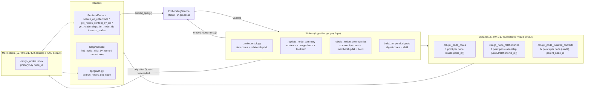

# Search Indexes: Qdrant & Meilisearch

**What this covers.** The two external index services every Knowledge Base owns beside its Kuzu graph: **Qdrant** (vector store; three collections per KB — node cores, relationship sentences, isolated contexts) and **Meilisearch** (keyword/BM25 index; one index per KB), plus the in-process `EmbeddingService` that produces every vector they hold. It documents client construction, per-KB naming, vector parameters, point-ID scheme, the exact payload/document schemas, every write/read/delete function and its callers, the embedding-dimension synchronisation and fail-closed rules, collection/index lifecycle on KB create/delete/reset, task-waiting semantics, key management, the legacy `TYPESENSE_*` aliases, what the contract unit tests pin, failure modes and gotchas. Retrieval *ranking* logic is out of scope (see [16](16-retrieval-and-chat.md)); only the store contracts retrieval relies on are described.

**Related docs:** [Graph storage (Kuzu)](14-graph-storage-kuzu.md) · [Ingestion pipeline](10-ingestion-pipeline.md) · [Retrieval and chat](16-retrieval-and-chat.md) · [Local models and inference](12-local-models-and-inference.md) · [Knowledge bases and vaults](08-knowledge-bases-and-vaults.md) · [Desktop shell](04-desktop-shell.md) · [Backend core and configuration](06-backend-core-and-configuration.md) · [Configuration reference](21-configuration-reference.md) · [Data directory layout](22-data-directory-layout.md) · [Testing](24-testing.md) · [Decisions and constraints](26-decisions-and-constraints.md)

---

## 1. Responsibilities & boundaries

**Qdrant owns** all node *content* and all vectors: entity/community/digest cores (name, type, description, merged-context vector), relationship natural-language sentences with vectors, and per-entity isolated-context chunks with vectors and note dates. It is also the **authoritative name → node_id resolver** used by ingestion and by `GraphService.resolve_node_id`.

**Meilisearch owns** a flattened, keyword-searchable copy of node content (name, type, contexts text, relationship NL) used for BM25 retrieval, editor entity autocomplete, text scanning, and as a content fallback for the 3D node card. It is **derived** — written only after Qdrant succeeded — and can be rebuilt from Qdrant + Kuzu.

**EmbeddingService owns** the query/document embedding calls (in-process GGUF via `llama-cpp-python`), including the Qwen3 instruction prefix rule.

**Not owned here:** graph structure (Kuzu, [14](14-graph-storage-kuzu.md)); the decision of what text to embed (ingestion, [10](10-ingestion-pipeline.md)); score fusion/reranking ([16](16-retrieval-and-chat.md)); model download/loading (`local_models.py`, [12](12-local-models-and-inference.md)) except the `sync_embedding_infrastructure` entry point that resizes collections; process supervision of the Qdrant/Meilisearch binaries ([04](04-desktop-shell.md)).

## 2. Files

| Path | Purpose | Key exports |
|---|---|---|
| `backend/app/services/qdrant_service.py` | `QdrantService`: client, collection bootstrap, dims guard, upserts, scrolls, searches, deletes | `QdrantService`, `qdrant_service` (default-KB singleton) |
| `backend/app/services/meilisearch_service.py` | `MeilisearchService`: client, index bootstrap/settings, add/update/delete/search | `MeilisearchService`, `meilisearch_service`, `_SEARCHABLE`, `_FILTERABLE` |
| `backend/app/services/embedding.py` | `EmbeddingService`: provider validation, Qwen3 query instruction, `embed_query`/`embed_documents` | `EmbeddingService`, `embedding_service` |
| `backend/app/services/local_models.py` | `LocalLlamaEmbeddings`, `sync_embedding_infrastructure`, `save_selection`, manifest `embedding_dims`, dimension probe after load | `sync_embedding_infrastructure`, `load_manifest`, `LocalLlamaEmbeddings` |
| `backend/app/services/kb_registry.py` | Per-KB collection/index names, `QdrantService`/`MeilisearchService` construction, deletion cleanup | `KBRegistry.create_kb`, `_build_context`, `_cleanup_stores` |
| `backend/app/core/config.py` | `QDRANT_*`, `MEILI_*`, `EMBEDDING_*`, `VECTOR_*` | `settings` |
| `backend/app/main.py` | Startup hook calling `sync_embedding_infrastructure()` | `startup_event` |
| `backend/app/api/admin.py`, `backend/app/api/kb.py` | `reset_all` callers (reset-ingestion-data; KB empty) | — |
| `backend/app/api/graph.py` | Meili consumers (`search_nodes`, `get_node`) | — |
| `backend/app/workflows/ingestion.py` | All Qdrant/Meili **writes** | `_write_ontology`, `_update_node_summary`, `rebuild_leiden_communities`, `build_temporal_digests` |
| `backend/app/services/retrieval.py` | Qdrant/Meili **reads** (`search_all_collections`, `get_nodes_content_by_ids`, `get_relationships_for_node_ids`, `search_nodes`) | — |
| `backend/app/desktop_runtime.py` | Downloads and spawns the binaries, chooses ports 17433/17470, generates/persists the Meili master key, sets env before the API imports `Settings` | `resolve_meili_master_key`, `boot_sidecars` |
| `backend/tests/unit/test_qdrant_contract.py` | Pins `upsert_node_core` payload shape and `search_node_cores` filter construction | — |
| `backend/tests/unit/test_meili_contract.py` | Pins that `index_node` documents always carry `node_id` (+`name`) and that errors are logged not raised | — |
| `backend/requirements.txt` | `qdrant-client==1.17.1`, `meilisearch==0.34.1` | — |

## 3. Architecture / flow



Per KB there is exactly one `QdrantService` and one `MeilisearchService` instance (built by `KBRegistry._build_context`; the default KB uses the module singletons `qdrant_service` / `meilisearch_service`). `GraphService`, `IngestionWorkflow` and `RetrievalService` receive those instances by injection and never construct their own.

Write ordering contract inside a note ingest: **Kuzu structural node → Qdrant core stub → (per entity) Qdrant contexts → Qdrant merged core → Meilisearch document**. Qdrant is the source of truth; Meili is written last and only on success ("Qdrant is SoT").

## 4. Qdrant

### 4.1 Client setup

`QdrantService.__init__(col_cores=None, col_relationships=None, col_contexts=None)`:

1. Collection names default to `settings.QDRANT_COLLECTION_NODE_CORES` (`"node_cores"`), `QDRANT_COLLECTION_NODE_RELATIONSHIPS` (`"node_relationships"`), `QDRANT_COLLECTION_NODE_ISOLATED_CONTEXTS` (`"node_isolated_contexts"`) — these un-prefixed names are the **default KB's** collections.
2. `self.client = QdrantClient(host=settings.QDRANT_HOST, port=settings.QDRANT_PORT, api_key=settings.QDRANT_API_KEY)`. No explicit timeout, `prefer_grpc`, or `https` is passed — the qdrant-client defaults apply (REST on `http://host:port`, default timeout). If construction raises, `_enabled=False`, `client=None`, a WARNING is logged and every method becomes a no-op returning `[]`/`{}`/`None`/`False`.
3. Dims pre-check: reads `load_manifest()["selection"]["embedding_dims"]` from `local_models` and, if present, overwrites `settings.EMBEDDING_DIMENSIONS` **before** creating collections (so a freshly started process with a 768-dim model does not create 1024-dim collections). Errors ignored.
4. `_ensure_collections()` (idempotent; see §7 for the mismatch rules).

`is_available()` performs a live `client.get_collections()` round-trip every call (no caching); every public method calls it first, so each store operation costs one extra HTTP request.

Desktop values are injected by `desktop_runtime.py`: `QDRANT_HOST=127.0.0.1`, `QDRANT_PORT=<PORTS.qdrant>` (default **17433**, overridable via `ORB_QDRANT_PORT`), and the binary is started with `QDRANT__STORAGE__STORAGE_PATH=DATA_DIR/qdrant`, `QDRANT__SERVICE__HTTP_PORT`. `QDRANT_API_KEY` is `None` by default ("Only needed for Qdrant Cloud").

### 4.2 Per-KB collection naming

| KB | cores | relationships | contexts | Decided in |
|---|---|---|---|---|
| default | `node_cores` | `node_relationships` | `node_isolated_contexts` | `settings.QDRANT_COLLECTION_*`; persisted into `knowledge_bases` row by `KBRegistry._ensure_default_row` |
| other | `<slug>_node_cores` | `<slug>_node_relationships` | `<slug>_node_isolated_contexts` | `KBRegistry.create_kb` (`f"{slug}_node_cores"` …); stored in SQLite columns `qdrant_col_cores`, `qdrant_col_rels`, `qdrant_col_contexts` |

The prefix is the sanitised KB slug (`[a-z0-9_-]` only). Names are read back from SQLite, so renaming a KB does **not** rename collections (slug is immutable).

`QdrantService.collections` property returns `[cores, rels, contexts]` — the ordered list `search_all_collections` fans out to. `col_contexts` is exposed as a property because `_update_node_summary` passes it explicitly to `append_node_item`.

### 4.3 Vector parameters

All three collections are created identically:

```python
client.create_collection(
    collection_name=name,
    vectors_config=VectorParams(size=int(settings.EMBEDDING_DIMENSIONS) or 1024,
                                distance=Distance.COSINE))
```

- **Single unnamed dense vector** per point; size = `EMBEDDING_DIMENSIONS` (default 1024 = Qwen3-Embedding-0.6B; 768/other after a model switch — see §7).
- **`Distance.COSINE`** → scores in `[-1, 1]`, practically `[0, 1]`; thresholds in §4.7 are cosine similarities.
- **No** HNSW overrides, **no** on-disk flag, **no** quantization, **no** sharding/replication, and **no payload indexes** are created. Every payload filter (`name`, `parent_node_id`, `type`, `community_level`, `period_key`, `note_created_at`, `is_community_rel`, `source_node_id`, `target_node_id`) runs as an unindexed full scan on the Qdrant side. This is acceptable at personal-KB scale but is the first thing to add if `find_node_ids_by_names` or the contexts date filters become slow.

### 4.4 Point-ID scheme

| Collection | Point id | Consequence |
|---|---|---|
| `*_node_cores` | `str(uuid.uuid5(uuid.NAMESPACE_OID, node_id))` | deterministic; one point per node; re-upsert overwrites; `retrieve(ids=[uuid5(node_id)])` is the O(1) content lookup |
| `*_node_relationships` | `str(uuid.uuid5(uuid.NAMESPACE_OID, relationship_id))` | deterministic per Kuzu `SEMANTIC_REL.relationship_id` or `community_rel_<cid>_<nid>` |
| `*_node_isolated_contexts` | `str(uuid.uuid4())` | random; a node's contexts are found only by the `parent_node_id` payload filter |

The `node_id` itself (`node_<uuid4>`, note id, `community_l…`, `digest_…`) is **not** a valid Qdrant id, hence the uuid5 derivation; anything that needs to address a core point must derive the id the same way (`get_node_content_by_id`, `get_nodes_content_by_ids`, `delete_node` do).

### 4.5 Payload schemas

**`<slug>_node_cores`** — one point per entity / note-less concept / community / temporal digest.

| Field | Type | Written by | Notes |
|---|---|---|---|
| `node_id` | str | all core writers | the Kuzu id; also the join key for Meili |
| `name` | str | all | lowercase for entities (ingestion normalises); display case for communities/digests |
| `type` | str | all | entity type (`person`, `thing`, …), `"community"`, `"temporal_digest"` |
| `description` | str | `_update_node_summary` (merged contexts text), `create_leiden_community` (summary), `create_temporal_digest_node` (summary) | omitted when empty; `_write_ontology` stubs have none |
| `community_level` | int | `create_leiden_community` only | present **only** on community points; never on entities |
| `period_key` | str | `create_temporal_digest_node` via `extra_payload` | e.g. `"2024-05"`, `"2024-W21"`, `"2024"`; filtered by retrieval month queries |
| *(vector)* | float[dims] | | stub: embed(`"{name} ({type}): {isolated_context}"`); entity core: embed(all contexts joined by `" "`); community/digest: embed(summary) |

Legacy fields the read paths still tolerate but nothing writes any more: `facts`, `potential_questions`, `community_id`, `themes`, `member_count`, `domain`, `status` (they surface as empty in `GraphService` payloads).

**`<slug>_node_relationships`** — one point per semantic edge or community membership.

| Field | Type | Written by | Notes |
|---|---|---|---|
| `natural_language` | str | `_write_ontology` (predicate/NL with `_`→space), `_commit_community` (`"{member} is a member of the '{name}' community."`) | the text that was embedded |
| `source_node_id` | str | both | entity id |
| `target_node_id` | str | both | entity id, or community id for membership |
| `is_community_rel` | bool | `_commit_community` only (`True`) | key for bulk delete on rebuild; absent (not `False`) on ordinary edges |
| *(vector)* | | | embed(natural_language) |

Note: `relationship_id` is **not** stored in the payload — only encoded in the point id.

**`<slug>_node_isolated_contexts`** — N points per entity.

| Field | Type | Written by | Notes |
|---|---|---|---|
| `parent_node_id` | str | `append_node_item`, `upsert_node_items` | entity id |
| `content` | str | both | verbatim isolated-context sentence from extraction |
| `note_created_at` | str | `append_node_item` when the note has `created_at` | the note's creation date/time string as passed by ingestion (`NoteInput.created_at`, ISO); retrieval matches it with exact `MatchValue`/`MatchAny` on `YYYY-MM-DD` strings, so the stored value must be a bare date for date filters to hit (see gotchas) |
| *(extra)* | any | `upsert_node_items` forwards any other item keys | currently unused by callers |
| *(vector)* | | | embed(content) |

### 4.6 Write / delete functions

| Function | Signature | Behaviour | Callers |
|---|---|---|---|
| `_prepare_vector` | `(vector) -> vector` | `len(vector) != int(EMBEDDING_DIMENSIONS)` → **raises `ValueError`** ("Embedding dim X != EMBEDDING_DIMENSIONS Y…"). Never recreates collections. Falsy vector passes through. | every upsert |
| `upsert_node_core` | `(node_id, name, node_type, description_vector, description="", community_level=None, extra_payload=None) -> bool` | builds payload (`description`/`community_level` only when truthy/not-None; `extra_payload` merged last, can override), upserts one `PointStruct(id=uuid5(node_id))`; returns `False` on client error (warn) or when unavailable. **`_prepare_vector` `ValueError` propagates** (it is called before the try). | `_update_node_summary` (merged vector), `GraphService.create_leiden_community`, `GraphService.create_temporal_digest_node` |
| `upsert_node_cores` | `(cores: list[dict]) -> bool` | batch variant, one `client.upsert`; same field names per dict; empty list → `True`; unavailable → `False` | `_write_ontology` stub seeding (fail → ingest aborted) |
| `upsert_node_relationship` | `(relationship_id, natural_language, nl_vector, source_node_id, target_node_id, is_community_rel=False) -> None` | single point; errors warn-only | none currently (batch used) |
| `upsert_node_relationships` | `(rels: list[dict]) -> None` | batch; errors warn-only (**no return value → callers cannot detect failure**) | `_write_ontology`, `_commit_community` |
| `append_node_item` | `(collection_name, node_id, content, vector, note_created_at=None) -> bool` | one uuid4 point `{parent_node_id, content[, note_created_at]}`; never touches existing points | `_update_node_summary` per new context; `False` count → `RuntimeError` in caller |
| `upsert_node_items` | `(collection_name, node_id, items) -> None` | delete-by-filter `parent_node_id==node_id` then insert all items (`content`, `vector`, extra keys) — full replace | none currently |
| `delete_node` | `(node_id) -> None` | deletes core point `uuid5(node_id)` and all `*_node_isolated_contexts` with `parent_node_id==node_id`. **Does not touch `*_node_relationships`.** | `api/notes.py` (note + orphans), `rebuild_leiden_communities` (old communities), `build_temporal_digests` (old digests) |
| `delete_community_relationships` | `() -> None` | delete-by-filter `is_community_rel == True` in rels | `GraphService.clear_all_communities` |
| `reset_all` | `() -> None` | `delete_collection` ×3 (warn on failure) then `_ensure_collections()` | admin reset-ingestion-data, KB empty |
| `ensure_vector_size` | `(vector_len) -> None` | adopts `vector_len` into `settings.EMBEDDING_DIMENSIONS` (warn if changed) and re-runs `_ensure_collections()` — always, even if settings already matched | `sync_embedding_infrastructure` only |
| `strip_facts_prefixes` | `() -> int` | one-time scrub: pages `*_node_cores` (500/page, payload `description` only) and `set_payload`s every description starting `FACTS:` to the text after its first `". "` (empty if none). Raises when Qdrant is unreachable so the caller does not mark the migration done. | `main._migrate_stores` only (doc 22) |

### 4.7 Read / search functions

| Function | Signature | Behaviour | Callers |
|---|---|---|---|
| `search_all_collections` | `(query_vector, limit, min_score, contexts_filter: Filter|None=None, period_key_filter: str|None=None, day_only=False) -> list[{collection, score, payload}]` | `query_points(collection, query=vector, limit, score_threshold=min_score, query_filter, with_payload=True)` per collection, run sequentially (a `ponytail:` comment marks the thread-pool upgrade path), results flattened in `collections` order. Filters: `contexts_filter` applies to the contexts collection only; `period_key_filter` becomes `Filter(must=[period_key == value])` on **cores** only; `day_only=True` restricts targets to the contexts collection. Per-collection errors → DEBUG + `[]`. | `RetrievalService` vector phase |
| `search_node_cores` | `(query_vector, limit, min_score, node_type=None, community_level=None) -> list[{score, payload}]` | cores only; optional `must` filters on `type` and `community_level` (both → two conditions) | none in current retrieval (kept; pinned by contract tests) |
| `find_node_id_by_name` | `(name) -> str|None` | `scroll(cores, filter name == name.lower().strip(), limit=1, with_vectors=False)` → payload `node_id` | `GraphService.resolve_node_id`, `_update_node_summary` |
| `find_node_ids_by_names` | `(names) -> dict[str, str|None]` | one `MatchAny(any=normalized)` scroll paged by 500; first hit per name wins; stops early when all resolved | `_write_ontology` (nodes and relationship endpoints), `GraphService.get_linked_evidence` |
| `get_node_content_by_id` | `(node_id) -> dict|None` | `retrieve(cores, [uuid5])` + paged scroll of contexts (`limit=100`) → `{node_id, name, type, description, community_level, isolated_contexts: [ "content - date" or "content" ]}`. If no core but contexts exist → returns a dict with empty name/type/description. Neither → `None`. | `_update_node_summary`, `GraphService.get_node_storage_payload`, `get_node_detail` fallback |
| `get_nodes_content_by_ids` | `(node_ids) -> dict[str, dict]` | one `retrieve` for all cores + one `MatchAny` scroll of contexts paged by 500; omits ids with neither core nor contexts | retrieval (many places), `GraphService.get_node_detail`, `rebuild_leiden_communities` |
| `list_all_community_payloads` | `() -> list[{community_id, community_level, name, description}]` | scroll cores with `type == "community"` | none currently |
| `get_relationships_for_node_ids` | `(node_ids) -> list[{natural_language, source_node_id, target_node_id}]` | two scrolls (`source_node_id` in ids, `target_node_id` in ids), paged 500, **deduplicated by `natural_language` text** (two different edges with identical sentences collapse) | retrieval, `_update_node_summary` (Meili NL), `rebuild_leiden_communities` (Meili refresh), `GraphService.get_node_storage_payload` |
| `scroll_all_isolated_contexts_with_dates` | `() -> list[payload]` | full unfiltered scroll of contexts (500/page) keeping payloads with `note_created_at` | `build_temporal_digests` |

**Score semantics and thresholds.** Scores are raw cosine similarities from Qdrant. Retrieval passes `limit=500` per collection ("a large ceiling … the score_threshold is the only real filter") and `min_score` = `settings.VECTOR_PRE_RERANK_THRESHOLD` (**0.45**) when `RERANKER_ENABLED`, else `settings.VECTOR_SIMILARITY_THRESHOLD` (**0.50**). Every collection is queried with the same vector and threshold, so a context sentence, a relationship sentence and a merged-core passage compete on equal footing; retrieval then maps each hit to a node via `node_id` / `parent_node_id` / `source_node_id` / `target_node_id` and de-duplicates. `isolated_contexts` strings returned by the content getters have the note date appended as `" - <date>"` when present — consumers that display or re-embed them see that suffix.

## 5. Meilisearch

### 5.1 Client setup

`MeilisearchService.__init__(index_name=None)`:

1. `self.index_name = index_name or settings.MEILI_INDEX_NAME` — the **index uid** (the Typesense-era `collection` name for this attribute is gone; `_ensure_collection` keeps its old method name).
2. `self.client = meilisearch.Client(f"http://{MEILI_HOST}:{MEILI_PORT}", MEILI_MASTER_KEY)` (`meilisearch==0.34.1`). No timeout override.
3. `_ensure_collection()` immediately. Any exception in 2–3 (including a refused connection) → `_enabled=False`, `client=None`, WARNING; all methods become no-ops.

`is_available()` calls `client.health()` on every invocation (one HTTP round-trip per store operation, like Qdrant).

### 5.2 Per-KB index naming

| KB | Index uid | Decided in |
|---|---|---|
| default | `orb_nodes` (`settings.MEILI_INDEX_NAME`) | `_ensure_default_row` stores `settings.MEILI_INDEX_NAME` into the SQLite column **`typesense_collection`** |
| other | `<slug>_nodes` | `KBRegistry.create_kb` (`f"{slug}_nodes"`), same column |

The SQLite column name `typesense_collection` is historical and now holds the Meilisearch index uid.

### 5.3 Index settings (`_ensure_collection`)

```python
client.get_index(uid)                      # MeilisearchApiError → create
client.create_index(uid, {"primaryKey": "node_id"}); wait_for_task(…, timeout_in_ms=10000)
index.update_settings({
    "searchableAttributes": ["name", "type", "isolated_contexts", "relationship_natural_language"],   # _SEARCHABLE (order = attribute ranking priority)
    "filterableAttributes": ["type", "community_level"],                                             # _FILTERABLE
    "displayedAttributes": ["*"],
}); wait_for_task(…, 10000)
```

- `searchableAttributes` order matters in Meilisearch: `name` > `type` > `isolated_contexts` > `relationship_natural_language` for the `attribute` ranking rule.
- **Not configured** (Meilisearch defaults apply): ranking rules (`words, typo, proximity, attribute, sort, exactness`), typo tolerance (on; 1 typo ≥5 chars, 2 typos ≥9 chars), stop words (none), synonyms (none), `sortableAttributes` (none — no sort is used), pagination limits (`maxTotalHits` 1000), faceting.
- Settings are re-applied on every service construction (idempotent). Failures to apply settings are logged at DEBUG only, so a stale attribute list is silent.
- Nothing in the code uses the filterable attributes today; `search_nodes` sends no `filter`. `type` filtering for autocomplete is done client-side in `api/graph.py`.

### 5.4 Document schema

Primary key `node_id`. Fields, all top-level strings/ints:

| Field | Written by | Content |
|---|---|---|
| `node_id` | all | Kuzu/Qdrant node id |
| `name` | all | entity name (lowercase), community/digest display name |
| `type` | all | entity type / `"community"` / `"temporal_digest"` |
| `isolated_contexts` | `_update_node_summary` / `_reindex_node` (the node's context list), `build_temporal_digests` (`[summary]`) | **a JSON array of strings** (`index_node(..., isolated_contexts: list[str])` stores `list(isolated_contexts)`). `api/graph.py._apply_meili_content` reads it as a list and wraps a pre-array string document in a one-element list. |
| `relationship_natural_language` | `_update_node_summary` (all NL sentences for the node joined by `" "`), `update_nodes_community` (refreshed after community rebuild, includes membership sentences) | one string |
| `community_level` | `_commit_community` for community docs only | int |

`index_node` omits `isolated_contexts` / `relationship_natural_language` / `community_level` when falsy/None; because `add_documents` on an existing primary key **replaces** the document (not merge), an `index_node` call without contexts wipes previously stored contexts. `_update_node_summary` guards against this by re-reading the existing document (`get_node`) when it has no contexts to write; `update_nodes_community` likewise reads-then-writes the full doc.

### 5.5 Functions

| Function | Signature | Behaviour | Task wait | Callers |
|---|---|---|---|---|
| `get_node` | `(node_id) -> dict|None` | `index.get_document(node_id)`; normalises the SDK `Document` object to a dict (`vars(doc)` minus private attrs, then `dict(doc)`, then attribute pick of the six known fields); any error → `None` | — | `_update_node_summary`, `update_nodes_community`, `api/graph.py` content fallback |
| `search_nodes` | `(query, limit=20) -> list[{score, payload}]` | `index.search(query, {"limit": limit})`; **no filter, no highlighting, no attributesToRetrieve**; `score = float(total - idx)` — a synthetic rank-based score (top hit = N, last = 1), **not** Meilisearch's `_rankingScore` | — | retrieval `_search_meili_by_keyword(query, 100)` fanned out over the query plus extracted keywords; `api/graph.py` autocomplete (`limit*2`), scan-text (`2` per candidate) |
| `index_node` | `(node_id, name, node_type, isolated_contexts: list[str] | None = None, relationship_natural_language="", community_level=None) -> None` | `add_documents([doc], primary_key="node_id")` | `wait_for_task(task_uid, timeout_in_ms=5000)` | `_update_node_summary`, `_commit_community`, `build_temporal_digests` |
| `update_nodes_community` | `(rows: list[{node_id, relationship_natural_language?, name?}]) -> None` | for each row `get_node` (or `{node_id}`), overlay non-empty fields, one `add_documents(docs)` | `wait_for_task(…, 30000)` | `rebuild_leiden_communities` end-of-run refresh |
| `delete_node` | `(node_id) -> None` | `index.delete_document(node_id)`; 404/"not found" silently ignored | `wait_for_task(…, 5000)` | `api/notes.py`, community/digest rebuilds |
| `reset_all` | `() -> None` | `delete_index(uid)` (+wait 10 s) then `_ensure_collection()` | 10000 | admin reset, KB empty |
| `is_available` | `() -> bool` | `client.health()` | | all |

**Task-waiting semantics.** Meilisearch writes are asynchronous tasks; every write here blocks on `client.wait_for_task(task_uid, timeout_in_ms=…)` so that subsequent reads (e.g. `get_node` inside `update_nodes_community`, or the immediate `search_nodes` from the editor) see the write. The SDK raises `MeilisearchTimeoutError` when the timeout elapses; all writers catch broad `Exception` and log (WARNING for `index_node`/`delete_node`, **DEBUG** for `update_nodes_community`), so a timed-out write is not surfaced to the caller even though the task will usually still complete server-side. Timeouts: 5 s single doc, 30 s batch community refresh, 10 s index create/delete/settings. `KBRegistry._cleanup_stores` uses 10 s for `delete_index`.

### 5.6 Master key

- Backend setting `MEILI_MASTER_KEY` (default `"orb-dev-key"`, also `.env.example`).
- Desktop (`desktop_runtime.py: resolve_meili_master_key(data_dir)`): precedence env `MEILI_MASTER_KEY` → `DATA_DIR/meili_master_key` file → generate. Generation rule: if `DATA_DIR/meilisearch/` does not exist or is empty (fresh install) → `secrets.token_urlsafe(32)`; otherwise (existing Meili data) → `"orb-dev-key"` for compatibility with data written before keys were randomised. The chosen key is persisted to `DATA_DIR/meili_master_key` (mode `0600`) and passed both as `--master-key` to the `meilisearch` binary (`--db-path DATA_DIR/meilisearch --http-addr 127.0.0.1:<port>`) and as env `MEILI_MASTER_KEY` (+ `MEILI_HOST`, `MEILI_PORT`) to uvicorn.
- Ports: `PORTS.meilisearch` = `ORB_MEILI_PORT` / **17470**. Health check `GET /health`.
- Consequence: a developer running the backend by hand against a desktop-started Meilisearch must read the key from `DATA_DIR/meili_master_key`; `orb-dev-key` only works for a hand-started Meilisearch or pre-randomisation installs.

### 5.7 Legacy `TYPESENSE_*` names

The `TYPESENSE_*` settings and the `_apply_typesense_aliases` validator have been removed; only the `typesense_collection` column and the unit-test fixture alias `mock_typesense_service` (= `mock_meili_service`) remain.

## 6. EmbeddingService (`backend/app/services/embedding.py`)

```python
class EmbeddingService:
    embedding_provider: str = "local"           # always
    embedding_model: str = settings.EMBEDDING_MODEL
    query_instruction = "Instruct: Given a question, retrieve relevant context.\nQuery: "
    is_qwen3: bool                              # "qwen3" in basename(EMBEDDING_MODEL).lower()
    embeddings: LocalLlamaEmbeddings            # over local_llama_runtime
    def reconfigure() -> None
    def embed_query(text, custom_instruction=None) -> list[float]
    def embed_documents(texts) -> list[list[float]]
embedding_service = EmbeddingService()          # module singleton
```

- **Provider validation at construction:** `EMBEDDING_PROVIDER` `"ollama"`/`"lm_studio"` → WARNING "deprecated; using in-process local" and coerced to local; anything other than `local`/`auto`/`""` → `ValueError("Unsupported EMBEDDING_PROVIDER… Orb uses in-process GGUF embeddings only")` at import time (the backend will not start). `.env.example` still shows `EMBEDDING_PROVIDER=openai` as an option in a comment block — that value is rejected by this code.
- **Instruction handling:** `embed_query` prefixes the text with `custom_instruction or query_instruction` **only when `is_qwen3`**; `embed_documents` never adds a prefix. This asymmetry is deliberate for Qwen3-Embedding ("query gets 'Instruct: …\nQuery: ' prefix, documents do not"). retrieval calls `embed_query(enriched_query)` without `custom_instruction`.
- **No caching** of vectors in this class. (Retrieval caches *query analysis*, not embeddings; ingestion de-duplicates texts before embedding.) Batching is the caller's job: `embed_documents` maps to `LocalLlamaRuntime.embed_batch`.
- `reconfigure()` re-binds after a model download/selection (`is_qwen3` recomputed).
- `LocalLlamaEmbeddings` (`local_models.py`) is a thin LangChain-style shim: `embed_query → runtime.embed(text)`, `embed_documents → runtime.embed_batch(texts)`; the runtime enforces "one heavy GGUF resident at a time" ([12](12-local-models-and-inference.md)).

## 7. Embedding-dimension synchronisation & the fail-closed rule

### 7.1 Where the "true" dimension comes from

Priority inside `sync_embedding_infrastructure(dims=None, embed_id=None)` (`local_models.py`):
1. explicit `dims` argument;
2. `models manifest → selection.embedding_dims`;
3. `model_catalog.get_option(selection.embed_id).embedding_dims`;
4. `settings.EMBEDDING_DIMENSIONS` (env, default 1024).

It then sets `settings.EMBEDDING_DIMENSIONS = dims`, `settings.EMBEDDING_MODEL = embed_id` (if given), syncs the reranker id, and calls `ensure_vector_size(dims)` on the default `qdrant_service` **and** on a fresh `QdrantService(...)` for every non-default KB in `kb_registry.list_kbs()` ("touch Qdrant only, never open Kuzu"). Returns `{"embedding_dims", "embed_id", "synced_kbs", "errors"}`.

Callers: `main.startup_event` (after `runtime_config` overrides), `save_selection` (model selection UI), `ensure_chat_and_embed_models` (first-run download), and `LocalLlamaRuntime.load_*` after a **dimension probe** — the runtime embeds `"dimension probe"` with the freshly loaded embed GGUF, calls `sync_embedding_infrastructure(dims=len(sample))` and writes `embedding_dims` back into the manifest. `QdrantService.__init__` additionally pre-reads `selection.embedding_dims` so collections created during import already use the right size.

### 7.2 `_ensure_collections()` decision table

For the three names of this instance, with `want = EMBEDDING_DIMENSIONS`:

| Existing collection state | Action |
|---|---|
| missing | `create_collection(size=want, COSINE)` |
| present, `size == want` | nothing |
| present, `size != want`, **`points_count == 0`** | `delete_collection` then recreate at `want` — **but only if no sibling of this KB is non-empty at the wrong size** |
| present, `size != want`, **`points_count > 0`** | ERROR log `"…refusing to wipe or recreate siblings. Rebuild via admin reset or clear indexes before changing embed model."` and **return** — no collection of this KB is created, deleted or resized |

Rationale in code: avoid "split-brain cores@1024 + contexts@768". Recreation is therefore allowed **only when every mismatched collection in the KB is empty**; a single non-empty mismatched collection freezes the whole set until the user runs `reset-ingestion-data` / KB empty (which `delete_collection`s and recreates at the current dims) or reverts the model.

### 7.3 Fail-closed at write time

`_prepare_vector` raises `ValueError` on any dims mismatch and is called by every upsert **before** the try/except, so:
- `upsert_node_core` / `upsert_node_cores` / `append_node_item` / `upsert_node_items` / `upsert_node_relationship(s)` **raise** out to the caller (they do not return `False`).
- In `_write_ontology` the stub upsert raising aborts the note (note marked failed); in `_update_node_summary` the context append raising aborts the note; inside `GraphService.create_leiden_community` / `create_temporal_digest_node` it is caught and logged (community/digest created without a vector).
- Comment contract: "never call ensure_vector_size mid-ingest (split-brain risk)". Collection resizing belongs to startup / model-change only. Commit f8f527f introduced this fail-closed behaviour.

### 7.4 What happens on a model switch

`save_selection` logs `"Embed model changed A → B (dims X → Y). Qdrant collections were resized; re-ingest notes so vectors match."` — but per §7.2 they are only resized if empty. With existing data the log line is optimistic: collections stay at the old size, the ERROR from `_ensure_collections` fires on every service construction, and every ingest fails with the `ValueError` until the user resets the KB's ingestion data. Vectors from different models are never mixed.

## 8. Lifecycle: KB create / delete / empty / reset

| Event | Qdrant | Meilisearch | Code |
|---|---|---|---|
| **Backend import** | default `QdrantService()` constructed → `_ensure_collections` for `node_cores`/`node_relationships`/`node_isolated_contexts` | default `MeilisearchService()` → `orb_nodes` index + settings | module singletons |
| **Startup** | `sync_embedding_infrastructure()` → `ensure_vector_size` on default + every registered KB (constructs a temporary `QdrantService` per KB, which itself runs `_ensure_collections`) | untouched | `main.startup_event` |
| **KB create** | `KBRegistry.create_kb` → `_build_context` → `QdrantService(col_cores=…, col_relationships=…, col_contexts=…)` → collections created immediately | `MeilisearchService(index_name=f"{slug}_nodes")` → index + settings created immediately | `kb_registry.py` |
| **KB load at startup** | `_load` → `_build_context` per row (collections re-ensured) | same | `kb_registry.py` |
| **KB delete** | `_cleanup_stores`: temporary `QdrantService` (which first *re-creates* any missing collection via `_ensure_collections`, then) `client.delete_collection` ×3, errors ignored | `client.delete_index(uid)` + `wait_for_task(…, 10000)` | `KBRegistry.delete_kb(wipe_indexes=True)` |
| **KB empty** (`api/kb.py`) | `kb.qdrant.reset_all()` in `asyncio.to_thread` (delete ×3 + recreate) | `kb.meili.reset_all()` | after Firefly destroy, SQL note purge, `graph.wipe_all_nodes`; before vault clear |
| **Admin reset-ingestion-data** | `kb.qdrant.reset_all()` (background) | `kb.meili.reset_all()` (background) | `api/admin.py` |
| **Note delete** | `delete_node(note_id)` and `delete_node(orphan_id)` (cores + contexts; relationship points left behind) | `delete_node` per id | `api/notes.py` |
| **Community rebuild** | `delete_community_relationships()`; `delete_node(old_cid)`; new cores + rels | `delete_node(old_cid)`; `index_node` per community; `update_nodes_community` batch | `rebuild_leiden_communities` |
| **Digest rebuild** | `delete_node(old_did)`; `upsert_node_core` | `delete_node`; `index_node` | `build_temporal_digests` |
| **Model change** | §7 | untouched | `save_selection` |

Neither store has a notion of KB besides the name prefix; nothing prevents two KBs with the same slug from sharing collections, but slugs are unique in SQLite (`slug TEXT NOT NULL UNIQUE`).

## 9. Configuration & env vars

| Key | Default | Effect |
|---|---|---|
| `QDRANT_HOST` / `QDRANT_PORT` | `127.0.0.1` / `6333` | client endpoint; desktop injects port **17433** (`ORB_QDRANT_PORT`) |
| `QDRANT_API_KEY` | `None` | passed to `QdrantClient`; only for Qdrant Cloud |
| `QDRANT_COLLECTION_NODE_CORES` / `_NODE_RELATIONSHIPS` / `_NODE_ISOLATED_CONTEXTS` | `node_cores` / `node_relationships` / `node_isolated_contexts` | default-KB collection names (persisted into the registry row on first run; changing env later does not rename) |
| `EMBEDDING_DIMENSIONS` | `1024` | vector size for new collections and the `_prepare_vector` guard; **overwritten at runtime** by the models manifest / probe / `sync_embedding_infrastructure` |
| `EMBEDDING_PROVIDER` | `local` | must be `local`/`auto`/empty (or deprecated `ollama`/`lm_studio`); anything else aborts startup |
| `EMBEDDING_MODEL` | `local-embed` | display/`is_qwen3` detection (`"qwen3"` substring → instruction prefix); set to the catalog id by `sync_embedding_infrastructure` |
| `VECTOR_SIMILARITY_THRESHOLD` | `0.50` | `min_score` when the reranker is off |
| `VECTOR_PRE_RERANK_THRESHOLD` | `0.45` | `min_score` when `RERANKER_ENABLED` |
| `MEILI_HOST` / `MEILI_PORT` | `127.0.0.1` / `7700` | client URL; desktop injects port **17470** (`ORB_MEILI_PORT`) |
| `MEILI_MASTER_KEY` | `orb-dev-key` | API key; desktop supplies the persisted/random key |
| `MEILI_INDEX_NAME` | `orb_nodes` | default-KB index uid |
| `RERANKER_ENABLED` | see [16](16-retrieval-and-chat.md) | selects which vector threshold applies |

**Upsert batching.** `_upsert_batched(collection, points)` chunks every multi-point upsert at `_UPSERT_BATCH_SIZE` (default 128, `ORB_QDRANT_UPSERT_BATCH`). A point carrying a 2560-dim vector is roughly 27 KB as REST JSON, so a few hundred exceed Qdrant's request-size limit and the **entire** call is rejected with `400 (Bad Request)` — losing every point in it, not just the overflow. A note yielding 713 new entities failed exactly that way, and because the stubs are what keep Kuzu and Qdrant IDs aligned, the next pass logged `missing in Qdrant node_cores but present in Kuzu` for each one. `upsert_node_cores`, `upsert_node_relationships` and `upsert_node_items` all route through it; failures name the batch and how many points were written before it (`batch 3 of 6 (128 of 713 points)`), and `_last_upsert_error` carries the reason up so `ingestion` can report what Qdrant actually said instead of guessing at causes.

None of these are in `runtime_config.MUTABLE_KEYS` (`provider, model, ingestion_model, base_url`), so they cannot be changed through `runtime_config.json`; only env/`.env`/desktop-injected env and the models manifest (for dims) apply.

## 10. Interfaces with other subsystems

| Direction | Contract |
|---|---|
| `KBRegistry` → both services | constructs per-KB instances with names from SQLite; `delete_kb` → `_cleanup_stores` |
| `IngestionWorkflow` → Qdrant | `find_node_ids_by_names` (id resolution), `upsert_node_cores` (stubs; `False` ⇒ abort), `upsert_node_relationships`, `find_node_id_by_name`, `get_node_content_by_id`, `append_node_item` (`False` ⇒ abort), `upsert_node_core` (merged; `False` ⇒ abort), `get_relationships_for_node_ids`, `get_nodes_content_by_ids`, `delete_node`, `scroll_all_isolated_contexts_with_dates` |
| `IngestionWorkflow` → Meili | `index_node`, `get_node`, `update_nodes_community`, `delete_node` — always after the Qdrant step succeeded |
| `GraphService` → Qdrant | `find_node_id_by_name`, `find_node_ids_by_names`, `get_node_content_by_id`, `get_nodes_content_by_ids`, `get_relationships_for_node_ids`, `upsert_node_core`, `delete_community_relationships` ([14 §15](14-graph-storage-kuzu.md)) |
| `RetrievalService` → Qdrant | `search_all_collections(query_vector, limit=500, min_score, contexts_filter, period_key_filter, day_only)`, `get_nodes_content_by_ids`, `get_relationships_for_node_ids`; builds `Filter(note_created_at == "YYYY-MM-DD")` for day queries and `MatchAny(all days of month)` + `period_key_filter="YYYY-MM"` for month queries |
| `RetrievalService` → Meili | `search_nodes(term, 100)` for the query and each extracted keyword, concurrently; consumes `payload.name/node_id/type` and the rank score |
| `RetrievalService` → Embedding | `embed_query(enriched_query)` once per retrieval |
| `api/graph.py` → Meili | `search_nodes` (autocomplete, scan-text), `get_node` (content fallback) |
| `api/admin.py`, `api/kb.py` → both | `reset_all` |
| `local_models` → Qdrant | `ensure_vector_size` on all KBs via `sync_embedding_infrastructure` |
| `desktop_runtime.py` → binaries/backend | injects `QDRANT_*`, `MEILI_*` env, starts the API, then spawns `qdrant` and `meilisearch` from `DATA_DIR/bin` in the background; both services reconnect on use (`_connect` retried every 5 s) once the binaries answer ([04](04-desktop-shell.md)) |

## 11. What the contract unit tests pin

`backend/tests/unit/test_qdrant_contract.py` (uses `QdrantService.__new__` + `MagicMock` client, no I/O):
- `upsert_node_core` payload always has `node_id`, `name`, `type`; `description` present iff truthy; `community_level` present iff not `None`; `extra_payload` keys merged in; disabled service (`_enabled=False`) or `client=None` → no `upsert` call and no exception. (Vectors of length 768 are used — the test bypasses `__init__` so `EMBEDDING_DIMENSIONS` is whatever `settings` holds; `_prepare_vector` would raise if it were 1024. In practice the tests pass because `_prepare_vector` compares against `settings.EMBEDDING_DIMENSIONS`, which the test environment leaves at 1024 — meaning **these tests currently depend on `_prepare_vector` not being reached**; if they fail with `ValueError: Embedding dim 768 != EMBEDDING_DIMENSIONS 1024`, the guard is doing its job and the fixture needs `settings.EMBEDDING_DIMENSIONS=768`.)
- `search_node_cores`: `query_filter` is `None` with no filters; a single `FieldCondition(key="type")` or `key="community_level"`; both combined in `must`; disabled → `[]` and no `query_points` call.

`backend/tests/unit/test_meili_contract.py`:
- Errors from `add_documents` are logged (`logger.debug`) and **not raised**.
- `index_node` documents carry `node_id` and `name`.

`backend/tests/unit/conftest.py` fixtures `mock_qdrant_service` (`find_node_id_by_name→None`, `upsert_node` AsyncMock, `search_node_cores→[]`) and `mock_meili_service` / alias `mock_typesense_service` (`is_available→True`, `index_node`, `delete_node`). Note `upsert_node` does not exist on the real service — the fixture is stale.

## 12. Invariants & locked decisions

1. **Qdrant is the source of truth for content and for name→id.** Meilisearch is derived and written last. Kuzu never holds content. Never resolve ids from Meili.
2. **Point ids are `uuid5(NAMESPACE_OID, node_id | relationship_id)`** for cores/relationships. Any new code addressing those points must derive ids identically; contexts are addressed only via `parent_node_id`.
3. **All three collections share one dimension and one distance (COSINE).** Never create a collection with a different size for the same KB.
4. **Fail closed on dims.** `_prepare_vector` raises; upserts never resize; `ensure_vector_size`/`_ensure_collections` may only recreate **empty** mismatched collections and only when no sibling is non-empty at the wrong size.
5. **Ingestion aborts a note when a Qdrant core stub, context append, or merged core write fails** (`RuntimeError`), to prevent Kuzu/Qdrant id split-brain. Do not downgrade these to warnings.
6. **Entity payload `name` is lowercase**; `find_node_id(s)_by_name` lower-cases the query. Storing a mixed-case entity name breaks resolution.
7. **Community membership is expressed as `is_community_rel=True` relationship points**, never as fields on entity cores; rebuilds rely on the bulk delete-by-flag.
8. **Meilisearch documents are whole-document replaces**; always read-modify-write when updating a subset of fields (as `update_nodes_community` does).
9. **Every Meili write waits for its task** so the next read is consistent; keep the `wait_for_task` calls.
10. **Only the local GGUF embedding provider exists.** `EMBEDDING_PROVIDER` other than local/auto is a startup error by design.
11. **Documents are embedded without instruction; queries with (Qwen3 only).** Keep the asymmetry; do not prefix documents.
12. **Store work runs off the event loop** (`asyncio.to_thread`) — both clients are synchronous.
13. Pins: `qdrant-client==1.17.1`, `meilisearch==0.34.1` (`query_points`, `FilterSelector`, `wait_for_task(timeout_in_ms=…)` APIs are version-specific).

## 13. Failure modes & error handling

| Situation | Behaviour |
|---|---|
| Qdrant/Meili unreachable at import | client construction usually succeeds (lazy connection); `_ensure_collections`/`_ensure_collection` log a WARNING; `is_available()` returns `False` per call → all reads return empty, all writes return `False`/`None`. Ingestion then aborts notes (`upsert_node_cores` False → `RuntimeError`); retrieval degrades to entity/graph-only. |
| Qdrant client constructor raises | `_enabled=False`, service permanently disabled for the process. |
| Dims mismatch (non-empty collections) | ERROR at every service construction; every ingest raises `ValueError` from `_prepare_vector`; retrieval still works with old vectors of the old model (the query vector from the new model has the wrong length → `query_points` fails per collection → DEBUG log → `[]`). |
| `upsert_node_relationships` failure | WARNING only; Kuzu edge exists without NL point → relationship invisible to vector search and to Meili `relationship_natural_language`. |
| `append_node_item` partial failure | `_update_node_summary` raises `RuntimeError` (`ctx_appended(x/y)`); contexts already appended remain (no rollback) → duplicates are avoided on retry by the `existing_contexts` dedup. |
| Meili task timeout | caught; WARNING/DEBUG; task usually completes later; readers may briefly see stale docs. |
| Meili `add_documents` without contexts | replaces document → contexts lost; mitigated by read-before-write in the two writers. |
| `get_node` on missing document | `None`; `update_nodes_community` then creates a minimal doc (`{node_id, name?, relationship_natural_language?}`) without `type` — such docs are invisible to type-based client filters until `_update_node_summary` rewrites them. |
| `delete_node` on missing point | Qdrant delete of a non-existent id is a no-op; Meili 404 swallowed. |
| `search_all_collections` per-collection exception | DEBUG + `[]` for that collection only. |
| `find_node_ids_by_names` exception | DEBUG; returns the map with `None`s → ingestion falls back to Kuzu lookup then mints ids (safe because the stub upsert will also fail if Qdrant is down). |
| KB delete with Qdrant down | collections left behind (warn); `_cleanup_stores` continues to Meili and Kuzu. |
| Startup `sync_embedding_infrastructure` exception | caught in `main.startup_event` (WARNING "Embedding infrastructure sync skipped"). |

## 14. Gotchas & non-obvious behaviours

1. **`is_available()` is a network call on every method** (`get_collections()` / `health()`); a loop calling `get_node` per row doubles HTTP traffic. Batch APIs exist for this reason.
2. **No payload indexes** — all filters are full scans; `find_node_ids_by_names` pages the whole cores collection in the worst case.
3. **`search_nodes` scores are synthetic ranks** (`N..1`), not BM25 or `_rankingScore`; comparing them with Qdrant cosine scores is meaningless — retrieval treats them as separate candidate sources.
4. **`get_relationships_for_node_ids` dedups by sentence text**, so two distinct edges with the same NL collapse; `relationship_id` is not in the payload so they cannot be told apart.
5. **`isolated_contexts` returned from Qdrant carry `" - <note_created_at>"` appended**; the same field in Meili is the array of context strings, which is what `api/graph.py` reads back.
6. **`note_created_at` is stored as whatever ISO string ingestion passed** (`NoteInput.created_at`, typically full `datetime.isoformat()`), while retrieval filters with `MatchValue("YYYY-MM-DD")` / `MatchAny([...days])` — exact string equality. Date filters only hit when the stored value is a bare date; check what `_update_node_summary` receives before relying on temporal filtering ([10](10-ingestion-pipeline.md)).
7. **`delete_node` never deletes relationship points**; deleted entities leave dangling `source_node_id`/`target_node_id` in `*_node_relationships` that still match vector searches.
8. **`_cleanup_stores` constructs a `QdrantService` (recreating missing collections) right before deleting them** — harmless but confusing in logs ("Created collection … / Deleted collection …").
9. **Default-KB names are un-prefixed** (`node_cores`, `orb_nodes`), other KBs are `<slug>_…`; a KB literally named `node` would produce `node_node_cores`, fine, but a Qdrant instance shared with another app could collide on the default names.
10. **`EMBEDDING_DIMENSIONS` in `.env` is advisory** — overwritten by the manifest at `QdrantService` construction and by `sync_embedding_infrastructure`.
11. **`save_selection`'s "collections were resized" log is optimistic** — with data present nothing is resized (§7.4).
12. **`upsert_node_relationships` returns `None`** so `_write_ontology` cannot tell that NL points were not written; only Qdrant *core* and *context* writes are fail-closed.
13. **`extra_payload` is merged last** and can overwrite `node_id`/`name`/`type` in a core payload.
14. **Meili `type` filterability is configured but unused**; `community_level` is filterable and unused; there are no sortable attributes.
15. **Community docs in Meili have no `isolated_contexts`/`relationship_natural_language`** — only `name`, `type`, `community_level` — so BM25 can only match communities by name.
16. **`search_all_collections` with `day_only=True` skips cores and rels entirely**, so entity descriptions never match day-scoped queries.
17. **The Typesense era is still visible:** SQLite column `typesense_collection`, the `_ensure_collection` method name, `mock_typesense_service`, conftest docstring — all now mean Meilisearch. The `TYPESENSE_*` settings aliases are gone.
18. **`QdrantService.__init__` mutates global `settings.EMBEDDING_DIMENSIONS`** as a side effect of constructing any KB's service.
19. **Meili master key differs between fresh desktop installs (random, in `DATA_DIR/meili_master_key`) and upgraded/dev installs (`orb-dev-key`)** — `curl` debugging must use the file's value.
20. **Contract tests construct services via `__new__`** — they never exercise `_ensure_collections`, `_prepare_vector`, or task waiting; those paths are untested.

## 15. Extension points / how to modify safely

- **Add a payload field to a collection:** add it in the writer (`upsert_node_core(s)` payload or `append_node_item`), in the reader that surfaces it (`get_node(s)_content_by_id(s)` dict), in this doc's §4.5 table, and — if filtered — create a payload index in `_ensure_collections` (`client.create_payload_index(name, field, schema)`), guarded for idempotence.
- **Add a fourth collection:** add the name to `KBRegistry.create_kb` meta + a new SQLite column (with an `ALTER TABLE` in `_connect`, like `_ensure_firefly_columns`), to `QdrantService.__init__/_ensure_collections/reset_all/collections`, to `_cleanup_stores`, and to `sync_embedding_infrastructure`'s per-KB constructor call.
- **Change vector params (HNSW/on-disk/quantization):** only in `_ensure_collections`' `create_collection`; existing collections are not migrated — document a reset requirement.
- **Change the search threshold or fan-out:** `VECTOR_*` settings and `search_all_collections` callers in `retrieval.py`; keep `score_threshold` as the primary filter.
- **Add a Meili searchable/filterable attribute:** extend `_SEARCHABLE`/`_FILTERABLE` (settings are re-applied on every construction, so existing indexes pick it up) and write the field in `index_node`/`update_nodes_community`; remember whole-document replace semantics.
- **Change the master key scheme:** `desktop_runtime.py resolve_meili_master_key` + `MEILI_MASTER_KEY` env; the backend needs no change.
- **Add an embedding provider:** `EmbeddingService.__init__/_configure_embeddings` (currently hard-wired to `LocalLlamaEmbeddings`), keep the query/document asymmetry configurable per model, and route dims through `sync_embedding_infrastructure` so collections follow.
- **Rename a KB's collections:** not supported; slug is immutable. Implement as create-new + re-ingest.

## 16. History / rationale

| Commit | Date | Relevance |
|---|---|---|
| `6852528` | 2026-01-23 | Unified vector index for distilled knowledge nodes; embeddings for all node types during ingestion — origin of the cores collection. |
| `68494b7` | 2026-05-07 | Elasticsearch → **Typesense** for keyword search; Kuzu replaces Neo4j; embedding/qdrant service rewrites; reset scripts. `TYPESENSE_*` settings date from here. |
| `f28d205` | 2026-05-19 | Container-first defaults (`qdrant`, `typesense` service hostnames); later reverted to `127.0.0.1` defaults for the desktop. |
| `2c10d8d` | 2026-05-19 | Per-KB `QdrantService`/Typesense instances; `_ensure_collections` on init; `VectorParams`/`Distance` usage; reset scripts iterate the KB registry. |
| `da75dfc` | 2026-05-28 | Temporal digests: `scroll_all_isolated_contexts_with_dates`, `period_key` payload, digest cores. |
| Typesense → **Meilisearch** (`meilisearch_service.py`; `# typesense==2.0.0 # replaced by Meilisearch` in requirements) | mid-2026 | Kept attribute/column names for compatibility; `TYPESENSE_*` aliases were added in `Settings._apply_typesense_aliases` (since removed with the Tauri migration); conftest gained `mock_meili_service` with the old fixture aliased. |
| `f8f527f` | 2026-08-06 | Audit fixes: **fail-closed Qdrant** (`_prepare_vector` raises; no mid-ingest `ensure_vector_size`), KB slug sanitisation (collection names cannot escape), blocking store work moved to threads. |
| `b84ca73` | 2026-08-06 | Batched Meili community updates (`update_nodes_community`) — one task wait instead of one per node. |
| `8de5cda` | 2026-08-07 | Batched embeds/upserts (`upsert_node_cores`, `upsert_node_relationships`, `find_node_ids_by_names` paging), per-collection Qdrant search (made sequential again 2026-09-19), concurrent Meili term fan-out in retrieval. |
| Desktop random Meili master key (`resolveMeiliMasterKey`) | 2026-08 | Fresh installs get a random key persisted under `DATA_DIR`; existing data keeps `orb-dev-key`. |
