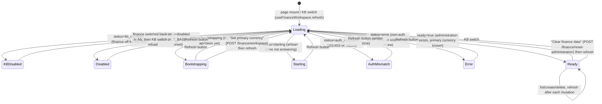

# Finance: embedded Firefly III

**What this covers.** How Orb embeds Firefly III as its personal-finance ledger and exposes it per Knowledge Base: the backend proxy (`backend/app/services/firefly_service.py` — `FireflyService`), the *administration-per-KB* isolation model (Firefly user groups), request scoping (`_run_scoped`, `user_group_id` stamping, PHP id-filters), every public service method with the Firefly endpoint it calls and the mapping into Orb's `Finance*` shapes, the `runtime.json` contract shared with the desktop shell (token minting/refresh, `.env`, upgrade/stash-swap, seeding, migrations), readiness states, the finance chat path, and the React finance workspace (`frontend/src/app/finance/page.tsx`, `frontend/src/components/finance/**`). The route table itself lives in the API reference and the shell-side provisioning steps in the desktop doc; this file goes deeper on both and links rather than repeats.

**Related docs:** [Desktop shell and runtime §4 (PHP/Firefly bootstrap)](04-desktop-shell.md#4-the-runtime-desktop_runtimepy) · [API reference: Finance routes](07-api-reference.md#finance-routes-api_desktoppy) · [Knowledge bases & vaults](08-knowledge-bases-and-vaults.md) · [Backend core & configuration](06-backend-core-and-configuration.md) · [Retrieval & chat](16-retrieval-and-chat.md) · [Frontend architecture](18-frontend-architecture.md) · [Frontend chat, graph & pages](20-frontend-chat-graph-and-pages.md) · [Configuration reference](21-configuration-reference.md) · [Data directory layout](22-data-directory-layout.md) · [Packaging & release](05-packaging-build-and-release.md) · [Logging](23-logging-and-observability.md) · [Decisions & constraints](26-decisions-and-constraints.md) · [Glossary](28-glossary.md)

---

## 1. Responsibilities and boundaries

**Owned by this subsystem**

| Layer | Owns |
|---|---|
| `backend/app/desktop_runtime.py` | Provisioning the portable PHP binary and the Firefly III release tree under `DATA_DIR/firefly/`, writing `.env`, running migrations/seeds, creating Passport keys/client, creating the single Firefly user, minting the personal-access API token, persisting all of it in `runtime.json`. |
| `backend/app/desktop_runtime.py` (`start_firefly`, env setup) | Spawning `php artisan serve --host 127.0.0.1 --port 17412`, waiting for HTTP, exporting `FIREFLY_BASE_URL` and `FIREFLY_RUNTIME_FILE` before the API imports `Settings`. |
| `backend/app/services/firefly_service.py` | The only code in the backend that talks to Firefly. HTTP client + bearer auth, per-KB *administration* (user-group) lifecycle, request scoping, resource CRUD, normalisation into Orb's flat JSON shapes, readiness reporting, the finance branch of chat. |
| `backend/app/api_desktop.py` (Finance section) | Pydantic input models, route wrappers, `_finance_error` status mapping, multipart handling for attachments. |
| `backend/app/services/kb_registry.py` (`firefly_group_id`, `firefly_group_title`, `set_firefly_group`, `detach_firefly_group`) | Persisting the KB → administration mapping in SQLite `knowledge_bases`. |
| `frontend/src/components/finance/**`, `frontend/src/app/finance/page.tsx`, finance methods in `frontend/src/lib/api.ts`, `Finance*` types in `frontend/src/lib/types.ts` | The in-app finance workspace (nine tabs), the not-ready screen, data loading/refresh and every mutation. |

**Explicitly not owned here**

- Firefly III itself (a Laravel/PHP app, version `v6.6.6`, unmodified release tarball). Orb never patches its source; it drives it through the REST API and a handful of `php -r` scripts that boot Laravel and touch Eloquent models directly.
- Port allocation (`desktop_runtime.py` `PORTS["firefly"]` = 17412, env `ORB_FIREFLY_PORT`) — see [Desktop shell and runtime §4](04-desktop-shell.md#4-the-runtime-desktop_runtimepy).
- Generic `?kb=` resolution (`backend/app/api/deps.py:get_kb`) — see [API reference](07-api-reference.md).
- The KB lifecycle routes in `backend/app/api/kb.py` that *call into* this service (empty/delete/rename) — documented in §15 as interfaces.

There are **no unit tests** for the finance subsystem (`backend/tests/unit` has none).

## 2. Files

| Path | Purpose | Key exports / symbols |
|---|---|---|
| `backend/app/services/firefly_service.py` | Firefly proxy + per-KB administration model + finance chat | `FireflyService`, `FireflyHTTPError`, module singleton `firefly_service`, helpers `_as_float`, `_iso_today`, `_php_escape` |
| `backend/app/api_desktop.py` | Finance routes (`/api/v1/finance/**`), input models, `_finance_error` | `CreateWorkspaceInput`, `CreateAccountInput`, `CreateTransactionInput`, `CreateBudgetInput`, `CreateCategoryInput`, `CreateBillInput`, `CreatePiggyInput`, `CreateTagInput`, `CreateRecurrenceInput` |
| `backend/app/services/kb_registry.py` | Creates/migrates the two Firefly columns (`_ensure_firefly_columns`), persists mapping | `KBRegistry.set_firefly_group`, `detach_firefly_group`, `get_metadata`, `_save_row` |
| `backend/app/core/config.py` | Settings keys | `FIREFLY_BASE_URL`, `FIREFLY_RUNTIME_FILE`, `FIREFLY_API_TOKEN` |
| `backend/app/api/chat.py` | Finance-aware chat branch | `_answer_chat_query` calls `looks_like_finance_query` / `answer_finance_question` |
| `backend/app/api/kb.py` | Calls `destroy_kb_administration` on empty/delete, `sync_kb_group_title` on rename | — |
| `backend/app/desktop_runtime.py` | PHP + Firefly provisioning, `.env`, migrations, seed, Passport, user + token, `runtime.json`; `start_firefly()`; boot order | `FIREFLY_VERSION`, `PHP_BIN_VERSION`, `firefly_root`, `firefly_app_dir`, `firefly_runtime_file`, `php_binary`, `ensure_php_runtime`, `ensure_firefly_app`, `ensure_firefly_runtime`, `start_firefly` |
| `backend/app/desktop_runtime.py prefetch-firefly DEST` (called by `desktop/build.py prepare`) | Build-time: produce the bundled seed `desktop/resources/firefly/{php,app}` by running `ensure_php_runtime` + `ensure_firefly_app` into a scratch dir | `main()` |
| `frontend/src/app/finance/page.tsx` | Page shell: composes hooks + tabs, chooses not-ready vs workspace view | `FinancePage` (default) |
| `frontend/src/components/finance/hooks/useFinanceWorkspace.ts` | Loads workspace + all lists per KB, derived account groups, form seeding | `useFinanceWorkspace`, `FinanceWorkspaceState`, `FormSeeders` |
| `frontend/src/components/finance/hooks/useFinanceMutations.ts` | All form state and every create/delete/search/report/reset action | `useFinanceMutations`, `FinanceMutationsState` |
| `frontend/src/components/finance/tabs/*.tsx` | `OverviewTab`, `AccountsTab`, `TransactionsTab`, `BudgetsTab`, `CategoriesTab`, `RecurringTab`, `RulesTab`, `SearchTab`, `ReportsTab` | — |
| `frontend/src/components/finance/*.tsx`, `utils.ts` | Shared UI: `FinanceHeader`, `FinanceNotReady`, `FinanceWorkspaceBar`, `FinanceTabs`, `Panel`, `Field`, `MetricCard`, `SuggestInput`, `DeletableList`, `AccountList`, `TransactionList`, `BasicSummaryList`, `ChartList`; helpers `money`, `todayIso`, `tomorrowIso`, `monthStartIso`, `TabId` (`errMessage` lives in `lib/utils.ts`) | imported by path from `app/finance/page.tsx` |
| `frontend/src/lib/api.ts` (Finance section) | Typed client wrappers for every route the UI uses | `getFinanceWorkspace`, `createFinanceWorkspace`, `resetFinanceAdministration`, `listFinanceAccounts`, `createFinanceAccount`, `listFinanceTransactions`, `createFinanceTransaction`, `deleteFinanceTransaction`, `getFinanceSummary`, `getFinanceReport`, `listFinanceBudgets`, `createFinanceBudget`, `listFinanceCategories`, `createFinanceCategory`, `deleteFinanceCategory`, `listFinanceRecurrences`, `createFinanceRecurrence`, `deleteFinanceRecurrence`, `listFinanceRuleGroups`, `createFinanceRuleGroup`, `deleteFinanceRuleGroup`, `listFinanceRules`, `createFinanceRule`, `deleteFinanceRule`, `searchFinance` |
| `frontend/src/lib/types.ts` | `FinanceAccount`, `FinanceTransaction`, `FinanceBudget`, `FinanceCategory`, `FinanceRecurrence`, `FinanceRuleGroup`, `FinanceRule`, `FinanceSearchResult`, `FinanceWorkspace`, `FinanceSummary`, `FinanceReport` | — |
| `frontend/src/components/sidebar.tsx` | Nav entry `{ name: "Finance", href: "/finance", icon: Wallet }` | — |

## 3. Why Firefly III is embedded (rationale)

Orb's stated product goal is a *local-first personal knowledge system* in which each Knowledge Base (vault) is a fully isolated world: its own notes folder, Kuzu graph, Qdrant collections, Meilisearch index — and its own ledger. The README summarises the finance feature in one line: "Per-KB Firefly III administrations — accounts and transactions stay scoped to a vault."

Evidence in git for *why a full Firefly instance* rather than home-grown tables:

- Before commit `fbcafe7` (2026-08-03, "Align codebase with Orb desktop product and drop legacy Docker-era paths") the backend still carried `backend/app/models/finance.py` with three SQLAlchemy tables — `finance_workspaces (kb_id, currency)`, `finance_accounts (id, kb_id, name, account_type, opening_balance, archived)`, `finance_transactions (id, kb_id, date, description, amount, account_id, transfer_account_id, category)`. Its docstring already read "Legacy native finance models kept only for migration/compatibility checks." That native ledger was deleted in `fbcafe7`; nothing in the current tree references those tables.
- The Firefly proxy arrived complete in `3f21e08` (2026-08-02, "Ship LifeOS as a Docker-free desktop app…"). Its method inventory stayed unchanged until 2026-09-19, when the resources the UI never used (bills, piggy banks, tags, webhooks, object groups, exchange rates, attachments, `open`) were removed. The design decision was therefore: replace a thin native ledger with the *whole* Firefly feature set (budgets, bills, piggy banks, rules, recurrences, webhooks, attachments, reports, search grammar, multi-currency) and accept the cost of shipping a PHP runtime.
- Firefly is a mature double-entry ledger with a large REST API and a JSON:API-ish response format; Orb's proxy normalises that into flat rows so the UI and the chat LLM see simple JSON.
- Firefly III's "administrations" (Eloquent `UserGroup` model + `user_group_id` column on every ledger table) provide a first-class tenancy boundary inside one database and one user. Orb maps **one administration per KB** and relies on that for isolation rather than running one Firefly per vault (which would need N PHP servers and N ports).

Trade-offs that follow (documented in §16–§18): a ~1 s Laravel bootstrap for every `php -r` script, a global lock that serialises all finance requests, Firefly endpoints that are still user-wide and must be post-filtered, and a PHP runtime (~portable NativePHP build) that has to be downloaded or bundled.

## 4. Runtime contract: `runtime.json`, `.env`, token minting and refresh

The desktop runtime (`backend/app/desktop_runtime.py`, the Firefly half of it) *produces* the runtime file; `FireflyService` *consumes* it. The provisioning sequence (PHP download/seed, tarball download, stash/swap upgrade, migrations, seeding) is summarised in [Desktop shell and runtime §4](04-desktop-shell.md#4-the-runtime-desktop_runtimepy); the function names below are the Python ones. This section documents the **contract** — every field, who writes it, who reads it, and when it changes.

### 4.1 `runtime.json` — every field

Location: `DATA_DIR/firefly/runtime.json` (`firefly_runtime_file(data_dir)`), passed to the API as env `FIREFLY_RUNTIME_FILE`. Written by `_write_private` with mode `0600` (the file carries the password, APP_KEY and API token, and the data dir may be cloud-synced).

| Field | Type | Written by | When | Read by |
|---|---|---|---|---|
| `email` | string, default `"orb@local.invalid"` | `_ensure_runtime_metadata` | first boot (kept forever after) | `_ensure_firefly_env` (`SITE_OWNER`), `_bootstrap_state_script`, `_bootstrap_user_script` |
| `password` | string, `secrets.token_urlsafe(24)` | `_ensure_runtime_metadata` | first boot | `_bootstrap_user_script` via env `ORB_FIREFLY_BOOTSTRAP_PASSWORD` (bcrypt'ed into `users.password` and **re-set on every user bootstrap**). Never read by the backend. It is the password you would use to log in to Firefly's own web UI as `orb@local.invalid`. |
| `instanceId` | UUID v4 | `_ensure_runtime_metadata` | first boot | nothing else in the tree reads it (informational). |
| `appKey` | `"base64:" + 32 random bytes b64` | `_ensure_firefly_env` | first boot, or whenever the stored value does not start with `base64:` | `.env` `APP_KEY`. Changing it invalidates Laravel-encrypted data (sessions, encrypted attributes). |
| `cronToken` | 32-char base64url | `_ensure_firefly_env` | first boot or when length ≠ 32 | `.env` `STATIC_CRON_TOKEN`. Nothing in Orb calls Firefly's cron endpoint. |
| `passportReady` | bool | `ensure_firefly_runtime` | every boot (set `true` after key/client checks) | **nobody** — deliberately informational; the code trusts the key files and the `oauth_clients` count instead (see 4.3). |
| `userReady` | bool | `ensure_firefly_runtime` | after the user bootstrap script | nobody (informational, same reason). |
| `userId` | int | user bootstrap | after the user bootstrap script | backend `_bootstrap_user_id()` — every PHP script embeds `User::find(<userId>)`; falls back to `1` if missing/non-numeric. |
| `groupId` | int | user bootstrap | after the user bootstrap script; **removed** by backend `destroy_kb_administration` when the default KB's administration is destroyed and it equals this value | backend `_activate_scope_locked`: the `default` KB adopts this group instead of creating a new one. |
| `apiToken` | string (Passport personal access token, a JWT) | user bootstrap | after the user bootstrap script; **set to `null`** when Passport keys are regenerated or when no OAuth client exists | backend `_token()` (unless `FIREFLY_API_TOKEN` overrides). |

Example (fields in write order):

```json
{
  "email": "orb@local.invalid",
  "password": "kq3…",
  "instanceId": "4f1c…",
  "appKey": "base64:…",
  "cronToken": "…32 chars…",
  "passportReady": true,
  "userReady": true,
  "userId": 1,
  "groupId": 1,
  "apiToken": "eyJ0eXAiOiJKV1QiLCJhbGciOiJSUzI1NiJ9…"
}
```

### 4.2 How the backend consumes it

`FireflyService.__init__` (module import time, singleton `firefly_service`):

```python
self.base_url = (settings.FIREFLY_BASE_URL or "").rstrip("/")   # e.g. http://127.0.0.1:17412
self.runtime_file = settings.FIREFLY_RUNTIME_FILE or ""
self._scope_lock = asyncio.Lock()
self._switched_group_id: int | None = None
```

- `_load_runtime()` re-reads and re-parses the JSON file **on every call** (no caching). Missing file / unreadable / invalid JSON → `{}`. Consequences: a token minted by the runtime after the API started is picked up on the next request without a restart; conversely a manual edit takes effect immediately.
- `_token()` precedence: `settings.FIREFLY_API_TOKEN` (env) if truthy → else `runtime["apiToken"]` if a non-blank string → else `None`. With `None`, `status()` reports `bootstrapping` and no Firefly request is attempted.
- `_php_paths()` derives everything from the runtime file's **directory**: `php = <dir>/php/php`, `app_dir = <dir>/app`. This is a hard-coded layout assumption matching `desktop_runtime.php_binary` / `firefly_app_dir`. If `FIREFLY_RUNTIME_FILE` is unset, `Path("")` → `.` and PHP is looked up at `./php/php` relative to the backend's cwd (it will not exist → `RuntimeError("Embedded PHP binary not found at …")` on the first scoped call).
- `_bootstrap_user_id()` accepts int or numeric string, else `1`.
- `destroy_kb_administration` is the only backend **writer**: it pops `groupId` and rewrites the file with `json.dumps(runtime, indent=2)` via `Path.write_text` — note this does **not** re-apply mode 0600 and does not add the trailing newline the shell writes (harmless; the runtime's reader tolerates both).

Env injection (`desktop_runtime.py`, before uvicorn imports `Settings`): `FIREFLY_BASE_URL` = `http://127.0.0.1:17412` and `FIREFLY_RUNTIME_FILE` = `<DATA_DIR>/firefly/runtime.json`. `FIREFLY_API_TOKEN` is **never** set by the runtime — it exists for development against an external Firefly (set all three env vars by hand; `_php_paths` will then point at a non-existent PHP and administration creation will fail unless the runtime dir layout is mirrored).

### 4.3 Token minting and refresh (runtime side)

`ensure_firefly_runtime` runs on **every** app boot before `artisan serve` is spawned (`boot_sidecars` in `desktop_runtime.py`: the API is already serving; Qdrant + Meilisearch → Firefly run behind it in a background thread). Order and the exact invalidation rules:

1. `php artisan migrate --force` then `php artisan db:seed --force` (full base seed — commit `f8f527f` replaced a currency-only `TransactionCurrencySeeder` because an empty `account_types` table made asset-account creation fail).
2. `_bootstrap_state_script(email)` via `_run_php` — inline PHP returning `{user_id, group_id, clients}` where `clients = count(oauth_clients)`. Raises on failure.
3. Key check — both `storage/oauth-private.key` and `oauth-public.key` must exist with size > 0. If not: `php artisan passport:keys --force` and **`runtime.apiToken = null`** (a token is an RS256 JWT signed by the private key; a new keypair makes every old token fail verification with 401).
4. If `clients === 0`: `php artisan passport:client --personal --no-interaction` and **`runtime.apiToken = null`** (personal access tokens are issued against the personal client; a missing client means the DB was reset).
5. `runtime.passportReady = true`; write.
6. If `not state.user_id or not runtime.apiToken` → run `_bootstrap_user_script(email, "Orb")` with the password in env `ORB_FIREFLY_BOOTSTRAP_PASSWORD` (argv would be visible in `ps`). The script is idempotent: `UserGroup::firstOrCreate(['title' => 'Orb'])`, `Role owner`, `UserRole owner`, requires the `EUR` seed currency, creates or updates the user (`user_group_id`, bcrypt password, unblocked), attaches role and `GroupMembership`, sets EUR as group default and user default, then `$user->createToken('Orb Desktop')->accessToken`. Result → `userReady`, `userId`, `groupId`, `apiToken`.

So a **new token is minted** exactly when: first boot; Passport keys were missing/empty (e.g. after `app/storage` loss or a botched upgrade); no OAuth client existed (DB recreated); or the user row disappeared. Each mint adds another `oauth_access_tokens` row named `Orb Desktop`; old tokens are not revoked (they may still be valid if keys were not rotated). There is **no time-based refresh**: Passport personal tokens default to a very long expiry, and neither side checks `expires_at`. If the token ever does expire the backend will report `auth_mismatch` (401) forever until `apiToken` is cleared from `runtime.json` (or the file deleted) and the app restarted.

The `runtime.groupId` written here is the group titled **`Orb`** (the bootstrap group), not an `Orb: <kb>` group. The backend adopts it for the `default` KB only (§5.2).

### 4.4 `.env` and app-tree upgrades (contract summary)

Regenerated on every boot by `_ensure_firefly_env`. Contract points that matter to the backend:

- `APP_URL = http://127.0.0.1:17412`, `TRUSTED_PROXIES = 127.0.0.1,::1` (was `**` before `fbcafe7`), `AUTHENTICATION_GUARD = web`, `DB_CONNECTION = sqlite`, `DB_DATABASE = <app>/storage/database/firefly.sqlite` (absolute), `QUEUE_CONNECTION = sync` (webhooks/rules run inline in the request), `MAIL_MAILER = log`, `APP_NAME = Orb_Finance`.
- Upgrades: when `app/.orb-firefly-version` ≠ `FIREFLY_VERSION` (`v6.6.6`, override `ORB_FIREFLY_VERSION`), `_stash_app_state` copies `storage/database`, `storage/upload`, `storage/oauth-{private,public}.key` aside, `_swap_in_app_tree` replaces `app/` atomically-ish (`app.bak` fallback), `_restore_app_state` copies the stash back. Everything the backend depends on (SQLite DB with all administrations, uploads, Passport keys → token validity) therefore survives a Firefly version bump; only if the keys were lost does step 3 above rotate the token.
- Build-time seed: `python -m app.desktop_runtime prefetch-firefly DEST` (the `firefly` stage of `desktop/build.py prepare`) runs `ensure_php_runtime` + `ensure_firefly_app` into a scratch dir and copies `php/` and `app/` into `desktop/resources/firefly/` (gitignored, packaged as `<resources>/firefly`). At runtime `_bundled_firefly_root()` (via `ORB_RESOURCES_ROOT`) prefers that seed over a download when its markers (`php/.orb-php-runtime`, `app/.orb-firefly-version`) match. The seed contains **no** database, keys or `runtime.json` — those are always created per install.

## 5. The per-KB administration model

### 5.1 Concepts

| Firefly concept | Orb mapping |
|---|---|
| **User** (`users` table) | Exactly one: `orb@local.invalid`, id stored as `runtime.userId`. All administrations belong to this user. The API token is this user's. |
| **Administration** = `UserGroup` (`user_groups` table, `title`) | One per KB. Title is always `Orb: <kb.name>` (`_group_title_for_kb`). Bootstrap also creates a group titled `Orb` which the `default` KB adopts. |
| `GroupMembership (user_id, user_group_id, user_role_id)` | Created with the `owner` `UserRole` for every group Orb creates. |
| `users.user_group_id` (the user's *current/active* administration) | Switched by `_php_switch_group_script` before requests; this is what Firefly's web UI and many API endpoints treat as "the" administration. |
| `user_group_id` column on `accounts`, `transaction_journals`, `budgets`, `categories`, `bills`, `piggy_banks`, `tags`, `rules`, `rule_groups`, `recurrences`, `webhooks`, `object_groups` | The actual isolation key. Orb filters by it (PHP `_ids_for_group`) and relies on Firefly stamping new rows with the *active* group. |
| Group default currency (`transaction_currency_user_group` pivot, `group_default`) | Set to EUR at creation; changed by `set_primary_currency` (`POST /currencies/{code}/primary`). |

Persistence on Orb's side (SQLite `DATA_DIR/orb.db`, table `knowledge_bases`): columns `firefly_group_id INTEGER NULL`, `firefly_group_title TEXT NULL`, added on the fly by `kb_registry._ensure_firefly_columns` for older databases (`ALTER TABLE … ADD COLUMN`). `KBRegistry.set_firefly_group(kb_id, group_id, title)` and `detach_firefly_group(kb_id)` update the in-memory metadata dict under the registry lock and upsert the row (`_save_row`, `ON CONFLICT(id) DO UPDATE SET … firefly_group_id=excluded.firefly_group_id, firefly_group_title=excluded.firefly_group_title`). `delete_kb` pops both keys before deleting the row. `list_kbs` exposes them verbatim in `GET /api/v1/kb` payloads (`firefly_group_id`, `firefly_group_title`).

### 5.2 Lifecycle: how a KB obtains a group (`_activate_scope_locked`)

Always called with `_scope_lock` held.

```python
meta = kb_registry.get_metadata(kb.kb_id) or {}
group_id = meta.get("firefly_group_id")          # int, numeric str, or None
title = f"Orb: {kb.name}"
if not (isinstance(group_id, int) and group_id > 0):
    runtime = self._load_runtime()
    if kb.kb_id == "default" and isinstance(runtime.get("groupId"), int):
        group_id = runtime["groupId"]             # adopt the bootstrap "Orb" group
        kb_registry.set_firefly_group(kb.kb_id, group_id, title)
    else:
        created = await asyncio.to_thread(self._run_php, self._php_create_group_script(title))
        group_id = int(created["group_id"])
        kb_registry.set_firefly_group(kb.kb_id, group_id, title)
if self._switched_group_id != group_id:
    await asyncio.to_thread(self._run_php, self._php_switch_group_script(group_id))
    self._switched_group_id = group_id
return group_id
```

Points worth stating explicitly:

- **Creation is lazy.** `POST /api/v1/kb` does not touch Firefly. The first scoped finance call for a KB (typically `GET /finance/workspace` when the page opens, or a finance chat question) creates the administration.
- **Default KB adoption.** The `default` KB reuses `runtime.groupId` (the group titled `Orb`) but records the title `Orb: default` in the registry — the Firefly-side title stays `Orb` until a rename triggers `sync_kb_group_title`. `get_workspace` prefers the registry title, so the UI shows `Orb: default`.
- **Create script** (`_php_create_group_script(title)`) is *find-or-create by title*: `UserGroup::where('title', $title)->first()` else `UserGroupFactory::create(['title', 'user'])`; then `UserRole owner` + `GroupMembership::firstOrCreate`, and EUR set as `group_default` / `user_default` (only if the EUR row exists). Two KBs with the same `name` would therefore **share** one administration — names are unique in the registry, but a KB created after another with the same name was deleted (group destroyed) simply gets a fresh group; a KB whose group was destroyed while another KB was renamed to the same name would collide. Title is escaped with `_php_escape` (backslash and single quote) and interpolated into a single-quoted PHP literal.
- **Switch script** (`_php_switch_group_script(group_id)`) sets `users.user_group_id = <group>` and saves. It is skipped when `_switched_group_id` already equals the target — commit `f8f527f` ("cache Firefly scope switches") added this because every request previously paid the ~1 s Laravel bootstrap. The cache is **process-local and optimistic**: if something else changes the user's active group (e.g. the user switches administrations in Firefly's own web UI at :17412), the backend will not notice until it restarts or scopes to a different KB. Requests still carry `user_group_id=<group>` as a query param, which covers endpoints that honour it.
- **Reset** (`destroy_kb_administration`): if the registry has no positive `firefly_group_id`, it detaches and returns `{"destroyed": False, "reason": "no_group"}` (no PHP). Otherwise under `_scope_lock`: clear `_switched_group_id` if it matched, run `_php_destroy_group_script(gid)`, which for each of `TransactionJournal, Account, Category, Budget, Bill, PiggyBank, Tag, Rule, RuleGroup, Recurrence, Webhook, ObjectGroup` does `where('user_group_id', gid)` and `withTrashed()->forceDelete()` (soft-deleting models) or `delete()`, each wrapped in `try/catch` and continued; deletes `GroupMembership` rows; if the user's active group was `gid`, points it at the lowest-id remaining group (or `null`); detaches currencies; `$group->delete()`; returns `{"destroyed": true, "group_id": gid}` (or `{"destroyed": false, "reason": "missing"}` when the group no longer exists — still exit 0). Then, regardless of PHP success, `kb_registry.detach_firefly_group` and the `runtime.json` `groupId` pop described in §4.2. On PHP failure the mapping is still detached and `{"destroyed": False, "reason": "<error>", "group_id": gid}` is returned — the ledger rows are then orphaned in Firefly but unreachable from Orb.
  - Note: `Transaction` rows (the splits under a journal) and `Attachment`, `Note`, `Location`, `BudgetLimit`, `AutoBudget`, `RecurrenceTransaction` rows are not deleted explicitly; Eloquent `forceDelete` on `TransactionJournal` does not cascade in application code, so depending on Firefly's foreign-key setup some child rows may remain as orphans in the SQLite file. They are invisible to Orb because every list is filtered by group.
- **Rename** (`sync_kb_group_title(kb_id, new_name)`): no-op when the registry has no positive group id; otherwise runs `_php_update_group_title_script` (`UserGroup::find(gid)->title = 'Orb: <new>'`) and updates the registry title. Not under `_scope_lock` (only writes the title).
- **KB empty/delete** (`backend/app/api/kb.py`): `POST /kb/empty`, `DELETE /kb/{id}`, `POST /kb/delete-non-default` all call `destroy_kb_administration` first, best-effort (exceptions logged with `[empty-kb]`, `[delete-kb]`, `[delete-non-default]` prefixes), then purge notes/indexes.

### 5.3 The "never leak across vaults" invariant

The transaction-creation error text says "Create accounts under this vault — they are not shared across vaults." The invariant is enforced by **four stacked mechanisms**, because no single Firefly feature is sufficient:

1. **Active administration switch** (`users.user_group_id`) before any request for a different KB — makes Firefly create new rows under the right `user_group_id` and makes group-aware endpoints return that group's data.
2. **`user_group_id=<gid>` query parameter** stamped on every request by `_request` (`params.setdefault("user_group_id", active)` — explicit params win). Several Firefly v6 endpoints accept it; the rest ignore it silently.
3. **PHP id allow-lists** (`_ids_for_group(model, gid)` → `Model::query()->where('user_group_id', gid)->whereNull('deleted_at' if SoftDeletes)->pluck('id')`), applied client-side to list responses via `_filter_api_data_by_ids` / `_list_scoped_resources`. This is the real guard for user-wide endpoints (`/accounts`, `/categories`, `/budgets`, `/bills`, `/piggy-banks`, `/tags`, `/recurrences`, `/rules`, `/rule-groups`, `/webhooks`, `/object-groups`, `/search/accounts`). If the PHP call fails the allow-list is the **empty set** → the list comes back empty (fail closed), with a `Could not list Firefly <Model> IDs for group …` warning.
4. **Transaction group attribute check** (`_transaction_group_belongs`): transaction payloads carry `attributes.user_group` (or `user_group_id`); rows whose value ≠ gid are dropped. Applied in `list_recent_transactions`, `summary`, `search(kind=transactions)`, and the expense/revenue enrichment in `_list_accounts_unlocked`.

Writes are protected differently: `create_transaction` refuses a source `account_id` that is not in the group's account list (400); other creates rely on mechanism 1 (Firefly stamps the active group). **Deletes and updates are not re-validated** — `DELETE /finance/categories/{id}` for an id belonging to another KB's group will be forwarded to Firefly with `user_group_id=<this gid>`; whether Firefly refuses depends on the endpoint's implementation (most v6 repositories scope by the *user*, not the group, so cross-KB deletes by id are possible from a crafted request; the UI only ever shows ids from filtered lists).

Not group-filtered at all: `list_exchange_rates` (exchange rates are user-wide in Firefly), `list_attachments` (returns all attachments of the user), `download_attachment`. Charts/summary endpoints are post-filtered by id/label heuristics (§9.12).

## 6. Request scoping: `_run_scoped`, `_activate_scope_locked`, `_request`, `_list_scoped_resources`

```python
async def _run_scoped(self, kb, callback):
    async with self._scope_lock:
        group_id = await self._activate_scope_locked(kb)
        prev = getattr(self, "_active_group_id", None)
        self._active_group_id = group_id
        try:
            return await callback(group_id)
        finally:
            self._active_group_id = prev
```

- `_scope_lock` is a single `asyncio.Lock` on the singleton → **all finance work across all KBs is serialised**, including the whole callback (which may perform 5–10 HTTP calls and several PHP invocations). Finance throughput is therefore one request at a time per backend process; the frontend's `Promise.all` of eight list calls on refresh executes sequentially server-side.
- `_active_group_id` is set only inside the lock; `_request` reads it via `getattr(self, "_active_group_id", None)` (the attribute is not initialised in `__init__`, hence `getattr`). Calls to `_request` outside `_run_scoped` (only `status()` → `/api/v1/about`) carry no `user_group_id`.
- `_run_php` is synchronous `subprocess.run([php, "-r", script], cwd=app_dir, capture_output=True, text=True, timeout=90)` and is always wrapped in `asyncio.to_thread`, so the event loop keeps serving other (non-finance) requests while PHP boots. Non-zero exit → `RuntimeError(stderr or stdout or "PHP exited N")`. Output parsing: take the substring from the **last** `{` (Laravel may print warnings first) and `json.loads` it; no `{` → `RuntimeError("PHP script returned no JSON: …")`. Note: the backend does **not** set `HOME`/`USERPROFILE` to the firefly root the way the shell's `runPhp` does; PHP inherits the backend's env. Timeout 90 s raises `subprocess.TimeoutExpired` (not a `RuntimeError` → `_finance_error` maps it to 500).

```mermaid
sequenceDiagram
    autonumber
    participant UI as Finance UI / chat
    participant R as api_desktop route
    participant S as FireflyService
    participant REG as kb_registry (SQLite)
    participant PHP as php -r (Laravel boot ~1s)
    participant FF as Firefly REST :17412

    UI->>R: GET /api/v1/finance/categories?kb=work
    R->>S: list_categories(kb)
    S->>S: acquire _scope_lock (global)
    S->>REG: get_metadata(kb_id).firefly_group_id
    alt no group yet
        S->>PHP: create group "Orb: work" (find-or-create, owner membership, EUR default)
        PHP-->>S: {group_id: 7, title}
        S->>REG: set_firefly_group(kb_id, 7, "Orb: work")
    end
    alt _switched_group_id != 7
        S->>PHP: users.user_group_id = 7
        S->>S: _switched_group_id = 7
    end
    S->>S: _active_group_id = 7
    S->>PHP: Category::where(user_group_id,7)->pluck(id)
    PHP-->>S: {ids: [12, 15]}
    S->>FF: GET /api/v1/categories?limit=100&user_group_id=7 (Bearer apiToken)
    FF-->>S: JSON:API {data:[{id,attributes}...]}
    S->>S: keep ids in {12,15}; _normalize_category each
    S->>S: restore _active_group_id; release lock
    S-->>R: [{id,name,notes}]
    R-->>UI: 200 JSON
```

`_list_scoped_resources(group_id, *, model, path, normalize, params=None)` is the shared implementation for the eleven "simple" collections: `allowed = await _ids_for_group(model, gid)`; `payload = GET path` with `params` (default `{"limit": 100}`); return `[normalize(item) for item in _filter_api_data_by_ids(payload, allowed)]`. `_filter_api_data_by_ids(payload, allowed)` iterates `payload["data"]`, keeps dict items whose `str(id)` is in `allowed` (when `allowed is None` it keeps everything — only `_list_accounts_unlocked(None)` uses that path). **Pagination:** every list uses `limit=100` and reads page 1 only; Firefly's `meta.pagination` is ignored. A KB with more than 100 accounts of one type / categories / budgets / etc. will silently see only the first 100 (Firefly's default ordering).

### 6.1 `_request(method, path, **kwargs)`

1. `RuntimeError("Firefly base URL is not configured")` if `base_url` is empty.
2. For `POST`/`PUT`/`PATCH` without `json`/`content`/`data`, sends `json={}` — Firefly returns 415 on an empty `Content-Type`, and several endpoints (`/currencies/{code}/enable`, `/currencies/{code}/primary`) are body-less.
3. Stamps `user_group_id` (see above).
4. Opens a **fresh `httpx.AsyncClient` per request** (`_client()`: `base_url`, `headers=_headers()`, `timeout=httpx.Timeout(45.0)`) — no connection pooling, and headers (hence the token) are re-read from `runtime.json` each time.
5. `response.is_error` → `FireflyHTTPError(f"Firefly {method} {path} failed ({status}): {detail}", status_code)` where `detail` is `payload.message` / `payload.error` / `json.dumps(payload.errors or payload)` if the body is JSON, else the raw text.
6. `204` or blank body → `None`. JSON content type (`application/json`, `application/vnd.api+json`, any `+json`) → `response.json()`. Otherwise, if the text starts with `{`/`[`, try JSON anyway; else return the text.

Headers (`_headers()`): `Accept: application/vnd.api+json, application/json`, `Content-Type: application/json`, and `Authorization: Bearer <token>` when a token exists. The attachment upload overrides `Content-Type` to `application/octet-stream` and passes raw `content=`.

## 7. `FireflyService` internals: client, auth, PHP bridge, helpers

| Member | Kind | Notes |
|---|---|---|
| `base_url`, `runtime_file` | str | From settings at import; not reloaded. |
| `_scope_lock` | `asyncio.Lock` | Global finance mutex. |
| `_switched_group_id` | `int | None` | Cache of the last group activated via PHP. Cleared by `destroy_kb_administration` when it matches. |
| `_active_group_id` | dynamic attr | Set/reset by `_run_scoped`; read by `_request`. |
| `_CURRENCY_META` | class dict | 12 codes (USD, EUR, GBP, GHS, NGN, CAD, AUD, JPY, CHF, INR, KES, ZAR) → `{name, symbol}` used when a currency must be **created**; others get `name=symbol=code`. |
| `_load_runtime()`, `_token()`, `_headers()`, `_client()` | auth | §4.2, §6.1 |
| `_php_paths()`, `_run_php(script)`, `_bootstrap_user_id()` | PHP bridge | §4.2, §6 |
| `_php_create_group_script`, `_php_switch_group_script`, `_php_destroy_group_script`, `_php_update_group_title_script` | PHP script builders | §5.2 |
| `_php_model_ids_for_group_script(model, gid, key="ids")`, `_php_account_ids_for_group_script(gid)` | PHP script builders | Allowed models: `Account, Category, Budget, Recurrence, Bill, PiggyBank, Tag, Rule, RuleGroup, Webhook, ObjectGroup`; anything else → `ValueError("Unsupported Firefly model: …")` (a programming error, would surface as 400). The account variant uses key `account_ids`; `_ids_for_group` accepts either key. |
| `_ids_for_group(model, gid) -> set[str]`, `_account_ids_for_group(gid)` | async | One PHP process each (~1 s). Never raises; returns `set()` on any failure. Called **per list call** — nothing is cached, so `report()` alone spawns 5 PHP processes (Category ids, Budget ids, Category ids again inside `_list_scoped_resources`, Budget ids again, Account ids inside `_list_accounts_unlocked`). |
| `_filter_api_data_by_ids`, `_resource_rows`, `_as_dict`, `_as_list`, `_is_json_content_type` | static helpers | Defensive JSON access; `_as_dict`/`_as_list` return `{}`/`[]` for wrong types so malformed payloads degrade to empty results instead of exceptions. |
| `_transaction_group_belongs(item, gid)` | static | `gid` falsy → `True`; compares `attributes.user_group` (fallback `user_group_id`) with `gid` as int, else as str. Missing attributes → `False`. |
| `_group_title_for_kb(kb)` | str | `f"Orb: {kb.name}"` |
| `_ensure_currency_enabled(code)` | async | `POST /currencies/{code}/enable`; if the error mentions `404`/`not found` → `POST /currencies` with `_CURRENCY_META` (decimal_places 2, enabled, not primary); if *that* fails with `422`/`already` → enable again; other errors propagate. Non-404 enable errors are swallowed (assumed "already enabled"). |
| `_format_note_passages(note_docs)` | str | Up to 6 docs → `[title] text[:1200]` lines (title from `original_obj.name` / `note_id`; text from `summary`/`description`/`text`). Used by the chat path. |

Module-level helpers: `_as_float(value)` → `float(value)` or `0.0` on `TypeError/ValueError` (all amounts pass through it; Firefly sends amounts as strings). `_iso_today()` → UTC date. `_php_escape(value)` → escape `\` and `'`.

Caching: **none** at the HTTP level; the only memoised state is `_switched_group_id`. Currency handling: Firefly stores amounts as strings; Orb formats outgoing amounts with `f"{x:.2f}"` (exchange rates `:.8f` trimmed) and parses incoming with `_as_float`; currency codes are upper-cased and taken from the account (`currency_code`/`native_currency_code`/`currency_symbol` fallback) or Firefly's primary currency.

## 8. Readiness: `status()`, `get_workspace()` and the workspace state machine

`status()` (no KB, no lock):

| Condition | Returned `status` | `ready`/`exists` | `detail` |
|---|---|---|---|
| `base_url` empty (`FIREFLY_BASE_URL` unset — e.g. running the backend outside the shell) | `disabled` | false/false | "Firefly base URL is not configured" |
| `_token()` is `None` (runtime file missing, `apiToken` null because the desktop runtime is still bootstrapping or just rotated keys) | `bootstrapping` | false/false | "Firefly runtime has not finished minting its API token yet" |
| `GET /api/v1/about` raised `FireflyHTTPError` with 401/403 | `auth_mismatch` | false/false | the error string (`Firefly GET /api/v1/about failed (401): Unauthenticated.`) |
| `FireflyHTTPError` with any other status | `error` | false/false | error string |
| Any other exception (connection refused while `artisan serve` is not up yet, timeout) | `starting` | false/false | exception string |
| 200 | `ready` | true/true | "Embedded Firefly III is running", plus `about: payload.data` (Firefly version/api version/php version/os/driver) and `url` |

`get_workspace(kb)` is reached through the route in `api_desktop.py`, which short-circuits first: if `kb.finance_enabled` is false it returns `{"exists": False, "ready": False, "status": "kb_disabled", "detail": "Finance is turned off for '<name>'…", "scope": "kb", "kb_id", "kb_name"}` without touching Firefly. `kb_disabled` is deliberately **not** the `disabled` above — that one means `FIREFLY_BASE_URL` is unset for the whole install, which no per-KB switch can fix. Every other `/api/v1/finance` route resolves its KB through `deps.get_finance_kb` and returns **403** instead. Otherwise:

1. `status()`; if not ready → `{"exists": False, "ready": False, "status", "detail", "scope": "kb", "kb_id", "kb_name", "firefly_url": base_url}`.
2. Else under `_run_scoped` (this **creates the administration as a side effect**): `GET /currencies/primary` and `GET /user-groups`; pick the group whose `id == group_id` (else the first); `currency = primary.attributes.code or group.attributes.primary_currency_code`; `administration_title = registry title or group.attributes.title`. Returns the ready shape shown in [07](07-api-reference.md#finance-workspace).
3. Any exception in step 2 (PHP missing, group creation failure, Firefly 5xx) → same not-ready shape with `status: "error"` and `detail: str(exc)`; the route never 500s for `GET /finance/workspace`.

The frontend maps these onto screens (`FinancePage` + `FinanceNotReady`):



Notes on the diagram:
- The not-ready card's heading switches on `workspace.status`: `starting` → "Firefly is starting", `bootstrapping` → "Finishing first-time setup", `auth_mismatch` → "Finance auth needs attention", otherwise (incl. `disabled`, `error`) → "Finance is not ready yet"; body text is `workspace.detail`. The `auth_mismatch` state alone gets the amber `statusTone`.
- `kb_disabled` does not use the not-ready card at all: `FinancePage` branches to `FinanceDisabled`, which explains that nothing was deleted and links to `/kb`. Offering the currency form there would be wrong — there is no setup to finish, only a switch to flip. See [08 §19.1](08-knowledge-bases-and-vaults.md).
- The not-ready card always offers the currency form. Submitting it while Firefly is *not* ready will fail (`set_primary_currency` → `_run_scoped` → PHP/HTTP error → 502/500) and the error banner shows; it is only useful in the transient window where `/about` works but the scoped load failed.
- There is **no polling**; the user presses Refresh. (Other pages poll status endpoints; finance does not.)
- `exists` is always equal to `ready` in current code; the UI keys off `ready` only.

## 9. Public methods, endpoint by endpoint

Conventions for this section: every method takes `kb: KBContext` first and runs its body inside `_run_scoped` (so: global lock, administration ensured/activated, `user_group_id` stamped) unless stated otherwise. "Validation" errors are `ValueError` (route → 400); Firefly failures are `FireflyHTTPError`/`RuntimeError` (route → 502). Dates: if a caller passes `YYYY-MM-DD` where Firefly needs a datetime, the service appends `T12:00:00+00:00`. Amounts are sent as strings with two decimals. Returned rows are the `_normalize_*` shapes listed in §10.

### 9.1 Workspace, currency, open

| Method | Firefly calls | Returns / notes |
|---|---|---|
| `status()` | `GET /api/v1/about` (unscoped) | §8 |
| `get_workspace(kb)` | `GET /currencies/primary`, `GET /user-groups` | §8; creates the administration lazily |
| `set_primary_currency(kb, code)` | `_ensure_currency_enabled(code)` (`POST /currencies/{code}/enable`, maybe `POST /currencies`), `POST /currencies/{code}/primary`, `GET /currencies/primary` | Validation: `len(code) == 3` after strip/upper. After setting, re-reads the primary and raises `RuntimeError("Tried to set primary currency to X, but Firefly reports Y.")` if they differ. Returns the ready workspace shape (title from registry or `Orb: <name>`). The primary currency is set for the **active administration** — Firefly v6 stores the primary per user group, so each KB can have its own currency. |
| `ensure_kb_scope(kb) -> int` | PHP only | Public wrapper around `_activate_scope_locked` under the lock; used by `prepare_open`. |
| `prepare_open(kb)` | PHP only (via `ensure_kb_scope`) | `{"url": base_url, "kb_id", "kb_name", "firefly_group_id", "administration_title"}`. Intended for a "open Firefly's own UI" button — after this call the Firefly web UI at `http://127.0.0.1:17412` shows this KB's administration because `users.user_group_id` was switched. **No frontend code calls it** (no reference to `firefly_url`, `prepare_open`, or port 17412 anywhere under `frontend/src`); the Electron shell would open such a link externally (`main.js` `setWindowOpenHandler` → `shell.openExternal` for http/https). Logging in there requires `runtime.json`'s `email`/`password`. |
| `destroy_kb_administration(kb)`, `sync_kb_group_title(kb_id, name)` | PHP only | §5.2 |

### 9.2 Accounts

`list_accounts(kb)` → `_list_accounts_unlocked(group_id)`:
1. `allowed = _account_ids_for_group(gid)` (PHP).
2. Four `GET /api/v1/accounts` calls with `params={"type": t, "limit": 100, "date": <today>, "user_group_id": gid}` for `t in (asset, expense, revenue, liability)`. `cash` accounts are **not** listed (Firefly's `type=cash` filter is not queried), so a cash account created through `create_account(account_type="cash")` never appears in Orb lists — though `create_transaction`'s `_match_account(…, {"expense","cash"})` looks for them in the same (cash-less) list, so it can never match one.
3. Normalise and keep only ids in `allowed` (if `gid` is falsy the allow-list is `None` → keep all; only reachable if called directly).
4. Enrichment: `GET /api/v1/transactions?limit=100&user_group_id=gid`; for groups that belong to gid, sum `abs(amount)` per lower-cased `counterparty_name` for withdrawals (spent) and deposits (earned); then any **expense** account whose normalised balance is `0.0` gets `spent_by_name[name]` and any **revenue** account gets `earned_by_name[name]`. Failure of that extra call is logged (`Could not enrich expense/revenue balances from transactions`) and ignored. Rationale in a comment: Firefly's list payloads often report `0` for expense/revenue balances.

`create_account(kb, *, name, account_type, opening_balance=0.0, currency_code=None)` → `POST /api/v1/accounts`:
- Validation: type in `{asset, expense, revenue, liability, cash}` (`liabilities` → `liability`), non-blank name.
- Body: `{name, type, active: true, include_net_worth: true}` + `currency_code` (upper) if given. Asset: `account_role: "defaultAsset"` always (Firefly requires it even with zero opening balance) and, if `opening_balance` truthy, `opening_balance: "x.xx"` + `opening_balance_date: <now ISO>`. Liability: `liability_type: "debt"`, `liability_direction: "debit"`, `interest: "0"`, `interest_period: "monthly"`, opening balance as `abs()`. Expense/revenue/cash: no extra fields (an opening balance is silently ignored for them).
- Empty `data` in the response → `RuntimeError("Firefly created the account but returned an empty payload")`.

### 9.3 Transactions

`list_recent_transactions(kb, *, account_id=None, limit=40)`:
- `params = {"limit": limit, "user_group_id": gid}`.
- With `account_id`: `allowed = _account_ids_for_group(gid)`; if `allowed` is non-empty and does not contain the id → `[]` (note: if the PHP call failed and `allowed` is empty, the check is skipped and the request proceeds); then `GET /api/v1/accounts/{account_id}/transactions`. Without: `GET /api/v1/transactions`.
- Keep groups passing `_transaction_group_belongs`, flatten with `_normalize_transaction_group` (one row per split), sort by `date` desc (string sort on ISO timestamps), truncate to `limit`. The route always uses the default 40.

`create_transaction(kb, *, description, amount, tx_type, account_id, date_value=None, counterparty_name=None, transfer_account_id=None, category=None, budget_id=None, currency_code=None)` → `POST /api/v1/transactions`:
- Validation before the lock: type ∈ {withdrawal, deposit, transfer}; non-blank description; `amount > 0`; non-blank `account_id`.
- Split skeleton: `{type, date: <value or now, 'T12:00:00+00:00' appended if date-only>, amount: "abs.xx", description}` + `category_name` if given + `budget_id` if given **and** type is withdrawal.
- Inside the lock: `accounts = _list_accounts_unlocked(gid)`; the source must be in it (`ValueError` "Account not found in this knowledge base's finance scope. Create accounts under this vault — they are not shared across vaults."). Currency: explicit → account's `currency` → `GET /currencies/primary`; set as `currency_code` when resolved.
- Routing of the second leg:
  - withdrawal: `source_id = account_id`; `destination_id = transfer_account_id` if given, else a case-insensitive name match among expense/cash accounts (`_match_account`), else `destination_name = counterparty_name or "Cash expense"` (Firefly auto-creates the expense account).
  - deposit: `destination_id = account_id`; `source_id = transfer_account_id` if given, else name match among revenue accounts, else `source_name = counterparty_name or "Income"`.
  - transfer: `destination_id = transfer_account_id` required (`ValueError`), `source_id = account_id`.
- Body: `{"transactions": [split], "error_if_duplicate_hash": false, "apply_rules": true}` — duplicates are allowed, and Firefly rules (the Rules tab) run on store.
- Returns the **list** of normalised rows of the created group (usually one).

`delete_transaction(kb, transaction_id)`: `group_id = transaction_id.split(":", 1)[0]`; `DELETE /api/v1/transactions/{group_id}` — deletes the whole group (all splits), whichever split id was passed. The UI passes `tx.group_id || tx.id`.

### 9.4 Budgets

`list_budgets(kb, *, days=30)`: window `start = today - (days-1)`, `end = today`; `allowed = _ids_for_group("Budget")`; `GET /api/v1/budgets?limit=100&start=&end=`; filter; normalise. The `spent` figure comes from Firefly's `attributes.spent[]` for that window (sum of `sum` fields, abs).

`create_budget(kb, *, name, amount=None, currency_code=None)` → `POST /api/v1/budgets` with `{name, active: true}`; if `amount > 0`: `auto_budget_type: "reset"`, `auto_budget_amount: "x.xx"`, `auto_budget_period: "monthly"`, `auto_budget_currency_code` if given. Then, best-effort, `POST /api/v1/budgets/{id}/limits` with `{budget_id, start: <1st of month>, end: today, amount, [currency_code]}`; a `RuntimeError` there is logged (`Could not create budget limit for …`) because the auto-budget may already have created one. Returns the normalised budget (from the first response, so `spent` is 0 and `currency` is `None`).

### 9.5 Categories

| Method | Firefly call | Body / params | Validation |
|---|---|---|---|
| `list_categories` | `GET /categories` via `_list_scoped_resources("Category")` | `limit=100` | — |
| `create_category(name, notes)` | `POST /categories` | `{name, [notes]}` | non-blank name |
| `delete_category(id)` | `DELETE /categories/{id}` | — | non-blank id |

### 9.6 Recurrences

`list_recurrences` → `GET /recurrences` (`"Recurrence"`, `limit=100`).

`create_recurrence(kb, *, title, amount, tx_type, source_id, destination_id, description=None, first_date=None, repeat_freq="monthly")` → `POST /api/v1/recurrences`:
- Validation: title; `amount > 0`; type ∈ {withdrawal, deposit, transfer}; both ids; freq ∈ {daily, weekly, monthly, yearly}.
- `start = first_date or tomorrow`. Repetition `moment`: weekly → ISO weekday number of `start` (`1`–`7`); monthly → day-of-month of `start`; yearly → the `start` date string; daily → `""`. (`date.fromisoformat(start)` raises `ValueError` → 400 for malformed dates.)
- Body: `{type, title, description: description or title, first_date: start, repeat_until: null, nr_of_repetitions: null, apply_rules: true, active: true, repetitions: [{type: freq, moment, skip: 0, weekend: 1}], transactions: [{description, amount, source_id, destination_id}]}`. `weekend: 1` = Firefly's "do nothing special on weekends". No currency is sent (Firefly uses the source account's).
- Recurrences only *fire* when Firefly's cron (`php artisan firefly-iii:cron` or the `/api/v1/cron/{token}` endpoint) runs. **Nothing in Orb schedules that**, so recurring transactions are stored but never materialised into journals unless the user triggers Firefly's cron themselves.

`delete_recurrence(id)` → `DELETE /recurrences/{id}`.

### 9.7 Rule groups and rules

- `list_rule_groups` → `GET /rule-groups` (`"RuleGroup"`); `create_rule_group(title, description)` → `POST /rule-groups` `{title, active: true, [description]}`; `delete_rule_group(id)`.
- `list_rules` → `GET /rules` (`"Rule"`).
- `create_rule(kb, *, title, rule_group_id, trigger_type="description_contains", trigger_value="", action_type="add_tag", action_value="", trigger="store-journal", description=None)` → `POST /rules` with `{title, rule_group_id, trigger: "store-journal", active: true, strict: true, stop_processing: false, triggers: [{type, value, active: true}], actions: [{type, value, active: true}], [description]}`. Exactly one trigger and one action; `strict: true` means all triggers must match. Trigger/action type strings are Firefly's (`description_contains`, `set_category`, `add_tag`, …) and are passed through unvalidated — an unknown type yields a Firefly 422 → 502. The **frontend** sends `action_type: "set_category"` (its form default), overriding the service default `add_tag`.
- `delete_rule(id)` → `DELETE /rules/{id}`.

### 9.8 Search, summary, report

`search(kb, *, query, kind="transactions")`:
- `kind == "accounts"`: `GET /search/accounts?query=&field=all&limit=50`, filtered by `_account_ids_for_group`, `_normalize_account` each → `{"kind": "accounts", "query", "results": [...]}`.
- else: `GET /search/transactions?query=&limit=50`; keep groups belonging to gid; flatten → `{"kind": "transactions", "query", "results": [...]}`. Firefly's search grammar applies (`amount>20`, `category:Food`, `date_after:2026-01-01`, …); the UI placeholder hints `coffee OR amount>20`.

`summary(kb, *, days=30)` — the Overview tab's payload:
1. `accounts = _list_accounts_unlocked(gid)`.
2. `GET /transactions?limit=100&user_group_id=gid`; keep gid groups; flatten; sort desc.
3. Sum within `[today-(days-1), today]` (date parsed with `datetime.fromisoformat(str.replace("Z", "+00:00")).date()`): `expense_total` (withdrawals), `income_total` (deposits), `transfers_total` (transfers). Only the newest 100 groups are considered — a busy ledger with >100 groups in the window under-reports.
4. `asset_balance = Σ balance` of accounts with `account_type in ("asset", "liability", "liabilities")` — liabilities are **added**, not subtracted (Firefly reports liability balances as negative numbers when `liability_direction` is debit, so the sum usually nets correctly, but it depends on Firefly's sign convention).
5. `GET /chart/balance/balance?start=&end=&period=1D&user_group_id=gid` → returned raw under `chart` (`payload["data"]`); the UI does not render it.
6. Returns `{days, start, end, asset_balance, income_total, expense_total, transfer_total, net_flow: income-expense, chart, accounts, recent_transactions: txs[:12], kb_id, kb_name}`.

`report(kb, *, start=None, end=None)`:
- `end_day = end or today`; `start_day = start or end_day - 29` (`date.fromisoformat` → `ValueError` → 400 on bad input).
- `params = {start, end, user_group_id}`; four GETs: `/summary/basic`, `/chart/category/overview`, `/chart/budget/overview`, `/chart/balance/balance` (+`period=1D`).
- Then the scoped account list, `_ids_for_group("Category")`, `_ids_for_group("Budget")`, and the scoped category/budget lists (to get **names**), because chart series are keyed by label rather than id in some Firefly builds.
- `_filter_chart_series(chart, allowed_ids, allowed_labels)`: for each series row uses `id`/`key` and `label`/`name` (lower-cased); with both allow-lists given a row is kept if *either* matches; with one, that one. Works on a bare list or on `{"data": [...]}`; anything else is returned untouched. Balance chart is filtered by account names only.
- `_filter_summary_basic(basic, accounts)`: builds `balance-in-vault` (`Σ` balances of accounts with `type == "asset"` — **but normalised accounts have `account_type`, not `type`**, so this sum is always `0.0` and `asset-accounts` is always `0`; see Gotchas) and `asset-accounts`, then copies Firefly's keys **except** any whose lower-cased key contains `balance`, `spent`, `earned`, `net`, or `left` (those are user-wide and would leak other KBs' totals). What survives from Firefly's basic summary is therefore typically only `bills-paid-in-*` / `bills-unpaid-in-*`.
- Returns `{start, end, basic, category_chart, budget_chart, balance_chart, accounts, kb_id, kb_name}`.

## 10. `_normalize_*` helpers (Firefly JSON:API → Orb `Finance*` shapes)

All normalisers take one JSON:API resource `{"id", "type", "attributes": {...}}` and return a flat dict; `id` is always stringified; missing names get an `"Untitled …"` placeholder; booleans default to `True` for `active` and `strict`.

| Helper | Output keys (source attribute) | TS type |
|---|---|---|
| `_normalize_account` | `id`; `name`; `account_type` (`type`, else `"unknown"`); `opening_balance`; `balance` (first truthy of `current_balance`, `current_balance_native`, `current_balance_with_native`, `balance`, `virtual_balance`; if still 0 for expense/revenue: `abs` of `current_debt`/`spent`/`difference`); `currency` (`currency_code` → `native_currency_code` → `currency_symbol`); `archived` (`active is False`) | `FinanceAccount` |
| `_normalize_transaction_group` (returns a **list**) | per split idx: `id: "<group>:<idx>"`; `group_id`; `user_group` (`user_group` or `user_group_id`); `date` (split or group); `description`; `amount` (float); `type`; `account_id` (`source_id` else `destination_id` — so for deposits it is the *revenue* account, not the asset account); `account_name` (`source_name` else `destination_name`); `counterparty_name` (`destination_name` for withdrawals, else `source_name`); `category` (`category_name`); `currency_code`; `journal_id` (`transaction_journal_id` else group id) | `FinanceTransaction` |
| `_normalize_budget` | `id`; `name`; `active`; `spent` (abs Σ `spent[].sum`); `currency` (`spent[0].currency_code` or `None`); `auto_budget_amount`; `auto_budget_period`; `notes` | `FinanceBudget` |
| `_normalize_category` | `id`; `name`; `notes` | `FinanceCategory` |
| `_normalize_recurrence` | `id`; `title`; `type` (group or first transaction); `description`; `amount` (first transaction); `currency` (first tx `currency_code`); `first_date`; `repeat_until`; `active`; `repetition_type` / `repetition_moment` (first repetition); `source_name` / `destination_name` (first tx) | `FinanceRecurrence` |
| `_normalize_rule_group` | `id`; `title`; `description`; `order`; `active` | `FinanceRuleGroup` |
| `_normalize_rule` | `id`; `title`; `description`; `rule_group_id` (str); `trigger`; `active`; `strict`; `triggers: [{type, value}]`; `actions: [{type, value}]` | `FinanceRule` |
| `_normalize_webhook` | `id`; `title`; `url`; `active` (default False); `triggers`/`responses`/`deliveries` (lists; singular string forms wrapped) | — |
| `_normalize_object_group` | `id`; `title`; `order` | — |
| `_normalize_exchange_rate` | `id`; `date`; `rate` (float); `from` (`from` → `from_currency_code`); `to` (`to` → `to_currency_code`) | — |
| `_normalize_attachment` | `id`; `filename`; `title` (→ filename); `notes`; `attachable_type`; `attachable_id` (str); `size`; `mime`; `download_url` (Firefly's own URL — requires the bearer token, so the UI should use Orb's `/finance/attachments/{id}/download` instead) | — |

The TS interfaces in `frontend/src/lib/types.ts` mirror these with most fields optional; `FinanceWorkspace`, `FinanceSummary`, `FinanceReport` mirror the dicts built in `get_workspace`/`summary`/`report`. `FinanceSearchResult.results` is `Array<FinanceTransaction | FinanceAccount>` discriminated by `kind`.

## 11. Finance in chat: `looks_like_finance_query` / `answer_finance_question`

`backend/app/api/chat.py:_answer_chat_query` (used by both the sync `POST /api/v1/chat` and the async job path — see [Retrieval & chat](16-retrieval-and-chat.md)):

```python
if firefly_service.looks_like_finance_query(query):
    progress_callback("Checking finance data and notes")
    note_ctx = await kb.get_chat_workflow().retrieve_for_query(query, history=…, progress_callback=…)
    result = await firefly_service.answer_finance_question(query, kb, note_docs=note_ctx["context"], rewritten_query=note_ctx["rewritten_query"])
    if note_ctx.get("thinking"): result["thinking"] = note_ctx["thinking"]
    return result
return await kb.get_chat_workflow().chat(...)
```

- `looks_like_finance_query(query)` is a plain substring test over 18 lower-cased keywords: `balance(s)`, `transaction(s)`, `spending`, `spent`, `income`, `expense(s)`, `budget`, `cash`, `account`, `accounts`, `finance`, `financial`, `report`, `net worth`, `savings`. Substring matching means "accountability", "bug report", "cash flow of the river" and "expensive" all route to the finance path. There is no way to opt out per KB.
- `answer_finance_question(query, kb, *, note_docs, rewritten_query)`:
  1. `get_workspace(kb)`; if not ready, returns an answer of the form `"I can't answer finance questions yet because <detail>"` with the note docs as context (no LLM call).
  2. `summary(kb, days=30)` (full scoped summary: accounts, 30-day totals, last 12 transactions, balance chart).
  3. Builds a system prompt (Firefly numbers authoritative; notes for plans/context; be explicit about date ranges; never invent transactions) and a user message containing the question, the rewritten query if different, **the full `{"workspace": …, "summary": …}` JSON pretty-printed**, and up to six note passages (`_format_note_passages`) or a "No relevant note passages" line.
  4. `llm_service.generate_text(system, user)` — synchronous call on the event loop (not `to_thread`), so a slow local model blocks the loop for the duration. Requires AI to be configured (the route applies `require_ai`).
  5. Returns `{query, rewritten_query, answer, context: note_docs + [{"source": "finance", "summary": …, "kb_id"}], information_needs: [query], discovered_entities: {}, thinking: None}`.
- Only the last 100 transaction groups / 30 days are visible to the model; questions about older history are answered from notes or not at all. The chart JSON is included verbatim and can be large (one point per day).

## 12. Route layer (`backend/app/api_desktop.py`)

Full per-route documentation (params, bodies, response shapes, status codes) is in [API reference → Finance routes](07-api-reference.md#finance-routes-api_desktoppy); this section records only what the route layer adds on top of the service.

- **KB resolution:** every route depends on `get_kb` (`backend/app/api/deps.py`): `?kb=<name or slug>`, default `default`, 404 if unknown. The `KBContext` is passed straight into the service; the service uses `kb.kb_id` (registry key) and `kb.name` (title).
- **Input models** (Pydantic, 422 on violation): `CreateWorkspaceInput(currency: str = "USD", 3 chars)`, `CreateAccountInput(name 1–255, account_type="asset", opening_balance=0.0, currency?)`, `CreateTransactionInput(description 1–1000, amount>0, account_id ≥1 char, type="withdrawal", date?, counterparty_name?, transfer_account_id?, category?, budget_id?, currency?)`, `CreateBudgetInput(name, amount?>0, currency?)`, `CreateCategoryInput(name, notes?)`, `CreateRecurrenceInput(title, amount>0, type="withdrawal", source_id, destination_id, description?, first_date?, repeat_freq="monthly")`. Rule-groups and rules take a bare `dict` body and pull keys with `.get()`; wrong types coerce via `str()`/`float()` inside the route (a non-numeric `rate` raises `ValueError` → 400).
- **`_finance_error(exc)`**: `ValueError` → 400, `RuntimeError` (incl. `FireflyHTTPError`) → 502, else 500 — all with `detail: str(exc)`. Applied by every POST/PUT/DELETE route plus `GET /finance/search` and `GET /finance/report`. **Not** applied to `GET workspace/accounts/transactions/budgets/categories/recurrences/rule-groups/rules/summary` — those propagate as unhandled exceptions (plain-text 500). `GET /finance/workspace` is safe because the service catches internally.
- All finance routes are `async def` and await the service; the service's own `to_thread` calls keep PHP off the loop, but the global lock means concurrent finance requests queue inside the process.

## 13. Frontend finance workspace

### 13.1 Composition (`frontend/src/app/finance/page.tsx`)

`FinancePage` is a client component: `useKB()` → `currentKB` (the KB *name* used as `?kb=`); `useRef<FormSeeders|null>` shared between the two hooks; `useState<TabId>("overview")`. It renders `ShaderBackground`, `FinanceHeader` ("Native Firefly III ledger — scoped to {currentKB}"), an error banner when `ws.error`, then one of: a spinner while `ws.loading`; `FinanceNotReady` when `!ws.workspace?.ready`; or the ready layout `FinanceWorkspaceBar` + `FinanceTabs` + the active tab. Switching to `reports` triggers `mut.loadReport()` once if no report is cached. The `statusTone` string is amber for `auth_mismatch`, neutral otherwise.

### 13.2 `useFinanceWorkspace(currentKB, formSeedersRef)` — data loading

State: `workspace`, `summary`, `accounts`, `transactions`, `budgets`, `categories`, `recurrences`, `ruleGroups`, `rules`, `searchResult`, `report`, `currency` (default `"USD"`), `loading` (initially `true`), `busy`, `error`. Derived: `assetAccounts`, `expenseAccounts`, `revenueAccounts` (match `account_type` of `asset`/`expense`/`revenue` **or** the human labels `Asset account`/`Expense account`/`Revenue account` — defensive against Firefly returning display names).

`refresh()` (memoised on `currentKB`; runs on mount and whenever the KB changes):
1. `api.getFinanceWorkspace(kb)`; discard if the KB changed meanwhile (`currentKBRef` guard, applied after every await).
2. If `ws.currency` set → `setCurrency`. If `!ws.ready` → clear every list and return (so switching to a KB whose Firefly is not ready never shows stale rows).
3. `Promise.all` of eight calls: `getFinanceSummary(kb, 30)`, `listFinanceAccounts`, `listFinanceTransactions` (**required** — a failure sets `error` and aborts) and `listFinanceBudgets(kb, 30)`, `listFinanceCategories`, `listFinanceRecurrences`, `listFinanceRuleGroups`, `listFinanceRules` wrapped in `loadOptional` (failures `console.warn` and fall back to `[]`).
4. Form seeding via the ref: first asset account (else first account) becomes the default `txForm.account_id` and `recurrenceForm.source_id` if empty; first rule group becomes `ruleForm.rule_group_id` if empty.
5. Errors → `setError(errMessage(err, "Could not load finance data."))` where `errMessage` prefers Axios `response.data.detail` (string or joined array).

Because the backend serialises finance requests, the eight parallel calls complete one after another (each list = 1 PHP spawn + 1–5 HTTP calls) — a cold refresh of a ready workspace typically spawns ~10 PHP processes.

### 13.3 `useFinanceMutations(ws, currentKB, formSeedersRef)` — forms and actions

Form state (all `useState`): `accountForm {name, account_type:"asset", opening_balance}`, `txForm {type:"withdrawal", description, amount, account_id, transfer_account_id, counterparty_name, category, budget_id, date: todayIso()}`, `budgetForm {name, amount}`, `categoryForm {name, notes}`, `recurrenceForm {title, amount, type:"withdrawal", source_id, destination_id, description, first_date: tomorrowIso(), repeat_freq:"monthly"}`, `ruleGroupForm {title, description}`, `ruleForm {title, rule_group_id, trigger_type:"description_contains", trigger_value, action_type:"set_category", action_value}`, `searchForm {query, kind:"transactions"}`, `reportStart = monthStartIso()`, `reportEnd = todayIso()`. `formSeedersRef.current = {setTxForm, setRecurrenceForm, setRuleForm}` is assigned on every render.

Every action follows the same pattern: `setBusy(true); setError(null); try { await api.…; reset relevant form fields; await refresh(); } catch → setError(errMessage(...)) finally setBusy(false)`.

| Action | `api.ts` method | HTTP | Payload details |
|---|---|---|---|
| `setPrimaryCurrency(e)` | `createFinanceWorkspace(currency, kb)` | `POST /finance/workspace?kb=` | `{currency}` (3 upper-case chars enforced by the inputs) |
| `createAccount(e)` | `createFinanceAccount` | `POST /finance/accounts` | `{name, account_type, opening_balance: Number(x||0), currency: workspace.currency || currency}`; form reset |
| `createTransaction(e)` | `createFinanceTransaction` | `POST /finance/transactions` | `{type, description, amount: Number, account_id, transfer_account_id?, counterparty_name?, category?, budget_id?, currency, date}`; keeps `type`, `account_id`, `date`, clears the rest |
| `removeTransaction(id)` | `deleteFinanceTransaction` | `DELETE /finance/transactions/{id}` | `id` = `tx.group_id || tx.id` |
| `createBudget(e)` | `createFinanceBudget` | `POST /finance/budgets` | `{name, amount?: Number, currency}` |
| `createCategory(e)` / `removeCategory(id)` | `createFinanceCategory` / `deleteFinanceCategory` | `POST` / `DELETE /finance/categories[/{id}]` | `{name, notes?}` |
| `createRecurrence(e)` / `removeRecurrence(id)` | `createFinanceRecurrence` / `deleteFinanceRecurrence` | `POST` / `DELETE /finance/recurrences[/{id}]` | `{title, amount, type, source_id, destination_id, description?, first_date, repeat_freq}`; keeps `type`, `source_id`, `repeat_freq` |
| `createRuleGroup(e)` / `removeRuleGroup(id)` | `createFinanceRuleGroup` / `deleteFinanceRuleGroup` | `POST` / `DELETE /finance/rule-groups[/{id}]` | `{title, description?}` |
| `createRule(e)` / `removeRule(id)` | `createFinanceRule(ruleForm)` / `deleteFinanceRule` | `POST` / `DELETE /finance/rules[/{id}]` | the whole `ruleForm` (`trigger_type` fixed to `description_contains`, `action_type` fixed to `set_category` — the UI labels are "If description contains" / "Then set category") |
| `runSearch(e)` | `searchFinance(query, kind, kb)` | `GET /finance/search?query=&kind=` | result → `ws.setSearchResult`; no refresh |
| `loadReport(e?)` | `getFinanceReport(kb, start, end)` | `GET /finance/report?start=&end=` | result → `ws.setReport`; no refresh |
| `resetAdministration()` | `resetFinanceAdministration(kb)` | `POST /finance/reset-administration` | two `window.confirm` dialogs first; then refresh (which re-creates an empty administration immediately via `GET /finance/workspace`) |

Not wired in the UI (backend-only): `GET /finance/transactions?account_id=`.

### 13.4 Tabs (`components/finance/tabs/*`)

| Tab (`TabId`) | Component | Data shown | Form / actions |
|---|---|---|---|
| `overview` | `OverviewTab` | Four `MetricCard`s from `summary`: "Tracked balance" (`asset_balance`), `Income (Nd)`, `Expenses (Nd)`, "Net flow"; `AccountList(summary.accounts)`; `TransactionList(summary.recent_transactions)` with delete | delete transaction |
| `accounts` | `AccountsTab` | `AccountList(accounts)` | name, type select (asset/expense/revenue/liability/cash), opening balance shown only for asset/liability |
| `transactions` | `TransactionsTab` | `TransactionList(transactions)` with delete | type select (Expense/Income/Transfer); description; amount (`min 0.01`); date; "From/To account" select over **asset accounts only**; for transfers a second asset select excluding the source; otherwise `SuggestInput` for payee (suggestions = expense account names) or payer (revenue names); `SuggestInput` category (category names); budget select for withdrawals only; submit disabled without `account_id`; hint to create an asset account when `accounts` is empty |
| `budgets` | `BudgetsTab` | list with `auto_budget_amount / period` and `spent` | name, optional monthly amount (no delete in UI) |
| `categories` | `CategoriesTab` | `DeletableList` | name, notes |
| `recurring` | `RecurringTab` | list: title, `repetition_type · type · from first_date`, amount, delete | title, type, amount, source select (revenue accounts for deposits, else asset), destination select (expense for withdrawals, asset for deposits, other assets for transfers), first date, frequency (daily/weekly/monthly/yearly); hint when the needed expense/revenue accounts are missing |
| `rules` | `RulesTab` | `DeletableList` of groups; rules list showing `trigger[0].type:value → action[0].type:value` | rule-group form; rule form (title, group select, trigger value, action value); submit disabled without a group |
| `search` | `SearchTab` | `AccountList` or `TransactionList` (no delete) depending on `searchResult.kind` | query (placeholder `coffee OR amount>20`), kind select |
| `reports` | `ReportsTab` | `BasicSummaryList(report.basic)`, `ChartList(category_chart)`, `ChartList(budget_chart)`, `AccountList(report.accounts)`; the `balance_chart` is fetched but **not rendered** | start/end date, "Generate report" |

### 13.5 Shared components and helpers

- `FinanceWorkspaceBar`: shows `workspace.currency` and `administration_title` (fallback `KB “<kb>” finance`), a change-currency form (`Update`), `Refresh`, and the red `Clear finance data` button (→ `resetAdministration`).
- `FinanceNotReady`: described in §8; props `workspace, statusTone, currency, onCurrencyChange, onSubmit, onRefresh, busy`.
- `FinanceTabs`: nine buttons in the order Overview, Accounts, Transactions, Budgets, Categories, Recurring, Rules, Search, Reports.
- `Panel(title, icon?)`, `Field(label)`, `MetricCard(icon,label,value,currency)`, `DeletableList(rows{id,title,subtitle?}, empty, busy, onDelete)`, `AccountList(accounts, currency?, empty)` (uses `currency || account.currency`), `TransactionList(rows, currency?, onDelete?, busy?)` (colour: deposit emerald, withdrawal rose, transfer sky; amount uses `tx.currency_code || currency`; date via `toLocaleDateString`), `BasicSummaryList(basic)` (label = `title || monetary_value || key`; amount = `value_parsed ?? value ?? primitive`), `ChartList(data)` (accepts a list or `{data: [...]}`; label = `label || key || name || Series n`; value = `y ?? value ?? Σ entries[].y`), `SuggestInput(value, onChange, suggestions, placeholder)` (case-insensitive contains filter, max 8, closes 120 ms after blur so a click registers).
- `utils.ts`: `TabId` union; `money(value, currency?)` → `"12.34 USD"`; `todayIso()` / `tomorrowIso()` use `toISOString().slice(0,10)` (**UTC** date), while `monthStartIso()` uses local `getFullYear/getMonth` — near midnight the default transaction date and the report start can disagree by a day; `errMessage(err, fallback)`.
- All finance client calls go through `api.ts`'s `http` helper (a `fetch` wrapper) with `withKb(kb, params)` (GET) or `kbQuery(kb)` (POST/DELETE) appending `?kb=`; base URL `VITE_API_URL ?? "/api/v1"`, same origin as the API (which serves the UI).

### 13.6 Link-out to Firefly's own UI

There is **no** link-out in the current frontend: nothing renders `workspace.firefly_url`, and the old `POST /finance/open` route was removed. If added back, the link must be opened after the administration is ensured active (the Firefly web UI shows whichever administration is current for the user).

## 14. Configuration keys and on-disk layout

### 14.1 Backend settings (`backend/app/core/config.py`)

| Key | Default | Set by | Effect |
|---|---|---|---|
| `FIREFLY_BASE_URL` | `None` | `desktop_runtime.py` → `http://127.0.0.1:17412` | Empty ⇒ `status()` = `disabled`; every `_request` raises "Firefly base URL is not configured". Trailing `/` stripped. |
| `FIREFLY_RUNTIME_FILE` | `None` | `desktop_runtime.py` → `<DATA_DIR>/firefly/runtime.json` | Source of `apiToken`, `userId`, `groupId`; its parent directory fixes `php/php` and `app/` locations for PHP scripts. |
| `FIREFLY_API_TOKEN` | `None` | never by the runtime | Overrides `runtime.apiToken` when set (dev/external Firefly). |

There are no `ORB_` aliases for these three; they are read only through `settings`.

### 14.2 Runtime-side knobs (`desktop_runtime.py`)

| Env | Default | Effect |
|---|---|---|
| `ORB_FIREFLY_PORT` | `17412` | `PORTS["firefly"]`; changes `APP_URL`, `artisan serve --port`, and `FIREFLY_BASE_URL`. |
| `ORB_FIREFLY_VERSION` | `v6.6.6` | Release tag to download / seed marker to expect. Changing it triggers the stash-swap upgrade on next boot. |
| `ORB_PHP_BIN_VERSION` | `1.2.0` | NativePHP `php-bin` tag; forms `PHP_RUNTIME_ID = nativephp:<ver>:php-8.5`. |
| `ORB_FIREFLY_BOOTSTRAP_PASSWORD` | — | Not a user knob: set by the runtime only for the user-bootstrap `php -r` child. |

### 14.3 On-disk layout (`DATA_DIR/firefly/`)

```
DATA_DIR/firefly/
├── runtime.json                 secrets + ids (0600) — FIREFLY_RUNTIME_FILE; backend may rewrite it (groupId pop)
├── php/
│   ├── php                      portable PHP 8.5 binary (backend hard-codes this path)
│   └── .orb-php-runtime         marker = PHP_RUNTIME_ID
├── app/                         Firefly III v6.6.6 release tree
│   ├── .env                     regenerated every boot (0600)
│   ├── .orb-firefly-version     marker = FIREFLY_VERSION
│   ├── storage/database/firefly.sqlite   THE ledger: users, user_groups (one per KB), accounts, transaction_journals, … all keyed by user_group_id
│   ├── storage/upload/          encrypted attachments
│   ├── storage/oauth-private.key, oauth-public.key   Passport RSA keys — token validity depends on them
│   ├── storage/logs/            Laravel logs (LOG_CHANNEL=stack)
│   └── bootstrap/cache/
├── app.bak/                     transient during _swap_in_app_tree
├── .app-state-stash/ (.new)     transient during upgrades; may be the ONLY copy of the DB if an upgrade died
└── .tmp/                        php-8.5.zip, FireflyIII-<ver>.tar.gz, extraction scratch
DATA_DIR/logs/firefly.log        stdout/stderr of `artisan serve` (desktop_runtime.py `_spawn("firefly", …, log=…)`)
DATA_DIR/orb.db                  knowledge_bases.firefly_group_id / firefly_group_title (the KB → administration map)
```

The mapping lives in **two** places that must agree: `orb.db` (per KB) and `runtime.json.groupId` (bootstrap group, adopted by `default`). Deleting `orb.db` but keeping `firefly.sqlite` orphans every non-default administration (they remain in Firefly under `Orb: <name>` titles; a re-created KB with the same name will *re-adopt* it via the find-or-create-by-title script). Deleting `firefly.sqlite` but keeping `orb.db` leaves stale `firefly_group_id`s → the switch script fails with `User or group not found` (see §17).

## 15. Interfaces with other subsystems

| Direction | Contract |
|---|---|
| Runtime → Firefly | `ensure_firefly_runtime` must finish (migrate, seed, keys, client, user, token) before `artisan serve` starts; `wait_http(…, 120 s)` gates the rest of `boot_sidecars`. A failure in `start_firefly` does **not** abort the app: the API is already serving; `boot-status.json` reports `Local services failed to start: …` and finance stays `starting`/`bootstrapping` (multimodal prep, which runs after Firefly, is skipped too). |
| Runtime → API | Env `FIREFLY_BASE_URL`, `FIREFLY_RUNTIME_FILE` (set before uvicorn imports `Settings`); the runtime file's directory layout (`php/php`, `app/`). |
| Backend ↔ Firefly | REST over loopback with `Authorization: Bearer`; `php -r` scripts executed with `cwd=app/` that `require vendor/autoload.php` + `bootstrap/app.php` and use Eloquent models `FireflyIII\User`, `Models\UserGroup`, `UserRole`, `GroupMembership`, `TransactionCurrency`, `Factory\UserGroupFactory`, and the twelve ledger models. These class names and the `user_group_id` column are an **implicit dependency on Firefly internals** — a Firefly upgrade that renames them breaks scoping while the REST layer keeps working. |
| Backend → registry | `kb_registry.get_metadata`, `set_firefly_group`, `detach_firefly_group`. |
| KB routes → service | `destroy_kb_administration` (empty, delete, delete-non-default; best-effort), `sync_kb_group_title` (rename; best-effort). KB **create** does not call the service. |
| Chat → service | `looks_like_finance_query`, `answer_finance_question`; the latter calls `llm_service.generate_text` synchronously. |
| Frontend → backend | Only the routes listed in §13.3, always with `?kb=<currentKB name>`. |

## 16. Invariants and locked decisions

1. **One Firefly user, one administration per KB, never shared.** All isolation stacks on `user_group_id` (§5.3). Do not add a Firefly call that returns rows without passing through `_list_scoped_resources`, `_filter_api_data_by_ids`, or `_transaction_group_belongs`.
2. **All Firefly access goes through `_run_scoped`.** The only exception is `status()`'s `/about` probe. Calling `_request` outside the lock would run without `user_group_id` and could interleave with another KB's PHP switch.
3. **Global serialisation is intentional.** `_scope_lock` guards the shared `users.user_group_id` and `_active_group_id`; per-KB locks would race on the single Firefly user.
4. **PHP scripts must print JSON last.** `_run_php` parses from the last `{`; a script that prints a JSON object followed by other output will break.
5. **Titles are `Orb: <kb.name>`.** The create script finds-or-creates by title; the rename path keeps them in sync. Do not create groups with other titles.
6. **`default` adopts `runtime.groupId`.** This keeps the bootstrap group (titled `Orb`) from being orphaned; destroying it pops `groupId` so a later `default` scope creates `Orb: default` fresh.
7. **Never store the token in argv or logs.** The desktop runtime passes the bootstrap password via env; the backend only ever puts the token in the `Authorization` header. Error strings from `_request` include method/path/status/body but never headers.
8. **Runtime flags are advisory.** `passportReady`/`userReady` are written but never trusted; the DB and key files are (commit `f8f527f`).
9. **Amounts are strings on the wire, floats in Orb.** Two-decimal formatting on write, `_as_float` on read.
10. **`limit=100`, first page only.** A locked simplification; see Gotchas before "fixing" it (the PHP allow-list filters *after* the page is fetched, so paginating requires either server-side `user_group_id` support or fetching all pages).
11. **User-wide summary keys are stripped.** `_filter_summary_basic` drops anything containing `balance/spent/earned/net/left` because Firefly computes those across administrations.
12. **No source modifications to Firefly.** Upgrades replace `app/` wholesale; only `storage/**` and the Passport keys survive (`PRESERVED_APP_PATHS`).

## 17. Failure modes and error handling

| Failure | Where it surfaces | Behaviour / recovery |
|---|---|---|
| PHP binary missing (`php/php` absent, or `FIREFLY_RUNTIME_FILE` unset) | first scoped call for a KB without a cached switch | `RuntimeError("Embedded PHP binary not found at …")` → `get_workspace` returns `status: "error"`; mutating routes 502; unwrapped GET lists 500. Fix: let the shell re-provision (`ensurePhpRuntime` re-downloads when the marker mismatches) or delete `firefly/php`. |
| Port 17412 busy | runtime `wait_http` times out (120 s) or `artisan serve` exits | Sidecar boot reports a failure in `boot-status.json`; the app keeps running without finance. `free_ports` sweeps Orb's own ports before start; a foreign process on 17412 needs `ORB_FIREFLY_PORT`. Backend sees `starting`. |
| Firefly not yet up / crashed after boot | `httpx.ConnectError` inside `_request` | `status()` → `starting`; scoped calls raise → 502/500; UI shows "Firefly is starting" with Refresh. |
| `apiToken` null (keys rotated, first boot in progress) | `_token()` None | `status()` → `bootstrapping`; no HTTP attempted. Resolves when the desktop runtime finishes minting. |
| Token invalid (401/403) — e.g. keys regenerated but `runtime.json` restored from a backup | `/about` → `FireflyHTTPError(401)` | `auth_mismatch` (amber card). Fix: set `"apiToken": null` in `runtime.json` and restart so the shell mints a new token. |
| Migration failure (`artisan migrate` non-zero, e.g. corrupt SQLite, disk full, cloud-sync lock) | runtime `_run_php` raises | Firefly boot stops with the PHP stderr in `backend.log` / `boot-status.json`; the DB is untouched. `DKR_RUN_MIGRATION=false` prevents Firefly from also migrating at request time. |
| Seed failure (`db:seed`) | same | Same; asset-account creation would 422 without `account_types`. |
| `readBootstrapState` throws | same | Boot aborts (deliberate since `f8f527f` — silently treating it as "absent" reset Passport every boot). |
| Group missing in Firefly but present in `orb.db` (DB deleted/restored) | `_php_switch_group_script` → `User or group not found` (exit 1) | Every scoped call for that KB fails; `get_workspace` → `error`. Recovery: `POST /finance/reset-administration` (destroy script exits 0 with `reason: "missing"`, mapping detached) then reopen Finance → new group. Note `destroy_kb_administration` runs the destroy script *without* switching first, so it works even in this state. |
| Bootstrap user missing (`userId` stale) | create/switch scripts → `Bootstrap user not found` | The runtime re-creates the user on next boot (`not state.user_id`), but `userId` may change; the backend re-reads `runtime.json` per call so no restart is needed. |
| `_ids_for_group` PHP failure | list calls | Empty allow-list → empty lists (fail closed) with a warning; UI shows "No … yet." even though data exists. |
| PHP timeout (>90 s, e.g. cold disk / antivirus) | `subprocess.TimeoutExpired` | Not a `RuntimeError` → 500 from wrapped routes; `get_workspace` still catches (→ `error`). |
| Firefly 422 (validation) | `FireflyHTTPError(422)` with Firefly's `message` | 502 with detail such as `Firefly POST /api/v1/accounts failed (422): The given data was invalid.` — the UI shows it in the red banner. |
| Firefly returns empty body on create (exchange rates) | handled | Re-list or synthetic row (§9.10). |
| Upgrade interrupted after wiping `app/` | runtime | `_stash_app_state` reuses the previous stash if it captured nothing; `_swap_in_app_tree` restores `app.bak` on populate failure. Worst case (stash also missing): a fresh DB — all administrations lost while `orb.db` still maps them (→ "group missing" row above). |
| Download race / corrupted archive | runtime | `_download` (via `local_models.download_file`) writes the archive only on success; extraction of an empty tree raises before the swap. |

Logging: backend logger name `FireflyService` (warnings for enrichment failures, id-list failures, destroy failures, budget-limit failures, seed-bill cleanup; info on destroy). Route-level failures in KB routes log with `[empty-kb]`/`[delete-kb]`/`[delete-non-default]` prefixes. Shell status strings (`Migrating Firefly database…`, `Seeding Firefly base data…`, `Preparing Firefly API auth…`, `Creating Firefly desktop user…`, `Using bundled …`, `Embedded PHP ready`, `Firefly III app ready`) go to `DATA_DIR/boot-status.json` (via `status()`) and the UI's status indicator. Firefly's own output: `DATA_DIR/logs/firefly.log` and `app/storage/logs/`.

## 18. Gotchas and non-obvious behaviours

- **`_filter_summary_basic` reads `acct.get("type")` but normalised accounts use `account_type`.** So `balance-in-vault.value_parsed` is always `0.0` and `asset-accounts.value_parsed` is always `0` in `report().basic`; the currency is `None`. The Overview tab's "Tracked balance" uses `summary.asset_balance` (which uses `account_type`) and is correct. Fixing the key would make the report summary meaningful.
- **Liabilities are summed into `asset_balance`** with the sign Firefly reports; verify sign conventions before treating it as net worth.
- **Cash accounts are invisible**: `create_account(type="cash")` succeeds but no list includes `type=cash`, and `_match_account(…, {"expense","cash"})` can never see one.
- **Transaction `account_id` for deposits is the revenue (source) account**, not the asset account, because `source_id` wins in `_normalize_transaction_group`. Filtering client-side by asset account id will miss deposits.
- **Delete by split id deletes the whole group** (`"88:1"` → group 88).
- **Switch cache can go stale** if the user changes the active administration in Firefly's web UI; the next scoped call for the same KB will not re-switch. Restart the backend or switch KBs.
- **Every list = at least one PHP process (~1 s).** `report()` ≈ 5 PHP spawns + 8 HTTP calls; a workspace refresh ≈ 10 spawns, all serialised. Expect multi-second refreshes on slow disks; this is the main finance performance cost.
- **Only page 1 (100 rows)** everywhere; transactions capped at 40 (list) / 100 (summary, enrichment).
- **Recurrences never fire** without Firefly's cron; Orb does not run it.
- **`create_budget` returns `spent: 0`, `currency: None`** — the UI's next `refresh()` fixes the display.
- **Object-group create is a hack** via a seed bill; the group may disappear as soon as the seed bill is deleted.
- **Attachments' `download_url` points at Firefly** and needs the bearer token — use Orb's `/finance/attachments/{id}/download`.
- **Exchange rates and attachments are not scoped**; they leak across KBs by design of the upstream API.
- **`looks_like_finance_query` is substring-based** ("accountability" → finance path) and forces an extra `summary()` call plus a big JSON prompt on every match.
- **`generate_text` in `answer_finance_question` runs on the event loop.**
- **Titles collide by design**: two KBs that ever share a name share a group unless the first one's group was destroyed; the default KB's Firefly-side title stays `Orb` until renamed.
- **`runtime.json` is re-read per request** (cheap, but means a corrupted file switches the whole finance feature to `bootstrapping` instantly). The backend's rewrite drops the 0600 mode.
- **`todayIso()`/`tomorrowIso()` are UTC, `monthStartIso()` is local** in the frontend.
- **GET list routes have no error wrapper** — a Firefly outage during `refresh()` produces plain-text 500s for accounts/transactions (which are required) and the banner shows the generic message; budgets/categories/etc. degrade to `[]` silently.
- **`_php_paths` duplicates `desktop_runtime.php_binary`**: if a future NativePHP zip moves the binary to `bin/php`, both must change together.
- **`user_group_id` stamping uses `setdefault`**, so a caller-supplied `params["user_group_id"]` wins — `summary`/`report`/`_list_accounts_unlocked` pass it explicitly (same value).

## 19. Extension points

- **Add a UI for a Firefly resource the backend no longer proxies (bills, piggy banks, tags, webhooks, object groups, exchange rates, attachments):** restore the route + service method from git history (removed 2026-09-19), then add TS types in `frontend/src/lib/types.ts`, client methods in `frontend/src/lib/api.ts` (follow `listFinanceCategories`/`createFinanceCategory`/`deleteFinanceCategory`), state + `loadOptional` entry in `useFinanceWorkspace.refresh`, form + actions in `useFinanceMutations`, a tab component under `components/finance/tabs/`, an entry in `FinanceTabs.TABS`, `TabId` in `utils.ts`, the export in `index.ts`, and the render branch in `page.tsx`.
- **Add a new Firefly resource to the backend:** (1) if it has a `user_group_id` column, add the Eloquent model name to the `allowed` set in `_php_model_ids_for_group_script` **and** to the model list in `_php_destroy_group_script`; (2) write `_normalize_<x>`; (3) implement `list_<x>` via `_list_scoped_resources(group_id, model=…, path=…, normalize=…)`, and `create_<x>`/`delete_<x>` as closures passed to `_run_scoped`; (4) add routes in `api_desktop.py` with a Pydantic body and `_finance_error` wrapping (wrap the GET too); (5) document in 07.
- **Add a currency to the create fallback:** extend `_CURRENCY_META` (only matters when Firefly's seed lacks the code).
- **Change the group naming scheme:** `_group_title_for_kb` and `sync_kb_group_title` must change together; existing groups are found by title, so also migrate titles or ids.
- **Expose "open in Firefly":** re-add a route that ensures the administration is active and returns the base URL, then `window.open(url)` (the Tauri shell opens it externally); consider surfacing `runtime.json` credentials in Settings.
- **Reduce PHP spawns:** cache `_ids_for_group` results per (model, gid) and invalidate on create/delete of that model under the same lock; or pass `user_group_id` and verify Firefly honours it per endpoint before dropping the allow-list.
- **Upgrade Firefly:** bump `ORB_FIREFLY_VERSION`/`FIREFLY_VERSION`, re-run `ORB_REBUILD_FIREFLY=1 python3 desktop/build.py prepare` for the bundled seed, then verify every PHP script's model/class names and the `user_group_id` column still exist, and re-check endpoints that gained/lost `user_group_id` support.

## 20. History / rationale

| Commit | Date | Relevance |
|---|---|---|
| `3f21e08` "Ship LifeOS as a Docker-free desktop app with in-app data cleanup" | 2026-08-02 | Introduces `firefly_service.py` (complete method set, unchanged since), the shell-side Firefly bootstrap (since ported to `desktop_runtime.py`), the per-KB administration model, and the reset/empty/delete wiring. Original runtime: currency-only seed (`TransactionCurrencySeeder`), `passportReady`/`userReady` flags trusted, password passed in argv, `TRUSTED_PROXIES="**"`, a separate `generateTokenScript`. |
| `6162be2` "Rebrand LifeOS / LiveOS to Orb" | 2026-08-02 | Group titles `Orb: …`, token name `Orb Desktop`, `APP_NAME=Orb_Finance`, env aliases. |
| `fbcafe7` "Align codebase with Orb desktop product and drop legacy Docker-era paths" | 2026-08-03 | Deletes the legacy native ledger `backend/app/models/finance.py`; splits the 1,945-line `finance/page.tsx` into `components/finance/**` (hooks, tabs, shared components); `fireflyUrl` moves to the shell's port table; `TRUSTED_PROXIES` narrowed to loopback; zip extraction passes paths via argv. |
| `38d6038` "Fix Windows Firefly prefetch by extracting PHP zips without system Python" | 2026-08-04 | `extractZipWindows` (PowerShell `Expand-Archive`, bsdtar fallback). |
| `f8f527f` "Harden security and fix data-loss and perf issues from full-codebase audit" | 2026-08-06 | Backend: `FireflyHTTPError` (status-aware `auth_mismatch`), `_switched_group_id` cache ("cache Firefly scope switches"), destroy clears the cache. Shell: full `db:seed`, `readBootstrapState` + `passportKeysExist` replace the trusted flags, token nulled on key/client regeneration, bootstrap password via env, `stashAppState`/`restoreAppState`/`swapInAppTree` preserve `storage/**` across upgrades, HTTPS-only capped redirects, 64 MiB `maxBuffer`, 0600 on `runtime.json`/`.env`. |
| `02ac9d3` "Fix GitHub release download race that wiped Firefly archives mid-extract" | 2026-08-07 | `downloadFile` defers `createWriteStream` until HTTP 200 and validates `content-length`. |
