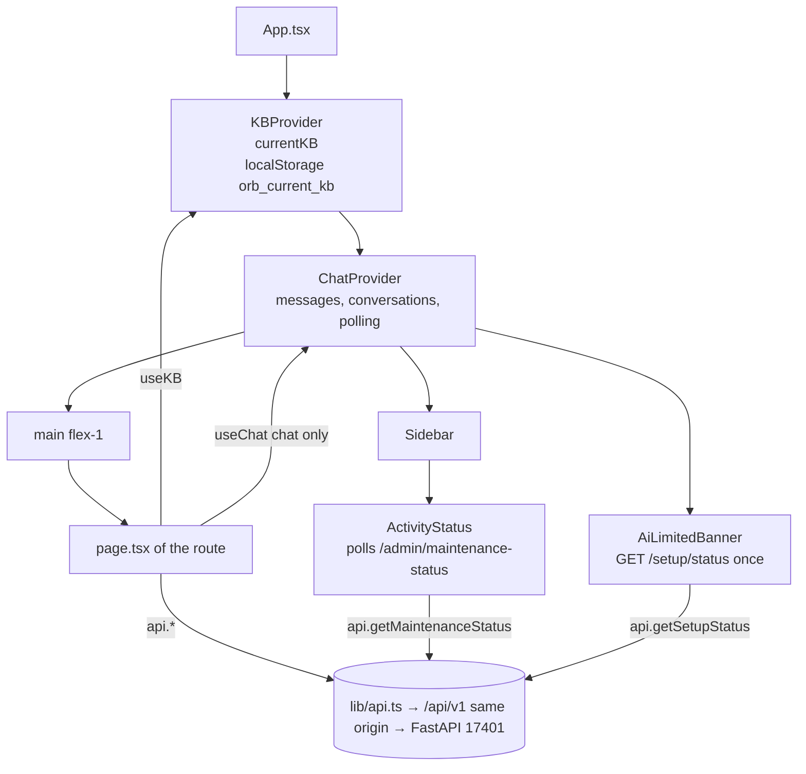
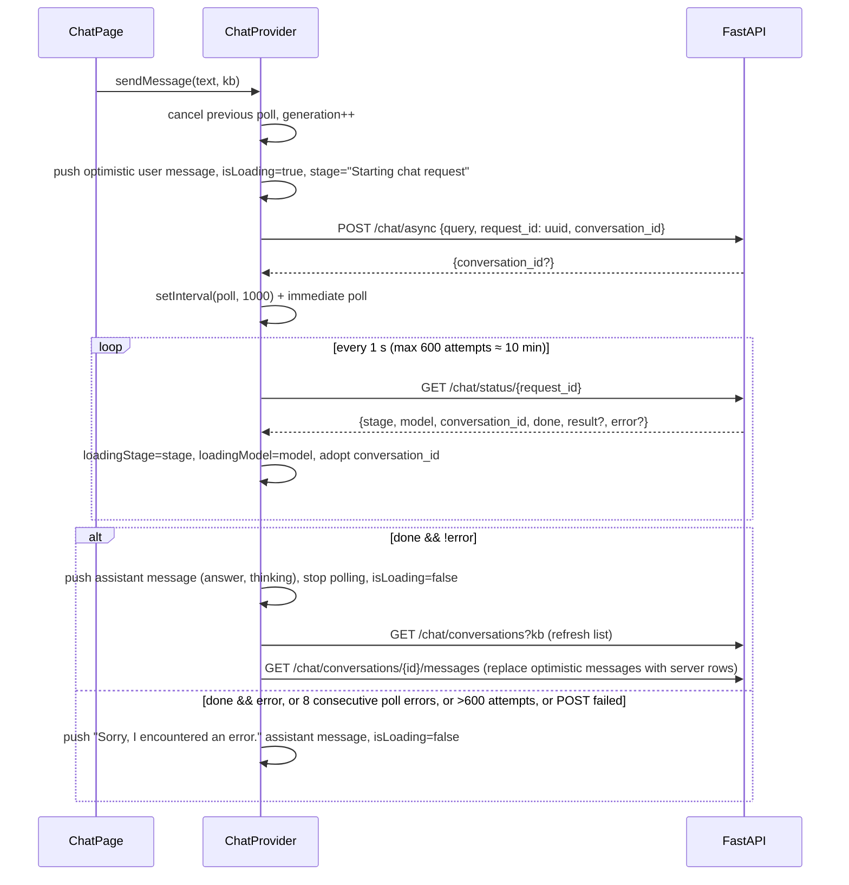

# 18 — Frontend architecture (Vite + React app)

**What this covers.** The structure of the `frontend/` Vite + React application that renders Orb's UI: the toolchain and build modes (Vite dev server on 3700 vs. the static `dist/` build served by the API on 17401), the dev-only Vite proxy for `/api/v1`, `/vault-files` and `/health`, the `src/lib` layer (`api.ts` method catalogue, `types.ts`, `utils.ts`, the Tauri `desktop.ts` bridge, the `KBProvider` and `ChatProvider` React contexts, and the `markdown-entities` pipeline), the root layout and provider tree, the sidebar navigation map, the shared component catalogue (`src/components/*.tsx` and `src/components/graph3d/**`), styling/theme conventions, lint/TypeScript configuration, performance patterns, and step-by-step recipes for adding a page or an API call. Page-level behaviour is documented separately: the notes editor in [19](19-frontend-notes-editor.md) and every other page (home, chat, graphs, KB, settings, setup) in [20](20-frontend-chat-graph-and-pages.md). Finance UI components under `src/components/finance/**` are only referenced here; their behaviour is covered with the finance backend in [17](17-finance-firefly.md).

**Related docs:** [Overview](01-overview.md) · [System architecture](02-system-architecture.md) · [Repository layout](03-repository-layout.md) · [Desktop shell](04-desktop-shell.md) · [Packaging, build & release](05-packaging-build-and-release.md) · [API reference](07-api-reference.md) (section 8 cross-checks `api.ts` against backend routes) · [Knowledge bases & vaults](08-knowledge-bases-and-vaults.md) · [Retrieval & chat](16-retrieval-and-chat.md) · [Finance](17-finance-firefly.md) · [Notes editor](19-frontend-notes-editor.md) · [Chat, graph & pages](20-frontend-chat-graph-and-pages.md) · [Configuration reference](21-configuration-reference.md) · [Development guide](27-development-guide.md) · [Glossary](28-glossary.md)

---

## 1. Responsibilities & boundaries

The frontend is a **pure client of the FastAPI backend**. It owns:

- Rendering every screen of Orb (home, chat, notes, notes graph, 3D entity graph, finance, knowledge bases, setup, settings) as a react-router single-page app (`src/App.tsx`, lazy route chunks). There is no server-side rendering or data fetching of any kind; the API serves `dist/index.html` for every route (history-API fallback).
- The HTTP client (`src/lib/api.ts`) — the **only** place that knows backend paths. Pages never call `fetch` directly except for two deliberate exceptions documented below (`updateNoteOnUnload` keepalive PUT in `api.ts` itself, and `fetchMediaObjectUrl` in `utils.ts` for blob media).
- Client-side state that must outlive a page: the active knowledge base (`KBProvider`, persisted in `localStorage`) and the chat session (`ChatProvider`, in-memory, survives route changes because it is mounted in the root layout).
- The dev-only proxy configuration (`vite.config.ts`) that keeps the browser same-origin with the backend during `npm run dev`; in the desktop app the API serves the build itself.
- The Tauri bridge consumer (`src/lib/desktop.ts`): type-safe access to `window.orbDesktop` with browser fallbacks.

It does **not** own:

- Any business logic about notes, vaults, ingestion, retrieval, graph, finance — all of that lives in the backend; the UI just calls endpoints and renders results.
- Process supervision, ports, `paths.json`, model downloads — the Tauri shell (`desktop/`, see [04](04-desktop-shell.md)) and the desktop runtime/backend do this; the frontend only reflects status.
- Authentication — none exists; the app is local-only.
- Theming toggles — the app is hard-coded dark (`<html class="dark">`, black background).

## 2. Files

All paths are relative to `frontend/`. Files owned by other docs are listed once for orientation only.

| Path | Purpose | Key exports / notes |
|---|---|---|
| `package.json` | Toolchain + deps; `dev` runs `vite --port 3700 --strictPort`, `build` runs `tsc --noEmit && vite build` | scripts `dev`, `build`, `preview`, `lint` |
| `index.html` | Vite entry (`<div id="root">`, `<html class="dark">`, favicon links) | — |
| `vite.config.ts` | `@vitejs/plugin-react` with the React Compiler, `@` alias, dev proxy of `/api/v1`, `/vault-files`, `/health` → `API_PROXY_TARGET` (default `http://127.0.0.1:17401`) | `defineConfig` |
| `tsconfig.json` | Strict TS, `@/*` → `./src/*`, bundler resolution, `vite/client` types | — |
| `eslint.config.mjs` | `@eslint/js` + `typescript-eslint` + `eslint-plugin-react-hooks` flat config, `_`-prefixed unused vars allowed | — |
| `postcss.config.mjs` | Only `@tailwindcss/postcss` | — |
| `public/favicon.ico`, `public/logo.png`, `public/logo-icon.png` | Brand assets referenced from sidebar/chat | — |
| `src/main.tsx` | React root: Inter font import, `globals.css`, `StrictMode`, `BrowserRouter` | — |
| `src/App.tsx` | Providers, sidebar, `CommandPalette`, `AiLimitedBanner`, lazy `<Routes>` (`/` → `/notes`, `/graph` → `/graph-3d`) | `App` |
| `src/app/globals.css` | Tailwind v4 import, typography plugin, black/white tokens, `--font-sans` (Inter Variable), scrollbar CSS | — |
| `src/app/chat/page.tsx` | Chat UI (`/chat`) — see [20](20-frontend-chat-graph-and-pages.md) | `ChatPage` |
| `src/app/graph-3d/page.tsx` | 3D entity graph (`/graph-3d`) composed from `components/graph3d` | `Graph3DPage` |
| `src/app/notes-graph/page.tsx` | 2D wikilink graph (`/notes-graph`) | `NotesGraphPage` |
| `src/app/kb/page.tsx` | Knowledge base management (`/kb`) | `KBPage` |
| `src/app/settings/page.tsx` | "About" tab of the settings sheet: stack summary, data/models folders, data guide (`/settings`) | `SettingsPage` |
| `src/app/setup/page.tsx` | "Storage" tab: bootstrap paths + per-workspace maintenance (`/setup`) — [20](20-frontend-chat-graph-and-pages.md) | `SetupPage` |
| `src/app/models/page.tsx` + `_components/ModelPicker.tsx` | Model choices per KB / system, cloud endpoints, downloads (`/models`) — [20](20-frontend-chat-graph-and-pages.md) | `ModelsPage` |
| `src/app/finance/page.tsx` | Finance workspace shell (`/finance`); components in `components/finance/**` — [17](17-finance-firefly.md) | `FinancePage` |
| `src/app/notes/page.tsx` + `_components/**`, `_hooks/**`, `_lib/**` | Notes editor (`/notes`) — [19](19-frontend-notes-editor.md) | `NotesPage` |
| `src/components/markdown-editor/**` | CodeMirror 6 note editor — [19](19-frontend-notes-editor.md) | `MarkdownNoteEditor` |
| `src/lib/api.ts` | `fetch`-based HTTP client (one `request()` helper); every backend call | `api`, `RequestOpts`, `isRequestCancelled` |
| `src/lib/types.ts` | Wire types shared across pages | `Note`, `ChatStatus`, `ChatSource`, `KnowledgeBase`, `SetupStatus`, finance types, … |
| `src/lib/models-types.ts` | Shapes of `GET /models` and `POST /models/inspect` | `HardwareProfile`, `InstalledModel`, `DownloadableModel`, `ModelsPageState`, `InspectedModel` |
| `src/lib/endpoint-names.ts` | Display names for OpenAI-compatible endpoints (URL fragment profile, `localStorage` fallback `orb.endpointNames`) | `endpointName`, `endpointProfile`, `endpointRequestUrl`, `setEndpointName` |
| `src/lib/utils.ts` | `cn`, `loadJson`/`saveJson`, `useDebounced`, `errMessage`, vault URL helpers (`resolveFileUrl`, `encodeFileUrl`, `vaultRelPath`), media URL classifiers, YouTube/Vimeo embed, blob fetch | see §14 |
| `src/lib/desktop.ts` | Tauri bridge typing + helpers | `getDesktopBridge`, `isDesktopApp`, `pickDesktopDirectory`, `pickDesktopFile`, `notifyIfUnfocused`, `revealInFolder` (API call), `revealInFolderLabel` |
| `src/lib/kb-context.tsx` | Active-KB context, `localStorage` persistence | `KBProvider`, `useKB`, `kbSlug` |
| `src/lib/chat-context.tsx` | Chat session state machine + async polling | `ChatProvider`, `useChat`, `Message` |
| `src/lib/markdown-entities.tsx` | Entity-link injection, URL sanitiser, scan cache hook, anchor renderer | `urlTransform`, `injectEntityLinks`, `useScannedEntities`, `flattenLinkText`, `isAttachmentHref`, `MarkdownAnchor` |
| `src/components/sidebar.tsx` | 232 px left rail: workspace switcher, ⌘K search button, nav, `ActivityStatus`, Settings link | `Sidebar` |
| `src/components/command-palette.tsx` | ⌘K palette (notes search, navigation, workspace switch); opened via a window event | `CommandPalette`, `openCommandPalette` |
| `src/components/settings-shell.tsx` | Settings sheet with a left tab rail (Workspace `/kb`, Models `/models`, Storage `/setup`, About `/settings`) | `SettingsShell`, `SettingRow`, `Toggle` |
| `src/components/ai-limited-banner.tsx` | Bottom banner when `ai_configured` is false | `AiLimitedBanner` |
| `src/components/system-status-indicator.tsx` | Polls `/admin/maintenance-status`; activity row + popover in the sidebar | `ActivityStatus` |
| `src/components/blob-media-player.tsx` | `<video>`/`<audio>`/YouTube/Vimeo player with blob fallback | `BlobMediaPlayer` |
| `src/components/segmented-note-content.tsx` | Renders note markdown split at multimedia markers, with entity + attachment links | `SegmentedNoteContent` |
| `src/components/connected-notes-panel.tsx` | 340 px side panel: mini force-graph of wikilink neighbours or entity subgraph | `ConnectedNotesPanel` |
| `src/components/entity-detail-panel.tsx` | Slide-in panel showing `/graph/3d/node/{id}` details | `EntityDetailPanel` |
| `src/components/graph3d/types.ts` | `KnowledgeNode` | — |
| `src/components/graph3d/nodeColors.ts` | Type → colour map + hashed tail palette | `nodeColor` |
| `src/components/graph3d/ErrorBoundary.tsx` | Class error boundary around the WebGL canvas | `ErrorBoundary` |
| `src/components/graph3d/Graph3DCanvas.tsx` | `react-force-graph-3d` wrapper (`React.lazy` import) | `Graph3DCanvas` |
| `src/components/graph3d/HUD.tsx` | Node/edge counter + controls hint | `HUD` |
| `src/components/graph3d/ProximityLabelLayer.tsx` | DOM overlay of node/link labels | `ProximityLabelLayer`, `ProximityLabel`, `LinkLabel` |
| `src/components/graph3d/GraphSearchOverlay.tsx` | `/`-triggered search box and result list | `GraphSearchOverlay` |
| `src/components/graph3d/GraphModeSwitch.tsx` | Notes ↔ Entities segmented switch shared by both graph pages | `GraphModeSwitch` |
| `src/components/graph3d/NodeDetailModal.tsx` | Centered modal; fetches node detail | `NodeDetailModal` |
| `src/components/graph3d/hooks/useGraph3DData.ts` | Fetch `/graph/3d/full`, adapt to force-graph shape, degree-weighted `val` | `useGraph3DData` |
| `src/components/graph3d/hooks/useProximityLabels.ts` | rAF loop projecting near nodes/links to screen labels | `useProximityLabels` |
| `src/components/graph3d/hooks/useGraph3DCamera.ts` | FPS camera rig (drag look, right-drag pan, wheel, WASD/QE, fly-to) | `useGraph3DCamera` |
| `desktop/build.py` `frontend` stage (repo root) | `npm ci && npm run build`, copies `dist/` to `desktop/resources/frontend/` ([05](05-packaging-build-and-release.md)) | — |
| `backend/app/main.py` `_SpaFiles` mount (repo root) | Serves `FRONTEND_DIR` (default `frontend/dist`) at `/` with `index.html` fallback | — |

## 3. Stack

| Concern | Library / version (from `package.json`) | Where it shows up |
|---|---|---|
| Framework | `vite@^8` + `@vitejs/plugin-react@^6` (`react({ compiler: true })`, `oxc-transform-react`), `react-router-dom@^7` | `main.tsx`, `App.tsx`, all of `src/app` |
| UI runtime | `react@19.2.8`, `react-dom@19.2.8` | — |
| Styling | `tailwindcss@^4` via `@tailwindcss/postcss`, `@tailwindcss/typography` (`prose` classes), `clsx` (exported as `cn`) | `globals.css`, every component |
| Icons | `lucide-react@^1` | everywhere |
| Markdown rendering | `react-markdown@^10` + `remark-gfm@^4` | chat, `SegmentedNoteContent`, notes-graph preview |
| Markdown editing | CodeMirror 6 (`@codemirror/*`, `@lezer/highlight`, `@uiw/react-codemirror`) | `components/markdown-editor` ([19](19-frontend-notes-editor.md)) |
| 3D graph | `three@^0.185`, `react-force-graph-3d@^1.29`, `@types/three` | `components/graph3d` |
| 2D graph | `react-force-graph-2d@^1.29` | `app/notes-graph` |
| HTTP | native `fetch` (one `request()` helper) | `lib/api.ts` only |
| Fonts | `@fontsource-variable/inter` imported in `main.tsx` → `--font-sans` in `globals.css` | everywhere |
| Images | Plain `` from `public/` | logos |
| Lint / TS | `eslint@^9`, `typescript-eslint@^8`, `eslint-plugin-react-hooks@^7`, `typescript@^6` | — |

React Compiler note: because the compiler is enabled in `vite.config.ts`, the compiler auto-memoises components and hooks. The code still uses explicit `useMemo`/`useCallback` in many places (written before/independent of the compiler). `npm run lint` reports 0 warnings. The remaining `eslint-disable` lines are `no-explicit-any` around the loosely typed `react-force-graph-3d` objects, a handful of `exhaustive-deps` on deliberately narrow effects, and four `react-hooks/set-state-in-effect` (`useNotesList`, `useFinanceWorkspace`, `NodeDetailModal`, `EntityDetailPanel`).

## 4. Directory conventions

- **Route = folder** under `src/app/<route>/page.tsx`, registered as a lazy `<Route>` in `src/App.tsx` (the folder convention is inherited from the Next.js era; routing itself is react-router). `/` redirects to `/notes` and `/graph` to `/graph-3d`.
- **Per-route private modules** use underscore folders: `src/app/notes/_components/`, `_hooks/`, `_lib/`, `src/app/models/_components/`. New complex pages should follow it.
- **Cross-route components** live in `src/components/` (flat `kebab-case.tsx` files) or a feature folder (`src/components/graph3d/`, `src/components/finance/`, `src/components/markdown-editor/`). There are no barrel `index.ts` files — import each file by path. Feature folders use `PascalCase.tsx` for components and `hooks/useX.ts` for hooks.
- **Shared non-UI code** lives in `src/lib/` (`api.ts`, `types.ts`, `utils.ts`, `desktop.ts`, contexts, `markdown-entities.tsx`).
- **Imports** always use the `@/` alias (`@/lib/api`, `@/components/graph3d/HUD`); relative imports are only used inside a route's own `_components`/`_hooks`.
- **Cross-route storage keys** are namespaced `orb:<feature>:<kb>` (e.g. `orb:notes-graph-controls:<kb>`, `orb:notes-expanded:<kb>`, `orb:last-note-id:<kb>` from `src/app/notes/_lib/storage-keys.ts`) except the KB key itself, `orb_current_kb`, and `orb.endpointNames`. Reads and writes go through `loadJson`/`saveJson` (`lib/utils.ts`), which swallow missing/blocked storage.
- **No tests** exist in `frontend/` (no jest/vitest/playwright config); see [24](24-testing.md).

## 5. Build modes, ports, and the proxy layer

### 5.1 Two ways the app runs

| Mode | Command / launcher | Port | How `/api/v1` reaches FastAPI |
|---|---|---|---|
| Dev (`cd frontend && npm run dev`, optionally with `ORB_URL=http://127.0.0.1:3700 cargo tauri dev` for the shell) | `vite --port 3700 --strictPort` | 3700 | `vite.config.ts` proxies `/api/v1`, `/vault-files`, `/health` to `API_PROXY_TARGET` (default `http://127.0.0.1:17401`); the browser stays same-origin |
| Desktop / packaged | `npm run build` (`tsc --noEmit && vite build`) → `dist/`, copied by `desktop/build.py` into `desktop/resources/frontend/`; the API mounts it at `/` (`FRONTEND_DIR`) | 17401 (the API's port) | Same origin — no proxy, no UI server, no body-size limit |

There is no Node runtime in the packaged app; Node is used only to build `dist/`. Changing `ORB_API_PORT` needs no frontend rebuild: every URL is relative (`/api/v1`).

### 5.2 `vite.config.ts` in detail

```ts
const api = process.env.API_PROXY_TARGET ?? "http://127.0.0.1:17401";
plugins: [react({ compiler: true })],
resolve: { alias: { "@": path.resolve(import.meta.dirname, "src") } },
server: { proxy: { "/api/v1": …, "/vault-files": …, "/health": … } }   // dev only
```

- `VITE_API_URL` (build-time, `import.meta.env`) can override the `/api/v1` base in `api.ts`; nothing sets it today.
- `dist/` is served by `_SpaFiles` in `backend/app/main.py`: any 404 that is not under `api/` or `vault-files/` returns `index.html`, which is what makes deep links like `/notes?note=…` work on reload.

## 6. API layer — `src/lib/api.ts`

### 6.1 Construction

```ts
const API_BASE_URL = (import.meta.env.VITE_API_URL ?? "/api/v1").replace(/\/$/, "");
```

All URLs are `${API_BASE_URL}${path}`. Nothing else in the codebase constructs backend URLs (the notes editor's `rewrite-vault-urls.ts` only rewrites *media* hrefs to `/vault-files/...`, which is a rewrite, not the API).

Helpers:

| Helper | Behaviour |
|---|---|
| `withKb(kb, params?)` | Returns `{...params, kb}` **only when `kb` is truthy and not `"default"`**; returns `undefined` if the result is empty. Used for GETs whose params become the query string. |
| `kbQuery(kb)` | Returns `"?kb=<encoded>"` or `""` under the same rule. Used when the path is built by string concatenation (POST/PUT/DELETE and GETs with path params). |
| `http.get/post/put/patch/del` | Thin wrappers over one `request()` built on `fetch`: query params skip `null`/`undefined`, JSON and `FormData` bodies, `signal`, an optional `timeout` (via `AbortSignal.timeout`) and a `text` response mode. A non-2xx status throws an `Error` carrying `response.status` and the parsed `response.data`. |
| `isRequestCancelled(err)` | `err instanceof DOMException && err.name === "AbortError"`. Callers that abort in effect cleanups use this to avoid surfacing spurious errors (e.g. notes list hook). |

Consequences of the `"default"` rule: the default KB is addressed by **omitting** `kb`; the backend's `get_kb` dependency resolves a missing param to the default KB ([07 §3.3](07-api-reference.md)). Never send `kb=default` explicitly from new code — it is harmless but breaks the "omit means default" symmetry used in tests and logs.

No interceptors, base headers or retry logic exist. Every method surfaces the thrown error; pages typically inspect `err.response?.data?.detail` (or use `errMessage` from `lib/utils.ts`) (kb page, setup page) or swallow it.

### 6.2 Method catalogue

Method signature → HTTP call. `kb` defaults to `"default"` everywhere it appears. Detailed request/response schemas and the cross-check against actual backend routes are in [07 §6 and §8](07-api-reference.md); this table is the frontend-side index.

**Chat**

| Method | Call | Notes |
|---|---|---|
| `startChat(query, kb, requestId?, conversationId?)` | `POST /chat/async?kb=` body `{query, request_id, conversation_id}` | `conversation_id` becomes `undefined` (omitted) when null/empty. Caller supplies `request_id` (UUID) so polling can start immediately. |
| `getChatStatus(requestId): ChatStatus` | `GET /chat/status/{requestId}` | No `kb`. |
| `listChatConversations(kb): ChatConversation[]` | `GET /chat/conversations?kb=` | |
| `getChatMessages(conversationId, kb): ChatMessageRecord[]` | `GET /chat/conversations/{id}/messages?kb=` | |
| `deleteChatConversation(conversationId, kb)` | `DELETE /chat/conversations/{id}?kb=` | |
| `exportChat(conversationId, format="markdown")` | `GET /chat/conversations/{id}/export?format=` | `json` → parsed body via `http.get`; `markdown` → `http.get(..., { text: true })`, returns string. |

**File storage**

| Method | Call | Notes |
|---|---|---|
| `upload(file, kb, folder?)` | `POST {base}/upload?kb=&folder=` multipart `file`, `timeout: 10 min`; `folder` = the note's vault folder so the file lands under `attachments/<folder>/` | Same origin (`API_BASE_URL`); no proxy in between (§6.4). |

**Notes / vault**

| Method | Call | Notes |
|---|---|---|
| `getNotes(search?, processed?, failed?, kb, opts?)` | `GET /notes` params `search`, `processed`, `failed`, `kb` | Only defined params are sent. Cancellable. |
| `getNote(id, kb)` | `GET /notes/{id}?kb=` | |
| `getNoteStatus(id, kb): NoteStatus` | `GET /notes/{id}/status?kb=` | |
| `createNote(content, created_at?, kb, title?, folder?)` | `POST /notes?kb=` body `{content, created_at, title, folder}` | `folder` omitted when empty. |
| `updateNote(id, content, created_at?, kb, title?)` | `PUT /notes/{id}?kb=` body `{content, created_at, title}` | |
| `updateNoteOnUnload(id, content, kb, title?)` | `fetch(PUT, keepalive:true)` if body `< 60_000` chars else plain `http.put` | Synchronous fire-and-forget for `beforeunload`/`pagehide`; keepalive bodies are capped ~64 KB by browsers, so large notes fall back to a normal PUT that may be killed. Does **not** send `created_at`. |
| `moveNote(id, folder, kb)` | `POST /notes/{id}/move?kb=` `{folder}` | |
| `ingestNote(id, kb)` | `POST /notes/{id}/ingest?kb=` | |
| `deleteNote(id, kb)` | `DELETE /notes/{id}?kb=` | |
| `cancelIngest(id, kb)` | `POST /notes/{id}/ingest/cancel?kb=` | Note returns to "Saved". |
| `dismissNoteFailure(id, kb)` | `POST /notes/{id}/dismiss-failure?kb=` | Clears `failed` without re-ingesting. |
| `processAttachment(noteId, url, force=false, kb)` | `POST /notes/{id}/attachments/process?kb=` `{url, force}` | Runs transcription/description/extraction for one attachment now. |
| `cancelAttachment(noteId, url, kb)` | `POST /notes/{id}/attachments/cancel?kb=` `{url}` | |
| `getAttachmentJobs(noteId, kb)` | `GET /notes/{id}/attachments/jobs?kb=` | `{jobs: Record<url, AttachmentJob>}`; polled by `useAttachmentJobs`. |
| `batchDeleteNotes(ids, kb)` | `POST /notes/batch-delete?kb=` `{ids}` | Max 100 ids (server rule). Returns `{deleted, failed, deleted_count, failed_count}`. |
| `reingestVault(kb)` | `POST /notes/reingest-vault?kb=` | |
| `moveVaultFile(fromRel, toRel, kb)` | `POST /vault/move?kb=` `{from_rel, to_rel}` | |
| `deleteVaultFile(relPath, kb)` | `POST /vault/delete?kb=` `{rel_path}` | |
| `listVaultFolders(kb)` | `GET /vault/folders?kb=` | Returns `{folders, attachments?, vault_name?, vault_path?}`. |
| `mkdirVaultFolder(path, kb)` | `POST /vault/mkdir?kb=` `{path}` | |
| `resolveVaultLocalPath(relOrUrl, kb)` | `GET /vault/local-path?rel=&kb=` | Returns `{rel_path, local_path, vault_path, exists}`; used before `revealInFolder`. |

**Entity graph (Kuzu)**

| Method | Call | Notes |
|---|---|---|
| `getGraph3DFull(kb, opts?)` | `GET /graph/3d/full?kb=` | Returns `{nodes:[{node_id,name,node_type,description,facts,community_id?,x,y,z}], edges:[{source,target,type}]}`. TS type declares `facts` but the backend omits it (07 §8). Cancellable. |
| `getNodeDetail(nodeId, kb)` | `GET /graph/3d/node/{encoded id}?kb=` | Returns description, `isolated_contexts`, `facts`, `domain`, `status`, `community_id/name`, `connections[]`, `related_notes[]`. |
| `searchEntities(q, kb, limit=5)` | `GET /graph/entities/search?q=&limit=&kb=` | Autocomplete for `@` mentions in the editor. |
| `scanTextEntities(text, kb, opts?)` | `POST /graph/entities/scan-text?kb=` `{text}` | Cancellable. Used by `useScannedEntities`. |
| `getNoteEntitySubgraph(text, kb, opts?)` | `POST /graph/entities/note-subgraph?kb=` `{text}` | Returns `NotesGraphPayload`. |

**Notes graph (wikilinks)**

| Method | Call | Notes |
|---|---|---|
| `getNotesGraph(kb, opts?)` | `GET /graph/notes?kb=` | Returns `NotesGraphPayload`; the backend rebuilds `note_links` on every call (07 §8). Cancellable. |
| `getNoteNeighbors(noteId, kb, opts?)` | `GET /graph/notes/{encoded id}/neighbors?kb=` | Cancellable. |
| `rebuildNotesGraph(kb)` | `POST /graph/notes/rebuild?kb=` | |

**Knowledge bases**

| Method | Call | Notes |
|---|---|---|
| `listKBs()` | `GET /kb` | `{knowledge_bases: KnowledgeBase[]}` |
| `createKB(name, vaultPath?)` | `POST /kb` `{name, vault_path}` | `vault_path` omitted when empty (server rejects that; UI enforces it). |
| `renameKB(id, name)` | `PATCH /kb/{id}` `{name}` | |
| `deleteKB(id)` | `DELETE /kb/{id}` | |
| `setKBFinance(id, enabled)` | `PATCH /kb/{id}/finance` `{enabled}` | Shows/hides the Finance surface; deletes nothing. |
| `getKBLLM(id): KBLLMConfig` | `GET /kb/{id}/llm` | Per-KB chat/ingestion LLM override + effective config + `providers` + `local_models` (uncommitted as of 2026-09-02; not yet in 07 §8). |
| `updateKBLLM(id, {provider?, model?, ingestion_model?, base_url?})` | `PATCH /kb/{id}/llm` | Empty string / `null` clears a field back to "inherit Settings"; `base_url` only matters for `openai_compat`. Returns the same `KBLLMConfig`. |
| `emptyKB(kb)` | `POST /kb/empty?kb=` `{}` | Note: addressed by **slug**, not id. |
| `deleteAllNonDefaultKBs()` | `POST /kb/delete-non-default` `{}` | Returns `{removed[], errors[], removed_count, message}`. |

**Setup / paths / models**

| Method | Call | Notes |
|---|---|---|
| `getSetupStatus(): SetupStatus` | `GET /setup/status` | Used by banner, setup, settings. |
| `getModelCatalog(chatId?)` | `GET /setup/model-catalog?chat_id=` | |
| `saveSetupPaths({data_dir, models_dir, default_vault_path?})` | `POST /setup/paths` | |
| `downloadModels(includeMultimodal=true, chatId?, {multimodalOnly?})` | `POST /setup/download-models` `{include_multimodal, chat_id, multimodal_only}` with **`timeout: 0`** | Multi-GB; the request stays open until the backend finishes. |
| `selectChatModel(chatId)` | `POST /setup/select-chat-model` `{chat_id}` | |
| `getMultimodalStatus()` | `GET /setup/multimodal-status` | Response typed as `unknown`; setup page reads `.models` record. |

**LLM runtime settings**

| Method | Call | Notes |
|---|---|---|
| `getLLMSettings()` | `GET /settings` | `{provider, model, ingestion_model, base_url}` |
| `updateLLMSettings(partial)` | `PATCH /settings` | `{provider?, model?, base_url?}` (the response still carries `ingestion_model`, equal to `model`); the Models page sends only what changed. |

**Models page / credentials / desktop**

| Method | Call | Notes |
|---|---|---|
| `getModelsPage(kb): ModelsPageState` | `GET /models?kb=` | One read for every control on `/models` (`models-types.ts`). |
| `inspectModelPath(path): InspectedModel` | `POST /models/inspect` `{path}` | `{ref, path, name, size_gb, warnings}` — no format field; a folder resolves to the GGUF inside it. |
| `getCredentials()` | `GET /credentials` | `{providers: {…: {configured, source}}, known[], endpoints[]}`; keys are never returned. |
| `setEndpointCredential(baseUrl, apiKey)` | `PUT /credentials/endpoint` `{base_url, api_key}` | Empty key is sent as `"not-needed"`. |
| `deleteEndpointCredential(baseUrl)` | `DELETE /credentials/endpoint?base_url=` | |
| `getEndpointModels(baseUrl)` | `GET /llm/endpoint-models?base_url=` | Model ids an OpenAI-compatible server serves. |
| `revealInFolder(path)` | `POST /desktop/reveal` `{path}` | See §9. |

**Maintenance / admin**

| Method | Call | Notes |
|---|---|---|
| `getMaintenanceStatus(kb)` | `GET /admin/maintenance-status?kb=` | `{community_detection:{running}, temporal_digests:{running}, ingestion?:{active}, boot?:{status,ts?}, healthy?}` |
| `rebuildCommunities(kb)` | `POST /admin/rebuild-communities?kb=` `{}` | |
| `buildTemporalDigests(period?, kb)` | `POST /admin/build-temporal-digests?kb=` `{period: period ?? null}` | |
| `resetIngestionData(kb)` | `POST /admin/reset-ingestion-data?kb=` `{}` | |
| `reingestAll(kb)` | `POST /admin/reingest-all?kb=` `{}` | Returns `notes_queued`. |

**Finance** (thin proxies to Firefly III; UI in `components/finance/**`, backend in [17](17-finance-firefly.md))

| Method | Call |
|---|---|
| `getFinanceWorkspace(kb)` | `GET /finance/workspace?kb=` |
| `createFinanceWorkspace(currency, kb)` | `POST /finance/workspace?kb=` `{currency}` |
| `resetFinanceAdministration(kb)` | `POST /finance/reset-administration?kb=` `{}` |
| `listFinanceAccounts(kb)` / `createFinanceAccount(data, kb)` | `GET`/`POST /finance/accounts` |
| `listFinanceTransactions(kb, accountId?)` / `createFinanceTransaction(data, kb)` / `deleteFinanceTransaction(id, kb)` | `GET /finance/transactions?account_id=` / `POST` / `DELETE /finance/transactions/{id}` |
| `getFinanceSummary(kb, days=30)` | `GET /finance/summary?days=` |
| `getFinanceReport(kb, start?, end?)` | `GET /finance/report?start=&end=` |
| `listFinanceBudgets(kb, days=30)` / `createFinanceBudget(data, kb)` | `GET /finance/budgets?days=` / `POST` |
| `listFinanceCategories` / `createFinanceCategory` / `deleteFinanceCategory` | `/finance/categories[/{id}]` |
| `listFinanceRecurrences` / `createFinanceRecurrence` / `deleteFinanceRecurrence` | `/finance/recurrences[/{id}]` |
| `listFinanceRuleGroups` / `createFinanceRuleGroup` / `deleteFinanceRuleGroup` | `/finance/rule-groups[/{id}]` |
| `listFinanceRules` / `createFinanceRule` / `deleteFinanceRule` | `/finance/rules[/{id}]` |
| `searchFinance(query, kind="transactions", kb)` | `GET /finance/search?query=&kind=` |

### 6.3 Cancellation pattern

Every read that can be superseded (KB switch, typing, unmount) follows the same idiom:

```ts
useEffect(() => {
  let cancelled = false;
  const controller = new AbortController();
  api.getX(kb, { signal: controller.signal })
    .then((d) => { if (!cancelled) setState(d); })
    .catch((e) => { if (!cancelled && !isRequestCancelled(e)) setError(...); });
  return () => { cancelled = true; controller.abort(); };
}, [kb]);
```

`cancelled` guards against late resolution; `controller.abort()` actually stops the request so the backend can stop building large payloads (notes graph, 3D graph). Pages that use imperative loaders instead of effects (notes-graph `loadGraph`) keep a generation counter (`loadGenRef`) plus an `AbortController` ref and ignore results whose generation is stale.

### 6.4 Uploads

`api.upload(file, kb, folder?)` POSTs multipart to `${API_BASE_URL}/upload` (query `kb=` and, when the note is in a folder, `folder=`) with a 10-minute timeout. There is no separate upload origin any more: the API serves the UI, so uploads are same-origin with no proxy body limit in between.

## 7. Root layout and provider tree

`src/main.tsx` renders `<StrictMode><BrowserRouter><App /></BrowserRouter></StrictMode>` into `#root`; `src/App.tsx`:

```tsx
<KBProvider>
  <ChatProvider>
    <div className="flex h-screen w-full overflow-hidden">
      <Sidebar />
      <main className="relative flex min-w-0 flex-1">
        <Routes>{/* lazy page chunks; / → /notes, /graph → /graph-3d */}</Routes>
      </main>
    </div>
    <CommandPalette />
    <AiLimitedBanner />
  </ChatProvider>
</KBProvider>
```

Title, description and icons live in `index.html` (`<html class="dark">`). Because both providers sit above `{children}`, their state persists across client-side navigations (chat messages survive leaving `/chat` and coming back; the KB survives everything until reload, and then is rehydrated from `localStorage`).



Data flow rule: **KB slug flows down via context; every network call takes it as an explicit argument.** There is no global default for `kb`, so a component that forgets to pass `currentKB` silently talks to the default KB.

## 8. Providers

### 8.1 `KBProvider` / `useKB()` — `src/lib/kb-context.tsx`

Context value:

| Field | Type | Meaning |
|---|---|---|
| `currentKB` | `string` | KB **slug** (`"default"` for the built-in KB). This is what goes into `?kb=`. |
| `currentKBName` | `string` | Display name (sidebar label, chat badge, settings text). |
| `kbs` | `KnowledgeBase[]` | Every workspace, from `GET /kb`; refreshed on mount and by `refreshKBs()` (the sidebar switcher calls it when opened). A failed list (backend not up yet) is swallowed. |
| `currentKBRecord` | `KnowledgeBase \| null` | The active workspace's row (matched by `kbSlug(k) === slug \|\| k.name === slug`); `currentKBName` prefers its `name` over the stored one. |
| `refreshKBs()` | fn | Re-fetch `kbs`. |
| `setCurrentKB(slug, displayName?)` | fn | Trims; empty → `"default"`; name defaults to slug; writes storage. |
| `setCurrentKBName(name)` | fn | Updates only the name (after a rename); writes storage. |

Persistence: key **`orb_current_kb`**, value `JSON.stringify({slug, name})`, written through `saveJson` in `lib/utils.ts`. `readStorage()`:

1. Reads `orb_current_kb` and parses `{slug, name}` (missing `slug` → `"default"`, missing `name` → the slug). No other key or format is read.
2. Absent key or any exception (no `localStorage`, bad JSON) → `{slug:"default", name:"default"}`.

`kbSlug(kb)` is the slug the app stores for a workspace record: `"default"` for the built-in KB, else `kb.slug` (required on the wire — nothing derives a slug from the name client-side).

The provider initialises its state from storage in a lazy `useState` initialiser, so the first render already has the stored KB and pages fetch the right KB on their first effect. There is no hydration flag (a leftover from the Next.js era) and nothing to gate on.

Who reads it: `sidebar`, `command-palette`, `system-status-indicator`, `chat`, `graph-3d`, `notes-graph`, `kb`, `models`, `setup`, `finance`, `notes/_hooks/useNotesPageController`. Who writes it: the sidebar workspace switcher, the command palette and `kb/page.tsx` (switch, delete, delete-all, rename).

### 8.2 `ChatProvider` / `useChat()` — `src/lib/chat-context.tsx`

State model:

| State | Type | Notes |
|---|---|---|
| `messages` | `Message[]` = `{id, role:"user"\|"assistant", content, timestamp: Date, thinking?}` | Optimistic local ids `local-user-<ts>`, `local-assistant-<ts>`, `local-error-<ts>`; replaced by server ids after `getChatMessages` refresh. |
| `conversations` | `ChatConversation[]` | From `GET /chat/conversations?kb=`. |
| `activeConversationId` | `string \| null` | `null` = "new chat" (server creates one on first send). Mirrored into `activeConversationIdRef` so `sendMessage` reads the latest value without re-creating the callback. |
| `isLoading` | boolean | A send is in flight (blocks further sends and disables the input). |
| `isLoadingConversations` | boolean | Conversation list fetch in flight (disables the `<select>`). |
| `loadingStage` | `string \| null` | Latest `ChatStatus.stage` string from the backend (rendered verbatim in the "thinking" bubble). |
| `loadingModel` | `string \| null` | Latest `ChatStatus.model`. |

Actions:

| Action | Behaviour |
|---|---|
| `initializeForKb(kb)` | Lists conversations; if any, selects the **first** (most recent per backend ordering) and loads its messages; else clears. Called by the chat page whenever `currentKB` changes after hydration. |
| `loadConversations(kb)` | Refresh list only; on error sets `[]`. |
| `selectConversation(id, kb)` | Loads messages; on error still switches `activeConversationId` and shows an empty list (the `kb` param is unused — `_kb`). |
| `startNewConversation()` | `activeConversationId=null`, `messages=[]`. |
| `deleteActiveConversation(kb)` | If nothing active → behaves like new conversation. Else `DELETE`, removes from local list, selects the next remaining conversation or clears, then reloads the list. Errors abort silently. |
| `sendMessage(text, kb)` | The async request/poll state machine below. |

`sendMessage` state machine:



Constants: `POLL_INTERVAL_MS = 1000`, `POLL_MAX_ATTEMPTS = 600`, `POLL_MAX_CONSECUTIVE_ERRORS = 8`. A successful poll resets the consecutive-error counter. Guards: `finished` (terminal state reached) and `isStale()` (a newer `sendMessage` bumped `sendGenerationRef`) short-circuit every callback; `pollCleanupRef` holds the current `stopPolling` so a new send or provider unmount cancels the interval. The `request_id` is generated client-side with `crypto.randomUUID()` (fallback: timestamp + random hex) — this is why polling can begin before the POST body is even parsed server-side.

Edge cases:
- `sendMessage` is a no-op while `isLoading` is true or `text` is blank — there is no queue.
- If the final `getChatMessages` refresh fails, the optimistic messages remain (server ids are never learned for that turn, so "thinking" toggles keyed by message id still work because the local id is stable).
- Because `ChatProvider` is global, switching KB on `/kb` does not reset chat state; the chat page's `initializeForKb` effect does that on next visit.
- Conversation title comes only from the server list; the UI never renames.

### 8.3 Why contexts instead of a store

Both providers were written to avoid a state library dependency: KB needs only a slug + name; chat needs a small state machine with refs for polling. There is no Redux/Zustand/React Query. Server data is fetched per page with effects; only chat and KB are cached across routes. (History: `ChatProvider` was extracted from the chat page so the poll continued while navigating away — commit `2c10d8d "Improve KB handling, Qdrant, LLM async, ingestion"` introduced the async `/chat/async` + status polling; the consecutive-error/attempt caps came with `b84ca73 "Speed up chat, notes UI, and graph writes from deferred audit work"`.)

## 9. Desktop bridge surface — `src/lib/desktop.ts`

The Tauri shell injects `window.orbDesktop` from `desktop/src-tauri/src/init.js`; the type `OrbDesktopBridge` mirrors it. `getDesktopBridge()` returns `window.orbDesktop || null`. Only what the shell alone can do lives on the bridge; everything else is an API call.

| Bridge member | Used by (frontend) | Fallback when absent |
|---|---|---|
| `isDesktop?: boolean` | `isDesktopApp()` → file-preview button label | `false` → button says "Open" |
| `pickDirectory(opts)` | `pickDesktopDirectory()` → setup page "Browse…", kb page vault "Browse…", `ModelPicker` | Returns `null`; the pages hide the Browse button when `getDesktopBridge()?.pickDirectory` is falsy |
| `pickFile(opts)` | `pickDesktopFile()` → `ModelPicker` (a `.gguf` outside the models dir) | Returns `null` |
| `restartBackend()` | `ActivityStatus` popover "Restart backend" button (shown only in the error tones) | Button not rendered |
| `notify(title, body)` | `notifyIfUnfocused()` → `useNotesList` when a note finishes or fails ingestion and the window is not focused | No-op |

`revealInFolder(path)` is **not** a bridge member: it calls `POST /api/v1/desktop/reveal`, which validates that the path lies under `DATA_DIR`, `MODELS_DIR` or a KB vault and runs the platform's reveal command ([07 §3.9](07-api-reference.md)). `revealInFolderLabel()` picks "Reveal in Finder" / "Reveal in Explorer" / "Reveal in folder" from `navigator.userAgent`. The frontend first calls `api.resolveVaultLocalPath(url, kb)` to translate a `/vault-files/...` URL into an absolute path, then hands that to the API.

## 10. Sidebar navigation map — `src/components/sidebar.tsx`

A 232 px `aside` (`border-r`, `bg-bg-deep/40`) inside the root flex row; `main` takes the rest. Top to bottom:

1. **Workspace switcher** — a button showing the logo, `currentKBName` and the vault folder's basename; click opens a popover listing `kbs` (letter swatch, name, vault path, a check on the active one), plus "New workspace" (`/kb?new=1`) and "Workspace settings" (`/kb`). Opening it calls `refreshKBs()`; a `useDismiss` hook closes it on outside click or Escape.
2. **Search button** — "Search or jump to… ⌘K" → `openCommandPalette()` (`command-palette.tsx` listens for the `orb:palette` window event).
3. **Navigation** (`nav` array):

| Label | href | Icon (lucide) | Active when `pathname.startsWith` |
|---|---|---|---|
| Notes | `/notes` | `NotebookPen` | `/notes` |
| Ask | `/chat` | `MessageCircle` | `/chat` |
| Graph | `/graph-3d` | `Network` | `/graph-3d`, `/notes-graph` |
| Finance | `/finance` | `Wallet` | `/finance` — rendered only when `currentKBRecord.finance_enabled !== false` |

4. **Bottom**: `ActivityStatus` (§15) and a "Settings" link to `/kb`, highlighted when the path starts with `/kb`, `/models`, `/setup` or `/settings` (the four tabs of `SettingsShell`).

Active state is a prefix match, so `/notes?note=…` and nested routes highlight their section. Home (`/`) and `/graph` are redirects, not entries.

## 11. Shared component catalogue — `src/components/*.tsx`

| Component | Props | Purpose / behaviour | Endpoints | Used by |
|---|---|---|---|---|
| `Sidebar` | — | Navigation rail (see §10). | `GET /kb` (via `refreshKBs`) | `App.tsx` |
| `ActivityStatus` (`system-status-indicator.tsx`) | — | Sidebar activity row + popover; see §15. | `GET /admin/maintenance-status?kb=` | `Sidebar` |
| `CommandPalette` | — | ⌘K palette: searches notes (`GET /notes?search=`), jumps to pages, switches workspace; writes `orb:last-note-id:<kb>` before navigating to a note. | `GET /notes` | `App.tsx` |
| `SettingsShell` | `title`, `intro?`, `children` | Card with a left tab rail (Workspace / Models / Storage / About) used by `/kb`, `/models`, `/setup`, `/settings`; also exports `SettingRow` and `Toggle`. | — | those four pages |
| `AiLimitedBanner` | — | Fixed bottom banner when AI is not configured; see §16. | `GET /setup/status` (once per mount) | `App.tsx` |
| `BlobMediaPlayer` | `url`, `kbId="default"`, `kind:"video"\|"audio"`, `className?` | Renders an `<iframe>` when `youtubeEmbedUrl`/`vimeoEmbedUrl` match; otherwise a `<video controls playsInline>` / `<audio controls>` whose `src` is `resolveFileUrl(url, kbId)`. On the first `onError` it retries **once** by `fetchMediaObjectUrl` → `blob:` object URL (handles moov-at-end MP4s and proxies that mishandle Range); a second failure shows "Could not play this video/audio." Object URLs are revoked on unmount/url change, including when the blob resolves after unmount. | `GET /vault-files/...` (media) | chat file preview, `SegmentedNoteContent`, notes `FilePreviewModal` |
| `SegmentedNoteContent` | `content`, `onFileClick(url, filename)`, `onEntityClick?(nodeId, name)`, `proseClassName`, `kb="default"` | Note-content renderer used for read-only previews. Splits `content` on the `<!-- orb:extract -->` blocks produced by ingestion (kind and label read from each block's header line) into `Segment{type,label,content}`; each non-text segment gets a coloured `SegmentDivider` pill (image blue, pdf amber, audio emerald, video purple) and each segment is rendered by `ReactMarkdown` + `remark-gfm` with `urlTransform` and a custom `a` renderer. Entity scan (`useScannedEntities`) runs only when `onEntityClick` is provided; matches are injected as `entity://` links before rendering. Link renderer: `entity://<id>` → blue pill button; attachment links (text starting with 📎/🎤 or `isAttachmentHref`) render inline ``, `BlobMediaPlayer` (video), `<iframe>` (pdf) or a purple file button, all calling `onFileClick(resolvedUrl, filename)`; everything else → `MarkdownAnchor`. Empty content renders `*Empty note*`. | `POST /graph/entities/scan-text` (when entity clicks enabled) | chat note-preview modal |
| `EntityDetailPanel` | `nodeId: string\|null`, `name?`, `kb="default"`, `onClose` | Inline column panel (`flex h-full flex-col animate-rise`) — the host decides where it sits (notes right column, chat aside); renders nothing while `nodeId` is null. When set, fetches `api.getNodeDetail` and shows: type icon + name + type/community line, description, up to 6 `isolated_contexts`, all `facts`, `domain`, up to 10 `connections` (`← relationship` for incoming), `related_notes` under "Mentioned in", or "Nothing stored for this entity yet. Re-ingest the note…". Fetch errors are swallowed (`detail` stays null → "Entity details unavailable"). Footer is a react-router `Link` to `/graph-3d` ("Open in graph"). | `GET /graph/3d/node/{id}?kb=` | chat, notes "Open in graph" links to `/graph-3d?node=<id>`, which flies to and selects that node. |
| `ConnectedNotesPanel` | `noteId`, `noteContent`, `kb`, `onClose`, `onSelectNote?(id)`, `onSelectEntity?(nodeId, name)`, `className?` | 340 px right-hand `aside` with two modes: **Note** (`GET /graph/notes/{id}/neighbors`, refetched on `noteId`/`kb` only — deliberately *not* on content) and **Nodes** (`POST /graph/entities/note-subgraph` with the note text, debounced 500 ms while typing, aborted on change). Runs its own tiny force simulation in React state (`SimNode` with repulsion `700/d²`, spring to an ideal length `70 + hash%50`, centring `0.008`, damping 0.86→0.92, max 180 frames or until max speed < 0.05) inside a 320×420 SVG. Seeded layout (`hashSeed(noteId:mode:layoutNonce)`) so re-opening gives the same picture; "Shuffle" bumps `layoutNonce`. Node colours: centre/entities purple, wikilink notes teal, `type === "missing"` red (ids prefixed `missing:` are not clickable). | see left | notes page |

### 11.1 `src/components/graph3d/**` (3D entity graph building blocks)

Composed only by `src/app/graph-3d/page.tsx`; the page-level behaviour (payload shape, camera, labels, search, modal) is described in [20 §4](20-frontend-chat-graph-and-pages.md). Summary of responsibilities:

| Export | Kind | Responsibility |
|---|---|---|
| `KnowledgeNode` | type | `{node_id, name, node_type, description, isolated_contexts?, facts?, domain?, status?, community_id?, x, y, z}` |
| `nodeColor(type)` | fn | Case-insensitive switch over ~40 known types (`concept` cyan, `entity` purple, `community` fuchsia, `task` rose, `reference` amber, `person` emerald, `note` blue, …); unknown types get a deterministic colour from a 24-entry `TAIL_PALETTE` via a `h*31+c` hash; empty type → slate `#94a3b8`. |
| `ErrorBoundary` | class component | Catches render errors from the WebGL canvas, shows message + "Retry" (resets state). |
| `Graph3DCanvas` | component | `React.lazy` import of `react-force-graph-3d`; fixed prop set (`nodeRelSize=10`, `nodeResolution=18`, `linkWidth=2.8`, `linkOpacity=0.72`, `linkCurvature=0.1`, 2 directional particles, `enableNodeDrag=false`, `enableNavigationControls=false`, `cooldownTicks=0`, `warmupTicks=0`); colours links by **source** node type; `onEngineStop` calls `zoomToFit(400,120)` exactly once guarded by `hasFittedRef`/`userNavigatedRef`. |
| `HUD` | component | Top-left node/edge counters; bottom-centre controls legend. Pure. |
| `ProximityLabelLayer` | component | Absolutely-positioned DOM labels (`ProximityLabel{id,name,nodeType,sx,sy,opacity}`, `LinkLabel{id,label,sx,sy,opacity}`), `pointer-events:none`, z-20. |
| `GraphSearchOverlay` | component | Top-right "Search /" button → input + up to 8 results; Enter flies to the first, click flies to that node, Escape/blur closes. Uses `onMouseDown preventDefault` on results so the input's blur does not close the list before click. |
| `GraphModeSwitch` | component | `{mode: "notes" \| "entities"}` segmented control of two `Link`s (`/notes-graph`, `/graph-3d`); rendered by both graph pages. |
| `NodeDetailModal` | component | Fixed full-screen backdrop (z-999) + card tinted with `nodeColor`; fetches `getNodeDetail` on `node.node_id` change (deps intentionally exclude `node`/`kb`), merges `{...node, ...detail}`; on error falls back to the click payload. Shows description, first 4 contexts, community, up to 8 connections, domain. |
| `useGraph3DData(kb)` | hook | Fetches `/graph/3d/full`, maps `node_id→id`, pins positions via `fx/fy/fz`, computes degree-weighted `val = 1 + min(8, degree)`, drops dangling edges, mirrors nodes/links into refs, builds `nodeTypeMapRef`, resets fit flags on every load. |
| `useProximityLabels({...})` | hook | rAF loop throttled to 100 ms: projects nodes within an adaptive radius (`max(150, extent*0.55, camDist*0.22)`) to screen space, top 16 nearest, opacity `(zoomLike - textFade + 0.35)/0.7` with `textFade` read from `localStorage["orb:notes-graph-controls:<kb>"]` (shared with the 2D graph, default 0.55); link labels within 55 % of that radius, top 8, skipping `MEMBER_OF`. Uses CSS pixel dimensions (`clientWidth`) not buffer size to avoid DPR offset. |
| `useGraph3DCamera({...})` | hook | Polls every 100 ms until the force-graph exposes `camera()/renderer()`, then disables the built-in `OrbitControls` and installs an FPS rig on `window`: left-drag = yaw/pitch (quaternion from YXZ Euler, pitch clamped ±(π/2−0.01)), right-drag = pan scaled by camera distance, wheel = fly along view axis (distance-scaled, deltaMode-normalised), WASD/Q/E = continuous move loop, `/` or Ctrl/Cmd+K = toggle search. 5 px drag threshold distinguishes click from drag; `handleNodeClick` ignores clicks that ended a drag. `flyToNode` animates 1.2 s cubic-ease to eight node radii from the target (80 units for a leaf) while looking at it. Every user input sets `userNavigatedRef` so `zoomToFit` never fires again. |

## 12. Styling and theme

- **Dark only.** `<html class="dark">` is hard-coded in `index.html`; there is no light palette, no `prefers-color-scheme` handling, no theme toggle.
- **Tailwind v4** via `@import "tailwindcss"` + `@plugin "@tailwindcss/typography"`; no `tailwind.config.js` — configuration is CSS-first in `src/app/globals.css`. A `@theme` block defines the "Nocturne" tokens every colour resolves to: `--color-bg`, `--color-bg-deep`, `--color-surface`, `--color-text`, `--color-divider`, `--color-danger[-text]`, an `--color-accent` scale (100–900, violet) and a neutral `--color-n-*` scale (100–900), plus `--radius-*`, `--shadow-*` and `--animate-rise`. Components use them as utilities (`bg-surface`, `text-n-500`, `text-accent`, `border-divider`, `shadow-sm`, `animate-rise`).
- **Font**: Inter Variable from `@fontsource-variable/inter` (imported in `main.tsx`), set as `--font-sans`, so `font-sans` = Inter; `--font-mono` is the system monospace stack. The graph3d components and HUD use inline `style={{fontFamily:"system-ui"}}` and inline CSS objects instead of Tailwind — they were written to be self-contained.
- **Component classes** (`@layer components` in `globals.css`): `.btn` variants (`btn-primary`, `btn-secondary`, `btn-ghost`, `btn-danger`, `btn-sm`, `btn-icon`), `.input`, `.field`, `.card`, `.card-outline`, `.popover`, `.menu-item`, `.tag`, `.kicker`, `.dot`, `.pane-header`/`.pane-title`, `.screen`, `.seg`/`.seg-opt`, `.hr-fade`, and the modal classes `.dialog`, `.dialog::backdrop`, `.dialog-title`, `.dialog-body`, `.dialog-actions`. Modals are native `<dialog>` elements opened with `showModal()`; the browser's top layer handles stacking, so there is no backdrop `<div>` or z-index juggling.
- **`.tree-row`** sets `content-visibility: auto; contain-intrinsic-size: auto 50px` — the notes sidebar renders every row and lets the browser skip layout for off-screen ones ([19 §9.3](19-frontend-notes-editor.md)).
- **Prose**: `react-markdown` output is styled with `.prose-orb` (chat, note previews) and `PREVIEW_PROSE` in notes-graph; `not-prose` is applied to embedded media blocks and segment dividers so typography margins do not apply.
- `cn()` is `clsx` re-exported; use it for conditional class joins. Nothing passes conflicting Tailwind utilities through it, so no merge step is needed.

## 13. `src/lib/types.ts` listing

| Type | Shape (fields) | Produced by |
|---|---|---|
| `Note` | `id, title, content, created_at, updated_at?, processed?, failed?, processing_stage?, processing_model?, rel_path?` (vault-relative path e.g. `Life/Daily Log/2024-07-07.md`) | `GET /notes`, `GET /notes/{id}` |
| `FilePreview` | `url, filename, type: "image"\|"pdf"\|"audio"\|"video"\|"other"` | client-side (chat/notes preview modals) |
| `NotePreview` | `id, title, content` | client-side (chat note modal) |
| `NoteStatus` | `id, processed, failed, status, processing_stage?, processing_model?` | `GET /notes/{id}/status` |
| `AttachmentJob` | `status: "running"\|"done"\|"failed"\|"cancelled", error?` | `GET /notes/{id}/attachments/jobs` |
| `ChatStatus` | `request_id, conversation_id?, stage, model?, done?, result?{answer?, sources?: ChatSource[], thinking?, conversation_id?, assistant_message_id?}, error?` | `GET /chat/status/{id}` |
| `ChatConversation` | `id, kb_id, title, created_at?, updated_at?` | `GET /chat/conversations` |
| `ChatSource` | `id, title` — a note the answer drew on | `sources` on chat results and stored messages |
| `ChatMessageRecord` | `id, conversation_id, role, content, sources?: ChatSource[], thinking?, created_at?` | `GET /chat/conversations/{id}/messages` |
| `EffectiveLLM` | `provider, model: string\|null, ingestion_model: string\|null, base_url?, inherited: boolean` (`inherited=true` → KB follows Settings; `base_url` set for `openai_compat`) | embedded in `KnowledgeBase.effective_llm`, `KBLLMConfig.effective` and `ModelsPageState.global` |
| `KnowledgeBase` | `id, name, slug, vault_path?, kuzu_path?, qdrant_col_cores?, typesense_collection?` (legacy field name from the Typesense era; now Meilisearch), `created_at`, per-KB override `llm_provider?, llm_model?, llm_ingestion_model?` (null = inherit), `effective_llm?`, `finance_enabled?` (default true) | `GET /kb` |
| `LocalChatModel` | `id, label, size_gb, source: "catalog"\|"discovered", architecture?, context_length?, warnings?` — a chat GGUF on this machine; no format/runnable fields (GGUF is the only local format) | inside `KBLLMConfig.local_models` |
| `KBLLMConfig` | `kb_id, override{provider, model, ingestion_model, base_url?}` (nullable), `effective: EffectiveLLM`, `providers: string[]`, `endpoints?: string[]` (endpoints with a saved key), `local_models: LocalChatModel[]` (the only local models a KB may pin) | `GET/PATCH /kb/{id}/llm` |
| `FinanceAccount`, `FinanceTransaction`, `FinanceBudget`, `FinanceCategory`, `FinanceRecurrence`, `FinanceRuleGroup`, `FinanceRule`, `FinanceSearchResult`, `FinanceWorkspace`, `FinanceSummary`, `FinanceReport` | Firefly-derived shapes; see [17](17-finance-firefly.md) | `/finance/*` |
| `NotesGraphPayload` | `nodes:{id, title, type, rel_path?}[]` (`type` is `"note"` or `"missing"`), `edges:{source,target,type}[]`, `center_id?` | `/graph/notes`, `/graph/notes/{id}/neighbors`, `/graph/entities/note-subgraph` |
| `SetupStatus` | `data_dir, models_dir, paths_json?, default_vault_path?, active_vault_path?, ai_configured, local_models_ready?, multimodal_ready?, database_backend, llm_provider?` — no AI-mode field; readiness is derived server-side from real facts | `GET /setup/status` |

Types that live outside `types.ts`: `Message` (`chat-context.tsx`), `ScannedEntity` (`markdown-entities.tsx`), `KnowledgeNode` (`components/graph3d/types.ts`), `OrbDesktopBridge` (`desktop.ts`), the Models page shapes in `models-types.ts` (`HardwareProfile`, `InstalledModel` — `ref, path, label, architecture, size_gb, context_length, shards, warnings`, no format/runnable/unsupported_reason — `DownloadableModel`, `ModelsPageState`, `InspectedModel`), notes-graph's `GraphNode/GraphLink/Controls`, and the notes editor's `_lib/types.ts`. Several `api.ts` methods declare their return shape inline instead of in `types.ts` (`getGraph3DFull`, `getNodeDetail`, `listVaultFolders`, `resolveVaultLocalPath`, `batchDeleteNotes`, `emptyKB`, `deleteAllNonDefaultKBs`, `getMaintenanceStatus`, `getCredentials`).

## 14. `src/lib/utils.ts`

| Function | Behaviour |
|---|---|
| `cn(...inputs)` | `clsx` re-exported under that name. |
| `loadJson(key, fallback)` / `saveJson(key, value)` | `localStorage` JSON read/write; missing, invalid or blocked storage yields `fallback` / is silently dropped. Every persisted preference goes through these. |
| `useDebounced(value, ms)` | Returns `value` once it has held still for `ms` (notes search box, 300 ms). |
| `errMessage(err, fallback)` | FastAPI `detail` from `err.response.data` (string, or a validation array joined with `; `), else `err.message`, else `fallback`. |
| `resolveFileUrl(url, kbId="default")` | Returns `/vault-files/...` unchanged; converts `attachments/<x>` to `/vault-files/<encoded kb>/attachments/<x>`; anything else passthrough. No normalisation or repair — stored links are canonical (the one-time vault sweep `vault_sync.migrate_vault_files` rewrote legacy ones). |
| `isImageUrl` / `isVideoUrl` / `isAudioUrl` / `isPdfUrl` / `isTextUrl` / `isTabularUrl` | Extension regexes applied to the URL-decoded string, tolerant of `?query`: `jpg jpeg png gif webp svg avif bmp ico` / `mp4 webm mov m4v ogv` / `m4a m4b mp3 wav ogg oga opus aac flac weba` / `pdf` / `txt md markdown log json yaml yml xml ini cfg toml` / `csv tsv`. The lists are what **Chromium actually decodes**, not what the pipeline accepts: `.mkv` and `.avi` ingest fine but are deliberately absent (Chromium cannot demux Matroska or AVI, so a `<video>` would render a permanently broken player), and HEIC/HEIF are absent for the same reason. |
| `youtubeEmbedUrl(url)` | `youtu.be/<id>`, `youtube.com/watch?v=`, `/embed/`, `/shorts/`, `m.`/`youtube-nocookie` hosts → `https://www.youtube-nocookie.com/embed/<id>`; id must match `^[\w-]{6,}$`; else `null`. |
| `vimeoEmbedUrl(url)` | `vimeo.com`/`player.vimeo.com` numeric path segment → `https://player.vimeo.com/video/<id>`; else `null`. |
| `encodeFileUrl(relPath)` | Percent-encodes a freshly uploaded raw vault-relative path (`attachments/<sub>/<file>`, the upload response's `rel_path`) for a markdown link — `encodePathSegment` per segment, which also escapes `()[]` so `Report (2026).pdf` survives inside `[…](…)`. Encode-only, no decode round-trip — so it runs exactly once, at insert time (`useNoteMedia`), never on links read back from a note. Inserted links are vault-relative with no leading slash; the workspace UUID is never written into a note. |
| `vaultRelPath(target)` | The decoded vault-relative path of a note link target in either stored form: strips an optional `/vault-files/<kb>/` prefix, then decodes each segment. `attachments/x%20y.pdf` and `/vault-files/<kb>/attachments/x%20y.pdf` both give `attachments/x y.pdf`. The one place that derivation lives (`handleDeleteFile`, `extractKey`). |
| `fetchMediaObjectUrl(url, kbId)` | Returns external `http(s)` URLs as-is; otherwise `fetch(resolveFileUrl(url, kbId))` → `URL.createObjectURL(blob)`; throws on non-OK. Caller must revoke. |

Rule of thumb used across pages: `resolveFileUrl(raw, currentKB)` is the canonical "make this note attachment reference loadable" transform on read; `vaultRelPath(raw)` is the canonical "which vault file is this" transform; `encodeFileUrl` is applied once to an upload response's `rel_path` before insertion.

## 15. `ActivityStatus` — polling and states

`system-status-indicator.tsx` exports `ActivityStatus`, mounted once inside `Sidebar`. `useMaintenanceStatus(currentKB)` polls `api.getMaintenanceStatus(currentKB)` with adaptive `setTimeout` scheduling (re-armed by `tick` when "Restart backend" completes):

| Condition | Next poll in |
|---|---|
| Any job active (`ingestion.active > 0`, `community_detection.running`, `temporal_digests.running`) | 4 000 ms |
| Idle | 30 000 ms |
| Request failed | 5 000 ms (so a restart shows up quickly) |
| `document.visibilityState === "hidden"` | skip the request, reschedule in 30 s |
| Tab becomes visible | clear timer, poll immediately |

Displayed state (`buildStatus`) — first match wins:

| Tone | Label | Trigger | Detail text |
|---|---|---|---|
| `error` | Backend offline | request got no HTTP answer | "Could not reach the API. It may be restarting." |
| `error` | Backend error | request answered with an error status | "The API is up but its status call failed — check errors.log." |
| `idle` | Checking… | no payload yet | "Waiting for backend status." |
| `idle` (busy bar) | `boot.status` verbatim | `boot.status` present (desktop runtime still starting services) | "Local services are still starting. Notes work now; …" |
| `ingest` (pulsing) | Ingesting N note(s) | `ingestion.active > 0` | "Extracting entities and links into the graph." |
| `community` (pulsing) | Rebuilding communities | `community_detection.running` | meta shows `pending_nodes` when > 0 |
| `digest` (pulsing) | Building digests | `temporal_digests.running` | |
| `idle` | Ready | otherwise | "No ingestion or community jobs running." |

The row shows the dot, label and meta; clicking opens a popover with the detail text, a "Restart backend" button in the error tone (desktop only — `bridge.restartBackend`), and a static line of what runs locally (Chat · Qwen3-ASR · Vision via chat model · the current KB slug).

The Storage page (`/setup`) runs a second, independent poller on the same endpoint (3 s while its own rebuild runs / 15 s idle) to drive its Rebuild button state; it does not share state with the indicator.

## 16. `AiLimitedBanner` gating

On mount: one `GET /setup/status`. Shows when `ai_configured === false`; hides on request failure. One message: "No model configured yet — notes work; chat, ingest and the graph need one." with a "Choose a model" link to `/models`. "Dismiss" hides it for the life of the layout.

## 17. Performance patterns

| Pattern | Where | Why |
|---|---|---|
| Abort superseded requests (`AbortController` + `cancelled` flag, or generation counters) | `useGraph3DData`, `useScannedEntities`, `ConnectedNotesPanel`, notes-graph `loadGraph`, notes list hooks | KB switches and fast typing otherwise leave the backend building payloads nobody renders and can deliver stale data last. |
| Bounded module-level cache for entity scans (`scanCache`, FIFO, 200 entries, keyed `kb:messageId`) | `markdown-entities.tsx` | Re-rendering a conversation or reopening a note used to re-POST identical text to `/graph/entities/scan-text`. |
| Scan only the last 5 assistant messages (`ENTITY_SCAN_RECENT_LIMIT`) | chat page | Loading a long conversation fired one scan per message. |
| Debounce content-derived requests (500 ms) | `ConnectedNotesPanel` nodes mode, notes editor hooks | Typing must not hit the network per keystroke. |
| Key neighbour-graph fetch on `noteId` not `noteContent` | `ConnectedNotesPanel` note mode | Same reason. |
| Adaptive polling with visibility pause | `ActivityStatus` (4 s/30 s), Storage-page maintenance (3 s/15 s), chat status (1 s, capped), attachment jobs (3 s only while one runs) | The indicator mounts on every page; a fixed fast poll would be a constant background load. |
| Refs mirroring state for rAF loops (`nodesRef`, `linksRef`, `controlsRef`) | graph3d hooks, notes-graph `paintNode` | Animation loops must not close over stale state or re-subscribe every render. |
| Fit-once guards (`hasFittedRef`, `userNavigatedRef`, `fittingRef`) | both graph pages | `onEngineStop`/resize re-firing `zoomToFit` yanked the camera back to overview while the user was navigating. |
| Throttled projection loop (100 ms) and hard label caps (16 nodes / 8 links) | `useProximityLabels` | Projecting every node every frame was too expensive on large graphs. |
| `keepalive` PUT on unload (< 60 KB) | `updateNoteOnUnload` | Autosave must survive window close. |
| `React.lazy` import for WebGL/canvas libs | `Graph3DCanvas`, notes-graph | keeps `three` / `react-force-graph-*` out of the initial chunk. |
| `content-visibility: auto` rows instead of a virtualiser | notes `VaultFolderTree` (`.tree-row`) | Off-screen rows skip layout/paint with no measuring code and no dependency. |
| `loading="eager"` logos | sidebar/chat | Avoid layout shift on the rail. |

## 18. Lint and TypeScript configuration

- `tsconfig.json`: `strict: true`, `target ES2020`, `module esnext`, `moduleResolution bundler`, `jsx react-jsx`, `isolatedModules`, `allowJs`, `skipLibCheck`, `noEmit`, `types: ["vite/client"]`, `@/* → ./src/*`; includes `src` and `vite.config.ts`. `npm run build` runs `tsc --noEmit` first.
- `eslint.config.mjs` (flat config): `@eslint/js` recommended + `typescript-eslint` recommended + `eslint-plugin-react-hooks` flat recommended; ignores `dist/**`; `@typescript-eslint/no-unused-vars` downgraded to **warn** with `argsIgnorePattern: "^_"` / `varsIgnorePattern: "^_"` (hence `_kb`, `_node`, `_m` in the code). `npm run lint` = `eslint` (no path args; relies on the flat config's defaults).
- The graph3d code uses `any` for `react-force-graph-3d` objects (its types are loose) with per-line `@typescript-eslint/no-explicit-any` disables — accepted debt; do not widen it elsewhere.
- No Prettier config is committed; formatting is whatever the editor produced (`kb/page.tsx`, `settings/page.tsx`, `kb-context.tsx`, `segmented-note-content.tsx` use 4-space indentation, the rest 2-space). Match the file you are editing.

## 19. How to add a page or an API call

**New page**
1. Create `src/app/<route>/page.tsx` exporting a default component, and add a lazy `<Route>` for it in `src/App.tsx`.
2. Read the KB with `const { currentKB } = useKB()`; it is correct on the first render.
3. Put route-private pieces in `src/app/<route>/_components`, `_hooks`, `_lib`.
4. Wrap the page in `<div className="screen">` (full-height flex row) — or in `SettingsShell` if it belongs to the settings sheet; content sits inside the flex `<main>` automatically (`App.tsx` does it).
5. Register the route in the `nav` array of `src/components/sidebar.tsx` (label, href, lucide icon, `match` prefixes) or in `TABS` of `settings-shell.tsx`. Active highlighting is a path-prefix match.
6. If the page shows KB-scoped data, pass `currentKB` to every `api.*` call — nothing does this for you.
7. If the page pulls in a heavy library (three.js, force-graph), import it with `React.lazy` so it stays out of the initial chunk.

**New API call**
1. Add a method to the `api` object in `src/lib/api.ts` under the matching `// ── Domain ──` comment. Use `http.get(path, withKb(kb, params), opts)` for GETs with query params, and `` `${path}${kbQuery(kb)}` `` for POST/PUT/PATCH/DELETE. Give it `kb = "default"` as the last positional parameter unless the endpoint is global (setup, settings, kb list). Add `opts?: RequestOpts` if the call can be superseded.
2. Put the response shape in `src/lib/types.ts` when more than one file will use it; inline it otherwise.
3. Document it in [07 §8](07-api-reference.md) (the frontend↔backend cross-check) so the mapping stays auditable.
4. Never hardcode `/api/v1` or a port in a page; never call `fetch` from a page.

**New shared component**: `src/components/<kebab-name>.tsx` (or a feature folder; import files by path, no barrels), props typed inline, KB passed explicitly (`kb`/`kbId` prop with `"default"` default), no context reads inside leaf components except `useKB` in navigation chrome.

## 20. Invariants, constraints, and locked decisions

- **Client-only rendering.** A static Vite build; no server code in `frontend/`. The backend must remain reachable from the browser at `/api/v1` (same origin: the API serves the build).
- **`api.ts` is the single HTTP boundary** (two documented exceptions: keepalive PUT inside `api.ts`, blob fetch of `/vault-files` in `utils.ts`).
- **`kb` is omitted for the default KB** (`withKb`/`kbQuery`); the backend interprets absence as default. Never introduce a global default header.
- **KB slug in storage key `orb_current_kb`** as `{slug,name}` JSON. Do not add a second source of truth for the active KB.
- **Providers stay in `App.tsx`** so chat polling and the KB survive navigation. Do not move `ChatProvider` into `/chat`.
- **Every URL is relative** (`/api/v1`, `/vault-files`). Never hardcode a host or port in the frontend; the API port is the UI origin.
- **Attachment links are stored vault-relative** (`attachments/<sub>/<file>`, percent-encoded segments, no `/vault-files/<kb>/` prefix). `encodeFileUrl` runs once at insert time; `resolveFileUrl` runs at every read site; `vaultRelPath` derives the decoded path when the API needs one. Readers must keep accepting the legacy absolute form.
- **The bridge stays minimal** (`isDesktop`, `pickDirectory`, `pickFile`, `restartBackend`, `notify`). Anything that can be an HTTP call must be one — the Tauri capability file grants the UI exactly those plugin commands.
- **Entity links are `entity://<node_id>`** markdown links injected client-side; `urlTransform` must keep allowing that scheme and nothing else beyond `http(s)/irc(s)/mailto/xmpp` and relative URLs (XSS boundary for ingested web content).
- **External links open outside the app** (`MarkdownAnchor` adds `target=_blank rel=noopener noreferrer`) so ingested content cannot navigate the app window away (the Tauri navigation guard also sends foreign URLs to the system browser).
- **`react-force-graph-*` are lazily imported** (`React.lazy`); keep them out of the initial chunk.
- **Fit-once camera rule** on both graph pages; any new "auto-fit" must respect `userNavigatedRef`.
- **No light theme.** Colour tokens assume a black background.

## 21. Gotchas and non-obvious behaviours

- `npm run dev` proxies to `http://127.0.0.1:17401` by default; set `API_PROXY_TARGET` to point it at an API on another port, or every request 502s.
- Old notes that embed `/files/…` links (RustFS era) will 404; `isAttachmentHref` recognises only `/vault-files/` and a leading `attachments/`, so they render as plain `MarkdownAnchor` links.
- `KnowledgeBase.typesense_collection` is the historical field name; the value refers to the Meilisearch index.
- `AiLimitedBanner` checks `/setup/status` once per layout mount; after finishing setup the banner persists until a full reload, and "Dismiss" is not persisted.
- `useProximityLabels` reads the **notes-graph** control key `orb:notes-graph-controls:<kb>` for `textFade`; adjusting "Text fade threshold" on `/notes-graph` also changes label fade on `/graph-3d`.
- `cooldownTicks={0}` / `warmupTicks={0}` on the 3D canvas mean the force engine does **not** run — positions come pre-computed from the backend (`x,y,z` pinned via `fx/fy/fz`). Removing `fx/fy/fz` would make the graph collapse to the origin.

## 22. History / rationale

- `3f21e08` "Ship LifeOS as a Docker-free desktop app with in-app data cleanup" — introduced the desktop bridge, the (since removed) Next.js standalone build and proxy layer, and the settings-page cleanup actions; the container/`rustfs` targets became legacy at this point.
- `2c10d8d` "Improve KB handling, Qdrant, LLM async, ingestion" — async chat (`/chat/async` + status polling) and the KB context.
- `6162be2` "Rebrand LifeOS / LiveOS to Orb across product and docs" — storage key `orb_current_kb` with migration from `lifeos_current_kb`/`liveos_current_kb` (that migration has since been removed); bridge name `orbDesktop` (the `liveosDesktop` fallback has since been dropped).
- `6365686` "Add entity mention highlighting & editor" — `entity://` link injection and `EntityDetailPanel`.
- `b84ca73` "Speed up chat, notes UI, and graph writes from deferred audit work" — `ENTITY_SCAN_RECENT_LIMIT`, `scanCache`, poll caps in `ChatProvider`, adaptive status polling.
- `f8f527f` "Harden security and fix data-loss and perf issues from full-codebase audit" — `urlTransform` scheme allow-list, external-link hardening, fit-once camera guards, blob revoke on unmount.
- `fbcafe7` "Align codebase with Orb desktop product and drop legacy Docker-era paths" — `graph3d` extraction into hooks/components, and a `SuppressThreeWarnings` component that has since been deleted.
- 2026-09: per-KB LLM override (`EffectiveLLM`, `KBLLMConfig`, `api.getKBLLM/updateKBLLM`); the original `KBModelPanel` on `/kb` has since been folded into the `/models` page — see [20 §6](20-frontend-chat-graph-and-pages.md).
- Tauri migration (2026-09): Next.js replaced by Vite + react-router; the API serves `dist/`; the bridge shrank to pickers, restart and notifications; reveal-in-folder and credentials became API calls.
- 2026-09-19/20 dependency and band-aid removal: `axios` → native `fetch`; `tailwind-merge`, `framer-motion`, `class-variance-authority`, `@tanstack/react-virtual` dropped (`clsx`, CSS animations, native `<dialog>`, `content-visibility` instead); the Next.js-era hydration flag, the barrel files and `SuppressThreeWarnings` deleted; `errMessage`/`loadJson`/`saveJson`/`useDebounced` consolidated in `lib/utils.ts`; attachment links made vault-relative with `encodeFileUrl`/`resolveFileUrl`/`vaultRelPath` as the only URL transforms.
