# Frontend: Notes Page and Markdown Editor

**What this covers.** The `/notes` route of the Vite + React frontend: the three-region notes workspace (vault sidebar, editor column, side panels), the `useNotesPageController` hook hub and the hooks it composes (list, selection, autosave, ingest, vault tree, media, batch selection, wikilink preview, restore effects, attachment jobs), the pure helpers in `frontend/src/app/notes/_lib/`, the CodeMirror 6 based `MarkdownNoteEditor` and its extensions (markdown highlighting, live-preview mark hiding, entity highlighting, `[[wikilink]]` autocomplete/hover/click, inline media embeds, collapsible extraction blocks, toolbar commands), the read-only `SegmentedNoteContent` renderer, `ConnectedNotesPanel`, `EntityDetailPanel`, `BlobMediaPlayer`, and the notes/vault/graph-entity methods of the API client. It cross-checks every frontend call against the backend contracts in `backend/app/api/notes.py`, `backend/app/api/vault.py`, `backend/app/api/graph.py` and `backend/app/services/wikilinks.py`.

Related docs: [Frontend architecture](18-frontend-architecture.md) · [Chat, graph and other pages](20-frontend-chat-graph-and-pages.md) · [Notes, wikilinks and vault files (backend)](09-notes-wikilinks-and-vault-files.md) · [Knowledge bases and vaults](08-knowledge-bases-and-vaults.md) · [Ingestion pipeline](10-ingestion-pipeline.md) · [API reference](07-api-reference.md) · [Desktop shell](04-desktop-shell.md) · [Decisions and constraints](26-decisions-and-constraints.md) · [Glossary](28-glossary.md)

## 1. Responsibilities and boundaries

**Owns**

- Everything under `frontend/src/app/notes/` (page, `_components`, `_hooks`, `_lib`).
- The reusable editor package `frontend/src/components/markdown-editor/` (also consumed only by the notes page today).
- Read-only note rendering (`segmented-note-content.tsx`) used by the notes side panels and by the chat/graph pages.
- The right-hand side panels `connected-notes-panel.tsx` and `entity-detail-panel.tsx`, and the `blob-media-player.tsx` used inside previews and embeds.
- Client-side wikilink resolution (`_lib/wikilinks.ts`) — a mirror of the backend resolver's precedence rules so hover/click work without a round-trip.

**Does not own**

- The API client itself (`frontend/src/lib/api.ts`) and the `Note` type (`frontend/src/lib/types.ts`) — documented in [18-frontend-architecture.md](18-frontend-architecture.md); only the notes/vault/graph-entity methods are described here.
- KB context (`frontend/src/lib/kb-context.tsx`), `frontend/src/lib/utils.ts` URL helpers (`resolveFileUrl`, `vaultRelPath`, `encodeFileUrl`, `isImageUrl`…) and `frontend/src/lib/desktop.ts` (`revealInFolder`) — see 18.
- Backend note persistence, vault watcher, title/filename sync and wikilink `note_links` — see [09](09-notes-wikilinks-and-vault-files.md).
- Ingestion itself — see [10](10-ingestion-pipeline.md). The page only queues and polls.

## 2. Files

| Path | Purpose | Key exports |
|---|---|---|
| `frontend/src/app/notes/page.tsx` | Thin client view; composes sidebar, header, attachments strip, editor, panels, modals from the controller. | `NotesPage` (default) |
| `frontend/src/app/notes/_hooks/useNotesPageController.ts` | Hub: instantiates all hooks, bridges circular deps with stable refs, owns create/delete/reingest/delete-attachment handlers and panel state. | `useNotesPageController` |
| `frontend/src/app/notes/_hooks/useNotesList.ts` | Notes array, search/filter state, `fetchNotes` (abortable, request-id guarded), initial fetch + KB switch + debounced search effects. | `useNotesList`, `VaultListing` |
| `frontend/src/app/notes/_hooks/useNoteSelection.ts` | Selected note + dirty-baseline refs, list↔selection sync, `openNoteById`, `refreshSelectedNote`, content/title change handlers; `useNoteSelectHandler` (save-then-load). | `useNoteSelection`, `useNoteSelectHandler`, `NoteSelectionApi` |
| `frontend/src/app/notes/_hooks/useNoteAutosave.ts` | 1.5 s debounced PUT, in-flight race handling, flush on unmount and `beforeunload`. | `useNoteAutosave`, `NoteAutosaveApi` |
| `frontend/src/app/notes/_hooks/useNoteIngest.ts` | Ingest button handler, `ingestingNoteIds` set, 5 s status poll. | `useNoteIngest` |
| `frontend/src/app/notes/_hooks/useVaultTree.ts` | Expanded-folder state (persisted per KB), selected folder, drag state, multi-file selection, vault listing, move/rename/mkdir/delete flows for notes, files and folders, `useNoteRestoreEffects` (URL `?note=`, sessionStorage restore, bfcache/visibility refresh). | `useVaultTree`, `useNoteRestoreEffects` |
| `frontend/src/app/notes/_hooks/useNoteMedia.ts` | Upload/attach, voice recording (MediaRecorder), file preview modal, reveal-in-Finder, created_at date change. | `useNoteMedia` |
| `frontend/src/app/notes/_hooks/useNoteBatchSelection.ts` | Checkbox multi-select and batch delete. | `useNoteBatchSelection` |
| `frontend/src/app/notes/_hooks/useWikilinkPreview.ts` | Hover card state, click → resolve or create missing note. | `useWikilinkPreview` |
| `frontend/src/app/notes/_hooks/useAttachmentJobs.ts` | Per-attachment "process now" jobs for the open note: start/cancel, seed from the server on note switch, 3 s poll while one runs, refresh the note when a job finishes. | `useAttachmentJobs` |
| `frontend/src/app/notes/_lib/types.ts` | Page-local types. | `ProcessedFilter`, `FolderTreeNode`, `VaultFileEntry`, `WikilinkPreviewState`, `FolderDialogState`, `RenameDialogState`, `NoteAttachment` |
| `frontend/src/app/notes/_lib/wikilinks.ts` | Client wikilink normalisation, insert-target disambiguation, autocomplete scoring, indexed resolver. | `normalizeLink`, `folderOf`, `noteVaultPath`, `noteDisplayName`, `wikilinkInsertTarget`, `suggestWikilinkNotes`, `parseWikilinkCreateTarget`, `WikilinkResolver`, `resolveNoteByWikilink`, `WikilinkSuggestion` |
| `frontend/src/app/notes/_lib/folder-tree.ts` | Builds the sidebar tree from `Note.rel_path` + extra folders. | `buildFolderTree` |
| `frontend/src/app/notes/_lib/processing-status.ts` | Maps `processing_stage` strings to UI states. | `getProcessingLabel`, `isPendingReingestNote`, `isActiveProcessingNote` |
| `frontend/src/app/notes/_lib/rewrite-vault-urls.ts` | Single-pass rewrite of vault file paths inside note markdown after move/rename. | `rewriteVaultPathsInContent` |
| `frontend/src/app/notes/_lib/parse-note-attachments.ts` | Regex extraction of `` / `[📎…]()` / `[🎤…]()` links. | `parseNoteAttachments` |
| `frontend/src/app/notes/_lib/media-recorder.ts` | Picks a supported `MediaRecorder` MIME type. | `pickSupportedAudioMimeType` |
| `frontend/src/app/notes/_lib/storage-keys.ts` | sessionStorage key for last-opened note per KB (the expanded-folders key lives in `useVaultTree`). | `lastNoteStorageKey` |
| `frontend/src/app/notes/_components/NotesSidebar.tsx` | Left column (288 px): "Notes" pane header with new-folder/new-note buttons, filter input + "needs ingest" toggle, batch bar, vault tree, empty state, footer count. | `NotesSidebar` |
| `frontend/src/app/notes/_components/VaultFolderTree.tsx` | Folder/note tree flattened to rows (`content-visibility` skips off-screen ones) with drag-drop for notes, files and folders, and a nested attachments section. | `VaultFolderTree` |
| `frontend/src/app/notes/_components/VaultFileRow.tsx` | One attachment row (click/rename/delete, draggable, ⌘-click multi-select). | `VaultFileRow` |
| `frontend/src/app/notes/_components/NotesBatchBar.tsx` | Select-all / delete-selected bar. | `NotesBatchBar` |
| `frontend/src/app/notes/_components/NoteStatusBadge.tsx` | Per-note status pill (Saved / Ingesting / Ingested / Failed / Pending). | `NoteStatusBadge` |
| `frontend/src/app/notes/_components/NotesEmptyState.tsx` | Empty sidebar / empty editor placeholders. | `NotesEmptyState` |
| `frontend/src/app/notes/_components/NoteEditorHeader.tsx` | Toolbar row: folder, live/source view switch, attach, record, ingest/cancel, connected panel, overflow menu (date, reveal, delete). | `NoteEditorHeader`, `ViewMode` |
| `frontend/src/app/notes/_components/DatePickerModal.tsx` | `created_at` editor. | `DatePickerModal` |
| `frontend/src/app/notes/_components/FilePreviewModal.tsx` | Image/PDF/video/audio/other preview with reveal button. | `FilePreviewModal` |
| `frontend/src/app/notes/_components/FolderDialog.tsx` | New-folder prompt. | `FolderDialog` |
| `frontend/src/app/notes/_components/RenameDialog.tsx` | Rename vault file prompt. | `RenameDialog` |
| `frontend/src/app/notes/_components/WikilinkHoverCard.tsx` | Fixed-position preview card for `[[links]]`. | `WikilinkHoverCard` |
| `frontend/src/components/markdown-editor/MarkdownNoteEditor.tsx` | CodeMirror host component (controlled value, drop/paste upload, toolbar, imperative handle). No barrel — import this file directly (default export). | `MarkdownNoteEditor` (default), `MarkdownNoteEditorHandle`, `MarkdownNoteEditorProps` |
| `frontend/src/components/markdown-editor/MarkdownToolbar.tsx` | Formatting toolbar. | `MarkdownToolbar` |
| `frontend/src/components/markdown-editor/markdownCommands.ts` | Toolbar/keybinding commands (wrap, heading, list, link, code block…). | command functions + `markdownKeymap` |
| `frontend/src/components/markdown-editor/markdownHighlight.ts` | Highlight style + editor theme. | `markdownHighlightStyle`, `markdownEditorTheme` |
| `frontend/src/components/markdown-editor/livePreviewHideMarks.ts` | Hides markdown syntax marks on non-active lines. | `livePreviewHideMarks` |
| `frontend/src/components/markdown-editor/visibleLineChunks.ts` | Helper to iterate visible ranges line-by-line for decorations. | `forEachVisibleLine` (name verified below) |
| `frontend/src/components/markdown-editor/entityExtension.ts` | Entity-name decorations + click/hover → detail panel. | `entityExtension` |
| `frontend/src/components/markdown-editor/wikilinkExtension.ts` | `[[` autocomplete, decorations, click/hover callbacks. | `wikilinkExtension` |
| `frontend/src/components/markdown-editor/mediaEmbedExtension.ts` | Inline image/audio/video widgets for vault links. | `mediaEmbedExtension` |
| `frontend/src/components/markdown-editor/extractMarkerExtension.ts` | Collapses `<!-- orb:extract src="…" -->…<!-- /orb:extract -->` blocks written by ingestion into one chip ("Transcript / Description / Extracted text from x · N words"); keys blocks by `extractKey` = `vaultRelPath(src)` lower-cased so absolute and relative link forms match. `OPEN_RE` / `MARKER_RE` accept the optional `mode="notes"` attribute ingestion adds for recordings and long documents. | `extractKey`, `extractedKeys`, `extractNoun`, `expandedExtracts`, `toggleExtractEffect` |
| `frontend/src/components/segmented-note-content.tsx` | Read-only note body renderer with entity highlights / enrichment blocks. | `SegmentedNoteContent` |
| `frontend/src/components/connected-notes-panel.tsx` | Right panel: note subgraph neighbours (notes + entities). | `ConnectedNotesPanel` |
| `frontend/src/components/entity-detail-panel.tsx` | Inline right-column panel with entity details, relationships, source notes. | `EntityDetailPanel` |
| `frontend/src/components/blob-media-player.tsx` | Fetches media as blob and plays it (auth-free, range-safe). | `BlobMediaPlayer` |
| `frontend/src/lib/markdown-entities.tsx` | Shared entity-matching / markdown-to-React helpers used by read-only renderers. | (see §10) |
| `frontend/src/lib/api.ts` (notes/vault/graph subset) | `fetch`-based client methods. | `api.getNotes`, `api.getNote`, `api.createNote`, `api.updateNote`, `api.updateNoteOnUnload`, `api.deleteNote`, `api.batchDeleteNotes`, `api.moveNote`, `api.ingestNote`, `api.getNoteStatus`, `api.reingestVault`, `api.listVaultFolders`, `api.mkdirVaultFolder`, `api.moveVaultFile`, `api.deleteVaultFile`, `api.resolveVaultLocalPath`, `api.upload`, entity/search/scan-text/note-subgraph methods |

## 3. Page composition and layout

`frontend/src/app/notes/page.tsx` is a component that calls `useNotesPageController()` once and wires its return value into presentational components. It contains no state or effects of its own.

```
┌────────────────────────────┬──────────────────────────────────────────────────────┐
│ NotesSidebar (w-56…w-80)   │ editor column (flex-1, z-10)                         │
│  ├ pane header: "Notes",   │  NoteEditorHeader (toolbar: folder, view, attach,    │
│  │  NewFolder/NewNote      │    record, ingest, connected, ⋯ menu)                │
│  ├ filter input + "needs"  │  title <input>, date + status line,                  │
│  │  toggle                 │  attachment chips parsed from the body (inline),     │
│  ├ NotesBatchBar           │  ┌──────────────────────────┬─────────────────────┐  │
│  ├ VaultFolderTree         │  │ MarkdownNoteEditor       │ right column:       │  │
│  │  (content-visibility    │  │ (CodeMirror, key=note.id)│ EntityDetailPanel   │  │
│  │   rows)                 │  │                          │ or ConnectedNotes   │  │
│  └ footer count            │  └──────────────────────────┴─────────────────────┘  │
│                            │  — or — NotesEmptyState variant="editor"             │
└────────────────────────────┴──────────────────────────────────────────────────────┘
Overlays: DatePickerModal, FilePreviewModal, FolderDialog, RenameDialog (all native
<dialog>), WikilinkHoverCard, and a context menu for note/folder rows.
```

Key composition facts:

- `MarkdownNoteEditor` is rendered with `key={selectedNote.id}`, so switching notes **remounts** the CodeMirror view (fresh undo history, fresh extension state). Controlled `value={selectedNote.content}` and `onChange={selection.handleContentChange}`.
- `ConnectedNotesPanel` is only mounted while `showConnectedPanel` is true; it receives `noteId`, `noteContent`, `kb` and two navigation callbacks: `onSelectNote(id)` looks the id up in `list.notes` and calls `handleNoteSelect`; `onSelectEntity(nodeId, name)` opens the entity panel.
- The right column shows `EntityDetailPanel` when `entityPanelNodeId` is set, else `ConnectedNotesPanel` when toggled on; they share one slot rather than overlapping.
- `DatePickerModal`, `FilePreviewModal`, `FolderDialog` and `RenameDialog` are native `<dialog>` elements opened with `showModal()` (Esc, backdrop and focus trapping come from the browser); `WikilinkHoverCard` is a plain conditional render.
- All props are threaded explicitly (no context) — `NotesSidebar` alone takes over forty props and forwards most of them to `VaultFolderTree`.

### Component → props table

| Component | Props (type) | Notes |
|---|---|---|
| `NotesSidebar` | `currentKB, currentKBName: string`; `notes: Note[]`; `searchQuery: string`; `processedFilter: ProcessedFilter`; `isLoading, isSaving: boolean`; `selectedFolder, vaultName: string`; `vaultFolders: string[]`; `attachmentFiles: VaultFileEntry[]`; `expandedFolders: Set<string>`; `selectedNoteId: string|null`; `selectedNoteIds, selectedFileRels: Set<string>`; `batchDeleting: boolean`; `dragNoteId, dragFileRel: string|null`; callbacks `onSearchChange, onFilterChange, onReingestVault, onOpenFolderDialog(parent), onCreateNote(folderOverride?), onToggleSelectAll, onBatchDelete, onToggleFolder(path), onSelectFolder(path), onNoteSelect(note), onNoteContextMenu?, onFolderContextMenu?, onToggleNoteSelected(id), onToggleFileSelected(rel), onMoveNoteToFolder(id, folder), onMoveVaultFile(fromRel, folder), onMoveVaultFiles(rels[], folder), onMoveVaultFolder(fromPath, folder), onDeleteVaultFolder(path), onDragNoteStart/End, onDragFileStart/End, onFileClick(relPath, name), onRenameFile(relPath), onDeleteVaultAttachment(relPath, name)` | Computes `visibleNotes = processedFilter === "ingesting" ? notes.filter(isActiveProcessingNote) : notes`. The filter input is a plain text box; next to it a `Zap` toggle flips `processedFilter` between `"needs"` and `"all"` and shows the count of unprocessed notes. New-note button is disabled while `isSaving`. Footer shows `N notes · <selectedFolder or vaultName>`. Empty state only when both `notes` and `vaultFolders` are empty. |
| `VaultFolderTree` | everything the sidebar forwards, with `onCreateNote(folderPath)` | See §9. |
| `VaultFileRow` | `name, relPath: string; depth: number; isDragging, isSelected: boolean; selectedRels: Set<string>; onToggleSelected(relPath); onDragStart(relPath); onDragEnd(); onClick(relPath, name); onRename(relPath); onDelete(relPath, name)` | Draggable; sets `dataTransfer` `text/vault-file`, plus `text/vault-files` (JSON array) when the row is part of a multi-selection. Click → `onClick`; ⌘/Ctrl-click → `onToggleSelected`; double-click → `onRename`. Rename/delete icon buttons appear on hover. Left padding `22 + depth*12`. |
| `NotesBatchBar` | `noteCount, selectedCount: number; batchDeleting: boolean; onToggleSelectAll; onBatchDelete` | Returns `null` when `noteCount === 0`. Label toggles between "Select all" and "Clear selection" when `selectedCount === noteCount`. |
| `NoteStatusBadge` / `NoteStatusDot` | `note: Note` | See §8. |
| `NotesEmptyState` | `variant: "sidebar"|"editor"; searchQuery?; isSaving?; onCreateNote?` | Sidebar variant says "No notes found" when `searchQuery` non-empty, else "No notes yet". |
| `NoteEditorHeader` | `selectedNote: Note; currentKB: string; isSaving, isUploading, isRecording, showConnectedPanel: boolean; viewMode: ViewMode; onViewModeChange(mode); onIngest; onCancelIngest; onAttachFile(e); onToggleDatePicker; onToggleRecording; onToggleConnectedPanel; onDelete` | Toolbar above the editor. The title `<input>` and the date/status line are rendered by `page.tsx` itself (title bound to `selectedNote.title || ""`, placeholder "Untitled"; `created_at` formatted en-US `short month day, year hour:minute`; status from `noteStatus`). Ingest button disabled when `isSaving`, when content is blank, or when `isActiveProcessingNote` (then a cancel button appears). Record button disabled while uploading. |
| attachment chips (inline in `page.tsx`) | — | `parseNoteAttachments(selectedNote.content)` each render; one chip per link with a type icon (`isAudioUrl`/`isImageUrl`/`isVideoUrl`), click → `media.handleFileClick(url, label)`, × → `media.handleDeleteFile(url, raw)`. Labels have the `📎`/`🎤` prefix stripped by the parser. |
| `DatePickerModal` | `createdAt: string; pendingDateChange: string|null; onPendingChange(iso); onClose` | `<input type="datetime-local" defaultValue={new Date(createdAt).toISOString().slice(0,16)}>` — note this is the **UTC** slice, not local time (see §21). Each change converts back to ISO via `new Date(value).toISOString()` and reports it; nothing is saved until `onClose`. Button label "Save & Close" when a pending change exists. Clicking the backdrop closes too. |
| `FilePreviewModal` | `filePreview: FilePreview; currentKB: string; onClose; onReveal` | By `filePreview.type`: `image` → ``; `pdf` → `<iframe>`; `video`/`audio` → `BlobMediaPlayer` (`kind` accordingly, `kbId=currentKB`); `other` → "Preview not available" + reveal button. Header button label uses `isDesktopApp() ? revealInFolderLabel() : "Open"`. |
| `FolderDialog` | `folderDialog: {parent, name}; vaultName; onNameChange; onSubmit; onCancel` | Enter submits, Escape cancels. Subtitle `Inside <parent or vaultName>`. |
| `RenameDialog` | `renameDialog: {rel_path, name}; onNameChange; onSubmit; onCancel` | Same key handling. Shows the full `rel_path` as subtitle. |
| `WikilinkHoverCard` | `preview: WikilinkPreviewState` | `position: fixed; left=x; top=y; width 20rem; pointer-events: none`. Shows title, "Click to create" when `missing`, and the first 600 chars of content (or "Empty note"). |

## 4. `useNotesPageController` — the hub

`frontend/src/app/notes/_hooks/useNotesPageController.ts` instantiates every hook in a fixed order and returns one object consumed by the page. Understanding the order matters because several hooks need callbacks from hooks created *after* them.

### 4.1 State owned directly by the controller

| State / ref | Purpose |
|---|---|
| `currentKB`, `currentKBName` | From `useKB()` (`frontend/src/lib/kb-context.tsx`); correct on the first render, so nothing is gated. |
| `currentKBRef` | Mirror of `currentKB` kept in an effect; used by autosave's unmount/unload flushes so they save to the KB the note belongs to even if the ref-holder closure is stale. |
| `editorRef: RefObject<MarkdownNoteEditorHandle>` | Imperative handle exposing `insertAtCursor` (media uploads insert markdown at the caret). |
| `showConnectedPanel` | Toggles `ConnectedNotesPanel`. |
| `entityPanelNodeId`, `entityPanelName` | Drive `EntityDetailPanel`. `handleEntityClick(nodeId, name)` sets both. |

### 4.2 The bridge pattern (circular hook dependencies)

`useNotesList` needs `syncSelectedNoteFromList` (from selection) and `setIngestingNoteIds` (from ingest) and `applyVaultListing` (from vault); `useNoteSelection` needs `setNotes` (from list); ingest/vault come after list. The controller breaks the cycles with **ref-backed stable callbacks**:

```ts
const setNotesBridge = useRef<Dispatch<SetStateAction<Note[]>>>(() => {});
const setNotesStable = useCallback((u) => setNotesBridge.current(u), []);
// ... hooks are created ...
setNotesBridge.current = list.setNotes;   // assigned during render, after the hook returns
```

Five such bridges exist: `setNotesBridge`, `syncBridge`, `clearBridge`, `setIngestingBridge`, `onVaultListingBridge`. The `*Stable` wrappers have empty dependency arrays so their identity never changes. The code comment is explicit about why: *"Stable wrappers are required — inline lambdas recreate every render and would retrigger restore/refresh effects into an infinite GET /notes/{id} loop."* This is the fix for commit `2e3c93b` (§7.5, §23).

Assignments to `.current` happen synchronously during render (not in an effect) so that the very first `fetchNotes` triggered by an effect already sees the real setters.

### 4.3 Hook instantiation order and wiring

| Order | Hook | Receives from earlier hooks | Provides to later hooks |
|---|---|---|---|
| 1 | `useNoteSelection({ currentKB, setNotes: setNotesStable })` | — | `selectedNote`, `setSelectedNote`, `contentBeforeEditRef`, `titleBeforeEditRef`, `selectedNoteRef`, `syncSelectedNoteFromList`, `patchLocalNote`, `openNoteById`, `refreshSelectedNote`, `clearSelectionForKBSwitch`, `handleContentChange`, `handleTitleChange` |
| 2 | `useNotesList({ currentKB, syncSelectedNoteFromList*, setIngestingNoteIds*, onVaultListing*, clearSelectionForKBSwitch* })` | (via bridges) | `notes`, `setNotes`, `searchQuery`, `processedFilter`, setters, `isLoading`, `fetchNotes` |
| 3 | `useNoteAutosave({ selectedNote, selectedNoteRef, contentBeforeEditRef, titleBeforeEditRef, currentKB, currentKBRef, patchLocalNote })` | selection | `isSaving`, `setIsSaving`, `handleSaveNote`, `autoSaveTimeoutRef` |
| 4 | `useNoteSelectHandler({ currentKB, selectedNote, contentBeforeEditRef, titleBeforeEditRef, handleSaveNote, setSelectedNote })` | selection, autosave | `handleNoteSelect` |
| 5 | `useNoteIngest({ currentKB, selectedNote, contentBeforeEditRef, titleBeforeEditRef, handleSaveNote, setSelectedNote, setNotes, setIsSaving })` | selection, list, autosave | `ingestingNoteIds`, `setIngestingNoteIds`, `handleIngestNote` |
| 6 | `useVaultTree({ currentKB, searchQuery, processedFilter, fetchNotes, selectedNote, onContentChange: handleContentChange, refreshSelectedNote, patchLocalNote })` | list, selection | folder/drag/dialog state, move/rename/mkdir/delete handlers, `applyVaultListing`, `refreshVaultFiles`, `expandFolderAndAncestors` |
| 7 | `useNoteRestoreEffects({ currentKB, searchQuery, processedFilter, selectedNoteRef, openNoteById, refreshSelectedNote, fetchNotes })` | list, selection | (effects only) |
| 8 | `useNoteMedia({ currentKB, selectedNote, editorRef, handleContentChange, refreshSelectedNote, fetchNotes, searchQuery, processedFilter, setSelectedNote, contentBeforeEditRef, titleBeforeEditRef, setIsSaving, refreshVaultFiles })` | selection, list, autosave, vault | upload/record/preview/date state + handlers |
| 9 | `useNoteBatchSelection({ currentKB, notes, selectedNote, setSelectedNote, contentBeforeEditRef, autoSaveTimeoutRef, fetchNotes, searchQuery, processedFilter })` | list, selection, autosave | `selectedNoteIds`, `setSelectedNoteIds`, `batchDeleting`, `toggleNoteSelected`, `toggleSelectAll`, `handleBatchDeleteNotes` |
| 10 | `useWikilinkPreview({ notes, onNoteSelect: handleNoteSelect, sourceNote: selectedNote, kb, onNotesChanged: () => list.fetchNotes(searchQuery, processedFilter) })` | list, select handler | `wikilinkPreview`, `handleWikilinkClick`, `handleWikilinkHover`, `handleWikilinkLeave` |
| 11 | `useAttachmentJobs({ currentKB, selectedNote, refreshSelectedNote })` | selection | `jobs: Record<url, AttachmentJob>`, `start(rawUrl, force?)`, `cancel(rawUrl)` — exposed to the page as `attachments` |

### 4.4 Hook → responsibilities → endpoints

| Hook | Responsibilities | Endpoints called (via `api.*`) |
|---|---|---|
| `useNotesList` | notes array, search/filter, abortable fetch, KB-switch refetch, ingesting-set pruning | `GET /notes` (`getNotes`), `GET /vault/folders` (`listVaultFolders`) |
| `useNoteSelection` | selected note + baselines, list↔selection reconciliation, open/refresh by id | `GET /notes/{id}` (`getNote`) |
| `useNoteSelectHandler` | save-then-switch | `PUT /notes/{id}` (through `handleSaveNote`), `GET /notes/{id}` |
| `useNoteAutosave` | debounced save, unmount flush, unload keepalive | `PUT /notes/{id}` (`updateNote`, `updateNoteOnUnload`) |
| `useNoteIngest` | queue ingest, 5 s poll, terminal refresh | `POST /notes/{id}/ingest`, `GET /notes/{id}/status`, `GET /notes/{id}` |
| `useVaultTree` | tree UI state, folder ops, moves, renames, file delete | `POST /notes/{id}/move`, `POST /vault/move`, `POST /vault/mkdir`, `POST /vault/delete`, `GET /vault/folders` |
| `useNoteRestoreEffects` | `?note=` deep link, sessionStorage restore, bfcache/visibility refresh | `GET /notes/{id}`, `GET /notes` |
| `useNoteMedia` | uploads, recording, previews, reveal, created_at edit | `POST /upload?kb=&folder=`, `POST /vault/delete`, `GET /vault/local-path`, `PUT /notes/{id}`, `GET /notes/{id}` |
| `useAttachmentJobs` | per-attachment extraction jobs | `POST /notes/{id}/attachments/process`, `POST /notes/{id}/attachments/cancel`, `GET /notes/{id}/attachments/jobs` |
| `useNoteBatchSelection` | multi-select, batch delete | `POST /notes/batch-delete` |
| `useWikilinkPreview` | hover card, click navigate/create | `POST /notes` (`createNote`) |
| controller itself | create/delete note, reingest vault, delete attachment (+preview cleanup) | `POST /notes`, `DELETE /notes/{id}`, `POST /notes/reingest-vault`, `POST /vault/delete` (via vault hook) |

### 4.5 Controller-level handlers (exact sequences)

**`handleCreateNote(folderOverride?)`**
1. If a note is selected and dirty (content ≠ `contentBeforeEditRef` or title ≠ `titleBeforeEditRef`) → `await autosave.handleSaveNote(selectedNote)`.
2. `folder = typeof folderOverride === "string" ? folderOverride : vault.selectedFolder` (an explicit `""` means vault root even if a folder is selected; tree row buttons pass the folder path, the sidebar header button passes nothing).
3. `api.createNote("", new Date().toISOString(), currentKB, undefined, folder || undefined)` — empty content, no title (backend assigns `Untitled N`, see §17).
4. `await list.fetchNotes(searchQuery, processedFilter)`; then `setSelectedNote(newNote)`, `contentBeforeEditRef = ""`, `titleBeforeEditRef = newNote.title || ""`, `sessionStorage[lastNoteStorageKey(kb)] = newNote.id`; if a folder was used, `vault.expandFolderAndAncestors(folder)`.
5. On error: `console.error` + `alert("Failed to create note. Please try again.")`.

Note the ordering: the list is refetched **before** the new note becomes selected, so `syncSelectedNoteFromList` runs against the *previous* selection; the new note is then set explicitly.

**`handleDeleteNote()`**
1. `window.confirm` with the title and the text "This removes it from Orb and deletes the markdown file in your vault folder."
2. Cancel any pending autosave timer (`autosave.autoSaveTimeoutRef`), reset `contentBeforeEditRef = ""`, `setSelectedNote(null)`, optimistically filter the note out of `list.notes` and out of `batch.selectedNoteIds`.
3. `await api.deleteNote(id, kb)`; `await fetchNotes(...)`.
4. On error: clear selection, best-effort refetch, `alert("Delete may have partially failed. If the note file is still in your vault folder, delete it manually, then Reload.")`.

The autosave timer is cleared *before* the DELETE so a debounced PUT cannot resurrect the file. `titleBeforeEditRef` is not reset here (harmless since selection becomes null).

**`handleReingestVault()`** → `confirm("Queue all notes in this vault for re-ingest? …")` → `api.reingestVault(kb)` → `fetchNotes`. Errors are swallowed.

**`handleDeleteVaultAttachment(relPath, name)`** → delegates to `vault.handleDeleteVaultAttachment` (confirm + `POST /vault/delete` + refresh) and, when the result has `deleted`, closes `media.filePreview` if its `url` contains `relPath`, its `filename === name`, or its url ends with `name`.

**`handleEntityClick(nodeId, name)`** → opens `EntityDetailPanel` (used by the editor's entity decorations, `ConnectedNotesPanel.onSelectEntity`).

### 4.6 Sequences for the main user actions

**Select a note (`handleNoteSelect`)** — save previous if dirty → `GET /notes/{id}` → store `lastNoteStorageKey` → `setSelectedNote(fresh ?? note)` → reset both baseline refs. On GET failure falls back to the list copy and still records the id.

**Type in the editor** — CodeMirror `onChange` → `handleContentChange(content)`: updates `selectedNoteRef.current` synchronously, then `setSelectedNote` and patches the matching entry in `notes` (so the sidebar tree reflects title-less content changes immediately). After 1.5 s idle → autosave (§7).

**Rename (title input)** — `handleTitleChange(title)` same shape as content change. The 1.5 s autosave then sends `title` in the PUT; the backend renames the vault file and returns the new `rel_path`, which `handleSaveNote` patches locally (§7.3). The sidebar tree therefore moves the note to its new filename only after the save round-trip.

**Move (drag-drop)** — `vault.handleMoveNoteToFolder(noteId, folder)` → `POST /notes/{id}/move` → `fetchNotes` → `patchLocalNote(result.note)` (or `refreshSelectedNote` if the response lacks `note`).

**Delete** — see 4.5. **Batch delete** — §12.

**Switch KB** — `useKB` changes `currentKB`; in `useNotesList` the KB effect detects `prevKBRef.current !== currentKB`, calls `clearSelectionForKBSwitch()` (selection → null, both baselines → ""), then `fetchNotes(undefined, processedFilter)`. Note the search query is **not** applied on the KB-switch fetch (it passes `undefined`) while `processedFilter` is. `useNoteRestoreEffects` re-runs (dependency `currentKB`) and restores the last note of the *new* KB from `sessionStorage` under the per-KB key. Editor state resets because `selectedNote` becomes null then a different id.

## 5. Notes list (`useNotesList`)

### 5.1 State

`notes: Note[]`, `searchQuery: string`, `processedFilter: ProcessedFilter` (`"all" | "needs" | "ingested" | "ingesting" | "saved" | "failed"`), `isLoading`. Refs: `fetchNotesRequestRef` (monotonic request id), `fetchAbortRef` (current `AbortController`). The KB switch is detected during render (`loadedKb` state compared with `currentKB`).

### 5.2 `fetchNotes(search?, filter?)`

1. `requestId = ++fetchNotesRequestRef.current`; abort the previous controller (`fetchAbortRef.current?.abort()`) — the comment: *"so the backend stops scanning the vault for a response that will be discarded anyway."*
2. Map the filter to query params:

| `filter` | `processed` | `failed` | client-side |
|---|---|---|---|
| `"all"` / undefined | — | — | — |
| `"needs"` | `false` | — | — (the sidebar's ⚡ toggle: everything not yet in the graph) |
| `"ingested"` | `true` | — | — |
| `"saved"` | `false` | `false` | — |
| `"failed"` | — | `true` | — |
| `"ingesting"` | `false` | `false` | `NotesSidebar` further filters by `isActiveProcessingNote` |

3. `api.getNotes(search, processed, failed, currentKB, { signal })` → `GET /notes?search=&processed=&failed=&kb=`.
4. If `requestId` is stale → return silently. Otherwise `setNotes(data)` then `syncSelectedNoteFromList(data)`.
5. Then (still guarded by `requestId`) `api.listVaultFolders(currentKB)` → `onVaultListing({folders, attachments, vault_name})`. Failures are ignored ("folders optional").
6. Rebuild `ingestingNoteIds` from the list: every note for which `isActiveProcessingNote` is true (pipeline stages only, never autosave / vault-watcher markers). The set is page state, so this is what resumes polling after navigating away and back mid-ingest; ids that dropped out fire the "Note ingested" / "Ingestion failed" notification.
7. Errors other than cancellations (`isRequestCancelled`: a `DOMException` named `AbortError`) are logged. `isLoading` is cleared only by the latest request.

Consequence: every `fetchNotes` is **two** sequential requests (`/notes` then `/vault/folders`), and the vault listing is refreshed on every search keystroke debounce.

### 5.3 Effects

- **KB switch effect** `[currentKB]`: if the KB changed since last run → `clearSelectionForKBSwitch()`; then `fetchNotes(undefined, processedFilter)`.
- **Search/filter effect** `[debouncedQuery, processedFilter]`: skips its **first** run (`searchEffectRanRef`) because the effect above already fetched. The query text goes through `useDebounced(searchQuery, 300)` (`lib/utils.ts`); the processed filter applies immediately.

There is no pagination: `GET /notes` returns the whole list (backend default `limit` is documented in §17) and rendering cost is handled by `content-visibility: auto` rows in `VaultFolderTree` (§9.3). Sorting is whatever the backend returns (created_at descending) but the tree re-sorts alphabetically (folders first) — see §9.2.

## 6. Selection and dirty tracking (`useNoteSelection`, `useNoteSelectHandler`)

### 6.1 The three refs

| Ref | Meaning |
|---|---|
| `contentBeforeEditRef` | Content as last loaded from / saved to the server. **Dirty ⇔ `selectedNote.content !== contentBeforeEditRef.current`.** |
| `titleBeforeEditRef` | Same for title (compared against `selectedNote.title || ""`). |
| `selectedNoteRef` | Mirror of `selectedNote`, updated in an effect *and* synchronously inside `handleContentChange` / `handleTitleChange`, so rapid keystrokes and unmount flushes never read stale state. |

Every hook that decides whether to save or whether to overwrite local edits uses these two "before edit" refs; there is no separate `isDirty` state.

### 6.2 Functions

**`syncSelectedNoteFromList(data)`** — called after each list fetch. Inside a `setSelectedNote` updater: if no selection → null; if the selected id is not in the list → keep `prev` (e.g. a note filtered out by search stays open). If local edits exist → take the fresh metadata but keep local `content`/`title`. If the fresh content differs from the baseline even without local edits, the list response is considered **stale** (it predates the last save) and the local copy is kept. Only when fresh content equals the baseline are both baselines moved and `fresh` adopted.

**`patchLocalNote(note)`** — replace the matching entry in `notes` and, if it is the selected note, replace the selection. Does **not** touch baselines (callers do that).

**`openNoteById(noteId)`** — `GET /notes/{id}`; persist to `sessionStorage`; set both baselines to the fresh values; patch into `notes` only if already present (does not insert); select. Used by restore, `?note=` deep links, and graph → notes navigation.

**`refreshSelectedNote(noteId)`** — `GET /notes/{id}`; bail if a *different* note is now selected. If local edits exist: only re-render if server metadata (`processed`, `failed`, `processing_stage`, `processing_model`, `rel_path`, `updated_at`) moved, merging fresh metadata with local `content`/`title`. If no local edits: skip `setState` entirely when nothing (including content/title) changed; else adopt fresh and move baselines. Both no-op branches exist specifically to avoid render churn from the visibility/pageshow refreshers.

**`clearSelectionForKBSwitch()`** — null selection and blank both baselines.

**`handleContentChange(content)` / `handleTitleChange(title)`** — read `selectedNoteRef.current` (not React state), build the updated note, write it back to the ref synchronously, then `setSelectedNote` and map into `notes`. Comment: *"setNotes must NOT be called inside the setSelectedNote updater — impure updaters double-fire under StrictMode."*

### 6.3 `useNoteSelectHandler`

Separate hook because it depends on `handleSaveNote` from autosave (which itself depends on selection). `handleNoteSelect(note)`:
1. If the current note is dirty → `await handleSaveNote(selectedNote)`.
2. `GET /notes/{id}`; `nextNote = fresh ?? note`; write `sessionStorage`; select; reset baselines to `nextNote`.
3. On GET failure: same, using the list copy.

Because this handler captures `selectedNote` in its closure, `wikilink.handleWikilinkClick` and `ConnectedNotesPanel.onSelectNote` call the current version through the controller.

## 7. Autosave (`useNoteAutosave`)

### 7.1 Timings

| Trigger | Delay | Mechanism |
|---|---|---|
| Content or title change | **1500 ms** after the last change | `useEffect` on `[selectedNote, handleSaveNote, …]` (re)arms `autoSaveTimeoutRef` only when dirty; cleanup clears it |
| Switching notes / creating / ingesting / batch operations | immediate | explicit `await handleSaveNote(selectedNote)` before the action |
| Page unmount (route change) | immediate, fire-and-forget | cleanup effect issues `api.updateNote(...)` using `selectedNoteRef` and `currentKBRef` |
| Window unload | immediate | `beforeunload` → `api.updateNoteOnUnload` (`fetch` with `keepalive: true` when the JSON body is < 60 000 chars, else plain PUT) |

Search debounce (300 ms) and ingest polling (5 s) are separate timers in other hooks.

### 7.2 `handleSaveNote(note)`

```
if not dirty relative to the refs → return
setIsSaving(true)
saved = PUT /notes/{id}?kb= { content, created_at: undefined, title: note.title || undefined }
live = selectedNoteRef.current
if !live or live.id !== note.id → return           // note switched during the PUT
contentBeforeEditRef = saved.content; titleBeforeEditRef = saved.title || ""
if live.content !== note.content or live.title !== note.title:   // user kept typing
    if saved.rel_path !== live.rel_path → patchLocalNote({...live, rel_path: saved.rel_path})
    return                                            // do NOT overwrite the editor
patchLocalNote(saved)
finally setIsSaving(false)
```

Race protections encoded here:
- **Note switched mid-flight** → nothing patched (the other note's baselines are untouched).
- **User typed during the PUT** → baselines move to the saved snapshot but the editor is not reset; because the live content now differs from the new baseline, the debounce effect fires again and saves the newer keystrokes. Only `rel_path` is carried over (title change → server renamed the file).
- Title is sent as `undefined` when empty, so the backend keeps/derives its own title rather than receiving `""`.
- `created_at` is always `undefined` here; only the date picker sends it (§11.5).

### 7.3 Title / filename sync UX

The backend (`backend/app/api/notes.py` `update_note` → `services/notes.py`) renames the `.md` file when the title changes and returns the new `rel_path` (commit `72413b9`). On the client:
- The title input edits `selectedNote.title` immediately; the sidebar shows `note.title || node.name` so the label updates instantly even though the tree position (derived from `rel_path`) only moves after the save response.
- `wikilinkInsertTarget` and `noteDisplayName` prefer `title` over the filename precisely because filenames can lag one save behind (§13.1).
- If two notes would collide on filename, the backend appends a suffix; the client learns the actual filename only from `rel_path` in the response.

### 7.4 Metadata-only save vs re-ingest triggers

The frontend never decides what a save means for ingestion; it always PUTs `{content, title}`. The backend marks the note's `processing_stage` (e.g. "Saved — pending re-ingest when ready", "Changed on disk") and clears `processed` when content changed; the client only *displays* these strings via `processing-status.ts` (§8.2) and deliberately never adds such notes to the polling set. A title-only change results in a file rename plus metadata update; whether that resets `processed` is the backend's decision (see [09](09-notes-wikilinks-and-vault-files.md)).

### 7.5 The infinite-refresh bug (`2e3c93b`) and its fix

Commit `2e3c93b` ("Fix notes page infinite refresh that blocked title and content saves", 2026-08-04) addressed a loop where the notes page kept issuing `GET /notes/{id}` and the resulting `setSelectedNote` calls reverted the title/content before the 1.5 s debounce could fire, so edits never saved. Contributing causes, all now guarded in code:
1. Callbacks passed between hooks were recreated every render, so effects depending on them (`useNoteRestoreEffects`, the list effects) re-ran continuously → fixed by the ref-backed stable bridges in the controller (§4.2) and by `useCallback` everywhere.
2. `useNoteRestoreEffects` used to call refresh on every effect run → now it only cold-restores when `selectedNoteRef.current` is null, and refreshes only on `pageshow`/`visibilitychange`.
3. `refreshSelectedNote` and `syncSelectedNoteFromList` now preserve local edits and skip `setState` when nothing changed, so even a spurious refresh cannot clobber typing.
4. The search effect skips its first run to avoid a duplicate initial fetch.

### 7.6 Save / ingest state machine

```mermaid
stateDiagram-v2
    [*] --> Clean: note loaded (baselines = server copy)
    Clean --> Dirty: keystroke / title edit (selectedNoteRef updated sync)
    Dirty --> Dirty: more keystrokes (timer re-armed, 1.5 s)
    Dirty --> Saving: 1.5 s idle | switch note | create | ingest click | unmount | beforeunload
    Saving --> Clean: PUT ok, live == snapshot → patchLocalNote(saved), baselines = saved
    Saving --> Dirty: PUT ok, user typed meanwhile → baselines = saved, editor untouched, timer re-arms
    Saving --> Dirty: PUT failed (console.error; baselines unchanged)
    Clean --> Queued: Ingest button → POST /notes/{id}/ingest, stage "Queued for ingestion", id added to ingestingNoteIds
    Queued --> Processing: poll GET /notes/{id}/status every 5 s (stage text from tracker)
    Processing --> Ingested: status.processed → GET /notes/{id}, id removed from set
    Processing --> Failed: status.failed → GET /notes/{id}, id removed from set
    Ingested --> Dirty: edit (backend later marks "pending re-ingest")
    Failed --> Queued: Retry button
```



## 8. Ingestion controls (`useNoteIngest`, `processing-status.ts`, `NoteStatusBadge`)

### 8.1 `handleIngestNote()`

1. Guard: `!selectedNote || !selectedNote.content.trim()` → `alert("Cannot ingest an empty note")`.
2. `setIsSaving(true)`; if dirty → `await handleSaveNote(selectedNote)` (so the backend ingests what the user sees).
3. `POST /notes/{id}/ingest?kb=`.
4. Add id to `ingestingNoteIds`; optimistically patch the note (in selection and list) to `{processed:false, failed:false, processing_stage:"Queued for ingestion", processing_model:null}`.
5. Errors → `alert("Failed to ingest note. Please try again.")`. `finally setIsSaving(false)`.

`setIsSaving` is borrowed from autosave so the header shows "Saving…" and disables the New-note button during the queue call.

### 8.2 Polling

Effect keyed on `ingestingNoteIds` (a `Set`, so any add/remove restarts the interval). While the set is non-empty, every **5000 ms** it runs `poll()`:
- For each id in parallel: `GET /notes/{id}/status?kb=` (`api.getNoteStatus(id, currentKB)`; the backend 404s when the note is not in that KB, which the poller ignores). Response `NoteStatus = {id, processed, failed, status, processing_stage?, processing_model?}`.
- For ids that reached a terminal state (`processed || failed`) it additionally fetches the full note (`GET /notes/{id}?kb=`).
- Then: remove terminal ids from the set; patch `notes` (full refreshed note where available, else just the four status fields); patch `selectedNote` likewise — if the refreshed note is selected and there are no local edits, baselines move and the whole note is adopted; with local edits, fresh metadata is merged but `content` is kept (note: `title` is *not* preserved in that branch — a title typed during ingest could be replaced by the server title; see §21).

The set is also pruned on every `fetchNotes` (§5.2 step 6). There is no poll immediately at mount; the first status check happens 5 s after queuing.

### 8.3 `processing-status.ts` — stage string → UI state

The backend stores free-text `processing_stage`; the client classifies it by substring:

| Function | Returns true when |
|---|---|
| `getProcessingLabel(note)` | Label = `processing_stage || "Processing"`, suffixed with ` (processing_model)` when present. |
| `isPendingReingestNote(note)` | `!processed && !failed` and stage contains one of `"pending re-ingest"`, `"pending ingest"`, `"re-ingest when ready"`, `"Changed on disk"`. |
| `isActiveProcessingNote(note)` | Not processed/failed, not pending-reingest, stage non-empty and not `"Saved"`; **true** if the stage starts with `"Queued for ingestion"`, `"Queued for vault re-ingest"` or `"Starting ingestion"`; otherwise **false** if it contains/starts with any of `"External"`, `"Changed on disk"`, `"pending"`, `"Saved"`, `"Ingestion complete"`, `"Ingestion failed"`; otherwise true (covers tracker labels such as `"Extracting entities…"`). |

These strings must stay in sync with the backend's tracker/watcher vocabulary (`backend/app/services/ingestion*.py`, vault watcher). Adding a new watcher marker on the backend that does not match the `nonPipeline` list would make the UI show a permanent spinner.

### 8.4 Badge and dot rendering

`NoteStatusBadge` order of precedence: `processed` → green **Ingested**; `failed` → red **Failed**; `isActiveProcessingNote` → amber spinner **Ingesting…** (tooltip = `getProcessingLabel`); `isPendingReingestNote` → orange **Needs re-ingest**; else grey **Saved**. `NoteStatusDot` (sidebar rows) has the same order but no "Needs re-ingest" state — pending notes show the grey "Saved" dot.

The header's Ingest button mirrors this: disabled + spinner while active; "Re-ingest" when processed; "Retry" when failed; "Ingest" otherwise. Failure details are surfaced only through the tooltip/`processing_stage` string (e.g. `"Ingestion failed: …"`); there is no dedicated error panel.

## 9. Vault tree (`useVaultTree`, `folder-tree.ts`, `VaultFolderTree`, `VaultFileRow`, dialogs)

### 9.1 Data sources

- `notes` (from `GET /notes`) — each with `rel_path` such as `Life/Daily Log/2024-07-07.md`.
- `GET /vault/folders` (called by `fetchNotes` and by `refreshVaultFiles`) → `{folders: string[], attachments: [{name, rel_path}], vault_name?, vault_path?}`. `applyVaultListing` stores `vaultFolders`, `attachmentFiles`, and `vaultName` (default `"Vault"`). `vault_path` is ignored by the UI.

### 9.2 `buildFolderTree(notes, extraFolders)`

Pure function producing `FolderTreeNode[]` (`{name, path, note?, children}`):
1. `ensureFolder(parts)` walks/creates folder nodes; a folder node is identified by `name` **and** `!node.note` at that level.
2. All `extraFolders` (split on `/`) are created first so empty folders appear.
3. Each note: no `rel_path` → root leaf with `name = title || "Untitled"`, `path = note.id`. Otherwise strip `.md`, split; last segment is the leaf name (falls back to title), the rest becomes the folder chain; leaf `path = rel` (with `.md`).
4. `sortTree`: folders (nodes with no note **and** ≥1 child) before leaves, then `localeCompare` on name, recursively. An *empty* folder therefore sorts among leaves, not among folders.

### 9.3 Flattened rows (`VaultFolderTree`)

The comment in the file records the motivation: *"large vaults previously rendered one DOM node per note and re-built the whole tree per keystroke."* (commit `b84ca73`). The component:

1. Filters `vaultFolders` to exclude `attachments` and `attachments/*` (the attachments folder gets its own section).
2. Builds the tree. Attachments live only under `attachments/`; non-markdown files elsewhere in the vault are not listed.
3. Linearises into `TreeRow[]` respecting `expandedFolders` (folders start closed; children are emitted only for expanded paths): `vault-header` → recursive `folder`/`note` rows → `attachments-header` → when `expandedFolders.has("attachments")`, nested `attachment-folder` rows (built from `attachmentFiles` parents plus any `attachments/*` entry in `vaultFolders`, so empty subfolders show) with their `attachment` rows, then root-level attachments, or `attachments-empty` when there is nothing.
4. Rows render as plain elements with the `.tree-row` class (`content-visibility: auto; contain-intrinsic-size: auto 50px`), so the browser skips layout and paint for off-screen rows without a virtualiser (the earlier `@tanstack/react-virtual` layer was removed).

Row keys: `folder:<path>`, `note:<id>`, `attachment-folder:<path>`, `attachment:<rel_path>`, plus fixed keys for headers.

### 9.4 Interaction model

| Gesture | Handler |
|---|---|
| Click vault header | `onSelectFolder("")` — new notes go to the root ("new notes here" hint). |
| Click folder row | `onToggleFolder(path)` **and** `onSelectFolder(path)` (toggle and select are one click). |
| Folder hover buttons | `FolderPlus` → `onOpenFolderDialog(path)`; `Plus` → `onSelectFolder(path)` + `onCreateNote(path)`. |
| Click note row | `onNoteSelect(note)`; checkbox → `onToggleNoteSelected(id)` (click propagation stopped). |
| Drag note | `dataTransfer["text/note-id"] = id`, `onDragNoteStart(id)` (row gets 50 % opacity). |
| Drag file | `dataTransfer["text/vault-file"] = rel_path` (+ `text/vault-files` JSON when the row is in the ⌘-click selection), `onDragFileStart`. |
| Drag folder | Any non-root folder row (note folders and attachment subfolders): `dataTransfer["text/vault-folder"] = path`; the tree owns this drag state (`dragFolder`). |
| Drop on vault header / folder / note row / attachments header / attachment folder / attachment row / container | `acceptVaultDrop(e, target)` where target is `""`, `node.path`, the note's parent folder, `"attachments"`, the attachment folder's path, the attachment's parent folder, or `""` respectively. Reads ids from `dataTransfer` falling back to the drag state; ends all drags; then `onMoveVaultFolder` if a folder is dragged, `onMoveNoteToFolder` if a note id is present, else — only when the target is `attachments` or under `attachments/` (file drops onto note folders and the vault root are ignored; the backend also refuses moves across the `attachments/` boundary with 400) — `onMoveVaultFiles` for a multi-selection or `onMoveVaultFile` for one. |
| Any drag in progress | folder rows/headers show an accent ring as drop affordance; the dragged row is at 50 % opacity. |
| Right-click note / folder row | `onNoteContextMenu` / `onFolderContextMenu` → the page's context menu (new folder, delete, …). |

Folder rows pad `6 + depth*12`, note rows `8 + depth*12`, file rows `22 + depth*12`. Folder rows carry hover buttons: delete (non-root only), new folder, new note.

### 9.5 Expand/collapse state

`expandedFolders: Set<string>` lives in `useVaultTree` and is **persisted per KB** in `localStorage["orb:notes-expanded:<kb>"]` through `loadJson`/`saveJson`; folders start closed, and switching KB reloads the set (and clears `selectedFolder`). The `"attachments"` pseudo-path and attachment subfolders share the same set. Helpers: `toggleFolder(path)`, `expandFolderAndAncestors(folder)` (adds the folder and every ancestor prefix — used after creating a note in a folder), and `submitFolderDialog` expands the new folder and its parent.

### 9.6 Mutations

| Handler | Client validation | Endpoint & body | After success | Error UX |
|---|---|---|---|---|
| `handleMoveNoteToFolder(noteId, folder)` | — | `POST /notes/{id}/move?kb=` `{folder}` | `fetchNotes`; `patchLocalNote(result.note)` if returned else `refreshSelectedNote` | `alert(errMessage(e, "Failed to move note."))` |
| `handleMoveVaultFile(fromRel, folder)` | no-op if target equals source | `POST /vault/move?kb=` `{from_rel, to_rel: folder ? folder/filename : filename}` | `rewriteOpenNotePaths(result.from, result.to)`; `fetchNotes` | same pattern |
| `handleMoveVaultFiles(rels[], folder)` | skips unchanged targets | one `POST /vault/move` per file, sequential | rewrites the open note for every success, clears the selection, **one** `fetchNotes` for the batch | `alert("Could not move: a, b")` listing failures |
| `handleMoveVaultFolder(fromPath, folder)` | no-op when unchanged or when dropping a folder into itself/its descendant | `POST /vault/move?kb=` `{from_rel: path, to_rel: folder/name}` | `refreshSelectedNote` (links were rewritten on disk); `fetchNotes` | same pattern |
| `handleDeleteVaultFolder(path)` | `confirm("Delete folder … and everything in it?…")` | `POST /vault/delete?kb=` `{rel_path: path}` | `fetchNotes`; returns `true` | same pattern; returns `false` |
| `openRenameDialog(relPath)` / `submitRenameDialog()` | non-empty; no `/`, `\`, `..` | `POST /vault/move` with the same folder and new basename; closes dialog if unchanged | rewrite open note paths; `fetchNotes` | same |
| `openFolderDialog(parent)` / `submitFolderDialog()` | non-empty; no separators or `..` | `POST /vault/mkdir?kb=` `{path: parent/name}` | select the new folder; un-collapse it and parent; `fetchNotes` | `"Failed to create folder"` |
| `refreshVaultFiles()` | — | `GET /vault/folders` | updates only `attachmentFiles` | swallowed |
| `handleDeleteVaultAttachment(relPath, name)` | `confirm("Delete \"name\" from your vault?\n\nLinks to this file will be removed from notes.")` | `POST /vault/delete?kb=` `{rel_path}` | if the open note's content mentions `result.deleted` or `/vault-files/<kb>/<deleted>` → `refreshSelectedNote` (server already stripped the links on disk); `fetchNotes`; returns result | alert; returns `null` |

`rewriteOpenNotePaths(from, to)` applies `rewriteVaultPathsInContent` to the selected note and pushes the result through `onContentChange` — i.e. it becomes a normal dirty edit that autosave persists 1.5 s later. Only the *open* note is rewritten client-side; other notes are rewritten by the backend (`vault.py` move handler, see §17).

### 9.7 `rewriteVaultPathsInContent(content, kb, from, to)`

Single-pass regex `oldUrl|from` (longest alternative first, both escaped) where `oldUrl = /vault-files/<kb>/<from>`. Full URLs are always rewritten; a bare relative `from` is rewritten only when the preceding character is `(`, `<` or `[` (markdown link target, autolink or wikilink), never in prose. The docstring records the bug this replaced: chained `replaceAll(oldUrl,newUrl).replaceAll(from,to)` re-matched inside the just-rewritten URL, producing `attachments/attachments/foo.png`, and autosave then persisted the corruption. Notes that still carried the doubled segment are rewritten once by the backend vault sweep (`vault_sync.migrate_vault_files`); `resolveFileUrl` does not repair it at read time.

## 10. Restore and refresh effects (`useNoteRestoreEffects`)

One effect with deps `[currentKB, openNoteById, refreshSelectedNote]`:

1. **Deep link:** if `?note=<id>` is in the URL → write it to `sessionStorage[lastNoteStorageKey(kb)]`, `openNoteById(id)`, then `history.replaceState({}, "", "/notes")` so a refresh does not fight in-page selection. Returns early (no listeners registered in this run; they are registered when the effect re-runs on the next dep change — in practice `openNoteById`/`refreshSelectedNote` are stable, so listeners are only attached if `currentKB` changes; see §21).
2. **Cold restore:** `restoreSelection()` — only when `selectedNoteRef.current` is null, read the per-KB key and `openNoteById`.
3. **Listeners:** `pageshow` with `event.persisted` (bfcache) → `fetchNotes(searchQuery, processedFilter)` + `refreshOpenNote()`; `visibilitychange` → visible → `refreshOpenNote()`. `refreshOpenNote` refreshes the currently open note in place (`refreshSelectedNote`) or opens the stored id if nothing is open.

`searchQuery`/`processedFilter` are read from the closure at effect time and are deliberately excluded from deps (eslint-disable), so a bfcache restore may refetch with slightly stale filter values.

`lastNoteStorageKey(kb)` = `` `orb:last-note-id:${kb || "default"}` `` in **sessionStorage** (per tab, not persisted across app restarts).

## 11. Media: attachments, recording, preview, date (`useNoteMedia`)

### 11.1 Upload path

`api.upload(file, kb, folder)` builds `FormData{file}` and POSTs to `` `${API_BASE_URL}/upload?kb=&folder=` `` with a 10-minute timeout (`kb` and `folder` are omitted when default/empty); `folder` is the selected note's vault folder (`noteFolder` = dirname of `rel_path`, `""` for root notes) so uploads land under `attachments/<folder>/<stem>-<8hex><ext>` — flat under `attachments/` for root notes. Both file uploads and voice recordings pass the same `noteFolder`. The API serves the UI, so the request is same-origin with no proxy body limit in between. The response is `{filename, url, rel_path, key, status}`; only `rel_path` (`attachments/<sub>/<file>`, raw) is used: it is percent-encoded once with `encodeFileUrl` and inserted into the note. The stored link is vault-relative with no leading slash and never contains the workspace id, so it survives the workspace being re-created under a new UUID; `resolveFileUrl(link, kb)` turns it into `/vault-files/<kb>/…` at every render site, and `vaultRelPath(link)` gives the decoded path back when the API needs one (delete, extraction-block keys).

### 11.2 `attachFiles(files)` and `handleFileAttach(e)`

For each file sequentially: upload → decide image-ness by MIME `image/*` or extension `jpg|jpeg|png|gif|webp|svg` → markdown chunk:

| Kind | Inserted markdown |
|---|---|
| image | `` — kept as an image embed so the editor previews it and *"ingestion also discovers  for description"* |
| any other file | `[📎 <filename>](<url>)` |
| voice recording | `[🎤 Voice Recording](<url>)` |

All chunks are joined with newlines, wrapped in `\n…\n`, and inserted via `editorRef.current.insertAtCursor(...)`; if the editor ref is missing they are appended to the content through `handleContentChange`. Then `refreshVaultFiles()` so the sidebar shows the new file. `isUploading` is true for the whole batch. Errors: `alert(errMessage(e, "Failed to upload file"))`. `handleFileAttach` adapts an `<input type=file>` change event and clears `e.target.value` afterwards so the same file can be picked again. The editor's drop/paste path calls `attachFiles` directly (`onDropFiles` prop).

### 11.3 Voice recording (`startRecording` / `stopRecording`, `media-recorder.ts`)

- `navigator.mediaDevices.getUserMedia({audio: true})`.
- `pickSupportedAudioMimeType()` tries, in order, `audio/mp4;codecs=aac`, `audio/mp4` (Safari/WebKit — relevant because the Tauri WebView on macOS is WebKit), `audio/webm;codecs=opus`, `audio/webm`; returns `""` if none, in which case `MediaRecorder` is constructed without options.
- `ondataavailable` accumulates chunks; `mediaRecorder.start()` with no timeslice, so a single chunk arrives on stop.
- `onstop`: `actualMime = recorder.mimeType || mimeType || "audio/webm"`; extension `m4a` if it contains `mp4` else `webm`; file name `recording-<Date.now()>.<ext>`; upload; insert `[🎤 Voice Recording](url)` at cursor (or append); stop all tracks. Upload failure → `alert("Failed to upload recording")`.
- `stopRecording` only acts when `isRecording` is true. Microphone failure → `alert("Failed to access microphone")`.

The backend transcodes/transcribes audio during ingestion (commit `acb19a5`, see [11-multimedia-enrichment.md](11-multimedia-enrichment.md)); the client does no transcoding.

### 11.4 Preview, delete and reveal

- `handleFileClick(url, filename)` → `resolvedUrl = resolveFileUrl(url, kb)`; type by `isImageUrl`/`isPdfUrl`/`isVideoUrl`/`isAudioUrl` tested on both the URL and the filename; `setFilePreview({url, filename, type})`. `resolveFileUrl` maps bare `attachments/...` to `/vault-files/<kb>/attachments/...` and leaves `/vault-files/...` alone.
- `handleDeleteFile(fileUrl, _markdownText)` (from the attachments strip): confirm → `vaultRelPath(fileUrl)` (either stored form → decoded vault-relative path) → `POST /vault/delete` → `refreshSelectedNote` (server already stripped the markdown links across notes) → `fetchNotes`. The `_markdownText` argument is unused.
- `handleRevealPreviewFile()` → `GET /vault/local-path?rel=<url>&kb=` → `{rel_path, local_path, vault_path, exists}` → `revealInFolder(local_path)` (`POST /api/v1/desktop/reveal`); outside the desktop app, `window.open(url, "_blank")`. Errors → `alert("Could not reveal this file on disk.")`.

### 11.5 Date picker (`created_at`)

`showDatePicker` + `pendingDateChange` state. The modal reports ISO strings as the user changes the input; nothing is sent until `handleCloseDatePicker()`, which (if pending) calls `handleDateChange(iso)`:
1. `setIsSaving(true)`; `PUT /notes/{id}` with `{content: selectedNote.content, created_at: iso, title}` — this also flushes any unsaved content in the same request.
2. `GET /notes/{id}` → `setSelectedNote(updated)`, both baselines reset to the server copy.
3. `fetchNotes` so the list reflects the new order/date. Errors → alert. `finally setIsSaving(false)`.

## 12. Batch selection (`useNoteBatchSelection`, `NotesBatchBar`)

- `selectedNoteIds: Set<string>`, `batchDeleting: boolean`.
- `toggleNoteSelected(id)`; `toggleSelectAll()` — if every note in `notes` is selected → clear, else select all ids currently in `notes` (respects the current search/filter result set, not the "ingesting" client-side sub-filter).
- `handleBatchDeleteNotes()`: confirm (`Delete N selected note(s)? … deletes the markdown files in your vault.`) → if the open note is among them, cancel the autosave timer, blank `contentBeforeEditRef`, deselect → `POST /notes/batch-delete?kb=` `{ids}` → response `{deleted, failed:[{id,error}], deleted_count, failed_count}` → clear the set, `fetchNotes`; if `failed_count > 0` alert with counts. Any thrown error → alert + best-effort refetch. Backend caps at 100 ids per call (documented in the api client comment and `notes.py`).
- The controller's single-note delete also removes the id from this set.

## 13. Wikilinks on the client (`_lib/wikilinks.ts`, `useWikilinkPreview`, `WikilinkHoverCard`)

The client keeps a resolver that mirrors `backend/app/services/wikilinks.py` so hover previews and clicks resolve instantly against the already-loaded notes list. Both sides were introduced/aligned in commits `72413b9` and `b35d612`.

### 13.1 Normalisation and naming

| Function | Behaviour |
|---|---|
| `normalizeLink(v)` | trim, lowercase, strip leading/trailing `/`, strip leading `./` repeatedly, drop a trailing `.md`. |
| `folderOf(relPath)` | text before the last `/` or `""`. |
| `noteVaultPath(note)` | `rel_path` without `.md` and outer slashes, original casing; falls back to trimmed `title`. |
| `noteDisplayName(note)` | trimmed `title` if any; else basename of the vault path; else `"Untitled"`. Comment: filenames can lag a retitle (`Untitled 3.md`), the title is what the user knows. |
| `wikilinkInsertTarget(note, notes)` | What to place inside `[[…]]`: the display name when no other note shares the normalised display name; otherwise the full vault path, and if the filename stem still differs from the title, `path|title` (alias so the editor shows the title). |
| `parseWikilinkCreateTarget(target)` | Split a target into `{folder, title}` for note creation; empty → `{"" , "Untitled"}`. |

### 13.2 Autocomplete scoring — `suggestWikilinkNotes(notes, query, limit = 12)`

For each note compute `pathKey`/`labelKey` (normalised path and display name). Score: empty query → 0; exact match on either → 0; prefix → 1; substring → 2; else excluded. `detail` = folder, or `"vault root"` when another note has the same display name (so colliding names always show where they live). Sort by score, then label, then insert text; slice to `limit`. Returns `WikilinkSuggestion = {note, label, detail, insert}`.

### 13.3 `WikilinkResolver` (built once per `notes` array via `useMemo`)

Indexes: `byPath` (normalised rel_path → note, first wins), `byName` (basename of path **and** normalised title → candidates), `candidates`. `resolve(target, sourceNote)` precedence:

1. Exact normalised vault path (including root-level basenames) — *"lets `[[photosynthesis]]` and `[[meow/photosynthesis]]` address two different notes when both exist — matching what autocomplete inserts."*
2. If the target contains `/`: any candidate whose path ends with `/<target>`; the closest to the source folder wins (`pickClosest`).
3. `sourceDir/target` exact path (relative to the linking note's folder).
4. Basename lookup in `byName`, closest wins.

`folderProximity(a, b)` = `[hops, -sharedDepth]` where hops = `(len(a)-shared) + (len(b)-shared)`; `pickClosest` sorts by hops, then more shared depth, then shallower path, then `localeCompare`. `resolveNoteByWikilink` is the one-shot wrapper.

### 13.4 `useWikilinkPreview`

- `handleWikilinkHover(target, rect)` → resolve → `setWikilinkPreview({title: match?.title || target, content: match?.content || "", x: min(rect.left, innerWidth-340), y: min(rect.bottom+8, innerHeight-220), missing: !match})`.
- `handleWikilinkLeave()` → clear.
- `handleWikilinkClick(target)` → clear card; if resolved → `onNoteSelect(match)` (the controller's `handleNoteSelect`, which saves the current note first). If unresolved (Obsidian behaviour) and no creation is already in flight (`creatingRef`): parse `{folder, title}`; a bare name is created **beside the linking note** (same folder as `sourceNote.rel_path`); `api.createNote("", now, kb, title, folder || undefined)`; `await onNotesChanged()` (list refetch); `onNoteSelect(newNote)`. Failure → `alert("Failed to create note \"target\". Please try again.")`.

The alias part of a link (`[[path|alias]]`) is stripped by the editor extension before these callbacks receive `target` (§14.6).

## 14. The CodeMirror editor (`components/markdown-editor/`)

### 14.1 `MarkdownNoteEditor` component

`forwardRef` component wrapping `@uiw/react-codemirror` (`CodeMirror` with `basicSetup={false}`, `theme="none"`, `height="100%"`), so every behaviour comes from the explicit extension list.

**Props (`MarkdownNoteEditorProps`)**

| Prop | Type | Effect |
|---|---|---|
| `value` | `string` | Controlled document. |
| `onChange` | `(value) => void` | Called with the full document on every transaction that changes it. |
| `onEntityClick?` | `(nodeId, name) => void` | Click on `.cm-entity-mention`. |
| `onWikilinkClick?` | `(target, alias?) => void` | Click on `[data-wikilink-target]`. |
| `onWikilinkHover?` / `onWikilinkLeave?` | `(target, rect, alias?) => void` / `() => void` | Hover card. |
| `onAttachFile?` | `(e: ChangeEvent<HTMLInputElement>) => void` | Toolbar paperclip `<input type=file>`; toolbar shows the button only when provided. |
| `onDropFiles?` | `(files) => void` | OS drag-and-drop onto the editor (both the wrapper div and the CM DOM handler call it). | Also fired for files on the clipboard: a CM `paste` handler uploads `clipboardData.files` (a screenshot, a copied file) and leaves text pastes to the editor. The Tauri window is built with `disable_drag_drop_handler()` (`desktop/src-tauri/src/runtime.rs`): without it the shell swallows OS file drops before the page sees them, which is why drops stopped working after the Electron → Tauri move.
| `attachDisabled?` | `boolean` | Disables the paperclip and ignores drops (read through a ref so the extension set need not rebuild). |
| `kb?` | `string` (default `"default"`) | Passed to scan-text, entity search and media URL resolution. |
| `notes?` | `Note[]` | Source for `[[` autocomplete; held in `notesRef` so updates never rebuild extensions. |
| `placeholder?` | `string` | CM placeholder (default "Start writing..."). |
| `className?`, `showToolbar?` (default `true`) | — | — |

**Imperative handle (`MarkdownNoteEditorHandle`)**: `insertAtCursor(text)` (replaces the main selection with `text` and puts the cursor after it, then focuses), `focus()`, `getView()`, and a compatibility getter `textarea` that always returns `null` (kept from the pre-CM6 textarea editor).

**Entity scan effect.** Whenever `value` or `kb` changes and `value.length >= 10`, a **600 ms** timer POSTs `api.scanTextEntities(value, kb)` (`POST /graph/entities/scan-text`); results go to `scannedEntities`, which a second effect pushes into the editor via `entityDecorationsCompartment.reconfigure(createEntityDecorations(...))`. Because the page remounts the editor per note (`key={note.id}`), the scan restarts on every note switch. Shorter documents clear the list without a request.

**Extension list** (order matters for precedence; built once per `[kb, placeholder, onEntityClick, onWikilinkClick, onWikilinkHover, onWikilinkLeave]`):

```mermaid
flowchart TD
    A[lineNumbers, highlightActiveLine(+Gutter), drawSelection, history, lineWrapping, allowMultipleSelections] --> B[markdown({ base: markdownLanguage })]
    B --> C[liveMarkdownExtensions = editorTheme + syntaxHighlighting(markdownHighlightStyle)]
    C --> D[createLivePreviewHideMarks — replace-decorations hiding syntax marks off the active line]
    D --> E[placeholder]
    E --> F[createWikilinkDecorations — mark on active line / WikilinkWidget elsewhere]
    F --> G[createMediaEmbedDecorations(kb) — MediaWidget replace-decorations off the active line]
    G --> H[Compartment: createEntityDecorations(scannedEntities) — .cm-entity-mention marks]
    H --> I[autocompletion override: wikilinkCompletionSource(notesRef) then entityCompletionSource(kb); closeOnBlur, activateOnTyping, maxRenderedOptions 12]
    I --> J[Prec.highest(completionKeymap)]
    J --> K[entityClickHandler → onEntityClick]
    K --> L[wikilinkClickHandler → onWikilinkClick; wikilinkHoverHandler → onWikilinkHover/Leave]
    L --> M[domEventHandlers dragover/drop: OS files → onDropFiles, never inserted as text]
    M --> N[Prec.high(formattingKeymap) — Mod-b/i/… → runMarkdownAction]
    N --> O[keymap: defaultKeymap, historyKeymap, indentWithTab, searchKeymap]
```

Decoration plugins all use `Decoration.set(marks, true)` (sorted) and rebuild on `docChanged`/`viewportChanged` (and `selectionSet` for the active-line-aware ones). Precedence: completion keys > formatting shortcuts > default keymap, so `Mod-k` opens a link template rather than any default binding, and Enter/arrow keys go to the completion popup when it is open.

**Drag-and-drop UI.** The wrapper div tracks `dragDepthRef` across `dragenter`/`dragleave` so nested children don't flicker the "Drop files to attach" overlay (`isDraggingFiles`). Only drags whose `dataTransfer.types` include `"Files"` are handled; sidebar note/file drags (custom MIME types) pass through untouched.

### 14.2 `markdownHighlight.ts`

- `markdownHighlightStyle` — Lezer tag → colour map: headings 1–6 (`#60a5fa`, `#a78bfa`, `#2dd4bf`, `#f472b6`, `#c4b5fd`, `#94a3b8`; sizes 1.5em→1.05em), `strong` orange, `emphasis` pink italic, `strikethrough` green line-through, `link` blue underline, `url` sky, `monospace` pink on translucent white, `quote` slate italic, `list`, `meta`/`processingInstruction` indigo, `contentSeparator`, `atom`/`bool`, `labelName`. Comment: *"Syntax markers stay visible; content is color-styled (Alexandrie-style)."*
- `editorTheme` — `EditorView.theme({...}, { dark: true })`: transparent background, system sans font, `lineHeight 1.7`, `fontSize 0.875rem`, purple selection, gutter styling, autocomplete tooltip styling (`.cm-tooltip`, `.cm-completionLabel`, `.cm-completionDetail` uppercase 0.7em), and the classes used by the extensions: `.cm-entity-mention` (purple background, inset underline shadow), `.cm-wikilink` (teal underline, transparent background), `.cm-media-embed*` (`-img` max 520×360, `-video` 16:9 up to 520 px, `-iframe`, `-pdf` 640×480, `-audio` 420 px, `-caption`, `-error`).
- Export: `liveMarkdownExtensions = [editorTheme, syntaxHighlighting(markdownHighlightStyle)]`.

### 14.3 `livePreviewHideMarks.ts`

`createLivePreviewHideMarks()` — a `ViewPlugin` that iterates the syntax tree over `view.visibleRanges` and adds `Decoration.replace({})` over nodes named `HeaderMark`, `EmphasisMark`, `StrikethroughMark`, `CodeMark`, `QuoteMark` **unless** the node's line is the cursor's line. `LinkMark` is intentionally excluded (*"hiding it glues label+URL together"*); images/attachments are left to the media extension. Result: Obsidian-style live preview where the active line shows raw markdown.

### 14.4 `visibleLineChunks.ts`

`visibleLineChunks(view) → {text, offset}[]` — extends each visible range to whole-line boundaries, merges touching ranges, and returns the sliced text with its document offset. Used by the wikilink, media and entity plugins so regex scans cover only the viewport instead of `doc.toString()` (commit `b84ca73`). The docstring notes the invariant that makes this safe: *all our inline patterns … are single-line, so line-extension never cuts a match.* Any new decoration pattern that can span lines must not use this helper.

### 14.5 `entityExtension.ts`

| Export | Behaviour |
|---|---|
| `findEntityRanges(content, entities)` | Word-boundary, case-insensitive regex per entity name; ranges sorted by start, overlaps dropped (first wins — note: not longest-first, unlike `injectEntityLinks` in §15). |
| `createEntityDecorations(entities)` | `ViewPlugin` adding `Decoration.mark({class:"cm-entity-mention", attributes:{"data-node-id","data-name"}})` for every range in the visible chunks. Rebuilt via the Compartment when the scanned list changes. |
| `entityClickHandler(onEntityClick)` | `click` DOM handler: `closest("[data-node-id]")` inside the view → `onEntityClick(nodeId, name)`. |
| `entityCompletionSource(kb)` | Async completion source. Looks only at the cursor's line; **defers to wikilinks** if `wikilinkQueryAt` says the cursor is inside `[[…`; takes the non-whitespace word before the cursor (`getWordBefore`, min length 3 unless explicit); debounces **250 ms**; calls `api.searchEntities(word, kb, 6)` (`GET /graph/entities/search?q=&limit=6`); discards stale responses (`lastReq`); returns options `{label: name, detail: node_type || "entity", type:"text", apply: name}` with `filter: false`. |
| `entityAutocomplete(kb)` | Standalone bundle (autocompletion + keymap) — not used by `MarkdownNoteEditor`, which composes both sources itself. |

Entity names come from two backend endpoints: **scan-text** (bulk, for highlighting the whole note) and **search** (incremental, for autocomplete). Both exclude `note` and `community` node types and return `{node_id, name, node_type}`; search returns `[]` for queries shorter than 2 chars or when AI is not configured.

### 14.6 `wikilinkExtension.ts`

- `WIKILINK_RE = /\[\[([^\]|#]+)(?:\|([^\]]+))?\]\]/g` — target excludes `]`, `|`, `#` (so heading anchors `[[note#h]]` are not matched at all); optional alias after `|`.
- `wikilinkQueryAt(lineText, posInLine)` → `{fromInLine, query}` when the text before the cursor has an unclosed `[[` with no `]]` or `|` after it (typing an alias disables completion).
- `wikilinkCompletionSource(getNotes)` (sync): `suggestWikilinkNotes(notes, query, 12)` → completions `{label, detail: folder|"vault root"|undefined, type:"text", boost: detail ? -1 : 0, apply: applyWikilinkInsert(insert)}`; if the trimmed query matches no suggestion's `insert`/`label` exactly, a trailing **"Create note"** option (`boost -10`) inserts the raw query. Activates as soon as `[[` is typed (empty query lists notes). `filter: false` — the ranking is entirely `suggestWikilinkNotes`.
- `applyWikilinkInsert(insert)` replaces `[[`…cursor with `insert`, appends `]]` unless the next two chars already are `]]`, and places the cursor after the closing brackets. Because `insert` may be `path|alias` (from `wikilinkInsertTarget`), alias insertion is automatic for colliding names.
- `createWikilinkDecorations()` — on the active line a `Decoration.mark` with class `cm-wikilink` and attributes `data-wikilink-target`, `data-wikilink-alias`, `title`; on other lines a `Decoration.replace` with `WikilinkWidget(target, label)` rendering `<span class="cm-wikilink" data-wikilink-target data-wikilink-alias title=target>label</span>` (`ignoreEvent → false` so clicks reach CM handlers).
- `wikilinkClickHandler(cb)` — `click` → `closest("[data-wikilink-target]")` → `preventDefault` → `cb(target, alias?)`.
- `wikilinkHoverHandler(onHover, onLeave)` — `mouseover` → `onHover(target, el.getBoundingClientRect(), alias?)`; `mouseout` → `onLeave()` unless the `relatedTarget` is still inside a wikilink element. Both return `false` so CM's own handling continues.

The page wires these to `useWikilinkPreview` (§13.4): click resolves via `WikilinkResolver` or creates the note; hover shows `WikilinkHoverCard`.

### 14.7 `mediaEmbedExtension.ts`

- `MEDIA_RE` = `!\[label\](MEDIA_URL)` or `\[([📎🎤]?label)\](MEDIA_URL)` (`gu`) — markdown images, and links whose label may start with 📎/🎤; `MEDIA_URL = (?:[^()\n]|\([^()\n]*\))+` so a URL may contain spaces and one level of balanced parentheses (`Report (2026).pdf`).
- `kindForUrl(url)`: `youtube` / `vimeo` (via `youtubeEmbedUrl`/`vimeoEmbedUrl`), else by extension `image` / `video` / `audio` / `pdf` / `table` (`.csv`/`.tsv`) / `text` (`.txt .md .log .json .yaml .xml .ini .cfg .toml`), else `null`.
- `text` and `table` widgets fetch the file and render it inline — `<pre>` for text, an HTML table for delimited files. Capped at 64 KB and 50 rows so a large log cannot lock up the editor; both append a "truncated" note when they cut. Fetch failures degrade to "Could not load this file." rather than throwing. These kinds exist because `.csv` and `.md` attachments were ingested but had no viewer: a chip you could not look at without leaving the app.
- Rule: a **plain** link (not `![`, label without an emoji marker) is embedded only for YouTube/Vimeo; emoji-marked links and images embed for every kind. Active-line matches are skipped (raw markdown stays editable).
- `src`: embed URL for YouTube/Vimeo; otherwise `resolveFileUrl(rawUrl, kbId)` — bare `attachments/x` becomes `/vault-files/<kb>/attachments/x`.
- `MediaWidget.toDOM()` builds a `contenteditable="false"` `<div class="cm-media-embed">`: iframe (YouTube/Vimeo, lazy, restricted `allow`/`referrerPolicy`), caption + PDF iframe, `` with an error fallback message, `<video controls playsInline preload=metadata>` that on error retries once with `fetchMediaObjectUrl(src, kbId)` (blob) unless the src is an `http(s)` URL, or caption + `<audio controls>`. `ignoreEvent → true` so media controls receive pointer events. Decorations use `Decoration.replace({widget, block:false})`.

### 14.8 `markdownCommands.ts` and `MarkdownToolbar.tsx`

`MarkdownAction` = `bold | italic | strikethrough | inlineCode | link | codeBlock | quote | h1 | h2 | h3 | bulletList | numberedList | taskList | horizontalRule`. `runMarkdownAction(view, action)`:

| Action | Implementation |
|---|---|
| bold / italic / strikethrough / inlineCode | `wrapSelection` with `**`, `*`, `~~`, `` ` `` (multi-range aware via `changeByRange`; empty selection inserts placeholder `text` and selects it). |
| link | `wrapSelection(view, "[", "](url)", selected || "link text")`. |
| codeBlock | Inserts ```` ```\ncode\n``` ```` on a new line if the current line is non-empty and selects the word `code`. |
| quote / bulletList / numberedList / taskList | `toggleLinePrefix` with `> `, `- `, `1. `, `- [ ] ` (removes the prefix if the line already starts with it). |
| h1–h3 | `setHeading` — strips any existing `#{1,6} ` and prepends the new level, cursor to end of line. |
| horizontalRule | `insertBlock("\n---\n")`. |

`insertAtCursor(view, text)` is also exported and used by the imperative handle. Every command ends with `view.focus()`.

`MarkdownToolbar` renders three `ToolGroup`s (formatting, insert, structure) whose buttons act on `onMouseDown` with `preventDefault()` so the editor keeps focus/selection, plus an optional paperclip `<label for="md-toolbar-file-upload">` wrapping a hidden `<input type=file>` when `onAttachFile` is given, and an optional `trailing` slot. Tooltips include the shortcut glyphs (⌘B etc.).

## 15. Read-only rendering: `SegmentedNoteContent` and `markdown-entities.tsx`

`SegmentedNoteContent` is not used by the notes editor page itself (which is always in edit mode) but by the chat page's note previews and other read-only views; it shares the attachment conventions documented here.

### 15.1 `segmented-note-content.tsx`

Props: `content: string; onFileClick(url, filename); onEntityClick?(nodeId, name); proseClassName: string; kb?: string`.

1. `useScannedEntities(content, kb, { enabled: Boolean(onEntityClick) })` — entity scan only when a click handler exists.
2. `parseSegments(content)` splits on the `<!-- orb:extract src="…" -->` … `<!-- /orb:extract -->` blocks ingestion writes (`BLOCK_RE`, with or without the optional `mode="notes"` attribute) and reads each block's first line `[<Kind> (<name>)]:` / `[Image: <title>]` (`HEADER_RE`) for its label; the kind maps to `image` / `video` / `audio` (any transcript) / `pdf` (every other document). Text before/between blocks becomes `text` segments. No header list to keep in step with the backend. Empty content renders `*Empty note*`.
3. Each non-text segment is preceded by a `SegmentDivider` pill (blue image / amber pdf / emerald audio / purple video with a lucide icon) and every segment is rendered by `ReactMarkdown` with `remarkGfm`, `components={{ a: LinkComponent }}` and `urlTransform`, after `injectEntityLinks(text, scannedEntities)`.
4. `makeLinkComponent(onFileClick, onEntityClick, kb)` decides per anchor: `entity://<node_id>` → blue pill button calling `onEntityClick`; attachment links (label starts with 📎/🎤 or `isAttachmentHref`) → inline ``, `BlobMediaPlayer kind="video"`, PDF `<iframe>` + "open full preview" button, or a purple attachment button calling `onFileClick(resolvedUrl, filename)`; everything else → `MarkdownAnchor`.

### 15.2 `lib/markdown-entities.tsx` (shared with chat)

| Export | Purpose |
|---|---|
| `urlTransform(url)` | Security boundary for react-markdown: allows `entity://`, otherwise reproduces the default (`http(s)`, `irc(s)`, `mailto`, `xmpp`, or scheme-less); everything else (incl. `javascript:`) → `""`. |
| `injectEntityLinks(text, entities)` | Splits text on existing `[label](url)` links and `[[wikilinks]]` so they are never corrupted; in plain parts collects non-overlapping ranges longest-name-first (`makeEntityRegex` from `markdown-editor/entityExtension.ts`: case-insensitive, Unicode letter/digit boundaries) and rewrites them to `[name](entity://node_id)`. `[[name|id]]` pairs are converted to entity links (legacy convention). |
| `useScannedEntities(content, kb, {enabled?, cacheKey?})` | POSTs `scan-text` with an `AbortController`; results keyed by `kb\0(cacheKey ?? content)` so a KB/content switch never shows stale entities; optional bounded FIFO cache (200 entries) keyed by `kb:cacheKey` used by chat message ids. |
| `flattenLinkText(children)` | Recursive text extraction from react-markdown children. |
| `isAttachmentHref(href)` | `/vault-files/` or leading `attachments/`. |
| `MarkdownAnchor` | Plain `<a>`; external `http(s)` links get `target=_blank rel=noopener noreferrer` — *"web-ingested content must not be able to navigate the app window away from Orb."* |

## 16. Side panels: `ConnectedNotesPanel`, `EntityDetailPanel`, `BlobMediaPlayer`

### 16.1 `ConnectedNotesPanel`

Props: `noteId, noteContent, kb: string; onClose; onSelectNote?(noteId); onSelectEntity?(nodeId, name); className?`. A 340 px aside with two modes:

| Mode | Data source | Refresh trigger | Empty text |
|---|---|---|---|
| `note` ("Wikilink notes") | `api.getNoteNeighbors(noteId, kb)` → `GET /graph/notes/{id}/neighbors?kb=` (backend `note_neighborhood_payload`) | `[mode, noteId, kb]` only — comment: depending on `noteContent` *"would refetch the neighbor graph on every keystroke"* | "No wikilinks in this note yet." |
| `nodes` ("Entities in this note") | `api.getNoteEntitySubgraph(noteContent, kb)` → `POST /graph/entities/note-subgraph?kb=` `{text}` | `[mode, noteContent, kb]` debounced **500 ms**, aborted on change | "No knowledge-graph entities found in this note." |

Payload `NotesGraphPayload = {nodes: [{id, title, type, rel_path?}], edges: [{source, target, type}], center_id?}`. In note mode node `type` is `"note"` or `"missing"` (unresolved wikilink; id `missing:<title>`), edges are `"wikilink"`, and `center_id` is the note. In nodes mode nodes are entities (`type` = entity node_type) and edges come from `graph.get_related_nodes(name, max_depth=1)` restricted to the scanned set, typed by the first relationship on the path or `"related"`.

Layout: a tiny force simulation in React state — nodes seeded deterministically from `hashSeed(noteId:mode:layoutNonce)`, repulsion `700/d²`, spring toward `70 + hash%50`, centring pull `0.008`, damping 0.86 → 0.92 after 90 frames, capped at 180 frames or when max speed < 0.05, in a 320×420 SVG. "Shuffle" bumps `layoutNonce`. Clicking a node: note mode → `onSelectNote(id)` unless the id starts with `missing:`; nodes mode → `onSelectEntity(id, title)`. Colours: red = missing, purple = entity/centre, teal = note.

### 16.2 `EntityDetailPanel`

Props: `nodeId: string | null; name?; kb?; onClose`. An inline column (`flex h-full flex-col animate-rise`) — the notes page renders it in the right-hand slot instead of `ConnectedNotesPanel` while an entity is open; the chat page puts it in a 320 px aside. Renders nothing while `nodeId` is null. On `nodeId` change it calls `api.getNodeDetail(nodeId, kb)` → `GET /graph/3d/node/{node_id}?kb=`; response fields rendered: type icon, `name`, `node_type` + `community_name || community_id` line, `description`, `isolated_contexts` (first 6), `facts`, `domain`, `connections` (first 10, `← ` prefix for incoming), `related_notes` ("Mentioned in", names only — not clickable). Empty body shows *"Nothing stored for this entity yet. Re-ingest the note if ingestion just finished."*; a failed fetch shows "Entity details unavailable". Footer is a `Link` to `/graph-3d`. Nodes with no stored name display as "Untitled note" — the backend no longer backfills names at request time.

### 16.3 `BlobMediaPlayer`

Props: `url; kbId?; kind: "video" | "audio"; className?`. YouTube/Vimeo URLs render an `<iframe>`. Otherwise it sets `src = resolveFileUrl(url, kbId)` and renders `<video controls playsInline>` or `<audio controls>`; on the first media `error` it falls back **once** to `fetchMediaObjectUrl(url, kbId)` (blob download, object URL revoked on unmount or if it resolves after disposal), then shows "Could not play this video/audio." Comment: *"Prefer direct URL (Range + faststart). Blob-fetch only if playback fails."* (f8f527f).

## 17. API client methods and backend contracts

All methods live on the `api` object in `frontend/src/lib/api.ts`; `API_BASE_URL = import.meta.env.VITE_API_URL ?? "/api/v1"`. `withKb(kb, params)` adds `kb` to query params and `kbQuery(kb)` appends `?kb=` — **both omit the param when `kb === "default"`**. Backend resolves the KB with `Depends(get_kb)`.

| Client method | HTTP | Body / params | Backend handler & notes | Response |
|---|---|---|---|---|
| `getNotes(search?, processed?, failed?, kb, {signal})` | `GET /notes` | `search`, `processed`, `failed`, `kb` | `notes.get_notes`: runs `sync_vault_notes` first (`sync_vault=True` default; the client never disables it), filters `kb_id`, `title ILIKE %search% OR rel_path ILIKE %search%` (**bodies are not searched**), `processed`, `failed`; `ORDER BY created_at DESC`; no limit; bodies read from vault in a thread. | `Note[]` (`_note_response`: `id, content, title, rel_path, created_at, updated_at, processed, failed, processing_stage, processing_model, kb_id`) |
| `getNote(id, kb)` | `GET /notes/{id}` | — | `get_note` (404 if not in KB) | `Note` |
| `getNoteStatus(id, kb)` | `GET /notes/{id}/status` | `kb` | `get_note_ingestion_status` — filtered by `kb_id == get_kb()`; 404 if the note is not in that KB (caught and ignored by the poller). 503 on DB timeout. | `{id, processed, failed, status: "completed"|"failed"|"processing", processing_stage, processing_model}` |
| `createNote(content, created_at?, kb, title?, folder?)` | `POST /notes` | `{content, created_at, title, folder}` (`CreateNoteInput`) | `create_note`: uuid4 id, `processing_stage="Saved"`, `persist_note_body(..., title, folder)` writes the `.md` (filename derived from title or `Untitled N`), `refresh_note_links`. No ingest. | `Note` |
| `updateNote(id, content, created_at?, kb, title?)` | `PUT /notes/{id}` | `{content, created_at, title}` | `update_note`: `persist_note_body`; if `title is not None` → `rename_note_file_for_title` (renames `.md`, rewrites refs/wikilinks in other notes); `created_at` parsed if present; `updated_at = now`; **never starts ingestion**; resets watcher markers (`pending…`, `External…`, `Changed on disk`, empty) to `"Saved"` but leaves `Queued…`/`Starting…` stages alone; `refresh_note_links`. | `Note` |
| `updateNoteOnUnload(id, content, kb, title?)` | `PUT /notes/{id}` | `{content, title}` via `fetch keepalive` (< 60 000 chars) else the normal `http.put` | same | ignored |
| `deleteNote(id, kb)` | `DELETE /notes/{id}` | — | `_delete_note_impl`: delete vault file + `note_links` + row (commit), then best-effort Kuzu note node, orphaned entity nodes, Qdrant/Meili docs, and attachment files referenced by the body. Idempotent (`already_gone`). | `{status:"deleted", id, orphans_removed}` |
| `batchDeleteNotes(ids, kb)` | `POST /notes/batch-delete` | `{ids}` (1–100) | loops `_delete_note_impl`, collecting failures | `{deleted, failed:[{id,error}], deleted_count, failed_count}` |
| `moveNote(id, folder, kb)` | `POST /notes/{id}/move` | `{folder}` (`""` = root) | `vault_ops.move_note_to_folder`; 409 on `FileExistsError`, 400 on missing/invalid | `{...moved, note: Note}` |
| `ingestNote(id, kb)` | `POST /notes/{id}/ingest` | — | `require_ai(kb)`; resets `processed/failed`, stage `"Queued for ingestion"`, `processing_model=None`; schedules `ingestion_workflow.process_note` as a BackgroundTask (always force re-ingest) | `{note_id, status:"processing_started", message}` |
| `reingestVault(kb)` | `POST /notes/reingest-vault` | — | (defined outside `notes.py`; queues every note — see [10](10-ingestion-pipeline.md)) | — |
| `listVaultFolders(kb)` | `GET /vault/folders` | — | `vault.list_folders`: ensures `attachments/` exists; `list_vault_folders(include_attachments=True)`, `list_attachment_files`; empty lists when no vault. Attachments live only under `attachments/`, so there is no separate media listing | `{folders, attachments:[{name, rel_path}], vault_name, vault_path}` |
| `mkdirVaultFolder(path, kb)` | `POST /vault/mkdir` | `{path}` | validates no `..`, `safe_vault_join`, `mkdir -p`, writes a `.keep` file so empty folders survive | `{path, status:"ok"}` |
| `moveVaultFile(fromRel, toRel, kb)` | `POST /vault/move` | `{from_rel, to_rel}` | `vault_ops.move_vault_file` — moves a note, an attachment or a folder and rewrites markdown links in all notes; 409 exists / 404 missing / 400 invalid, including `"Cannot move across the attachments/ boundary"` (attachment → note folder, note → `attachments/`, or a folder move crossing it) | `{from, to, …}` (client reads `from`/`to`) |
| `deleteVaultFile(relPath, kb)` | `POST /vault/delete` | `{rel_path}` | `vault_ops.delete_vault_file` — deletes the file and strips links to it from note bodies; 404 / 400 | `{deleted: <rel>, …}` |
| `resolveVaultLocalPath(relOrUrl, kb)` | `GET /vault/local-path` | `rel` | accepts a vault-relative path or `/vault-files/...` URL; `safe_vault_join`; 404 if missing | `{rel_path, local_path, vault_path, exists:true}` |
| `upload(file, kb, folder?)` | `POST /upload?kb=&folder=` | multipart `file`; query `folder=` (note's vault folder, vault-relative) | `store_upload(vault, filename, data, kb_id, folder)` — stores under `attachments/<folder>/<stem>-<8hex><ext>`; `..`/absolute folders → 400 "Invalid folder"; see [09](09-notes-wikilinks-and-vault-files.md) | `{filename, url, rel_path, key, status}` — the client inserts `encodeFileUrl(rel_path)`, never `url` |
| `searchEntities(q, kb, limit=5)` | `GET /graph/entities/search` | `q, limit` | Meili `search_nodes(q, limit*2)`, drops `note`/`community`; `[]` if `q` < 2 chars or AI not configured | `[{node_id, name, node_type}]` |
| `scanTextEntities(text, kb, {signal})` | `POST /graph/entities/scan-text` | `{text}` | regex candidates (multi-word Capitalised sequences + single Capitalised words ≥ 4 letters), first 40 candidates each searched in Meili (2 hits), kept if the entity name occurs in the text; excludes notes/communities | `[{node_id, name, node_type}]` |
| `getNoteEntitySubgraph(text, kb)` | `POST /graph/entities/note-subgraph` | `{text}` | scan-text + Kuzu 1-hop edges among the found set | `NotesGraphPayload` (`center_id: null`) |
| `getNoteNeighbors(noteId, kb)` | `GET /graph/notes/{id}/neighbors` | — | `wikilinks.note_neighborhood_payload` | `NotesGraphPayload` |
| `getNodeDetail(nodeId, kb)` | `GET /graph/3d/node/{id}` | — | `graph_3d_node_detail` (+ Meili content fallback; "Untitled note" display default, no write-back) | entity detail object (§16.2) |

Backend wikilink resolution (`services/wikilinks.py`) is invoked on every create/update to rebuild `note_links` for the source note; its `WikilinkResolver` has the same four-step precedence as the client class (§13.3). `notes_graph_payload` synthesises `missing:<title>` phantom nodes for unresolved targets — that is where the red nodes in the Connected panel come from.

## 18. Keyboard shortcuts

| Keys (`Mod` = ⌘ on macOS, Ctrl elsewhere) | Action | Where |
|---|---|---|
| `Mod-b` / `Mod-i` / `Mod-Shift-s` / `Mod-e` | bold / italic / strikethrough / inline code | `formattingKeymap` (Prec.high) |
| `Mod-k` | link template `[text](url)` | same |
| `Mod-Shift-c` | fenced code block | same |
| `Mod-1` / `Mod-2` / `Mod-3` | heading 1/2/3 | same |
| `Mod-Shift-8` / `Mod-Shift-7` / `Mod-Shift-9` | bullet / numbered / task list toggle | same |
| `Mod-Shift-r` | horizontal rule | same |
| `Mod-Shift-.` | block quote toggle | same |
| `Tab` / `Shift-Tab` | indent / dedent (`indentWithTab`) | default keymap block |
| `Mod-z` / `Mod-Shift-z` (`Mod-y`) | undo / redo (`historyKeymap`) | same |
| `Mod-f` etc. | CodeMirror search panel (`searchKeymap`) | same |
| `[[` | opens wikilink autocomplete immediately | `wikilinkCompletionSource` |
| ≥ 3 word characters | entity autocomplete (250 ms debounce) | `entityCompletionSource` |
| `Enter` / arrows / `Escape` while popup open | `completionKeymap` (Prec.highest) | — |
| `Enter` / `Escape` in Folder/Rename dialogs | submit / cancel | dialogs |

There are no page-level shortcuts (no global "new note" or "save" key); saving is automatic.

## 19. Error handling

- `errMessage(err, fallback)` in `lib/utils.ts` reads `err.response.data.detail`; returns the string, or joins a FastAPI validation array (`[{msg}]`) with `; `, or falls back to `err.message` / the given fallback. Used by vault operations and uploads so 400/404/409 messages from the backend (e.g. "Path escapes vault", "already exists") surface verbatim in `alert()`.
- Every user-initiated mutation catches, `console.error`s and `alert()`s a fixed message (create, delete, batch delete, ingest, upload, recording, mic access, date change, move/rename/mkdir/delete-file, reveal, wikilink create). There is no toast system on this page.
- Background operations swallow errors silently: list fetch cancellations (`isRequestCancelled`), `listVaultFolders`, status polling (per-id try/catch), unmount/unload saves, reingest vault, entity scans (`.catch(() => [])`), neighbour graph ("Could not load graph." inline), node detail (inline "Entity details unavailable").
- Autosave failure only logs; baselines are left unchanged so the note stays dirty and the next change retries. There is no visible "unsaved" indicator beyond the header text staying at "Saved" (which is computed from `isSaving`, not from dirtiness).
- Delete failures deliberately reset the selection and refetch, then instruct the user to remove the file manually and reload, because the backend deletes file + row before best-effort index cleanup.

## 20. Invariants and locked decisions

1. **Dirty = differs from `contentBeforeEditRef` / `titleBeforeEditRef`.** Any code path that adopts server content must move both refs in the same step; any path that keeps local edits must leave them alone. Never introduce a separate `isDirty` boolean.
2. **Callbacks passed between hooks must be referentially stable.** Use the ref-bridge pattern in the controller or `useCallback` with stable deps; an unstable callback in `useNoteRestoreEffects`/`useNotesList` deps recreates the GET storm fixed in `2e3c93b`.
3. **Never `setNotes` inside a `setSelectedNote` updater** (StrictMode double-invokes updaters). Read `selectedNoteRef.current` and dispatch two separate state updates.
4. **Autosave never triggers ingestion**, and the client never adds ids to `ingestingNoteIds` except from the Ingest button; `fetchNotes` only prunes the set. Backend `PUT /notes/{id}` matches: it resets watcher markers to `"Saved"` and leaves queued stages alone.
5. **Editor is remounted per note (`key={note.id}`)**; extension state, undo history and the entity scan are per note. Do not lift the editor above the key or undo history will leak between notes.
6. **Extension set must not depend on `notes` or `scannedEntities`.** Notes flow through `notesRef`; entities through a `Compartment`. Rebuilding the extension array resets the editor view.
7. **Decoration scans are viewport-only and single-line** (`visibleLineChunks`). Multi-line patterns need a different strategy.
8. **`LinkMark` is never hidden by live preview** (it would glue label and URL); attachments/images are handled exclusively by `mediaEmbedExtension`.
9. **Uploads use `api.upload`** (multipart, 10-minute timeout, same origin as the API). Do not route uploads through `http.post`.
10. **Vault path rewrites are single-pass, longest-match-first, and only inside link targets** (`rewriteVaultPathsInContent`). The chained-`replaceAll` form is a known data corrupter.
11. **`kb` is omitted from requests for the default KB** (`withKb`/`kbQuery`). Backend endpoints must therefore default to the default KB.
12. **Client and backend wikilink resolvers must keep identical precedence** (exact path → suffix path → source-folder relative → basename by proximity) and identical normalisation; autocomplete `insert` targets are chosen so that both resolve to the selected note.
13. **Inserted attachment markdown conventions are load-bearing**: `` for images (ingestion discovers them for the vision projector), `[📎 name](url)` for files, `[🎤 Voice Recording](url)` for recordings; `parseNoteAttachments`, `MEDIA_RE`, `SegmentedNoteContent` and the backend `_attachment_rels_from_note_body` all key off these shapes.
14. **`processing_stage` strings are a contract** between backend tracker/watcher and `processing-status.ts`; new stage vocabulary must be classified on both sides.
15. **External links open outside the app** (`MarkdownAnchor`) and `urlTransform` blocks non-allowlisted schemes; entity links use the `entity://` pseudo-scheme only.

## 21. Gotchas and non-obvious behaviours

- **Search matches title/`rel_path` only**, never the body (bodies live in files; the backend comment says so). Users expecting full-text search should use chat/Meili.
- **Each `fetchNotes` is two requests** and `GET /notes` also runs a vault sync, so the 300 ms search debounce is doing real work; do not lower it casually.
- **KB switch drops the search query** (`fetchNotes(undefined, processedFilter)`) but keeps the filter chip; the input still shows the old text until the next keystroke.
- **Folders start closed**; `expandedFolders` is persisted per KB in `localStorage` (`orb:notes-expanded:<kb>`), the last note id in `sessionStorage` (per KB, per tab).
- **Empty folders sort with notes**, not with folders, because `sortTree` treats "folder" as `!note && children.length > 0`.
- **A note without `rel_path` appears at the root with `path = note.id`** and cannot be dragged to a folder position that survives (move needs a file).
- **Date picker uses UTC for its initial value** (`toISOString().slice(0,16)` into a `datetime-local` input) but interprets the edited value as local time (`new Date(value)`), so opening and saving without change can shift `created_at` by the timezone offset. Nothing is sent unless the input changes, which limits the damage. (f8f527f removed one line here; the UTC slice remains.)
- **Ingest poll with local edits keeps `content` but not `title`** — a title typed while an ingest finishes may be replaced by the server title.
- **`handleNoteSelect` for the same note re-GETs and resets baselines**, discarding nothing (dirty note is saved first) but causing a re-render; clicking the open note is effectively a refresh.
- **Deep link `?note=` early-returns before registering `pageshow`/`visibilitychange` listeners**; they attach only when the effect re-runs (KB change). Until then, tab-switch refresh does not run for that session.
- **`toggleSelectAll` compares against `notes.length`**, while the sidebar may show fewer rows under the "ingesting" filter, so "Select all" can select hidden notes.
- **Entity decorations use first-match overlap resolution, `injectEntityLinks` uses longest-first** — the editor and the read-only renderer can highlight different spans for nested names.
- **`WIKILINK_RE` rejects `#`** in targets, so `[[Note#Heading]]` is neither decorated nor completed; the backend `extract_wikilinks` may still record it.
- **Entity autocomplete yields to wikilink completion** inside `[[…`; typing `|` ends wikilink completion entirely.
- **Media widgets ignore events (`ignoreEvent → true`)**, so you cannot place the cursor by clicking on an embed; click the gutter or use arrows to reach the raw line.
- **The "Saved" header label reflects `isSaving`, not dirtiness**; a note can be dirty for up to 1.5 s (or indefinitely after a failed PUT) while the header says "Saved".
- **`updateNoteOnUnload` silently downgrades to a plain PUT above ~60 KB**, which the browser may kill; the unmount flush (route change) uses the normal request path regardless.
- **`FilePreviewModal` PDF/`` load from `/vault-files/...`** on the same origin — large files preview fine because responses are streamed.
- **`ConnectedNotesPanel.onSelectNote` only works for notes present in `list.notes`** (page does a `find`); a neighbour filtered out by the current search cannot be opened from the panel.
- **`EntityDetailPanel` and `ConnectedNotesPanel` share the right column**; opening an entity replaces the connected-notes view until it is closed.

## 22. Extension points

- **New toolbar action / shortcut**: add the literal to `MarkdownAction`, a `case` in `runMarkdownAction`, a `ToolItem` in the relevant `MarkdownToolbar` group, and a binding in `formattingKeymap()` (`MarkdownNoteEditor.tsx`).
- **New inline decoration** (e.g. tags, dates): write a `ViewPlugin` that scans `visibleLineChunks(view)` (single-line only), add a class to `editorTheme`, insert it into the `extensions` array; if it needs data from React, feed it through a `Compartment` or a ref like `notesRef`, never through the `useMemo` deps.
- **New processing stage** on the backend: extend `isActiveProcessingNote`/`isPendingReingestNote` and, if user-facing, `NoteStatusBadge`.
- **New attachment kind**: extend `kindForUrl` + `MediaWidget.toDOM` (editor), `makeLinkComponent` (read-only), `handleFileClick` type detection + `FilePreviewModal` branch, and `isXUrl` in `lib/utils.ts`.
- **New vault operation**: add an `api.*` method (use `kbQuery`), a handler in `useVaultTree` that ends with `fetchNotes(searchQuery, processedFilter)` and `rewriteOpenNotePaths` if paths change, wire through `NotesSidebar` → `VaultFolderTree` props.
- **New per-note side panel**: mount it in `page.tsx` next to `ConnectedNotesPanel`, key requests on `noteId` (not content) unless debounced, and obtain navigation through `handleNoteSelect`/`handleEntityClick` from the controller.
- **Persisting UI state**: add a key builder (see `lastNoteStorageKey` in `_lib/storage-keys.ts` or `expandedKey` in `useVaultTree`), read it with `loadJson` in the owning hook's `useState` initialiser and write with `saveJson` in an effect.
- **Reusing the editor elsewhere**: import the default export from `@/components/markdown-editor/MarkdownNoteEditor` (there is no barrel); it depends only on `api.scanTextEntities`/`api.searchEntities`, `lib/utils` URL helpers and `@/app/notes/_lib/wikilinks` (note the cross-import from `components/` into `app/notes/_lib/`).

## 23. History / rationale

| Commit | Date | Relevance to this doc |
|---|---|---|
| `acb19a5` | 2026-05-19 | Introduced `SegmentedNoteContent` (text/image/pdf/audio segments) and the `MediaRecorder` MIME picking + correct recording extension; backend began transcoding WebM/OGG uploads to AAC/M4A. |
| `6365686` | 2026-05-22 | Added entity mention highlighting: backend `/graph/entities/search` and `/scan-text`, `EntityDetailPanel`, `entity://` pseudo-links and custom URL sanitiser, entity autocomplete in the editor. |
| `2e3c93b` | 2026-08-04 | Fixed the notes page infinite refresh that blocked title/content saves: stable circular hook bridges in `useNotesPageController`, edit-preserving `refreshSelectedNote`/`syncSelectedNoteFromList`, restore effects only cold-restore (§7.5). |
| `72413b9` | 2026-08-06 | Title ↔ filename sync: `PUT /notes/{id}` renames the `.md` and rewrites wikilinks; autosave carries `rel_path` over during in-flight edits; `noteDisplayName` prefers the title over stale `Untitled N.md`. |
| `b35d612` | 2026-08-06 | Obsidian-style `[[` autocomplete with folder hints and path disambiguation (`wikilinkInsertTarget`, `suggestWikilinkNotes`, `wikilinkCompletionSource`, "Create note" option); exact vault paths win first in both resolvers; clicking a missing link creates the note. |
| `b84ca73` | 2026-08-06 | Performance: flattened `VaultFolderTree` rows (originally behind `@tanstack/react-virtual`, since replaced by `content-visibility: auto`), `visibleLineChunks` viewport-only decoration scans, shared `markdown-entities.tsx` pipeline with scan caching, abortable superseded requests in `fetchNotes`, Connected panel keyed on note id. |
| `f8f527f` | 2026-08-06 | Audit fixes: autosave no longer wipes in-flight keystrokes (live-vs-snapshot check), single-pass `rewriteVaultPathsInContent`, no per-keystroke neighbour refetch, `WikilinkResolver` folder-proximity disambiguation on client and server, calmer status pollers, `BlobMediaPlayer` direct-first playback, editor OS-file drop handling. |

Earlier history: the notes page was a single ~2k-line `page.tsx` with a textarea-based editor (the `textarea: null` shim in `MarkdownNoteEditorHandle` is a leftover); it was split into `_hooks`/`_components`/`_lib` and moved to CodeMirror 6 before the August 2026 commits above.

2026-09-19/20: attachment links became canonical vault-relative (`attachments/<sub>/<file>`, encoded once by `encodeFileUrl`; `resolveFileUrl` no longer repairs doubled `attachments/attachments/` paths — the backend vault sweep rewrote them once); uploads take a `folder` and group under the note's folder; the vault tree lost its separate media rows and file drags land only on attachment targets; `getNoteStatus` sends `?kb=`; `errMessage` moved from `_lib/api-error.ts` to `lib/utils.ts`; the virtualiser, `framer-motion` modals and the `markdown-editor` barrel were removed.
