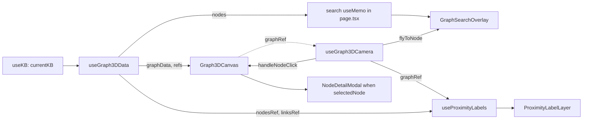

# 20 — Frontend pages: home, chat, graphs, knowledge bases, settings, setup

**What this covers.** A page-by-page deep dive of every route in `frontend/src/app` except the notes editor ([19](19-frontend-notes-editor.md)) and the finance workspace ([17](17-finance-firefly.md)): the `/` redirect, the chat UI and its polling/sources/entity pipeline, the 3D entity graph (`/graph-3d`, with `/graph` redirect), the 2D wikilink notes graph, and the four tabs of the settings sheet — Workspace (`/kb`), Models (`/models`), Storage (`/setup`) and About (`/settings`). For each page: state, effects, API calls (with endpoints), edge cases, and gotchas. Cross-cutting infrastructure (providers, `api.ts`, shared components, build/proxy) is in [18](18-frontend-architecture.md) and is only referenced here.

**Related docs:** [Frontend architecture](18-frontend-architecture.md) · [Notes editor](19-frontend-notes-editor.md) · [API reference](07-api-reference.md) · [Knowledge bases & vaults](08-knowledge-bases-and-vaults.md) · [Notes, wikilinks & vault files](09-notes-wikilinks-and-vault-files.md) · [Graph storage (Kuzu)](14-graph-storage-kuzu.md) · [Retrieval & chat](16-retrieval-and-chat.md) · [Finance](17-finance-firefly.md) · [Local models](12-local-models-and-inference.md) · [LLM providers](13-llm-providers-and-prompting.md) · [Desktop shell](04-desktop-shell.md) · [Configuration reference](21-configuration-reference.md) · [Glossary](28-glossary.md)

---

## 1. Route map

| Page | Route | File | Primary components | Endpoints called |
|---|---|---|---|---|
| Home | `/` | `src/App.tsx` | `<Navigate to="/notes" replace />` | none |
| Chat | `/chat` | `src/app/chat/page.tsx` | `ChatProvider` (via `useChat`), `AssistantMessageBody`, `SegmentedNoteContent`, `EntityDetailPanel`, notes' `FilePreviewModal` | `POST /chat/async`, `GET /chat/status/{id}`, `GET /chat/conversations`, `GET /chat/conversations/{id}/messages`, `DELETE /chat/conversations/{id}`, `GET /chat/conversations/{id}/export`, `GET /notes/{id}`, `POST /graph/entities/scan-text`, `GET /graph/3d/node/{id}`, `GET /vault/local-path`, `POST /desktop/reveal` |
| Graph (redirect) | `/graph` | `src/App.tsx` | `<Navigate to="/graph-3d" replace />` | none |
| 3D entity graph | `/graph-3d` | `src/app/graph-3d/page.tsx` | `components/graph3d/*` (`Graph3DCanvas`, `HUD`, `ProximityLabelLayer`, `GraphSearchOverlay`, `NodeDetailModal`, `GraphModeSwitch`) + hooks | `GET /graph/3d/full`, `GET /graph/3d/node/{id}` |
| Notes graph (2D) | `/notes-graph` | `src/app/notes-graph/page.tsx` | `react-force-graph-2d`, `ReactMarkdown` preview, `GraphModeSwitch`, `BlobMediaPlayer` | `GET /graph/notes`, `POST /graph/notes/rebuild`, `GET /notes/{id}` |
| Workspace | `/kb` | `src/app/kb/page.tsx` | `SettingsShell`, `SettingRow`, `Toggle`, desktop `pickDirectory` | `GET /kb` (via `KBProvider.refreshKBs`), `POST /kb`, `PATCH /kb/{id}`, `PATCH /kb/{id}/finance`, `DELETE /kb/{id}`, `POST /kb/empty`, `POST /kb/delete-non-default` |
| Models | `/models` | `src/app/models/page.tsx`, `_components/ModelPicker.tsx` | `SettingsShell`, `ModelPicker`, desktop `pickFile`/`pickDirectory` | `GET /models`, `PATCH /kb/{id}/llm`, `PATCH /settings`, `POST /setup/select-chat-model`, `POST /setup/download-models`, `POST /models/inspect`, `PUT`/`DELETE /credentials/endpoint`, `GET /llm/endpoint-models` |
| Storage | `/setup` | `src/app/setup/page.tsx` | `SettingsShell`, `SettingRow`, desktop `pickDirectory` | `GET /setup/status`, `POST /setup/paths`, `GET /admin/maintenance-status`, `POST /admin/reingest-all`, `POST /admin/rebuild-communities`, `POST /admin/build-temporal-digests`, `POST /admin/reset-ingestion-data` |
| About | `/settings` | `src/app/settings/page.tsx` | `SettingsShell` | `GET /setup/status` |
| Notes | `/notes` | see [19](19-frontend-notes-editor.md) | | |
| Finance | `/finance` | see [17](17-finance-firefly.md) | | |

All pages are lazy react-router routes registered in `src/App.tsx`. All KB-scoped pages read `currentKB` from `useKB()`, which is correct on the first render (no hydration gating).

## 2. Home — `/`

`/` is `<Navigate to="/notes" replace />` in `src/App.tsx` — no page component, no state, no API calls.

- (Historical — `src/app/page.tsx` no longer exists.) The old landing page's content was: logo (`/logo.png`, 96 px), gradient title "Orb", subtitle "Your multimodal, graph-based knowledge system", three link cards → `/chat` (Chat), `/notes` (Notes), `/graph-3d` (Graph), a tagline pill, and four stack pills (SQLite, Kuzu, Qdrant, Meilisearch).
- Gotcha: the "Graph" card links to `/graph-3d` directly, not `/graph`; both work because `/graph` redirects.

## 3. Chat — `/chat`

### 3.1 State

Page-local (`useState`/`useRef`):

| State | Purpose |
|---|---|
| `input` | Composer value; seeded from `?q=` (the graph's "Ask about this" link), cleared on submit. |
| `previewNote: NotePreview \| null` | Note-preview modal (title + content rendered by `SegmentedNoteContent`). |
| `filePreview: FilePreview \| null` | File-preview modal (image / pdf / video / audio / other). |
| `expandedThinking: Set<string>` | Message ids whose "Model thinking" block is open. |
| `entityPanelNodeId`, `entityPanelName` | Drives `EntityDetailPanel`. |
| `messagesEndRef` | Sentinel div for `scrollIntoView({behavior:"smooth"})` after every `messages` change. |

Everything about the conversation itself (`messages`, `conversations`, `activeConversationId`, `isLoading`, `isLoadingConversations`, `loadingStage`, `loadingModel`) comes from `useChat()` — the state model and poll loop are documented in [18 §8.2](18-frontend-architecture.md).

### 3.2 Effects

1. **KB init** — `void initializeForKb(currentKB)` on `[currentKB]`. Lists conversations for the KB and opens the first one (or an empty new chat).
2. **`?q=` seed** — when the URL carries `q`, replace the URL with `/chat` and `startNewConversation()` so the question waits in the composer of a fresh thread (nothing is sent).
3. **Auto-scroll** on `[messages]`.

### 3.3 Message model and rendering

- User messages: a right-aligned `bg-surface` bubble (`whitespace-pre-wrap`).
- Assistant messages: the logo icon plus `AssistantMessageBody`. Rendering pipeline per message:
  1. `useScannedEntities(message.content, kb, { enabled: scanEnabled, cacheKey: message.id })` — `scanEnabled` is true only for ids in `scannableMessageIds`, the **last 5 assistant messages** (`ENTITY_SCAN_RECENT_LIMIT`), computed by walking `messages` backwards. Older messages still show highlights if their `kb:id` is in the module cache.
  2. `processContent(text)` = `injectEntityLinks(text, scannedEntities)` (no-op when no entities) converts mentions to `[Name](entity://node_id)`.
  3. **Sources**: `message.sources ?? []` (`ChatSource[] = {id, title}[]` — the `sources` field of `ChatStatus.result`, carried through `ChatProvider.complete` and returned on stored `ChatMessageRecord`s) renders under the body as numbered chips keyed by `s.id`; clicking one calls `onOpenNote(s.id)` → `api.getNote(id, kb)` → note preview `<dialog>`. The answer text is rendered whole; the backend no longer appends a markdown references block ([16](16-retrieval-and-chat.md)).
  4. `ReactMarkdown` with `remarkGfm`, `urlTransform` (allows `entity://`), and `makeLinkRenderer(onFileClick, onEntityClick)`:
     - `entity://<id>` → inline blue dashed-underline button → `handleEntityClick(nodeId, text)` → opens `EntityDetailPanel`.
     - Links whose text starts with 📎 or 🎤 → purple attachment button → `handleFileClick(href, filename)`.
     - Everything else → `MarkdownAnchor` (external links open in a new window).
- **Thinking toggle**: when `message.thinking` is set, a "Model thinking" chevron button toggles the id in `expandedThinking`; the block is a `<pre>` with the CSS `animate-rise` entrance (no animation library).
- **Loading row**: while `isLoading`, a pulsing logo shows `loadingStage || "Thinking…"` and, if present, `· {loadingModel}, on this machine`. Stage strings are the backend's verbatim stage labels.
- Empty state: "Ask across everything in {KB name}", one line of description, and three suggestion chips (`SUGGESTIONS`) that set `input` (do not send).
- No footer; nothing on the page hard-codes model names.

### 3.4 Threads column

A 248 px left column (`pane-header` "Ask"):

| Control | Visible when | Action |
|---|---|---|
| Export (download icon) | `activeConversationId` | `api.exportChat(id, "markdown")` → `Blob` → synthetic `<a download="chat-<first 8 chars>.md">` click. Errors are swallowed. (07 §8 notes the backend export route currently 500s.) |
| New conversation (+) | always | `startNewConversation()` (clears messages, `activeConversationId=null`; the server creates a conversation on next send). |
| Conversation rows | `conversations.length > 0` (else "No conversations yet") | Click → `selectConversation(id, currentKB)` (`GET .../messages`); the active row is highlighted; title + `updated_at` date. |
| Row trash (on hover) | per row | `window.confirm("Delete this conversation? This cannot be undone.")` → selects that conversation if it is not the active one → `deleteActiveConversation(currentKB)` → `DELETE /chat/conversations/{id}`; then selects the next remaining conversation or clears. |

There is no conversation `<select>` and no stack badges; the composer footer shows a static "Whole workspace" scope pill.

### 3.5 Submit and shortcuts

- The composer is a two-row `<textarea>`: Enter sends (`send()` ignores blank input or `isLoading`; calls `sendMessage(input, currentKB)` and clears `input`), Shift+Enter inserts a newline; the hint text says so.
- The send button is disabled while `isLoading` or the input is blank.
- Modals are native `<dialog>`s: Escape and backdrop click close them.

### 3.6 Previews and desktop integration

- `handleFileClick(url, filename)`: `resolvedUrl = resolveFileUrl(url, currentKB)`; classifies by extension on the URL **or filename** (`image` → `pdf` → `video` → `audio` → `other`); sets `filePreview`. The modal is the notes page's `FilePreviewModal` (`@/app/notes/_components/FilePreviewModal`, a `<dialog>`), rendered with `currentKB` so `BlobMediaPlayer` gets `kbId`.
- Reveal/Open button (`onReveal`): `handleRevealPreviewFile` → `api.resolveVaultLocalPath(filePreview.url, currentKB)` → `revealInFolder(local_path)` (`POST /api/v1/desktop/reveal`); if it returns false → `window.open(url, "_blank")`; on exception → `alert("Could not reveal this file on disk: …")`. The label is `revealInFolderLabel()` in the desktop app, "Open" otherwise.
- `openNote(noteId)` (`GET /notes/{id}?kb=`) fills `previewNote`; the preview is a `<dialog>` opened with `showModal()` in a ref callback, closed by its `onClose`, the × button, or a backdrop click, and renders `SegmentedNoteContent` with `onEntityClick` enabled — so opening a preview triggers a `scan-text` POST for the note body (uncached — `SegmentedNoteContent` does not pass `cacheKey`).
- Entity clicks (message bodies or the note preview) open `EntityDetailPanel` in a 320 px right aside.

### 3.7 Edge cases and gotchas

- Sending while a poll is in flight is blocked at both the page (`isLoading`) and provider level; there is no queue.
- If `sources` is empty or absent (finance answers, user messages), no citation chips render even if the answer mentions notes.
- Switching KB in `/kb` and returning re-runs `initializeForKb`, discarding an in-progress optimistic transcript only visually (the poll continues in the provider and its completion will still append to `messages`; `isStale()` only guards against *newer sends*, not KB switches). Practical effect: after a KB switch mid-answer the answer may appear under the new KB's conversation list until the final `getChatMessages` refresh replaces `messages`.
- `expandedThinking` keys are message ids; after the post-completion refresh replaces optimistic ids with server ids, an expanded block collapses (id changed).
- Message ids are used as `useScannedEntities` cache keys; optimistic `local-*` ids are replaced by server ids after the post-completion refresh, so the last answer is scanned twice (once per id).

## 4. 3D entity graph — `/graph-3d` (and `/graph`)

`/graph` is `<Navigate to="/graph-3d" replace />` in `src/App.tsx`; old links end up here, and the sidebar "Graph" item points at `/graph-3d` directly. Both graph pages render `GraphModeSwitch` (Notes ↔ Entities) in their top bar.
Deep link: `/graph-3d?node=<node id>` (the entity panel's "Open in graph") flies the camera to that node and opens its detail once the graph data holds it.


`src/app/graph-3d/page.tsx` is a thin composition of the `components/graph3d` hooks (component internals in [18 §11.1](18-frontend-architecture.md)):



### 4.1 Payload and adaptation

`GET /graph/3d/full?kb=` → `{nodes: [{node_id, name, node_type, description, community_id?, x, y, z}], edges: [{source, target, type}]}` (positions are pre-computed server-side, see [14](14-graph-storage-kuzu.md)). `useGraph3DData` (aborts on KB change):

- `id = node_id`; `fx/fy/fz = x/y/z` (pinned — the force engine is disabled with `cooldownTicks=0`/`warmupTicks=0`, so the layout is exactly the backend's).
- `val = 1 + min(8, degree)` where degree counts only edges whose both endpoints exist; used for sphere size (`nodeRelSize=10`).
- Edges with a missing endpoint are dropped; `type` is preserved for link labels.
- `hasFittedRef`/`userNavigatedRef` reset to `false` on every load so the first `onEngineStop` (fires immediately with zero ticks) does one `zoomToFit(400, 120)`.

### 4.2 Force / render config

See `Graph3DCanvas` props in 18 §11.1. Colouring: node colour = `nodeColor(node_type)`; link colour and particle colour = colour of the **source** node's type (resolved through `nodeTypeMapRef` when the link still holds a string id). Background black; `showNavInfo=false`; node drag disabled; built-in navigation controls disabled (replaced by the FPS rig).

### 4.3 Camera

`useGraph3DCamera` installs listeners on `window` once the graph exposes `camera()`/`renderer()` (polled at 100 ms). Controls (also printed in the HUD): left-drag look, right-drag pan, wheel fly, `W/A/S/D` move, `Q/E` up/down, click node → modal, `/` or Ctrl/Cmd+K → search. While a modal or the search overlay is open (`modalOpenRef`) mouse/wheel/WASD are ignored and held keys are cleared. Keys are not captured when focus is in an input/textarea/contenteditable. `flyToNode(node)` = 1.2 s cubic ease to 80 units from the node, continuously looking at it; used by search.

### 4.4 Proximity labels

`useProximityLabels` projects nearby nodes/links into screen coordinates every 100 ms: adaptive radius from scene extent and camera distance; top 16 node labels and 8 link labels by distance; opacity uses the same formula as the 2D graph with `textFade` read from `localStorage["orb:notes-graph-controls:<kb>"]` (default 0.55). `MEMBER_OF` edges never get labels (community membership noise). Labels are DOM elements (`ProximityLabelLayer`), not sprites, so they stay crisp at any DPR.

### 4.5 Search overlay

A `useMemo` in `graph-3d/page.tsx` filters the nodes by case-insensitive `name.includes(q)`, prefix matches first, then alphabetical, max 8. Enter → fly to first; click → fly to that; Escape or blur → close and clear. Entirely client-side — no `/graph/entities/search` call on this page.

### 4.5a Type filter

The page counts nodes per `node_type` (`typeCounts`, sorted by count) and lists them in a side panel; clicking a row toggles the type in a `hidden` set, and `filtered` drops those nodes and any link touching them before the data reaches the canvas.

### 4.6 Node detail modal

Clicking a node (not a drag) builds a `KnowledgeNode` from the force-graph object and opens `NodeDetailModal`, which fetches `GET /graph/3d/node/{node_id}?kb=` and merges the result over the click payload. On fetch failure it shows what the full payload had (name, type, description). Backdrop click or × closes. Camera input is suspended while open.

### 4.7 States and gotchas

- Loading state: full-screen "Loading graph…" until the fetch resolves; there is no error UI — a failed fetch logs to console and leaves an empty black canvas with "0 nodes · 0 edges".
- Empty KB: same as above (0/0). No empty-state hint.
- The WebGL context is inside `ErrorBoundary`; a crash shows the message and "Retry".
- `NodeDetailModal`'s effect depends only on `node.node_id`; changing `kb` while it is open does not refetch (the modal closes on KB change anyway because the page re-renders with new data — but `selectedNode` is *not* cleared automatically; the modal would show stale data over the new graph until closed).
- Text fade is shared with the 2D notes graph via the same storage key (by design: "Mirror notes-graph").

## 5. Notes graph (2D wikilinks) — `/notes-graph`

Obsidian-style graph of notes connected by `[[wikilinks]]`, rendered with `react-force-graph-2d` (`React.lazy` import) on a canvas sized to the viewport.

### 5.1 Payload and shapes

`GET /graph/notes?kb=` → `NotesGraphPayload {nodes:[{id, title, type:"note"|"missing", rel_path?}], edges:[{source,target,type}], center_id?}` (built from SQLite `note_links`; the backend rebuilds links on every call — 07 §8, [09](09-notes-wikilinks-and-vault-files.md)). `toForceGraphData` maps to:

```ts
GraphNode { id, title, name, group: "Note"|"Missing", uuid?: id-if-note, rel_path?, folder?: dirname(rel_path), x?, y? }
GraphLink { source, target, type: e.type || "wikilink" }
```

Edges with unknown endpoints are dropped. `Missing` nodes represent wikilink targets with no note.

### 5.2 State

| State / ref | Purpose |
|---|---|
| `raw: GraphData` | Full adapted payload. |
| `loading`, `rebuilding` | Fetch / rebuild in flight. |
| `selectedNode: GraphNode \| null`, `nodeDetails: Note \| null`, `detailLoading` | Right-hand detail panel. |
| `showControls`, `controls: Controls`, `groupDraft` | Filters & forces panel (below). |
| `dims {w,h}` | Canvas size from `ResizeObserver` on the container (`Math.max(1, floor(rect))`). |
| `graphRef` | force-graph instance (`zoomToFit`, `centerAt`, `zoom`, `d3Force`, `d3ReheatSimulation`). |
| `loadGenRef`, `loadAbortRef` | Generation counter + `AbortController` for `loadGraph`. |
| `detailRequestRef` | Generation counter so a slow `getNote` for node A cannot overwrite node B's panel. |
| `hasFittedRef`, `userNavigatedRef`, `fittingRef` | Fit-once camera discipline. |
| `controlsRef`, `controlsLoadedKbRef` | Latest controls for the canvas painter without re-creating it; which KB the loaded controls belong to. |

`Controls` (persisted per KB in `localStorage["orb:notes-graph-controls:<kb>"]`, merged over `DEFAULT_CONTROLS`):

| Key | Default | Effect |
|---|---|---|
| `search` | `""` | Substring filter on title / rel_path / folder; matches keep their direct neighbours. |
| `showMissing` | `true` | Include `Missing` nodes. |
| `showOrphans` | `true` | Include degree-0 nodes (computed on the raw graph). |
| `showArrows` | `true` | `linkDirectionalArrowLength` 3.5 vs 0. |
| `textFade` | `0.55` | Label fade threshold: `opacity = clamp((zoom − textFade + 0.35) / 0.7)`. Also read by the 3D page. |
| `nodeSize` | `2.2` | Radius multiplier (Note 6, Missing 4). |
| `linkThickness` | `2.2` | `linkWidth`. |
| `centerForce` | `0.05` | `d3Force("center").strength`. |
| `repelForce` | `-120` | `d3Force("charge").strength`. |
| `linkForce` | `1` | `d3Force("link").strength`. |
| `linkDistance` | `60` | `d3Force("link").distance`. |
| `groups: {id, query, color}[]` | `[]` | Colour groups: first group whose `query` substring matches `title rel_path folder` wins; palette of 6 colours assigned round-robin on add. |

The save effect writes controls only when `controlsLoadedKbRef.current === currentKB`, preventing the previous KB's controls being written under the new KB's key during the render in which `currentKB` changed but the load effect has not yet replaced `controls`.

### 5.3 Effects

1. Load controls for `currentKB`; then persist on every `controls` change (guarded as above).
2. `loadGraph()` on `[currentKB]`: bumps generation, aborts the previous request, resets fit flags, fetches, adapts; on failure sets an empty graph (error only logged).
3. `filtered` (memo): applies `showMissing`, `showOrphans`, `search` (+neighbour expansion), then drops links with hidden endpoints.
4. Measure container (`ResizeObserver` + `resize`); block wheel default on the container so page scroll never fights zoom.
5. Apply d3 forces from controls and `d3ReheatSimulation()` whenever a force value, node count or dims change.
6. When the filtered node/link count changes and the user has not navigated, clear `hasFittedRef` to allow one fresh fit; then an effect fits after a 250 ms delay if still allowed. `onEngineStop` also fits once. `runZoomToFit` sets `fittingRef` for `duration + 80 ms` so the resulting `onZoom` events are not mistaken for user navigation.

### 5.4 Rendering and interactions

- `nodeCanvasObject = paintNode`: filled circle in `colorFor(node)` (`Missing` grey `#71717a`, `Note` blue `#3b82f6`, or the first matching colour group), 1-px white stroke scaled by `1/globalScale`, then the label (first 28 chars, `12/globalScale` px, opacity from `textFade`) below the node. `nodePointerAreaPaint` enlarges the hit area by 2 px. `nodeLabel` is disabled (no tooltip). Links `rgba(255,255,255,0.2)`; `d3VelocityDecay 0.3`; `cooldownTicks 120`; node drag enabled.
- `onZoom`/`onZoomEnd` → `markUserNavigated` (ignored while `fittingRef`).
- `onBackgroundClick` clears selection.
- `handleNodeClick(node)`: bumps `detailRequestRef`, selects, hides the controls panel, marks navigation as user-driven, `centerAt(x,y,800)` + `zoom(3.5,800)`; if the node is a `Note`, `GET /notes/{uuid}?kb=` populates `nodeDetails` (only if the request is still the latest).
- Top bar: title + `stats` (notes / missing / wikilinks of the *filtered* graph); buttons **Filters** (toggle panel), **Fit** (resets both flags then `runZoomToFit(400, 60)`), **Rebuild** (`POST /graph/notes/rebuild?kb=` then `loadGraph()`; errors logged only).
- Legend (bottom-left): Note, Missing link target, and one row per colour group; "LIVE GRAPH" pulse is decorative.
- Filters panel (bottom-right, hidden when a node is selected and vice-versa — `selectedNode && !showControls`): search input, Missing / Orphans / Arrows toggles, colour-group input (Enter or Add), sliders (ranges: textFade 0–2 step .05, nodeSize 0.4–2.5, linkThickness 0.5–4, centerForce 0–1, repelForce −400…−10 step 5, linkForce 0–2, linkDistance 20–200 step 5), "Reset defaults".
- Detail panel (right): group badge, title, `rel_path`, created date (from `nodeDetails`), and either the note content preview or a "Missing note" explanation. Preview: `prepPreviewMarkdown` truncates to 6 000 chars and rewrites `[[target|alias]]` to `[alias](wikilink:target)`; `previewUrlTransform = urlTransformAllowing("wikilink:", "/vault-files/", "attachments/")` (react-markdown's default schemes plus those prefixes); custom `a` renders wikilinks as accent chips (not clickable), YouTube/Vimeo links as `BlobMediaPlayer` embeds, other links `target=_blank`; `img` renders YouTube/Vimeo srcs as embeds and everything else as `` with the raw `src` (note: canonical `attachments/...` srcs are **not** run through `resolveFileUrl` here, so images in this preview only load for notes that still store the legacy `/vault-files/...` form). "Open in Notes" `Link` → `/notes?note=<uuid>` and writes `sessionStorage[lastNoteStorageKey(kb)] = uuid` so the editor selects it (see [19](19-frontend-notes-editor.md)).

### 5.5 Edge cases and gotchas

- Empty filtered graph → "No notes to graph yet" + "Open Notes" link (also shown when filters hide everything).
- `getNotesGraph` triggers a backend link rebuild each call; do not poll this endpoint.
- Controls are per KB; the 3D page reads only `textFade` from them.
- `center_id` in the payload is ignored by this page (it is used by `ConnectedNotesPanel` semantics on the backend side only).
- `handleNodeClick` on a `Missing` node still zooms but fetches nothing.
- Selecting a node closes the filters panel and vice-versa; both cannot be open.

## 6. Workspace — `/kb`

The "Workspace" tab of `SettingsShell` (title "Workspace", intro "Each workspace is one vault folder with its own graph and index. Switch from the sidebar.").

### 6.1 State and load

The list comes from `useKB()` — `kbs`, `currentKBRecord`, `refreshKBs` — so the page issues no `GET /kb` of its own; every mutation ends with `refreshKBs()` (also on failure, because create/delete may have partially succeeded). Local state: `error`, `busy` (a string key such as `"rename"`, `"create"`, `"empty-<id>"`, `"delete-<id>"`, `"finance"`, `"delete-all"` — every button is disabled while any key is set), `name` (rename draft, re-seeded whenever the active record's name changes), `showForm` (initially `true` when the URL carries `?new=1`, which the sidebar's "New workspace" uses; the query is then stripped with `history.replaceState`), `newName`, `newVaultPath`. `canBrowse = Boolean(getDesktopBridge()?.pickDirectory)` decides whether "Browse…" renders.

Slug/identity: `kbSlug(kb)` from `kb-context` (`"default"` for the built-in KB, else `kb.slug` — required on the wire, never derived from the name). The active record is `currentKBRecord ?? kbs.find(k => kbSlug(k) === currentKB || k.name === currentKB)`; `isDefault = current.id === "default"`.

### 6.2 Layout and flows

**Active workspace card** (while `current` is loaded): Name input (rename on blur/Enter, Escape restores; no-op if unchanged → `PATCH /kb/{id} {name}` then `setCurrentKBName`), read-only vault path (the "Choose…" button is disabled — vault paths are fixed after creation), a Finance `SettingRow` with a `Toggle` (→ `PATCH /kb/{id}/finance {enabled}`; the sidebar hides the Finance entry when off; nothing is deleted), a Model `SettingRow` whose description is `modelSummary(kb)` — `inherits|pinned · on this device|<endpoint host> · <model>` from `effective_llm` — with a "Change" link to `/models`, and the buttons **Empty workspace…** and (non-default only) **Delete workspace…**.

**All workspaces** list: one row per KB (letter swatch, name, `built-in`/`active` tags, vault path) with a **Switch** button on non-active rows → `setCurrentKB(kbSlug(kb), kb.name)`; below it the **New workspace** dashed button that opens the create form, and — when any non-default KB exists — **Delete all non-default workspaces**.

| Flow | Confirmation | Calls | After |
|---|---|---|---|
| Create | none; submit disabled until name and vault path are non-empty; a missing vault path shows "Choose a notes vault folder — …" | `POST /kb {name, vault_path}` | clears the form, `refreshKBs()`; errors show `response.data.detail` or the fallback message in the page banner |
| Browse vault (desktop only) | — | bridge `pickDirectory({title, defaultPath})` | fills `newVaultPath` |
| Rename | none | `PATCH /kb/{id} {name}` | `setCurrentKBName(next)`; `refreshKBs()` |
| Finance toggle | none | `PATCH /kb/{id}/finance {enabled}` | `refreshKBs()` |
| Empty | `window.confirm("Empty \"<name>\"?… Removes all notes, vault files, indexes and finance data. The workspace itself stays.")` | `POST /kb/empty?kb=<slug>` (default → no `kb` param) | `refreshKBs()` |
| Delete (non-default) | `window.confirm("Permanently delete …")` listing the vault path | `DELETE /kb/{id}` | if it was active → `setCurrentKB("default")`; `refreshKBs()` |
| Delete all non-default | `window.confirm` with count | `POST /kb/delete-non-default` | if the active KB is non-default → `setCurrentKB("default")`; throws "Deleted N; M failed." into the banner when `errors` is non-empty |

Rows and cards use CSS transitions only; there is no animation library.

### 6.3 Per-KB model override

The per-KB chat/ingestion model is chosen on `/models` ("This workspace" card, §6.5); the Workspace tab only summarises it. The original `KBModelPanel` component was folded into `/models`. Backend contract: `backend/app/api/kb.py` `get_kb_llm`/`update_kb_llm` (validates that pinned models belong to the effective provider; a local pin must be an on-disk GGUF; an invalid override is rolled back to inherit).

### 6.4 Gotchas

- Slugs are not derived client-side; `KnowledgeBase.slug` is required, so a `GET /kb` row without one is a type error, not a fallback.
- `emptyKB` is addressed by slug, `deleteKB`/`renameKB`/finance/LLM routes by `id`.
- Deleting the active KB resets to default but does not clear `ChatProvider` state until `/chat` re-initialises.
- `window.confirm` dialogs are native; in the Tauri WebView they render as OS dialogs.

### 6.5 Models — `/models`

The single page for every model decision, rendered from one `GET /api/v1/models`. Sections follow the order a person decides in:

1. **This knowledge base** — the KB currently open (from `KBProvider`), with three choices: inherit the system model, a model on this device, or a cloud endpoint. Writes to `PATCH /api/v1/kb/{id}/llm`. Shows the resolved model and whether it is inherited or pinned.
2. **Default for everything else** — the system model, written via `PATCH /api/v1/settings` (plus `POST /setup/select-chat-model` when a curated catalog id is chosen, since that also pairs embed/rerank).
3. **Cloud endpoints** — URL + key, written with `PUT /api/v1/credentials/endpoint`; the backend stores the key in the OS keychain. The URL is the credential identity.
4. **Download a model** — the curated catalog with sizes, "suggested" and "may be tight" badges, and an "on disk" state; `POST /setup/download-models`.
5. **Search and media models** — embedding and reranker, read-only, with the reason they are not per-KB (embedding dimensions are shared by every KB's Qdrant collections).

`_components/ModelPicker.tsx` lists every installed GGUF (`InstalledModel`: label, size, architecture, warnings) plus **Browse** buttons for a file or a folder (`pickDesktopFile` with a `.gguf` filter / `pickDesktopDirectory`). A path the user picks is validated by `POST /api/v1/models/inspect` (`{ref, path, name, size_gb, warnings}`) before it is stored, so an unusable path is refused with a specific reason. GGUF is the only local format, so there is no format badge and no "cannot run here" state; the backend placeholder ref `local-chat` is shown as "nothing picked" rather than as a model.

The backend persists the system choice to `DATA_DIR/runtime_config.json` (`provider`, `model`, `ingestion_model`, `base_url`) and swaps the provider live ([06](06-backend-core-and-configuration.md), [13](13-llm-providers-and-prompting.md)); per-KB pins (§6.3) layer on top.

## 7. About — `/settings`

The "About" tab of `SettingsShell` (intro "Orb · a local, graph-based memory for your notes."). One effect: `GET /setup/status` (failure ignored). It renders a two-column fact list — the stack (`STACK`: SQLite, Kuzu, Qdrant, Meilisearch, "No outbound connections unless a cloud endpoint is added") plus `data_dir`, `models_dir` and `paths_json` from `SetupStatus` — and a static "Data guide" (`GUIDE`) explaining reset indexes, empty/delete workspace, where data and models live, how to delete models (quit first — they may be memory-mapped), wiping app data, and `paths.json`.

Nothing is edited here. The AI provider, cloud model names, API keys and endpoint panels were removed from this page on 2026-09-05 (model choice had been spread over Setup, Settings and the KB list — five surfaces and twelve endpoints for one decision) and live on `/models`; maintenance and reset actions moved to Storage (`/setup`).

## 8. Storage — `/setup`

Re-configuration page for the bootstrap paths plus per-workspace maintenance. The shell's first-run page ([04](04-desktop-shell.md)) collects the same paths before the backend exists; this page talks to the backend, not the bridge, for persistence.

### 8.1 What the page is

`/setup` is the **Storage** page inside `SettingsShell` (title "Storage", intro "Where Orb keeps indexes and model weights. Restart after changing a path."). It has no AI-mode picker and no model download UI — models are chosen and downloaded on `/models`. It owns two things: the three bootstrap paths, and the per-workspace maintenance actions.

### 8.2 State and load

- Mount: `GET /setup/status` → seeds `dataDir`, `modelsDir`, `vaultPath = default_vault_path || active_vault_path || ""`. Error: "Could not load setup status."
- A second effect polls `GET /admin/maintenance-status?kb=` (3 s while a user-triggered rebuild runs, 15 s otherwise, paused while the tab is hidden) to drive the Rebuild button state; it is independent of the sidebar indicator's poller.

### 8.3 UI

- **Paths** form: Default workspace vault (optional; other workspaces pick their own vault when created), Data folder (required), Models folder (required). Each field has a desktop "Browse…" button (`pickDesktopDirectory` with `defaultPath`) when the Tauri bridge is present.
- **Save**: `POST /setup/paths {data_dir, models_dir, default_vault_path?}` then `GET /setup/status`; button cycles "Save" → "Saving…" → "Saved". Error: "Failed to save paths. Check that directories are writable."
- Status line next to the button: `Backend: <database_backend> · models: ready|missing · configured: yes|no` (`local_models_ready`, `ai_configured`).
- **Maintenance** rows (all scoped to `currentKB`):
  - *Re-ingest whole vault* → `POST /admin/reingest-all?kb=`; shows "Queued N notes" for 5 s.
  - *Rebuild communities and digests* → `POST /admin/rebuild-communities?kb=` then `POST /admin/build-temporal-digests?kb=`; the poller flips the button back to idle when the backend reports nothing running.
  - *Reset indexes* → two-click confirmation ("Confirm reset?" for 5 s) then `POST /admin/reset-ingestion-data?kb=`. Notes on disk are untouched.
- Job labels cycle `idle` → `running` → `done`/`error` → auto-`idle` after a few seconds; "done" for the rebuild is detected when the poller sees `community_detection.running || temporal_digests.running` flip false after `rebuildTriggeredRef` was set.

### 8.4 Gotchas

- Saving paths does not restart services; the backend writes `paths.json` and the user must relaunch for `data_dir`/`models_dir` changes to take effect ([04](04-desktop-shell.md)).
- The maintenance poller and the sidebar `ActivityStatus` hit the same endpoint independently; two pollers per open Storage page is expected.
- No KB usage for the paths half — paths are global; the maintenance half is per workspace.

## 9. Cross-page gotchas

- Native `window.confirm`/`alert` are used for destructive confirmations on `/chat` and `/kb`; Storage (`/setup`) uses two-click confirmation for "Reset indexes" instead. Keep one style per page.
- The only static model text left is the sidebar activity popover's "Chat · Qwen3-ASR · Vision via chat model" line; pages read the live configuration from `GET /models` / `GET /setup/status`.
- `localStorage`/`sessionStorage` keys touched by these pages: `orb_current_kb` (KB), `orb:notes-graph-controls:<kb>` (2D controls; 3D reads `textFade`), `orb:last-note-id:<kb>` (sessionStorage; written by notes-graph "Open in Notes" and the command palette, read by the editor), `orb.endpointNames` (Models page endpoint labels).
- There are no server components; every route is a lazy client chunk behind `App.tsx`.

## 10. History / rationale

- Chat moved from a synchronous `POST /chat` to `POST /chat/async` + `GET /chat/status` polling in `2c10d8d` so long local-model answers survive proxy timeouts and show stage text; the References-block citation contract and `window.__chatSetPreview` came with the entity highlighting work (`6365686`); the markdown References block has since been replaced by the `sources` field.
- `b84ca73` limited entity scans to recent messages and added the scan cache after long conversations flooded `/graph/entities/scan-text`.
- The 3D page was split into `components/graph3d` hooks/components in `fbcafe7`; fit-once camera guards on both graph pages and the quaternion look (to fix gimbal lock stopping horizontal drag) came from the audit commits (`f8f527f`).
- The notes graph's per-KB persisted controls and the "controlsLoadedKbRef" guard fixed a bug where switching KB wrote the old KB's sliders under the new key.
- KB page: create requires a vault path since the per-KB vault model ([08](08-knowledge-bases-and-vaults.md)); "Empty" and "Delete all non-default" arrived with the desktop data-cleanup work (`3f21e08`); the per-KB LLM override panel (2026-09-02) was later folded into `/models`, and the KB/Models/Storage/About pages were regrouped under `SettingsShell`.
- 2026-09-19/20: the AI-mode picker and its `ai_setup_mode`/`needs_model_download` status fields were removed everywhere — readiness is derived server-side and the user simply picks a model on `/models`; `framer-motion` animations became CSS, modals became native `<dialog>`s, and chat answers switched from an appended references block to the structured `sources` field.
