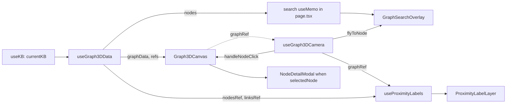

# 20 — Frontend pages: home, chat, graphs, knowledge bases, settings, setup

**What this covers.** A page-by-page deep dive of every route in `frontend/src/app` except the notes editor ([19](19-frontend-notes-editor.md)) and the finance workspace ([17](17-finance-firefly.md)): the home landing, the chat UI and its polling/citation/entity pipeline, the 3D entity graph (`/graph-3d`, with `/graph` redirect), the 2D wikilink notes graph, knowledge-base management including the per-KB LLM override panel, runtime LLM settings + maintenance + data cleanup, and the first-run setup page. For each page: state, effects, API calls (with endpoints), edge cases, and gotchas. Cross-cutting infrastructure (providers, `api.ts`, shared components, build/proxy) is in [18](18-frontend-architecture.md) and is only referenced here.

**Related docs:** [Frontend architecture](18-frontend-architecture.md) · [Notes editor](19-frontend-notes-editor.md) · [API reference](07-api-reference.md) · [Knowledge bases & vaults](08-knowledge-bases-and-vaults.md) · [Notes, wikilinks & vault files](09-notes-wikilinks-and-vault-files.md) · [Graph storage (Kuzu)](14-graph-storage-kuzu.md) · [Retrieval & chat](16-retrieval-and-chat.md) · [Finance](17-finance-firefly.md) · [Local models](12-local-models-and-inference.md) · [LLM providers](13-llm-providers-and-prompting.md) · [Desktop shell](04-desktop-shell.md) · [Configuration reference](21-configuration-reference.md) · [Glossary](28-glossary.md)

---

## 1. Route map

| Page | Route | File | Primary components | Endpoints called |
|---|---|---|---|---|
| Home | `/` | `src/App.tsx` | `<Navigate to="/notes" replace />` | none |
| Chat | `/chat` | `src/app/chat/page.tsx` | `ChatProvider` (via `useChat`), `AssistantMessageBody`, `SegmentedNoteContent`, `EntityDetailPanel`, `BlobMediaPlayer`, `ShaderBackground` | `POST /chat/async`, `GET /chat/status/{id}`, `GET /chat/conversations`, `GET /chat/conversations/{id}/messages`, `DELETE /chat/conversations/{id}`, `GET /chat/conversations/{id}/export`, `GET /notes/{id}`, `POST /graph/entities/scan-text`, `GET /graph/3d/node/{id}`, `GET /vault/local-path` |
| Graph (redirect) | `/graph` | `src/App.tsx` | `<Navigate to="/graph-3d" replace />` | none |
| 3D entity graph | `/graph-3d` | `src/app/graph-3d/page.tsx` | `components/graph3d/*` (`Graph3DCanvas`, `HUD`, `ProximityLabelLayer`, `GraphSearchOverlay`, `NodeDetailModal`) + hooks | `GET /graph/3d/full`, `GET /graph/3d/node/{id}` |
| Notes graph (2D) | `/notes-graph` | `src/app/notes-graph/page.tsx` | `react-force-graph-2d`, `ReactMarkdown` preview, `ShaderBackground` | `GET /graph/notes`, `POST /graph/notes/rebuild`, `GET /notes/{id}` |
| Knowledge bases | `/kb` | `src/app/kb/page.tsx`, `src/app/kb/_components/KBModelPanel.tsx` | `KBModelPanel`, `ShaderBackground`, desktop `pickDirectory` | `GET /kb`, `POST /kb`, `PATCH /kb/{id}`, `DELETE /kb/{id}`, `POST /kb/empty`, `POST /kb/delete-non-default`, `GET /kb/{id}/llm`, `PATCH /kb/{id}/llm` |
| Settings | `/settings` | `src/app/settings/page.tsx` | `ShaderBackground` | `GET /settings`, `PATCH /settings`, `GET /setup/status`, `GET /admin/maintenance-status`, `POST /admin/rebuild-communities`, `POST /admin/build-temporal-digests`, `POST /admin/reset-ingestion-data`, `POST /admin/reingest-all`, `POST /kb/empty`, `POST /finance/reset-administration` |
| Setup | `/setup` | `src/app/setup/page.tsx` | `ShaderBackground`, desktop `pickDirectory` | `GET /setup/status`, `GET /setup/model-catalog`, `POST /setup/paths`, `POST /setup/download-models`, `POST /setup/select-chat-model`, `GET /setup/multimodal-status` |
| Notes | `/notes` | see [19](19-frontend-notes-editor.md) | | |
| Finance | `/finance` | see [17](17-finance-firefly.md) | | |

All pages are lazy react-router routes registered in `src/App.tsx`. All KB-scoped pages read `currentKB` from `useKB()`, which is correct on the first render (no hydration gating).

## 2. Home — `/`

Static landing page. No state, no effects, no API calls.

- Layout: full-screen `bg-black` with `ShaderBackground`, centred column (`max-w-4xl`), staggered CSS fade-ins.
- (Historical — `src/app/page.tsx` no longer exists; `/` now redirects to `/notes`.) Content was: logo (`/logo.png`, 96 px), gradient title "Orb", subtitle "Your multimodal, graph-based knowledge system", three link cards → `/chat` (Chat), `/notes` (Notes), `/graph-3d` (Graph), a tagline pill, and four stack pills (SQLite, Kuzu, Qdrant, Meilisearch).
- Gotcha: the "Graph" card links to `/graph-3d` directly, not `/graph`; both work because `/graph` redirects.

## 3. Chat — `/chat`

### 3.1 State

Page-local (`useState`/`useRef`):

| State | Purpose |
|---|---|
| `input` | Text box value; cleared on submit. |
| `previewNote: NotePreview \| null` | Note-preview modal (title + content rendered by `SegmentedNoteContent`). |
| `filePreview: FilePreview \| null` | File-preview modal (image / pdf / video / audio / other). |
| `expandedThinking: Set<string>` | Message ids whose "Model thinking" block is open. |
| `entityPanelNodeId`, `entityPanelName` | Drives `EntityDetailPanel`. |
| `greeting` | "Hello!" → "Good morning/afternoon/evening!" set in an effect from local time. |
| `messagesEndRef` | Sentinel div for `scrollIntoView({behavior:"smooth"})` after every `messages` change. |

Everything about the conversation itself (`messages`, `conversations`, `activeConversationId`, `isLoading`, `isLoadingConversations`, `loadingStage`, `loadingModel`) comes from `useChat()` — the state model and poll loop are documented in [18 §8.2](18-frontend-architecture.md).

### 3.2 Effects

1. **Global preview hook** — on mount sets `window.__chatSetPreview = (n) => setPreviewNote(n)`, deleted on unmount. `AssistantMessageBody` calls it when a reference chip is clicked (avoids prop-drilling into the memoised link renderer).
2. **KB init** — `void initializeForKb(currentKB)` on `[currentKB]`. Lists conversations for the KB and opens the first one (or an empty new chat).
3. **Auto-scroll** on `[messages]`.
4. **Greeting** once.

### 3.3 Message model and rendering

- User messages: plain `<p class="whitespace-pre-wrap">` in a purple→pink gradient bubble, right-aligned, `User` icon.
- Assistant messages: `AssistantMessageBody` in a translucent bubble with a `Sparkles` avatar. Rendering pipeline per message:
  1. `useScannedEntities(message.content, kb, { enabled: scanEnabled, cacheKey: message.id })` — `scanEnabled` is true only for ids in `scannableMessageIds`, the **last 5 assistant messages** (`ENTITY_SCAN_RECENT_LIMIT`), computed by walking `messages` backwards. Older messages still show highlights if their `kb:id` is in the module cache.
  2. `processContent(text)` = `injectEntityLinks(text, scannedEntities)` (no-op when no entities) converts mentions to `[Name](entity://node_id)`.
  3. **Reference split**: `refMatch = content.match(/###?\s*References[:\s]*\n([\s\S]+?)$/i)`. If the answer ends with a `## References` / `### References` block, the body before it is rendered as markdown and the block is turned into chips: each line matching `[title](/notes/<id>)` becomes a `FileText` button that calls `api.getNote(id, kb)` and opens the preview via `window.__chatSetPreview`. Lines that do not match are dropped silently. This is the citation contract with the backend answer prompt ([16](16-retrieval-and-chat.md)).
  4. `ReactMarkdown` with `remarkGfm`, `urlTransform` (allows `entity://`), and `makeLinkRenderer(onFileClick, onEntityClick)`:
     - `entity://<id>` → inline blue dashed-underline button → `handleEntityClick(nodeId, text)` → opens `EntityDetailPanel`.
     - Links whose text starts with 📎 or 🎤 → purple attachment button → `handleFileClick(href, filename)`.
     - Everything else → `MarkdownAnchor` (external links open in a new window).
- **Thinking toggle**: when `message.thinking` is set, a "Model thinking" chevron button toggles the id in `expandedThinking`; the block animates height with `AnimatePresence` and renders `<pre>` monospace purple text.
- **Loading bubble**: while `isLoading`, a spinner bubble shows `loadingStage || "Thinking..."` and, if present, `Using {loadingModel}`. Stage strings are the backend's verbatim stage labels.
- Empty state: greeting, description, and four suggestion chips that set `input` (do not send).
- Footer: static "Powered by Gemma3 4B • Qwen3 Embedding • Qwen3 Reranker • Florence 2 • Whisper V3" — **hard-coded marketing text**, not derived from settings; it is wrong when a cloud provider or a different GGUF is selected.

### 3.4 Header controls

| Control | Visible when | Action |
|---|---|---|
| New Chat | always | `startNewConversation()` (clears messages, `activeConversationId=null`; the server creates a conversation on next send). |
| Delete Chat | `activeConversationId \|\| messages.length > 0` | `window.confirm("Delete this chat? This cannot be undone.")` → `deleteActiveConversation(currentKB)` → `DELETE /chat/conversations/{id}`; then selects the next remaining conversation or clears. |
| Export | `activeConversationId` | `api.exportChat(id, "markdown")` → `Blob` → synthetic `<a download="chat-<first 8 chars>.md">` click. Errors are swallowed. (07 §8 notes the backend export route currently 500s.) |
| Conversation `<select>` | `conversations.length > 0` | value `""` = "New chat" → `startNewConversation()`; any id → `selectConversation(id, currentKB)` (`GET .../messages`). Disabled while `isLoadingConversations`. |
| Badges | always | Active KB name (purple), then static SQLite / Kuzu / Qdrant / Meilisearch pills. |

### 3.5 Submit and shortcuts

- Form `onSubmit` → `handleSubmit`: ignores blank input or `isLoading`; calls `sendMessage(input, currentKB)`, clears `input`. Enter submits (native form); there is no Shift+Enter multiline — the input is a single-line `<input>`.
- Input and send button are disabled while `isLoading`.
- There are no other keyboard shortcuts on this page (Escape does not close modals; backdrop click does).

### 3.6 Previews and desktop integration

- `handleFileClick(url, filename)`: `resolvedUrl = encodeFileUrl(resolveFileUrl(url, currentKB))`; classifies by extension on the URL **or filename** (`image` → `pdf` → `video` → `audio` → `other`); sets `filePreview`. Modal renders ``, `<iframe>` (pdf), `BlobMediaPlayer` (video/audio, **without** `kbId` — safe because the URL is already resolved), or a "Preview not available" placeholder.
- Reveal/Open button: `handleRevealPreviewFile` → `api.resolveVaultLocalPath(filePreview.url, currentKB)` → `revealInFolder(local_path)` (`POST /api/v1/desktop/reveal`); if it returns false → `window.open(url, "_blank")`; on exception → `alert("Could not reveal this file on disk: …")`. Label is `revealInFolderLabel()` in the desktop app, "Open"/"Open file" otherwise.
- `handleNoteReference(noteId)` exists for direct note links (`GET /notes/{id}?kb=`) but the reference chips use the `window.__chatSetPreview` path instead.
- Note preview modal uses `SegmentedNoteContent` with `onEntityClick` enabled, so opening a preview triggers a `scan-text` POST for the note body (uncached — `SegmentedNoteContent` does not pass `cacheKey`).

### 3.7 Edge cases and gotchas

- Sending while a poll is in flight is blocked at both the page (`isLoading`) and provider level; there is no queue.
- If the backend answer lacks a References block, no citations render even if the answer mentions notes.
- Reference chip parsing expects `/notes/<id>` links; any other citation format is dropped.
- Switching KB in `/kb` and returning re-runs `initializeForKb`, discarding an in-progress optimistic transcript only visually (the poll continues in the provider and its completion will still append to `messages`; `isStale()` only guards against *newer sends*, not KB switches). Practical effect: after a KB switch mid-answer the answer may appear under the new KB's conversation list until the final `getChatMessages` refresh replaces `messages`.
- `expandedThinking` keys are message ids; after the post-completion refresh replaces optimistic ids with server ids, an expanded block collapses (id changed).
- `getChatMessages`/`deleteChatConversation` do not send `kb` (07 §8) — conversations in non-default KBs cannot be reopened or deleted through this UI if the backend enforces KB scoping on those routes.

## 4. 3D entity graph — `/graph-3d` (and `/graph`)

`src/app/graph/page.tsx` is a server component: `redirect("/graph-3d")` (HTTP 307 on direct load, client navigation otherwise). Old links and the sidebar "Graph" item both end up here.

`src/app/graph-3d/page.tsx` is a thin composition of the `components/graph3d` hooks (component internals in [18 §11.1](18-frontend-architecture.md)):



### 4.1 Payload and adaptation

`GET /graph/3d/full?kb=` → `{nodes: [{node_id, name, node_type, description, community_id?, x, y, z}], edges: [{source, target, type}]}` (positions are pre-computed server-side, see [14](14-graph-storage-kuzu.md)). `useGraph3DData` (aborts on KB change):

- `id = node_id`; `fx/fy/fz = x/y/z` (pinned — the force engine is disabled with `cooldownTicks=0`/`warmupTicks=0`, so the layout is exactly the backend's).
- `val = 1 + min(8, degree)` where degree counts only edges whose both endpoints exist; used for sphere size (`nodeRelSize=10`).
- Edges with a missing endpoint are dropped; `type` is preserved for link labels.
- `hasFittedRef`/`userNavigatedRef` reset to `false` on every load so the first `onEngineStop` (fires immediately with zero ticks) does one `zoomToFit(400, 120)`.

### 4.2 Force / render config

See `Graph3DCanvas` props in 18 §11.1. Colouring: node colour = `nodeColor(node_type)`; link colour and particle colour = colour of the **source** node's type (resolved through `nodeTypeMapRef` when the link still holds a string id). Background black; `showNavInfo=false`; node drag disabled; built-in navigation controls disabled (replaced by the FPS rig).

### 4.3 Camera

`useGraph3DCamera` installs listeners on `window` once the graph exposes `camera()`/`renderer()` (polled at 100 ms). Controls (also printed in the HUD): left-drag look, right-drag pan, wheel fly, `W/A/S/D` move, `Q/E` up/down, click node → modal, `/` or Ctrl/Cmd+K → search. While a modal or the search overlay is open (`modalOpenRef`) mouse/wheel/WASD are ignored and held keys are cleared. Keys are not captured when focus is in an input/textarea/contenteditable. `flyToNode(node)` = 1.2 s cubic ease to 80 units from the node, continuously looking at it; used by search.

### 4.4 Proximity labels

`useProximityLabels` projects nearby nodes/links into screen coordinates every 100 ms: adaptive radius from scene extent and camera distance; top 16 node labels and 8 link labels by distance; opacity uses the same formula as the 2D graph with `textFade` read from `localStorage["orb:notes-graph-controls:<kb>"]` (default 0.55). `MEMBER_OF` edges never get labels (community membership noise). Labels are DOM elements (`ProximityLabelLayer`), not sprites, so they stay crisp at any DPR.

### 4.5 Search overlay

A `useMemo` in `graph-3d/page.tsx` filters the nodes by case-insensitive `name.includes(q)`, prefix matches first, then alphabetical, max 8. Enter → fly to first; click → fly to that; Escape or blur → close and clear. Entirely client-side — no `/graph/entities/search` call on this page.

### 4.6 Node detail modal

Clicking a node (not a drag) builds a `KnowledgeNode` from the force-graph object and opens `NodeDetailModal`, which fetches `GET /graph/3d/node/{node_id}?kb=` and merges the result over the click payload. On fetch failure it shows what the full payload had (name, type, description). Backdrop click or × closes. Camera input is suspended while open.

### 4.7 States and gotchas

- Loading state: full-screen "Loading graph…" until the fetch resolves; there is no error UI — a failed fetch logs to console and leaves an empty black canvas with "0 nodes · 0 edges".
- Empty KB: same as above (0/0). No empty-state hint.
- The 3D page does not render `ShaderBackground` (WebGL canvas covers the viewport).
- The WebGL context is inside `ErrorBoundary`; a crash shows the message and "Retry".
- `NodeDetailModal`'s effect depends only on `node.node_id`; changing `kb` while it is open does not refetch (the modal closes on KB change anyway because the page re-renders with new data — but `selectedNode` is *not* cleared automatically; the modal would show stale data over the new graph until closed).
- Text fade is shared with the 2D notes graph via the same storage key (by design: "Mirror notes-graph").

## 5. Notes graph (2D wikilinks) — `/notes-graph`

Obsidian-style graph of notes connected by `[[wikilinks]]`, rendered with `react-force-graph-2d` (dynamic import, `ssr:false`) on a canvas sized to the viewport.

### 5.1 Payload and shapes

`GET /graph/notes?kb=` → `NotesGraphPayload {nodes:[{id, title, type:"note"|"missing", rel_path?}], edges:[{source,target,type}], center_id?}` (built from SQLite `note_links`; the backend rebuilds links on every call — 07 §8, [09](09-notes-wikilinks-and-vault-files.md)). `toForceGraphData` maps to:

```ts
GraphNode { id, title, name, group: "Note"|"Missing", uuid?: id-if-note, rel_path?, folder?: dirname(rel_path), x?, y? }
GraphLink { source, target, type: e.type || "wikilink" }
```

Edges with unknown endpoints are dropped. `Missing` nodes represent wikilink targets with no note.

### 5.2 State

| State / ref | Purpose |
|---|---|
| `raw: GraphData` | Full adapted payload. |
| `loading`, `rebuilding` | Fetch / rebuild in flight. |
| `selectedNode: GraphNode \| null`, `nodeDetails: Note \| null`, `detailLoading` | Right-hand detail panel. |
| `showControls`, `controls: Controls`, `groupDraft` | Filters & forces panel (below). |
| `dims {w,h}` | Canvas size from `ResizeObserver` on the container (`Math.max(1, floor(rect))`). |
| `graphRef` | force-graph instance (`zoomToFit`, `centerAt`, `zoom`, `d3Force`, `d3ReheatSimulation`). |
| `loadGenRef`, `loadAbortRef` | Generation counter + `AbortController` for `loadGraph`. |
| `detailRequestRef` | Generation counter so a slow `getNote` for node A cannot overwrite node B's panel. |
| `hasFittedRef`, `userNavigatedRef`, `fittingRef` | Fit-once camera discipline. |
| `controlsRef`, `controlsLoadedKbRef` | Latest controls for the canvas painter without re-creating it; which KB the loaded controls belong to. |

`Controls` (persisted per KB in `localStorage["orb:notes-graph-controls:<kb>"]`, merged over `DEFAULT_CONTROLS`):

| Key | Default | Effect |
|---|---|---|
| `search` | `""` | Substring filter on title / rel_path / folder; matches keep their direct neighbours. |
| `showMissing` | `true` | Include `Missing` nodes. |
| `showOrphans` | `true` | Include degree-0 nodes (computed on the raw graph). |
| `showArrows` | `true` | `linkDirectionalArrowLength` 3.5 vs 0. |
| `textFade` | `0.55` | Label fade threshold: `opacity = clamp((zoom − textFade + 0.35) / 0.7)`. Also read by the 3D page. |
| `nodeSize` | `2.2` | Radius multiplier (Note 6, Missing 4). |
| `linkThickness` | `2.2` | `linkWidth`. |
| `centerForce` | `0.05` | `d3Force("center").strength`. |
| `repelForce` | `-120` | `d3Force("charge").strength`. |
| `linkForce` | `1` | `d3Force("link").strength`. |
| `linkDistance` | `60` | `d3Force("link").distance`. |
| `groups: {id, query, color}[]` | `[]` | Colour groups: first group whose `query` substring matches `title rel_path folder` wins; palette of 6 colours assigned round-robin on add. |

The save effect writes controls only when `controlsLoadedKbRef.current === currentKB`, preventing the previous KB's controls being written under the new KB's key during the render in which `currentKB` changed but the load effect has not yet replaced `controls`.

### 5.3 Effects

1. Load controls for `currentKB`; then persist on every `controls` change (guarded as above).
2. `loadGraph()` on `[currentKB]`: bumps generation, aborts the previous request, resets fit flags, fetches, adapts; on failure sets an empty graph (error only logged).
3. `filtered` (memo): applies `showMissing`, `showOrphans`, `search` (+neighbour expansion), then drops links with hidden endpoints.
4. Measure container (`ResizeObserver` + `resize`); block wheel default on the container so page scroll never fights zoom.
5. Apply d3 forces from controls and `d3ReheatSimulation()` whenever a force value, node count or dims change.
6. When the filtered node/link count changes and the user has not navigated, clear `hasFittedRef` to allow one fresh fit; then an effect fits after a 250 ms delay if still allowed. `onEngineStop` also fits once. `runZoomToFit` sets `fittingRef` for `duration + 80 ms` so the resulting `onZoom` events are not mistaken for user navigation.

### 5.4 Rendering and interactions

- `nodeCanvasObject = paintNode`: filled circle in `colorFor(node)` (`Missing` grey `#71717a`, `Note` blue `#3b82f6`, or the first matching colour group), 1-px white stroke scaled by `1/globalScale`, then the label (first 28 chars, `12/globalScale` px, opacity from `textFade`) below the node. `nodePointerAreaPaint` enlarges the hit area by 2 px. `nodeLabel` is disabled (no tooltip). Links `rgba(255,255,255,0.2)`; `d3VelocityDecay 0.3`; `cooldownTicks 120`; node drag enabled.
- `onZoom`/`onZoomEnd` → `markUserNavigated` (ignored while `fittingRef`).
- `onBackgroundClick` clears selection.
- `handleNodeClick(node)`: bumps `detailRequestRef`, selects, hides the controls panel, marks navigation as user-driven, `centerAt(x,y,800)` + `zoom(3.5,800)`; if the node is a `Note`, `GET /notes/{uuid}?kb=` populates `nodeDetails` (only if the request is still the latest).
- Top bar: title + `stats` (notes / missing / wikilinks of the *filtered* graph); buttons **Filters** (toggle panel), **Fit** (resets both flags then `runZoomToFit(400, 60)`), **Rebuild** (`POST /graph/notes/rebuild?kb=` then `loadGraph()`; errors logged only).
- Legend (bottom-left): Note, Missing link target, and one row per colour group; "LIVE GRAPH" pulse is decorative.
- Filters panel (bottom-right, hidden when a node is selected and vice-versa — `selectedNode && !showControls`): search input, Missing / Orphans / Arrows toggles, colour-group input (Enter or Add), sliders (ranges: textFade 0–2 step .05, nodeSize 0.4–2.5, linkThickness 0.5–4, centerForce 0–1, repelForce −400…−10 step 5, linkForce 0–2, linkDistance 20–200 step 5), "Reset defaults".
- Detail panel (right): group badge, title, `rel_path`, created date (from `nodeDetails`), and either the note content preview or a "Missing note" explanation. Preview: `prepPreviewMarkdown` truncates to 6 000 chars and rewrites `[[target|alias]]` to `[alias](wikilink:target)`; `previewUrlTransform` allows `wikilink:`, `/vault-files/`, `attachments/`, `http(s)`, `mailto` and relative URLs; custom `a` renders wikilinks as teal chips (not clickable), YouTube/Vimeo links and images as `<iframe>` embeds, other links `target=_blank`; `img` renders `` (note: raw `attachments/...` srcs are **not** run through `resolveFileUrl` here, so relative image paths in previews only work when the note already stores `/vault-files/...`). "Open in Notes" `Link` → `/notes?note=<uuid>` and writes `sessionStorage[lastNoteStorageKey(kb)] = uuid` so the editor selects it (see [19](19-frontend-notes-editor.md)).

### 5.5 Edge cases and gotchas

- Empty filtered graph → "No notes to graph yet" + "Open Notes" link (also shown when filters hide everything).
- `getNotesGraph` triggers a backend link rebuild each call; do not poll this endpoint.
- Controls are per KB; the 3D page reads only `textFade` from them.
- `center_id` in the payload is ignored by this page (it is used by `ConnectedNotesPanel` semantics on the backend side only).
- `handleNodeClick` on a `Missing` node still zooms but fetches nothing.
- Selecting a node closes the filters panel and vice-versa; both cannot be open.

## 6. Knowledge bases — `/kb`

### 6.1 State and load

`kbs: KnowledgeBase[]`, `isLoading`, `isCreating`, `showForm`, `newName`, `newVaultPath`, `deletingId` (`kb.id` or the sentinel `"__all__"`), `renamingId`, `renameValue`, `isRenaming`, `error`. `canBrowse = Boolean(getDesktopBridge()?.pickDirectory)` decides whether "Browse…" buttons render. `fetchKBs()` → `GET /kb` → `data.knowledge_bases` (each row now carries `effective_llm` and the `llm_*` override fields); on error: "Failed to load knowledge bases. Is the backend running?". Runs once on mount (not on `currentKB`).

Slug/identity helpers (mirrors backend slugging): `slugOf(kb) = kb.slug ?? kb.name.toLowerCase().replace(/\s+/g, "_")`; `isActive(kb)` = `currentKB === "default"` for the default KB, else `currentKB === slug || currentKB === kb.name` (legacy stored names still match). `handleSelect(kb)` → `setCurrentKB(kb.id === "default" ? "default" : slug, kb.name)`.

### 6.2 Flows

| Flow | Trigger | Confirmation | Calls | After |
|---|---|---|---|---|
| Create | "New knowledge base" → form → "Create vault" (disabled until name and vault path are non-empty) | none | `POST /kb {name, vault_path}` | clears form, `fetchKBs()`. Error shows `response.data.detail` or message; **also refetches** because create may have partially succeeded. Missing vault path shows an inline error ("Choose a notes vault folder…"). |
| Browse vault | "Browse…" (desktop only) | — | bridge `pickDirectory({title, defaultPath})` | fills `newVaultPath` |
| Switch | "Switch" on a non-active row | none | none | `setCurrentKB(...)`; persisted in `localStorage`; no navigation |
| Rename | pencil (non-default only) → inline input; Enter/blur submits, Escape cancels; no-op if unchanged | none | `PATCH /kb/{id} {name}` | if active, `setCurrentKBName(name)`; `fetchKBs()` |
| Delete | trash (non-default only) | `window.confirm` listing vault path and consequences (notes+vault files, graph/vector/search indexes, Firefly administration) | `DELETE /kb/{id}` | if it was active → `setCurrentKB("default")`; `fetchKBs()` |
| Empty | "Empty" (any KB incl. default) | `window.confirm` ("…removes all notes, vault files, indexes, and Firefly data… The knowledge base itself stays.") | `POST /kb/empty?kb=<slug>` (default → no `kb` param) | `fetchKBs()` |
| Delete all non-default | bottom red button (only when extras exist) | `window.confirm` with count | `POST /kb/delete-non-default` | if active KB is non-default → `setCurrentKB("default")`; shows "Deleted N; M failed." when `errors` non-empty |

Row buttons are disabled while that row (or `"__all__"`) is deleting. Cards animate in/out with `AnimatePresence`.

### 6.3 Per-KB model override — `KBModelPanel` (`src/app/kb/_components/KBModelPanel.tsx`, uncommitted as of 2026-09-02)

Rendered inside every KB card under the metadata with `kb`, `onSaved={fetchKBs}`, `onError={setError}`.

- **Collapsed**: a pill reading either `inherits Settings · <provider> · <model>[ · ingest <ingestion_model>]` (grey) or `pinned · …` (teal) from `kb.effective_llm` (`describeEffective`), plus a "Change model" / "Close" toggle. `inherited` defaults to `true` when `effective_llm` is absent.
- **Open**: fetches `GET /kb/{id}/llm` → `KBLLMConfig {kb_id, override{provider,model,ingestion_model}, effective{provider,model,ingestion_model,inherited}, providers[], local_models[{id,label,size_gb}]}`; seeds three local states with the override values (`""` = `INHERIT`). Aborts/ignores on close (`cancelled` flag; the request itself is not abortable). Errors → `onError("Could not load model settings for this knowledge base.")`.
- Fields:
  - Provider `<select>`: "Inherit Settings (<effective provider label>)" + one option per `config.providers` (labels for `local`, `openai`, `gemini`, `anthropic`, `huggingface`; unknown ids shown raw). Changing the provider **resets both model fields to inherit** because model ids are provider-specific.
  - `effectiveProvider = provider || config.effective.provider || "local"`; `isLocal = effectiveProvider === "local"`.
  - Chat model / Ingestion model: when local → `<select>` of "Inherit (<effective model or "system">)" + `local_models` (label · size GB); when cloud → free-text input with placeholder "Inherit (…) — or e.g. gpt-4.1…". Ingestion hint text is "same as chat".
  - Local with zero downloaded chat GGUFs → amber notice pointing to Setup → Local models.
- Buttons: **Inherit Settings** (only when currently pinned; saves all three as `""`), **Cancel**, **Save** (`PATCH /kb/{id}/llm {provider, model, ingestion_model}` with `""` meaning clear). On success: state re-seeded from the response, `await onSaved()` (refreshes the KB list so the pill updates), panel closes. On failure: `response.data.detail` or "Failed to save model settings." via `onError` (renders in the page-level error banner).
- Scope: chat and ingestion LLM only — embedding, reranking and multimodal models remain system-wide (Setup). The page header copy was updated to say so.
- Backend contract: `backend/app/api/kb.py` `get_kb_llm`/`update_kb_llm` (validates that pinned models belong to the effective provider; a local pin must be an on-disk GGUF; an invalid override is rolled back to inherit). Not yet documented in 07; see open questions.

### 6.4 Gotchas

- Slug derivation is duplicated client-side; if the backend slugging changes, `isActive`/`handleSelect` must follow.
- `emptyKB` is addressed by slug, `deleteKB`/`renameKB`/LLM routes by `id`.
- Deleting the active KB resets to default but does not clear `ChatProvider` state until `/chat` re-initialises.
- `window.confirm` dialogs are native; in the Tauri WebView they render as OS dialogs.

## 7. Settings — `/settings`

### 7.1 Provider / model selection

- Load: `GET /settings` → `{provider, model, ingestion_model, base_url}` into `settings` and an editable `form`; error "Could not load settings. Is the backend running?". In parallel `GET /setup/status` fills `paths` for the data guide (failure ignored).
- `PROVIDERS` = `local`, `openai_compat`, `openai`, `gemini`, `anthropic` (Hugging Face is accepted by the backend and the KB panel but not offered here). `LOCAL_PROVIDERS = {local, ollama, lm_studio}` → `isLocal`; for local providers the model fields are hidden (GGUF choice lives in Setup) and an info box explains in-process loading; for cloud providers two text inputs (Chat model, Ingestion model) with per-provider placeholder hints (`CLOUD_MODEL_HINTS`), pointing at the **Cloud API keys** panel below rather than `.env`.
- The AI provider, cloud model names, API keys and endpoint panels **were removed from this page** on 2026-09-05. Model choice lived across three pages — Setup (mode, models directory, GGUF downloads), Settings (provider, cloud names, keys, endpoints) and the Knowledge Bases list (per-KB pin) — five surfaces and twelve endpoints for one decision. Settings now carries a link to `/models` and keeps only maintenance and data actions.

### 6.x Models (`/models`)

The single page for every model decision, rendered from one `GET /api/v1/models`. Sections follow the order a person decides in:

1. **This knowledge base** — the KB currently open (from `KBProvider`), with three choices: inherit the system model, a model on this device, or a cloud endpoint. Writes to `PATCH /api/v1/kb/{id}/llm`. Shows the resolved model and whether it is inherited or pinned.
2. **Default for everything else** — the system model, written via `PATCH /api/v1/settings` (plus `POST /setup/select-chat-model` when a curated catalog id is chosen, since that also pairs embed/rerank).
3. **Cloud endpoints** — URL + key, written with `PUT /api/v1/credentials/endpoint`; the backend stores the key in the OS keychain. The URL is the credential identity.
4. **Download a model** — the curated catalog with sizes, "suggested" and "may be tight" badges, and an "on disk" state; `POST /setup/download-models`.
5. **Search and media models** — embedding and reranker, read-only, with the reason they are not per-KB (embedding dimensions are shared by every KB's Qdrant collections).

`_components/ModelPicker.tsx` lists every local model with its format (GGUF / MLX / Safetensors) and size, plus **Browse** buttons for a file or a folder. A path the user picks is validated by `POST /api/v1/models/inspect` before it is stored, so an unusable model is refused with a specific reason. Models this machine cannot run stay in the list, disabled, with the reason shown — a model that vanished would be worse than one that explains itself.
- Save (`handleSave`): builds a **diff-only patch** — `provider` if changed; `model`/`ingestion_model` only when not local and changed; `base_url` is never sent from this page. Empty patch → shows "Saved" for 2 s without a request. Otherwise `PATCH /settings` and the response replaces both `settings` and `form`. Error: "Failed to save. Check the server logs." Button disabled while `saving || saved`.
- Runtime effect: the backend persists overrides to `DATA_DIR/runtime_config.json` and swaps the provider live ([06](06-backend-core-and-configuration.md), [13](13-llm-providers-and-prompting.md)); the page copy says "Changes apply immediately". Per-KB overrides (§6.3) layer on top of these values.
- No "model download" happens here; the header links to `/setup` for paths and GGUF download. Restart hints: none on this page (the Setup page carries "restart the desktop app after changing paths").

### 7.2 Maintenance (active KB)

Three buttons with 4-state labels (`idle` → `running` → `done`/`error` → auto-`idle` after 3–5 s):

| Button | Call | Completion detection |
|---|---|---|
| Rebuild Communities | `POST /admin/rebuild-communities?kb=` | `communityTriggeredRef` + poller: when `community_detection.running` flips false after we triggered → "Done!" |
| Build Temporal Digests | `POST /admin/build-temporal-digests?kb= {period:null}` | same via `temporal_digests.running` and `digestTriggeredRef` |
| Re-ingest All Notes | `POST /admin/reingest-all?kb=` | immediate; shows `Queued N notes` from `notes_queued` |

Poller: `GET /admin/maintenance-status?kb=` every 3 s while a job is running or was just triggered, 15 s when idle, paused while the tab is hidden, immediate on visibility; failures ignored. Independent of the sidebar indicator's poller.

### 7.3 Data cleanup (active KB) — two-click confirmation

`handleResetIngestion`, `handleEmptyKB`, `handleClearFinance` use a `"idle" → "confirming" → "running" → "done"|"error"` state; first click enters `confirming` (label changes to "Confirm? …", red styling) with a 5 s (reset) / 6 s (empty, finance) timeout back to idle; second click executes:

| Action | Call | Text |
|---|---|---|
| Reset Ingestion Data | `POST /admin/reset-ingestion-data?kb=` | clears entities, relationships, search indexes; vault files stay; notes marked unprocessed |
| Empty this knowledge base | `POST /kb/empty?kb=` | deletes notes, vault files, indexes, Firefly admin; KB remains |
| Clear finance data | `POST /finance/reset-administration?kb=` | destroys the Firefly administration for this KB |

Plus links to `/notes` (batch delete), `/kb`, `/finance`, and a static "Data guide" that prints `data_dir`, `models_dir`, `paths_json` from `SetupStatus` with instructions for deleting models / wiping app data (quit first — models may be memory-mapped).

### 7.4 Gotchas

- Rebuild/Digest "done" detection depends on the poller observing `running=true` at least once; a job that finishes within 3 s shows "Running…" until the next poll then "Done!" only if the ref was set — otherwise stays "running" until the next idle poll returns and `prev === "running" && triggeredRef` resolves it. In practice the label always resolves; timing may be off by one poll.
- `base_url` is displayed nowhere and never edited (Ollama/LM Studio style providers are not selectable in this UI although `LOCAL_PROVIDERS` still lists them).
- Provider labels differ slightly from `KBModelPanel`'s (same ids).

## 8. Setup — `/setup`

First-run and re-configuration page for paths, AI mode and local model download. Mirrors the shell's first-run setup page ([04](04-desktop-shell.md)) but talks to the backend, not the bridge, for persistence.

### 8.1 What the page is

`/setup` is the **Storage** page inside `SettingsShell` (title "Storage", intro "Where Orb keeps indexes and model weights. Restart after changing a path."). It has no AI-mode picker and no model download UI — models are chosen and downloaded on `/models`. It owns two things: the three bootstrap paths, and the per-workspace maintenance actions.

### 8.2 State and load

- Mount: `GET /setup/status` → seeds `dataDir`, `modelsDir`, `vaultPath = default_vault_path || active_vault_path || ""`. Error: "Could not load setup status."
- A second effect polls `GET /admin/maintenance-status?kb=` (3 s while a user-triggered rebuild runs, 15 s otherwise, paused while the tab is hidden) to drive the Rebuild button state; it is independent of the sidebar indicator's poller.

### 8.3 UI

- **Paths** form: Default workspace vault (optional; other workspaces pick their own vault when created), Data folder (required), Models folder (required). Each field has a desktop "Browse…" button (`pickDesktopDirectory` with `defaultPath`) when the Tauri bridge is present.
- **Save**: `POST /setup/paths {data_dir, models_dir, default_vault_path?}` then `GET /setup/status`; button cycles "Save" → "Saving…" → "Saved". Error: "Failed to save paths. Check that directories are writable."
- Status line next to the button: `Backend: <database_backend> · models: ready|missing · configured: yes|no` (`local_models_ready`, `ai_configured`).
- **Maintenance** rows (all scoped to `currentKB`):
  - *Re-ingest whole vault* → `POST /admin/reingest-all?kb=`; shows "Queued N notes" for 5 s.
  - *Rebuild communities and digests* → `POST /admin/rebuild-communities?kb=` then `POST /admin/build-temporal-digests?kb=`; the poller flips the button back to idle when the backend reports nothing running.
  - *Reset indexes* → two-click confirmation ("Confirm reset?" for 5 s) then `POST /admin/reset-ingestion-data?kb=`. Notes on disk are untouched.

### 8.4 Gotchas

- Saving paths does not restart services; the backend writes `paths.json` and the user must relaunch for `data_dir`/`models_dir` changes to take effect ([04](04-desktop-shell.md)).
- The maintenance poller and the sidebar `SystemStatusIndicator` hit the same endpoint independently; two pollers per open Storage page is expected.
- No KB usage for the paths half — paths are global; the maintenance half is per workspace.

## 9. Cross-page gotchas

- Native `window.confirm`/`alert` are used for destructive confirmations on `/chat` and `/kb`; `/settings` uses two-click confirmation instead. Keep one style per page.
- Three pages hard-code model/provider marketing strings (chat footer, setup multimedia line, settings hints); none read the live configuration.
- `localStorage`/`sessionStorage` keys touched by these pages: `orb_current_kb` (KB), `orb:notes-graph-controls:<kb>` (2D controls; 3D reads `textFade`), `orb:last-note-id:<kb>` (written by notes-graph "Open in Notes", read by the editor).
- The `/graph` redirect is the only server component under `src/app` besides `layout.tsx`.

## 10. History / rationale

- Chat moved from a synchronous `POST /chat` to `POST /chat/async` + `GET /chat/status` polling in `2c10d8d` so long local-model answers survive proxy timeouts and show stage text; the References-block citation contract and `window.__chatSetPreview` came with the entity highlighting work (`6365686`).
- `b84ca73` limited entity scans to recent messages and added the scan cache after long conversations flooded `/graph/entities/scan-text`.
- The 3D page was split into `components/graph3d` hooks/components in `fbcafe7`; fit-once camera guards on both graph pages and the quaternion look (to fix gimbal lock stopping horizontal drag) came from the audit commits (`f8f527f`).
- The notes graph's per-KB persisted controls and the "controlsLoadedKbRef" guard fixed a bug where switching KB wrote the old KB's sliders under the new key.
- KB page: create requires a vault path since the per-KB vault model ([08](08-knowledge-bases-and-vaults.md)); "Empty" and "Delete all non-default" arrived with the desktop data-cleanup work (`3f21e08`); the per-KB LLM override panel is the newest, uncommitted addition (2026-09-02).
- Setup's GGUF-first / multimodal-later ordering exists because Florence/Whisper/Marlin downloads are large and optional; earlier versions blocked Chat on all of them.
