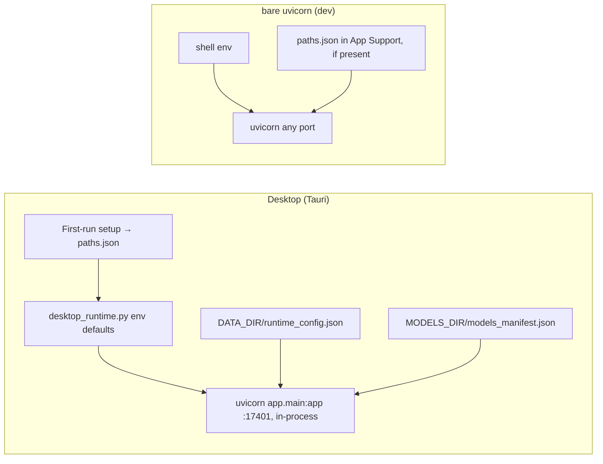

# Configuration reference

**What this covers.** Every configuration knob the Orb backend and desktop shell read: pydantic `Settings` fields (env vars), the `ORB_*` environment variables read directly via `os.environ`, the two JSON bootstrap files (`paths.json`, `DATA_DIR/runtime_config.json`), the per-KB LLM override columns, the desktop port variables, and the layer that sets each value (first-run setup, desktop runtime, runtime config, or hard-coded). It also states the precedence rules and the differences between desktop and bare-uvicorn runs. The narrative explanation of how `Settings` is built lives in [Backend core](06-backend-core-and-configuration.md); this file is the lookup table.

**Related docs:** [Backend core and configuration](06-backend-core-and-configuration.md) · [Desktop shell](04-desktop-shell.md) · [Packaging, build and release](05-packaging-build-and-release.md) · [Knowledge bases and vaults](08-knowledge-bases-and-vaults.md) · [Ingestion pipeline](10-ingestion-pipeline.md) · [Multimedia enrichment](11-multimedia-enrichment.md) · [Local models and inference](12-local-models-and-inference.md) · [LLM providers and prompting](13-llm-providers-and-prompting.md) · [Search indexes](15-search-indexes-qdrant-meilisearch.md) · [Retrieval and chat](16-retrieval-and-chat.md) · [Finance / Firefly](17-finance-firefly.md) · [Frontend architecture](18-frontend-architecture.md) · [Data directory layout](22-data-directory-layout.md) · [Logging and observability](23-logging-and-observability.md) · [Development guide](27-development-guide.md)

## 1. How to read the tables

| Column | Meaning |
|---|---|
| Name | Environment variable / `Settings` field. Legacy aliases in parentheses. |
| Type / default | Python type as declared, and the code default. |
| Read in | File and function that consumes the value. "`Settings`" means it is a pydantic field on `backend/app/core/config.py::Settings`; "env" means read directly with `os.environ` / `_env_first`. |
| Effect | What changes. |
| Set by | Which layer normally provides the value: **setup** (`paths.json` written by the shell's first-run setup page or `POST /api/v1/setup/paths`), **runtime** (`backend/app/desktop_runtime.py` sets it in its own environment before running uvicorn; "shell" where the Tauri shell sets it on the runtime process), **env** (any process environment variable, e.g. a contributor's shell), **runtime** (`DATA_DIR/runtime_config.json` via `PATCH /api/v1/settings` / Setup), **manifest** (`MODELS_DIR/models_manifest.json` selection written by Setup), **code** (hard-coded default; not normally overridden). |

Markers: **unused** = declared but never read in `backend/app`; **overridden** = whatever you set is replaced by code.

## 2. Sources and precedence

### 2.1 For `Settings` fields

pydantic-settings resolves each field as: **process environment** > **field default** (`extra="ignore"`; there is no `.env` file) (some defaults are themselves computed from `paths.json`). Then, in this order, code mutates the live object:

1. `config.py` bottom: `MODELS_PATH := MODELS_DIR` (always). `KUZU_DB_PATH` is a read-only property, `<DATA_DIR>/kuzu/kuzu_graph`, not a setting.
2. `main.startup_event`: `runtime_config.apply_to_settings()` — `LLM_PROVIDER`, `CHAT_MODEL`, `LLM_BASE_URL` (and the local-runtime knobs) from `runtime_config.json` **win over env**.
3. `main.startup_event`: `local_models.sync_embedding_infrastructure()` — `EMBEDDING_DIMENSIONS`, `EMBEDDING_MODEL`, `MODEL_RERANKER_LOCAL` from the models manifest **win over env**.
4. Later, at user action: `PATCH /api/v1/settings`, `POST /api/v1/setup/paths`, Setup model selection (`ensure_chat_and_embed_models` also sets `LLM_MODEL`).

So for the provider/model axis the effective order is: **per-KB override (row in `knowledge_bases`) > `runtime_config.json` > env > default**; for embedding dims/model: **manifest > env > default**; for paths: **env > `paths.json` > repo fallback**.

### 2.2 For directly-read env vars

`paths.py` and `local_models.py` read these with `os.environ.get("ORB_X") or default`. The `LIVEOS_*` aliases no longer exist. These are read **at call time** (each model load, each download), except `CHAT_MODEL_ID` / `EMBED_MODEL_ID` / `RERANK_MODEL_ID` (`ORB_*_GGUF`) which are module constants evaluated once at import.

### 2.3 Layers per run mode



| Aspect | Desktop | Bare uvicorn |
|---|---|---|
| `DATA_DIR` | `paths.json.data_dir` (default `~/Library/Application Support/Orb/data`; must be local disk — `desktop_runtime.main()` warns when the path is under `CloudStorage`, `Mobile Documents`, `Dropbox` or `Google Drive`), `ORB_DATA_DIR` if exported | env, or `paths.json` from a previous desktop run (!), or `<repo>/data` |
| `MODELS_DIR` | `paths.json.models_dir` | env / `paths.json` / `backend/models` |
| DB | SQLite `DATA_DIR/orb.db` | SQLite `DATA_DIR/orb.db` |
| Qdrant | `127.0.0.1:17433` (set by the runtime) | default `127.0.0.1:6333` |
| Meili | `127.0.0.1:17470`, key from `DATA_DIR/meili_master_key` | `127.0.0.1:7700`, `orb-dev-key` |
| Firefly | `FIREFLY_BASE_URL=http://127.0.0.1:17412`, `FIREFLY_RUNTIME_FILE=DATA_DIR/firefly/runtime.json` | not configured unless set |
| UI | served by the API at `/` (`FRONTEND_DIR`) — CORS unused | Vite dev server on 3700 proxies to the API; CORS default list |
| Logs | `DATA_DIR/logs/*.log`; runtime + API stdout in `backend.log` | `DATA_DIR/logs` + terminal |

A dev gotcha: a bare `uvicorn` run on a machine that also has the desktop app installed will **pick up the desktop's `paths.json`** (because `_default_app_support()` finds it) and therefore share the desktop's `orb.db`, vaults and models unless `ORB_DATA_DIR`/`ORB_MODELS_DIR` (or `ORB_PATHS_FILE` pointing at a scratch file) are exported.

## 3. Reference tables by area

### 3.1 Paths and bootstrap

| Name | Type / default | Read in | Effect | Set by |
|---|---|---|---|---|
| `ORB_PATHS_FILE` | path / `<App Support>/Orb/paths.json` | env — `paths.paths_json_location()`; also `src-tauri/src/runtime.rs` | Location of the bootstrap JSON | rarely (scratch profiles); the shell and runtime read the same default location |
| `ORB_DATA_DIR` (`DATA_DIR`) | path / `paths.json.data_dir` → `<repo>/data` | env — `paths.resolve_data_dir()`; `Settings.DATA_DIR` default is that result | Root for `orb.db`, `kuzu/`, `qdrant/`, `meilisearch/`, `logs/`, `vaults/`, `bin/`, `firefly/`, `runtime_config.json`, `meili_master_key`, `boot-status.json`. Keep it on local disk: the runtime prints `[desktop] WARNING: data dir … cloud-synced` for iCloud/OneDrive/Dropbox/Google Drive paths | setup (`paths.json`); env only in dev |
| `ORB_MODELS_DIR` (`MODELS_DIR`) | path / `paths.json.models_dir` → `backend/models` | env — `paths.resolve_models_dir()`; `Settings.MODELS_DIR` | Root for `gguf/` (incl. `mmproj-*` vision projectors), HF snapshots (`qwen3-asr-1.7b[-hf]`, `marlin-2b`), `manifest.json` | setup (`paths.json`); the runtime exports it to the multimodal-prep child |
| `MODELS_PATH` | str / `"models"` → **overridden** to `MODELS_DIR` | `Settings` (config.py bottom, `paths.sync_settings_paths`) | Alias only | code |
| `KUZU_DB_PATH` | read-only property, `<DATA_DIR>/kuzu/kuzu_graph` (not settable) | `Settings`; `kb_registry` default KB, `graph.GraphService` default | Default KB's Kuzu file; per-KB files are `<DATA_DIR>/kuzu/<slug>/kuzu_graph` | code |
| `ORB_DEFAULT_VAULT` | path / none | env — `paths.resolve_default_vault_path()` **after** `paths.json.default_vault_path` | Default KB vault folder when the file has none; else `<DATA_DIR>/vaults/default` | rarely (dev) |
| `ORB_HF_STAGING`, `ORB_DOWNLOAD_STAGING` | path / macOS `~/Library/Caches/Orb/model-downloads`, Windows `%LOCALAPPDATA%/Orb/model-downloads`, Linux `~/.cache/orb/model-downloads` | env — `paths.local_download_staging_dir()` | Local SSD staging dir for GGUF/HF downloads destined for a network `MODELS_DIR` | rarely |
| `ORB_FORCE_DOWNLOAD_STAGING` | any non-empty | env — `local_models.download_file` | Always stage downloads locally even when `MODELS_DIR` is not a network volume | rarely |
| `APPDATA`, `LOCALAPPDATA` | OS | env — `paths._default_app_support`, `local_download_staging_dir` (Windows) | Windows base dirs | OS |
| `PYTHONPATH` | `<backendDir>` | Python | Makes `app.*` importable when cwd ≠ `backend/` | shell |

### 3.2 Database

| Name | Type / default | Read in | Effect | Set by |
|---|---|---|---|---|
| (none) | — | `database.py` always uses `sqlite+aiosqlite:///<DATA_DIR>/orb.db` (`paths.sqlite_url()`; `sqlite_url(driver="pysqlite")` gives the vault watcher its sync engine URL) with `NullPool`, `check_same_thread=False`, `PRAGMA foreign_keys=ON` | The `DATABASE_BACKEND` / `DATABASE_*_URL` (Postgres) settings were removed with the Tauri migration | code |
| `STORAGE_BACKEND`, `FILES_URL` | not `Settings` fields | nowhere in backend (`extra="ignore"`) | none; legacy (S3 vs local) | — |

### 3.3 LLM — chat/retrieval axis

| Name | Type / default | Read in | Effect | Set by |
|---|---|---|---|---|
| `LLM_PROVIDER` | str / `"local"` | `Settings`; `llm.LLMService.__init__` (`ollama`/`lm_studio` → `local` + warning), `ai_gate`, `api/settings.py`, `api_desktop.setup_status`, `kb_registry.effective_llm_config` | Primary provider: `local` (in-process GGUF), `openai`, `gemini`, `anthropic`, `huggingface`; other strings → `ValueError("Unsupported LLM provider")` on first use | runtime (`provider`) > supervisor (`process.env.LLM_PROVIDER \|\| "local"`) > env |
| `CHAT_MODEL` | str \| None / `None` | `Settings`; `llm.get_chat_model` | Provider-agnostic chat model id; wins over the provider-specific keys | runtime (`model`), env |
| `LLM_MODEL` | str / `"local-chat"` | `Settings`; `llm.get_chat_model` (local + final fallback), `local_models` (label; set to the selected catalog id by `ensure_chat_and_embed_models`), `api/settings.py` | Local model id / placeholder; `"local-chat"` resolves to the manifest selection at runtime | manifest, env |
| `OPENAI_MODEL` / `GEMINI_MODEL` / `ANTHROPIC_MODEL` / `HUGGINGFACE_MODEL` | str \| None / `None` | `Settings`; `llm.get_chat_model`, `get_ingestion_model`, provider call sites (`_anthropic_*` always use `ANTHROPIC_MODEL`), `multimedia.py` image captions | Per-provider fallback model when `CHAT_MODEL` unset. `HUGGINGFACE_MODEL` is **required** for `huggingface` (`init_clients` raises) | env |
| `LLM_BASE_URL` | str / `http://127.0.0.1:8080` | `Settings`; `llm.get_base_url()` (system default endpoint for `openai_compat`), `ai_gate` (cloud heuristics), `api/settings.py`, `runtime_config` | The endpoint used when `LLM_PROVIDER=openai_compat` and no per-KB `llm_base_url` is set. Normalised by `credentials.normalize_base_url`; a malformed value is ignored with a warning rather than crashing | runtime (`base_url`), env |
| `LLM_API_KEY` | str / `"local"` | `Settings`; `ai_gate` only | Treated as "real" when not `local`/`lm-studio`/`ollama` | env |
| `CHAT_HISTORY_MAX_MESSAGES` | int / `24` | `Settings`; `chat_store.get_recent_history`/`refresh_summary` window, `schemas/chat.render_history` slicing | Max prior turns loaded/injected | env |

### 3.4 LLM — ingestion axis

| Name | Type / default | Read in | Effect | Set by |
|---|---|---|---|---|
| `EXTRACTION_CHUNK_TOKENS` | int \| None / `None` (learned, `4000` ceiling) | `Settings`, edited in Models → Local runtime — `workflows/extraction_chunking.chunk_token_budget` | Max input tokens per extraction chunk. Effective budget = `max(400, min(ceiling, (ctx − prompt_overhead − 64) / 3.5))`; values below `MIN_SPLIT_TOKENS=400` are raised to 400; non-int ignored | rarely |
| `LARGE_ATTACHMENT_TOKENS` | int / `20000` | `Settings`, edited in Models → Local runtime (`large_attachment_tokens`, ≥ 1000) — `ingestion_agent.multimodal_node` (`_resolve`) | An attachment whose extracted text has more ingestion-model tokens than this is parked as a `mode="pending"` block until the user picks graph / summarize / index for search ([11 §6.4](11-multimedia-enrichment.md)); images are never parked | runtime (`runtime_config.json`, Models → Local runtime) |
| `INGESTION_PIPELINE_CONCURRENCY` | int / `1` | `Settings`; `workflows/ingestion.IngestionWorkflow` (`asyncio.Semaphore`, captured at construction) | Whole-note pipeline parallelism (1 = FIFO) | env |
| `MULTIMEDIA_CONCURRENCY` | int / `1` | `Settings`; `workflows/agents/ingestion_agent.py` module-level `asyncio.Semaphore` (import time) | Parallel vision / Qwen3-ASR / Marlin jobs | env |

### 3.5 Embeddings axis

| Name | Type / default | Read in | Effect | Set by |
|---|---|---|---|---|
| `EMBEDDING_PROVIDER` | str / `"local"` | `Settings`; `embedding.EmbeddingService.__init__` | Accepted: `local`, `auto`, `""` (and deprecated `ollama`/`lm_studio` → local). **Anything else raises** `ValueError` | runtime (`local`), env |
| `EMBEDDING_MODEL` | str / `"local-embed"` | `Settings`; `embedding.py` (`is_qwen3` substring check → query instruction), overwritten by `sync_embedding_infrastructure`/`ensure_chat_and_embed_models` | Embedding model id (catalog id from manifest) | manifest > env |
| `EMBEDDING_DIMENSIONS` | int / `1024` | `Settings`; `qdrant_service` (vector size for collection create), `local_models` (manifest sync) | Must match the GGUF's output; changed dims trigger Qdrant collection recreation in `sync_embedding_infrastructure` | manifest > env |
| `ORB_EMBED_GGUF` | str / `Qwen/Qwen3-Embedding-0.6B-GGUF/Qwen3-Embedding-0.6B-Q8_0.gguf` | env (import-time constant `local_models.EMBED_MODEL_ID`) | Legacy default GGUF id used when the manifest has no selection (`gguf_paths_if_present` fallback) | rarely |
| `EMBED_N_CTX` | int / `8192` | env — `local_models.LocalLlamaRuntime._load_embed_unlocked` | `n_ctx` for the embed GGUF | runtime (`8192`) |

### 3.6 Qdrant

| Name | Type / default | Read in | Effect | Set by |
|---|---|---|---|---|
| `QDRANT_HOST` | str / `127.0.0.1` | `Settings`; `qdrant_service.QdrantService.__init__` (captured per KB context) | `QdrantClient(host=…)` | runtime |
| `QDRANT_PORT` | int / `6333` | same | HTTP port (desktop `17433`) | runtime (`PORTS["qdrant"]`) |
| `QDRANT_API_KEY` | str \| None / `None` | same | Only for Qdrant Cloud | env |
| `QDRANT_COLLECTION_NODE_CORES` / `QDRANT_COLLECTION_NODE_RELATIONSHIPS` / `QDRANT_COLLECTION_NODE_ISOLATED_CONTEXTS` | str / `node_cores` / `node_relationships` / `node_isolated_contexts` | `Settings`; `qdrant_service` defaults, `kb_registry._ensure_default_row` | Collection names for the **default KB**; other KBs use `<slug>_node_cores` etc. | code |
| `QDRANT__STORAGE__STORAGE_PATH`, `QDRANT__SERVICE__HTTP_PORT` | Qdrant's own env | Qdrant binary | `DATA_DIR/qdrant`, `17433` | runtime |

### 3.7 Meilisearch

| Name | Type / default | Read in | Effect | Set by |
|---|---|---|---|---|
| `MEILI_HOST` | str / `127.0.0.1` | `Settings`; `meilisearch_service.MeilisearchService.__init__` (`http://{host}:{port}`) | Meili host | runtime |
| `MEILI_PORT` | int / `7700` | same | Port (desktop `17470`) | runtime |
| `MEILI_MASTER_KEY` | str / `orb-dev-key` | same | API key. Desktop: `desktop_runtime.resolve_meili_master_key` → env `MEILI_MASTER_KEY`, else `DATA_DIR/meili_master_key` (random for fresh installs, `orb-dev-key` when a Meili DB already exists) | runtime |
| `MEILI_INDEX_NAME` | str / `orb_nodes` | `Settings`; `meilisearch_service` default, `kb_registry` default row | Index for the default KB; others `<slug>_nodes` | code |
| `MEILI_ENV`, `MEILI_DB_PATH` | Meili's own env | Meili binary | Not used: the runtime passes `--db-path DATA_DIR/meilisearch --master-key …` as CLI args | — |

### 3.8 Kuzu

| Name | Type / default | Read in | Effect | Set by |
|---|---|---|---|---|
| `KUZU_DB_PATH` | see §3.1 — property, not a setting | — | — | code |

Kuzu has no other knobs; per-KB paths, healing of legacy directory paths (`normalize_kuzu_path`) and the schema are in [14](14-graph-storage-kuzu.md).

### 3.9 Local GGUF runtime (`LLAMA_*`, `ORB_EMBED_*`, `ORB_RERANK_*`, model ids)

All read in `backend/app/services/local_models.py` (and `model_catalog.py` for the light-weight detector) via `os.environ.get("ORB_X")` **at each model load**, so changing them and reloading the model (idle unload or Setup "select model") takes effect without a restart — except the three `*_GGUF` constants.

| Name (alias) | Type / default | Read in | Effect | Set by |
|---|---|---|---|---|
| `LLAMA_BACKEND` | `auto` \| `metal` \| `cuda` \| `vulkan` \| `cpu` / `auto` | `local_models.detect_llama_backend`, `model_catalog.detect_accel_backend` (only `ORB_` name) | Forces the llama.cpp accel path. `auto`: macOS → `metal` (`n_gpu_layers=-1`); Linux/Windows with `nvidia-smi` → `cuda` (-1); else `cpu` (0). Forced `cpu` → 0 layers, forced GPU → -1 | rarely |
| `LLAMA_N_GPU_LAYERS` | int / per backend (-1 GPU, 0 CPU) | same | Overrides layer offload count | rarely |
| `LLAMA_N_CTX` | int / `16384` | `_default_chat_n_ctx` → `_chat_kwargs`, `_remaining_output_budget` fallback, `llm.ingestion_context_tokens` | Chat GGUF context window. Raised automatically to `max_tokens + prompt_reserve` when an explicit `LLAMA_MAX_TOKENS` is set and `n_ctx` is smaller. Comment: 16k + `swa_full` fits ~24 GB Metal; 32k OOMs | runtime (`16384`) |
| `LLAMA_MAX_TOKENS` | int \| unset / **unset** (working tree; was `10240`) | `_default_chat_max_tokens` → `create_chat_completion`, `_chat_kwargs` | Explicit output cap. **When unset (new default), the runtime sizes `max_tokens` per call as `n_ctx − prompt_tokens − 32` (`_GEN_SAFETY_MARGIN`), raising `PromptTooLongError` if fewer than 256 tokens (`_MIN_OUTPUT_TOKENS`) would remain.** `0`/non-int → treated as unset. Supervisor now injects it **only if the parent env has it** (committed code injected `"10240"`) | runtime (pass-through only) |
| `LLAMA_PROMPT_RESERVE` | int / `4096` | `_chat_kwargs` | Minimum context reserved for the prompt when computing `min_ctx = max_tokens + prompt_reserve` | runtime (`4096`) |
| `LLAMA_SWA_FULL` | bool-ish / `true` | `_llama_metal_safe_kwargs` | `swa_full=False` only for `0`/`false`/`no`; otherwise `True` (required for stable Gemma 4 output; compact SWA causes "or the" ordinal loops, detected by `_ORDINAL_LOOP_RE` → `RepetitionLoopError`) | runtime (`true`) |
| `LLAMA_FLASH_ATTN` | bool-ish / off | `_llama_metal_safe_kwargs` | `flash_attn=True` for `1`/`true`/`yes` | rarely |
| `LLAMA_REPEAT_PENALTY` | float / `1.12` | `_default_repeat_penalty` → chat completion kwargs | Sampling repeat penalty | runtime (`1.12`) |
| `LLAMA_N_THREADS` | int / llama.cpp default | `_chat_kwargs` | CPU threads | rarely |
| `EMBED_N_CTX` | int / `8192` | `_load_embed_unlocked` | Embed GGUF context | runtime (`8192`) |
| `RERANK_N_CTX` | int / `8192` | `LocalGGUFReranker.ensure_loaded` | Reranker GGUF context | runtime (`8192`) |
| `MODEL_IDLE_SECONDS` | float / `300` | `model_idle_seconds` → idle watcher threads for chat/embed and reranker | Seconds of inactivity before in-process GGUFs are unloaded; `0` = never unload; negatives clamp to 0 | rarely |
| `ORB_CHAT_GGUF` | HF `repo/file` / `bartowski/google_gemma-4-E4B-it-GGUF/google_gemma-4-E4B-it-Q4_K_M.gguf` | import-time `CHAT_MODEL_ID` | Legacy default chat GGUF (used only when the manifest has no selection) | rarely |
| `ORB_EMBED_GGUF` | / `Qwen/Qwen3-Embedding-0.6B-GGUF/Qwen3-Embedding-0.6B-Q8_0.gguf` | `EMBED_MODEL_ID` | Legacy default embed GGUF | rarely |
| `ORB_RERANK_GGUF` | / `mradermacher/Qwen3-Reranker-0.6B-GGUF/Qwen3-Reranker-0.6B.Q4_K_M.gguf` | `RERANK_MODEL_ID` → `reranker_gguf_path` fallback | Legacy default reranker GGUF | rarely |
| `MODEL_RERANKER_LOCAL` | str / `qwen3-reranker-0.6b` | `Settings`; `retrieval.py` (labels only), overwritten from manifest | Display name of the reranker in logs/progress | manifest > env |

The chat/embed/reranker **files actually loaded** come from `MODELS_DIR/models_manifest.json` (`selection.chat_path`, `embed_path`, `reranker_path`, `embedding_dims`, ids), written by Setup — not from env. See [12](12-local-models-and-inference.md).

### 3.10 Multimodal models (Qwen3-ASR / Marlin / image description)

| Name | Type / default | Read in | Effect | Set by |
|---|---|---|---|---|
| `MODEL_ASR_HF` / `MODEL_ASR_LOCAL` | str / `""` / `""` | `Settings`; `multimodal_models._asr_repo_and_dir` | Qwen3-ASR repo and `MODELS_DIR` folder. Empty = `asr_engine` picks per platform: `qwen3-asr-1.7b` (MLX, Apple Silicon) or `qwen3-asr-1.7b-hf` (transformers); an explicit value pins it | code |
| `ASR_ENGINE` | `auto` \| `mlx` \| `transformers` / `auto` | `Settings`; `multimodal_models`, `multimodal_runtime` | Transcription backend; an explicit engine is never substituted | env |
| `ASR_LANGUAGE` | str \| None / `"en"` | `Settings`; `multimodal_runtime` | Language hint; `None` lets the model detect it | env |
| `ASR_SPEAKERS` / `ASR_DIARIZE_STEP` / `ASR_MAX_SPEAKERS` | bool / float / int \| None — `True` / `2.0` / `None` | `Settings`; `multimodal_runtime` | Speaker labels via pyannote community-1 (GPU when available, else CPU), its segmentation step, optional speaker cap | env |
| `MODEL_MARLIN_HF` / `MODEL_MARLIN_LOCAL` | `lunahr/Marlin-2B-ungated` / `marlin-2b` | `Settings`; `multimodal_models.model_ids("marlin")` | Video understanding model (Qwen3.5-based) | code |
| `IMAGE_DESCRIBE_MAX_PIXELS` | int / `1500000` | `Settings`; `multimedia.py` via `getattr(..., 0) or 1_500_000` | Downscale images above this many pixels before any model (local vision projector or cloud) sees them. **`0` is not "unlimited"** — it falls back to 1.5 MP | env |
| `FORCE_QWENVL_VIDEO_READER` | str / `pyav` | `multimodal_runtime` `os.environ.setdefault` (consumed by `qwen-vl-utils`) | Video decoder backend | code (`setdefault` — env wins if pre-set) |
| `VIDEO_MAX_PIXELS` | int / `200704` | same `setdefault` (qwen-vl-utils) | Per-frame pixel budget for Marlin | code / env |
| `FPS` / `FPS_MAX_FRAMES` / `FPS_MIN_FRAMES` | `2.0` / `240` / `4` | same | Frame sampling for Marlin | code / env |
| `PATH` | OS | `multimodal_runtime` (adds `/opt/homebrew/bin`, `/usr/local/bin`, `/usr/bin`, `~/bin` when searching for `ffmpeg`/`ffprobe`; prepends the found bin dir for pydub); `runtime.rs tool_path()` (prepends Homebrew / `/usr/local/bin` to `PATH` for the runtime) | Finding ffmpeg from a GUI-launched app | OS / shell |

### 3.11 PDF knobs (`services/multimedia.py`)

| Name | Type / default | Effect |
|---|---|---|
| `PDF_VISUAL_EXTRACTION_MAX_PAGES` | int / `0` | Cap of visually processed pages per PDF; `0` = all qualifying pages |
| `PDF_VISUAL_RENDER_DPI` | int / `144` | Render DPI (`max(value, 72)`; zoom = dpi/72) |
| `PDF_VISUAL_TEXT_THRESHOLD` | int / `80` | Pages whose native text length ≥ threshold skip the visual pass |

### 3.12 Retrieval tuning (`services/retrieval.py`)

| Name | Type / default | Effect |
|---|---|---|
| `VECTOR_PRE_RERANK_THRESHOLD` | float / `0.45` | Qdrant min score when the reranker is on |
| `RERANKER_TOP_K` | int / `10` | Candidates kept after rerank (both passes) |
| `RERANKER_SCORE_THRESHOLD` | float / `0.05` | Drop reranked candidates below |
| `GRAPH_EXPAND_TOP_NEIGHBORS` | int / `10` | Relationship entries kept per graph expansion |
| `GRAPH_EXPAND_SCORE_THRESHOLD` | float / `0` | Neighbour score filter (only when > 0) |
| `MAX_LOOP_ITERATIONS` | int / `3` | Multi-hop loop iterations |

### 3.13 Feature switches

| Name | Type / default | Read in | Effect |
|---|---|---|---|
| `TEMPORAL_DIGEST_PERIOD` | str / `"month"` (`week`/`year` accepted) | `workflows/ingestion.py`, `api/admin.py` | Default granularity |

### 3.14 Firefly III

| Name | Type / default | Read in | Effect | Set by |
|---|---|---|---|---|
| `FIREFLY_BASE_URL` | str \| None / `None` | `Settings`; `firefly_service.FireflyService.__init__` | Firefly API base (`http://127.0.0.1:17412`); unset → finance endpoints error | runtime |
| `FIREFLY_RUNTIME_FILE` | str \| None / `None` | same | `DATA_DIR/firefly/runtime.json` (`apiToken`, php/app paths) written by `desktop_runtime.py` | runtime |
| `FIREFLY_API_TOKEN` | str \| None / `None` | `firefly_service._token` | Overrides the token from `runtime.json` | .env (rare) |
| `ORB_FIREFLY_VERSION`, `ORB_PHP_BIN_VERSION` | `v6.6.6`, `1.2.0` | `desktop_runtime.py` (also `desktop/build.py` for the seed) | Which Firefly/PHP bundle the runtime downloads / the build seeds | rarely |
| `APP_URL`, `HOME`, `USERPROFILE` | — | Firefly PHP child | Set by the runtime for `artisan serve` | runtime |

### 3.15 CORS, logging, API identity

| Name | Type / default | Read in | Effect | Set by |
|---|---|---|---|---|
| `CORS_ORIGINS` | CSV str / `http://localhost:3700,http://localhost:3701,http://127.0.0.1:3700,http://127.0.0.1:3701,http://localhost:17400,http://127.0.0.1:17400` | `main.py` | `allow_origins` list; unused in the desktop app (UI is same-origin) | env |
| `CORS_ALLOW_ORIGIN_REGEX` | str \| None / `None` | `main.py` | `allow_origin_regex` | env |
| `LOG_LEVEL` | str / `INFO` | `Settings`; `log.setup_logging` (`getattr(logging, X.upper(), INFO)` — invalid names silently become INFO) | Root + component logger level; `errors.log` always ERROR | env |

### 3.16 Desktop shell and runtime: ports and process env (`desktop/src-tauri/src/runtime.rs`, `backend/app/desktop_runtime.py`)

| Name (alias) | Default | Read in | Effect |
|---|---|---|---|
| `ORB_API_PORT` | `17401` | `runtime.rs`, `desktop_runtime.py` | uvicorn port; the window URL and the UI origin follow it |
| `ORB_FIREFLY_PORT` | `17412` | `desktop_runtime.py` | Firefly `artisan serve` port and `FIREFLY_BASE_URL` |
| `ORB_QDRANT_PORT` | `17433` | `desktop_runtime.py` | Qdrant HTTP port → `QDRANT_PORT` |
| `ORB_MEILI_PORT` | `17470` | `desktop_runtime.py` | Meili port → `MEILI_PORT` |
| `ORB_URL` | `http://127.0.0.1:<ORB_API_PORT>` | `runtime.rs` | Window URL override (Vite dev server on 3700) |
| `ORB_PATHS_FILE`, `ORB_SKIP_WIZARD`, `ORB_ROOT`, `ORB_PYTHON`, `ORB_USE_RESOURCES` | see [04](04-desktop-shell.md) §6 | `runtime.rs` | Scratch profile, skip setup, dev layout/interpreter overrides |
| `ORB_QDRANT_VERSION`, `ORB_MEILI_VERSION`, `ORB_SHA256_<ASSET>` | `v1.18.2`, `v1.49.0`, unset | `desktop_runtime.py` | Binary versions fetched into `DATA_DIR/bin`; optional checksum pins |
| `LLM_PROVIDER`, `EMBEDDING_PROVIDER` | `local` / `local` | `desktop_runtime.py` `os.environ.setdefault` | Defaults the runtime applies unless already exported |

Env the shell sets on the runtime process (`runtime.rs`): `PYTHONPATH=<backend>`, `PATH` (with Homebrew/usr-local bins for ffmpeg), `FRONTEND_DIR` and `ORB_RESOURCES_ROOT` (packaged builds only). Env the runtime sets before importing `Settings` (`desktop_runtime.main()`): `QDRANT_HOST=127.0.0.1`, `QDRANT_PORT`, `MEILI_HOST=127.0.0.1`, `MEILI_PORT`, `MEILI_MASTER_KEY`, `FIREFLY_BASE_URL`, `FIREFLY_RUNTIME_FILE`, plus the `setdefault` block above. Paths come from `paths.json` through `app.core.paths`; `ORB_DATA_DIR`/`ORB_MODELS_DIR` are not injected (they still override when exported).

### 3.17 Frontend env (`frontend/`)

| Name | Default | Read in | Effect |
|---|---|---|---|
| `VITE_API_URL` | `/api/v1` | `src/lib/api.ts` (build-time `import.meta.env`) | API base; nothing sets it — the UI is same-origin with the API |
| `API_PROXY_TARGET` | `http://127.0.0.1:17401` | `vite.config.ts` (dev server only) | Where the Vite dev server proxies `/api/v1`, `/vault-files`, `/health` |
| `FRONTEND_DIR` (backend `Settings`) | unset → `<repo>/frontend/dist` | `backend/app/main.py` | Directory the API serves at `/`; the shell sets it to `<resources>/frontend` in packaged builds |

## 4. JSON files

### 4.1 `paths.json`

Location: `ORB_PATHS_FILE` or `<App Support>/Orb/paths.json` (macOS `~/Library/Application Support/Orb/`, Windows `%APPDATA%\Orb\`, Linux `~/.config/Orb/`).

```json
{
  "data_dir": "/abs/path/Orb/data",
  "models_dir": "/abs/path/Orb/models",
  "default_vault_path": "/abs/path/Vault"
}
```

| Key | Required | Writer | Reader |
|---|---|---|---|
| `data_dir` | yes | setup page (`save_setup` in `src-tauri/src/commands.rs`), `POST /api/v1/setup/paths` (`paths.save_paths_file`) | `paths.resolve_data_dir` (after env), `runtime.rs` (log dir) |
| `models_dir` | yes | same | `paths.resolve_models_dir` |
| `default_vault_path` | no (preserved if omitted on save) | same | `paths.resolve_default_vault_path` (**before** env) |

All paths are stored absolute (`expanduser().resolve()`). The backend caches the parsed file for the process lifetime (`_PATHS_CACHE`); `save_paths_file` refreshes it. Deleting the file shows the first-run setup page again on next desktop launch.

`data_dir` belongs on local disk: `desktop_runtime.main()` prints `[desktop] WARNING: data dir … is inside a cloud-synced folder` when a path component is `CloudStorage`, `Mobile Documents`, `Dropbox` or `Google Drive` (Files-On-Demand eviction blocks reads; sync clients corrupt SQLite/Kuzu/Qdrant under a running engine). `default_vault_path` is the only path that may point into a synced folder.

### 4.2 `DATA_DIR/runtime_config.json`

```json
{
  "provider": "gemini",
  "model": "gemini-2.5-pro",
  "base_url": "http://127.0.0.1:8080"
}
```

| Key | → `settings` field | Written by |
|---|---|---|
| `provider` | `LLM_PROVIDER` | `PATCH /api/v1/settings` |
| `model` | `CHAT_MODEL` | `PATCH /api/v1/settings` |
| `base_url` | `LLM_BASE_URL` | `PATCH /api/v1/settings` |

Only these three keys and the fourteen `LOCAL_RUNTIME_KEYS` (the llama.cpp knobs and `large_attachment_tokens`, written by `PUT /api/v1/settings/local-runtime`, see [12](12-local-models-and-inference.md)) survive `load()`/`save()` (`MUTABLE_KEYS`); unknown keys — including an `ingestion_model` left by an older build — are dropped on the next save. Applied at startup after `init_db`. No API keys, ever. A fallback location `<repo>/data/runtime_config.json` is used only if `paths` cannot be imported.

### 4.3 `MODELS_DIR/models_manifest.json` (pointer)

Not a config file you edit, but it is the third override source: `selection.{chat_id, chat_path, embed_id, embed_path, embedding_dims, reranker_id, reranker_path}` drive `EMBEDDING_MODEL`, `EMBEDDING_DIMENSIONS`, `MODEL_RERANKER_LOCAL`, `LLM_MODEL` and which GGUF files load. Documented in [12](12-local-models-and-inference.md).

### 4.4 Per-KB LLM override (working tree)

Stored in `knowledge_bases.llm_provider / llm_model / llm_ingestion_model` (SQLite), edited via `PATCH /api/v1/kb/{kb_id}/llm` with body `{"provider"?, "model"?, "ingestion_model"?}` where `""`, `"inherit"`, `"system"`, `"default"` or `null` mean "inherit". Validation: provider ∈ `kb_registry.LLM_PROVIDERS = ("local","openai","gemini","anthropic","huggingface")`; cloud providers need their API key (`ai_gate.provider_is_configured`); local model ids must be known catalog chat models that are already downloaded (`model_catalog.get_option`, `chat_model_downloaded`). The service is constructed immediately to surface bad configs; on failure the override is cleared and 400 returned. Resolution (`effective_llm_config`): `provider = row.llm_provider or LLM_PROVIDER`; `model = row.llm_model or _system_model_for(provider)`; `ingestion_model = row.llm_ingestion_model or model`.

## 5. The provider axes and model-key fallback chains

Chat and ingestion share one provider and model; embeddings are separate:

| Axis | Provider key | Model key (generic) | Provider-specific fallbacks |
|---|---|---|---|
| Chat / retrieval and ingestion | `LLM_PROVIDER` | `CHAT_MODEL` | `LLM_MODEL` (local), `OPENAI_MODEL`, `GEMINI_MODEL`, `ANTHROPIC_MODEL`, `HUGGINGFACE_MODEL` |
| Embeddings | `EMBEDDING_PROVIDER` (`local` only) | `EMBEDDING_MODEL` + `EMBEDDING_DIMENSIONS` | manifest selection |

Reranker and multimodal models have no provider axis: always in-process GGUF / HF snapshots.

### 5.1 `LLMService.get_chat_model()` — exactly as implemented

```
1. self._chat_model_override            (per-KB pinned model; working tree)
2. settings.CHAT_MODEL                  (if truthy)
3. if provider == "local": settings.LLM_MODEL
4. {"openai": OPENAI_MODEL, "gemini": GEMINI_MODEL,
    "anthropic": ANTHROPIC_MODEL, "huggingface": HUGGINGFACE_MODEL}[provider]
   — .get() with default settings.LLM_MODEL for unknown providers;
   NOTE a provider whose *_MODEL is None returns None here (no further fallback)
```

### 5.2 `LLMService.get_ingestion_model()`

```
1. self._ingestion_model_override   (per-KB `llm_ingestion_model` — "Use a different model for note ingestion")
2. self.get_chat_model()            (§5.1)
```

Ingestion runs on the model selected for chat; there are no ingestion-specific settings. The removed `INGESTION_*` keys made the global service chat on `CHAT_MODEL` while ingestion fell through to the `"local-chat"` placeholder and loaded the manifest's download selection, so two different GGUFs were loaded.

Caveats visible in the call sites: the Anthropic branches of `generate`/`ingestion_generate` pass `model=settings.ANTHROPIC_MODEL` directly (ignoring `CHAT_MODEL`); the Gemini ingestion branch uses `model or settings.GEMINI_MODEL`; `init_clients` log lines print the provider-specific key even when `CHAT_MODEL` is what will be used.

### 5.3 Provider selection

```
chat provider      = (ctor provider | settings.LLM_PROVIDER).lower(); ollama/lm_studio → local
ingestion provider = (ctor ingestion_provider | "").lower(); ollama/lm_studio → local
                     "" → chat provider (clients aliased); no settings key
embedding provider = settings.EMBEDDING_PROVIDER: local|auto|"" → local; else ValueError
```

Per-KB services are built as `LLMService(prov, chat_model=…, ingestion_model=…, ingestion_provider=prov)` so a pinned KB never mixes providers between chat and ingestion; the global service passes no `ingestion_provider`, so it never does either.

### 5.4 `kb_registry._system_model_for(provider)` (what the UI shows as "inherited")

```
is_global = provider == settings.LLM_PROVIDER
if is_global and CHAT_MODEL → CHAT_MODEL
else {"local": LLM_MODEL, "openai": OPENAI_MODEL, "gemini": GEMINI_MODEL,
      "anthropic": ANTHROPIC_MODEL, "huggingface": HUGGINGFACE_MODEL}[provider]
```

## 6. Declared-but-unused and documented-but-ineffective keys

| Key | Status |
|---|---|
| `MODELS_PATH` | read but overwritten by code |
| `LLM_BASE_URL`, `LLM_API_KEY` | only affect `ai_is_configured()`; no HTTP client uses them |
| `STORAGE_BACKEND`, `FILES_URL` | not `Settings` fields; ignored by the backend |
| `EMBEDDING_PROVIDER=openai` | raises `ValueError` |
| `IMAGE_DESCRIBE_MAX_PIXELS=0` | not "full resolution"; falls back to 1.5 MP |

## 7. Adding a knob (checklist)

1. Decide the layer: import-time constant (needs restart), `Settings` field (env), runtime-mutable (`runtime_config.MUTABLE_KEYS` + `apply_to_settings` + `api/settings.LLMSettings`), per-KB (column in `knowledge_bases` + `kb_registry` DDL/`_ensure_optional_columns` + `KBContext`), or `ORB_*` env read at call time (`os.environ.get("ORB_X")`).
2. Add the field/env read and — for desktop-relevant values — the default in `desktop_runtime.main()` (`os.environ.setdefault` block or the sidecar `os.environ.update`).
3. Read it where used via `settings.X` at call time; if it must be captured at import, note the restart requirement in the docstring.
4. Update this file and [06](06-backend-core-and-configuration.md) §5.3.
