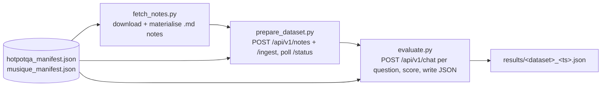
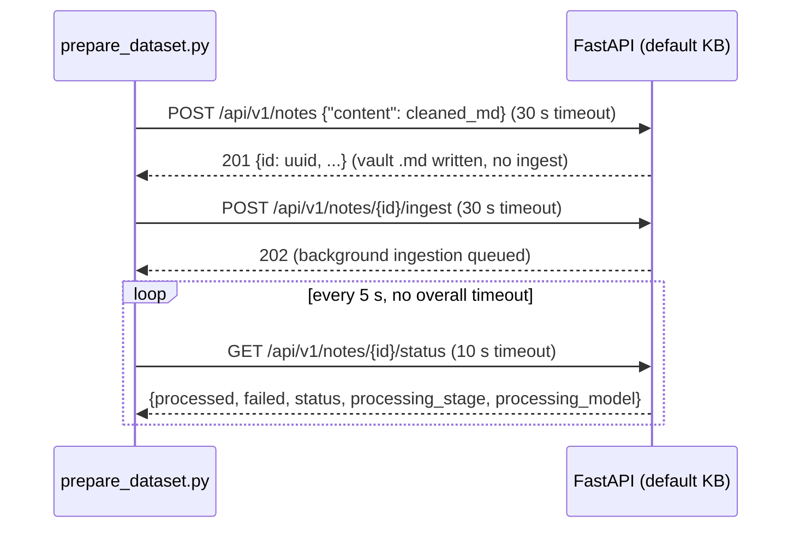

# Testing and Benchmarks

**What this covers.** Everything that verifies Orb's behaviour: the pytest unit suite under `backend/tests/unit/` (what each module pins, what `conftest.py` stubs and why), the lint/type tooling (`backend/.pylintrc`, `frontend/eslint.config.mjs`, `frontend/tsconfig.json`), the multi-hop QA benchmark harness under `backend/tests/benchmark/` (HotpotQA / MuSiQue manifests, `fetch_notes.py`, `prepare_dataset.py`, `evaluate.py`, metric formulas and output schema), the `Results/` archive of every benchmark experiment run between February and May 2026 and the code decisions those experiments drove, the current testing gaps (no CI test job, no frontend tests, stale unit tests), and how to add tests for new services following the existing patterns.

**Related docs:** [Overview](01-overview.md) · [System architecture](02-system-architecture.md) · [Repository layout](03-repository-layout.md) · [Packaging, build and release](05-packaging-build-and-release.md) · [Backend core and configuration](06-backend-core-and-configuration.md) · [API reference](07-api-reference.md) · [Notes, wikilinks and vault files](09-notes-wikilinks-and-vault-files.md) · [Ingestion pipeline](10-ingestion-pipeline.md) · [Local models and inference](12-local-models-and-inference.md) · [LLM providers and prompting](13-llm-providers-and-prompting.md) · [Graph storage (Kuzu)](14-graph-storage-kuzu.md) · [Search indexes (Qdrant / Meilisearch)](15-search-indexes-qdrant-meilisearch.md) · [Retrieval and chat](16-retrieval-and-chat.md) · [Configuration reference](21-configuration-reference.md) · [Logging and observability](23-logging-and-observability.md) · [Development history](25-development-history.md) · [Decisions and constraints](26-decisions-and-constraints.md) · [Development guide](27-development-guide.md) · [Glossary](28-glossary.md)

---

## 1. Responsibilities and boundaries

| Owns | Does NOT own |
|---|---|
| `backend/tests/unit/` — the only automated test suite in the repository (pytest, pure-Python, no live infrastructure). | Runtime behaviour of the services under test — see the per-subsystem docs linked above. |
| `backend/tests/benchmark/` — the offline multi-hop QA harness (dataset fetch, ingestion driver, evaluator) plus the two checked-in question manifests. | The chat/retrieval code that the harness exercises over HTTP (`backend/app/api/chat.py`, `backend/app/services/retrieval.py`, `backend/app/workflows/chat.py`) — see [Retrieval and chat](16-retrieval-and-chat.md). |
| `Results/` — the immutable archive of every benchmark experiment (Markdown reports, `*_results.json`, raw log folders). This archive is tracked in git even though `*.log` is globally ignored (see the `.gitignore` override below). | Producing new reports automatically: the Markdown reports were written by hand (with log-analysis scripts that are not in the repo) after each run. `evaluate.py` only emits the JSON. |
| Lint/type configuration: `backend/.pylintrc`, `frontend/eslint.config.mjs`, `frontend/tsconfig.json`. | CI enforcement — there is none. `.github/workflows/desktop-release.yml` is the only workflow and it builds installers only (see [Packaging, build and release](05-packaging-build-and-release.md)). |

Boundary facts that matter when modifying code:

- Unit tests never start Qdrant, Meilisearch, Kuzu, SQLite, or an LLM. Every service is instantiated with `Class.__new__(Class)` to skip `__init__` (which would open connections), then the attributes the method under test reads are set by hand. Any change to a service's `__init__`-assigned attribute names (`client`, `_enabled`, `collection`, `_index`, `_db`, `_conn`) silently breaks the corresponding test helper.
- The benchmark harness talks only to the public HTTP API (`/api/v1/notes`, `/api/v1/notes/{id}/ingest`, `/api/v1/notes/{id}/status`, `/api/v1/chat`). It has no import dependency on `app.*` (the `sys.path.insert` in `evaluate.py` is vestigial; nothing from `app` is imported).
- The harness is single-KB: it never sends `?kb=`, so it operates on whatever the backend resolves as the default KB. Run it against a dedicated KB by making that KB the default before starting (see [Knowledge bases and vaults](08-knowledge-bases-and-vaults.md)).


## 2. Files

| Path | Purpose | Key exports / contents |
|---|---|---|
| `backend/tests/__init__.py`, `backend/tests/unit/__init__.py` | Make `tests` a package so pytest's default (`prepend`) import mode inserts `backend/` on `sys.path`; `app.*` imports then work from any cwd. | — |
| `backend/tests/unit/conftest.py` | Shared fixtures: autouse settings patch, `MagicMock`/`AsyncMock` service stubs, sample-data helpers. | `event_loop_policy`, `patch_settings` (autouse), `mock_llm_service`, `mock_graph_service`, `mock_meili_service`, `mock_typesense_service` (alias), `mock_qdrant_service`, `make_node()`, `make_relationship()` |
| `backend/tests/unit/test_chat_context.py` | Follow-up query rewrite (`LLMService.rewrite_follow_up_query`). | 6 tests in `TestRewriteFollowUpQuery` |
| `backend/tests/unit/test_extraction_schemas.py` | Pydantic pre-validators in `app/schemas/extraction.py` (key aliasing, `None` handling, score normalisation, wrapper unwrapping). | 5 classes, ~33 tests |
| `backend/tests/unit/test_graph_layout.py` | Pure geometry in `app/utils/graph_layout.py`. | `TestFibonacciSphere`, `TestDeterministicJitter`, `TestComputeSolarPositions`, `TestComputeSpringLayout3d` |
| `backend/tests/unit/test_graph_queries.py` | Cypher-shape regression guards for `GraphService.get_related_nodes` (and the since-removed `find_paths_between_nodes`). | `_get_graph_service_class()` (imports `app.services.graph` with `kuzu.Database`/`kuzu.Connection` patched), `_make_graph_service()`, `_row()` |
| `backend/tests/unit/test_llm_json_cleaning.py` | `LLMService._clean_json` (fence stripping, control chars, smart quotes, `json_repair`). | 4 classes, 15 tests |
| `backend/tests/unit/test_meili_contract.py` | Meilisearch document contract: `node_id` (primary key) always present in `index_node` / `update_node_community` payloads; errors logged not raised. | `_make_meili_service()` |
| `backend/tests/unit/test_qdrant_contract.py` | Qdrant payload/filter contract for `upsert_node_core` and `search_node_cores`. | `_make_service()` |
| `backend/tests/unit/test_relationships.py` | Relationship-type ontology helpers (`can_evolve`, `get_inverse_type`, …) from `app/schemas/relationships.py` — **module no longer exists** (deleted in `da75dfc`, 2026-05-28). | Fails at collection with `ModuleNotFoundError`. |
| `backend/tests/unit/test_extraction_chunking.py` (untracked) | Paragraph-bounded chunking, token budget, and extraction merge in `app/workflows/extraction_chunking.py`. | `TestSplitForExtraction`, `TestChunkTokenBudget`, `TestMergeExtractions` |
| `backend/tests/unit/test_ingestion_chunked_extraction.py` (untracked) | Chunk/truncate/retry loop and batched image titling in `ingestion_agent`; documents the duck-typed LLM protocol via `_StubLLM`. | 4 async tests |
| `backend/tests/unit/test_kb_llm_config.py` (untracked) | Per-KB provider/model override resolution (`kb_registry.effective_llm_config`) and `LLMService` model getters. | `TestEffectiveLLMConfig`, `TestLLMServiceOverrides` |
| `backend/tests/unit/test_local_runtime_budget.py` (untracked) | `LocalLlamaRuntime` output budgeting, token counting, `ORB_LLAMA_MAX_TOKENS`, GGUF resolution. | `TestOutputBudget`, `TestMaxTokensEnv`, `TestResolveChatGguf` |
| `backend/tests/unit/test_model_load_clock.py` (untracked) | `ModelLoadClock` snapshot/diff/describe. | `TestModelLoadClock` |
| `backend/tests/benchmark/README.md` | Operator guide for the harness. | — |
| `backend/tests/benchmark/fetch_notes.py` | Downloads HotpotQA distractor-dev JSON and LongBench `musique.jsonl`, materialises the note `.md` files referenced by the manifests. | `fetch_hotpotqa(force=)`, `fetch_musique(force=)`, filename sanitisers |
| `backend/tests/benchmark/prepare_dataset.py` | Drives ingestion through the API one note at a time with resumable progress. | `prepare()`, `retry_failed()`, `_create_and_ingest()`, `_wait_for_completion()`, `_resolve_pending()`, `_clean_content()` |
| `backend/tests/benchmark/evaluate.py` | Asks every manifest question via `POST /api/v1/chat`, scores answers and retrieval, writes JSON. | `EvaluationResult`, `normalize_answer()`, `compute_answer_f1()`, `extract_answer_from_response()`, `fuzzy_match()`, `extract_contexts_from_response()`, `evaluate_single()`, `calculate_metrics()`, `print_report()` |
| `backend/tests/benchmark/hotpotqa_manifest.json` | 100 HotpotQA dev questions (79 bridge, 21 comparison, all `level: hard`) referencing 990 unique notes. | see §7.2 |
| `backend/tests/benchmark/musique_manifest.json` | 50 LongBench-MuSiQue questions (2–4 hops; 32×4-hop, 11×3-hop, 7×2-hop) referencing 526 notes. | see §7.2 |
| `backend/.pylintrc` | Backend lint policy. | see §6 |
| `frontend/eslint.config.mjs`, `frontend/tsconfig.json` | Frontend lint + TS strictness. | see §6 |
| `Results/Results (Sub Questions Approach)/…` | Feb 2026 experiments (Neo4j/Postgres era, sub-question decomposition retrieval). | 6 reports, 4 results JSON, 6 log folders |
| `Results/Results (Looping approach)/…` | Mar 2026 experiments (iterative retrieval loop). | 3 reports, 2 results JSON, 3 log folders |
| `Results/Results (Joint Approach)/…` | Mar–Apr 2026 (joint node+relationship extraction). | 1 report, 2 side-test results JSON, 3 log folders |
| `Results/Results (Final Implementation)/…` | May 2026 (Kuzu/Typesense migration, GGUF reranker). | 5 reports, 3 results JSON, 4 log folders |
| `Results/Results (After Optimizations)/…` | 17 May 2026 (post ingestion/retrieval optimisation pass). | 1 report, 1 results JSON, 1 log folder |
| `.github/workflows/desktop-release.yml` | The only CI workflow: four `electron-builder` jobs on tag `desktop-v*`. **No job runs pytest, pylint, eslint or `tsc`.** | — |


## 3. Running the unit tests

### 3.1 Invocation

```bash
cd backend
source .venv/bin/activate            # or use .venv/bin/python -m pytest
pip install pytest pytest-asyncio    # NOT in requirements.txt — see below
python -m pytest tests/unit -q
python -m pytest tests/unit/test_extraction_schemas.py -q      # one module
python -m pytest tests/unit -q -k "chunk"                       # by keyword
```

- Run from `backend/` (or pass `backend/tests/unit` as the path). `backend/tests/__init__.py` and `backend/tests/unit/__init__.py` make `tests` a package, so pytest's default `prepend` import mode inserts `backend/` (the first ancestor without an `__init__.py`) on `sys.path`; `import app...` then resolves without `PYTHONPATH`.
- There is **no** `pytest.ini`, `pyproject.toml`, `setup.cfg` or `tox.ini` in `backend/`, so every pytest option is at its default. In particular `asyncio_mode` is `strict`, which means `async def` tests must carry `@pytest.mark.asyncio` — the four async tests in `test_ingestion_chunked_extraction.py` do.
- No markers, no `-p` plugins, no coverage configuration. `.gitignore` ignores `.pytest_cache/`.

### 3.2 Dependencies the suite needs

| Package | Why | In `requirements.txt`? |
|---|---|---|
| `pytest` | runner | **No** |
| `pytest-asyncio` | `@pytest.mark.asyncio` tests + the `event_loop_policy` fixture in `conftest.py` | **No** |
| `instructor`, `json-repair`, `openai`, `google-genai`, … | imported at module level by `app/services/llm.py` (five test modules import `LLMService`) | yes |
| `qdrant-client` | `app/services/qdrant_service.py` (`test_qdrant_contract.py` also imports `qdrant_client.models` directly) | yes |
| `kuzu` | `test_graph_queries.py` does `patch("kuzu.Database")`, which imports the real `kuzu` module before patching | yes |
| `meilisearch` | `app/services/meilisearch_service.py` | yes |
| `langgraph` and the rest of the ingestion stack | `app/workflows/agents/ingestion_agent.py` (`test_ingestion_chunked_extraction.py`) | yes |
| `llama-cpp-python` | `app/services/local_models.py` (`test_local_runtime_budget.py`, `test_model_load_clock.py`) — only if imported at module top; the tests never load a GGUF | yes (multimodal extras separate) |

In short: the unit tests need the **full** backend environment installed, even though they never open a connection. A venv built from `requirements.txt` plus `pytest pytest-asyncio` is the minimum.

### 3.3 Environment and settings

- `conftest.py`'s autouse `patch_settings` fixture sets `settings.LLM_PROVIDER = "lm_studio"` for every test, so no `.env` is required. Importing `app.core.config` still evaluates `Settings()` once: it reads `backend/.env` **if present** (`env_file` in `model_config`, `extra="ignore"`) and resolves `DATA_DIR`/`KUZU_DB_PATH` defaults — see [Backend core and configuration](06-backend-core-and-configuration.md). If you have a real `.env` in `backend/`, its values leak into the tests except for the keys individual tests monkeypatch.
- `test_kb_llm_config.py` has its own autouse fixture that overrides `LLM_PROVIDER` to `"local"` and pins `LLM_MODEL`, `CHAT_MODEL`, `INGESTION_MODEL`, `INGESTION_LLM_MODEL`, `GEMINI_MODEL`, `OPENAI_MODEL` — it runs after `patch_settings` and wins.
- Env vars read by code under test and controlled via `monkeypatch.setenv/delenv`: `ORB_EXTRACTION_CHUNK_TOKENS`, `ORB_LLAMA_MAX_TOKENS` (and its legacy alias `LIVEOS_LLAMA_MAX_TOKENS`). Nothing else touches the OS environment.
- Nothing writes to disk except `tmp_path` fixtures in `test_local_runtime_budget.py`.

### 3.4 Observed state of the suite (2026-09-02)

Recorded factually; this is what happens today, not what should happen.

- `backend/.venv` (Python 3.14.7) is a **partial** install: it has `fastapi 0.141.1`, `pydantic 2.13.4`, `SQLAlchemy 2.0.51`, but no `kuzu`, `qdrant_client`, `instructor`, `langgraph`, `meilisearch`, `json_repair`, and no `pytest`. `python -m pytest` therefore fails immediately with `No module named pytest`.
- After `pip install pytest pytest-asyncio` into that venv, `python -m pytest tests/unit -q` **fails at collection with 7 errors**:
  - `ModuleNotFoundError: No module named 'instructor'` — 5 modules (`test_chat_context.py`, `test_llm_json_cleaning.py`, `test_kb_llm_config.py`, and the two that pull in `ingestion_agent` / `graph`), all via `app/services/llm.py`.
  - `ModuleNotFoundError: No module named 'qdrant_client'` — `test_qdrant_contract.py`.
  - `ModuleNotFoundError: No module named 'app.schemas.relationships'` — `test_relationships.py`. This one is **independent of the venv**: the module was deleted in commit `da75dfc` (2026-05-28, "Add temporal digest features and admin APIs") and the test was never removed.
- With a complete environment, static reading of the current sources shows these additional failures are expected (see §5 for the reasoning per test):
  - `test_graph_queries.py`: 3 of 6 tests — `get_related_nodes()` no longer accepts `min_confidence`, and `find_paths_between_nodes()` no longer exists (both removed in `fbcafe7`, 2026-08-03).
  - `test_chat_context.py::test_returns_latest_when_empty_query`: asserts the whitespace-only query `"   "` is returned verbatim, but `rewrite_follow_up_query` now strips first and returns `""`.
- Everything else (extraction schemas, graph layout, JSON cleaning, Meili/Qdrant contracts, and the five new modules) is consistent with the current code as far as static inspection can tell.

Nothing runs these tests automatically: the only GitHub workflow builds installers (§6.4, §12).

## 4. `conftest.py` — fixtures and what they stub

`backend/tests/unit/conftest.py` is the only conftest (the `tests/integration/` package and its conftest were deleted in `335a253`). Its module docstring still says services are "Kuzu, Qdrant, Typesense, Postgres" — Typesense became Meilisearch and Postgres became SQLite; the fixtures predate both changes.

| Fixture / helper | Scope | What it provides | What it stubs and why | Used by current tests? |
|---|---|---|---|---|
| `event_loop_policy` | session | `asyncio.DefaultEventLoopPolicy()` | The pytest-asyncio hook that decides which loop policy async tests run under. Harmless without the plugin (it is just an unused fixture). | Implicitly by the 4 `@pytest.mark.asyncio` tests in `test_ingestion_chunked_extraction.py` |
| `patch_settings` | function, **autouse** | — | `monkeypatch.setattr(config.settings, "LLM_PROVIDER", "lm_studio", raising=False)`. Prevents any provider branch in `LLMService` from selecting a cloud client and removes the need for a `.env`. `"lm_studio"` is a legacy provider name from the Feb–Mar 2026 LM Studio era; the current default in `config.py` is `"local"`. | Every test (autouse); overridden by `test_kb_llm_config.py` |
| `mock_llm_service` | function | `MagicMock` with `AsyncMock` methods `select_relevant_relationships → []`, `select_relevant_docs_with_reasoning → {"selected": [], "reasoning": ""}`, `generate_node_enrichment_async → {description,title,facts,questions}` | Stands in for `LLMService` in Joint-Approach-era retrieval tests. **None of these three methods exist on `LLMService` today** (removed with the Final Implementation refactor `68494b7` and the desktop cleanup `fbcafe7`). | No |
| `mock_graph_service` | function | `MagicMock` with `get_related_nodes → []`, `find_paths_between_nodes → []`, `resolve_node_id → None`, `execute_query → []` | Stands in for `GraphService`. `find_paths_between_nodes` no longer exists. | No |
| `mock_meili_service` | function | `MagicMock` with `is_available → True`, `index_node`, `update_node_community`, `delete_node` | Stands in for `MeilisearchService`; method names are still accurate. | No |
| `mock_typesense_service` | function | alias returning `mock_meili_service` | Backward-compat alias from the Typesense era ("Kuzu/Typesense migration", `68494b7`, 2026-05-07). | No |
| `mock_qdrant_service` | function | `MagicMock` with `find_node_id_by_name → None`, `upsert_node` (`AsyncMock → True`), `search_node_cores → []` | Stands in for `QdrantService`. The real write method is the **sync** `upsert_node_core`; `upsert_node` does not exist. | No |
| `make_node(name, kind="indexable", node_id=None)` | helper | `{"id", "name", "kind", "description"}` dict | Sample node row shaped like a Kuzu `Node` (`kind` ∈ indexable/note/community). | No |
| `make_relationship(source, target, rel_type="RELATED_TO", confidence=0.9)` | helper | `{"source_name", "target_name", "rel_type", "confidence"}` dict | Sample edge. Note the key is `rel_type` (Kuzu edge property) not `relationship_type` (Pydantic `ExtractedRelationship`). | No |

The pattern the live tests actually rely on is **not** these fixtures but three idioms, documented in §13:

1. `Service.__new__(Service)` to bypass `__init__` (which opens clients), then assign the exact attributes the method under test reads (`client`, `_enabled`, `collection`, `_index`, `_db`, `_conn`, `provider`, `_chat_model_override`, `_chat`).
2. `unittest.mock.patch.object(svc, "method", return_value=…)` to cut off the next layer down (`_reason_step_sync`, `execute_query`, `resolve_node_id`).
3. Module import under `patch("kuzu.Database")`/`patch("kuzu.Connection")` after `sys.modules.pop("app.services.graph")`, so a module-level singleton constructor never touches disk.

## 5. Unit test modules — contract pinned and why it matters

Nine tracked modules plus five untracked (uncommitted as of 2026-09-02) modules. "Status" is against the current sources.

| Module | Target | Tests | Status |
|---|---|---|---|
| `test_chat_context.py` | `LLMService.rewrite_follow_up_query` | 6 | 5 pass, 1 stale assertion |
| `test_extraction_schemas.py` | `app/schemas/extraction.py` validators | ~33 | pass |
| `test_graph_layout.py` | `app/utils/graph_layout.py` | 19 | pass |
| `test_graph_queries.py` | `GraphService.get_related_nodes` / `find_paths_between_nodes` | 6 | 3 fail (API removed) |
| `test_llm_json_cleaning.py` | `LLMService._clean_json` | 15 | pass (needs `json_repair`) |
| `test_meili_contract.py` | `MeilisearchService.index_node` / `update_node_community` | 4 | pass |
| `test_qdrant_contract.py` | `QdrantService.upsert_node_core` / `search_node_cores` | 13 | pass if `_col_cores` resolves (see below) |
| `test_relationships.py` | `app/schemas/relationships.py` | 31 | **ImportError** — module deleted |
| `test_extraction_chunking.py` (untracked) | `app/workflows/extraction_chunking.py` | 14 | pass |
| `test_ingestion_chunked_extraction.py` (untracked) | `ingestion_agent._extract_with_chunking`, `_batch_image_titles` | 4 (async) | pass |
| `test_kb_llm_config.py` (untracked) | `kb_registry.effective_llm_config`, `LLMService.get_chat_model/get_ingestion_model` | 10 | pass |
| `test_local_runtime_budget.py` (untracked) | `LocalLlamaRuntime` budgeting / GGUF resolution | 13 | pass |
| `test_model_load_clock.py` (untracked) | `ModelLoadClock` | 4 | pass |

### 5.1 `test_chat_context.py` — follow-up query rewriting

Contract pinned for `LLMService.rewrite_follow_up_query(history, latest_query, model=None)` (in `app/services/llm.py`):

- Returns `latest_query` untouched when `history` is empty (no LLM call).
- Only the last `settings.CHAT_HISTORY_MAX_MESSAGES` turns are used; turns whose `role` is not `user`/`assistant` or whose `content` is empty are dropped from the prompt (`"ignored"` must not appear; `"Fido overview."` must).
- Turn content longer than 600 characters is truncated to 597 + `"..."` (test uses 800 × `x`).
- The rewrite goes through `self._reason_step_sync(prompt, model=model)`; the tests patch that method so no provider is contacted.
- On any exception from the LLM the original query is returned (never raise into the chat endpoint).
- Accepted rewrites are stripped of surrounding quotes and rejected (falling back to the original) if longer than 300 characters — not tested.

Why it matters: this is the only guard that multi-turn chat (`POST /api/v1/chat` with `conversation_id`, added in `ac7f4e4`, 2026-07-02) degrades to single-turn retrieval instead of failing when the local model is busy or offline. See [Retrieval and chat](16-retrieval-and-chat.md).

Stale assertion: `test_returns_latest_when_empty_query` expects `"   "` back for a whitespace query; the implementation now does `latest = (latest_query or "").strip()` first and returns `""`. Fix the test, not the code.

### 5.2 `test_extraction_schemas.py` — tolerant Pydantic validators

Pins the pre-validators in `app/schemas/extraction.py` that absorb the many shapes local models emit for the extraction JSON (every benchmark report in `Results/` lists a different malformation — LM Studio `json_object` fallbacks, "relationships as plain strings", `question_attribute` as a list):

| Class / validator | Contract |
|---|---|
| `Node.normalize_keys` (`mode="before"`) | `trait` or `title` → `name` when `name` missing (`name` wins); `evidence_quote` or `context` → `isolated_context` (`isolated_context` wins). Non-dict input passes through. |
| `Node.handle_none` (`field_validator("*")`) | `None` → `""` for every field except `type` → `"thing"`. |
| `ExtractedRelationship.normalize_keys` | `entity1`→`source_name`, `entity2`→`target_name`, `description`→`natural_language`. |
| `ExtractedRelationship.handle_none_strings` | `None`/blank `relationship_type` → `"relates_to"`; other string fields `None` → `""`. |
| `ExtractedRelationship.normalize_scores` via `_normalize_score` | Defaults: confidence 7.0, strength 5.0, relevance 5.0. Labels: very high 9, high 8, medium/moderate 6, low 4, very low 2. Floats in `[0,1]` are ×10. Everything clamped to `[1.0, 10.0]` (`0.0 → 1.0`, `15 → 10`). Numeric strings are parsed; unparseable strings → default. |
| `Extraction.normalize_keys` | `None` → empty; unwrap `{"extraction"|"data"|"result": {...}}` when the inner dict has `nodes` or `relationships`; Gemma two-list `[nodes, rels]`; bare list of dicts/strings → nodes (strings become `{"name": s}`); a node's embedded `"relationships"` list is hoisted to the top level. |
| `Extraction.ensure_list` | `nodes`/`relationships` `None` or scalar → `[]`; string items in `nodes` → `{"name": …}`. |

Why it matters: the ingestion pipeline (`app/workflows/agents/ingestion_agent.py`, see [Ingestion pipeline](10-ingestion-pipeline.md)) calls `Extraction.model_validate` on whatever `_clean_json` returns; a validator regression turns into "note failed" for a whole model family. The edge-weight formula comment (`strength×0.5 + confidence×0.3 + relevance×0.2`) is why the 1–10 scale must be preserved — see [Graph storage (Kuzu)](14-graph-storage-kuzu.md).

### 5.3 `test_graph_layout.py` — deterministic 3-D layout

Pure functions in `app/utils/graph_layout.py` used by `GET /api/v1/graph/3d` (see [Frontend chat, graph and pages](20-frontend-chat-graph-and-pages.md)):

- `_fibonacci_sphere(n, radius)`: `[]` for `n ≤ 0`; exactly `n` distinct points all within 1 % of `radius`.
- `_deterministic_jitter(seed, max_offset)`: same seed → same tuple; different seeds differ; each component within `±max_offset`; `0.0` offset → zeros.
- `compute_solar_positions(communities, node_level_map, all_node_ids)`: every node id and every `community_id` gets a position; level-0 community centres sit at ≈`SOLAR_UNIVERSE_RADIUS` (1800.0, `rel=0.05`); nodes with no community ("orphans") still get positions; output is identical across calls.
- `compute_spring_layout_3d(nodes, edges, iterations=…)`: `{}` for no nodes; a single node at the origin; deterministic; every node positioned.

Why it matters: the graph canvas must not reshuffle on every reload, so no `random` without a seed anywhere in this module.

### 5.4 `test_graph_queries.py` — Cypher-shape regression guards

Built around `_get_graph_service_class()` (re-imports `app.services.graph` with `kuzu.Database`/`kuzu.Connection` patched, because the module constructs a singleton at import) and `_make_graph_service()` (instance via `__new__` with `_db`/`_conn` mocks).

Contracts:

- **depth = 1 fast path** must not use variable-length `*1..` syntax nor `all(`. Still true: `get_related_nodes(max_depth=1)` now issues two directed queries from `_hop_query("->")` and `_hop_query("<-")`, tags rows with `edge_direction`, dedupes by `node_id` (outgoing wins) and sorts by name. The assertion `result == expected` still holds only because the mock returns the same list object for both calls.
- **depth > 1** must not put `all(rel IN relationships(path) WHERE …)` in the `WHERE` clause — the code comment explains it "triggers a `KU_UNREACHABLE` parser assertion in this Kuzu build". Still true; confidence is returned as `confidence_path` and (per the comment) filtered in Python.
- **Post-filter by `min_confidence`**: `test_depth2_results_filtered_by_confidence` calls `get_related_nodes(..., min_confidence=0.5)`. The parameter was removed in `fbcafe7`; the current signature is `(node_name, max_depth=2, node_id=None)` and the depth>1 branch returns rows unfiltered — **TypeError today**, and the behaviour it pinned no longer exists (check callers in `retrieval.py` before re-adding).
- `find_paths_between_nodes(names, max_depth)`: both tests fail with `AttributeError`; the method was deleted in `fbcafe7`. The patch target `app.services.graph.qdrant_service` still resolves (the module imports the singleton), which is why the failure surfaces only at call time.
- Unknown node (`resolve_node_id → None`) → `[]`. Passes.

Why it matters: Kuzu's Cypher dialect differs from Neo4j's; the Neo4j-era hyphenated-relationship-type errors (32 per run, `Results/Results (Sub Questions Approach)/…/GEMINI_INGESTION_REPORT.md`) and the Kuzu `KU_UNREACHABLE` assertion were both discovered by benchmark runs, and these tests are the only thing that stops the query text from drifting back. See [Graph storage (Kuzu)](14-graph-storage-kuzu.md).

### 5.5 `test_llm_json_cleaning.py` — `_clean_json`

`LLMService._clean_json(json_str) -> str`, in order: (1) if ` ``` ` present, take the first fenced block (` ```json ` or bare) with `re.DOTALL`; (2) strip control characters `\x00-\x08 \x0b \x0c \x0e-\x1f` (newline, CR and tab survive); (3) map `‘ ’ ‛` → `'` and `“ ” „` → `"`; (4) `json_repair.repair_json(...)`, or return the cleaned string unchanged with a warning if `json_repair` is missing. Tests cover fence extraction with surrounding prose, null/bell removal, smart-quote normalisation, missing closing brace, trailing comma, and a combined case. The repair-dependent cases (`{"key": "value"` → valid JSON) fail without `json-repair==0.55.0`.

Why it matters: every structured LLM call (`extract_structured`, ingestion extraction, query analysis) goes through this; it is the first line of defence behind the validators in §5.2.

### 5.6 `test_meili_contract.py` — primary-key invariant

`_make_meili_service()` sets `client`, `collection="test_nodes"`, `_enabled=True`, `is_available`, and replaces `_index()` with a mock whose `add_documents` returns a task with `task_uid=1`. Contracts:

- `update_node_community(node_id, relationship_natural_language="", name="")` → the document sent to `add_documents` always contains `node_id` even when `get_node` returns `None` (document `{"node_id": …}` is synthesised), and contains `name` when supplied. Implementation detail now: it delegates to `update_nodes_community([...])`, which merges into the existing document and calls `add_documents(docs, primary_key="node_id")` once.
- `index_node(node_id, name, node_type, isolated_contexts_text="", relationship_natural_language="", community_level=None)` → document has `node_id` and `name`.
- Index errors are caught and logged with `logger.debug` (`update_nodes_community`) — never raised into ingestion. (`index_node` logs at `warning`; the test only covers the community path.)

Why it matters: Meilisearch's index is created with `primaryKey: "node_id"`; a document without it is rejected, silently dropping the node from keyword search. See [Search indexes](15-search-indexes-qdrant-meilisearch.md).

### 5.7 `test_qdrant_contract.py` — payload and filter contract

`_make_service()` sets only `_enabled=True` and `client=MagicMock()`. Contracts for `upsert_node_core(node_id, name, node_type, description_vector, description="", community_level=None, extra_payload=None)` (tests pass everything by keyword, so the positional order change is harmless):

- Payload always has `node_id`, `name`, `type`; `description` only when truthy; `community_level` only when not `None`; `extra_payload` merged last (can override).
- `_enabled=False` → `client.upsert` not called; `client=None` → returns without raising (both via `is_available()`).
- `search_node_cores(query_vector, limit, min_score, node_type=None, community_level=None)` → `client.query_points(..., query_filter=…)` where the filter is `None` when neither filter is set, else a `Filter(must=[FieldCondition(key="type"|"community_level", match=MatchValue(...))])`; disabled → `[]` and no call.

Caveat: the real methods also read `self._col_cores` (collection name) and call `self._prepare_vector`. If those are instance attributes assigned in `__init__`, `_make_service()` must set them too; verify when you next run the suite.

Why it matters: the `type` and `community_level` payload keys are the filter keys retrieval relies on; renaming either breaks entity-type-filtered search silently.

### 5.8 `test_relationships.py` — dead module

Imports `can_evolve`, `get_contradicting_types`, `get_expected_relationships`, `get_inverse_type`, `is_bidirectional` from `app/schemas/relationships.py` — the bi-temporal relationship ontology added in `033589d` (2026-02-01) and deleted in `da75dfc` (2026-05-28). The whole module errors at collection. Delete the test or restore the module; nothing in `app/` references those helpers.

### 5.9 `test_extraction_chunking.py` (new) — paragraph-bounded chunking and merge

Targets `app/workflows/extraction_chunking.py`:

- `split_for_extraction(text, budget_tokens, count_tokens) -> list[str]`: short text returned as one chunk; whitespace-only → `[]`; splits on `\n\n` paragraph boundaries first, packing whole paragraphs up to the budget; an oversized paragraph falls back to sentence splitting (chunks end with `.`); no chunk is empty; the concatenation of all chunks preserves every word in order.
- `chunk_token_budget(context_tokens, expected_output_tokens) -> int`: `budget × 3.5 ≤ context − output` (input plus ~2.5× output must fit the window); capped at **4000**; floored at `MIN_SPLIT_TOKENS`; env `ORB_EXTRACTION_CHUNK_TOKENS` overrides the cap in either direction.
- `merge_extractions(parts) -> Extraction`: `None` parts skipped; nodes deduplicated case-insensitively by name with `isolated_context` concatenated (duplicates not repeated); a generic `"thing"` type is upgraded by a later specific type; relationships deduplicated by case-insensitive `(source, target, relationship_type)` keeping the highest `confidence`; the first non-empty `title` wins.

### 5.10 `test_ingestion_chunked_extraction.py` (new) — the agent's chunk/retry loop

Loads the module with `importlib.import_module("app.workflows.agents.ingestion_agent")` because the package `__init__` re-exports the compiled LangGraph as the name `ingestion_agent`, shadowing the module. A `_StubLLM` documents the **duck-typed LLM protocol** the agent needs: `provider`, `ingestion_count_tokens(text)`, `ingestion_context_tokens()`, `get_ingestion_model()`, `_clean_json(raw)`, `async ingestion_generate_with_meta(prompt, temperature, max_tokens) -> (content, {"finish_reason", "truncated"})`, `async ingestion_generate(prompt, temperature, max_tokens)`. The stub finds the note as the text after the prompt's final `"nothing else:\n\n"` — a coupling to the extraction prompt's last line.

Contracts for `await agent._extract_with_chunking(llm, note_text, images) -> (Extraction, chunk_count)`:

- A short note is a single LLM call, `chunk_count == 1`.
- A 1000-word, 20-paragraph note with `ORB_EXTRACTION_CHUNK_TOKENS=400` produces ≥3 chunks, one call per chunk, and the merged extraction has exactly 1000 nodes (nothing lost, nothing duplicated) with the first chunk's title.
- When a chunk's response comes back `truncated=True` (unparseable JSON, `finish_reason="length"`), the agent halves the chunk and re-extracts **without sleeping** (`asyncio.sleep` is patched and must not be called) and without incrementing `chunk_count`; exactly one oversized call is made.
- `await agent._batch_image_titles(llm, items) -> dict[token, title]`: parses a JSON array (tolerating leading prose like `"Sure! "`), maps 1-based `index` to the `{{ORB_IMAGE_TITLE_n}}` tokens, drops empty titles and out-of-range indices, and returns `{}` on any exception.

Why it matters: this is the fix for the "Invalid JSON: EOF while parsing a value" ingestion failures recorded in `Results/Results (After Optimizations)/Gemma4_E4B_Logs/errors.log` and the Pydantic "relationships as strings" failure in the Final Implementation ingestion — small local context windows truncate long notes. See [Ingestion pipeline](10-ingestion-pipeline.md) and [Multimedia enrichment](11-multimedia-enrichment.md).

### 5.11 `test_kb_llm_config.py` (new) — per-KB model overrides

- `kb_registry.effective_llm_config(kb_row) -> {"provider", "model", "ingestion_model", "inherited"}`: `{}` or blank strings → inherit system settings (`inherited=True`), model = `CHAT_MODEL` if set else `LLM_MODEL`, ingestion follows the chat model; `llm_model` alone keeps the system provider and pins both chat and ingestion; `llm_provider` alone switches to that provider's system default model (`GEMINI_MODEL` for gemini).
- `LLMService.get_chat_model()` / `get_ingestion_model()`: `_chat_model_override` beats even a global `CHAT_MODEL`; `_ingestion_model_override` is independent; with no override, ingestion falls back to the pinned chat model, then settings. An instance created with `__new__` and **no** override attributes still works (the getters use safe attribute access).

Why it matters: the KB → provider/model resolution is what `?kb=` selects on every chat/ingest call; see [Knowledge bases and vaults](08-knowledge-bases-and-vaults.md) and [LLM providers and prompting](13-llm-providers-and-prompting.md). Model ids appearing here (`gemma4-12b-q4`, `gemma4-e4b-q4`, `qwen35-4b-q4`) are catalog ids from `app/services/model_catalog.py`.

### 5.12 `test_local_runtime_budget.py` (new) — llama.cpp budgeting without llama.cpp

A `_FakeLlama` exposing only `n_ctx()` and `tokenize()` is injected as `runtime._chat`.

- `LocalLlamaRuntime._remaining_output_budget(messages)` = `n_ctx − (Σ tokens + 8 per message + 4) − lm._GEN_SAFETY_MARGIN`; raises `lm.PromptTooLongError` when the prompt fills the window.
- `count_tokens(text)`: with no resident model uses the heuristic `len(text) // 4 + 1` (`""` → 0); with a model uses its tokenizer.
- `lm._default_chat_max_tokens()`: env `ORB_LLAMA_MAX_TOKENS` (legacy `LIVEOS_LLAMA_MAX_TOKENS`) — unset → `None` (dynamic budget), integer → that cap, garbage → `None`.
- `resolve_chat_gguf(model_id)`: `None`/`""`/`"local-chat"` → `None` (meaning "use the Setup selection"); known catalog id not on disk → `RuntimeError("… not downloaded")`; known id present (`_gguf_looks_complete` true) → `resolve_models_dir()/gguf/<option.hf_file>`; an embedding id (`qwen3-embed-0.6b-q8`) → `RuntimeError("… not a chat model")`; an explicit existing `.gguf` path → that `Path`; unknown name → `None`.

Why it matters: these are the invariants behind "one heavy model resident at a time" and the dynamic `max_tokens` that keeps long chats from overflowing the context — see [Local models and inference](12-local-models-and-inference.md) and [Data directory layout](22-data-directory-layout.md) for `models_dir/gguf/`.

### 5.13 `test_model_load_clock.py` (new) — load-time accounting

`ModelLoadClock.record(kind, seconds)`, `snapshot()`, `ModelLoadClock.diff(before, after) -> {"total_seconds", "seconds": {kind: s}, "counts": {kind: n}}` (only loads inside the window; tolerates `{}` as `before`), and `describe(delta)` → `"none"` or a stable, sorted, compact string like `"chat×1,rerank×2"`. Used to separate model-load time from inference time in chat/ingestion logs — see [Logging and observability](23-logging-and-observability.md).

## 6. Lint and type tooling

None of the tools below run in CI. They are developer-invoked only.

### 6.1 Backend — pylint (`backend/.pylintrc`)

Introduced in commit `335a253` (2026-05-15, "Remove feedback feature; add linting & refactors"), which also added the `# pylint: disable=…` inline directives found throughout `backend/app`.

| Section | Key | Value | Effect / rationale |
|---|---|---|---|
| `[MAIN]` | `init-hook` | `import sys; sys.path.insert(0, ".")` | Lets pylint resolve `app.*` imports when run from `backend/`. Run as `cd backend && pylint app`. |
| `[MESSAGES CONTROL]` | `disable` | `logging-fstring-interpolation`, `logging-not-lazy` | **Intentional decision** documented in the file: f-strings in `logger.*()` calls are kept for readability; the lazy-`%` micro-optimisation only matters when suppressed log levels are hit at high frequency, which "neither condition applies here". Do not "fix" f-string logging in this codebase. |
| `[FORMAT]` | `max-line-length` | `120` | Matches the existing code; do not reflow to 79/88. |
| `[DESIGN]` | `max-attributes` | `20` | Service singletons (`LLMService`, `QdrantService`, …) carry many attributes. |
| `[DESIGN]` | `max-public-methods` | `30` | Same reason. |
| `[SIMILARITIES]` | `min-similarity-lines` | `10` | Duplicate-code detector threshold. |

Inline suppressions you will see and should keep consistent when adding code: `# pylint: disable=too-many-arguments,too-many-positional-arguments` on wide service signatures (`index_node`, `upsert_node_core`, `search_node_cores`), `# pylint: disable=broad-exception-caught` on the many "log and continue" handlers, `# pylint: disable=too-many-locals,too-many-branches,too-many-statements` on the layout and retrieval functions.

`pylint` is **not** listed in `backend/requirements.txt`; install it into the venv separately. There is no `ruff`, `black`, `mypy` or `isort` configuration anywhere in the repo (the `.gitignore` entries for `.ruff_cache/` and `.mypy_cache/` are generic boilerplate).

### 6.2 Frontend — ESLint (`frontend/eslint.config.mjs`)

Flat config (ESLint 9, `defineConfig`/`globalIgnores` from `eslint/config`):

```js
export default defineConfig([
  ...nextVitals,            // eslint-config-next/core-web-vitals
  ...nextTs,                // eslint-config-next/typescript
  globalIgnores([".next/**", "out/**", "build/**", "next-env.d.ts"]),
  { rules: { "@typescript-eslint/no-unused-vars": ["warn", {
      vars: "all", args: "after-used", ignoreRestSiblings: true,
      argsIgnorePattern: "^_", varsIgnorePattern: "^_" }] } },
]);
```

- The only project-specific rule downgrades `no-unused-vars` to **warn** and whitelists `_`-prefixed identifiers, so `catch (_e)` / `(_req, res)` patterns are lint-clean.
- Invocation: `cd frontend && npm run lint` (script is literally `eslint`, so it lints the whole tree using the flat config's ignores). Versions pinned in `frontend/package.json`: `eslint ^9`, `eslint-config-next 16.2.12`, `typescript ^6`.
- No Prettier config; formatting is not enforced.

### 6.3 Frontend — TypeScript strictness (`frontend/tsconfig.json`)

| Option | Value | Note |
|---|---|---|
| `strict` | `true` | Full strict family (`strictNullChecks`, `noImplicitAny`, …). |
| `target` / `lib` | `ES2017` / `dom`, `dom.iterable`, `esnext` | |
| `module` / `moduleResolution` | `esnext` / `bundler` | Next.js 16 default. |
| `noEmit`, `isolatedModules`, `incremental`, `skipLibCheck`, `allowJs`, `esModuleInterop`, `resolveJsonModule` | `true` | Type-checking only; SWC does the transpile. |
| `jsx` | `react-jsx` | |
| `plugins` | `[{ "name": "next" }]` | Next.js language-service plugin. |
| `paths` | `"@/*": ["./src/*"]` | The `@/` alias used across `frontend/src`. |
| `include` | `next-env.d.ts`, `**/*.ts`, `**/*.tsx`, `.next/types/**/*.ts`, `.next/dev/types/**/*.ts`, `**/*.mts` | The `.next/dev/types` entry is a Next 16 addition (typed routes for the dev server). |

There is no `tsc` / `typecheck` npm script; type errors surface only via the IDE and `next build` (which fails the build on type errors unless `typescript.ignoreBuildErrors` is set — it is not). See [Frontend architecture](18-frontend-architecture.md).

### 6.4 What is *not* configured

| Tool | Status |
|---|---|
| Python formatter (black/ruff-format) | none |
| Python type checker (mypy/pyright) | none |
| Frontend unit tests (jest/vitest/@testing-library) | none — no dev dependency, no test files under `frontend/` |
| E2E (playwright/cypress) | none |
| Desktop (`desktop/`) tests or lint | none |
| Pre-commit hooks | none (`.pre-commit-config.yaml` absent) |
| CI test/lint job | none — `desktop-release.yml` only runs `npm ci`, `npm run prepare-dist`, `electron-builder` |


## 7. Benchmark harness — end to end

The harness lives in `backend/tests/benchmark/` and is a black-box client of the HTTP API. It has three stages, each a standalone script with an `argparse` CLI:



### 7.1 Datasets

| Dataset | Manifest | Questions | Notes | Source | Materialised notes dir |
|---|---|---|---|---|---|
| HotpotQA distractor dev | `hotpotqa_manifest.json` | 100 (79 `bridge`, 21 `comparison`; all `level: "hard"`) | 990 unique `.md` (10 per question incl. 8 distractors; the union is <1000 because paragraphs repeat across questions) | `hotpot_dev_distractor_v1.json` via web.archive.org snapshot of `curtis.ml.cmu.edu` | `hotpotqa_notes/` |
| MuSiQue (LongBench) | `musique_manifest.json` | 50 (32×4-hop, 11×3-hop, 7×2-hop; `avg_hop_count` 3.5) | 526 `.md` (one per passage; `avg_paragraphs` 10.6) | `THUDM/LongBench` `data.zip` → `musique.jsonl` | `musique_notes/` |

Every `Results/` report uses HotpotQA only. No MuSiQue results exist in the repo.

### 7.2 Manifest JSON schema

`hotpotqa_manifest.json`:

```json
{
  "dataset": "HotpotQA", "split": "dev", "num_examples": 100,
  "notes_dir": "tests/benchmark/hotpotqa_notes",
  "test_cases": [{
    "id": "5a8b57f25542995d1e6f1371",          // original HotpotQA _id (used by fetch_notes to find the example)
    "question": "...", "answer": "yes",
    "type": "comparison" | "bridge", "level": "hard",
    "supporting_facts": ["Scott Derrickson", "Ed Wood"],   // clean Wikipedia titles of the 2 gold paragraphs
    "all_notes": ["Ed Wood _film_.md", ...],              // 10 sanitised filenames (gold + distractors)
    "required_notes": ["Scott Derrickson.md", "Ed Wood.md"] // gold filenames
  }]
}
```

`musique_manifest.json`:

```json
{
  "dataset": "MuSiQue (LongBench - Local)", "source_file": "LongBench musique.jsonl (via fetch_notes.py)",
  "num_examples": 50, "avg_hop_count": 3.5, "avg_paragraphs": 10.6,
  "notes_dir": "tests/benchmark/musique_notes",
  "test_cases": [{
    "id": "musique_0",                 // "musique_<row index in musique.jsonl>"
    "question": "...", "answer": "Maria Bello",
    "hop_count": 4, "context_length": 66938, "paragraph_count": 14,
    "notes": ["q000_p00_Grown Ups _film_ _Passage 0_.md", ...],   // q<question>_p<passage>_<sanitised title ≤ ~20 chars> _Passage <n>_.md
    "required_notes": [ ...identical to notes... ]
  }]
}
```

Gotcha: for **all 50** MuSiQue cases `required_notes == notes`, i.e. every passage including distractors counts as "expected", so MuSiQue retrieval recall measures coverage of the whole passage set, not of the gold chain. HotpotQA is the only dataset with a real gold set (`supporting_facts`, 2 per question).

`prepare_dataset.py` unions `all_notes + notes + required_notes` per case (deduplicated, order preserved) to decide what to ingest; `evaluate.py` uses `required_notes` (falling back to `notes`) as the expected set and prefers `supporting_facts` names when present and string-typed.

### 7.3 `fetch_notes.py` — sources and caching

- `--dataset {hotpotqa,musique,all}` (default `all`), `--force` (rewrite even if present). Exits 1 with `❌ <error>` on any exception.
- Cache dir `.cache/` (gitignored): `hotpot_dev_distractor_v1.json` (re-downloaded if missing or < 1 MB), `longbench_data.zip` (downloaded if missing/< 1 MB, then `musique.jsonl` extracted and the ~114 MB zip **deleted**), `musique.jsonl` (kept if > 1 KB). Downloads stream to `<dest>.partial` then `rename` so a partial file never masquerades as complete. User-Agent `OrbBenchmarkFetcher/1.0`, 600 s timeout.
- Idempotence: if the notes dir exists and every filename the manifest expects is present, it prints "already present" and does nothing (unless `--force`).
- HotpotQA materialisation: for each manifest case, the source example is found by `_id`; every `(title, sentences)` in its `context` becomes `# <title-with-&amp;-and-&quot;-escaped>\n\n<sentences joined by space>\n`. Filenames come from `_sanitize_hotpot_filename` — HTML-unescape, then `&`→`_amp_`, `"`→`_quot_`, and each of `' ( ) , : . / ? ! – — ; + × * # % < > | \` → `_`, plus `.md`. Only files named in the manifest are written; a missing expected file raises.
- MuSiQue materialisation: the case id's number indexes `musique.jsonl`; each expected filename is parsed with `^q(\d+)_p(\d+)_(.*) _Passage (\d+)_\.md$`; the passage text is cut out of the row's `context` between `Passage N:` markers (`_get_passage`), its title is line 2 of the passage, and the H1 is `# <title truncated so that its sanitised form equals the filename's middle segment> (Passage <p>)`. Sanitiser `_sanitize_musique_mid` maps `& " ' ( ) , : . / ? ! – — ; + × * # %` → `_` (note: **different** from the HotpotQA sanitiser; `&` becomes `_`, not `_amp_`).
- Why notes are not committed: `fbcafe7` removed 990 tracked `hotpotqa_notes/*.md`, the `.cache/hotpot_dev.json`, and the 994-line `.prepare_progress.json`, adding `fetch_notes.py` and the `.gitignore` rules instead.

### 7.4 `prepare_dataset.py` — ingestion protocol against the API

CLI: `--dataset {hotpotqa,musique}` (required), `--limit N`, `--resume`, `--retry-failed`, `--dry-run`, `--base-url` (default `http://localhost:8000`), and a hidden, **unused** `--delay` (`argparse.SUPPRESS`; parsed and ignored).

Protocol per note (`_create_and_ingest` + `_wait_for_completion`):



- Content is `_clean_content`-ed first: strips a leading YAML front-matter block and Obsidian "Previous/Next Note" `[[…]]` navigation lines, collapses 3+ newlines. Only `content` is sent — **no `title`, no `folder`, no `?kb=`**; the backend derives the title from the H1 / filename rules in [Notes, wikilinks and vault files](09-notes-wikilinks-and-vault-files.md). The `title` variable in the script is used only for console output.
- Notes are sent strictly **sequentially** (one at a time) and the script waits for `processed=True` or `failed=True` before the next; a progress line is printed every 30 s while a note is still processing. A status-poll exception (e.g. the 503 "Database temporarily unavailable" the endpoint raises on `TimeoutError`) is logged and polling continues — this is the source of the 7 benign "ASGI client disconnect" entries described in the Final Implementation ingestion report.
- Create failure → note marked `failed`, no ingest attempted. Ingest-trigger failure → the note id is still recorded (so a resume does not create a duplicate) and polling proceeds.
- **Circuit breaker**: 3 consecutive failures abort the run with "LLM backend may be down — run with --resume".
- **Progress file** `.prepare_progress.json` (gitignored) — `{ "<dataset>": { "<filename.md>": <state> } }` where state is one of:

| State value | Meaning | Re-ingested on `--resume`? |
|---|---|---|
| 36-char UUID with 4 dashes | confirmed ingested (`_is_confirmed`) | no |
| `pending:<uuid>` | created/queued, completion not yet observed | resolved first via `_resolve_pending` (concurrent status checks): completed → UUID; failed or unknown → `failed` |
| `failed` | create failed, ingestion failed, or unresolved pending | yes |
| `missing` | file not found in notes dir | no (permanent) |
| `empty` | empty after cleaning | no (permanent) |
| `dry-run` | recorded by `--dry-run` | no (permanent — **delete the progress file or the entries before a real run**) |

- `--resume` loads the file; without it the run starts from an empty in-memory map and **overwrites** the file at the first save (previous progress lost). `--retry-failed` re-sends only entries whose state is exactly `failed`, sequentially, with the same circuit breaker. `--limit N` truncates the union note list to its first N filenames (manifest order). `--dry-run` prints counts and marks the to-be-sent set `dry-run`.
- Notes dir resolution: `BASE_DIR / basename(manifest.notes_dir)` first, then `<repo>/backend/<manifest.notes_dir>`; if neither exists it prints the `fetch_notes.py` command and exits 1.
- Timing: the HotpotQA docstring estimate is "~8 h on local hardware"; the archived runs took 9.4 h (Gemini) to 85 h (Gemma3 Looping) — see §10.

### 7.5 `evaluate.py` — asking questions and scoring

CLI: `--dataset {hotpotqa,musique}` (required), `--limit N`, `--base-url` (default `http://localhost:8000`), `--verbose/-v`, `--output/-o PATH`, `--no-save`. If the manifest is missing it prints a (misleading) "run prepare_dataset.py first" hint and returns.

Flow (`run_evaluation` → `evaluate_single`):

1. `fetch_note_title_map(base_url)`: `GET /api/v1/notes` once → `{id: title}` for the default KB (this also triggers the endpoint's `sync_vault_notes` pass). Failure → empty map with a warning; retrieval metrics then depend on titles embedded in `linked_notes`.
2. For each case, sequentially with `await asyncio.sleep(0.5)` between: `POST /api/v1/chat` `{"query": question}` with an **1800 s** client timeout (`query_orb`; its own default `base_url` of `http://localhost:8700` is dead code because `run_evaluation` always passes one). Any HTTP/timeout error → `{"error": str}` → the case is recorded with `error` set and excluded from averages. An empty `answer` → `error = "Empty answer returned from API"`.
3. Side effects on the server: every question creates a **new conversation** (no `conversation_id` is sent) with a user + assistant message persisted by `chat_store`, and `require_ai()` must pass (503 `ai_not_configured` otherwise). The 100-question runs therefore leave 100 conversations in the KB's `chat_conversations` table.
4. Response fields consumed: `answer` (string) and `context` (list of doc dicts with `text`, optional `note_id`/`title`, and `linked_notes: [{"id", "title"?}]`) — the shape returned by `app/workflows/chat.py` (`{"rewritten_query", "answer", "context", "thinking"}` plus `request_id`, `conversation_id`, `assistant_message_id` added by the endpoint). `extract_contexts_from_response` collects deduplicated context texts, titles (from `linked_notes[].title`, else the title map, else the doc's own `title`) and note ids.
5. Metrics per §8; `calculate_metrics` aggregates; `print_report` prints the summary and every non-fuzzy-matching case as a "sample failure"; unless `--no-save`, the JSON in §9 is written to `results/<dataset>[_n<limit>]_<YYYYmmdd_HHMMSS>.json` (gitignored) or `--output`.

Port mismatch: both scripts default to `http://localhost:8000` (the Docker-era uvicorn port) while the desktop backend listens on **17401** — always pass `--base-url http://127.0.0.1:17401` (see [Desktop shell](04-desktop-shell.md)).

## 8. Benchmark metric formulas (`evaluate.py`)

All answer metrics operate on `actual_answer_extracted = extract_answer_from_response(answer)`: the **first non-empty line** of the response, stopping early at a line starting with `**Reasoning` or `### Reference`. (`fuzzy_match` re-derives this itself from the full answer.) The reports' "mean first-line words" statistic refers to this string.

`normalize_answer(s)`: lower-case, strip, remove every character that is not `\w` or whitespace (so `3,677` → `3677`, apostrophes vanish), collapse whitespace.

| Metric (JSON key) | Formula |
|---|---|
| Exact match (`answer_exact_match`) | `normalize(expected) == normalize(extracted)` |
| Token F1 (`answer_f1`) | tokens = normalized `.split()`; `common = set(pred) ∩ set(gold)` (set semantics, not multiset); `P = |common|/|pred|`, `R = |common|/|gold|`, `F1 = 2PR/(P+R)`; both empty → 1.0, one empty → 0.0; no overlap → 0.0. Averaged over valid cases. |
| Contains (`answer_contains_expected`) | `normalize(expected) in normalize(extracted)` |
| Fuzzy (`answer_fuzzy_match`) | `fuzzy_match(expected, actual, threshold=0.6)` — a cascade, first hit wins: (1) normalized equality; (2) expected ⊂ actual; (3) actual ⊂ expected **and** `len(actual) ≥ 0.7·len(expected)`; (4) remove filler phrases from actual (`"was born earlier"`, `"the answer is"`, `"is located in"`, … 13 phrases) then repeat ⊂ checks with a 0.5 length ratio; (5) numeric: if the sets of `\d+` runs are equal and both sides have ≤ 2 non-numeric words → match; (6) name heuristic: `|∩| ≥ 2` and `|expected words| ≤ 5` and `|∩|/|expected| ≥ 0.5` → match; (7) **Jaccard** `|∩|/|∪| ≥ 0.6` on word sets. The docstring records the threshold was lowered from 0.8 to 0.6 ("Robert Erskine Childers" vs "… DSC"); several `Results/` reports still describe fuzzy as "difflib, threshold 0.8" — that is inaccurate. |
| Retrieval precision (`retrieval_precision`) | Per case, only when the case has expected notes **and** something was retrieved: `expected_names` = HTML-unescaped, lower-cased `supporting_facts` (HotpotQA) or `required_notes` with `.md`/`_` stripped (MuSiQue); a retrieved title counts as a hit if any expected name is a **substring** of the unescaped lower-cased title (each expected name counted once). `P = hits / |titles|`. Cases with nothing retrieved score 0. |
| Retrieval recall (`retrieval_recall`) | `R = hits / |expected_names|` — for HotpotQA this yields exactly 0.0, 0.5 or 1.0 (the "three-value recall" every report discusses). |
| Retrieval F1 (`retrieval_f1`) | Computed **from the averaged** P and R: `2·P̄·R̄/(P̄+R̄)`, not the mean of per-case F1. |
| `avg_response_time_ms` | mean of `total_time_ms` (wall-clock around the HTTP call) over valid cases |

Only cases with `error is None` enter the averages; `total_tests`, `valid_tests`, `error_count` are reported alongside. If every case errored, `metrics = {"error": "All queries failed", "error_count": n}`.

Known blind spots: substring title matching lets `"Ed Wood"` match `"Ed Wood (film)"` (over-counts recall) while an answer of `"Marion"` for `"Marion, South Australia"` fails EM, contains and (via rule 3's 0.7 ratio) fuzzy — the reports' recurring "micro-formatting" failures are largely artefacts of this scorer.

## 9. Benchmark output JSON schema

Written by `evaluate.py` (and archived under `Results/` as `*_results.json` / `*_test_results.json`):

```json
{
  "timestamp": "2026-05-17T09:27:46.028478",   // datetime.now().isoformat()
  "dataset": "hotpotqa",
  "num_tests": 100,
  "metrics": {
    "total_tests": 100, "valid_tests": 100, "error_count": 0,
    "answer_exact_match": 0.62, "answer_f1": 0.7357, "answer_fuzzy_match": 0.81,
    "answer_contains_expected": 0.74,
    "retrieval_precision": 0.3609, "retrieval_recall": 0.61, "retrieval_f1": 0.4535,
    "avg_response_time_ms": 231165.3
  },
  "results": [{
    "test_id": "5a8b57f25542995d1e6f1371", "question": "...",
    "expected_answer": "yes", "actual_answer": "<full chat answer incl. references>",
    "exact_match": true, "fuzzy_match": true,
    "retrieval_precision": 0.33, "retrieval_recall": 1.0,
    "total_time_ms": 196300.2, "error": null
  }]
}
```

Not persisted per case (only held in `EvaluationResult` in memory): `answer_contains_expected`, `answer_f1`, `retrieved_contexts`, `retrieved_note_titles`, `retrieved_note_ids`, `expected_notes`, `retrieval_time_ms`, `generation_time_ms` (the last two are never populated — always 0.0). Consequently the per-question F1 and iteration counts quoted in reports were reconstructed from logs, and "iteration counts are not stored in the results JSON" is noted in the Gemma3 Final report. The schema has been stable across all 12 archived files (Feb 26 → May 17 2026).

## 10. The `Results/` archive — chronological experiment table

Folder naming encodes the retrieval architecture era; inside, reports are hand-written Markdown (log-analysis based), results JSON from `evaluate.py`, and the backend log folders (`api.log`, `chat.log`, `database.log`, `errors.log`, `graph.log`, `ingestion*.log`, `llm.log`, `retrieval*.log`, plus era-specific `alias_detection.log`, `similarity_detection.log`, `reranker.log`, `multimedia.log`). `.gitignore` ignores `*.log` globally but re-includes `Results*/**`, which is why these logs are tracked. Log folder contents are described in [Logging and observability](23-logging-and-observability.md).

Stack per era: **Sub-Questions / Looping / Joint** = Neo4j + PostgreSQL + MinIO + (Elasticsearch) + Ollama/LM Studio/Gemini; **Final / After Optimizations** = Kuzu + Typesense + Qdrant + PostgreSQL + Ollama + local `qwen3-reranker-0.6b`. Neither is the shipped stack (Kuzu + Meilisearch + Qdrant + SQLite + in-process llama.cpp, since `3f21e08`/`fbcafe7`, Aug 2026) — no benchmark has been run on the current desktop build.

| # | Date | Era / folder | Kind | Ingestion model (graph) | Retrieval model | EM | Fuzzy | F1 | Ret P / R | Avg time | What changed / report |
|---|---|---|---|---|---|---|---|---|---|---|---|
| 1 | 2026-02-14/16 → 27 (reports disagree) | Sub-Questions · Gemma Ingestion | ingest | `gemma3:4b` Ollama → LM Studio MLX | — | — | — | — | — | 183.7 s/note, 51.3 h, 19.6 notes/h | 98.8 % (1006/1018 attempts), 9,024 nodes / 10,499 rels; summarisation = 65 % of time; alias funnel 9,122 lookups → 65 `IS_SAME_AS`; 1,357 entity-summary JSON errors. `GEMMA3_4B_INGESTION_REPORT.md` |
| 2 | 2026-02-25/26 | Sub-Questions · Gemini Ingestion | ingest | `gemini-3-flash-preview` | — | — | — | — | — | 34.28 s/note, 9.43 h | 990/990, 8,879 nodes / 3,504 rels, 563 rel types; 32 Neo4j hyphen syntax errors → relationship-type sanitiser + backfill script; sentiment `.capitalize()` validator; daily RPD quota forced a second API project. `GEMINI_INGESTION_REPORT.md` |
| 3 | 2026-02-26 | Sub-Questions · Gemini graph | retrieval | Gemini graph (#2) | `gemini-3-flash-preview` | 62 % | 75 % | .750 | .380 / .710 | 50.5 s | 1.9 sub-questions/q, 7.23 LLM calls/q, ranking = 43 % of time. `GEMINI_TEST_REPORT.md` |
| 4 | 2026-02-27 | Sub-Questions · Gemini graph | retrieval | Gemini graph (#2) | `gemma3:4b` LM Studio | 40 % | 51 % | .530 | .280 / .640 | 87.1 s | 100 % `json_object` → text fallback (LM Studio needs `json_schema`), over-decomposition (2.37 sub-q). `GEMMA3_4B_ON_GEMINI_INGESTION_TEST_REPORT.md` |
| 5 | 2026-02-27 | Sub-Questions · Gemma graph | retrieval | Gemma graph (#1) | `gemma3:4b` LM Studio MLX | 40 % | 50 % | .502 | .291 / .550 | 79.5 s | verbosity 25.4 words vs 2.2 expected; 5 `QueryAnalysis` validation failures. `GEMMA3_4B_TEST_REPORT.md` |
| 6 | 2026-02-27 | Sub-Questions · Gemma graph | retrieval | Gemma graph (#1) | `gemini-3-flash-preview` | **65 %** (best EM ever) | 76 % | .760 | .340 / .620 | 43.0 s | answers 1.93 words; 64 % of queries hit the top_k=50 verification fallback. `GEMINI_TEST_REPORT.md` (Gemma folder) |
| 7 | 2026-03-07 → 11 | Looping | ingest | `gemma3:4b` Ollama | — | — | — | — | — | 267.5 s/note, 84.9 h, 13.5 notes/h | LangGraph 5-node pipeline with refinement pass (fired on 91.9 %, +1,543 entities), alias detection removed, per-note LLM topic communities (939, 45 merges); 11,216 nodes / 15,386 rels; 100 LLM timeouts retried. `GEMMA3_4B_INGESTION_REPORT.md` |
| 8 | 2026-03-11 | Looping | retrieval | Looping graph (#7) | `gemma3:4b` Ollama | 45 % | 54 % | .539 | .196 / .685 | 30.3 s | `retrieve_with_self_correction` agentic loop, no decomposition, no neighbour expansion; 49 % perfect recall; 40-word answers. `GEMMA3_4B_TEST_REPORT.md` |
| 9 | 2026-03-13 | Looping | retrieval | Looping graph (#7) | `gemini-3-flash-preview` | 62.6 % | 78.8 % | .765 | .216 / .717 | 79.7 s | 1 error: **1,800 s runaway loop** at `max_hops=10`; recommendation "cap at 3 + wall-clock budget". `GEMINI_3_FLASH_PREVIEW_TEST_REPORT.md` |
| 10 | 2026-03-20 | Joint · Side Tests | retrieval | (pre-Joint graph) | `gemini-3.1-flash-lite-preview` | 50 % | 81 % | .669 | .147 / .755 | 78.5 s | before graph-expand. `…test-1-results.json` (no report) |
| 11 | 2026-03-22 | Joint · Side Tests | retrieval | (pre-Joint graph) | `gemini-3.1-flash-lite-preview` | 61 % | 78 % | .742 | .182 / .755 | 27.9 s | after 1-hop `get_related_nodes(max_depth=1)` + LLM `select_relevant_relationships` → **+11 pp EM** at identical recall. `…test-2-results.json`; discussed in `JOINT_APPROACH_INGESTION_REPORT.md` §11 |
| 12 | 2026-03-24/25 | Joint | ingest | `gemini-3.1-flash-lite-preview` + `qwen3-embedding:0.6b` | — | — | — | — | — | 34.02 s/note, 9.36 h | convergence refinement (avg 4.10 passes, cap 10, +5,261 nodes), XML-structured prompts, 0 Neo4j errors, 4 fatal 503s (retried via `--resume`), post-ingest similarity backfill (301 pairs, 137 rel types, cosine ≥ 0.88 + LLM gate). `JOINT_APPROACH_INGESTION_REPORT.md` |
| 13 | 2026-05-04/05 | Final Implementation | ingest | `gemma3:4b` Ollama + `qwen3-embedding:0.6b` | — | — | — | — | — | 49.71 s/note, 13.67 h compute (~72 notes/h active) | Kuzu + Typesense migration; single extraction call incl. title; refinement and similarity detection removed; `clean_rel_type()` (607 cleanings); `node_facts`/`node_questions` Qdrant collections deleted; Leiden communities (1,362); 9.22 nodes + 8.55 rels/note; 1 Pydantic failure (relationships as strings). `FINAL_IMPLEMENTATION_INGESTION_REPORT.md` |
| 14 | 2026-05-08 | Final Implementation | retrieval | Final graph (#13) | `gemini-3.1-flash-lite-preview` | 59 % | 76 % | .705 | **.330** / .665 | **18.1 s** (fastest) | iterative loop ≤ 10, hybrid entity + BM25 + vector, node_id dedupe, reranker top-10; 90 % `can_answer`, 10 % exhausted; `tried_queries` bug fixed; exhausted loop returns last FINDING (no synthesis call). `GEMINI3.1_FLASH_LITE_RETRIEVAL_BENCHMARK_REPORT.md` |
| 15 | 2026-05-08/09 | Final Implementation | retrieval | Final graph (#13) | `gemma3:4b` Ollama | **30 %** | 41 % | .383 | .351 / .625 | 91.7 s | 17 abstentions (12 at recall 1.0), ~35 % loop exhaustion at ~10 s/iteration; "do not use gemma3:4b as reasoning model". `GEMMA3_4B_RETRIEVAL_BENCHMARK_REPORT.md` |
| 16 | 2026-05-09 | Final Implementation | retrieval | Final graph (#13) | `gemma4:latest` (e4b) Ollama | 58 % | **81 %** | .737 | .349 / **.715** | 212.1 s (8.75 h wall) | matches cloud EM locally; 23-pp EM/fuzzy gap from verbosity; 2 schema errors (`question_attribute` list, `intent: null`). `GEMMA4_E4B_RETRIEVAL_BENCHMARK_REPORT.md`; consolidated in `FINAL_IMPLEMENTATION_MODEL_COMPARISON_REPORT.md` (13-question "hard core", 34 Gemma3-only failures) |
| 17 | 2026-05-17 | After Optimizations | retrieval (+ re-ingest 05-13) | re-ingested graph (Animorphs now present) | `gemma4:latest` (e4b) Ollama | **62 %** | 81 % | .736 | .361 / .610 | 231.2 s (6.5 h wall; inter-query overhead ~0) | EM at recall 1.0: 50 % → 75 %; recall down (52 → 36 full-recall cases) — more selective expansion/reranking; 2 ingestion `Invalid JSON: EOF` failures on 05-13. `GEMMA4_E4B_AFTER_OPTIMIZATIONS_RETRIEVAL_BENCHMARK_REPORT.md` |

Per-report conclusions in one line each:

- **#2 Gemini ingestion**: cloud is ~4.4× faster per note than local Gemma3, quality comparable; hyphenated predicates must be sanitised; alias funnel is conservative (4.6 % Stage-2 pass).
- **#1 Gemma ingestion**: entity summarisation, not extraction, is the bottleneck (65 %); batch summaries or drop them.
- **#3/#4/#6/#5 Sub-Questions retrieval**: retrieval stack is model-agnostic (source mix identical across models); LLM quality and answer conciseness decide EM; LM Studio must use `json_schema`; ranking is the latency hot-spot; verification threshold too strict (64 % fallback).
- **#7/#8 Looping**: richer graph (+74 % entities/note) lifted perfect recall 30 → 49 % and halved latency by dropping decomposition/instruction-generation, but precision fell and 22 of 49 perfect-recall questions still failed synthesis; recommend targeted 1-hop expansion on the second iteration.
- **#9 Gemini Looping**: model quality dominates (+17.6 pp EM on the same pipeline); the loop must be hard-capped (3 hops + time budget); per-hop batch context selection (O(1) call) instead of per-doc YES/NO verification.
- **#10–#12 Joint**: graph-neighbourhood expansion with LLM relationship selection is worth +11 pp EM; convergence refinement yields 3.4× more nodes at little cost; add `tenacity` retries for cloud 503s; lower community merge threshold 0.75 → 0.65.
- **#13 Final ingestion**: single-pass local extraction beats every prior extraction depth (9.22 nodes/note) with zero graph errors on Kuzu; predicate cleaning is necessary (1 in 14 relationships); duration variance collapses without cloud stalls.
- **#14–#16 Final retrieval + comparison**: with infrastructure held constant the LLM accounts for a 29-pp EM spread; BM25 in the lexical step raised recall .600 → .665; node_id dedupe + reranker gave the best precision (.330–.351); Flash Lite is the interactive choice, Gemma4 the local/batch choice, Gemma3:4b unusable as the reasoning model; 13 questions are KB-coverage limited.
- **#17 After Optimizations**: pipeline-level changes (not model changes) gave +4 pp EM and +25 pp EM-at-full-recall, at the cost of recall; the 19 hard failures are the irreducible set.

## 11. What the results taught the project and which code decisions they drove

| Lesson (evidence) | Decision in code | Where / when |
|---|---|---|
| Unbounded agentic loops run away (1,800 s timeout, #9) and exhausted loops cost minutes for small models (#15: ~35 % exhaustion at ~10 s/iteration); the #9 report states `max_hops=10` gave "no net accuracy improvement" over 3. | `MAX_LOOP_ITERATIONS: int = 3` in `app/core/config.py`; `retrieval.py` loops `for iteration in range(settings.MAX_LOOP_ITERATIONS)` and, on exhaustion, returns the last non-empty FINDING without an extra synthesis call. The Final-era reports were still run at 10; the default was lowered afterwards (config rewritten in `68494b7`/`2655bb8`/`6b6bd54`, May 2026). | [Retrieval and chat](16-retrieval-and-chat.md), [Configuration reference](21-configuration-reference.md) |
| A refinement pass fires almost unconditionally on dense notes (#7: 91.9 %, +16 s; #12: 4.1 passes) yet a better single prompt out-extracts it (#13: 9.22 nodes/note with zero passes). | Refiner node deleted; router renamed `should_route_after_extraction`. | `8eba91d` (2026-05-18) "Remove benchmark mode and refiner" — `ingestion_agent.py` −157 lines |
| Benchmark-specific prompting (third-person, "FINDING = single extracted fact") diverged from the product's knowledge-base persona. | `BENCHMARK_MODE` removed from `.env`/README/`conftest.py` in `8eba91d` — **but** `BENCHMARK_MODE: bool = False` still exists in `config.py` and `llm.py` still branches on `settings.BENCHMARK_MODE` when building the iterative-step task instructions (re-touched in `acb19a5`, 2026-05-19). Treat the flag as a vestigial `False`; do not document it as a supported mode. | discrepancy noted in [Decisions and constraints](26-decisions-and-constraints.md) |
| Answer-feedback UI added no measurable value during benchmarking and complicated the schema. | Feedback model/schema/service/endpoint removed, migration `c7e92f1b3d04_drop_feedback_table`; same commit added `.pylintrc`, deleted `tests/integration/` and `test_llm_contracts.py`, and added the schema/layout/JSON/Qdrant/relationships unit tests. | `335a253` (2026-05-15) |
| Two side tests three days apart (#10 → #11) isolated graph-neighbourhood expansion + LLM relationship selection as worth +11 pp EM at unchanged recall. | "Joint Approach" adopted: `_expand_relevant_neighbors` in `retrieval.py`, `get_related_nodes(max_depth=1)` fast path; later refined to two directed hop queries so edge direction is rendered correctly (comment in `graph.py`: "corliss archer plays shirley temple" bug). | `559e988` (2026-04-18), `097c822` (2026-04-19), `fbcafe7` |
| Neo4j's Cypher rejected LLM predicates with hyphens/spaces (32 errors, #2) and multi-type edges between a pair needed workarounds (#12); Kuzu ran 8,238 writes with zero errors (#13). | Neo4j → embedded Kuzu (single `SEMANTIC_REL` edge table, `rel_type` property); `clean_rel_type()` strips entity-name tokens from predicates. `get_related_nodes` avoids `all(...)` in `WHERE` after a `KU_UNREACHABLE` assertion (pinned by `test_graph_queries.py`). | `68494b7` (2026-05-07); [Graph storage (Kuzu)](14-graph-storage-kuzu.md) |
| Alias detection cost 607 LLM calls for 65 links (#1); the Joint similarity backfill (301 pairs) was still an offline pass. | Alias detection removed before #7; similarity backfill removed in #13 in favour of retrieval-time `find_name_variants()` and node_id-based dedupe. | `68494b7` |
| Verbose answers destroy EM (25–40 words vs 2.2 expected, #5/#8); models that answer tersely score 20+ pp higher. | Synthesis rules demand a bare `ANSWER:` line; `evaluate.py` scores only the first line. Answer-normalisation post-processing recommended in #6/#14/#16 was **never implemented** (the scorer is unchanged apart from the 0.8 → 0.6 fuzzy threshold). | `llm.py` prompt sections; §8 |
| Keyword search in the lexical step lifts recall (.600 → .665, #14); reranking + node_id dedupe lifts precision (.216 → .330). | Hybrid retrieval = entity match + BM25 (Typesense, now Meilisearch) + Qdrant vector, followed by a GGUF cross-encoder rerank; config `RERANKER_ENABLED=True`, `RERANKER_TOP_K=10`, `RERANKER_SCORE_THRESHOLD=0.05`, `VECTOR_PRE_RERANK_THRESHOLD=0.45`, `MODEL_RERANKER_LOCAL="qwen3-reranker-0.6b"` (the reports' "yes=9693 / no=2152" are the Qwen3 reranker's yes/no token ids). | [Search indexes](15-search-indexes-qdrant-meilisearch.md), [Local models](12-local-models-and-inference.md) |
| The LLM is the dominant variable (29-pp EM spread on identical infrastructure, #14–#16); Gemma4-class local models match cloud accuracy. | Provider abstraction with per-KB overrides (`effective_llm_config`, tested in `test_kb_llm_config.py`); local catalog centred on `gemma4-e4b-q4` / `gemma4-12b-q4` / `qwen35-4b-q4` GGUFs; `gemma3:4b` no longer offered. | `a8587e6` (2026-06-12) local model services; [Local models](12-local-models-and-inference.md) |
| Small context windows truncate extraction JSON (`Invalid JSON: EOF`, #17 logs; "relationships as strings", #13). | Paragraph-bounded chunking with truncation-driven halving and merge (`extraction_chunking.py`, `_extract_with_chunking`), tested by the two new chunking modules. | uncommitted as of 2026-09-02 |
| Local runs spent 2.9 h of an 8.75 h benchmark idle between questions (#16 → #17) and model loads were invisible in timings. | Resident-model management with keep-alive and the `ModelLoadClock` split of load vs inference time. | `test_model_load_clock.py`, [Logging](23-logging-and-observability.md) |
| Async chat was needed because evaluate.py's 30-minute synchronous timeout is unacceptable for a UI. | `POST /api/v1/chat/async` + `GET /api/v1/chat/status/{request_id}` with a serialised job lock. | `4408a72` (2026-06-12); [API reference](07-api-reference.md) |

## 12. Testing gaps

| Gap | Detail | Risk |
|---|---|---|
| No CI test job | `.github/workflows/desktop-release.yml` is the only workflow and runs only on `desktop-v*` tags / manual dispatch; it never invokes pytest, pylint, eslint or `tsc`. | Regressions (like the three stale test modules) accumulate silently. |
| Unit suite not runnable from the checked-in environment | `pytest`/`pytest-asyncio` absent from `requirements.txt`; the working `.venv` is partial; three modules assert removed APIs (§3.4). | New contributors cannot get a green run without archaeology. |
| No frontend tests | No jest/vitest/RTL/playwright in `frontend/package.json`; only `eslint` and Next's build-time type check. | Editor (CodeMirror wikilink autocomplete), chat polling and graph canvas logic are unverified. |
| No desktop-shell tests | `desktop/` has no test or lint script; the supervisor (service ports, Firefly archive race fixed in `02ac9d3`) is exercised only by hand. | |
| No integration tests | `tests/integration/` was deleted in `335a253`; nothing starts Qdrant/Meili/Kuzu/SQLite against a temp `DATA_DIR`. The API contract (`?kb=`, vault sync, ingestion status transitions) is covered only by the benchmark scripts, which need a full running app and an LLM. | Cross-service invariants (vault file ↔ SQLite row ↔ Kuzu ↔ Qdrant ↔ Meili) are untested. |
| conftest fixtures are dead | Six fixtures/helpers stub methods that no longer exist and are used by no test. | Misleading for anyone writing new tests. |
| Benchmark harness is stale relative to the app | Defaults to port 8000, ignores KBs, creates a conversation per question, and has never been run against the Kuzu + Meilisearch + SQLite + llama.cpp desktop stack; no MuSiQue run ever archived; results JSON omits per-case F1/contains/iteration counts. | The `Results/` numbers cannot be reproduced on the current build without adjustments. |
| Scorer artefacts | Substring title matching over-counts recall; MuSiQue "expected" = all passages; first-line answer extraction penalises multi-line answers. | Cross-run comparisons are only valid within the same scorer version. |
| No coverage, no type checking, no formatter | See §6.4. | |

## 13. How to add tests for a new service

Follow the idioms the passing modules use; do not reach for the dead `mock_*` fixtures.

1. **File placement and naming**: `backend/tests/unit/test_<area>.py`, test classes `Test<Behaviour>`, functions `test_<expectation>`. Keep one module per production module. Module docstring: what is under test and why no I/O is needed.
2. **Instantiate without `__init__`**:

   ```python
   from app.services.my_service import MyService
   def _make_service():
       svc = MyService.__new__(MyService)   # skip client construction
       svc.client = MagicMock()
       svc._enabled = True
       # set every attribute the methods under test read (check __init__)
       return svc
   ```

   If the module builds a singleton at import time (like `app.services.graph`), import it under `patch(...)` and pop it from `sys.modules` first (see `_get_graph_service_class`).
3. **Cut the next layer with `patch.object`** (`_reason_step_sync`, `execute_query`, `resolve_node_id`) rather than mocking HTTP libraries; assert on the *arguments* passed downward (query text, payload dict, filter object) — that is the contract worth pinning.
4. **Async code**: use `@pytest.mark.asyncio` on `async def` tests (strict mode; no ini file sets `asyncio_mode=auto`). For LLM-driven code, write a small duck-typed stub class (see `_StubLLM`) implementing only the methods the code calls — and update it when the `LLMService` protocol changes.
5. **Settings and env**: use `monkeypatch.setattr(config.settings, "KEY", value, raising=False)` and `monkeypatch.setenv/delenv`; never write `.env`. Remember `patch_settings` already pins `LLM_PROVIDER="lm_studio"`; override it in a module-level autouse fixture if your code branches on `"local"`.
6. **Filesystem**: `tmp_path`, and patch resolver functions (`resolve_models_dir`, `_gguf_looks_complete`) instead of touching `DATA_DIR`.
7. **Determinism**: no wall-clock, no randomness (see `graph_layout` tests), no sleeps (patch `asyncio.sleep` and assert it was not called, as the chunking test does).
8. **Run it**: `cd backend && python -m pytest tests/unit/test_<area>.py -q`. Add `pytest` and `pytest-asyncio` to a dev requirements file when you get the chance — they are missing today.
9. **When you remove or rename a production function**, grep `backend/tests/unit` for it in the same commit (the three stale modules exist because this step was skipped in `da75dfc` and `fbcafe7`).
10. **Benchmark changes**: if you change the chat response shape (`answer`, `context[].text/linked_notes/note_id/title`) or the notes status fields (`processed`, `failed`), update `evaluate.py`/`prepare_dataset.py` and note it in a new `Results/` folder with the run's JSON and logs; keep the JSON schema in §9 stable so old runs stay comparable.

## 14. Invariants, gotchas and non-obvious behaviours

- **`Service.__new__` is the test contract.** Any attribute a method reads that is normally assigned in `__init__` (`client`, `_enabled`, `_col_cores`, `collection`, `_conn`, `_chat`, `_chat_model_override`) is part of the implicit interface the tests set up by hand; renaming one breaks tests without touching behaviour.
- **`patch_settings` sets a provider that no longer exists** (`lm_studio`). Code that validates `LLM_PROVIDER` against the current enum would make every test fail; keep the fixture in mind when adding validation.
- **`patch("kuzu.Database")` imports kuzu.** The graph tests are not free of the native dependency, only of a database file.
- **Kuzu query text is pinned**: never reintroduce `WHERE all(...)` over `relationships(path)` or `*1..N` in the depth-1 path — `KU_UNREACHABLE` is a hard crash, not an exception.
- **Extraction validators are order-sensitive**: `Extraction.normalize_keys` (before) → `ensure_list` (before, per field) → `Node`/`ExtractedRelationship` validators. Wrapper unwrapping only happens when the inner dict has `nodes` or `relationships`.
- **Scores are 1–10, never 0–1** after validation; anything in `[0,1]` is scaled ×10. A model returning `0.0` confidence therefore stores `1.0`.
- **`_clean_json` picks the *first* fenced block** — a response containing two fences returns only the first.
- **Meilisearch documents must carry `node_id`** (index primary key); `update_nodes_community` synthesises `{"node_id": …}` if `get_node` returns nothing.
- **Benchmark harness ↔ app mismatches** (all silent): port 8000 vs 17401; default-KB only; `POST /api/v1/notes` does not ingest — `/ingest` must follow; `GET /api/v1/notes` triggers a vault sync; each `POST /api/v1/chat` creates a conversation; `require_ai()` returns 503 until a provider is configured; the `--delay` flag is a no-op; `--dry-run` writes permanent `dry-run` states into `.prepare_progress.json`; running without `--resume` clobbers the progress file.
- **HotpotQA recall is quantised** (0 / 0.5 / 1.0) and MuSiQue "expected notes" include distractors — compare P/R only within one dataset.
- **Retrieval F1 is F1 of means**, not mean of F1s.
- **Results JSON lacks per-case F1/contains** — do not try to recompute report tables from it alone.
- **`*.log` is gitignored except under `Results*/`** — a new results folder must be named `Results…` at the repo root (or the `Results/` subfolders) for its logs to be tracked.
- **Log analysis scripts used for the reports (`analyze_test_logs.py`, `batch_ingest.py`, `backfill_failed_relationships.py`, `run_community_detection.py`) are not in the repo** (some were pruned in `3ab4f9d`, 2026-03-04, and `fbcafe7`); the README still references `scripts/run_community_detection.py`.
- **`BENCHMARK_MODE` is a zombie flag** (see §11) — leave it `False`.

## 15. History / rationale

| Date | Commit | Testing / benchmark relevance |
|---|---|---|
| 2026-01-17 → 01-30 | `6fd0224` … `401e570` | Working versions 1–3; first reranker config keys (`RERANK`, `6fd0224`). |
| 2026-02-01 | `033589d` | Bi-temporal relationships + symbolic ranking; introduces `app/schemas/relationships.py` and `find_paths_between_nodes`. |
| 2026-02-05/06 | `b3fd891`, `a0fea5e`, `20f043b`, `044052a` | "Benchmark testing" — `tests/benchmark/` (manifests, `prepare_dataset.py`, `evaluate.py`) created; `BENCHMARK_MODE` added. |
| 2026-02-19, 02-24 | `536cbd4`, `38c9b5b` | HotpotQA reports (Sub-Questions era) and optimisation pass. |
| 2026-03-04 | `3ab4f9d` | "Prune scripts/tests, add results" — analysis scripts dropped, Looping results added. |
| 2026-04-18/19 | `559e988`, `097c822` | Joint Approach: graph expansion in retrieval, reranker/extraction improvements. |
| 2026-05-07 | `68494b7` | Final Implementation: Kuzu + Typesense migration; `MAX_LOOP_ITERATIONS`, `RERANKER_*` config; conftest rewritten (Typesense fixture). |
| 2026-05-10, 05-13 | `6ed2eb0`, `2655bb8`, `6b6bd54`, `09e35e3` | Final-run logs archived; README; results reorganised into the current `Results/` folders; config accidentally deleted and restored; ingestion-specific LLM clients and the `local` provider alias. |
| 2026-05-15 | `335a253` | Feedback feature removed; `.pylintrc`; `tests/integration/` and `test_llm_contracts.py` deleted; `test_extraction_schemas.py`, `test_graph_layout.py`, `test_llm_json_cleaning.py`, `test_qdrant_contract.py`, `test_relationships.py` added. |
| 2026-05-18/19 | `e6ce10d`, `8eba91d`, `948aa33`, `acb19a5` | "Final Tests" (After-Optimizations run archived); benchmark mode + refiner removed (conftest monkeypatch dropped); chat context / segmented notes. |
| 2026-05-28 | `da75dfc` | `app/schemas/relationships.py` deleted → `test_relationships.py` orphaned. |
| 2026-06-12 | `a8587e6`, `4408a72` | Local model services + ingestion status; async chat polling (Results folder touched for report links). |
| 2026-07-02 | `ac7f4e4` | Persistent conversations + follow-up rewrite → `test_chat_context.py`. |
| 2026-08-02/03 | `3f21e08`, `6162be2`, `fbcafe7` | Docker-free desktop app; LifeOS/LiveOS → Orb rename across `Results/` and tests; legacy paths dropped — `find_paths_between_nodes` and `min_confidence` removed from `graph.py` (orphaning half of `test_graph_queries.py`), benchmark notes/cache/progress untracked, `fetch_notes.py` added, README rewritten. |
| 2026-08 → 09 (uncommitted) | — | Five new unit modules for chunked extraction, per-KB LLM config, llama.cpp budgeting and the model-load clock. |

Why the archive is kept in git despite its size: the reports are the only record of *why* the retrieval loop, reranker thresholds, Kuzu migration and model choices look the way they do; the raw logs let the numbers be re-derived. Why unit tests avoid infrastructure entirely: the project has no CI runner with Qdrant/Meilisearch, and the desktop packaging bundles its own binaries, so "fast, deterministic, import-only" was the only feasible contract (conftest docstring).
